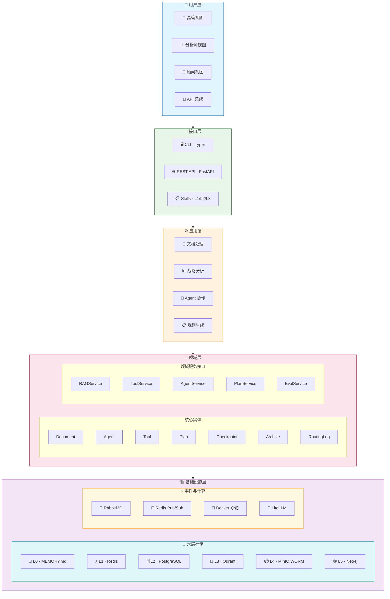

# sisys - AI 战略规划与决策智能平台

[]()
[]()
[]()

> 面向企业高管团队、企业战略与市场体系人员，专业顾问的 **AI 驱动战略规划与决策智能平台**

通过多 Agent 协作（CEO/CFO/CMO/CTO/COO/CHO/AUD 七种专业角色）和内置合规审计（7 年 WORM 存储），帮助企业实现：
**风险识别率 ≥90%** · **溯源时间 <30秒** · **规划周期从数周缩短至数天**

---

## ✨ 核心价值

| 痛点 | 解决方案 | 效果 |
|:---:|:---:|:---:|
| 高管团队协调难 | 多 Agent 辩论，模拟高管团队多视角 | 风险识别率 ≥90% |
| 数据分散决策难 | 统一战略档案库，高保真溯源 | 30 秒内完成溯源 |
| 流程长效率低 | SP → BP 完整链路闭环 | 从数周缩短至数天 |

---

## 🎯 核心功能

### 📊 战略规划（SP）

基于 **BLM（业务领先模型）** 六年阶段，每阶段支持 Checkpoint 机制：

| 阶段 | 主导 Agent | 核心输出 |
|:---|:---:|:---|
| 业绩差距分析 | CFO / COO | 量化报告、根因矩阵 |
| 市场洞察 | CEO / CTO | 趋势报告、情景规划 |
| 战略意图与目标 | CEO / CFO | BSC、战略地图 |
| 创新焦点 | CTO / CEO | 创新路线图 |
| 业务设计 | CEO / CFO | 商业画布 |
| 执行设计 | COO / CFO | KPI、依赖图 |

### 📋 业务计划（BP）

基于 **BEM（业务执行模型）** 六年阶段，严格依赖 SP 输出，通过战略解码器实现结构化映射。

### 🤖 多 Agent 协作

| Agent | 角色 | 核心职责 |
|:---|:---:|:---|
| **CEO** | 首席执行官 | 战略方向、竞争格局、机会识别 |
| **CFO** | 首席财务官 | 财务目标、成本分析、投资评估 |
| **CMO** | 首席营销官 | 市场洞察、客户需求、竞争策略 |
| **CTO** | 首席技术官 | 技术趋势、创新路径、架构设计 |
| **COO** | 首席运营官 | 运营差距、组织能力、执行设计 |
| **CHO** | 首席人力官 | 组织能力、变革管理、人才战略 |
| **AUD** | 联席审计官 | 一致性审计、风险评估、合规把控 |
| **SYS** | 系统调度 | 任务分发与仲裁 |

### 🔍 高保真溯源

每一个战略结论都附带 **Bounding Box 坐标级跳转**，直接定位至原始文档：

```
战略结论：应重点发展高端产品线
│
├── 📄 数据来源
│   └── 2024年年报 · 第15页 · 表格 "产品线营收明细"
│       └── 增长率 = (12.5亿 - 8.3亿) / 8.3亿 = 50.6%
│
└── 🛠️ 分析工具
    └── GE-麦肯锡矩阵 → "增长/利润" 象限
```

**响应时间 <300ms · 定位准确率 ≥95%**

### 🛡️ 合规与审计

- **7 年 WORM 不可变存储** — SOX/ISO27001 合规
- **完整审计追踪** — 所有操作记录可查
- **RBAC 权限控制** — 数据主权隔离
- **L0-L3 四级修正分级** — 自动或人工审批

---

## 🏗️ 技术架构



| 层级 | 技术选型 | 说明 |
|:---|:---|:---|
| **用户层** | 高管/分析师/顾问视图 + API | 三视图架构 |
| **接口层** | CLI + REST API + Skills | Agent 友好接口 |
| **应用层** | 文档/战略分析/Agent协作/规划 | 用例服务 |
| **领域层** | 7 实体 + 5 服务接口 | 六边形核心 |
| **存储** | L0-MEMORY → L5-Neo4j | 六层分级存储 |
| **计算** | RabbitMQ + Docker + LiteLLM | 事件驱动 |

---

## 🚀 快速开始

### 环境要求

```
Python 3.11+     PostgreSQL 15+     Redis 7.0+
Qdrant 1.7+     MinIO             Neo4j 5.x
```

### 安装

```bash
git clone https://github.com/your-org/sisys.git
cd sisys
poetry install
poetry run sisys system doctor
```

### CLI 命令

```bash
# 文档管理
poetry run sisys document upload ./data/年度报告2024.pdf
poetry run sisys document search "市场趋势"

# 战略规划
poetry run sisys plan generate --type sp --input data/

# Agent 协作
poetry run sisys agent run ceo --task "分析Q3业绩差距"

# Checkpoint 管理
poetry run sisys checkpoint list
poetry run sisys checkpoint recover <id> --mode replay
```

### API 接口

```bash
# 启动服务
poetry run uvicorn src.interfaces.api.main:app --reload --port 8000

# 文档上传
curl -X POST http://localhost:8000/api/v1/documents \
  -F "file=@report.pdf"

# 溯源查询
curl "http://localhost:8000/documents/{id}/trace?query=营收增长"
```

---

## 📏 质量指标

| 指标 | 目标 | 指标 | 目标 |
|:---|:---:|:---|:---:|
| 检索延迟 P95 | <500ms | 溯源定位准确率 | ≥95% |
| 多 Agent 辩论风险识别率 | ≥90% | 修正分级准确率 | ≥85% |
| 数据泄露事件 | 0 | 审计日志完整性 | 100% |

---

## 📚 文档

| 文档 | 说明 |
|:---|:---|
| [产品需求文档](./_bmad-output/planning-artifacts/prd.md) | 完整功能需求 |
| [架构设计文档](./_bmad-output/planning-artifacts/architecture.md) | 技术架构与设计 |
| [接口设计规范](./_bmad-output/planning-artifacts/interface-design.md) | API 与 CLI 接口 |
| [开发规范](./docs/developer/) | 开发者指南 |

---

## 📌 版本

**当前版本：** 0.1.0（开发中）

**© 2026 sisys - AI 战略规划与决策智能平台**
