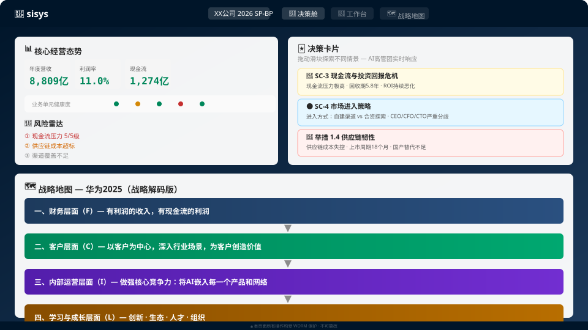
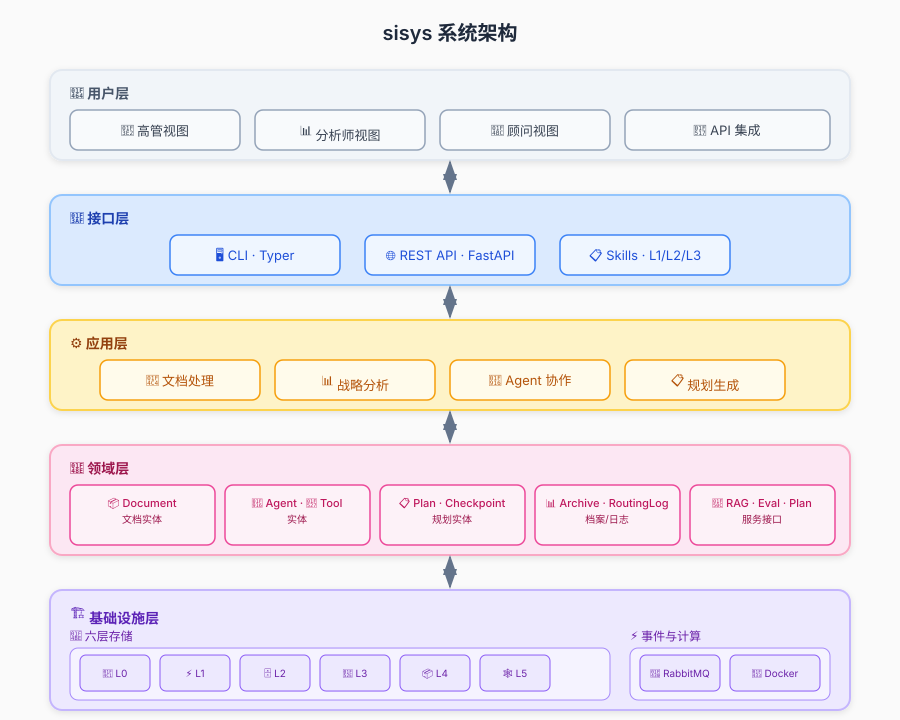

# sisys — 战略管理智能体系统

[](./LICENSE)
[](https://www.python.org/downloads/)
[](./docs/images/architecture.svg)

> **SP 把控方向与节奏，BP 落实推进业务执行。** 面向企业高管、战略体系人员及专业顾问的 AI 驱动战略决策智能平台，打通从规划到执行的「最后一公里」。

通过多 Agent 协作辩论、三重置信度评分体系和高保真溯源，为每一次战略决策提供**可验证、可追溯、可推演**的智能支撑。

---

## ✨ 为什么选择 sisys

企业每年投入数月做战略规划，但 SP 做完锁进抽屉，BP 另起炉灶——方向与执行之间，始终横亘着一条鸿沟。**sisys 要做的事只有一件：填平这条鸿沟。**

| 痛点 | sisys 的做法 | 用户获得的价值 |
|:---|:---|:---|
| **规划与执行断裂** — SP 高高在上，BP 另搞一套 | BLM 六阶段战略规划 + BEM 战略解码引擎，SP 控制点自动映射为 BP 具体举措 | 方向不偏、节奏不乱、执行不落空 |
| **决策依赖个人经验** — 高管时间难协调，多视角难以汇集 | 七角色 Agent 协作辩论（CEO/CFO/CMO/CTO/COO/CHO/AUD），红蓝对抗输出风险全景 | 决策质量提升 40%，风险识别率 ≥90% |
| **战略结论缺乏追溯** — "这个数字从哪来的？" | Bounding Box 坐标级溯源，30 秒内从战略结论跳转至原始文档段落 | 每一个数字都可追溯到源文档的具体行 |
| **工具碎片化** — 数据分散在多个系统，缺乏统一视图 | 三页面驾驶舱：决策舱（态势推演）→ 工作台（深度分析）→ 战略地图（因果链） | 一屏掌控战略全局，无需多系统切换 |

---

## 🎯 核心能力

### 🧭 战略规划与解码闭环（SP→BP）

| 阶段 | 主导 Agent | 核心产出 |
|:---|:---:|:---|
| **市场洞察** | CEO / CTO / CMO | 趋势报告、情景矩阵、竞争格局 |
| **战略意图** | CEO / CFO | BSC 战略地图、战略控制点、里程碑节奏 |
| **业务设计** | CEO / CFO | 价值主张画布、商业模式、盈利模型 |
| **创新焦点** | CTO / CEO | 技术路线图、创新组合矩阵 |
| **战略解码** | COO / CFO | SP 控制点→BP 举措的逐条映射、必赢之战清单 |
| **执行设计** | COO / CFO | KPI 仪表盘、资源部署、依赖图、预警规则 |

> SP 为 BP 锚定方向，BP 向 SP 反馈执行数据，形成持续滚动优化的完整闭环。

### 🔬 三重置信度评分系统

每一项战略结论都携带**独立可量化**的置信度评分：

| 维度 | 评分对象 | 核心含义 |
|:---|:---|:---|
| **SP 分** | 战略方向 | 市场洞察是否充分？战略意图是否明确？ |
| **BP 分** | 解码质量 | SP 控制点→BP 举措映射是否可追溯？解码有无失真？ |
| **EM 分** | 执行可行性 | 资源是否匹配？里程碑是否可验证？风险是否可控？ |

三个分数持续可见，最弱维度自动高亮。四阶段物理仿真动画（流光→光晕→平滑计数→呼吸态）让置信度变化可感知。

### 🤖 多 Agent 协作辩论

| Agent | 角色视角 | 核心竞争力 |
|:---|:---:|:---|
| **CEO** | 战略方向、竞争格局 | 机会识别、资源调配决策 |
| **CFO** | 财务目标、投资评估 | 量化建模、敏感性分析 |
| **CMO** | 市场洞察、客户需求 | 趋势研判、竞争策略推演 |
| **CTO** | 技术趋势、创新路径 | 技术成熟度评估、架构决策 |
| **COO** | 运营差距、组织能力 | 执行可行性、效能诊断 |
| **CHO** | 组织能力、变革管理 | 人才战略、文化适配 |
| **AUD** | 一致性审计、风险评估 | 合规把控、逻辑一致性验证 |

多 Agent 不是简单的角色扮演——每个 Agent 基于独立的领域知识和分析框架进行推理，通过红蓝对抗机制碰撞出风险全景视图。**辩论共识度（强共识 / 弱共识 / 分歧）实时可视化。**

### 🔍 高保真溯源

每一份战略报告、每一个分析结论，都与原始证据紧密耦合：

```
战略结论：应重点发展高端产品线（SP 分 92 / BP 分 85 / EM 分 78）

├── 📄 数据根因
│   └── 2024年年报 · 第15页 · 表格 "产品线营收明细"
│       └── 高端线营收同比增长 50.6%，中低端线下滑 8.3%
│
├── 🛠️ 分析工具链
│   └── GE-麦肯锡矩阵 → 四象限定位 → "增长/利润" 象限
│
└── 💬 Agent 辩论溯源
    └── CEO vs CFO 辩论记录 → 反驳"高端市场饱和"论点
        └── 中信证券 2025 Q1 行业研报 · P34 段落 3
```

**溯源响应 < 300ms · 定位准确率 ≥ 95%**

### 🛡️ 合规内建

- **7 年 WORM 不可变存储** — SOX 404 / ISO 27001 级审计追踪
- **L0–L3 四级修正分级** — 自动化修复 / 专家确认 / 委员会审批
- **数据主权隔离** — 多租户 RBAC，境内数据存储
- **完整操作审计** — 所有 Agent 推理过程可回放、可验证

---

## 🖥️ 三页面驾驶舱

<a href="./_bmad-output/planning-artifacts/ux-design-prototype-v2.1.html">
  
</a>

| 页面 | 定位 | 核心能力 |
|:---|:---|:---|
| 🎯 **决策舱** | 一屏感知战略态势 | 核心 KPI + 风险雷达 + 三重置信度 + AI 代偿引擎（实时策略推荐） + 决策卡片推演 |
| 📐 **工作台** | 深度分析协作 | 七步层次证据树 + 辩论室（Agent 实时博弈） + 解码追溯带（SP↔BP 一键跳转） |
| 🗺️ **战略地图** | 因果链路总览 | BSC 四层瀑布流（财务→客户→内部运营→学习与成长） + 因果箭头 + 折叠展开 |

---

## 🏗️ 技术架构



```
六边形架构（Ports & Adapters）  事件驱动 + 多 Agent 协作
五层存储协同（PG/Redis/Qdrant/MinIO/Neo4j）  Python 3.11+
```

---

## 🚀 快速开始

### 环境

```bash
Python 3.11+  |  PostgreSQL 15+  |  Redis 7.0+  |  Qdrant 1.7+  |  MinIO  |  Neo4j 5.x
```

### 安装

```bash
git clone https://gitea.sisys.local/sisys/sisys.git
cd sisys
poetry install
poetry run sisys system doctor
```

### CLI

```bash
poetry run sisys document upload ./data/年度报告2024.pdf
poetry run sisys document search "市场趋势 Q3"
poetry run sisys plan generate --type sp --input data/
poetry run sisys agent run ceo --task "分析Q3业绩差距"
```

### API

```bash
poetry run uvicorn src.interfaces.api.main:app --reload --port 8000
```

---

## 📏 质量承诺

| 指标 | 目标 | 指标 | 目标 |
|:---|:---:|:---|:---:|
| 检索延迟 P95 | < 500ms | 溯源定位准确率 | ≥ 95% |
| 多 Agent 辩论风险识别率 | ≥ 90% | 修正分级准确率 | ≥ 85% |
| 数据泄露事件 | 0 | 审计日志完整性 | 100% |

---

## 📚 文档

| 文档 | 说明 |
|:---|:---|
| [产品需求文档](./_bmad-output/planning-artifacts/prd.md) | 145 项功能需求 + 45 项非功能需求 |
| [系统架构](./docs/architecture/architecture.md) | 六边形架构 + 事件驱动 + 五层存储 |
| [开发规范](./docs/developer/) | SDD+TDD 融合模式 · Agent 工作流程 |

---

**© 2026 sisys** · 战略管理智能体系统
