# 企业战略规划管理系统架构设计文档

**版本：** 8.3.1
**状态：** 附录独立成章作为主架构文档补充，编号保持不变
**评审日期：** 2026-04-08
**审核依据：** 原来架构文档过于庞大，agimtech 决定将附录单编为[**附录**](arch-appendix.md)

[重要说明]本架构设计包含有部分重要模块的详细设计、项目参考目录树与关键代码实现示例，这类型内容仅供开发参考，执行[EPIC]-[STORY]-[编码]等开发任务时按需调整并及时更新本文档即可！

---

## 文档修订历史

| 版本 | 日期 | 修订内容 | 修订人 |
|------|------|---------|-------|
| 1.0.0 | 2026-02-25 | 初始架构草稿 | 架构团队 |
| 2.0.0 | 2026-02-25 | 基于审核评估补充关键机制 | 架构团队 |
| 3.0.0 | 2026-02-25 | 完整修订版，解决所有 16 项问题 | 架构团队 |
| 3.1.0 | 2026-02-25 | 增加完整详细的目录结构 | 架构团队 |
| 3.2.0 | 2026-02-25 | 宗师级核心领域架构设计（数据处理/工具箱/AGENT/战略规划） | 架构团队 |
| 3.3.0 | 2026-02-25 | 排版修复（统一章节编号，删除重复内容） | 架构团队 |
| 3.4.0 | 2026-02-25 | 关键交互流程完善（64 步完整流程，含 UDMR/EIP/修正/裁决） | 架构团队 |
| 4.0.0 | 2026-02-25 | Party Mode 评审完整版（Step 5-7 完整验证） | 架构团队 |
| 5.0.0 | 2026-02-25 | Party Mode 二轮评审（补充术语表/ADR 模板/测试策略） | 架构团队 |
| 6.0.0 | 2026-02-25 | Party Mode 三轮评审（补充开发环境/Agent 架构/监控指标/架构模式） | 架构团队 |
| 7.0.0 | 2026-02-26 | 合并附录 H~L（多租户/CUSUM/Saga/沙箱/数据库设计） | 架构团队 |
| 8.0.0 | 2026-02-26 | **P0 问题修正**：①辩论终止条件逻辑 bug 修复 ②Checkpoint 实现细节补充 ③分支合并策略完善 | 架构团队 |
| 8.1.0 | 2026-02-26 | **Party Mode 宗师级评审 P0 问题修复**：①辩论终止逻辑边界条件完整修复（第 1 轮增益率计算/空参数列表重复率/超时清理）②两处 DebateEvaluator 实现统一 | 架构团队 |
| 8.2.0 | 2026-02-26 | **重复内容合并**：删除第 17.3.5 节重复的 DebateEvaluator 实现，保留第 7.3 节作为唯一实现，17.3.5 改为描述集成方式 | 架构团队 |
| 8.3.0 | 2026-02-26 | **架构一致性修复**：①领域层零依赖原则修复（HybridRetriever 移至基础设施层）②存储层循环依赖修复（单向依赖链 + 异步缓存更新）③Override 模式同步机制完善（双触发策略 + 惰性同步） | 架构团队 |
| 8.3.1 | 2026-04-08 | 附录独立章节编号不变 | 架构团队 |

---

## 目录

1. [架构概述与设计哲学](#1-架构概述与设计哲学)
2. [架构拓扑图](#2-架构拓扑图)
3. [核心架构决策](#3-核心架构决策)
4. [统一动态模型路由框架 UDMR](#4-统一动态模型路由框架-udmr)
5. [弹性视角隔离协议 EIP](#5-弹性视角隔离协议-eip)
6. [修正分级判定体系](#6-修正分级判定体系)
7. [SYS AGENT 裁决与辩论机制](#7-sys-agent-裁决与辩论机制)
8. [Checkpoint 与 Time-Travel 机制](#8-checkpoint-与-time-travel-机制)
9. [领域实体完整定义](#9-领域实体完整定义)
10. [事件驱动架构设计](#10-事件驱动架构设计)
11. [存储架构设计](#11-存储架构设计)
12. [技术栈详细选型](#12-技术栈详细选型)
13. [完整目录结构参考](#13-完整目录结构参考)
14. [质量属性设计](#14-质量属性设计)
15. [风险缓解措施](#15-风险缓解措施)
16. [产品范围与演进路线](#16-产品范围与演进路线)
17. [核心领域架构设计](#17-核心领域架构设计)
18. [实现模式与一致性规则](#18-实现模式与一致性规则)
19. [架构验证结果](#19-架构验证结果)
20. [架构决策记录 ADR](#20-架构决策记录-ADR)
21. [附录 A：问题追踪清单](#21-附录A-问题追踪清单) - 见[**附录**](arch-appendix.md)，以下同
22. [附录 B：术语表与缩略语](#22-附录B-术语表与缩略语)
23. [附录 C：ADR 标准模板](#23-附录C-ADR标准模板)
24. [附录 D：测试策略](#24-附录D-测试策略)
25. [附录 E：开发环境与工具](#25-附录E-开发环境与工具)
26. [附录 F：工作流监控与运维](#26-附录F-工作流监控与运维)
27. [附录 G：架构模式补充](#27-附录G-架构模式补充)
28. [附录 H：多租户隔离详细设计](#28-附录H-多租户隔离详细设计方案)
29. [附录 I：CUSUM 漂移检测基线与阈值规范](#29-附录I-CUSUM-漂移检测基线与阈值规范)
30. [附录 J：Saga 事务一致性设计方案](#30-附录J-Saga-事务一致性设计方案)
31. [附录 K：Agent 沙箱安全策略设计](#31-附录K-Agent-沙箱安全策略设计文档)
32. [附录 L：数据库 ER 图与表结构设计](#32-附录L-数据库-ER-图与表结构设计)

---

## 1. 架构概述与设计哲学

### 1.1 设计哲学

本系统采用**领域驱动六边形架构**为骨架，以**事件驱动总线**为血液，将复杂战略规划过程解构为**数据密集型管道**与**认知密集型决策**两大异构计算域，并通过**统一编排层**实现双向赋能。

### 1.2 系统公理（核心抽象基础）

本系统基于两个核心抽象作为设计与实现基础，所有架构决策均源自这两条系统公理：

#### 系统公理一：自主调用（Autonomous Invocation）

**定义：** 系统基于 `trigger(事件)→route(路由)→execute(执行)` 的自主调用循环构建

| 阶段 | 触发源 | 路由机制 | 执行环境 | 状态管理 |
|------|--------|---------|---------|---------|
| **trigger** | 领域事件 / 周期性心跳事件 | session_id 哈希 / 语义路由 | - | - |
| **route** | - | UDMR 三层决策（L1 合规→L2 评估→L3 执行） | - | 路由决策日志（WORM 归档） |
| **execute** | - | - | 会话命名空间（Docker/gVisor 沙箱） | 状态快照→Redis（TTL 24h-30d） |

**实现章节：**
- trigger：第 10 章 事件驱动架构设计（10 种领域事件 + 双通道总线）
- route：第 4 章 统一动态模型路由框架（UDMR 三层决策）
- execute：第 8 章 Checkpoint 机制（状态持久化与中断恢复）、第 17.3.2 节 Agent 标准工作流

**验收标准：**
- 路由决策延迟 P95<50ms
- 状态快照序列化至 Redis Hash（支持主从复制与故障转移）
- Checkpoint 双模式恢复（Replay/Override）+ Time-Travel 能力

---

#### 系统公理二：外部化记忆（Externalized Memory）

**定义：** 系统遵循 `LLM 上下文=缓存`、`磁盘记忆=真相源` 的记忆分离原则

| 层级 | 技术选型 | 存储内容 | TTL | 容量规划 | 作用 |
|--------|---------|---------|-----|---------|------|
| **L0 记忆入口层** | 文件系统 | MEMORY.md 索引 + 路由 | 永久 | - | 记忆系统入口 |
| **L1 高速缓存层** | Redis 7.0+ | 会话状态、语义缓存、公共黑板 | 24h-30d | 10GB | 短期记忆缓存 |
| **L2 关系存储层** | PostgreSQL 15+ | 用户/RBAC、审计元数据、业务实体 | 永久 | 100GB | 中期结构化 |
| **L3 向量存储层** | Qdrant 1.7+ | 嵌入向量、混合检索 payload | 永久 | 500GB | 长期语义化 |
| **L4 对象存储层** | MinIO WORM | 原始文档、证据包、审计归档 | 7 年 | 10TB | 历史归档证据 |
| **L5 图存储层(可选)** | Neo4j 5.x | 知识图谱、实体关系、依赖图 | 永久 | 50GB | 按需启用 |

**关键机制：**
- **战略档案库**：第 9 章 StrategicArchive 实体（六层存储协同）
- **上下文压缩**：LLM 上下文仅保留当前任务必需的压缩信息（压缩率≥70%）
- **检索 - 压缩循环**：第 17.1.5 节 混合检索（Dense+Sparse+Graph→RRF 融合→ColBERT 重排序）
- **持久化笔记**：压缩前必须执行持久化（第 8.2.1 节 CheckpointSnapshot 序列化）
- **L0 记忆入口**：MEMORY.md 作为统一入口，索引驱动各层存储访问

**验收标准：**
- 上下文压缩率≥70%
- 检索延迟 P95<800ms（MVP）→<300ms（V2）
- 事件溯源 100% 覆盖 + WORM 存储 7 年归档（SOX/ISO27001 合规）

---

### 1.3 核心架构原则

| 原则 | 描述 | 实现方式 | 验收标准 |
|------|------|---------|---------|
| **领域至上** | 领域层不依赖任何外部技术实现 | 六边形架构 + 依赖倒置 | 领域层零外部依赖 |
| **事件驱动流转** | 核心业务逻辑通过领域事件触发 | RabbitMQ + Redis 双通道 | 事件溯源 100% 覆盖 |
| **双核引擎分离** | Prefect 负责确定性数据流，LangGraph 负责认知推理 | 编排服务协调 | 引擎解耦 |
| **记忆分离** | LLM 上下文=缓存，磁盘记忆=真相源 | 六层存储架构（L0-L5） | 上下文压缩率≥70% |
| **动态模型路由** | 本地优先 80%，云端兜底，成本优化 50% | UDMR 三层决策 | 路由延迟 P95<50ms |
| **弹性隔离** | 四级隔离等级动态调整，合规内建 | EIP 协议 | 隔离切换审计 100% |
| **可追溯决策** | 所有决策可追溯至原始数据和假设 | 事件溯源 + WORM 存储 | 7 年审计追踪 |

#### 六边形架构约束
所有代码必须遵循六边形架构约束：

**领域层零依赖原则**
- 领域层（src/domain/）仅使用 Python 标准库
- 禁止导入：包括且不限于 langgraph, prefect, fastapi, pydantic, sqlalchemy, typer, redis, qdrant, minio, neo4j, aio_pika, litellm, instructor, requests, httpx, docker, psycopg2

**四层架构定义**
| 层次 | 目录 | 职责 |
|------|------|------|
| domain | src/domain/ | 核心业务逻辑，零外部依赖 |
| application | src/application/ | 用例编排 |
| interfaces | src/interfaces/ | 适配器 |
| infrastructure | src/infrastructure/ | 技术实现 |

**依赖方向规则**
- 领域层 → 应用/接口/基础设施层：✗ 禁止
- 应用层 → 接口层/基础设施层：✗ 禁止
- 接口层      → 应用层/领域层 ✓ 允许
- 应用层      → 领域层 ✓ 允许
- 基础设施层  → 应用层/领域层 ✓ 允许
- 领域层      → 仅标准库 ✓ 允许

### 1.4 关键架构指标

| 指标类别 | 指标 | MVP 目标 | V1 目标 | V2 目标 | 测量方式 |
|---------|------|---------|--------|--------|---------|
| **性能** | 检索延迟 P95 | <800ms | <500ms | <300ms | Prometheus |
| | 路由决策延迟 P95 | <100ms | <50ms | <30ms | 链路追踪 |
| | 图遍历查询 P95(简单) | <200ms | <150ms | <100ms | Neo4j 监控 |
| | 图遍历查询 P95(复杂) | <800ms | <600ms | <400ms | Neo4j 监控 |
| **可用性** | 系统可用性 | 99% | 99.5% | 99.9% | Uptime 监控 |
| | 并发 Agent 会话 | 10 | 50 | 200 | 负载测试 |
| **质量** | 修正分级准确率 | ≥80% | ≥85% | ≥90% | 测试集验证 |
| | 路由决策准确率 | ≥85% | ≥90% | ≥95% | 回溯分析 |
| | 幻觉检测准确率 | ≥95% | ≥97% | ≥99% | ShieldCortex |
| **成本** | 本地模型路由占比 | ≥60% | ≥80% | ≥85% | 路由日志 |
| | Token 成本节省 | ≥30% | ≥50% | ≥60% | 成本分析 |
| **接口** | CLI 命令响应延迟 P95 | <1s | <500ms | <200ms | OpenTelemetry |
| | Skills 加载上下文 | <500 tokens | <300 tokens | <200 tokens | 日志分析 |
| | SAP 消息传递延迟 P95 | <500ms | <200ms | <100ms | 链路追踪 |
| | 事件监听处理成功率 | ≥99% | ≥99.5% | ≥99.9% | 事件总线监控 |

### 1.5 CLI+Skills 核心设计原则

**设计哲学：CLI + Skills 为内核，MCP 为外延**（基于行业共识：钉钉/飞书 CLI 化改造 + Claude Code 渐进式披露 + MCP vs CLI benchmark）

| 编号 | 原则 | 描述 | 验收标准 |
|------|------|------|---------|
| **P1** | CLI 是 LLM 的母语 | 系统内部所有能力优先通过 CLI 暴露，Agent 通过 CLI 调用内部工具 | 内部工具 100% 有 CLI 入口 |
| **P2** | Skills = 渐进式披露 | Agent 启动只加载元数据（< 200 tokens），按需加载完整 SOP | Agent 启动上下文 < 500 tokens |
| **P3** | Skill = SOP + Examples | 不仅定义工具签名，还定义操作流程、失败处理、兜底策略 + 1-5 个典型输入示例 | 23 种工具各有完整 SOP + input_examples，工具调用准确率 ≥ 90% |
| **P4** | MCP 退居生态层 | MVP/V1 不启用 MCP，V2+ 按需用于外部 Agent 集成 | MVP 阶段 MCP 代码量 = 0 |
| **P5** | Less scaffolding, more model | 依赖模型自身推理进行工具路由，避免硬编码分类器（SOP 是必要 scaffolding，不违反此原则） | 工具选择准确率 ≥ 85% |
| **P6** | 负向触发条件 | 明确"何时不应触发"Skill，避免误激活 | 误触发率 < 5% |

### 1.6 四层映射架构（DDD + EDA + CLI+Skills 统一）

**解决三层脱节问题：** CLI 命令→应用层用例缺少精确映射、Skills→领域服务关系不明确、领域事件发布与 CLI 响应协调机制缺失

**关键映射规则：**

| 规则 | 描述 | 示例 |
|------|------|------|
| **规则 1** | CLI→用例→领域服务→领域事件完整链路 | `sisys tool run pestel` → CLI 解析 → StrategicAnalysisUseCase → Skill 加载 → ToolService.execute → Tool 聚合根状态变更 → ToolExecuted 事件 |
| **规则 2** | CLI 命令到应用层用例的精确映射 | `sisys document`→DocumentProcessingUseCase / `sisys tool`→StrategicAnalysisUseCase / `sisys agent`→AgentCollaborationUseCase / `sisys plan`→PlanningGenerationUseCase / `sisys system`→SystemOperationsUseCase |
| **规则 3** | Skills 在 DDD 架构中的精确位置 | L1 TOOLS.md（应用层元数据清单，Agent 实例化时加载）→ L2 SKILL.md（应用层操作手册，任务匹配后加载）→ L3 scripts/references（基础设施层资源，按需加载） |
| **规则 4** | CLI 同步响应与事件异步处理协调 | CLI 响应不阻塞下游事件处理；`--wait-for-events` 参数可选等待特定事件完成（超时默认 30 秒，V1 可选增强，MVP 不实现） |
| **规则 5** | 系统公理一与 CLI 的关系 | CLI 是"点火开关"（外部触发器），领域事件是"引擎血液"（内部触发器），auto-trigger→auto-route→auto-execute 是"引擎运转逻辑" |

**CLI 是"点火开关"，领域事件是"引擎血液"，auto-trigger→auto-route→auto-execute 是"引擎运转逻辑"。**

---

## 2. 架构拓扑图

```mermaid
graph TB
    %% ========== 外部系统 ==========
    subgraph "外部系统"
        LLM_Cloud["云端 LLM API<br/>Qwen/Claude/GPT-4"]
        LLM_Local["本地 LLM<br/>Ollama+Qwen2.5"]
        VectorDB["向量数据库<br/>Qdrant 1.7+"]
        FileStorage["对象存储<br/>MinIO WORM"]
    end

    %% ========== 接口层 ==========
    subgraph "接口层 (Interfaces)"
        CLI["CLI 接口<br/>typer 0.24+"]
        API["REST API<br/>FastAPI 0.104+"]
        API_GW["API Gateway<br/>Kong/Traefik"]
        EventListener["事件监听器<br/>RabbitMQ+aio-pika"]
    end

    %% ========== 应用层 ==========
    subgraph "应用层 (Application)"
        subgraph "用例服务"
            DocUC["文档处理用例"]
            ToolUC["工具箱用例"]
            AgentUC["Agent 协作用例"]
            PlanningUC["规划生成用例"]
            RoutingUC["路由决策用例"]
            IsolationUC["隔离管理用例"]
        end

        subgraph "Skills 操作手册"
            SkillsL1["L1: TOOLS.md<br/>元数据清单 <200t"]
            SkillsL2["L2: SKILL.md × 23<br/>SOP <500 行"]
            SkillsL3["L3: scripts/references<br/>按需资源"]
        end

        subgraph "核心服务"
            Orchestrator["编排协调器<br/>协调 Prefect+LangGraph"]
            UDMR_Service["UDMR 路由服务<br/>L1+L2+L3 三层决策"]
            EIP_Manager["EIP 隔离管理器<br/>四级隔离等级控制"]
            CorrectionJudge["修正分级判定器<br/>五维加权算法"]
            SYSArbiter["SYS AGENT 裁决器<br/>五维评分状态机"]
            DebateEvaluator["辩论质量评估器<br/>增益率 + 重复率检测"]
            SemanticCache["语义缓存服务<br/>相似度>0.9 命中"]
        end

        subgraph "处理器"
            CmdHandler["命令处理器<br/>CQRS 命令侧"]
            QueryHandler["查询处理器<br/>CQRS 查询侧"]
            EventHandler["事件处理器<br/>事件溯源"]
        end
    end

    %% ========== 领域层 ==========
    subgraph "领域层 (Domain)"
        subgraph "核心实体"
            Document["文档实体<br/>17 种格式支持"]
            Agent["Agent 实体<br/>7 角色+SYS+AUD"]
            Tool["工具实体<br/>23 种战略工具"]
            StrategicPlan["战略规划实体<br/>SP/BP"]
            Checkpoint["检查点实体<br/>双模式恢复"]
            StrategicArchive["战略档案实体<br/>六层存储"]
            RoutingLog["路由决策日志<br/>UDMR 审计"]
            IsolationLog["隔离切换日志<br/>EIP 审计"]
        end

        subgraph "领域服务接口"
            RAGService["RAG 服务接口<br/>Dense+Sparse+Graph"]
            ToolService["工具箱服务接口<br/>CLI+Skills"]
            AgentService["Agent 服务接口<br/>EIP 执行"]
            PlanningService["规划服务接口<br/>BLM/BEM 状态机"]
            RoutingService["路由服务接口<br/>UDMR 执行"]
            EvaluationService["评估服务接口<br/>五维评估"]
        end

        subgraph "领域事件"
            DocProcessed["文档处理完成事件"]
            ToolExecuted["工具执行完成事件"]
            AgentDecided["Agent 决策完成事件"]
            CheckpointReached["检查点到达事件"]
            RoutingDecided["路由决策事件"]
            IsolationSwitched["隔离等级切换事件"]
            CorrectionClassified["修正分级事件"]
            ArbitrationCompleted["裁决完成事件"]
            StrategicDeviationWarning["战略偏差预警事件"]
            HeartbeatTriggered["心跳唤醒事件"]
            CheckpointRecovered["Checkpoint 恢复事件"]
        end

        subgraph "仓储接口"
            DocRepo["文档仓储接口"]
            AgentRepo["Agent 仓储接口"]
            ToolRepo["工具仓储接口"]
            PlanRepo["规划仓储接口"]
            RoutingLogRepo["路由日志仓储接口"]
            IsolationLogRepo["隔离日志仓储接口"]
        end
    end

    %% ========== 基础设施层 ==========
    subgraph "基础设施层 (Infrastructure)"
        subgraph "工作流引擎 (Prefect)"
            PrefectEngine["Prefect 引擎包装器<br/>3.6+"]
            DocFlow["文档处理流程"]
            RAGFlow["RAG 索引流程"]
            ReportFlow["报告生成流程"]
        end

        subgraph "Agent 编排引擎 (LangGraph)"
            LangGraphEngine["LangGraph 引擎包装器<br/>1.0+"]
            AgentGraph["Agent 协作图"]
            BLMGraph["BLM 规划图<br/>六阶段状态机"]
            BEMGraph["BEM 规划图<br/>六阶段状态机"]
        end

        subgraph "消息总线"
            Redis_PubSub["Redis 发布/订阅<br/>实时事件通道"]
            RabbitMQ["RabbitMQ 3.12+<br/>持久化事件通道"]
            Outbox["事务发件箱<br/>PostgreSQL event_outbox"]
            DLQ["死信队列<br/>失败事件处理"]
            Consumer["事件消费者<br/>Event Consumer"]
            EventBus["事件总线<br/>Event Bus"]
        end

        subgraph "六层存储架构"
            Cache_Storage["高速缓存层<br/>Redis 7.0+"]
            Relational_Storage["关系存储层<br/>PostgreSQL 15+"]
            Vector_Storage["向量存储层<br/>Qdrant 1.7+"]
            Object_Storage["对象存储层<br/>MinIO WORM"]
            Graph_Storage["图存储层<br/>Neo4j 5.x"]
        end

        subgraph "外部适配器"
            LLM_Router["LLM 动态路由器<br/>LiteLLM+UDMR"]
            EmbeddingAdapter["嵌入适配器<br/>BGE-M3"]
            StorageAdapter["存储适配器<br/>S3 兼容"]
            SandboxAdapter["沙箱适配器<br/>Docker/gVisor"]
        end

    end

    %% ========== 关键交互流程 ==========

    %% 流程 1-5: 用户发起文档处理（基础流程）
    CLI -- "1. upload --file docs.zip" --> DocUC
    DocUC -- "2. ProcessDocumentsCommand" --> CmdHandler
    CmdHandler -- "3. 调用领域服务" --> RAGService
    RAGService -- "4. 通过仓储接口" --> DocRepo
    DocRepo -- "5. 基础设施实现" --> Relational_Storage

    %% 流程 6-10: 编排服务协调 Prefect 工作流
    DocUC -- "6. 调用编排服务" --> Orchestrator
    Orchestrator -- "7. 调用 Prefect 引擎" --> PrefectEngine
    PrefectEngine -- "8. 执行文档处理流程" --> DocFlow
    DocFlow -- "9. 调用外部适配器" --> StorageAdapter
    StorageAdapter -- "10. 写入文件存储" --> Object_Storage

    %% 流程 11-15: 事件驱动处理完成（增强可靠性）
    DocFlow -- "11. 完成事件" --> Producer
    Producer -- "12. 写入事务发件箱" --> Outbox
    Outbox -- "13. 轮询发布" --> RabbitMQ
    RabbitMQ -- "14. 事件消息" --> Consumer
    Consumer -- "15. 事件处理器" --> EventHandler
    EventHandler -- "15b. 触发下一步处理" --> ToolUC

    %% 流程 16-21: Agent 协作分析（含 UDMR 路由）
    AgentUC -- "16. 任务提交" --> UDMR_Service
    UDMR_Service -- "17. L1 合规性检查" --> UDMR_Service
    UDMR_Service -- "18. L2 复杂度评估" --> UDMR_Service
    UDMR_Service -- "19. L3 路由决策" --> UDMR_Service
    UDMR_Service -- "20. 路由决策日志" --> RoutingLog
    UDMR_Service -- "21. 路由执行" --> LLM_Router
    LLM_Router -- "22a. 本地路由 (80%)" --> LLM_Local
    LLM_Router -- "22b. 云端路由 (20%)" --> LLM_Cloud

    %% 流程 23-27: 战略规划生成（含 Checkpoint）
    PlanningUC -- "23. 调用编排服务" --> Orchestrator
    Orchestrator -- "24. 协调 Prefect+LangGraph" --> LangGraphEngine
    LangGraphEngine -- "25. 执行 BLM 状态机" --> BLMGraph
    BLMGraph -- "26. Checkpoint 到达" --> Producer
    Producer -- "27. Checkpoint 事件" --> Outbox
    Outbox -- "28. 等待用户反馈" --> EventListener
    EventListener -- "29. 恢复执行" --> PlanningUC

    %% 流程 30-34: RAG 混合检索流程（增强）
    QueryHandler -- "30. 检索请求" --> RAGService
    RAGService -- "31. Dense 检索" --> Vector_Storage
    RAGService -- "32. Sparse 检索" --> Vector_Storage
    RAGService -- "33. Graph 检索" --> Graph_Storage
    RAGService -- "34. RRF 融合+ 重排序" --> QueryHandler

    %% 流程 35-38: 结果生成与六层存储协同
    PlanningUC -- "35. 生成 PDF 报告" --> PrefectEngine
    PrefectEngine -- "36. 执行报告生成流程" --> ReportFlow
    ReportFlow -- "37. 元数据保存" --> Relational_Storage
    ReportFlow -- "38. 证据包保存" --> Object_Storage

    %% 流程 39-43: EIP 隔离管理流程
    AgentUC -- "39. 协作请求" --> EIP_Manager
    EIP_Manager -- "40. 隔离等级判定" --> EIP_Manager
    EIP_Manager -- "41. 隔离切换日志" --> IsolationLog
    EIP_Manager -- "42. 隔离执行" --> AgentService
    EIP_Manager -- "43. 发布切换事件" --> Redis_PubSub

    %% 流程 44-47: 修正分级判定流程
    PlanningUC -- "44. 修正提交" --> CorrectionJudge
    CorrectionJudge -- "45. 五维特征评估" --> CorrectionJudge
    CorrectionJudge -- "46. 分级判定 (L0-L3)" --> CorrectionJudge
    CorrectionJudge -- "47a. L0/L1 自动固化" --> PlanningUC
    CorrectionJudge -- "47b. L2 专家确认" --> PlanningUC
    CorrectionJudge -- "47c. L3 委员会审批" --> PlanningUC

    %% 流程 48-51: SYS AGENT 裁决流程
    AgentUC -- "48. 仲裁请求" --> SYSArbiter
    SYSArbiter -- "49. 五维评分" --> SYSArbiter
    SYSArbiter -- "50. 置信度评估" --> SYSArbiter
    SYSArbiter -- "51a. 高置信度裁决" --> AgentUC
    SYSArbiter -- "51b. 低置信度升级" --> PlanningUC

    %% 流程 52-55: 双通道事件总线
    Redis_PubSub -- "52. 实时事件" --> EventListener
    RabbitMQ -- "53. 持久化事件" --> Outbox
    Outbox -- "54. 轮询发布" --> RabbitMQ
    RabbitMQ -- "55. 死信事件" --> DLQ

    %% 流程 56-61: 六层存储协同（单向依赖链 + 异步缓存更新）
    Cache_Storage -. "56. 会话状态" .-> Relational_Storage
    Relational_Storage -. "57. 元数据引用" .-> Vector_Storage
    Vector_Storage -. "58. 嵌入向量 payload" .-> Object_Storage
    Object_Storage -. "59. 原始文档" .-> Graph_Storage
    Graph_Storage -. "60. 图遍历结果 (异步事件)" .-> EventBus
    EventBus -. "61. 缓存更新事件" .-> Cache_Storage

    %% 流程 62-65: 性能监控与 CUSUM 漂移检测
    PrefectEngine -- "62. 工作流监控事件" --> EventBus
    LangGraphEngine -- "63. Agent 决策监控事件" --> EventBus
    EventBus -- "64. 聚合到监控系统" --> Producer
    EventBus -- "65. CUSUM 漂移检测" --> Producer
```



**六层存储依赖说明**：
- ✅ **单向依赖链**：Cache → Relational → Vector → Object → Graph（无循环）
- ✅ **异步缓存更新**：Graph 存储通过事件总线异步更新缓存，打破循环依赖
- ✅ **流程 60**：Graph 存储的图遍历结果通过事件总线发布，不直接依赖 Cache
- ✅ **流程 61**：缓存监听器订阅事件总线的缓存更新事件，异步刷新 Cache

---

## 3. 核心架构决策

### 3.1 决策 1 (ADR-001): 六边形架构 (DDD)

**决策内容：** 采用领域驱动六边形架构作为核心架构哲学

| 方案 | 优点 | 缺点 | 评分 |
|------|------|------|------|
| **六边形架构** | 领域逻辑隔离、技术栈独立演进、测试友好 | 初期复杂度高 | ✅ 9/10 |
| 分层架构 | 简单直观 | 领域逻辑泄露、演进困难 | 6/10 |
| 微服务架构 | 独立部署 | 运维复杂度高、不适合 MVP | 5/10 |

**决策理由：**
1. 企业战略规划系统核心复杂度在于领域逻辑（BLM/BEM 模型、23 种战略工具、7 类 Agent 角色）
2. 需要满足 SOX/ISO27001 合规要求，领域逻辑必须与技术实现隔离
3. 支持长期演进，技术栈可独立替换

---

### 3.2 决策 2 (ADR-002): 双核引擎架构 (Prefect + LangGraph)

**决策内容：** Prefect 负责确定性数据管道，LangGraph 负责 Agent 认知推理

**协调机制：**
```python
class OrchestrationService:
    async def coordinate(self, task: Task) -> Result:
        if task.is_data_pipeline():
            return await self.prefect_engine.execute(task)
        elif task.is_agent_reasoning():
            return await self.langgraph_engine.execute(task)
        else:
            data_result = await self.prefect_engine.execute(task.data_part)
            return await self.langgraph_engine.execute(task.reasoning_part, context=data_result)
```

---

### 3.3 决策 3 (ADR-003): 双通道事件总线 (Redis + RabbitMQ)

**决策内容：** Redis 发布/订阅用于实时事件，RabbitMQ 用于持久化事件 + 事务发件箱保证可靠性

| 事件类型 | 通道 | 理由 |
|---------|------|------|
| 实时通知型 | Redis 发布/订阅 | 低延迟、允许丢失 |
| 业务状态型 | RabbitMQ + Outbox | 可靠性要求高 |
| 审计事件型 | RabbitMQ + WORM 归档 | 合规要求 7 年存储 |

---

### 3.4 决策 4 (ADR-004): 六层存储架构

| 层级 | 技术选型 | 存储内容 | TTL | 容量规划 | 作用 |
|------|---------|---------|-----|---------|------|
| **L0 记忆入口层** | 文件系统 | MEMORY.md 索引 + 路由 | 永久 | - | 记忆系统入口 |
| **L1 高速缓存层** | Redis 7.0+ | 会话状态、语义缓存、公共黑板 | 24h-30d | 10GB | 短期记忆缓存 |
| **L2 关系存储层** | PostgreSQL 15+ | 用户/RBAC、审计元数据、业务实体 | 永久 | 100GB | 中期结构化 |
| **L3 向量存储层** | Qdrant 1.7+ | 嵌入向量、混合检索 payload | 永久 | 500GB | 长期语义化 |
| **L4 对象存储层** | MinIO WORM | 原始文档、证据包、审计归档 | 7 年 (WORM) | 10TB | 历史归档证据 |
| **L5 图存储层(可选)** | Neo4j 5.x | 知识图谱、实体关系、依赖图 | 永久 | 50GB | 按需启用 |

---

### 3.5 决策 5 (ADR-010): API Gateway

**决策内容：** 采用 Kong/Traefik 作为 API Gateway，统一入口管理

**功能要求：**
- 统一认证（OAuth 2.1/JWT）
- 限流（令牌桶算法）
- 路由（基于路径/方法/角色）
- 安全控制（请求验证/注入检测）

---

### 3.6 决策 6 (ADR-011): 配置中心

**决策内容：** 采用环境变量 + PostgreSQL 配置表的混合方案

**配置分层：**
- 静态配置：环境变量（.env 文件）
- 动态配置：PostgreSQL config 表（支持热更新）
- 敏感配置：加密存储（AES-256）

---

## 4. 统一动态模型路由框架 UDMR

### 4.1 架构概述

UDMR（Unified Dynamic Model Routing）是实现**本地路由占比 80%、成本节省 50%** 目标的核心机制。采用三层决策架构，路由决策延迟 P95<50ms。

```
┌─────────────────────────────────────────────────────────────┐
│                    UDMR 三层决策架构                          │
├─────────────────────────────────────────────────────────────┤
│  L1 合规性网关 (Compliance Gateway)                          │
│  - 敏感数据检查 (PII/商业秘密)                                │
│  - 数据驻留限制 (境内/跨境)                                   │
│  - 白名单校验 (允许的模型列表)                                 │
│  输出：允许/拒绝 + 拒绝原因                                  │
│                          ▼                                   │
│  L2 任务复杂度评估器 (Complexity Assessor)                   │
│  - 语义匹配度 (35%)                                          │
│  - 历史成功率 (30%)                                          │
│  - 成本效率 (20%)                                            │
│  - 任务复杂度 (15%)                                          │
│  输出：各候选模型综合评分                                    │
│                          ▼                                   │
│  L3 路由决策执行器 (Router Executor)                         │
│  - 云模型优势阈值：0.15                                       │
│  - 本地质量阈值：0.70                                         │
│  - 输出：选定模型 + 预估成本 + 路由延迟                       │
└─────────────────────────────────────────────────────────────┘
```

### 4.2 L1 合规性网关实现

```python
class ComplianceGateway:
    async def check(self, task: Task) -> ComplianceResult:
        # 1. 敏感数据检查
        sensitive_data = await self.detect_sensitive_data(task.input)
        if sensitive_data.contains_pii or sensitive_data.contains_trade_secret:
            return ComplianceResult(allowed=False, reason="包含敏感数据", forced_local=True)

        # 2. 数据驻留检查
        if task.data_residency == "CHINA_DOMESTIC":
            if not self.is_china_model(task.preferred_model):
                return ComplianceResult(allowed=False, reason="数据境内存储要求", forced_local=True)

        # 3. 白名单校验
        if task.preferred_model not in self.allowed_models:
            return ComplianceResult(allowed=False, reason="模型不在白名单中")

        return ComplianceResult(allowed=True)
```

### 4.3 L2 任务复杂度评估器实现

```python
class ComplexityAssessor:
    WEIGHTS = {
        "semantic_match": 0.35,
        "historical_success": 0.30,
        "cost_efficiency": 0.20,
        "task_complexity": 0.15
    }

    async def assess(self, task: Task, candidate_models: List[Model]) -> List[ModelScore]:
        results = []
        for model in candidate_models:
            semantic_score = cosine_similarity(task_embedding, model_embedding)
            historical_score = await self.get_historical_success_rate(model.id, task.type)
            cost_score = 1.0 / (model.cost_per_1k_tokens + 0.001)
            complexity_score = self.calculate_task_complexity(task)

            total_score = (
                semantic_score * self.WEIGHTS["semantic_match"] +
                historical_score * self.WEIGHTS["historical_success"] +
                cost_score * self.WEIGHTS["cost_efficiency"] +
                complexity_score * self.WEIGHTS["task_complexity"]
            )
            results.append(ModelScore(model=model, total_score=total_score))

        return sorted(results, key=lambda x: x.total_score, reverse=True)
```

### 4.4 L3 路由决策执行器实现

```python
class RouterExecutor:
    CLOUD_ADVANTAGE_THRESHOLD = 0.15
    LOCAL_QUALITY_THRESHOLD = 0.70

    async def decide(self, scored_models: List[ModelScore]) -> RoutingDecision:
        local_models = [m for m in scored_models if m.model.is_local]
        cloud_models = [m for m in scored_models if not m.model.is_local]

        best_local = max(local_models, key=lambda x: x.total_score) if local_models else None
        best_cloud = max(cloud_models, key=lambda x: x.total_score) if cloud_models else None

        if best_local is None:
            return self._create_decision(best_cloud, "no_local_model")
        if best_cloud is None:
            return self._create_decision(best_local, "no_cloud_model")
        if best_local.total_score < self.LOCAL_QUALITY_THRESHOLD:
            return self._create_decision(best_cloud, "local_quality_below_threshold")

        cloud_advantage = best_cloud.total_score - best_local.total_score
        if cloud_advantage > self.CLOUD_ADVANTAGE_THRESHOLD:
            return self._create_decision(best_cloud, "cloud_advantage")
        else:
            return self._create_decision(best_local, "local_priority")
```

### 4.5 路由决策日志实体

```python
class RoutingDecisionLog:
    id: UUID
    task_id: UUID
    timestamp: datetime
    l1_compliance_result: ComplianceResult
    l2_scores: List[ModelScore]
    l3_decision: RoutingDecision
    estimated_cost: Decimal
    actual_cost: Decimal
    routing_latency_ms: int
    status: str
    worm_storage_ref: str  # WORM 存储引用（7 年归档）
```

---

## 5. 弹性视角隔离协议 EIP

### 5.1 四级隔离等级

| 等级 | 名称 | Prompt 隔离 | 工具隔离 | 数据隔离 | 适用场景 |
|------|------|-----------|---------|---------|---------|
| **L4** | 硬隔离 | 独立 | 严格隔离 | 只读 | 默认状态 |
| **L3** | 软隔离 | 独立 | 共享工具 | 受限写入 | 有限协作 |
| **L2** | 协作态 | 独立身份 | 共享工具池 | 自由写入 | 联合分析 |
| **L1** | 融合态 | 共享上下文 | 完全共享 | 完全共享 | 紧急状态 |

### 5.2 触发条件

| 触发类型 | 条件 | 升降级方向 |
|---------|------|-----------|
| SYS AGENT 命令 | 显式指令 | 直接指定 |
| 关键词频率 | 跨角色>5% | 降级 (更严格) |
| 任务依赖 | 权重>0.7 | 升级 (更宽松) |
| 用户请求 | 显式请求 | 直接指定 |

### 5.3 自动恢复机制

- L2 协作态任务完成后，**30 分钟无活动自动恢复至 L4**
- 所有隔离切换自动记录至 `IsolationSwitchLog` 并归档至 WORM 存储

---

## 6. 修正分级判定体系

### 6.1 五维特征加权算法

| 特征 | 权重 | 评分标准 |
|------|------|---------|
| **修正类型** | 30% | L0 拼写 (1.0) / L1 参数 (0.7) / L2 约束 (0.4) / L3 假设 (0.1) |
| **置信度变化** | 25% | Δ≥0 (1.0) / -0.1≤Δ<0 (0.6) / Δ<-0.1 (0.2) |
| **影响范围** | 20% | ≤1 任务 (1.0) / 2-3 任务 (0.5) / >3 任务 (0.2) |
| **可逆性** | 15% | 完全可逆 (1.0) / 部分可逆 (0.6) / 不可逆 (0.2) |
| **领域关键度** | 10% | 非核心 (1.0) / 次核心 (0.6) / 核心战略 (0.3) |

阈值设定依据：
- 阈值校准方法：基于历史修正数据 ROC 曲线分析
- 目标平衡点：误判率<5% vs 人工干预率<30%
- 校准周期：每季度回溯优化一次

### 6.2 级别映射

```
综合得分 = Σ(特征得分 × 权重)

得分≥0.85 → L0 自动固化
0.75≤得分<0.85 → L1 自动固化
0.60≤得分<0.75 → L2 专家确认 (1 人，4 小时 SLA)
得分<0.60 → L3 委员会审批 (≥3 人，48 小时 SLA)
```

---

## 7. SYS AGENT 裁决与辩论机制

### 7.1 裁决五维评分标准

| 维度 | 权重 | 评分项 (1-5 分) |
|------|------|---------------|
| **事实准确性** | 35% | 文档切片引用质量、数值可验证性、引用源权威性 |
| **逻辑一致性** | 25% | BLM/BEM 符合度、内部无矛盾、因果链完整 |
| **风险可控性** | 20% | 最坏情况损失、风险缓解措施、可逆性 |
| **资源可行性** | 15% | 资源匹配度、关键依赖可用性 |
| **战略对齐度** | 5% | 与上期 SP 核心战略方向一致性 |

### 7.2 置信度处理

| 置信度 | 处理方式 |
|--------|---------|
| ≥0.6 | 自动执行裁决 |
| 0.4-0.6 | 标记"低置信度"，建议人工复核 |
| <0.4 | 强制升级人工仲裁 |

### 7.3 辩论质量评估器

```python
class DebateEvaluator:
    GAIN_THRESHOLD = 0.10       # 增益率<10% 强制终止
    REPETITION_THRESHOLD = 0.50 # 重复率>50% 强制终止
    MAX_ROUNDS = 5              # 最大辩论轮次（硬约束）
    ROUND_TIMEOUT = 30          # 单轮超时（秒）

    async def evaluate_round(self, round_data: DebateRound) -> DebateEvaluation:
        """
        评估单轮辩论质量

        边界条件处理：
        - 第 1 轮辩论：previous_info 为空，gain_rate 默认为 1.0（100% 新信息）
        - 空参数列表：repetition_rate 默认为 0.0
        - 超时检查：独立于质量评估，优先判断
        """
        # 1. 计算新信息增益率（处理第 1 轮边界条件）
        new_info = round_data.new_information
        previous_info = round_data.previous_information
        if len(previous_info) == 0:
            gain_rate = 1.0  # 第 1 轮默认增益率为 1（100% 新信息）
        else:
            gain_rate = len(new_info) / (len(previous_info) + 1)

        # 2. 计算重复率（处理空参数列表边界条件）
        repeated_content = self.find_repeated_content(round_data.arguments)
        if not round_data.arguments:
            repetition_rate = 0.0  # 空参数列表重复率为 0
        else:
            repetition_rate = len(repeated_content) / len(round_data.arguments)

        # 3. 超时检查（优先级最高，独立于质量评估）
        if round_data.elapsed_time > self.ROUND_TIMEOUT:
            return DebateEvaluation(
                gain_rate=gain_rate,
                repetition_rate=repetition_rate,
                should_terminate=True,
                termination_reason="单轮超时",
                elapsed_time=round_data.elapsed_time,
                timeout_threshold=self.ROUND_TIMEOUT
            )

        # 4. 判定是否终止（优先级：轮次 > 增益 > 重复）
        should_terminate = False
        termination_reason = "未终止"

        if round_data.round_number >= self.MAX_ROUNDS:
            should_terminate = True
            termination_reason = "达到最大辩论轮次"
        elif gain_rate < self.GAIN_THRESHOLD:
            should_terminate = True
            termination_reason = "增益率低于阈值（新信息不足）"
        elif repetition_rate > self.REPETITION_THRESHOLD:
            should_terminate = True
            termination_reason = "重复率高于阈值（论点重复）"

        return DebateEvaluation(
            gain_rate=gain_rate,
            repetition_rate=repetition_rate,
            should_terminate=should_terminate,
            termination_reason=termination_reason,
            reason=f"增益率{gain_rate:.2%}, 重复率{repetition_rate:.2%}, 轮次{round_data.round_number}/{self.MAX_ROUNDS}"
        )

    def _get_termination_reason(
        self,
        gain_rate: float,
        repetition_rate: float,
        round_number: int
    ) -> str:
        """获取终止原因（辅助方法，用于日志记录）"""
        if round_number >= self.MAX_ROUNDS:
            return "达到最大辩论轮次"
        if gain_rate < self.GAIN_THRESHOLD:
            return "增益率低于阈值（新信息不足）"
        if repetition_rate > self.REPETITION_THRESHOLD:
            return "重复率高于阈值（论点重复）"
        return "未终止"

    async def cleanup_on_timeout(self, round_data: DebateRound) -> TimeoutCleanupResult:
        """
        超时状态清理

        清理内容：
        - 释放 Agent 资源（取消 LLM 调用）
        - 记录超时日志（用于审计和优化）
        - 清理临时状态（工作记忆、上下文）
        """
        # 1. 取消所有进行中的 LLM 调用
        for agent_id in round_data.active_agents:
            await self.llm_client.cancel_request(agent_id)

        # 2. 记录超时日志
        timeout_log = TimeoutLog(
            round_id=round_data.id,
            round_number=round_data.round_number,
            elapsed_time=round_data.elapsed_time,
            timeout_threshold=self.ROUND_TIMEOUT,
            active_agents=round_data.active_agents,
            timestamp=datetime.now()
        )
        await self.timeout_log_repo.save(timeout_log)

        # 3. 清理临时状态
        await self.session_cache.delete(f"debate:{round_data.id}:working_memory")

        return TimeoutCleanupResult(
            success=True,
            cleaned_agents=round_data.active_agents,
            cleanup_time_ms=time.time() - start_time
        )
```

**补充说明：**
- ✅ **修正逻辑 bug**：`and` → `or`，任一条件满足即终止
- ✅ **新增硬约束**：`MAX_ROUNDS=5` 防止无限辩论
- ✅ **新增超时约束**：`ROUND_TIMEOUT=30s` 防止长尾延迟
- ✅ **新增终止原因追踪**：便于审计和优化
- ✅ **修复 P0 边界条件漏洞**：
  - 第 1 轮辩论 `previous_info` 为空时，`gain_rate` 默认为 1.0
  - 空参数列表时，`repetition_rate` 默认为 0.0
  - 超时检查优先级最高，独立于质量评估
  - 新增 `cleanup_on_timeout` 方法处理超时状态清理

---

## 8. Checkpoint 与 Time-Travel 机制

### 8.1 Checkpoint 双模式恢复

| 模式 | 适用条件 | 一致性 | 执行延迟 | 成本 |
|------|---------|--------|---------|------|
| **Replay** | 影响≥2 个后续 Checkpoint | 强一致性 | 高 | 高 |
| **Override** | 影响<2 个后续 Checkpoint | 需人工确认 | 低 | 低 |

### 8.2 Checkpoint 实现细节

#### 8.2.1 状态快照序列化格式

```python
class CheckpointSnapshot:
    """检查点状态快照 - 遵循系统公理二（外部化记忆）"""
    checkpoint_id: UUID
    stage_id: str              # BLM/BEM 阶段标识
    stage_number: int          # 阶段序号
    timestamp: datetime
    state_version: str         # 快照版本号

    # 核心状态数据
    state_data: Dict[str, Any]       # 业务状态变量
    context_window: List[Message]    # LLM 上下文窗口（已压缩，~2K tokens）
    working_memory: Dict[str, Any]   # 工作记忆（关键变量）
    tool_outputs: List[ToolResult]   # 工具执行结果

    # 元数据
    metadata: SnapshotMetadata
    checksum: str                    # SHA-256 校验和
    persistent_note_ref: Optional[UUID]  # 关联的持久化笔记引用（压缩前必须持久化）

    def serialize(self) -> bytes:
        """
        序列化为字节流（用于 Redis 存储）

        前置条件：
        1. 已执行持久化笔记步骤（persistent_note_ref 不为空）
        2. context_window 已压缩（压缩率≥70%）
        3. 质量评分≥0.7
        """
        # 验证持久化已完成（系统公理二：压缩前必须持久化）
        if not self.persistent_note_ref:
            raise SnapshotError("序列化前必须执行持久化笔记步骤")

        return msgpack.packb({
            'checkpoint_id': str(self.checkpoint_id),
            'stage_id': self.stage_id,
            'state_data': self.state_data,
            'context_window': [m.dict() for m in self.context_window],
            'working_memory': self.working_memory,
            'tool_outputs': [t.dict() for t in self.tool_outputs],
            'metadata': self.metadata.dict(),
            'checksum': self.checksum,
            'persistent_note_ref': str(self.persistent_note_ref)  # 持久化笔记引用
        }, use_bin_type=True)

    @classmethod
    def deserialize(cls, data: bytes) -> 'CheckpointSnapshot':
        """从字节流反序列化"""
        obj = msgpack.unpackb(data, raw=False)
        return cls(
            checkpoint_id=UUID(obj['checkpoint_id']),
            stage_id=obj['stage_id'],
            state_data=obj['state_data'],
            context_window=[Message(**m) for m in obj['context_window']],
            working_memory=obj['working_memory'],
            tool_outputs=[ToolResult(**t) for t in obj['tool_outputs']],
            metadata=SnapshotMetadata(**obj['metadata']),
            checksum=obj['checksum'],
            persistent_note_ref=UUID(obj['persistent_note_ref']) if obj.get('persistent_note_ref') else None
        )

    async def create_with_persistent_note(
        cls,
        checkpoint_id: UUID,
        stage_id: str,
        state_data: Dict[str, Any],
        raw_context: List[Message],  # 原始上下文（未压缩）
        working_memory: Dict[str, Any],
        tool_outputs: List[ToolResult],
        query: str,
        user_id: str,
        session_id: str
    ) -> 'CheckpointSnapshot':
        """
        工厂方法：创建 CheckpointSnapshot 并执行持久化笔记步骤

        流程：
        1. 持久化笔记（提取实体→生成摘要→记录血缘）
        2. 压缩上下文（基于持久化笔记）
        3. 验证压缩质量
        4. 创建快照

        遵循系统公理二：压缩前必须持久化
        """
        # 步骤 1：持久化笔记（压缩前必须执行）
        note_taker = PersistentNoteTaker()
        persistent_note = await note_taker.take_notes(
            query=query,
            retrieved_docs=raw_context,  # 将原始上下文视为检索结果
            user_id=user_id,
            session_id=session_id
        )

        # 步骤 2：压缩上下文（基于持久化笔记）
        compressor = ContextCompressor()
        compressed_context = await compressor.compress(
            retrieved_docs=raw_context,
            query=query,
            persistent_note=persistent_note
        )

        # 步骤 3：验证压缩质量
        if compressed_context.quality_score < 0.7:
            raise SnapshotError(f"压缩质量不足：{compressed_context.quality_score}")

        # 步骤 4：创建快照
        snapshot = cls(
            checkpoint_id=checkpoint_id,
            stage_id=stage_id,
            state_data=state_data,
            context_window=compressed_context.context,  # 使用压缩后的上下文
            working_memory=working_memory,
            tool_outputs=tool_outputs,
            metadata=SnapshotMetadata(
                compression_ratio=compressed_context.compression_ratio,
                quality_score=compressed_context.quality_score,
                token_count=compressed_context.token_count
            ),
            checksum="",  # 将在创建后计算
            persistent_note_ref=persistent_note.note_id  # 关联持久化笔记
        )

        # 计算校验和
        snapshot.checksum = snapshot._calculate_checksum()

        return snapshot

    def _calculate_checksum(self) -> str:
        """计算快照校验和（SHA-256）"""
        import hashlib
        data = f"{self.checkpoint_id}:{self.stage_id}:{self.state_version}:{self.persistent_note_ref}"
        return hashlib.sha256(data.encode()).hexdigest()

    def verify_integrity(self) -> bool:
        """验证快照完整性（包括持久化笔记引用）"""
        if not self.persistent_note_ref:
            raise SnapshotIntegrityError("缺少持久化笔记引用")

        expected_checksum = self._calculate_checksum()
        if self.checksum != expected_checksum:
            raise SnapshotIntegrityError("校验和不匹配")

        return True
```

**持久化笔记与 Checkpoint 关联流程：**

```
┌─────────────────────────────────────────────────────────────────────────┐
│              Checkpoint 创建流程（压缩前持久化）                          │
├─────────────────────────────────────────────────────────────────────────┤
│                                                                         │
│  1. BLM/BEM 阶段完成                                                     │
│     │  输出：state_data, raw_context (LLM 原始上下文，~50K tokens)      │
│     ▼                                                                   │
│  2. 持久化笔记步骤 ← 压缩前必须执行！                                    │
│     │  2.1 提取关键实体（Top-20）→ StrategicArchive（L0-L5）            │
│     │  2.2 生成结构化摘要 → PostgreSQL（L2）                            │
│     │  2.3 记录血缘 → 审计日志 + WORM 归档（L2+L4）                      │
│     │  输出：PersistentNote (note_id, entities, summary, lineage)       │
│     ▼                                                                   │
│  3. 上下文压缩                                                           │
│     │  输入：raw_context + persistent_note                              │
│     │  算法：LLM 摘要生成（Temperature=0.3）+ 关键信息抽取              │
│     │  目标：50K tokens → ~2K tokens（压缩率≥70%）                       │
│     │  验证：质量评分≥0.7（信息熵 + 实体覆盖率）                         │
│     ▼                                                                   │
│  4. CheckpointSnapshot 创建                                              │
│     │  字段：                                                           │
│     │    - context_window: 压缩后的上下文（~2K tokens）                 │
│     │    - persistent_note_ref: 关联持久化笔记 ID（UUID）               │
│     │    - metadata.compression_ratio: 压缩率                           │
│     │    - metadata.quality_score: 质量评分                             │
│     │  序列化：msgpack → Redis Hash（TTL 30 天）                          │
│     ▼                                                                   │
│  5. 完整性验证                                                           │
│     │  检查：persistent_note_ref 不为空                                 │
│     │  检查：checksum 匹配                                              │
│     │  失败 → 抛出 SnapshotIntegrityError                               │
│                                                                         │
└─────────────────────────────────────────────────────────────────────────┘
```

**验收标准：**

| 检查项 | 验收标准 | 验证方式 |
|--------|---------|---------|
| **持久化笔记引用** | 100% Checkpoint 有关联 persistent_note_ref | 数据库查询 |
| **压缩率** | ≥70% | metadata.compression_ratio |
| **质量评分** | ≥0.7 | metadata.quality_score |
| **完整性验证** | 100% 通过 verify_integrity() | 单元测试 |
| **压缩前持久化** | 0 次违规（无 persistent_note_ref 不允许序列化） | 审计日志 |

---

#### 8.2.2 Replay 模式详细实现

```python
async def replay_mode(self, checkpoint: Checkpoint, modifications: List[Modification]) -> ReplayResult:
    """Replay 模式 - 强一致性保证"""
    # 1. 应用修改到检查点状态
    modified_state = await self.apply_modifications(checkpoint.state, modifications)

    # 2. 获取后续所有阶段
    current_stage = checkpoint.stage
    subsequent_stages = self.get_subsequent_stages(current_stage)

    # 3. 记录重放日志（用于审计）
    replay_log = ReplayLog(
        checkpoint_id=checkpoint.id,
        modifications=modifications,
        subsequent_stages=subsequent_stages,
        start_time=datetime.now()
    )

    # 4. 从修改点重新执行后续所有阶段
    execution_log = []
    for stage in subsequent_stages:
        try:
            # 4.1 加载阶段定义
            stage_def = await self.stage_repo.get(stage)

            # 4.2 执行阶段（调用 LangGraph/Prefect）
            result = await self.execute_stage(stage_def, modified_state)

            # 4.3 记录执行日志
            execution_log.append(StageExecutionLog(
                stage_id=stage,
                status='success',
                output=result.state,
                execution_time=result.execution_time
            ))

            # 4.4 更新状态
            modified_state = result.state

            # 4.5 更新 Checkpoint（持久化）
            await self.checkpoint_repo.update(stage, modified_state)

        except Exception as e:
            # 4.6 执行失败：记录错误并回滚
            await self.rollback(checkpoint.id)
            raise ReplayError(f"Stage {stage} replay failed: {str(e)}")

    # 5. 更新所有受影响的 Checkpoint
    for stage in subsequent_stages:
        await self.checkpoint_repo.update(stage, modified_state)

    # 6. 完成重放，记录审计日志
    replay_log.end_time = datetime.now()
    replay_log.status = 'completed'
    await self.replay_log_repo.save(replay_log)

    return ReplayResult(
        mode="Replay",
        modified_state=modified_state,
        execution_time=replay_log.end_time - replay_log.start_time,
        cost=self.calculate_cost(subsequent_stages),
        affected_checkpoints=subsequent_stages,
        replay_log_id=replay_log.id
    )
```

#### 8.2.3 Override 模式详细实现

```python
async def override_mode(self, checkpoint: Checkpoint, modifications: List[Modification]) -> OverrideResult:
    """Override 模式 - 需人工确认"""
    # 1. 影响范围评估
    affected_checkpoints = await self.assess_impact(checkpoint.id)

    # 2. 生成影响评估报告
    impact_report = await self.generate_impact_report(
        checkpoint_id=checkpoint.id,
        modifications=modifications,
        affected_checkpoints=affected_checkpoints
    )

    # 3. 等待人工确认
    confirmation = await self.wait_for_human_confirmation(impact_report)
    if not confirmation:
        return OverrideResult(status='cancelled', reason='user_rejected')

    # 4. 应用修改（仅修改指定状态，不重新计算）
    modified_state = await self.apply_modifications(checkpoint.state, modifications)

    # 5. 标记后续 Checkpoint 为"待同步"状态
    for cp_id in affected_checkpoints:
        await self.checkpoint_repo.mark_pending_sync(cp_id)

    # 6. 记录审计日志
    override_log = OverrideLog(
        checkpoint_id=checkpoint.id,
        modifications=modifications,
        affected_checkpoints=affected_checkpoints,
        confirmed_by=confirmation.user_id,
        confirmed_at=datetime.now()
    )
    await self.override_log_repo.save(override_log)

    # 7. 触发同步机制（双触发策略）
    # 7.1 事件驱动触发：发布同步事件
    await self.event_bus.publish(CheckpointOverrideCompleted(
        checkpoint_id=checkpoint.id,
        affected_checkpoints=affected_checkpoints,
        timestamp=datetime.now()
    ))

    # 7.2 定时任务触发：注册后台同步任务（延迟 5 分钟执行）
    await self.scheduler.schedule(
        task=self.sync_pending_checkpoints,
        args=[affected_checkpoints],
        run_at=datetime.now() + timedelta(minutes=5)
    )

    return OverrideResult(
        mode="Override",
        modified_state=modified_state,
        affected_checkpoints=affected_checkpoints,
        pending_sync=True,
        override_log_id=override_log.id
    )

async def sync_pending_checkpoints(self, affected_checkpoints: List[UUID]) -> SyncResult:
    """
    同步待同步 Checkpoint（后台惰性同步）

    同步策略：
    1. 惰性同步：仅在用户访问时同步（减少不必要的计算）
    2. 后台批量同步：定时任务批量处理待同步 Checkpoint
    3. 用户访问触发：用户访问某个 Checkpoint 时触发同步
    """
    sync_results = []

    for cp_id in affected_checkpoints:
        # 1. 检查 Checkpoint 是否仍为"待同步"状态
        cp = await self.checkpoint_repo.get(cp_id)
        if cp.status != 'pending_sync':
            continue  # 已被其他操作同步

        # 2. 惰性同步策略：检查是否被用户访问
        if not await self.is_checkpoint_accessed(cp_id):
            # 未被访问：跳过，等待下次定时任务或用户访问触发
            sync_results.append(SyncResult(checkpoint_id=cp_id, status='skipped'))
            continue

        # 3. 用户已访问：执行同步（基于 Override 模式的差异应用）
        # 3.1 计算差异（修改点 vs 当前状态）
        diff = await self.calculate_diff(cp)

        # 3.2 应用差异到 Checkpoint 状态
        synced_state = await self.apply_diff(cp.state, diff)

        # 3.3 更新 Checkpoint 状态
        await self.checkpoint_repo.update(cp_id, synced_state, status='synced')

        # 3.4 记录同步日志
        sync_log = SyncLog(
            checkpoint_id=cp_id,
            sync_type='override_lazy',
            synced_at=datetime.now(),
            diff_applied=diff
        )
        await self.sync_log_repo.save(sync_log)

        sync_results.append(SyncResult(checkpoint_id=cp_id, status='synced'))

    return SyncResult(
        total=len(affected_checkpoints),
        synced=sum(1 for r in sync_results if r.status == 'synced'),
        skipped=sum(1 for r in sync_results if r.status == 'skipped'),
        results=sync_results
    )

async def on_checkpoint_access(self, checkpoint_id: UUID) -> None:
    """
    用户访问 Checkpoint 时的触发器

    如果 Checkpoint 为"待同步"状态，立即触发同步
    """
    cp = await self.checkpoint_repo.get(checkpoint_id)
    if cp.status == 'pending_sync':
        # 立即触发同步（用户访问触发）
        await self.sync_pending_checkpoints([checkpoint_id])
```

**同步机制说明**：

| 触发方式 | 触发条件 | 同步时机 | 适用场景 |
|---------|---------|---------|---------|
| **事件驱动触发** | Override 完成事件 | 立即发布同步事件 | 通知监听器准备同步 |
| **定时任务触发** | 后台调度器 | 延迟 5 分钟执行 | 批量处理待同步 Checkpoint |
| **用户访问触发** | 用户访问 Checkpoint | 访问时立即同步 | 惰性同步，减少不必要计算 |

**同步策略**：
- ✅ **惰性同步**：仅在用户访问时同步，减少后台计算开销
- ✅ **批量同步**：定时任务批量处理多个待同步 Checkpoint
- ✅ **优先级同步**：用户访问的 Checkpoint 优先同步
- ✅ **审计追踪**：所有同步操作记录至 `SyncLog` 并归档至 WORM 存储

### 8.3 Time-Travel 两阶段能力

**第一阶段：单点恢复**
- 从任意 Checkpoint 恢复执行
- 支持修改中间状态变量并从修改点继续
- 状态快照：Redis Hash 序列化，TTL 24 小时 -30 天

**第二阶段：分支对比**
1. 创建分支：从主线 Checkpoint 创建分支快照
2. 分支执行：在分支上执行恢复/修改
3. 并行维护：主线与分支状态并行维护
4. 差异对比视图：表格展示关键变量差异及影响评估
5. 合并/放弃：用户确认合并分支或放弃

### 8.4 分支合并策略

#### 8.4.1 合并策略矩阵

| 冲突类型 | 检测方式 | 解决策略 | 自动化程度 |
|---------|---------|---------|-----------|
| **无冲突** | 变量无重叠 | 自动合并 | ✅ 全自动 |
| **数据冲突** | 同一变量值不同 | 用户选择（主线/分支/手动编辑） | 🟡 半自动 |
| **逻辑冲突** | 因果关系矛盾 | 强制人工仲裁（SYS AGENT 裁决） | 🔴 全手动 |
| **结构冲突** | 阶段顺序变化 | 专家确认 + 影响评估 | 🔴 全手动 |

#### 8.4.2 分支合并实现

```python
class BranchMerger:
    """分支合并器 - 三阶段合并策略"""

    async def merge(self, branch_id: UUID, user_decision: str) -> MergeResult:
        """合并分支到主线"""
        # 1. 加载分支和主线状态
        branch_state = await self.get_branch_state(branch_id)
        main_state = await self.get_main_state()

        # 2. 冲突检测
        conflicts = await self.detect_conflicts(branch_state, main_state)

        # 3. 根据冲突类型选择合并策略
        if len(conflicts) == 0:
            # 3.1 无冲突：自动合并
            return await self.auto_merge(branch_state, main_state)

        conflict_type = self.classify_conflict_type(conflicts)

        if conflict_type == "data_conflict":
            # 3.2 数据冲突：用户选择
            return await self.user_choice_merge(branch_state, main_state, conflicts)

        elif conflict_type == "logical_conflict":
            # 3.3 逻辑冲突：强制人工仲裁
            return await self.manual_arbitration_merge(branch_state, main_state, conflicts)

        elif conflict_type == "structural_conflict":
            # 3.4 结构冲突：专家确认
            return await self.expert_confirm_merge(branch_state, main_state, conflicts)

        else:
            raise MergeError(f"Unknown conflict type: {conflict_type}")

    async def detect_conflicts(self, branch_state: State, main_state: State) -> List[Conflict]:
        """检测冲突"""
        conflicts = []

        # 1. 变量级冲突检测
        branch_vars = set(branch_state.variables.keys())
        main_vars = set(main_state.variables.keys())

        common_vars = branch_vars & main_vars
        for var in common_vars:
            if branch_state.variables[var] != main_state.variables[var]:
                conflicts.append(Conflict(
                    type='data_conflict',
                    variable=var,
                    branch_value=branch_state.variables[var],
                    main_value=main_state.variables[var],
                    severity='medium'
                ))

        # 2. 因果关系冲突检测（使用规则引擎）
        causal_conflicts = await self.rule_engine.check_causal_conflicts(
            branch_state.causal_graph,
            main_state.causal_graph
        )
        conflicts.extend(causal_conflicts)

        # 3. 阶段顺序冲突检测
        if branch_state.stage_sequence != main_state.stage_sequence:
            conflicts.append(Conflict(
                type='structural_conflict',
                variable='stage_sequence',
                branch_value=branch_state.stage_sequence,
                main_value=main_state.stage_sequence,
                severity='high'
            ))

        return conflicts

    async def user_choice_merge(
        self,
        branch_state: State,
        main_state: State,
        conflicts: List[Conflict]
    ) -> MergeResult:
        """数据冲突：用户选择合并"""
        # 1. 生成冲突解决 UI
        conflict_ui = await self.generate_conflict_ui(conflicts)

        # 2. 等待用户决策
        user_choices = await self.wait_for_user_choices(conflict_ui)

        # 3. 应用用户选择
        merged_state = await self.apply_user_choices(
            branch_state, main_state, user_choices
        )

        # 4. 记录合并日志
        merge_log = MergeLog(
            branch_id=branch_state.branch_id,
            merge_type='user_choice',
            conflicts=conflicts,
            user_choices=user_choices,
            merged_at=datetime.now()
        )
        await self.merge_log_repo.save(merge_log)

        return MergeResult(
            status='success',
            merged_state=merged_state,
            merge_type='user_choice',
            conflicts_resolved=len(conflicts)
        )

    async def manual_arbitration_merge(
        self,
        branch_state: State,
        main_state: State,
        conflicts: List[Conflict]
    ) -> MergeResult:
        """逻辑冲突：强制人工仲裁（SYS AGENT 裁决）"""
        # 1. 提交至 SYS AGENT 裁决器
        dispute = Dispute(
            type='logical_conflict',
            branch_state=branch_state,
            main_state=main_state,
            conflicts=conflicts
        )

        # 2. 等待裁决结果
        arbitration_result = await self.sys_arbiter.arbitrate(dispute)

        # 3. 根据裁决结果合并
        if arbitration_result.confidence >= 0.6:
            merged_state = await self.apply_arbitration_decision(
                branch_state, main_state, arbitration_result
            )
            return MergeResult(
                status='success',
                merged_state=merged_state,
                merge_type='arbitration',
                arbitration_id=arbitration_result.id
            )
        else:
            # 置信度不足：升级至人工专家
            return MergeResult(
                status='escalated',
                reason='low_confidence_arbitration',
                escalation_target='human_expert'
            )
```

#### 8.4.3 差异对比视图

```python
class DiffViewGenerator:
    """差异对比视图生成器"""

    async def generate(self, main_state: State, branch_state: State) -> DiffView:
        """生成差异对比视图"""
        diff_view = DiffView(
            main_checkpoint_id=main_state.checkpoint_id,
            branch_checkpoint_id=branch_state.checkpoint_id,
            generated_at=datetime.now()
        )

        # 1. 关键变量差异对比
        diff_view.variable_diffs = await self.compare_variables(
            main_state.variables, branch_state.variables
        )

        # 2. 因果图差异对比
        diff_view.causal_graph_diff = await self.compare_causal_graphs(
            main_state.causal_graph, branch_state.causal_graph
        )

        # 3. 影响评估
        diff_view.impact_assessment = await self.assess_impact(
            diff_view.variable_diffs, diff_view.causal_graph_diff
        )

        # 4. 建议操作
        diff_view.recommended_action = await self.recommend_action(diff_view)

        return diff_view

    async def compare_variables(
        self,
        main_vars: Dict[str, Any],
        branch_vars: Dict[str, Any]
    ) -> List[VariableDiff]:
        """变量差异对比"""
        diffs = []
        all_vars = set(main_vars.keys()) | set(branch_vars.keys())

        for var in all_vars:
            main_val = main_vars.get(var, '<不存在>')
            branch_val = branch_vars.get(var, '<不存在>')

            if main_val != branch_val:
                # 计算影响范围
                impact = await self.calculate_variable_impact(var, main_val, branch_val)

                diffs.append(VariableDiff(
                    variable_name=var,
                    main_value=main_val,
                    branch_value=branch_val,
                    change_type=self.classify_change_type(main_val, branch_val),
                    impact_score=impact.score,
                    affected_variables=impact.affected_vars
                ))

        return sorted(diffs, key=lambda x: x.impact_score, reverse=True)
```

#### 8.4.4 合并状态机

```python
class MergeStateMachine:
    """合并状态机 - 管理分支合并全流程"""

    STATES = ['created', 'executing', 'pending_merge', 'merging', 'merged', 'abandoned']
    TRANSITIONS = [
        {'trigger': 'start_execution', 'source': 'created', 'dest': 'executing'},
        {'trigger': 'execution_complete', 'source': 'executing', 'dest': 'pending_merge'},
        {'trigger': 'start_merge', 'source': 'pending_merge', 'dest': 'merging'},
        {'trigger': 'merge_success', 'source': 'merging', 'dest': 'merged'},
        {'trigger': 'merge_failed', 'source': 'merging', 'dest': 'pending_merge'},
        {'trigger': 'abandon', 'source': ['created', 'executing', 'pending_merge'], 'dest': 'abandoned'}
    ]

    def __init__(self, branch_id: UUID):
        self.branch_id = branch_id
        self.state = 'created'
        self.machine = Machine(
            model=self,
            states=MergeStateMachine.STATES,
            transitions=MergeStateMachine.TRANSITIONS,
            initial='created'
        )
```

### 8.5 路由决策日志 WORM 归档时机

| 事件 | 触发条件 | 归档时机 | 存储位置 |
|------|---------|---------|---------|
| **RoutingDecided** | 路由决策完成 | 决策后 24 小时内 | MinIO WORM（7 年） |
| **IsolationLevelSwitched** | 隔离等级切换 | 切换后 24 小时内 | MinIO WORM（7 年） |
| **CheckpointReached** | 检查点到达 | 阶段完成后 1 小时内 | MinIO WORM（7 年） |

**归档实现：**
```python
class WormArchiver:
    """WORM 归档器 - 合规性存储"""

    async def archive_routing_log(self, routing_log: RoutingDecisionLog):
        """归档路由决策日志"""
        # 1. 序列化日志
        log_data = routing_log.dict().json()

        # 2. 生成 WORM 对象键
        object_key = f"audit/routing/{routing_log.id}/{routing_log.timestamp.date()}.json"

        # 3. 上传至 MinIO（启用 Object Lock COMPLIANCE 模式）
        await self.minio.put_object(
            bucket='worm-audit',
            object_name=object_key,
            data=log_data.encode('utf-8'),
            retain_until_date=routing_log.timestamp + timedelta(days=7*365),  # 7 年
            retention_mode=RetentionMode.COMPLIANCE
        )

        # 4. 更新日志记录 WORM 引用
        routing_log.worm_storage_ref = f"minio://worm-audit/{object_key}"
        await self.routing_log_repo.update(routing_log)
```

---

## 9. 领域实体完整定义

| 实体 | 描述 | 存储层 | 关键属性 |
|------|------|--------|---------|
| **Document** | 文档实体（17 种格式） | L2+L3+L4 | id, title, format, version, embedding_ref, blob_ref |
| **Agent** | Agent 实体（7 角色+SYS+AUD） | L2+L1 | id, role, identity, tools, state_snapshot, isolation_level |
| **Tool** | 工具实体（23 种战略工具） | L2+L1 | id, name, version, input_schema, output_schema, reliability_score |
| **StrategicPlan** | SP 实体（BLM 六阶段） | L2+L4 | id, plan_type, blm_stage, checkpoints, evidence_package |
| **BusinessPlan** | BP 实体（BEM 六阶段） | L2+L4 | id, sp_ref, bem_stage, checkpoints, evidence_package |
| **Checkpoint** | 检查点实体（双模式恢复） | L1+L4 | id, stage_id, state_snapshot, recovery_mode, branch_id |
| **StrategicArchive** | 战略档案实体（六层存储） | L0-L5 | id, metadata, embedding_ref, blob_ref, graph_ref |
| **MemoryMetadata** | 用户记忆元数据索引 | L2 | memory_id, user_id, name, description, type, path, version, mtime, owner, group_id |
| **MemoryChangeHistory** | 用户记忆变更历史 | L2 | id, memory_id, version, change_type, changed_fields, diff_summary |
| **RoutingDecisionLog** | 路由决策日志（UDMR 审计） | L2+L4 | id, task_id, l1_result, l2_scores, l3_decision, worm_ref |
| **IsolationSwitchLog** | 隔离切换日志（EIP 审计） | L2+L4 | id, agent_id, from_level, to_level, trigger, worm_ref |

**战略档案与记忆系统关系说明**：
- **StrategicArchive**：Checkpoint 持久化笔记的存储实体（自动生成），由 PersistentNoteTaker 写入
- **MemoryMetadata + MemoryChangeHistory**：用户主动保存的记忆元数据（手动保存），由用户确认后写入
- 两者共同构成六层存储（L0-L5）的记忆子系统，职责划分清晰：
  - StrategicArchive = Checkpoint 快照前的强制持久化（自动）
  - MemoryMetadata/MemoryChangeHistory = 用户主动记忆（手动）

---

## 10. 事件驱动架构设计

### 10.1 领域事件完整列表

| 事件 | 触发条件 | 通道 | 持久化 | 说明 |
|------|---------|------|--------|------|
| **HeartbeatTriggered** | 心跳唤醒事件触发 | Redis Pub/Sub | 不持久化 | 实时通知型（<10ms，允许丢失） |
| **DocumentProcessed** | 文档处理完成 | RabbitMQ + Outbox | WORM 归档 | 审计合规型 |
| **ToolExecuted** | 工具执行完成 | RabbitMQ + Outbox | 7 年存储 | 审计合规型 |
| **AgentDecided** | Agent 决策完成 | RabbitMQ + Outbox | 7 年存储 | 审计合规型 |
| **RoutingDecided** | 路由决策完成 | RabbitMQ + Outbox | WORM 归档 | 审计合规型 |
| **ArbitrationCompleted** | SYS AGENT 裁决完成 | RabbitMQ + Outbox | 7 年存储 | 审计合规型 |
| **CheckpointReached** | 检查点到达 | RabbitMQ + Outbox | 7 年存储 | 业务状态型 |
| **CorrectionClassified** | 修正分级判定完成 | RabbitMQ + Outbox | 7 年存储 | 业务状态型 |
| **IsolationLevelSwitched** | 隔离等级切换 | RabbitMQ + Outbox | WORM 归档 | 业务状态型 |
| **MemoryChanged** | 记忆系统变更（保存/更新/删除） | RabbitMQ + Outbox | 7 年存储 | 业务状态型 |
| **StrategicDeviationWarning** | 战略偏差预警触发 | RabbitMQ + Outbox | 7 年存储 | 业务状态型 |
| **CheckpointRecovered** | 检查点恢复完成 | RabbitMQ + Outbox | 7 年存储 | 业务状态型 |

> **事件通道分类说明：**
> - **Redis Pub/Sub（实时通知型）**：用于心跳等高频、低延迟、允许丢失的场景（<10ms）
> - **RabbitMQ + Outbox（业务状态型）**：用于需要可靠传递的业务状态事件
> - **RabbitMQ + Outbox + WORM（审计合规型）**：用于需要 7 年归档的审计/合规事件

### 10.2 事件 Schema 标准

```python
class DomainEvent(BaseModel):
    event_id: UUID
    event_type: str
    event_version: str = "1.0"
    timestamp: datetime
    aggregate_id: UUID
    aggregate_type: str
    aggregate_version: int
    payload: Dict[str, Any]
    metadata: EventMetadata
    source: str
```

### 10.3 事务发件箱 (Outbox) 实现

```sql
CREATE TABLE event_outbox (
    event_id UUID PRIMARY KEY,
    event_type VARCHAR(100) NOT NULL,
    event_payload JSONB NOT NULL,
    created_at TIMESTAMP NOT NULL DEFAULT NOW(),
    published_at TIMESTAMP NULL,
    retry_count INT NOT NULL DEFAULT 0,
    max_retries INT NOT NULL DEFAULT 3,
    status VARCHAR(20) NOT NULL DEFAULT 'pending'
);
```

### 10.4 事件监听适配器实现

**设计原则：双通道监听（Redis Pub/Sub 实时 + RabbitMQ 持久化）、幂等性保证、下游用例自动触发**

**10 种领域事件监听映射：**

| 领域事件 | 监听器 | 触发的下游用例 | 事件流转链 |
|---------|--------|---------------|-----------|
| DocumentProcessed | DocumentProcessedListener | 实体抽取、图谱构建、索引构建 | [1] 文档处理事件流转 |
| ToolExecuted | ToolExecutedListener | 成本聚合、技能演进、Agent 决策 | [2] 战略分析事件流转 |
| AgentDecided | AgentDecidedListener | SYS 仲裁、公共黑板更新、审计日志 | [3] Agent 协作事件流转 |
| CheckpointReached | CheckpointReachedListener | 用户反馈、状态持久化 | [5] 规划生成事件流转 |
| CorrectionApproved | CorrectionApprovedListener | 自动固化、版本注册、演进日志 | [8] 修正审批事件流转 |
| StrategicDeviationWarning | DeviationWarningListener | Agent 响应、偏差分析报告 | - |
| HeartbeatTriggered | HeartbeatListener | 周期任务检查、偏差预警、成本校验 | - |
| IsolationLevelSwitched | IsolationSwitchedListener | 公共黑板权限更新、协作状态同步 | [4] 隔离切换事件流转 |
| CheckpointRecovered | CheckpointRecoveredListener | 档案库版本更新、分支管理 | [6] Checkpoint 恢复事件流转 |
| RoutingDecided | RoutingDecidedListener | 路由决策日志存储、成本监控 | [7] 路由决策事件流转 |
| MemoryChanged | MemoryChangedListener | 元数据索引更新、历史记录、缓存失效 | - |

**幂等性保证：**

```python
class EventListener:
    async def handle_event(self, event: DomainEvent):
        # 1. 幂等性检查（基于 event_id）
        if await redis.exists(f"processed_event:{event.event_id}"):
            return  # 已处理，跳过

        # 2. 转换为 ApplicationCommand
        command = self.event_to_command(event)

        # 3. 触发下游用例
        try:
            result = await self.use_case.execute(command)
        except Exception as e:
            await self.handle_failure(event, e)  # NACK + 重试
            raise

        # 4. 标记已处理 + ACK（TTL 7 天）
        await redis.set(f"processed_event:{event.event_id}", "1", ex=7*24*3600)
        await self.acknowledge(event)
```

---

## 11. 存储架构设计

### 11.1 六层存储详细设计

| 层级 | 技术 | 内容 | 关键设计 |
|------|------|------|---------|
| **L0 记忆入口** | 文件系统 | MEMORY.md 索引、路由策略 | 文本扫描、正则匹配 |
| **L1 高速缓存** | Redis 7.0+ | 会话状态、语义缓存 | Hash/Vector/Sorted Set |
| **L2 关系存储** | PostgreSQL 15+ | 用户/RBAC、审计元数据 | pgvector、JSONB、event_outbox |
| **L3 向量存储** | Qdrant 1.7+ | 嵌入向量、混合检索 | Dense+Sparse+Payload 过滤 |
| **L4 对象存储** | MinIO WORM | 原始文档、证据包 | Object Lock COMPLIANCE 模式 7 年 |
| **L5 图存储(可选)** | Neo4j 5.x | 知识图谱、实体关系 | Cypher、图遍历、Parent-Child 索引 |

### 11.2 L0 记忆入口层（MEMORY.md）设计

#### 11.2.1 设计原则

**遵循系统公理二**：`LLM 上下文 = 缓存`，`磁盘记忆 = 真相源`

- Agent 的 MEMORY.md 是**启动时一次性加载的配置**，不是动态索引的记忆系统
- Agent 的"学习"体现在系统级 StrategicArchive 的演进
- 经验复用通过 RAG 检索系统级长期记忆实现

#### 11.2.2 单层 MEMORY.md 架构

SISYS 记忆系统只有**一层 MEMORY.md**：

| 组件 | 位置 | 职责 | 性质 |
|------|------|------|------|
| **MEMORY.md** | `~/.sisys/memory/` | 系统记忆统一入口 | 动态索引 |
| **Agent 配置集** | Agent 工作目录 | 身份/工具/状态配置 | 静态配置（启动时一次性加载） |

```
~/.sisys/memory/（系统级记忆）
├── MEMORY.md            ← 索引入口
├── user_*.md           ← 用户偏好/知识
├── feedback_*.md        ← 用户规则
├── project_*.md         ← 项目上下文
└── reference_*.md       ← 外部引用

Agent 工作目录（Agent 配置集）
├── IDENTITY.md         ← 启动时加载（角色定义）
├── CODE.md             ← 启动时加载（行为准则）
├── SOUL.md             ← 启动时加载（价值观）
├── TOOLS.md            ← 启动时加载（工具箱注册）
├── USER.md             ← 启动时加载（用户偏好）
├── MEMORY.md           ← 启动时加载（来自系统级，无独立索引）
└── HEARTBEAT.md        ← 启动时加载（心跳配置）
```

#### 11.2.3 系统级 MEMORY.md 工作原理

**索引格式**（每行一条引用）：
```markdown
- [Title](file.md) — one-line hook
```

**驱动流程**：
```
系统级 MEMORY.md → 索引驱动 → 加载相关 .md 文件 → 注入 LLM 上下文
                                              ↓
                                   StrategicArchive 按需持久化
                                              ↓
                                   RAG 检索长期记忆
```

#### 11.2.4 Agent 配置集加载流程

```
会话初始化
    ├── 加载系统级 MEMORY.md → 索引 → user/project/feedback/reference
    │                          ↓
    └── 加载 Agent 配置集（IDENTITY/CODE/SOUL/TOOLS/USER/MEMORY/HEARTBEAT）
         │
         └── Agent 实例化 → 合并上下文 → 任务执行
                                              ↓
                              Checkpoint/会话结束 → 持久化至 StrategicArchive
```

#### 11.2.5 与六层存储的关系

**存储设计原则**：
- L0 文件系统存储**实际记忆内容**（.md 文件）
- L2 PostgreSQL 存储**元数据索引和变更历史**
- L1-L5 按需响应 L0 驱动，不存储实际记忆内容

**L2 PostgreSQL 表设计**：
```sql
-- 记忆元数据索引（当前状态快照）
CREATE TABLE memory_metadata (
    memory_id UUID PRIMARY KEY DEFAULT gen_random_uuid(),  -- 主键使用 memory_id 而非 id
    user_id VARCHAR(255),  -- 多租户隔离：用户标识
    name VARCHAR(255) NOT NULL,
    description TEXT,
    type VARCHAR(50) NOT NULL,  -- 'user'/'feedback'/'project'/'reference'
    path VARCHAR(500) NOT NULL,  -- 文件路径，格式：'{type}/{memory_id}.md'，如 'feedback/a1b2c3d4.md'
    version INTEGER NOT NULL DEFAULT 1,
    mtime TIMESTAMP NOT NULL,     -- 文件修改时间
    owner VARCHAR(255),  -- 文件所有者（用于多租户隔离）
    group_id VARCHAR(255),  -- 组标识（用于团队共享记忆）
    created_at TIMESTAMP DEFAULT NOW(),
    updated_at TIMESTAMP DEFAULT NOW(),
    UNIQUE(name)
);

-- 记忆变更历史（append-only，不可变）
CREATE TABLE memory_change_history (
    id UUID PRIMARY KEY DEFAULT gen_random_uuid(),
    memory_id UUID NOT NULL,  -- 外键引用 memory_metadata.memory_id（稳定 UUID 外键）
    version INTEGER NOT NULL,
    changed_at TIMESTAMP DEFAULT NOW(),
    changed_by VARCHAR(255),  -- user_id 或 'system'
    change_type VARCHAR(50),  -- 'create'/'update'/'delete'
    changed_fields JSONB,     -- {"name": ["旧值", "新值"], "content": [...]}
    diff_summary TEXT,         -- 变更摘要，如 "name: foo -> bar"
    archived_ref VARCHAR(500)  -- L4 归档引用（可选）
);
-- 备注：memory_change_history 是 append-only，用于追溯，不存储当前状态
-- 重要：使用 UUID 外键（memory_id）而非 VARCHAR(memory_name)，确保引用稳定不变
```

| 记忆类型 | 存储层 | 说明 |
|---------|--------|------|
| 记忆文件内容（private） | L0 文件系统 | `~/.sisys/memory/*.md` |
| 记忆文件内容（group） | L0 文件系统 | `~/.sisys/memory/group/*.md`（团队共享） |
| MEMORY.md 索引（private） | L0 文件系统 | 索引入口，最多 200 行 |
| MEMORY.md 索引（group） | L0 文件系统 | `~/.sisys/memory/group/MEMORY.md`，团队共享 |
| 记忆元数据索引 | L2 memory_metadata | name/description/type/path/version/mtime（当前状态） |
| 记忆变更历史 | L2 memory_change_history | 每次变更的 diff（历史追溯） |
| 记忆文件内容缓存 | L1 Redis | 高频访问加速 |
| 记忆文件 embedding | L3 Qdrant | 文件>500时启用向量检索 |
| Checkpoint 证据包 | L4 MinIO WORM | 7年归档 |
| 记忆间关系图谱 | L5 Neo4j（可选） | project→reference 关系 |
| Agent 配置集 | L0 文件系统 | 启动时读取 |
| Agent 会话状态 | L1 Redis | 24h-30d TTL |

**多租户隔离说明**：
- private 记忆：仅当前用户可见，存储在 `~/.sisys/memory/` 根目录
- group 记忆：项目团队共享，存储在 `~/.sisys/memory/group/`
- 两者的 MEMORY.md 索引独立，group 记忆有独立的 entrypoint
- RBAC 校验在 L2 PostgreSQL 层执行，group 成员有读取权限，private 仅自己可写

#### 11.2.6 三层记忆更新触发机制（修订）

**设计原则**：参照业界最佳实践（Claude 显式确认、ChatGPT 隐式检测、Gemini 混合），结合 SISYS 系统公理二（压缩前必须持久化），采用三层触发机制。

| 层次 | 触发类型 | 触发条件 | 写入目标 | is_automatic | 版本 |
|------|---------|---------|---------|--------------|------|
| **L1 显式确认** | 用户主动 | 用户说"记住..."、"以后用 X" | L0 + L2 | `False` | MVP |
| **L2 语义建议** | 系统建议+用户确认 | 检测到重复偏好/关键决策/规则约束 | L0 草稿（待确认） | `True` (待确认) | **V2** |
| **L3 压缩触发** | 系统自动 | Checkpoint 创建时 | StrategicArchive | `True` (自动) | MVP |

**L1 显式确认触发（用户主导 - MVP）**：
```
触发条件：用户输入匹配以下模式
  保存类: "记住", "note that", "always use", "以后用"
    → MemoryService.save(is_automatic=False)
      1. 提取"记住 X"中的 X 作为记忆核心内容（≤500 字）
         说明：这是轻量级提取，不需要调用 PersistentNoteTaker（无需生成 note_id/entities/summary/lineage）
      2. 压缩 X 至 ~150 字（保留核心语义，压缩率≥70%）
         说明：压缩输入=用户输入 X（≤500 字），输出=~150 字（小规模压缩）
      3. 写入 ~/.sisys/memory/xxx.md（L0 同步，强一致）
      4. 更新 MEMORY.md 索引
      5. 发布 MemoryChanged(is_automatic=False)（事务发件箱）

      MemoryChangedListener.handle()（异步消费）
      6. L1 Redis 缓存失效（立即，保证"上下文≠缓存"）
      7. L2 PostgreSQL 写入 memory_metadata + memory_change_history（异步）

  删除类: "不要记住", "忘了这个", "不要记"
    → MemoryService.delete(memory_id, is_automatic=False)
      1. 删除 ~/.sisys/memory/xxx.md 文件
      2. 从 MEMORY.md 移除索引
      3. 发布 MemoryChanged(is_automatic=False)

      MemoryChangedListener.handle()（异步消费）
      4. L1 Redis 缓存失效
      5. L2 记录 history + 软删除 metadata

  修改类: "改成", "更正为", "改为"
    → MemoryService.update(memory_id, new_content, is_automatic=False)
      1. 读取当前版本（检查 version 冲突）
      2. 写入新版本（version + 1）
      3. 更新 MEMORY.md 索引
      4. 发布 MemoryChanged(is_automatic=False)

      MemoryChangedListener.handle()（异步消费）
      5. L1 Redis 缓存失效
      6. L2 更新 metadata + 记录 history

  查询类: "你记得什么", "我的记忆有哪些"
    → MemoryService.list()
      返回记忆列表（不触发压缩，不发布事件）
```

**L1 vs L3 vs §17.1.5.1 压缩场景区分**：

| 场景 | 触发源 | 输入规模 | 输出规模 | 压缩率 | 是否需要 PersistentNote |
|------|--------|---------|---------|--------|------------------------|
| **L1 显式确认** | 用户说"记住 X" | X（≤500 字） | ~150 字 | ≥70% | 否（轻量提取，直接压缩） |
| **L3 Checkpoint** | Checkpoint 创建 | raw_context（~50K tokens） | ~2K tokens | ≥70%（实际~96%） | 是（persistent_note_ref 写入快照） |
| **§17.1.5.1 RAG** | 检索循环 | retrieved_docs（~50K tokens） | ~2K tokens | ≥70%（实际~96%） | 是（用于质量评估和血缘追踪） |

**L2 语义建议触发（系统辅助 - V2）**：
```
检测条件（V2 实现）：
- 重复偏好检测：同一偏好内容在对话中出现 ≥3 次
- 关键决策检测：检测到 "决定用 X" / "选择 A 而不是 B"
- 规则约束检测：检测到 "X 比 Y 好" / "必须用 A"
- 语义相似度 > 0.85 的跨 session 记忆重复
    ↓
MemorySuggestionService 生成建议: "要记住这个吗？"
    ↓
┌─────────────────────────────────────┐
│ 用户确认 → MemoryService.save()    │ is_automatic=False
│ 用户拒绝 → 忽略（不记录）            │
│ 用户忽略 → 24h 后重新提示（最多3次）  │
│ 同一内容已确认 → 不再提示              │ ← 去重机制
└─────────────────────────────────────┘
```

**L3 压缩触发（Checkpoint 内部自动 - MVP）**：
```
触发条件：CheckpointSnapshot.create_with_persistent_note()
    ↓
PersistentNoteTaker.take_notes()  [持久化笔记 - 系统公理二，需要生成 note_id/entities/summary/lineage]
ContextCompressor.compress()       [上下文压缩 - 大规模压缩，输入~50K tokens，输出~2K tokens]
    ↓
StrategicArchive 持久化（内部流程，不发布 MemoryChanged）
```

**L1 与 L3 的压缩关系**：
- **L1 显式确认的压缩**：用户在"记住 X"时触发（轻量压缩，不需要 PersistentNote）
- **L3 Checkpoint 压缩**：Checkpoint 创建时自动触发（重量压缩，必须先执行持久化笔记）
- **两者独立**：L1 压缩是用户主动记忆的副作用，L3 压缩是 Checkpoint 的强制步骤

**L2 去重机制（V2）**：
| 场景 | 处理 | 说明 |
|------|------|------|
| L1 已触发相同记忆 | L2 不再提示 | 避免重复打扰 |
| L2 提示后用户确认 | L2 标记为"已确认"，不再提示 | 用户已授权 |
| L2 提示后用户拒绝 | L2 标记为"已拒绝"，相同内容 7 天后再提示 | 冷却期设计：7天=1个业务周期（用户可能改变主意） |
| L2 提示后用户忽略 | 24h 后重新提示，最多 3 次 | 见下方 UI 交互定义 |

**L2 UI 交互定义（V2）**：
| 交互 | 含义 | 行为 |
|------|------|------|
| 点击 toast 上的"✓"或"确认" | 明确确认 | 立即保存记忆，标记为"已确认" |
| 点击 toast 上的"✕"或"拒绝" | 明确拒绝 | 不保存记忆，标记为"已拒绝"，7 天冷却期后再检测 |
| 滑动 toast 或不操作等待消失 | 被动忽略 | 24h 后重新提示，最多 3 次；3 次后降级为"已拒绝" |

**与业界对标（修订）**：

| 特性 | Claude | ChatGPT | Gemini | **SISYS MVP** | **SISYS V2** |
|------|--------|---------|--------|--------------|--------------|
| 显式触发 | ✅ | ❌ | ✅ | ✅ L1 | ✅ L1 |
| 隐式检测 | ❌ | ✅ | ❌ | ❌ | ✅ L2 |
| 用户控制 | 100% | 部分 | 100% | 100% | 100% |
| 压缩优先 | N/A | N/A | N/A | ✅ L1+L3 | ✅ L1+L2+L3 |

#### 11.2.7 管理流程

| 操作 | 触发层次 | 触发时机 | 执行动作 |
|------|---------|---------|---------|
| **系统记忆保存** | L1 显式确认 | 用户说"记住..." | 轻量级提取 X → 压缩至 ~150 字 → 写入 `~/.sisys/memory/` → 更新 MEMORY.md → 发布 MemoryChanged(is_automatic=False) |
| **系统记忆建议** | L2 语义建议 | 检测到关键信息（V2） | 生成建议 toast，用户确认后执行保存流程（与 L1 相同） |
| **系统记忆修改** | L1 显式确认 | 用户说"改成"、"更正为" | 检查 version 冲突 → 写入新版本（version+1）→ 更新索引 → 发布 MemoryChanged(is_automatic=False) |
| **系统记忆删除** | L1 显式确认 | 用户说"不要记住"、"忘了" | 删除文件 → 从 MEMORY.md 移除索引 → 发布 MemoryChanged(is_automatic=False) |
| **系统记忆查询** | L1 显式确认 | 用户说"你记得什么" | 返回记忆列表（不触发压缩，不发布事件） |
| **Checkpoint 持久化** | L3 压缩触发 | Checkpoint 创建 | 持久化笔记 → 上下文压缩 → StrategicArchive 持久化（内部，不发布事件） |
| **版本冲突处理** | - | 并发更新同一记忆 | 抛出 VersionConflictError，用户确认后强制覆盖（version 递增） |

**异步消费说明（MemoryChangedListener）**：
所有"发布 MemoryChanged"的操作都会触发异步消费，流程如下：
```
MemoryChanged 事件发布（事务发件箱）
    ↓
AsyncOutboxPoller 轮询（后台）
    ↓
MemoryChangedListener.handle()
    ├─→ L1 Redis 缓存失效（立即，保证"上下文≠缓存"）
    ├─→ L2 PostgreSQL 元数据/历史写入（异步）
    ├─→ L3 Qdrant 向量（按需，内容>500 tokens）
    └─→ L5 Neo4j 图谱（按需，EntityExtractor）
```

**多用户并发冲突处理策略**：
- **乐观锁**：写入时检查 version，version 不匹配则拒绝
- **冲突解决**：向用户展示冲突内容，用户确认后强制覆盖（version 递增，change_type='force_update'）
- **历史保留**：覆盖前将旧版本 diff 记录到 memory_change_history
- **审计追溯**：所有冲突解决均记录 changed_by 和 diff_summary

**记忆更新历史记录（MVP 阶段）**：
- 记忆文件只保留当前状态（Claude Code 模式）
- 版本号（version）用于乐观锁冲突检测
- 变更时间通过 mtime 追踪，用于 memoryAge 新鲜度警告
- 变更历史通过 L2 PostgreSQL `memory_change_history` 表记录每次变更的 diff
- Checkpoint 快照提供完整的会话状态历史追溯

#### 11.2.8 核心约定

**系统级 MEMORY.md 条目格式**：
```markdown
---
name: {{memory name}}
description: {{one-line description}}
type: {{user, feedback, project, reference}}
version: {{递增版本号}}  # 乐观锁，用于冲突检测
created_at: {{ISO时间戳}}
updated_at: {{ISO时间戳}}  # 每次更新修改
---

{{memory content}}
```

**说明**：`memory_change_history` 表结构见 11.2.5 L2 PostgreSQL 表设计。

**术语说明**：
- **记忆保存**：用户主动确认后保存的记忆（user/feedback/project/reference 类型），写入 `~/.sisys/memory/*.md`
- **Checkpoint 持久化**：Checkpoint 快照前的强制步骤（见第8章），由 PersistentNoteTaker 自动执行
- 两者都遵循系统公理二"磁盘记忆=真相源"，但职责不同：
  - 记忆保存 = 用户主动（手动）
  - Checkpoint 持久化 = 系统自动（自动）

**Agent 配置集文件**（无独立 MEMORY.md 索引，内容来自系统级）：
- IDENTITY.md / CODE.md / SOUL.md / TOOLS.md / USER.md / MEMORY.md / HEARTBEAT.md
- 启动时一次性加载，不在运行时动态更新
- Agent 的"学习"通过两层机制实现：
  - StrategicArchive（Checkpoint 持久化，自动）
  - MemoryMetadata/MemoryChangeHistory（用户主动记忆，手动）

#### 11.2.9 L0 驱动各层协同机制

**设计原则**：
- **L0 文件系统 = 真相源**：同步写入，强一致，用户感知即成功
- **系统公理二**：`LLM 上下文 = 缓存，磁盘记忆 = 真相源`
- **保证"上下文≠缓存"**：写入时必须失效 L1 缓存，保证 LLM 从真相源读取最新数据

**事件驱动架构**：
```
MemoryService.save()
    │
    ├─→ L0 文件系统（同步，强一致）
    │   ├── 写入 ~/.sisys/memory/xxx.md
    │   ├── 追加到 MEMORY.md 索引
    │   └── 返回用户成功
    │
    └─→ 发布 MemoryChanged 事件（事务发件箱）
        ├── 写入 Outbox 表（同一事务）
        └── 事务提交

AsyncOutboxPoller 发布事件（后台）
    │
    └─→ MemoryChangedListener.handle()（在 Listener 中执行）
            │
            ├─→ L1 Redis 缓存失效（同步，立即）
            │   └── storage_coordinator.invalidate(layer="L1", ...)
            │   └── 保证"上下文≠缓存"公理
            │
            ├─→ L2 PostgreSQL（通过 Repository 调用）
            │   ├── metadata_repository.upsert(event)
            │   └── history_repository.append(event)
            │
            ├─→ L3 Qdrant（按需，内容>500 tokens）
            │   └── vector_store.embed(event)
            │
            └─→ L5 Neo4j（按需，EntityExtractor）
                └── entity_extractor.extract(event)
```

**写入流程（MemoryService.save）**：
```
用户确认记忆
    │
    ├─→ L0 文件系统（同步）
    │   ├── 写入 ~/.sisys/memory/xxx.md
    │   ├── version 递增
    │   └── 追加到 MEMORY.md 索引
    │
    └─→ 发布 MemoryChanged 事件（事务发件箱）
            ↓
    AsyncOutboxPoller（后台）
            ↓
    MemoryChangedListener.handle()
            │
            ├─→ L1 缓存失效（同步）
            ├─→ L2 元数据写入（metadata_repository.upsert）
            ├─→ L3 向量（按需，>500 tokens）
            └─→ L5 图谱（按需，EntityExtractor）
```

**更新流程（MemoryService.update）**：
```
用户修改记忆
    │
    ├─→ L0 读取当前版本
    │   ├── 检查 version 冲突
    │   └── 若冲突，抛出 VersionConflictError
    │
    ├─→ L0 写入新版本
    │   ├── version + 1
    │   └── updated_at 更新
    │
    └─→ 发布 MemoryChanged 事件（事务发件箱）
            ↓
    MemoryChangedListener.handle()
            │
            ├─→ L1 缓存失效（同步）
            ├─→ L2 元数据更新（metadata_repository.upsert）
            └─→ 完成
```

**删除流程（MemoryService.delete）**：
```
用户明确要求"忘记这个"
    │
    ├─→ L0 文件系统
    │   ├── 删除 ~/.sisys/memory/xxx.md
    │   └── 从 MEMORY.md 移除索引
    │
    └─→ 发布 MemoryChanged 事件（事务发件箱）
            ↓
    MemoryChangedListener.handle()
            │
            ├─→ L1 缓存失效（同步）
            ├─→ L2 历史记录（history_repository.append）+ 软删除
            ├─→ L3 向量删除（按需）
            └─→ L5 图谱删除（按需）
```

**检索流程**：
```
用户 Query
    │
    ├─→ L0 scanMemoryFiles()（真相源）
    │   ├── 扫描 ~/.sisys/memory/*.md（private，当前用户）
    │   ├── 扫描 ~/.sisys/memory/group/*.md（group，成员权限）
    │   └── 获取文件列表（最新 200 个，合并去重）
    │
    ├─→ L1 Redis（可选加速）
    │   └── 仅用于高频访问加速，不作为真相源
    │       注意：缓存可能过期，读操作以 L0 为准
    │
    ├─→ L2 PostgreSQL（RBAC 校验）
    │   └── 权限检查，过滤无权限记忆
    │
    ├─→ L3 Qdrant（文件>500时启用）
    │   ├── 向量检索扩展候选
    │   └── RRF 融合重排序
    │
    └─→ 返回结果 + memoryAge 新鲜度警告
```

**L1 缓存使用策略**：
- **写入时失效**：MemoryChanged 事件触发 `redis.del()`，保证缓存不包含过期数据
- **读取时加速**：高频访问可先查 L1，L1 未命中则查 L0
- **不作为真相源**：LLM 决策时以 L0 为准，L1 仅作性能优化

**Checkpoint 持久化流程**（系统公理二约束）：
```
压缩前必须归档
    │
    ├─→ L4 MinIO WORM
    │   ├── 原始快照写入 Object Lock COMPLIANCE 模式
    │   └── 7年 retention（2555天）
    │
    ├─→ L2 PostgreSQL
    │   └── 更新 checkpoint.archived_ref
    │
    ├─→ L1 Redis
    │   └── 压缩上下文写入 Hash（TTL 24h-30d）
    │
    └─→ Checkpoint 创建完成
```

#### 11.2.10 数据流完整示例

**完整写入示例**：
```
用户说："记住，以后用 bun 而不是 npm"

1. 评估 → feedback 类型

2. L0 写入
   └── 写入 ~/.sisys/memory/feedback_bun_npm.md
       ---
       name: bun over npm
       description: User prefers bun over npm for package management
       type: feedback
       ---

       User prefers bun over npm.

3. L0 更新索引
   └── MEMORY.md 追加：
       - [bun over npm](feedback_bun_npm.md) — User prefers bun

4. 发布 MemoryChanged 事件（事务发件箱）
   └── 写入 outbox 表（同一事务）
       事务提交后，AsyncOutboxPoller 发布事件

5. MemoryChangedListener 异步消费
   ├── L1 Redis 缓存失效（立即）
   ├── L2 PostgreSQL 写入（异步）
   │   └── INSERT INTO memory_metadata + memory_change_history
   └── L3 Qdrant 向量（按需，内容>500 tokens）
       └── 发送至向量化队列
```

**完整检索示例（private + group 合并）**：
```
用户说："以后用什么包管理器？"

1. L0 扫描
   ├── scanMemoryFiles(~/.sisys/memory/) → 15 个 .md 文件（private）
   ├── scanMemoryFiles(~/.sisys/memory/group/) → 5 个 .md 文件（group，有权限）
   └── 合并去重 → 20 个 .md 文件

2. LLM 选择
   └── "用户说以后用什么包管理器"
       → 模型选择 "feedback_bun_npm.md"（来自 private）
       → 模型选择 "group_feedback_docker.md"（来自 group）

3. L2 RBAC 校验
   ├── private 记忆 → 验证当前用户是所有者 → 通过
   └── group 记忆 → 验证当前用户是 group 成员 → 通过

4. L1 检查
   ├── redis.get("memory:feedback_bun_npm.md") → NULL（首次未命中）
   └── redis.get("memory:group_feedback_docker.md") → HIT（缓存命中）

5. L0 读取（仅 private 缓存未命中）
   └── 读取 feedback_bun_npm.md → "User prefers bun over npm"

6. L1 缓存（仅新读取的内容）
   └── redis.setex("memory:feedback_bun_npm.md", ..., content)

7. 返回结果
   └── "根据记忆，您偏好使用 bun 而不是 npm；团队使用 docker 作为容器方案"
```

#### 11.2.11 验收标准

| 层级 | 验收标准 | 测量方式 |
|------|---------|---------|
| L0 | MEMORY.md 最多 200 行，超出自动截断（保留最新 200 条，按 updated_at 倒序） | 行数统计 |
| L0→L2 | 写入时 L2 元数据同步延迟 <100ms | 性能监控 |
| L0→L1 | 缓存命中率 >80%（高频记忆） | 缓存指标 |
| L0→L3 | 文件>500时自动启用向量检索，P95<300ms | 检索延迟 |
| L0→L4 | Checkpoint 必须先归档再压缩（系统公理二） | 约束验证 |
| L5 | 图谱构建是可选的，按需启用 | 功能开关 |
| L1 压缩 | 用户输入≤500 字 → 压缩后≥150 字（压缩率≥70%） | 压缩率统计 |
| L3/§17.1.5.1 压缩 | ~50K tokens → ~2K tokens（压缩率≥70%，实际~96%） | 压缩率统计 |
| 端到端 | 检索延迟 P95<800ms（MVP） | 性能测试 |

#### 11.2.12 与 Story 1.15a/1.15b 对齐

| Story | 需求 | §11 实现 |
|-------|------|---------|
| Story 1.15a | 上下文压缩率≥70%，用户主动记忆保存 | 11.2.6 三层触发机制 + 11.2.8 核心约定 |
| Story 1.15b | L0 MEMORY.md 入口 + 六层协同 | 11.2.7 管理流程 + 11.2.9-11.2.10 协同机制 |

**注意**：Checkpoint 持久化由 Epic 6 / Story 6.3 实现，详见 §8.2.1。

**压缩场景区分（重要）**：

| 场景 | 触发源 | 输入规模 | 输出规模 | 压缩率 | 是否需要 PersistentNote |
|------|--------|---------|---------|--------|------------------------|
| **L1 显式确认（Story 1.15a）** | 用户说"记住 X" | X（≤500 字） | ~150 字 | ≥70% | 否（轻量提取，直接压缩） |
| **L3 Checkpoint（Story 6.3）** | Checkpoint 创建 | raw_context（~50K tokens） | ~2K tokens | ≥70%（实际~96%） | 是（persistent_note_ref 写入快照） |
| **§17.1.5.1 RAG（Story 3.x）** | 检索循环 | retrieved_docs（~50K tokens） | ~2K tokens | ≥70%（实际~96%） | 是（用于质量评估和血缘追踪） |

---

### 11.3 语义缓存层设计

**说明**：本节描述的是 L1 层语义缓存，用于 RAG/文档检索加速，不是记忆系统的核心组件。记忆系统的 L1 层主要是会话状态缓存（如 Checkpoint working_memory）。

```python
class SemanticCache:
    SIMILARITY_THRESHOLD = 0.9
    TTL = 86400  # 24 小时

    async def get_or_compute(self, query: str, compute_fn: Callable) -> CacheResult:
        query_embedding = await self.embedding_model.encode(query)
        cached = await self.redis.vector_search(
            collection="semantic_cache",
            query_vector=query_embedding,
            threshold=self.SIMILARITY_THRESHOLD
        )

        if cached:
            return CacheResult(value=cached.value, hit=True)

        result = await compute_fn(query)
        await self.redis.setex(f"cache:{query}", self.TTL, result.serialize())
        return CacheResult(value=result, hit=False)
```

**与记忆系统的关系**：
- 语义缓存服务于 RAG 检索（Epic 3），不是记忆系统的一部分
- 记忆系统的 L1 层由 Checkpoint 和会话状态缓存组成
- 两者都使用 Redis，但职责不同

---

## 12. 技术栈详细选型

[重要说明]本章内容仅供选型参考，执行[EPIC]-[STORY]-[编码]等开发任务时按需调整并及时更新本文档即可！

| 层级 | 组件 | 技术选型 | 版本 | 风险 |
|------|------|---------|------|------|
| **接口层** | CLI 框架 | typer | 0.24+ | ✅ 低 |
| | Web 框架 | FastAPI | 0.104+ | ✅ 低 |
| | API Gateway | Kong/Traefik | 最新 | ✅ 低 |
| **应用层** | 编排服务 | 自定义 | - | 🟡 中 |
| **领域层** | 数据验证 | Pydantic | 2.4+ | ✅ 低 |
| **基础设施** | 工作流引擎 | Prefect | 3.6.16+ | 🟡 中 |
| | Agent 编排 | LangGraph | 1.0.9+ | 🟡 中 |
| | 消息总线 | Redis+RabbitMQ | 7.0+/3.12+ | ✅ 低 |
| | 向量数据库 | Qdrant | 1.7+ | ✅ 低 |
| | 关系数据库 | PostgreSQL | 15+ | ✅ 低 |
| | 对象存储 | MinIO | 最新 | ✅ 低 |
| | 图数据库 | Neo4j | 5.x | ✅ 低 |
| **AI/ML** | 嵌入模型 | BGE-M3 | 最新 | ✅ 低 |
| | LLM 代理 | LiteLLM | 1.0+ | ✅ 低 |
| | 本地 LLM | Ollama+Qwen2.5 | 最新 | ✅ 低 |

### 技术风险缓解

| 风险技术 | 缓解措施 |
|---------|---------|
| **Prefect 3.6+** | MVP 阶段评估 Prefect 2.x 稳定性，准备 Airflow 备选；经评估确认目前的 Prefect 3.6.16+ 稳定性满足本系统要求 |
| **LangGraph 1.0.0+** | 评估 AutoGen/CrewAI 备选，进行 PoC 验证；经评估确认目前的 LangGraph 1.0.9+ LangChain 1.2.0+ 成熟度满足本系统要求 |

---

## 13. 完整目录结构参考

[重要说明]本目录仅供开发参考，执行[EPIC]-[STORY]-[编码]等开发任务时按需调整并及时更新本文档即可！

### 13.1 项目根目录结构

```
sisys/
├── src/                                                   # 源代码目录
│   ├── domain/                                            # 领域层
│   ├── application/                                       # 应用层
│   ├── infrastructure/                                    # 基础设施层
│   ├── interfaces/                                        # 接口层
│   └── shared/                                            # 共享组件
│
├── tests/                                                 # 测试目录
│   ├── unit/                                              # 单元测试
│   ├── integration/                                       # 集成测试
│   ├── e2e/                                               # 端到端测试
│   ├── fixtures/                                          # 测试固件
│   └── conftest.py                                        # pytest 配置
│
├── configs/                                               # 配置文件
│   ├── development.py                                     # 开发环境
│   ├── production.py                                      # 生产环境
│   ├── testing.py                                         # 测试环境
│   └── base.py                                            # 基础配置
│
├── scripts/                                               # 脚本目录
│   ├── setup_environment.py                               # 环境设置
│   ├── database/                                          # 数据库脚本
│   ├── deployment/                                        # 部署脚本
│   └── monitoring/                                        # 监控脚本
│
├── docs/                                                  # 文档目录
│   ├── architecture/                                      # 架构文档
│   ├── api/                                               # API 文档
│   ├── user_guides/                                       # 用户指南
│   └── developer/                                         # 开发者文档
│
├── .gitea/                                                # Gitea 配置
│   └── workflows/                                         # Gitea Pipeline
│       ├── ci.yml                                         # 持续集成
│       └── cd.yml                                         # 持续部署
│
├── notebooks/                                             # Jupyter Notebooks
│   ├── exploration/                                       # 探索性分析
│   └── prototyping/                                       # 原型开发
│
├── logs/                                                  # 日志目录
│   ├── application.log                                    # 应用日志
│   ├── error.log                                          # 错误日志
│   └── audit.log                                          # 审计日志
│
├── .env.example                                           # 环境变量示例
├── .gitignore                                             # Git 忽略文件
├── .pre-commit-config.yaml                                # Pre-commit 配置
├── pyproject.toml                                         # Python 项目配置
├── requirements/                                          # 依赖管理
│   ├── requirements.txt                                   # 主依赖
│   ├── dev.txt                                            # 开发依赖
│   └── prod.txt                                           # 生产依赖
├── README.md                                              # 项目说明
├── LICENSE                                                # 许可证
└── CHANGELOG.md                                           # 变更日志
```

---

### 13.2 领域层目录结构 (src/domain/)

```
src/domain/
├── __init__.py                                            # 领域层包初始化
│
├── entities/                                              # 领域模型
│   ├── __init__.py
│   ├── document.py                                        # 文档实体（17 种格式支持）
│   ├── agent.py                                           # Agent 实体（7 角色+SYS+AUD）
│   ├── tool.py                                            # 工具实体（23 种战略工具）
│   ├── strategic_plan.py                                  # SP 实体（BLM 六阶段）
│   ├── business_plan.py                                   # BP 实体（BEM 六阶段）
│   ├── checkpoint.py                                      # 检查点实体（双模式恢复）
│   ├── strategic_archive.py                               # 战略档案实体（六层存储）
│   ├── routing_log.py                                     # 路由决策日志实体 ⭐
│   └── isolation_log.py                                   # 隔离切换日志实体 ⭐
│
├── value_objects/                                         # 值对象集合
│   ├── embedding.py                                       # 嵌入向量值对象
│   ├── citation.py                                        # 引用索引值对象
│   ├── confidence.py                                      # 置信度值对象
│   └── cost.py                                            # 成本值对象
│
├── services/                                              # 领域服务接口
│   ├── __init__.py
│   ├── document_service.py                                # 文档处理服务接口
│   ├── rag_service.py                                     # RAG 检索服务接口
│   ├── tool_service.py                                    # 工具箱服务接口
│   ├── agent_service.py                                   # Agent 协作服务接口
│   ├── planning_service.py                                # 规划服务接口（BLM/BEM）
│   ├── routing_service.py                                 # UDMR 路由服务接口 ⭐
│   ├── isolation_service.py                               # EIP 隔离服务接口 ⭐
│   ├── evaluation_service.py                              # 评估服务接口
│   └── visualization_service.py                           # 可视化服务接口
│
├── repositories/                                          # 仓储接口
│   ├── __init__.py
│   ├── document_repository.py                             # 文档仓储接口
│   ├── agent_repository.py                                # Agent 仓储接口
│   ├── tool_repository.py                                 # 工具仓储接口
│   ├── plan_repository.py                                 # 规划仓储接口
│   ├── checkpoint_repository.py                           # Checkpoint 仓储接口
│   ├── routing_log_repository.py                          # 路由日志仓储接口 ⭐
│   ├── isolation_log_repository.py                        # 隔离日志仓储接口 ⭐
│   └── archive_repository.py                              # 档案仓储接口
│
├── events/                                                # 领域事件定义
│   ├── __init__.py
│   ├── base_event.py                                      # 领域事件基类
│   ├── document_events.py                                 # 文档相关事件
│   ├── tool_events.py                                     # 工具相关事件
│   ├── agent_events.py                                    # Agent 相关事件
│   ├── planning_events.py                                 # 规划相关事件
│   ├── routing_events.py                                  # 路由相关事件 ⭐
│   ├── isolation_events.py                                # 隔离相关事件 ⭐
│   └── correction_events.py                               # 修正相关事件 ⭐
│
└── exceptions/                                            # 领域异常
    ├── __init__.py
    ├── domain_exceptions.py                               # 基础领域异常
    └── specific_exceptions.py                             # 具体领域异常
```

---

### 13.3 应用层目录结构 (src/application/)

```
src/application/
├── __init__.py                                            # 应用层包初始化
│
├── services/                                              # 应用服务
│   ├── __init__.py
│   ├── orchestration_service.py                           # 编排服务（协调 Prefect+LangGraph）
│   ├── command_dispatcher.py                              # 命令分发器（CQRS 命令侧）
│   ├── query_dispatcher.py                                # 查询分发器（CQRS 查询侧）
│   ├── event_dispatcher.py                                # 事件分发器
│   ├── notification_service.py                            # 通知服务
│   ├── audit_service.py                                   # 审计服务
│   └── cost_management_service.py                         # 成本管理服务
│
├── skills/                                                # Skills 操作手册（应用层）
│   ├── __init__.py
│   ├── selector.py                                        # SkillSelector（关键词 40% + 语义 60%）
│   ├── loader.py                                          # Skills 加载器（L1/L2/L3 渐进式）
│   ├── tools_manifest.yaml                                # L1: TOOLS.md 元数据清单 (<200 tokens)
│   ├── pestel/                                            # L2: SKILL.md × 23
│   │   ├── SKILL.md                                       # SOP 完整定义 (<500 行)
│   │   ├── scripts/                                       # L3: scripts 确定性计算
│   │   │   ├── validate_input.py
│   │   │   └── analyze.py
│   │   └── references/                                    # L3: references 理论参考
│   │       ├── pestel_theory.md
│   │       └── scoring_rules.md
│   ├── swot/
│   ├── five_forces/
│   └── ... (共 23 种工具)
│
├── use_cases/                                             # 用例定义
│   ├── __init__.py
│   ├── document_processing.py                             # 文档处理用例
│   ├── strategic_analysis.py                              # 战略分析用例
│   ├── agent_collaboration.py                             # Agent 协作用例
│   ├── planning_generation.py                             # 规划生成用例
│   ├── routing_decision.py                                # 路由决策用例
│   ├── isolation_management.py                            # 隔离管理用例
│   └── system_operations.py                               # 系统操作用例
│
├── commands/                                              # 命令定义
│   ├── __init__.py
│   ├── document_commands.py                               # 文档命令
│   ├── tool_commands.py                                   # 工具命令
│   ├── agent_commands.py                                  # Agent 命令
│   ├── planning_commands.py                               # 规划命令
│   ├── routing_commands.py                                # 路由命令
│   └── system_commands.py                                 # 系统命令
│
├── queries/                                               # 查询定义
│   ├── __init__.py
│   ├── document_queries.py                                # 文档查询
│   ├── tool_queries.py                                    # 工具查询
│   ├── agent_queries.py                                   # Agent 查询
│   ├── planning_queries.py                                # 规划查询
│   └── system_queries.py                                  # 系统查询
│
├── handlers/                                              # 命令/查询/事件处理器
│   ├── __init__.py
│   ├── command_handlers/                                  # 命令处理器
│   │   ├── __init__.py
│   │   ├── document_command_handler.py
│   │   ├── tool_command_handler.py
│   │   ├── agent_command_handler.py
│   │   ├── planning_command_handler.py
│   │   └── system_command_handler.py
│   ├── query_handlers/                                    # 查询处理器
│   │   ├── __init__.py
│   │   ├── document_query_handler.py
│   │   ├── tool_query_handler.py
│   │   ├── agent_query_handler.py
│   │   ├── planning_query_handler.py
│   │   └── system_query_handler.py
│   └── event_handlers/                                    # 事件处理器
│       ├── __init__.py
│       ├── document_event_handler.py
│       ├── tool_event_handler.py
│       ├── agent_event_handler.py
│       ├── planning_event_handler.py
│       ├── routing_event_handler.py
│       └── isolation_event_handler.py
│
└── dtos/                                                  # 数据传输对象
    ├── __init__.py
    ├── command_dtos.py                                    # 命令 DTO
    ├── query_dtos.py                                      # 查询 DTO
    ├── event_dtos.py                                      # 事件 DTO
    └── response_dtos.py                                   # 响应 DTO
```

---

### 13.4 基础设施层目录结构 (src/infrastructure/)

```
src/infrastructure/
├── __init__.py                                            # 基础设施层包初始化
│
├── workflow/                                              # Prefect 工作流引擎
│   ├── __init__.py
│   ├── prefect_engine.py                                  # Prefect 引擎包装器
│   ├── flows/                                             # 流程定义
│   │   ├── __init__.py
│   │   ├── document_processing_flow.py                    # 文档处理流程
│   │   ├── rag_pipeline_flow.py                           # RAG 流水线流程
│   │   ├── batch_analysis_flow.py                         # 批量分析流程
│   │   ├── report_generation_flow.py                      # 报告生成流程
│   │   └── quality_control_flow.py                        # 质量控制流程
│   ├── tasks/                                             # 任务定义
│   │   ├── __init__.py
│   │   ├── document_tasks.py                              # 文档处理任务
│   │   ├── embedding_tasks.py                             # 嵌入生成任务
│   │   ├── llm_tasks.py                                   # LLM 调用任务
│   │   ├── vector_tasks.py                                # 向量存储任务
│   │   └── analysis_tasks.py                              # 分析任务
│   └── deploy/kubernetes/                                       # 部署配置
│       ├── __init__.py
│       ├── development.yaml                               # 开发环境部署
│       └── production.yaml                                # 生产环境部署
│
├── agent_orchestration/                                   # LangGraph Agent 编排引擎
│   ├── __init__.py
│   ├── langgraph_engine.py                                # LangGraph 引擎包装器
│   ├── agents/                                            # Agent 定义
│   │   ├── __init__.py
│   │   ├── base_agent.py                                  # Agent 基类
│   │   ├── ceo_agent.py                                   # CEO Agent
│   │   ├── cfo_agent.py                                   # CFO Agent
│   │   ├── cmo_agent.py                                   # CMO Agent
│   │   ├── cto_agent.py                                   # CTO Agent
│   │   ├── coo_agent.py                                   # COO Agent
│   │   ├── cho_agent.py                                   # CHO Agent
│   │   ├── aud_agent.py                                   # AUD Agent（审计）
│   │   └── sys_agent.py                                   # SYS Agent（仲裁）
│   ├── graphs/                                            # 状态图定义
│   │   ├── __init__.py
│   │   ├── collaboration_graph.py                         # Agent 协作图
│   │   ├── sp_blm_graph.py                                # SP/BLM 规划图（六阶段）
│   │   ├── bp_bem_graph.py                                # BP/BEM 规划图（六阶段）
│   │   └── decision_graph.py                              # 决策图（ToT 机制）
│   ├── nodes/                                             # 图节点定义
│   │   ├── __init__.py
│   │   ├── analysis_nodes.py                              # 分析节点
│   │   ├── decision_nodes.py                              # 决策节点
│   │   ├── collaboration_nodes.py                         # 协作节点
│   │   ├── checkpoint_nodes.py                            # 检查点节点
│   │   └── validation_nodes.py                            # 验证节点
│   ├── state/                                             # 状态管理
│   │   ├── __init__.py
│   │   ├── agent_state.py                                 # Agent 状态
│   │   ├── planning_state.py                              # 规划状态
│   │   ├── collaboration_state.py                         # 协作状态
│   │   ├── blackboard_state.py                            # 公共黑板状态
│   │   └── memory_state.py                                # 记忆状态（战略档案）
│   ├── tools/                                             # Agent 工具
│   │   ├── __init__.py
│   │   ├── tool_registry.py                               # 工具注册表
│   │   ├── strategic_tools.py                             # 23 种战略工具实现
│   │   ├── analysis_tools.py                              # 分析工具
│   │   └── visualization_tools.py                         # 可视化工具
│   └── prompts/                                           # 提示词管理
│       ├── __init__.py
│       ├── prompt_registry.py                             # 提示词注册表
│       ├── agent_prompts.py                               # Agent 提示词
│       └── optimization/                                  # 提示优化（DSPy）
│           ├── __init__.py
│           ├── dspy_optimizer.py
│           └── prompt_tuning.py
│
├── storage/                                               # 统一存储抽象层
│   ├── __init__.py
│   ├── file_memory_adapter.py                             # L0 文件系统适配器
│   ├── memory_index.py                                    # L0 记忆索引管理
│   ├── memory_router.py                                   # L0 记忆路由策略
│   ├── redis_snapshot_store.py                            # Redis 快照存储
│   ├── minio/                                             # L4 对象存储
│   ├── neo4j/                                             # L5 图存储
│   ├── postgresql/                                        # L2 关系存储
│   ├── qdrant/                                            # L3 向量存储
│   └── redis/                                             # L1 缓存
│
├── messaging/                                             # 消息系统
│   ├── __init__.py
│   ├── adapters/                                          # 适配器
│   │   ├── __init__.py
│   │   ├── event_outbox_adapter.py
│   │   └── sqlalchemy_event_outbox_adapter.py
│   ├── event_bus.py                                       # 事件总线
│   ├── idempotency/                                       # 幂等性
│   │   ├── __init__.py
│   │   ├── checker.py
│   │   └── retry_policy.py
│   ├── message_serializer.py                              # 消息序列化
│   ├── outbox/                                            # 事务发件箱
│   │   ├── __init__.py
│   │   ├── dead_letter_queue.py
│   │   ├── outbox.py
│   │   └── outbox_processor.py
│   ├── rabbitmq_consumer.py
│   ├── rabbitmq_publisher.py
│   ├── redis_publisher.py
│   └── redis_subscriber.py
│
├── external_services/                                     # 外部服务适配器
│   ├── __init__.py
│   ├── llm/                                               # LLM 服务
│   │   ├── __init__.py
│   │   ├── openai_adapter.py
│   │   ├── anthropic_adapter.py
│   │   ├── litellm_proxy.py
│   │   ├── ollama_adapter.py                              # 本地 Ollama ⭐
│   │   └── llm_factory.py
│   ├── embedding/                                         # 嵌入服务
│   │   ├── __init__.py
│   │   ├── bge_m3_adapter.py                              # 本地 BGE-M3
│   │   ├── openai_embedding.py
│   │   └── embedding_factory.py
│   ├── file_storage/                                      # 文件存储
│   │   ├── __init__.py
│   │   ├── minio_adapter.py
│   │   ├── s3_adapter.py
│   │   └── storage_factory.py
│   ├── document_processing/                               # 文档处理
│   │   ├── __init__.py
│   │   ├── unstructured_adapter.py
│   │   ├── pdf_processor.py
│   │   ├── excel_processor.py
│   │   └── document_parser_factory.py
│   └── sandbox/                                           # 沙箱执行
│       ├── __init__.py
│       ├── docker_sandbox_adapter.py                      # DockerSandboxAdapter（实现）
│       ├── session_namespace_manager.py                   # 会话命名空间管理
│       ├── docker_sandbox.py
│       ├── code_executor.py
│       └── security_validator.py
│
├── mcp/                                                   # MCP 外部生态接口（V2+ 可选）
│   ├── __init__.py
│   ├── registry.py                                        # MCP Registry（工具能力暴露）
│   ├── server.py                                          # MCP Server 实现
│   ├── registry.yaml                                      # 工具能力描述配置
│   └── schemas/                                           # 工具输入/输出 Schema
│       ├── pestel_input_v1.json
│       ├── pestel_output_v1.json
│       └── ... (共 23 种工具)
│
├── config/                                               # 配置管理
│
├── security/                                              # 安全服务
│
├── audit/                                                 # 审计服务
│
├── monitoring/                                            # 监控服务
│   ├── __init__.py
│   ├── aggregator.py
│   ├── business_metrics.py
│   ├── event_metrics.py
│   └── otel_config.py
│
├── routing/                                               # 路由服务
│
├── scheduler/                                             # 调度服务
│
└── utils/                                                 # 工具函数
    ├── __init__.py
    └── json_ser.py
```

---

### 13.5 接口层目录结构 (src/interfaces/)

```
src/interfaces/
├── __init__.py                                            # 接口层包初始化
│
├── cli/                                                   # 命令行接口 (typer 0.24+, Python 类型注解驱动)
│   ├── __init__.py
│   ├── main.py                                            # CLI 主入口（6+2 服务模块）
│   ├── commands/                                          # CLI 命令定义
│   │   ├── __init__.py
│   │   ├── document_commands.py                           # sisys document upload/parse/search
│   │   ├── tool_commands.py                               # sisys tool run/chain/list
│   │   ├── agent_commands.py                              # sisys agent run/status/arbitrate
│   │   ├── planning_commands.py                           # sisys plan generate/export/review
│   │   ├── checkpoint_commands.py                         # sisys checkpoint recover/list/show
│   │   ├── archive_commands.py                            # sisys archive query/diff/timeline
│   │   ├── system_commands.py                             # sisys system auth/monitor/route
│   │   └── config_commands.py                             # sisys config env/route/isolation
│   ├── controllers/                                       # CLI 控制器
│   │   ├── __init__.py
│   │   ├── document_controller.py
│   │   ├── tool_controller.py
│   │   ├── agent_controller.py
│   │   ├── planning_controller.py
│   │   ├── checkpoint_controller.py
│   │   ├── archive_controller.py
│   │   ├── system_controller.py
│   │   └── config_controller.py
│   └── formatters/                                        # 输出格式化器
│       ├── __init__.py
│       ├── json_formatter.py
│       ├── table_formatter.py
│       └── pretty_formatter.py
│
├── api/                                                   # REST API 接口 (FastAPI 0.104+)
│   ├── __init__.py
│   ├── main.py                                            # FastAPI 应用
│   ├── v1/                                                # API 版本 1
│   │   ├── __init__.py
│   │   ├── routes/                                        # 路由定义 (30+ 端点)
│   │   │   ├── __init__.py
│   │   │   ├── document_routes.py                         # POST /documents, GET /documents/{id}, GET /documents/{id}/trace
│   │   │   ├── tool_routes.py                             # POST /tools/{id}/execute, GET /tools/{id}/schema
│   │   │   ├── agent_routes.py                            # POST /agents/{role}/run, POST /agents/arbitrate
│   │   │   ├── planning_routes.py                         # POST /plans/generate, GET /plans/{id}/compare
│   │   │   ├── checkpoint_routes.py                       # POST /checkpoints/{id}/recover
│   │   │   ├── archive_routes.py                          # GET /archive/query, GET /archive/timeline, GET /archive/diff
│   │   │   ├── financial_routes.py                        # POST /financial/analyze, POST /financial/sensitivity
│   │   │   ├── report_routes.py                           # POST /reports/whitelabel, POST /reports/regulatory
│   │   │   ├── risk_routes.py                             # GET /risk/heatmap
│   │   │   └── system_routes.py                           # POST /auth/login, GET /system/health
│   │   ├── controllers/                                   # API 控制器
│   │   │   ├── __init__.py
│   │   │   ├── document_controller.py
│   │   │   ├── tool_controller.py
│   │   │   ├── agent_controller.py
│   │   │   ├── planning_controller.py
│   │   │   ├── checkpoint_controller.py
│   │   │   ├── archive_controller.py
│   │   │   ├── financial_controller.py
│   │   │   ├── report_controller.py
│   │   │   ├── risk_controller.py
│   │   │   └── system_controller.py
│   │   ├── schemas/                                       # Pydantic 模型
│   │   │   ├── __init__.py
│   │   │   ├── document_schemas.py
│   │   │   ├── tool_schemas.py
│   │   │   ├── agent_schemas.py
│   │   │   ├── planning_schemas.py
│   │   │   ├── checkpoint_schemas.py
│   │   │   ├── archive_schemas.py
│   │   │   ├── financial_schemas.py                       # NPV/IRR/现金流分析
│   │   │   ├── report_schemas.py                          # 白标/监管报告
│   │   │   ├── risk_schemas.py                            # 风险热力图
│   │   │   └── system_schemas.py
│   │   └── middleware/                                    # 中间件
│   │       ├── __init__.py
│   │       ├── auth_middleware.py                         # OAuth 2.1 + JWT
│   │       ├── rate_limit_middleware.py                   # 令牌桶算法
│   │       ├── request_validation_middleware.py           # 注入检测
│   │       └── error_middleware.py
│   └── dependencies/                                      # FastAPI 依赖
│       ├── __init__.py
│       ├── auth_deps.py
│       ├── database_deps.py
│       └── service_deps.py
│
├── event_listeners/                                       # 事件监听适配器 (接口层)
│   ├── __init__.py
│   ├── listeners/                                         # 领域事件监听器
│   │   ├── __init__.py
│   │   ├── document_processed_listener.py                 # → 实体抽取/图谱构建/索引构建
│   │   ├── tool_executed_listener.py                      # → 成本聚合/技能演进/Agent 决策
│   │   ├── agent_decided_listener.py                      # → SYS 仲裁/公共黑板更新/审计日志
│   │   ├── checkpoint_reached_listener.py                 # → 用户反馈/状态持久化
│   │   ├── correction_approved_listener.py                # → 自动固化/版本注册/演进日志
│   │   ├── deviation_warning_listener.py                  # → Agent 响应/偏差分析报告
│   │   ├── heartbeat_listener.py                          # → 周期任务检查/偏差预警/成本校验
│   │   ├── isolation_switched_listener.py                 # → 公共黑板权限更新/协作状态同步
│   │   ├── checkpoint_recovered_listener.py               # → 档案库版本更新/分支管理
│   │   └── routing_decided_listener.py                    # → 路由决策日志存储/成本监控
│   └── converters/                                        # Event → ApplicationCommand 转换器
│       ├── __init__.py
│       └── event_to_command_converter.py
│
├── adapters/                                              # 适配器
│   ├── __init__.py
│   ├── inbound_adapters/                                  # 入站适配器
│   │   ├── __init__.py
│   │   ├── cli_adapter.py
│   │   ├── rest_adapter.py
│   │   ├── accessibility_adapter.py                       # WCAG 2.1 AA 无障碍
│   │   └── i18n_adapter.py                                # 中英文多语言
│   └── outbound_adapters/                                 # 出站适配器
│       ├── __init__.py
│       ├── database_adapter.py
│       ├── llm_adapter.py                                 # LiteLLM + UDMR 路由
│       ├── messaging_adapter.py
│       └── mcp_adapter.py                                 # V2+ 可选，外部生态集成
│
└── sap/                                                   # SAP 协议 (sisys Agent Protocol)
    ├── __init__.py
    ├── message.py                                         # SAPMessage Pydantic 模型
    ├── bus.py                                             # SAP 消息总线
    ├── types.py                                           # MessageType, MessagePriority 枚举
    └── middleware.py                                      # 隔离等级 + mTLS 加密 (V2)
```

---

### 13.6 共享组件目录结构 (src/shared/)

```
src/shared/
├── __init__.py                                            # 共享组件包初始化
├── containers.py                                          # 依赖注入容器
├── config.py                                              # 共享配置
├── utils.py                                               # 工具函数
├── constants.py                                           # 常量定义
└── schemas.py                                             # 共享数据模型
```

---

### 13.7 测试目录结构 (tests/)

```
tests/
├── __init__.py
├── conftest.py                                            # pytest 配置
│
├── unit/                                                  # 单元测试
│   ├── __init__.py
│   ├── domain/                                            # 领域层单元测试
│   │   ├── models/
│   │   ├── services/
│   │   └── events/
│   ├── application/                                       # 应用层单元测试
│   │   ├── services/
│   │   ├── use_cases/
│   │   └── handlers/
│   └── infrastructure/                                    # 基础设施层单元测试
│       ├── workflow/
│       ├── agent_orchestration/
│       └── persistence/
│
├── integration/                                           # 集成测试
│   ├── __init__.py
│   ├── test_document_processing.py                        # 文档处理集成测试
│   ├── test_agent_collaboration.py                        # Agent 协作集成测试
│   ├── test_planning_generation.py                        # 规划生成集成测试
│   ├── test_routing_decision.py                           # 路由决策集成测试 ⭐
│   └── test_isolation_management.py                       # 隔离管理集成测试 ⭐
│
├── e2e/                                                   # 端到端测试
│   ├── __init__.py
│   ├── test_blm_workflow.py                               # BLM 工作流 E2E 测试
│   ├── test_bem_workflow.py                               # BEM 工作流 E2E 测试
│   └── test_checkpoint_recovery.py                        # Checkpoint 恢复 E2E 测试
│
├── fixtures/                                              # 测试固件
│   ├── __init__.py
│   ├── documents.py                                       # 测试文档
│   ├── agents.py                                          # 测试 Agent
│   ├── tools.py                                           # 测试工具
│   └── database.py                                        # 测试数据库
│
└── utils/                                                 # 测试工具
    ├── __init__.py
    ├── factories.py                                       # 测试对象工厂
    └── mocks.py                                           # Mock 对象
```

---

### 13.8 配置文件目录结构 (configs/)

```
configs/
├── __init__.py
├── base.py                                                # 基础配置
├── development.py                                         # 开发环境配置
├── production.py                                          # 生产环境配置
├── testing.py                                             # 测试环境配置
└── settings.py                                            # 主设置文件
```

---

### 13.9 脚本目录结构 (scripts/)

```
scripts/
├── __init__.py
├── setup_environment.py                                   # 环境设置脚本
│
├── database/                                              # 数据库脚本
│   ├── __init__.py
│   ├── migrate.py                                         # 迁移脚本
│   ├── seed.py                                            # 数据种子
│   ├── backup.py                                          # 备份脚本
│   └── restore.py                                         # 恢复脚本
│
├── deployment/                                            # 部署脚本
│   ├── __init__.py
│   ├── build_docker.sh                                    # Docker 构建
│   ├── deploy_k8s.sh                                      # Kubernetes 部署
│   └── health_check.sh                                    # 健康检查
│
├── testing/                                               # 测试脚本（Story 0.2 新增）
│   ├── __init__.py
│   ├── run_tests.sh                                       # 运行所有测试
│   ├── run_coverage.sh                                    # 生成覆盖率报告
│   └── clean_test_data.py                                 # 清理测试数据
│
├── monitoring/                                            # 监控脚本
│   ├── __init__.py
│   ├── collect_metrics.py                                 # 指标收集
│   ├── check_health.py                                    # 健康检查
│   └── generate_reports.py                                # 报告生成
│
└── tools/                                                 # 工具脚本
    ├── __init__.py
    ├── data_import.py                                     # 数据导入
    ├── model_training.py                                  # 模型训练
    └── prompt_optimization.py                             # 提示优化
```

---

### 13.10 文档目录结构 (docs/)

```
docs/
├── architecture/                                          # 架构文档
│   ├── architecture_overview.md                           # 架构概览
│   ├── system_design.md                                   # 系统设计
│   ├── data_flow.md                                       # 数据流图
│   └── deployment_architecture.md                         # 部署架构
│
├── api/                                                   # API 文档
│   ├── cli_reference.md                                   # CLI 参考
│   ├── rest_api.md                                        # REST API 参考
│   └── event_api.md                                       # 事件 API 参考
│
├── user_guides/                                           # 用户指南
│   ├── getting_started.md                                 # 入门指南
│   ├── data_processing_guide.md                           # 数据处理指南
│   ├── tool_usage_guide.md                                # 工具使用指南
│   ├── agent_collab_guide.md                              # Agent 协作指南
│   └── planning_guide.md                                  # 战略规划指南
│
├── developer/                                             # 开发者文档
│   ├── development_setup.md                               # 开发环境设置
│   ├── coding_standards.md                                # 编码标准
│   ├── testing_guide.md                                   # 测试指南
│   └── contribution_guide.md                              # 贡献指南
│
└── operations/                                            # 运维文档
    ├── deployment_guide.md                                # 部署指南
    ├── monitoring_guide.md                                # 监控指南
    ├── troubleshooting.md                                 # 故障排查
    └── performance_tuning.md                              # 性能调优
```

---

### 13.12 Gitea Actions 目录结构 (.gitea/workflows/)

```
.gitea/workflows/
├── ci.yml                                                 # 持续集成工作流
├── cd.yml                                                 # 持续部署工作流
├── security-scan.yml                                      # 安全扫描工作流
└── release.yml                                            # 发布工作流
```

---

### 13.13 依赖管理目录结构 (requirements/)

```
requirements/
├── requirements.txt                                       # 主依赖（全部依赖）
├── dev.txt                                                # 开发依赖
├── prod.txt                                               # 生产依赖
├── test.txt                                               # 测试依赖
└── docs.txt                                               # 文档依赖
```

---

### 13.14 根目录配置文件 (完整列表)

```
sisys/
├── .env.example                                           # 环境变量示例
├── .env                                                   # 本地环境变量（.gitignore）
├── .gitignore                                             # Git 忽略规则
├── .pre-commit-config.yaml                                # Pre-commit 钩子配置
├── .flake8                                                # Flake8 代码检查配置
├── .mypy.ini                                              # MyPy 类型检查配置
├── .ruff.toml                                             # Ruff 代码检查配置
├── pytest.ini                                             # Pytest 测试配置
├── tox.ini                                                # Tox 测试环境配置
├── Makefile                                               # Make 命令快捷方式
├── pyproject.toml                                         # Python 项目元数据 + 构建配置
├── README.md                                              # 项目说明文档
├── LICENSE                                                # 开源许可证
├── CHANGELOG.md                                           # 变更日志（Keep a Changelog 格式）
├── CODE_OF_CONDUCT.md                                     # 行为准则
├── CONTRIBUTING.md                                        # 贡献指南
└── SECURITY.md                                            # 安全政策
```

---

### 13.15 工具配置文件 (可选但推荐)

```
sisys/
├── .vscode/                                               # VS Code 工作区配置
│   ├── settings.json                                      # 工作区设置
│   ├── extensions.json                                    # 推荐扩展
│   └── launch.json                                        # 调试配置
│
├── .idea/                                                 # PyCharm 项目配置
│   ├── misc.xml
│   ├── modules.xml
│   └── vcs.xml
│
├── notebooks/                                             # Jupyter Notebooks
│   ├── exploration/                                       # 探索性分析
│   ├── prototyping/                                       # 原型开发
│   └── experiments/                                       # 实验记录
│
└── logs/                                                  # 日志目录（.gitignore）
    ├── .gitkeep                                           # 保持目录存在
    ├── application.log                                    # 应用日志
    ├── error.log                                          # 错误日志
    └── audit.log                                          # 审计日志
```

---

### 13.16 项目结构验证清单

**对比废弃草稿中的完整目录结构，当前架构已包含：**

| 目录/文件 | 废弃草稿 | 当前架构 | 状态 |
|----------|---------|---------|------|
| **src/domain/** | ✅ | ✅ | ✅ 完整 |
| **src/application/** | ✅ | ✅ | ✅ 完整 |
| **src/infrastructure/** | ✅ | ✅ | ✅ 完整（新增 UDMR/EIP 相关模块） |
| **src/interfaces/** | ✅ | ✅ | ✅ 完整 |
| **src/shared/** | ✅ | ✅ | ✅ 完整 |
| **tests/** | ✅ | ✅ | ✅ 完整（新增集成测试/E2E 测试） |
| **configs/** | ✅ | ✅ | ✅ 完整 |
| **scripts/** | ✅ | ✅ | ✅ 完整（新增 tools 子目录） |
| **docs/** | ✅ | ✅ | ✅ 完整（新增 operations 子目录） |
| **.gitea/workflows/** | ✅ | ✅ | ✅ 完整（新增 security-scan/release） |
| **requirements/** | ✅ | ✅ | ✅ 完整（新增 test.txt/docs.txt） |
| **根目录配置** | 🟡 部分 | ✅ | ✅ 已补充完整 |
| **工具配置** | ❌ 未定义 | ✅ | ✅ 已新增 |
| **notebooks/** | ✅ | ✅ | ✅ 完整 |
| **logs/** | ✅ | ✅ | ✅ 完整 |

**新增内容（相比废弃草稿）：**

| 新增项 | 说明 | 优先级 |
|-------|------|-------|
| `.ruff.toml` | Ruff 代码检查配置 | 🟡 中 |
| `CODE_OF_CONDUCT.md` | 行为准则 | 🟢 低 |
| `CONTRIBUTING.md` | 贡献指南 | 🟢 低 |
| `SECURITY.md` | 安全政策 | 🔴 高 |
| `.vscode/` | VS Code 工作区配置 | 🟡 中 |
| `tox.ini` | Tox 测试环境配置 | 🟢 低 |
| `Makefile` | Make 命令快捷方式 | 🟡 中 |

---

### 13.17 架构边界定义

#### 13.17.1 API 边界

**外部 API 端点:**
```
# 文档管理
POST   /api/v1/documents                # 上传文档
POST   /api/v1/documents/batch          # 批量上传
GET    /api/v1/documents/{doc_id}       # 查询文档
GET    /api/v1/documents/{doc_id}/trace # 高保真溯源（Bounding Box）

# 工具执行
POST   /api/v1/tools/{tool_id}/execute  # 执行工具
GET    /api/v1/tools/{tool_id}/schema   # 查看 Schema

# Agent 协作
POST   /api/v1/agents/{agent_id}/execute # 执行 Agent 任务
POST   /api/v1/agents/arbitrate         # SYS Agent 裁决

# 财务量化分析
POST   /api/v1/financial/analyze        # NPV/IRR/现金流
POST   /api/v1/financial/sensitivity    # 敏感性分析

# 战略规划
GET    /api/v1/plans                    # 规划列表
POST   /api/v1/plans                    # 创建规划
GET    /api/v1/plans/{plan_id}          # 规划详情
POST   /api/v1/plans/{plan_id}/recover  # 恢复规划

# 报告生成
POST   /api/v1/reports/whitelabel       # 白标品牌定制
POST   /api/v1/reports/regulatory       # 监管报告

# 风险管理
GET    /api/v1/risk/heatmap             # 风险热力图

# 路由决策
GET    /api/v1/routing-decisions        # 路由决策日志
```

**内部服务边界:**
- Prefect 工作流引擎：内部调用，不直接暴露
- LangGraph Agent 编排：内部调用，不直接暴露
- RabbitMQ 事件总线：内部通信，不直接暴露

#### 13.17.2 组件边界

**领域层边界:**
- 不依赖任何基础设施层代码
- 通过接口定义与外部交互
- 所有业务逻辑封装在实体和领域服务中

**应用层边界:**
- 依赖领域层接口
- 编排用例执行流程
- 不直接访问数据库或外部服务

**基础设施层边界:**
- 实现领域层和应用层定义的接口
- 处理所有技术细节（数据库、消息队列、外部 API）
- 通过依赖注入提供给应用层

**接口层边界:**
- 适配外部请求（CLI、HTTP、事件）
- 调用应用层用例
- 格式化响应

#### 13.17.3 数据边界

**数据库边界:**
```sql
-- 领域数据（PostgreSQL）
strategic_plans, business_plans, agents, tools, checkpoints
routing_decision_logs, isolation_switch_logs

-- 向量数据（Qdrant）
document_embeddings, strategic_archive_embeddings

-- 图数据（Neo4j）
knowledge_graph, entity_relationships, dependency_graphs

-- 缓存数据（Redis）
semantic_cache, agent_state, session_data
```

**对象存储边界（MinIO）:**
```
buckets/
├── raw-documents/          # 原始文档（WORM 7 年）
├── processed-documents/    # 处理后的文档
├── evidence-packages/      # 证据包
└── audit-archives/         # 审计归档（WORM 7 年）
```

#### 13.17.4 事件边界

**内部事件（Redis 发布/订阅）:**
- 实时通知型事件
- Agent 状态变更事件
- 临时工作协调事件

**持久化事件（RabbitMQ + Outbox）:**
- 领域事件（Domain Events）
- 业务状态变更事件
- 审计事件

**外部集成事件:**
- 与外部系统集成的事件
- 通过事件网关转换格式

---

### 13.18 需求到结构映射

#### 13.18.1 PRD 功能需求映射

| PRD 功能 | 架构组件 | 文件位置 |
|---------|---------|---------|
| 多模态文档解析 | DocumentService | `src/domain/services/document_service.py` |
| RAG 索引构建 | RAGService | `src/domain/services/rag_service.py` |
| Agent 协作分析 | AgentService | `src/domain/services/agent_service.py` |
| 战略规划生成 | PlanningService | `src/domain/services/planning_service.py` |
| UDMR 路由 | RoutingService | `src/domain/services/routing_service.py` |
| EIP 隔离 | IsolationService | `src/domain/services/isolation_service.py` |
| Checkpoint 恢复 | CheckpointRecovery | `src/application/services/checkpoint_recovery.py` |
| Time-Travel | TimeTravelDebugger | `src/application/services/time_travel.py` |

#### 13.18.2 非功能需求映射

| NFR | 架构支撑 | 文件位置 |
|-----|---------|---------|
| 检索延迟 P95<800ms | 混合检索 + RRF 融合 | `src/infrastructure/persistence/vector_store.py` |
| 路由延迟 P95<50ms | UDMR 三层决策 | `src/domain/services/routing_service.py` |
| 事件可靠性 | Outbox 模式 | `src/infrastructure/messaging/outbox/` |
| 7 年审计存储 | WORM 对象存储 | `src/infrastructure/external_services/file_storage/minio_adapter.py` |
| 提示注入检测 | ShieldCortex | `src/infrastructure/security/shield_cortex.py` |
| 性能监控 | CUSUM 漂移检测 | `src/infrastructure/monitoring/cusum_detector.py` |

---

## 14. 质量属性设计

### 15.1 性能设计

| 指标 | 设计策略 |
|------|---------|
| 检索延迟 P95<800ms | 混合检索（Dense+Sparse）+ RRF 融合 + ColBERT-v2 重排序 |
| 路由决策延迟 P95<50ms | UDMR 三层决策本地化，缓存候选模型评分 |
| 图遍历查询 P95<200ms | Neo4j 索引优化 + Parent-Child 层级索引 |

### 15.2 可靠性设计

| 策略 | 实现方式 |
|------|---------|
| 事件可靠性 | RabbitMQ + Outbox 模式 + 死信队列 |
| 幂等性 | 事件去重表（event_id + consumer_id 唯一约束） |
| 故障恢复 | Checkpoint 快照 + Time-travel 能力 |

### 15.3 安全性设计

| 层级 | 措施 |
|------|------|
| 传输加密 | TLS 1.3 全链路加密 |
| 存储加密 | AES-256 数据库加密 + 对象存储加密 |
| 身份认证 | OAuth 2.1 + JWT |
| 访问控制 | RBAC + 数据范围 |
| 沙箱隔离 | Docker/gVisor 代码执行隔离 |
| 提示注入防御 | ShieldCortex 检测（≥95% 准确率） |

### 15.4 可观测性设计

| 维度 | 指标 | 检测算法 |
|------|------|---------|
| 性能监控 | RED 指标（Rate/Errors/Duration） | Prometheus |
| 资源监控 | USE 指标（Utilization/Saturation/Errors） | Node Exporter |
| 业务监控 | 决策采纳率、规划完成率、NPS、用户修正率 | 自定义指标 |
| 漂移检测 | CUSUM 算法检测连续性能下降 | 滑动窗口 7 天 |

---

## 15. 风险缓解措施

### 15.1 已识别风险矩阵

| 风险 | 概率 | 影响 | 风险等级 | 缓解措施 |
|------|------|------|---------|---------|
| **LangGraph 不成熟** | 中 | 高 | 🟠 中 | 评估 AutoGen/CrewAI 备选，PoC 验证；经评估确认目前的 LangGraph 1.0.9+ LangChain 1.2.0+ 成熟度满足本系统要求 |
| **Prefect 3.x 稳定性** | 中 | 中 | 🟠 中 | 评估 Prefect 2.x，准备 Airflow 备选；经评估确认目前的 Prefect 3.6.16+ 稳定性满足本系统要求 |
| **多租户隔离失效** | 低 | 高 | 🔴 高 | Schema per Tenant + RBAC + 渗透测试 |
| **AI 幻觉导致错误决策** | 中 | 高 | 🔴 高 | 高保真溯源 + 人工 Checkpoint+AUD AGENT 一致性校验 |
| **合规审计失败** | 低 | 高 | 🟠 中 | WORM 存储 + 完整审计日志 + 合规检查清单 |
| **成本失控** | 中 | 中 | 🟠 中 | UDMR 本地路由 + 三级熔断机制 |

### 16.2 应急响应计划

| 事件类型 | 响应时间 | 升级路径 |
|---------|---------|---------|
| 安全事件（数据泄露） | 15 分钟 | 安全团队→CTO→CEO |
| 系统故障（可用性<99%） | 30 分钟 | 运维团队→CTO |
| AI 误决策（重大损失） | 2 小时 | 产品团队→CTO→CEO |

---

## 16. 产品范围与演进路线

详见"roadmap.md"文档。

---

## 17. 核心领域架构设计

[重要说明]本章设计仅供开发参考，执行[EPIC]-[STORY]-[编码]等开发任务时按需调整并及时更新本文档即可！

### 17.1 数据处理架构设计

**设计哲学：** 将多模态非结构化数据（文本/表格/图像/公式/音视频转录）转化为模型可理解、可检索、可推理、可溯源的结构化知识资产。

#### 17.1.1 数据处理全流程

```
┌─────────────────────────────────────────────────────────────────────────┐
│                        数据处理全流程架构                                │
├─────────────────────────────────────────────────────────────────────────┤
│                                                                         │
│  ┌──────────────┐    ┌──────────────┐    ┌──────────────┐              │
│  │ 1. 数据接入  │ →  │ 2. 解析提取  │ →  │ 3. 质量治理  │              │
│  │ - 17 种格式   │    │ - OCR/版面   │    │ - DQI 评分    │              │
│  │ - 断点续传   │    │ - 表格语义   │    │ - 去重清洗   │              │
│  └──────────────┘    └──────────────┘    └──────────────┘              │
│         │                   │                   │                       │
│         ▼                   ▼                   ▼                       │
│  ┌──────────────┐    ┌──────────────┐    ┌──────────────┐              │
│  │ 6. 归档存储  │ ←  │ 5. 知识图谱  │ ←  │ 4. 向量化    │              │
│  │ - WORM 存储   │    │ - 实体抽取   │    │ - BGE-M3     │              │
│  │ - 版本快照   │    │ - 关系构建   │    │ - 混合检索   │              │
│  └──────────────┘    └──────────────┘    └──────────────┘              │
│                                                                         │
└─────────────────────────────────────────────────────────────────────────┘
```

#### 17.1.2 数据接入层（17 种格式支持）

**支持格式清单：**

| 格式类别 | 具体格式 | 解析引擎 | 特殊处理 |
|---------|---------|---------|---------|
| **文档类** | PDF, DOC, DOCX | Unstructured.io + PDF.js | 版面保留 + Bounding Box |
| **演示类** | PPT, PPTX | Unstructured.io + 自研 | 幻灯片顺序 + 备注提取 |
| **表格类** | XLS, XLSX, CSV | OpenPyXL + Pandas | 合并单元格语义还原 |
| **文本类** | TXT, Markdown | 原生解析 | 编码自动检测 |
| **网页类** | HTML | BeautifulSoup | DOM 树解析 + 正文提取 |
| **图像类** | JPEG, PNG, GIF | Tesseract OCR + CLIP | 图文联合嵌入 |
| **压缩包** | ZIP, TAR | 原生解压 | 递归解析内部文件 |
| **音视频** | 转录文本 | 外部 API 对接 | 时间戳对齐 |

**断点续传实现：**

```python
class ResumableUpload:
    """支持断点续传的分片上传"""

    CHUNK_SIZE = 10 * 1024 * 1024  # 10MB per chunk
    MAX_FILE_SIZE = 20 * 1024 * 1024 * 1024  # 20GB total

    async def upload(self, file: UploadFile, user_id: str) -> UploadResult:
        # 1. 生成文件指纹
        file_hash = await self.calculate_hash(file)

        # 2. 检查是否已存在（秒传）
        existing = await self.check_existing(file_hash)
        if existing:
            return UploadResult(status="exists", file_id=existing.id)

        # 3. 分片上传
        upload_id = await self.initiate_multipart(file.filename)
        chunks = []

        for offset in range(0, file.size, self.CHUNK_SIZE):
            chunk = await file.read(self.CHUNK_SIZE)
            chunk_etag = await self.upload_chunk(upload_id, offset, chunk)
            chunks.append({"offset": offset, "etag": chunk_etag})

            # 保存上传进度（支持断点续传）
            await self.save_progress(upload_id, offset, chunks)

        # 4. 合并分片
        file_id = await self.complete_multipart(upload_id, chunks)

        return UploadResult(status="success", file_id=file_id)
```

#### 17.1.3 解析提取层（高保真深层解析）

**版面保留模式（DocLayNet 标准）：**

```python
class LayoutPreservingParser:
    """版面保留解析器 - 记录元素坐标"""

    async def parse(self, document: Document) -> ParsedDocument:
        elements = []

        for page in document.pages:
            # 1. 版面分析（检测文本/表格/图像/公式）
            layout_blocks = await self.detect_layout(page)

            for block in layout_blocks:
                # 2. 提取元素
                element = {
                    "type": block.type,  # text/table/image/formula
                    "content": block.content,
                    "bbox": {
                        "x": block.x,
                        "y": block.y,
                        "width": block.width,
                        "height": block.height,
                        "page": page.number
                    },
                    "confidence": block.confidence
                }

                # 3. 表格特殊处理（行列语义）
                if block.type == "table":
                    element["table_structure"] = await self.parse_table(block)

                # 4. 公式支持（LaTeX + MathML 双格式）
                if block.type == "formula":
                    element["latex"] = block.latex
                    element["mathml"] = block.mathml

                elements.append(element)

        return ParsedDocument(elements=elements, format="DocLayNet")
```

**OCR 解析（置信度管理）：**

```python
class OCRProcessor:
    """OCR 处理器 - 支持中英文 + 置信度管理"""

    CONFIDENCE_THRESHOLD = 0.85

    async def process(self, image: ImageDocument) -> OCRResult:
        # 1. OCR 识别
        ocr_result = await self.tesseract.recognize(image)

        # 2. 置信度标注
        low_confidence_regions = []
        for text_block in ocr_result.blocks:
            if text_block.confidence < self.CONFIDENCE_THRESHOLD:
                low_confidence_regions.append({
                    "text": text_block.content,
                    "confidence": text_block.confidence,
                    "bbox": text_block.bbox,
                    "flag": "needs_review"
                })

        # 3. 低置信度标记（待人工复核）
        if low_confidence_regions:
            ocr_result.flag = "partial_review_needed"
            ocr_result.review_regions = low_confidence_regions

        return ocr_result
```

#### 17.1.4 质量治理层（数据质量控制）

**复合数据质量基准（DQI）：**

```python
class DataQualityAssessor:
    """数据质量评估器 - DQI 综合评分"""

    # DQI = 0.4*完整性 + 0.3*唯一性 + 0.3*时效性

    async def assess(self, document: ParsedDocument) -> DQIScore:
        # 1. 完整性评分（正文长度>100 字符）
        completeness = min(len(document.text) / 100, 1.0)

        # 2. 唯一性评分（SIMHash 去重）
        similarity = await self.calculate_similarity(document)
        uniqueness = 1.0 - similarity

        # 3. 时效性评分（文档日期）
        age_days = (datetime.now() - document.publish_date).days
        timeliness = max(0, 1.0 - age_days / 365)  # 1 年内满分

        # 4. DQI 综合评分
        dqi_score = (
            0.4 * completeness +
            0.3 * uniqueness +
            0.3 * timeliness
        )

        # 5. 质量门禁（DQI<0.6 阻断）
        if dqi_score < 0.6:
            return DQIScore(
                score=dqi_score,
                status="blocked",
                reason="DQI below threshold"
            )

        return DQIScore(
            score=dqi_score,
            status="passed",
            breakdown={
                "completeness": completeness,
                "uniqueness": uniqueness,
                "timeliness": timeliness
            }
        )
```

#### 17.1.5 向量化与检索层（混合检索架构）

**领域层接口定义（零外部依赖）：**

```python
class RAGService(Protocol):
    """RAG 服务接口 - 领域层定义（零外部依赖）"""

    async def retrieve(self, query: str, top_k: int = 100) -> List[Document]:
        """
        混合检索接口

        Args:
            query: 检索查询
            top_k: 返回文档数量

        Returns:
            相关文档列表（按相关性排序）
        """
        ...

    async def index(self, document: ParsedDocument) -> None:
        """索引文档到向量存储"""
        ...
```

**基础设施层实现（第 13.4.3 节）：**

> **注意**：`HybridRetriever` 具体实现已移至基础设施层（`src/infrastructure/retrieval/hybrid_retriever.py`），遵循领域层零外部依赖原则。

基础设施层实现摘要：

```python
# 文件位置：src/infrastructure/retrieval/hybrid_retriever.py
# 依赖：qdrant-client, neo4j, colbert

class HybridRetriever(RAGService):
    """混合检索器基础设施实现 - 三路召回 + RRF 融合"""

    def __init__(
        self,
        qdrant_client: QdrantClient,      # 基础设施依赖
        neo4j_driver: neo4j.Driver,        # 基础设施依赖
        embedding_model: EmbeddingModel,   # 基础设施依赖
        colbert_reranker: ColBERTReranker  # 基础设施依赖
    ):
        self.qdrant = qdrant_client
        self.neo4j = neo4j_driver
        self.embedding_model = embedding_model
        self.colbert_reranker = colbert_reranker

    async def retrieve(self, query: str, top_k: int = 100) -> List[Document]:
        # 1. Dense 检索（BGE-M3 稠密向量）
        query_embedding = await self.embedding_model.encode(query)
        dense_results = await self.qdrant.search(
            collection="documents",
            query_vector=query_embedding,
            limit=top_k
        )

        # 2. Sparse 检索（BM25 关键词）
        sparse_results = await self.qdrant.search(
            collection="documents",
            query_text=query,  # BM25
            limit=top_k
        )

        # 3. Graph 检索（知识图谱关联）
        entities = await self.extract_entities(query)
        graph_results = await self.neo4j.search_related(entities, limit=top_k)

        # 4. RRF 融合排序（Reciprocal Rank Fusion）
        fused_results = self.rrf_fusion(
            [dense_results, sparse_results, graph_results],
            k=60  # RRF 参数
        )

        # 5. ColBERT-v2 重排序（Top-100 → Top-20）
        reranked = await self.colbert_reranker.rerank(query, fused_results[:100])

        return reranked[:20]

    def rrf_fusion(self, result_lists: List[List[Document]], k: int = 60) -> List[Document]:
        """RRF 融合排序"""
        scores = defaultdict(float)

        for results in result_lists:
            for rank, doc in enumerate(results):
                scores[doc.id] += 1.0 / (k + rank)

        sorted_docs = sorted(scores.items(), key=lambda x: x[1], reverse=True)
        return [self.get_doc(doc_id) for doc_id, _ in sorted_docs]
```

**架构说明**：
- ✅ **领域层**：`RAGService` 接口定义（零外部依赖）
- ✅ **基础设施层**：`HybridRetriever` 实现（依赖 Qdrant/Neo4j/ColBERT）
- ✅ **依赖注入**：应用层通过依赖注入容器将基础设施实现注入到领域服务

#### 17.1.5.1 检索 - 压缩循环机制（Retrieval-Compression Loop）

**设计哲学：** 遵循系统公理二"外部化记忆"，LLM 上下文=缓存，磁盘记忆=真相源。检索后必须执行压缩，压缩前必须持久化，防止信息丢失。

**循环流程：**

```
┌─────────────────────────────────────────────────────────────────────────┐
│                      检索 - 压缩循环（Retrieval-Compression Loop）       │
├─────────────────────────────────────────────────────────────────────────┤
│                                                                         │
│  1. 检索（Retrieval）                                                    │
│     │  输入：用户查询 query                                             │
│     │  输出：Top-100 候选文档（Dense+Sparse+Graph 三路召回）             │
│     │  延迟预算：P95<500ms（初检 200ms+ 融合 50ms+ 精排 250ms）           │
│     ▼                                                                   │
│  2. 持久化笔记（Persistent Note-Taking）← 压缩前必须执行！               │
│     │  输入：retrieved_docs（与步骤 3 共享）                             │
│     │  步骤：                                                           │
│     │  2.1 提取关键实体与关系 → 写入 StrategicArchive（L0-L5 六层存储）    │
│     │  2.2 生成结构化摘要（JSON Schema 强制）→ 写入 PostgreSQL           │
│     │  2.3 记录检索血缘（query/top_k/时间戳/用户 ID）→ 审计日志          │
│     │  输出：PersistentNote（note_id, entities, summary, lineage）        │
│     │  注意：此步骤为压缩的前置条件，但与步骤 3 共享输入数据             │
│     ▼                                                                   │
│  3. 压缩（Compression）                                                  │
│     │  输入：retrieved_docs + query + persistent_note（来自步骤 2）       │
│     │  算法：LLM 摘要生成（Temperature=0.3） + 关键信息抽取             │
│     │  压缩目标：100 文档（~50K tokens）→ 压缩至 5-10 个关键段落（~2K tokens）│
│     │  压缩率：≥70%（验收标准，实际~96%）                                │
│     │  质量评估：信息熵 + 关键实体覆盖率（评分<0.7 触发二次生成）        │
│     │  注意：压缩使用 persistent_note 中的 entities 作为关键信息抽取依据  │
│     ▼                                                                   │
│  4. LLM 上下文注入（Context Injection）                                  │
│     │  输入：压缩后的关键段落（~2K tokens）                             │
│     │  操作：注入至 LLM 上下文窗口（仅保留当前任务必需信息）             │
│     │  防止：上下文爆炸（>128K tokens 时性能下降）                       │
│     ▼                                                                   │
│  5. 生成与验证（Generation & Validation）                                │
│     │  LLM 基于压缩上下文生成答案                                       │
│     │  Auditor 验证事实一致性（引用源可追溯）                           │
│     │  验证失败 → 返回步骤 1 重新检索（扩展查询/放宽阈值）               │
│     ▼                                                                   │
│  6. 反馈与演进（Feedback & Evolution）                                   │
│     │  用户修正 → 修正分级判定（L0-L3）                                 │
│     │  高频修正模式 → Few-Shot 样本 → Prompt 优化                       │
│     └──────────────────────────────────────────→ 返回步骤 1（循环）      │
│                                                                         │
└─────────────────────────────────────────────────────────────────────────┘
```

**持久化笔记详细实现（压缩前必须执行）：**

```python
class PersistentNoteTaker:
    """持久化笔记记录器 - 压缩前必须调用"""

    async def take_notes(
        self,
        query: str,
        retrieved_docs: List[Document],
        user_id: str,
        session_id: str
    ) -> PersistentNote:
        """
        执行持久化笔记步骤

        步骤：
        1. 提取关键实体与关系 → 写入 StrategicArchive（L0-L5 六层存储）
        2. 生成结构化摘要（JSON Schema 强制）→ 写入 PostgreSQL
        3. 记录检索血缘 → 审计日志

        验收标准：持久化完成后才允许压缩
        """
        note = PersistentNote(
            note_id=uuid4(),
            query=query,
            session_id=session_id,
            user_id=user_id,
            timestamp=datetime.utcnow()
        )

        # 1. 提取关键实体与关系 → 写入 StrategicArchive（L0-L5 六层存储）
        entities = await self.entity_extractor.extract(retrieved_docs)
        note.entities = entities
        await self.strategic_archive.save_entities(entities)

        # 2. 生成结构化摘要（JSON Schema 强制）→ 写入 PostgreSQL（L2 关系存储）
        summary = await self.summary_generator.generate(
            retrieved_docs,
            schema=RetrievalSummarySchema  # Pydantic V2 强制
        )
        note.summary = summary
        await self.postgres_repo.save_summary(summary)

        # 3. 记录检索血缘 → 审计日志（L2+L4 双存储）
        lineage = RetrievalLineage(
            query=query,
            top_k=len(retrieved_docs),
            document_ids=[doc.id for doc in retrieved_docs],
            user_id=user_id,
            session_id=session_id,
            timestamp=datetime.utcnow()
        )
        note.lineage = lineage
        await self.audit_log.save(lineage)
        await self.worm_storage.archive(lineage)  # WORM 归档 7 年

        # 4. 持久化完成标记
        note.persisted = True
        note.persisted_at = datetime.utcnow()

        # 5. 持久化笔记序列化至 Redis（L1 高速缓存，TTL 30 天）
        await self.redis.setex(
            f"note:{note.note_id}",
            ttl=30 * 24 * 3600,  # 30 天
            value=note.serialize()
        )

        return note

    def verify_persisted(self, note: PersistentNote) -> bool:
        """验证持久化是否完成（压缩前检查）"""
        if not note.persisted:
            raise CompressionError("压缩前必须执行持久化笔记步骤")
        if not note.entities or not note.summary or not note.lineage:
            raise CompressionError("持久化笔记内容不完整")
        return True
```

**压缩算法详细实现：**

```python
class ContextCompressor:
    """上下文压缩器 - 遵循系统公理二"""

    COMPRESSION_RATIO_TARGET = 0.70  # 压缩率≥70%
    CONTEXT_SIZE_LIMIT = 2000  # 压缩后~2K tokens

    async def compress(
        self,
        retrieved_docs: List[Document],
        query: str,
        persistent_note: PersistentNote
    ) -> CompressedContext:
        """
        压缩检索结果至 LLM 上下文

        前置条件：persistent_note 已验证（压缩前必须持久化）
        """
        # 0. 验证持久化已完成
        if not self.note_taker.verify_persisted(persistent_note):
            raise CompressionError("压缩前必须执行持久化笔记步骤")

        # 1. 提取关键信息（基于持久化笔记中的实体）
        key_entities = persistent_note.entities[:20]  # Top-20 关键实体

        # 2. LLM 摘要生成（Temperature=0.3 低温度保证稳定性）
        prompt = self._build_compress_prompt(
            retrieved_docs=retrieved_docs,
            query=query,
            key_entities=key_entities,
            max_tokens=2500
        )
        summary = await self.llm.generate(
            prompt=prompt,
            temperature=0.3,
            max_tokens=2500
        )

        # 3. 关键信息抽取（结构化 JSON Schema 强制）
        extracted_info = await self.info_extractor.extract(
            summary,
            schema=CompressedContextSchema  # Pydantic V2 强制
        )

        # 4. 压缩率验证
        original_tokens = sum(len(doc.tokens) for doc in retrieved_docs)
        compressed_tokens = len(extracted_info.tokens)
        compression_ratio = 1 - (compressed_tokens / original_tokens)

        if compression_ratio < self.COMPRESSION_RATIO_TARGET:
            # 压缩率不足，触发二次压缩
            extracted_info = await self._recompress(extracted_info, query)

        # 5. 质量评估（信息熵 + 关键实体覆盖率）
        quality_score = await self.quality_evaluator.evaluate(
            compressed_context=extracted_info,
            original_docs=retrieved_docs,
            key_entities=key_entities
        )

        if quality_score < 0.7:
            # 质量不足，触发二次生成
            extracted_info = await self._regenerate(extracted_info, query)

        return CompressedContext(
            context=extracted_info,
            compression_ratio=compression_ratio,
            quality_score=quality_score,
            token_count=compressed_tokens,
            persistent_note_ref=persistent_note.note_id
        )
```

**质量评估器（压缩后验证）：**

```python
class CompressionQualityEvaluator:
    """压缩质量评估器 - 信息熵 + 关键实体覆盖率"""

    async def evaluate(
        self,
        compressed_context: CompressedContext,
        original_docs: List[Document],
        key_entities: List[Entity]
    ) -> float:
        """
        评估压缩质量

        评分维度：
        1. 信息熵（40%）：压缩后信息密度
        2. 关键实体覆盖率（40%）：Top-20 关键实体保留比例
        3. 冗余度（20%）：重复内容比例
        """
        # 1. 信息熵评分
        entropy_score = self._calculate_entropy(compressed_context.context)

        # 2. 关键实体覆盖率
        covered_entities = sum(
            1 for entity in key_entities
            if entity.name in compressed_context.context
        )
        coverage_score = covered_entities / len(key_entities)

        # 3. 冗余度评分
        redundancy_score = 1.0 - self._calculate_redundancy(compressed_context.context)

        # 4. 综合评分
        total_score = (
            0.40 * entropy_score +
            0.40 * coverage_score +
            0.20 * redundancy_score
        )

        return total_score
```

**验收标准：**

| 指标 | MVP 目标 | V1 目标 | V2 目标 | 测量方式 |
|------|---------|--------|--------|---------|
| **压缩率** | ≥70% | ≥75% | ≥80% | Prometheus |
| **质量评分** | ≥0.7 | ≥0.75 | ≥0.8 | 信息熵 + 实体覆盖率 |
| **持久化完成率** | 100% | 100% | 100% | 审计日志 |
| **循环延迟 P95** | <2s | <1.5s | <1s | 链路追踪 |

---

#### 17.1.6 知识图谱层（GraphRAG 增强）

**LLM+ 规则混合实体抽取：**

```python
class HybridEntityExtractor:
    """混合实体抽取器 - 规则高准确率 + LLM 高召回率"""

    async def extract(self, document: ParsedDocument) -> List[Entity]:
        # 1. 规则基抽取（高准确率≥80%）
        rule_entities = await self.rule_based_extract(document)
        # - 领域词典 AC 自动机匹配
        # - 正则模式（日期/金额/百分比）
        # - 依存句法分析

        # 2. LLM 语义抽取（高召回率）
        llm_entities = await self.llm_extract(document)
        # - Few-Shot + CoT + Schema 约束

        # 3. 冲突仲裁（规则权重 0.6 / LLM 权重 0.4）
        merged_entities = []
        for entity in rule_entities + llm_entities:
            if entity in merged_entities:
                # 置信度融合
                existing = merged_entities[merged_entities.index(entity)]
                existing.confidence = 0.6 * rule_entities.confidence + 0.4 * llm_entities.confidence
            else:
                merged_entities.append(entity)

        return merged_entities
```

#### 17.1.7 高保真溯源（Bounding Box 级）

**溯源跳转实现：**

```python
class CitationTracer:
    """高保真溯源追踪器"""

    async def trace(self, claim: str) -> CitationResult:
        # 1. 检索相关文档切片
        chunks = await self.retriever.retrieve(claim, top_k=10)

        # 2. 计算引用置信度
        citations = []
        for chunk in chunks:
            similarity = cosine_similarity(claim, chunk.text)
            if similarity > 0.7:  # 阈值
                citations.append({
                    "document_id": chunk.document_id,
                    "chunk_id": chunk.id,
                    "text": chunk.text,
                    "confidence": similarity,
                    "bbox": chunk.bbox,  # Bounding Box 坐标
                    "page": chunk.page_number
                })

        # 3. 溯源树构建
        citation_tree = self.build_citation_tree(citations)

        return CitationResult(
            claim=claim,
            citations=citation_tree,
            highest_confidence=max(c.confidence for c in citations) if citations else 0
        )
```

---

### 17.2 工具箱架构设计

**设计哲学：** 23 种战略工具通过 CLI + Skills 机制暴露给内部 AGENT 调用，V2+ 可选通过 MCP 协议暴露给外部生态，支持工具注册、版本控制、灰度发布与回滚。

#### 17.2.1 工具箱总体架构

```
┌─────────────────────────────────────────────────────────────────────────┐
│                          工具箱架构全景图                                │
├─────────────────────────────────────────────────────────────────────────┤
│                                                                         │
│  ┌─────────────────────────────────────────────────────────────────┐   │
│  │                    CLI + Skills 协议层（MVP/V1）                  │   │
│  │   - 工具注册表暴露  │  输入/输出 Schema  │  版本/可靠性评分       │   │
│  └────────────────────────────────────────────────── ─────────────┘   │
│  ┌─────────────────────────────────────────────────────────────────┐   │
│  │                    MCP 协议层（V2+ 可选，外部生态）               │   │
│  │   - MCP Registry  │  外部 Agent 发现  │  mTLS 认证              │   │
│  └───────────────────────────────────────────────────────────────┘   │
│                                    │                                    │
│         ┌──────────────────────────┼──────────────────────────┐        │
│         │                          │                          │        │
│         ▼                          ▼                          ▼        │
│  ┌──────────────┐          ┌──────────────┐          ┌──────────────┐ │
│  │ 环境分析工具 │          │ 战略选择工具 │          │ 执行管理工具 │ │
│  │ - PESTEL     │          │ - 安索夫矩阵 │          │ - BSC        │ │
│  │ - 波特五力   │          │ - SWOT-TOWS  │          │ - 战略地图   │ │
│  │ - $APPEALS   │          │ - GE 矩阵    │          │ - KPI        │ │
│  └──────────────┘          └──────────────┘          └──────────────┘ │
│         │                          │                          │        │
│         └──────────────────────────┼──────────────────────────┘        │
│                                    │                                    │
│                                    ▼                                    │
│  ┌─────────────────────────────────────────────────────────────────┐   │
│  │                    工具执行引擎                                  │   │
│  │   - DAG 编排  │  沙箱执行  │  契约验证  │  证据打包               │   │
│  └─────────────────────────────────────────────────────────────────┘   │
│                                                                         │
└─────────────────────────────────────────────────────────────────────────┘
```

#### 17.2.2 23 种战略工具完整清单

| 工具类别 | 工具名称 | 输入 Schema | 输出 Schema | 优先级 |
|---------|---------|-----------|-----------|--------|
| **环境分析** | PESTEL 分析 | 宏观环境数据 | 六维度分析报告 | P0 |
| | 波特五力 | 行业竞争数据 | 五力模型分析 | P0 |
| | $APPEALS | 客户需求数据 | 九维度需求分析 | P0 |
| **竞争分析** | 竞争对手分析 | 竞争对手信息 | 能力雷达图 | P0 |
| | 价值链分析 | 企业内部数据 | 价值环节分析 | P1 |
| | VRIO 框架 | 资源能力清单 | 竞争力评估 | P1 |
| **战略选择** | 安索夫矩阵 | 市场/产品数据 | 增长战略建议 | P0 |
| | SWOT-TOWS | 内外因素分析 | 策略匹配矩阵 | P0 |
| | GE-麦肯锡矩阵 | 业务单元数据 | 业务组合图谱 | P0 |
| | SPACE 矩阵 | 战略定位数据 | 定位分析结果 | P1 |
| | 情景规划 | 趋势数据 | 多情景方案集 | P1 |
| | 价值曲线分析 | 竞争数据 | 差异化曲线 | P1 |
| **商业模式** | 价值主张画布 | 客户痛点数据 | 价值主张地图 | P0 |
| | 商业模式画布 | 商业模式数据 | 九宫格画布 | P0 |
| | 破坏性创新模型 | 技术/市场数据 | 创新类型判断 | P1 |
| **执行管理** | BSC 平衡计分卡 | 战略目标 | 四维度指标 | P0 |
| | 战略地图 | BSC 指标 | 战略可视化图 | P1 |
| | 组织设计框架 | 组织架构数据 | 组织匹配建议 | P1 |
| | 依赖关系图 | 任务列表 | 依赖关系网络 | P1 |
| | RACI 矩阵 | 角色任务数据 | 职责分配矩阵 | P1 |
| | 甘特图 | 项目计划 | 进度可视化图 | P1 |
| | KPI | 业务目标 | 关键绩效指标 | P0 |
| | 变革管理模型 | 变革数据 | 变革路径图 | P2 |

#### 17.2.3 工具标准工作流（Think→Code→Execute→Observe→Validate）

```python
class ToolExecutionEngine:
    """工具执行引擎 - 原子循环"""

    async def execute(self, tool_call: ToolCall) -> ToolResult:
        # 1. Think（规划）
        plan = await self.planner.generate(tool_call)
        # 输出：任务编排 JSON（子任务列表、工具映射、依赖边）

        # 2. Code（代码生成）
        code = await self.code_generator.generate(plan)
        # 生成 Python 代码（数值计算）或数学模型（优化问题）

        # 3. Execute（沙箱执行）
        try:
            result = await self.sandbox.execute(code)
            # Docker 沙箱隔离执行
            # 网络白名单（仅允许可信 API）
        except ExecutionError as e:
            # Validation Feedback 闭环
            if e.retry_count < 3:
                fix_code = await self.code_fixer.fix(e, code)
                return await self.execute(fix_code)
            return ToolResult(status="failed", error=str(e))

        # 4. Observe（结果观察）
        observation = await self.observer.observe(result)
        # 提取关键指标、异常检测、趋势分析

        # 5. Validate（验证）
        validation = await self.validator.validate(observation, tool_call.schema)
        if not validation.passed:
            return ToolResult(status="invalid", reason=validation.reason)

        # 6. 证据打包
        evidence_package = {
            "input_hash": hash(tool_call.input),
            "plan": plan,
            "code": code,
            "result": result,
            "observation": observation,
            "validation": validation,
            "confidence": validation.confidence,
            "citations": result.citations
        }

        return ToolResult(
            status="success",
            output=observation,
            evidence_package=evidence_package,
            cost=result.cost,
            execution_time=result.execution_time
        )
```

#### 17.2.4 数值计算与沙箱执行

**持久化 Jupyter Kernel 沙箱：**

```python
class PersistentSandbox:
    """持久化计算沙箱 - 支持跨步骤变量传递"""

    def __init__(self):
        self.kernel_pool = {}
        self.idle_timeout = 1800  # 30 分钟无活动销毁

    async def get_kernel(self, session_id: str) -> JupyterKernel:
        """获取或创建 Kernel"""
        if session_id not in self.kernel_pool:
            # 创建新 Kernel
            kernel = await self.create_kernel()
            self.kernel_pool[session_id] = {
                "kernel": kernel,
                "last_used": datetime.now()
            }

        # 更新使用时间
        self.kernel_pool[session_id]["last_used"] = datetime.now()

        return self.kernel_pool[session_id]["kernel"]

    async def execute(self, session_id: str, code: str) -> ExecutionResult:
        """在沙箱中执行代码"""
        kernel = await self.get_kernel(session_id)

        # 1. 执行代码
        result = await kernel.execute(code)

        # 2. 捕获 STDERR（Validation Feedback）
        if result.stderr:
            # 检索错误案例库辅助修复
            fix_suggestions = await self.error_db.search(result.stderr)
            result.fix_suggestions = fix_suggestions

        # 3. 结果缓存（相同输入避免重复计算）
        cache_key = hash(code)
        await self.cache.set(cache_key, result, ttl=3600)

        return result

    async def cleanup_idle(self):
        """清理空闲 Kernel"""
        now = datetime.now()
        idle_sessions = [
            sid for sid, data in self.kernel_pool.items()
            if (now - data["last_used"]).seconds > self.idle_timeout
        ]

        for session_id in idle_sessions:
            await self.kernel_pool[session_id]["kernel"].shutdown()
            del self.kernel_pool[session_id]
```

#### 17.2.5 Schema 强制与一致性校验

**Pydantic V2 契约化输出：**

```python
class SchemaEnforcer:
    """Schema 强制器 - Instructor Patch"""

    async def enforce(self, llm_output: str, schema: Type[BaseModel]) -> BaseModel:
        """强制 LLM 输出符合 Schema"""
        try:
            # 使用 Instructor 强制结构化
            result = await instructor.from_openai(llm_output, response_model=schema)
            return result
        except ValidationError as e:
            # 契约测试失败
            if e.retry_count >= 3:
                # 连续 3 次失败触发工具熔断
                await self.trigger_circuit_breaker()
                raise ToolCircuitError("Schema validation failed 3 times")

            # 自动重试（带错误提示）
            fixed_output = await self.llm.fix(e, llm_output)
            return await self.enforce(fixed_output, schema)
```

**一致性校验仲裁器：**

```python
class ConsistencyArbiter:
    """一致性校验仲裁器 - 检测逻辑冲突"""

    async def check(self, tool_outputs: List[ToolResult]) -> ConsistencyReport:
        conflicts = []

        # 1. 财务常识库检测
        for output in tool_outputs:
            # 利润率与成本矛盾检测
            if "profit_margin" in output and "cost" in output:
                if output.profit_margin + output.cost_ratio > 1.0:
                    conflicts.append({
                        "type": "financial_contradiction",
                        "description": "利润率与成本矛盾",
                        "details": f"利润率{output.profit_margin} + 成本率{output.cost_ratio} > 100%"
                    })

        # 2. 规则引擎检测
        rule_conflicts = await self.rule_engine.check(tool_outputs)
        conflicts.extend(rule_conflicts)

        # 3. 生成冲突报告
        return ConsistencyReport(
            has_conflicts=len(conflicts) > 0,
            conflicts=conflicts,
            severity="high" if len(conflicts) > 3 else "medium" if len(conflicts) > 1 else "low"
        )
```

#### 17.2.6 提示词工程与演进（DSPy 理念）

```python
class PromptOptimizer:
    """提示词优化器 - 基于 DSPy 理念"""

    async def optimize(self, feedback_logs: List[FeedbackLog]) -> OptimizedPrompt:
        # 1. 将用户修正转化为 Few-Shot 样本
        few_shot_samples = []
        for log in feedback_logs:
            if log.correction_type in ["L0", "L1"]:
                sample = {
                    "input": log.input,
                    "incorrect_output": log.original_output,
                    "correct_output": log.corrected_output,
                    "correction_type": log.correction_type
                }
                few_shot_samples.append(sample)

        # 2. 多目标优化（NSGA-II 算法）
        # 目标：结构完整性 40% + 逻辑一致性 35% + 成本效率 25%
        optimized_prompts = await self.nsga2.optimize(
            samples=few_shot_samples,
            objectives={
                "structure": 0.40,
                "consistency": 0.35,
                "cost_efficiency": 0.25
            }
        )

        # 3. Pareto 前沿选择
        best_prompt = self.select_from_pareto(optimized_prompts)

        # 4. Strat-Bench 验证（通过率≥90%）
        test_result = await self.strat_bench.test(best_prompt)
        if test_result.pass_rate < 0.90:
            return OptimizationResult(
                status="rejected",
                reason=f"Strat-Bench pass rate {test_result.pass_rate:.2%} < 90%"
            )

        return OptimizationResult(
            status="approved",
            optimized_prompt=best_prompt,
            test_result=test_result
        )
```

---

### 17.3 AGENT 架构设计

**设计哲学：** 7 类高管角色 Agent（CEO/CFO/CMO/CTO/COO/CHO/AUD）+ 1 SYS AGENT，通过弹性视角隔离协议（EIP）实现安全协作。

#### 17.3.1 Agent 身份档案（7+1 角色）

```python
class AgentIdentity:
    """Agent 身份档案 - 7+1 角色定义"""

    # 核心 7 角色
    ROLES = {
        "CEO": {
            "full_name": "首席执行官",
            "responsibilities": ["战略方向", "最终决策", "高管协调"],
            "expertise": ["宏观趋势", "竞争格局", "战略意图"],
            "tools": ["PESTEL", "波特五力", "情景规划"],
            "view": "executive"  # 高管视图
        },
        "CFO": {
            "full_name": "首席财务官",
            "responsibilities": ["财务量化", "投资评估", "风险控制"],
            "expertise": ["财务分析", "估值建模", "资本配置"],
            "tools": ["财务建模", "DCF 估值", "敏感性分析"],
            "view": "analyst"  # 专业人员视图
        },
        "CMO": {
            "full_name": "首席营销官",
            "responsibilities": ["市场洞察", "客户分析", "竞争策略"],
            "expertise": ["市场细分", "客户需求", "竞争格局"],
            "tools": ["$APPEALS", "竞争对手分析", "价值曲线"],
            "view": "analyst"
        },
        "CTO": {
            "full_name": "首席技术官",
            "responsibilities": ["技术趋势", "技术战略", "创新评估"],
            "expertise": ["技术路线图", "技术竞争力", "创新焦点"],
            "tools": ["技术趋势分析", "专利分析", "技术竞争力评估"],
            "view": "analyst"
        },
        "COO": {
            "full_name": "首席运营官",
            "responsibilities": ["运营差距", "执行设计", "内部能力"],
            "expertise": ["运营效率", "价值链", "组织能力"],
            "tools": ["价值链分析", "运营差距分析", "组织设计"],
            "view": "analyst"
        },
        "CHO": {
            "full_name": "首席人力官",
            "responsibilities": ["人才战略", "组织文化", "变革管理"],
            "expertise": ["人才盘点", "组织能力", "变革管理"],
            "tools": ["人才盘点", "组织健康度", "变革管理模型"],
            "view": "analyst"
        },
        "AUD": {
            "full_name": "联席审计官",
            "responsibilities": ["一致性审计", "幻觉检测", "合规检查"],
            "expertise": ["事实核查", "逻辑一致性", "合规审计"],
            "tools": ["事实一致性检查", "逻辑一致性检查", "数值重计算"],
            "view": "auditor",  # 审计视图
            "mode": "sidecar"   # 旁路监听模式
        },

        # +1 仲裁者
        "SYS": {
            "full_name": "系统仲裁官",
            "responsibilities": ["任务分发", "冲突仲裁", "隔离管理"],
            "expertise": ["任务分解", "冲突裁决", "EIP 执行"],
            "tools": ["任务分解器", "裁决状态机", "隔离等级管理器"],
            "view": "system",
            "mode": "orchestrator"  # 编排者模式
        }
    }
```

#### 17.3.2 Agent 标准工作流（9 步原子循环）

**状态机与原子循环的关系**：

```
┌─────────────────────────────────────────────────────────────────┐
│                    Agent State Machine                         │
│  ┌──────┐   ┌────────┐   ┌──────────┐   ┌────────┐   ┌──────┐ │
│  │ INIT │ → │RUNNING│ → │CHECKPOINT│ → │WAITING │ → │ END  │ │
│  └──────┘   └────────┘   └──────────┘   └────────┘   └──────┘ │
│                  ↓              ↑                            │
│           ┌─────────────┐       │                            │
│           │  9步原子循环 │ ←←←←←┘                            │
│           │ (仅在RUNNING状态执行)  │                            │
│           └─────────────┘                                    │
└─────────────────────────────────────────────────────────────────┘

状态机：定义 Agent 生命周期（start→running→checkpoint→resume→end）
原子循环：定义 RUNNING 状态下的业务逻辑（感知→规划→执行→...）
关系：状态机决定"何时停/何时恢复"，原子循环决定"停的时候做什么"
```

**Agent 生命周期状态机**：

```python
class AgentState(Enum):
    """Agent 生命周期状态 - 与 Checkpoint 机制协同"""
    INIT = "initialized"           # 初始化完成
    RUNNING = "running"             # 运行中（可中断）
    CHECKPOINTED =checkpointed"     # 已保存（可恢复）
    WAITING = "waiting"             # 等待外部输入（如用户确认）
    COMPLETED = "completed"         # 正常结束
    FAILED = "failed"               # 异常终止

class AgentLifecycle:
    """Agent 生命周期管理器"""

    def __init__(self, workflow: AgentWorkflow):
        self.workflow = workflow
        self.state = AgentState.INIT
        self.checkpoint_manager = CheckpointManager()

    async def run(self, task: AgentTask) -> AgentResult:
        """主循环：状态机驱动 9 步原子循环"""
        try:
            self.state = AgentState.RUNNING

            while self.state == AgentState.RUNNING:
                # 原子循环执行（步骤 1-9）
                result = await self.workflow.execute(task)

                # 状态转换判断
                if result.status == "success":
                    self.state = AgentState.COMPLETED
                elif result.status == "waiting_user_confirm":
                    self.state = AgentState.WAITING
                    await self.save_checkpoint()
                elif result.status == "error_recoverable":
                    self.state = AgentState.RUNNING  # 重试
                else:
                    self.state = AgentState.FAILED

            return result

        except Exception as e:
            self.state = AgentState.FAILED
            raise

    async def save_checkpoint(self):
        """断点保存：ATOMIC 地将运行状态写入 CheckpointSnapshot"""
        checkpoint = CheckpointSnapshot(
            state=self.state,
            workflow_state=self.workflow.get_state(),
            timestamp=datetime.now()
        )
        await self.checkpoint_manager.save(checkpoint)
        self.state = AgentState.CHECKPOINTED

    async def resume(self, checkpoint_id: UUID) -> AgentResult:
        """断点恢复：从 CheckpointSnapshot 恢复到 RUNNING 状态"""
        checkpoint = await self.checkpoint_manager.load(checkpoint_id)
        self.workflow.restore_state(checkpoint.workflow_state)
        self.state = AgentState.RUNNING
        return await self.run(checkpoint.pending_task)
```

**9 步原子循环（仅在 RUNNING 状态执行）**：

```python
class AgentWorkflow:
    """Agent 标准工作流 - 9 步原子循环"""

    @trace  # Phoenix 全链路追踪装饰器
    async def execute(self, task: AgentTask) -> AgentResult:
        # 1. 初始化
        await self.initialize(task)
        # - 加载身份档案（IDENTITY.md）
        # - 加载记忆（MEMORY.md）
        # - 实例化沙箱与记忆容器

        # 2. 感知
        context = await self.perceive(task)
        # - 读取结构化 JSON 数据
        # - 生成全景数据摘要
        # - 摘要质量评估（信息熵 + 实体覆盖率）
        if context.summary_quality < 0.7:
            context = await self.trigger_retrieval(context)  # 二次检索

        # 3. 规划
        plan = await self.plan(context, task)
        # - 生成任务执行 DAG
        # - 匹配工具映射
        # - 定义依赖关系

        # 4. 执行
        results = []
        for subtask in plan.topological_sort():
            result = await self.execute_atom(subtask)
            # Think→Code→Execute→Observe→Validate 原子循环
            results.append(result)

        # 5. 深度思考（可选，关键决策点）
        if task.requires_deep_thinking:
            chains = await self.parallel_thinking(task)
            # 并行生成多条思维链推演路径
            best_chain = self.select_best_chain(chains)
            results.append(best_chain)

        # 6. 验证
        validation = await self.validate(results, task.schema)
        if validation.confidence >= task.target_confidence:
            return self.early_terminate(validation)  # 提前终止

        # 7. 反思
        if not validation.passed:
            reflection = await self.reflect(validation)
            # 错误分析驱动持续改进
            plan = await self.revise_plan(plan, reflection)
            return await self.execute(plan)  # 重试

        # 8. 证据打包
        evidence_package = {
            "input_hash": hash(task.input),
            "plan": plan,
            "results": results,
            "validation": validation,
            "confidence": validation.confidence,
            "citations": self.extract_citations(results),
            "tool_calls": self.extract_tool_calls(results)
        }
        await self.archive.save(evidence_package)

        # 9. 演化（可选）
        if task.should_evolve:
            await self.evolve(results, validation)
            # 匿名化执行轨迹存入演进数据集

        return AgentResult(
            status="success",
            output=validation.output,
            evidence_package=evidence_package,
            cost=self.calculate_cost(results),
            execution_time=self.calculate_time(results)
        )
```

#### 17.3.3 弹性视角隔离协议（EIP）执行

```python
class EIPExecutor:
    """弹性视角隔离协议执行器"""

    # 四级隔离等级
    ISOLATION_LEVELS = {
        "L4": {
            "name": "硬隔离",
            "prompt_isolation": True,    # Prompt 隔离
            "tool_isolation": True,      # 工具严格隔离
            "data_isolation": "read_only",  # 数据只读
            "default": True
        },
        "L3": {
            "name": "软隔离",
            "prompt_isolation": True,
            "tool_isolation": False,     # 共享工具
            "data_isolation": "restricted_write"  # 受限写入
        },
        "L2": {
            "name": "协作态",
            "prompt_isolation": True,    # 保持独立身份
            "tool_isolation": False,     # 共享工具池
            "data_isolation": "free_write",  # 自由写入（附带置信度 + 引用源）
            "auto_recovery": True,       # 30 分钟无活动恢复至 L4
            "joint_output_signature": True  # 联合输出需各 Agent 独立签名
        },
        "L1": {
            "name": "融合态",
            "prompt_isolation": False,   # 共享上下文（SYS AGENT 监督）
            "tool_isolation": False,     # 完全共享
            "data_isolation": "full_shared",  # 完全共享
            "emergency_mode": True,
            "mandatory_audit": True      # 强制审计
        }
    }

    async def evaluate_and_switch(self, agent_id: str, context: IsolationContext) -> str:
        """评估并切换隔离等级"""
        current_level = await self.get_current_level(agent_id)

        # 1. 检测触发条件
        triggers = await self.detect_triggers(context)

        # 2. 判定目标等级
        if triggers.sys_command:
            target_level = triggers.target_level  # SYS 命令直接指定
        elif triggers.keyword_frequency > 0.05:
            target_level = "L3"  # 关键词频率>5% 降级
        elif triggers.task_dependency > 0.7:
            target_level = "L2"  # 任务依赖>0.7 升级
        elif triggers.user_request:
            target_level = triggers.target_level  # 用户请求指定
        else:
            return current_level  # 无触发条件

        # 3. 执行切换
        await self.execute_switch(agent_id, current_level, target_level)

        # 4. 记录审计日志
        log = IsolationSwitchLog(
            agent_id=agent_id,
            previous_level=current_level,
            target_level=target_level,
            trigger_reason=triggers.reason,
            trigger_type=triggers.type
        )
        await self.audit_log.save(log)

        # 5. 设置自动恢复（L2→L4，30 分钟无活动）
        if target_level == "L2":
            await self.schedule_auto_recovery(agent_id, delay_minutes=30)

        return target_level
```

#### 17.3.4 SYS AGENT 裁决状态机

```python
class SYSArbiter:
    """SYS AGENT 裁决状态机 - 五维评分"""

    DIMENSION_WEIGHTS = {
        "factual_accuracy": 0.35,    # 事实准确性
        "logical_consistency": 0.25, # 逻辑一致性
        "risk_controllability": 0.20,# 风险可控性
        "resource_feasibility": 0.15,# 资源可行性
        "strategic_alignment": 0.05  # 战略对齐度
    }

    async def arbitrate(self, dispute: Dispute) -> ArbitrationResult:
        """执行裁决流程"""
        # 1. 收集论据
        arguments = {
            "party_a": dispute.party_a.arguments,
            "party_b": dispute.party_b.arguments,
            "historical_cases": await self.retrieve_similar_cases(dispute)
        }

        # 2. 五维评估
        scores = {}
        for party_id, party_args in arguments.items():
            scores[party_id] = {
                "factual_accuracy": await self.evaluate_factual_accuracy(party_args),
                "logical_consistency": await self.evaluate_logical_consistency(party_args),
                "risk_controllability": await self.evaluate_risk_controllability(party_args),
                "resource_feasibility": await self.evaluate_resource_feasibility(party_args),
                "strategic_alignment": await self.evaluate_strategic_alignment(party_args)
            }

        # 3. 计算综合得分
        party_scores = {}
        for party_id, party_scores in scores.items():
            total = sum(
                score * self.DIMENSION_WEIGHTS[dim]
                for dim, score in party_scores.items()
            )
            party_scores[party_id] = total

        # 4. 置信度评估
        sorted_scores = sorted(party_scores.values(), reverse=True)
        confidence = (sorted_scores[0] - sorted_scores[1]) / 5.0

        # 5. 决策生成
        if confidence < 0.4:
            # 强制升级人工仲裁
            return await self.escalate_to_human(dispute, scores, confidence)

        decision = self.generate_decision(scores)

        if confidence < 0.6:
            decision.low_confidence_flag = True
            decision.recommend_human_review = True

        return ArbitrationResult(
            decision=decision,
            scores=scores,
            confidence=confidence
        )
```

#### 17.3.5 辩论质量评估器

> **说明：** 辩论质量评估器详细实现见 [第 7.3 节 辩论质量评估器](#73-辩论质量评估器)
>
> 本节描述辩论质量评估器在 SYS AGENT 裁决流程中的集成方式。

**集成方式：**

```python
class SYSArbiter:
    """SYS AGENT 裁决器 - 五维评分状态机"""

    def __init__(self):
        self.debate_evaluator = DebateEvaluator()  # 复用第 7.3 节定义

    async def arbitrate(self, debate_result: DebateResult) -> ArbitrationDecision:
        """
        执行裁决

        流程：
        1. 使用 DebateEvaluator 评估辩论质量
        2. 基于辩论质量计算置信度
        3. 根据置信度决定裁决方式（自动执行/人工复核）
        """
        # 1. 评估辩论质量（复用第 7.3 节 DebateEvaluator）
        debate_quality = await self.debate_evaluator.evaluate_round(debate_result.final_round)

        # 2. 计算置信度
        confidence = self.calculate_confidence(
            debate_quality.gain_rate,
            debate_quality.repetition_rate,
            debate_quality.contributions
        )

        # 3. 决定裁决方式
        if confidence >= 0.6:
            return await self.auto_arbitrate(debate_result)
        elif confidence >= 0.4:
            return await self.manual_review_arbitrate(debate_result)
        else:
            return await self.escalate_arbitrate(debate_result)
```

**与第 7.3 节的关系：**
- 第 7.3 节定义 `DebateEvaluator` 核心实现
- 本节描述 `DebateEvaluator` 在 SYS AGENT 裁决流程中的集成使用
- 所有参数和阈值与第 7.3 节保持一致

#### 17.3.6 Agent 配置格式

**目标：** 定义统一的 Agent 配置格式，支持动态加载和热更新

**配置文件格式 (YAML):**
```yaml
# configs/agents/ceo_agent.yaml
agent:
  id: "agent_ceo"
  name: "CEO"
  display_name: "首席执行官"
  icon: "👔"
  version: "1.0.0"

identity:
  role: "战略决策者"
  background: "20 年 + 企业战略管理经验，擅长宏观战略规划和跨部门协调"
  expertise:
    - "战略规划"
    - "业务设计"
    - "高管协调"
    - "风险决策"

capabilities:
  tools:
    - "差距分析"
    - "市场洞察"
    - "业务设计"
    - "风险矩阵"
    - "战略解码"
  max_context_length: 8192
  reasoning_mode: "strategic"

communication:
  style: "直接、战略性、关注大局"
  tone: "专业、权威、开放"
  language: "zh-CN"

principles:
  - "战略对齐优先"
  - "数据驱动决策"
  - "风险可控"
  - "长期价值导向"

llm_config:
  routing_enabled: true
  preferred_models:
    - "qwen-max"
    - "claude-3-opus"
  fallback_models:
    - "qwen-plus"
  temperature: 0.7
  max_tokens: 2048

eip_config:
  default_isolation_level: "L4"
  allowed_levels:
    - "L4"
    - "L3"
    - "L2"
  collaboration_partners:
    - "agent_cfo"
    - "agent_coo"
    - "agent_cmo"

memory_config:
  L0_entry:
    type: "filesystem"
    index: "MEMORY.md"
    description: "记忆系统统一入口，索引驱动各层访问"
  L1_cache:
    type: "redis"
    ttl: 3600
    description: "会话状态、语义缓存"
  L2_relational:
    type: "postgresql"
    description: "用户/RBAC、审计元数据、业务实体"
  L3_vector:
    type: "qdrant"
    description: "嵌入向量、混合检索 payload"
  L4_object:
    type: "minio"
    worm_retention_days: 2555  # 7 年
    description: "原始文档、证据包、审计归档"
  L5_graph:
    enabled: false  # 可选，按需启用
    type: "neo4j"
    description: "知识图谱、实体关系"

prompts:
  system_prompt: "prompts/ceo_system.md"
  role_prompt: "prompts/ceo_role.md"
  style_guide: "prompts/ceo_style.md"
```

**Agent 配置加载器:**
```python
from pydantic import BaseModel, Field
from typing import List, Dict, Any
import yaml

class AgentConfig(BaseModel):
    """Agent 配置模型"""
    id: str
    name: str
    display_name: str
    icon: str
    version: str

    identity: Dict[str, Any]
    capabilities: Dict[str, Any]
    communication: Dict[str, str]
    principles: List[str]

    llm_config: Dict[str, Any]
    eip_config: Dict[str, Any]
    memory_config: Dict[str, Any]
    prompts: Dict[str, str]

    @classmethod
    def from_yaml(cls, path: str) -> 'AgentConfig':
        """从 YAML 文件加载配置"""
        with open(path, 'r', encoding='utf-8') as f:
            data = yaml.safe_load(f)
        return cls(**data['agent'])

# 使用示例
config = AgentConfig.from_yaml('configs/agents/ceo_agent.yaml')
```

#### 17.3.7 Agent 间通信协议（SAP - sisys Agent Protocol）

**目标：** 定义 sisys 内部 Agent 间标准通信协议，确保协作一致性

**设计原则：** 内部 Agent 通信使用 SAP 协议，不依赖外部标准（如 Google A2A），V2+ 可通过适配器桥接外部生态

**消息格式:**
```python
from pydantic import BaseModel, Field
from datetime import datetime
from uuid import uuid4, UUID
from enum import Enum

class MessageType(str, Enum):
    """消息类型"""
    REQUEST = "request"           # 请求协助
    RESPONSE = "response"         # 响应请求
    NOTIFICATION = "notification" # 通知事件
    BROADCAST = "broadcast"       # 广播到公共黑板
    DEBATE = "debate"             # 辩论消息

class MessagePriority(str, Enum):
    """消息优先级"""
    LOW = "low"
    NORMAL = "normal"
    HIGH = "high"
    URGENT = "urgent"

class SAPMessage(BaseModel):
    """Agent 间通信消息（SAP 协议）"""
    message_id: UUID = Field(default_factory=uuid4)
    conversation_id: UUID  # 会话 ID，关联同一对话的消息
    timestamp: datetime = Field(default_factory=datetime.utcnow)

    # 发送者和接收者
    sender_id: str  # 发送 Agent ID
    receiver_id: str  # 接收 Agent ID，广播时为"broadcast"

    # 消息类型和优先级
    message_type: MessageType
    priority: MessagePriority = MessagePriority.NORMAL

    # 消息内容
    subject: str  # 消息主题
    content: Dict[str, Any]  # 消息内容
    context: Dict[str, Any] = Field(default_factory=dict)  # 上下文信息

    # 元数据
    requires_response: bool = False
    timeout_seconds: int = 300
    correlation_id: UUID = None  # 关联请求 ID（响应时填写）

    # EIP 隔离信息
    isolation_level: str = "L4"
    blackboard_visible: bool = False  # 是否对公共黑板可见
```

#### 17.3.8 Agent 评估与可观测性

**设计原则：** 以开源为首选，不考虑商业方案。评估框架是横切关注点，覆盖整个 Agent 生命周期。

**技术选型：** Phoenix (Arize) - 完全开源（Apache 2.0），LLM 原生可观测性平台

```python
from phoenix.tracing import trace
from phoenix.evals import llm_eval_binary_classifier

class EvaluationHarness:
    """
    Agent 评估与可观测性 - 基于 Phoenix (Arize) 开源方案
    支持：全链路追踪、评估指标、漂移检测（CUSUM）
    """

    def __init__(self, agent_workflow: AgentWorkflow):
        self.workflow = agent_workflow
        self.tracer = PhoenixTracer(project_name="sisys-agent")
        self.cusum_detector = CUSUMDriftDetector()

    @trace
    async def run_with_evaluation(self, task: AgentTask) -> AgentResult:
        """运行 Agent + 评估 + 追踪"""
        # 1. Phoenix 追踪（自动 span 记录）
        with self.tracer.start_span("agent_execution") as span:
            result = await self.workflow.execute(task)

        # 2. 评估输出质量
        eval_result = await self.evaluate(result)
        span.set_attribute("eval.hallucination_score", eval_result.hallucination_score)
        span.set_attribute("eval.context_relevance", eval_result.context_relevance)

        # 3. CUSUM 漂移检测
        self.cusum_detector.update(eval_result.overall_score)
        if self.cusum_detector.is_drifted():
            span.set_attribute("drift.detected", True)
            await self.trigger_recalibration()

        return result

    async def evaluate(self, result: AgentResult) -> EvaluationResult:
        """评估 Agent 输出质量"""
        # 幻觉检测
        hallucination_score = await llm_eval_binary_classifier(
            prompt=f"判断以下回答是否存在幻觉：{result.output}",
            model="gpt-4"
        )

        # 上下文相关性
        context_relevance = self.compute_context_relevance(
            result.evidence_package
        )

        # 置信度校准
        confidence_accuracy = self.compute_confidence_accuracy(
            predicted=result.confidence,
            actual=eval_result.quality_score
        )

        return EvaluationResult(
            hallucination_score=hallucination_score,
            context_relevance=context_relevance,
            confidence_accuracy=confidence_accuracy,
            overall_score=self.weighted_sum(...)
        )

    def compute_confidence_accuracy(
        self,
        predicted: float,
        actual: float
    ) -> float:
        """计算置信度校准准确度（用于 CUSUM 漂移检测）"""
        error = abs(predicted - actual)
        return 1.0 - min(error, 1.0)  # 误差越小，校准越准确
```

**与 Checkpoint 机制集成：**

```python
class CheckpointWithEvaluation:
    """Checkpoint 快照 + 评估数据"""

    def to_checkpoint_snapshot(self) -> CheckpointSnapshot:
        return CheckpointSnapshot(
            checkpoint_id=self.checkpoint_id,
            state_data=self.state_data,
            evaluation_history=self.eval_history,  # 评估历史（CUSUM 用）
            hallucination_trend=self.cusum_detector.get_trend(),
            confidence_accuracy_trend=self.confidence_accuracy_history
        )
```

**技术优势：**

- ✅ 完全开源（Apache 2.0，无使用限制）
- ✅ 与 LangGraph/LangChain 官方集成
- ✅ 内置幻觉检测、上下文相关性评估
- ✅ 支持自定义评估指标
- ✅ 自托管（不依赖云服务，数据自主可控）

**与 §2.5 监控基础设施集成：**

| 组件 | 技术 | 用途 |
|------|------|------|
| 追踪 | PhoenixTracer | 全链路 span 记录（@trace 装饰器） |
| 指标 | Prometheus | 评估指标导出（hallucination_score、context_relevance、confidence_accuracy） |
| 可视化 | Grafana | 评估仪表盘、漂移告警 |
| 分布式追踪 | OpenTelemetry | Phoenix 与 SISYS 追踪系统对接 |

---

### 17.4 战略规划架构设计

**设计哲学：** 严格遵守 BLM 与 BEM 模型的规定流程，通过 Checkpoint 机制实现人工介入，输出五年滚动战略规划（SP）和年度业务计划（BP）。

#### 17.4.1 BLM 六阶段状态机

```
┌─────────────────────────────────────────────────────────────────────────┐
│                    BLM 六阶段状态机                                      │
├─────────────────────────────────────────────────────────────────────────┤
│                                                                         │
│  ┌──────────────┐    ┌──────────────┐    ┌──────────────┐              │
│  │ 1. 业绩差距  │ →  │ 2. 市场洞察  │ →  │ 3. 战略意图  │              │
│  │    分析      │    │   (六子步骤)  │    │   与目标     │              │
│  └──────────────┘    └──────────────┘    └──────────────┘              │
│       │                    │                    │                       │
│       ▼                    ▼                    ▼                       │
│  Checkpoint-1        Checkpoint-2-7        Checkpoint-8                 │
│       │                    │                    │                       │
│       └────────────────────┴────────────────────┘                       │
│                                 │                                       │
│                                 ▼                                       │
│  ┌──────────────┐    ┌──────────────┐    ┌──────────────┐              │
│  │ 6. 执行设计  │ ←  │ 5. 业务设计  │ ←  │ 4. 创新焦点  │              │
│  └──────────────┘    └──────────────┘    └──────────────┘              │
│       │                    │                    │                       │
│       ▼                    ▼                    ▼                       │
│  Checkpoint-14        Checkpoint-13        Checkpoint-9-12              │
│                                                                         │
│  最终输出：SP 战略规划文档（JSON + PDF）                                 │
│                                                                         │
└─────────────────────────────────────────────────────────────────────────┘
```

#### 17.4.2 BLM 各阶段详细设计

**阶段 1：业绩差距分析**

```python
class PerformanceGapAnalysis:
    """业绩差距分析 - BLM 阶段 1"""

    # 主导 Agent：CFO（财务差距）、COO（运营差距）
    LEAD_AGENTS = ["CFO", "COO"]

    # 协作 Agent：CEO（战略校准）、AUD（数据审计）
    COLLAB_AGENTS = ["CEO", "AUD"]

    # 建议工具组合
    TOOLS = ["SWOT-TOWS", "KPI", "价值链分析", "GE-麦肯锡矩阵"]

    async def execute(self, input_data: GapInput) -> GapOutput:
        # 1. 财务差距量化（CFO 主导）
        financial_gap = await self.cfo_agent.analyze_financial_gap(
            current_performance=input_data.current,
            target_performance=input_data.target,
            historical_data=input_data.historical
        )

        # 2. 运营差距分析（COO 主导）
        operational_gap = await self.coo_agent.analyze_operational_gap(
            current_operations=input_data.operations,
            benchmark_data=input_data.benchmark
        )

        # 3. 根因识别（SWOT-TOWS）
        root_causes = await self.swot_tows.analyze(
            financial_gap=financial_gap,
            operational_gap=operational_gap
        )

        # 4. 业务组合健康度评估（GE 矩阵）
        portfolio_health = await self.ge_matrix.evaluate(
            business_units=input_data.business_units
        )

        # 5. Checkpoint-1（用户确认）
        checkpoint = Checkpoint(
            stage="performance_gap",
            output={
                "financial_gap": financial_gap,
                "operational_gap": operational_gap,
                "root_causes": root_causes,
                "portfolio_health": portfolio_health
            },
            status="pending_user_feedback"
        )
        await self.checkpoint_repo.save(checkpoint)

        return GapOutput(
            financial_gap=financial_gap,
            operational_gap=operational_gap,
            root_causes=root_causes,
            portfolio_health=portfolio_health,
            checkpoint_id=checkpoint.id
        )
```

**阶段 2：市场洞察（六子步骤）**

```python
class MarketInsight:
    """市场洞察 - BLM 阶段 2（六子步骤）"""

    SUB_STEPS = {
        "2.1_看趋势": {
            "lead_agent": "CEO",
            "collab_agents": ["CTO", "CMO", "CFO"],
            "tools": ["PESTEL", "情景规划"],
            "output": "宏观趋势报告 + 技术演进路线图"
        },
        "2.2_看市场与客户": {
            "lead_agent": "CMO",
            "collab_agents": ["COO", "CEO", "CFO"],
            "tools": ["$APPEALS", "价值主张画布"],
            "output": "客户细分画像 + 需求优先级矩阵"
        },
        "2.3_看竞争": {
            "lead_agent": "CEO",
            "collab_agents": ["CMO", "CTO", "CFO"],
            "tools": ["波特五力", "竞争对手分析"],
            "output": "行业竞争结构图 + 竞争对手能力雷达图"
        },
        "2.4_看自己": {
            "lead_agent": "COO",
            "collab_agents": ["CFO", "CHO"],
            "tools": ["价值链分析", "VRIO 框架"],
            "output": "内部能力评估 + 资源竞争力图谱"
        },
        "2.5_看机会": {
            "lead_agent": "CMO",
            "collab_agents": ["CEO", "CFO"],
            "tools": ["安索夫矩阵", "价值曲线分析"],
            "output": "市场机会地图 + 增长路径建议"
        },
        "2.6_看风险": {
            "lead_agent": "CFO",
            "collab_agents": ["AUD", "CEO"],
            "tools": ["情景规划", "风险矩阵"],
            "output": "风险全景图 + 风险缓解措施"
        }
    }

    async def execute(self, input_data: InsightInput) -> InsightOutput:
        all_outputs = {}

        for step_name, config in self.SUB_STEPS.items():
            # 1. 执行子步骤
            output = await self.execute_sub_step(
                step_name=step_name,
                config=config,
                input_data=input_data
            )
            all_outputs[step_name] = output

            # 2. Checkpoint（每个子步骤）
            checkpoint = Checkpoint(
                stage=f"market_insight_{step_name}",
                output=output,
                status="pending_user_feedback"
            )
            await self.checkpoint_repo.save(checkpoint)

        # 3. 综合洞察报告
        comprehensive_insight = self.synthesize_insights(all_outputs)

        return InsightOutput(
            sub_steps_outputs=all_outputs,
            comprehensive_insight=comprehensive_insight,
            checkpoint_ids=[c.id for c in checkpoints]
        )
```

#### 17.4.3 Checkpoint 双模式恢复

```python
class CheckpointRecovery:
    """Checkpoint 恢复 - 双模式支持"""

    async def recover(self, checkpoint_id: UUID, modifications: List[Modification]) -> RecoveryResult:
        # 1. 加载 Checkpoint
        checkpoint = await self.checkpoint_repo.get(checkpoint_id)

        # 2. 影响范围评估
        affected_checkpoints = await self.assess_impact(checkpoint_id)

        # 3. 恢复模式判定
        if len(affected_checkpoints) >= 2:
            # 影响≥2 个后续 Checkpoint → 强制 Replay 模式
            mode = "Replay"
            consistency_guarantee = "strong"
        else:
            # 影响<2 个 → 推荐 Override 模式
            mode = "Override"
            consistency_guarantee = "manual_confirm"

        # 4. 执行恢复
        if mode == "Replay":
            # Replay 模式：修改点后所有状态重新计算
            result = await self.replay_mode(checkpoint, modifications)
        else:
            # Override 模式：仅修改指定状态
            result = await self.override_mode(checkpoint, modifications)

        # 5. 更新战略档案库
        await self.archive.update(result)

        return RecoveryResult(
            mode=mode,
            consistency_guarantee=consistency_guarantee,
            affected_checkpoints=affected_checkpoints,
            execution_time=result.execution_time,
            cost=result.cost
        )

    async def replay_mode(self, checkpoint: Checkpoint, modifications: List[Modification]) -> ReplayResult:
        """Replay 模式 - 强一致性保证"""
        # 1. 应用修改
        modified_state = await self.apply_modifications(checkpoint.state, modifications)

        # 2. 从修改点重新执行后续所有阶段
        current_stage = checkpoint.stage
        subsequent_stages = self.get_subsequent_stages(current_stage)

        for stage in subsequent_stages:
            result = await self.execute_stage(stage, modified_state)
            modified_state = result.state

        # 3. 更新所有受影响的 Checkpoint
        for stage in subsequent_stages:
            await self.checkpoint_repo.update(stage, modified_state)

        return ReplayResult(
            mode="Replay",
            modified_state=modified_state,
            execution_time=self.calculate_time(subsequent_stages),
            cost=self.calculate_cost(subsequent_stages)
        )
```

#### 17.4.4 Time-Travel 两阶段能力

```python
class TimeTravelDebugger:
    """Time-Travel 调试器 - 两阶段能力"""

    # 第一阶段：单点恢复
    async def single_point_recovery(self, checkpoint_id: UUID, modifications: Optional[List[Modification]] = None) -> RecoveryResult:
        """从任意 Checkpoint 恢复执行，支持修改中间状态变量"""
        checkpoint = await self.checkpoint_repo.get(checkpoint_id)

        # 1. 加载状态快照（Redis Hash）
        state_snapshot = await self.redis.get(f"checkpoint:{checkpoint_id}:state")

        # 2. 应用修改（如有）
        if modifications:
            state_snapshot = await self.apply_modifications(state_snapshot, modifications)

        # 3. 从修改点继续执行
        result = await self.resume_execution(checkpoint.stage, state_snapshot)

        return RecoveryResult(
            mode="single_point",
            recovered_state=state_snapshot,
            result=result
        )

    # 第二阶段：分支对比
    async def branch_comparison(self, source_checkpoint_id: UUID, modifications: List[Modification]) -> BranchComparisonResult:
        """创建分支→执行恢复→差异对比→合并/放弃"""
        # 1. 创建分支
        branch_id = await self.create_branch(source_checkpoint_id)

        # 2. 在分支上执行恢复
        branch_result = await self.single_point_recovery(source_checkpoint_id, modifications)

        # 3. 并行维护主线与分支状态
        main_state = await self.get_main_state()
        branch_state = branch_result.recovered_state

        # 4. 差异对比视图
        diff_view = await self.generate_diff_view(main_state, branch_state)

        # 5. 等待用户确认（合并/放弃）
        user_decision = await self.wait_for_user_decision(diff_view)

        if user_decision == "merge":
            await self.merge_branch(branch_id)
        else:
            await self.abandon_branch(branch_id)

        return BranchComparisonResult(
            branch_id=branch_id,
            diff_view=diff_view,
            user_decision=user_decision
        )
```

---

## 18. 实现模式与一致性规则

_本章定义所有 AI Agent 必须遵守的实现规范，确保多人/多 Agent 协作时代码风格、架构模式、数据格式的一致性。_

### 18.1 命名模式

#### 18.1.1 数据库命名约定

| 对象 | 约定 | 示例 |
|------|------|------|
| 表名 | snake_case 复数 | `strategic_plans`, `business_plans`, `agents` |
| 列名 | snake_case | `user_id`, `created_at`, `plan_type` |
| 主键 | `id` (UUID) | `id UUID PRIMARY KEY DEFAULT gen_random_uuid()` |
| 外键 | `{referenced_table}_id` | `plan_id`, `agent_id`, `tool_id` |
| 索引 | `idx_{table}_{columns}` | `idx_plans_created_at`, `idx_agents_role_status` |
| 唯一约束 | `uq_{table}_{columns}` | `uq_agents_email`, `uq_plans_version` |
| 检查约束 | `chk_{table}_{purpose}` | `chk_plans_status_valid`, `chk_routing_score_range` |
| 序列 | `{table}_id_seq` | `strategic_plans_id_seq` |

**PostgreSQL DDL 示例:**
```sql
CREATE TABLE strategic_plans (
    id UUID PRIMARY KEY DEFAULT gen_random_uuid(),
    plan_type VARCHAR(10) NOT NULL CHECK (plan_type IN ('SP', 'BP')),
    status VARCHAR(20) NOT NULL DEFAULT 'draft',
    blm_stage VARCHAR(50),
    created_at TIMESTAMP WITH TIME ZONE DEFAULT NOW(),
    updated_at TIMESTAMP WITH TIME ZONE DEFAULT NOW(),
    CONSTRAINT chk_plans_status_valid CHECK (status IN ('draft', 'in_progress', 'approved', 'archived'))
);

CREATE INDEX idx_plans_created_at ON strategic_plans(created_at);
CREATE UNIQUE INDEX uq_plans_version ON strategic_plans(plan_type, version);
```

#### 18.1.2 API 命名约定

| 对象 | 约定 | 示例 |
|------|------|------|
| 端点 | RESTful 复数 | `GET /api/v1/plans`, `POST /api/v1/agents` |
| 路径参数 | snake_case 在大括号内 | `/api/v1/plans/{plan_id}`, `/api/v1/agents/{agent_id}/tools` |
| 查询参数 | snake_case | `?status=draft&created_after=2026-01-01&page=1&per_page=20` |
| 请求头 | Pascal-Case | `X-Request-ID`, `X-Correlation-ID`, `Authorization` |
| API 版本 | URL 路径 | `/api/v1/`, `/api/v2/` |
| 内容类型 | 标准 MIME | `application/json`, `multipart/form-data` |

**RESTful 端点设计示例:**
```
# 战略规划资源
GET    /api/v1/plans                    # 获取规划列表
POST   /api/v1/plans                    # 创建新规划
GET    /api/v1/plans/{plan_id}          # 获取单个规划
PATCH  /api/v1/plans/{plan_id}          # 部分更新规划
DELETE /api/v1/plans/{plan_id}          # 删除规划
GET    /api/v1/plans/{plan_id}/checkpoints  # 获取规划的检查点
POST   /api/v1/plans/{plan_id}/recover  # 恢复规划到某个检查点

# Agent 资源
GET    /api/v1/agents                   # 获取 Agent 列表
GET    /api/v1/agents/{agent_id}        # 获取单个 Agent
POST   /api/v1/agents/{agent_id}/execute # 执行 Agent 任务
GET    /api/v1/agents/{agent_id}/state  # 获取 Agent 状态
POST   /api/v1/agents/arbitrate         # SYS Agent 裁决

# 财务量化分析（新增）
POST   /api/v1/financial/analyze        # 财务量化分析（NPV/IRR/现金流）
POST   /api/v1/financial/sensitivity    # 敏感性分析（龙卷风图）

# 报告生成（新增）
POST   /api/v1/reports/whitelabel       # 白标品牌定制（Logo/配色/字体）
POST   /api/v1/reports/regulatory       # 监管报告导出（银保监会 1104/EAST）

# 风险可视化（新增）
GET    /api/v1/risk/heatmap             # 风险热力图（高管视图核心）

# 高保真溯源（新增）
GET    /api/v1/documents/{doc_id}/trace # Bounding Box 坐标级溯源

# 路由决策资源
GET    /api/v1/routing-decisions        # 获取路由决策日志
GET    /api/v1/routing-decisions/{decision_id} # 获取单个决策
```

#### 18.1.3 代码命名约定

| 对象 | 约定 | 示例 |
|------|------|------|
| 模块/文件 | snake_case | `document_service.py`, `strategic_plan.py`, `routing_decision.py` |
| 包/目录 | snake_case | `domain/`, `application/`, `infrastructure/` |
| 类名 | PascalCase | `StrategicPlan`, `RoutingDecision`, `UDMRService` |
| 异常类 | PascalCase + Error/Exception | `DomainError`, `ValidationError`, `NotFoundError` |
| 函数/方法 | snake_case | `get_user_by_id()`, `create_plan()`, `assess_complexity()` |
| 变量 | snake_case | `user_id`, `plan_status`, `routing_scores` |
| 常量 | UPPER_SNAKE_CASE | `MAX_RETRY_COUNT`, `DEFAULT_TIMEOUT`, `SIMILARITY_THRESHOLD` |
| 私有方法/变量 | 前缀下划线 | `_internal_method()`, `_cache` |
| 私有属性 | 前缀 `_` | `_internal_cache`, `_db_connection`, `_llm_router` |
| 类型别名 | PascalCase | `PlanId = UUID`, `RoutingScore = float` |

**Python 代码示例:**
```python
# 常量定义
MAX_RETRY_COUNT: int = 3
DEFAULT_TIMEOUT: int = 30
SIMILARITY_THRESHOLD: float = 0.9

# 类型别名
PlanId = UUID
AgentId = str
RoutingScore = float

# 类定义
class StrategicPlan:
    """战略规划实体 - BLM 六阶段模型"""

    def __init__(
        self,
        id: PlanId,
        plan_type: PlanType,
        status: PlanStatus = PlanStatus.DRAFT
    ):
        self._id = id
        self._plan_type = plan_type
        self._status = status
        self._checkpoints: List[Checkpoint] = []

    def add_checkpoint(self, checkpoint: Checkpoint) -> None:
        """添加检查点"""
        self._checkpoints.append(checkpoint)

    def _validate_status(self, status: str) -> bool:
        """验证状态有效性（私有方法）"""
        return status in [s.value for s in PlanStatus]

# 异常定义
class DomainError(Exception):
    """领域层基础异常"""
    pass

class ValidationError(DomainError):
    """验证失败异常"""
    pass

class NotFoundError(DomainError):
    """实体未找到异常"""
    pass
```

#### 18.1.4 事件命名约定

| 对象 | 约定 | 示例 |
|------|------|------|
| 领域事件类 | PascalCase + 过去式 | `DocumentProcessed`, `PlanCreated`, `RoutingDecided` |
| 事件类型字符串 | snake_case + 点分 | `document.processed`, `plan.created`, `routing.decided` |
| 事件 ID | `evt_` + ULID | `evt_01HX8Z9Q2P3Y4R5T6W7V8M0N1K` |
| 聚合 ID | `{type}_{uuid}` | `plan_01hx8z9q-2p3y-4r5t-6w7v-8m0n1k2j3h4g` |
| 命令类 | PascalCase + Command | `CreatePlanCommand`, `UpdateAgentCommand` |
| 查询类 | PascalCase + Query | `GetPlanByIdQuery`, `FindAgentsByRoleQuery` |

**领域事件示例:**
```python
class PlanCreated(BaseModel):
    """战略规划创建事件"""
    event_id: str = Field(default_factory=generate_ulid)
    event_type: str = "plan.created"
    event_version: str = "1.0"
    timestamp: datetime = Field(default_factory=datetime.utcnow)
    aggregate_id: str  # plan_{uuid}
    aggregate_type: str = "StrategicPlan"
    aggregate_version: int = 1
    payload: Dict[str, Any] = {
        "plan_type": "SP",
        "creator_id": "agent_ceo",
        "initial_status": "draft"
    }
    metadata: EventMetadata
    source: str = "sisys-planning-service"
```

---

### 18.2 结构模式

#### 18.2.1 文件组织模式

**标准 Python 模块结构:**
```python
"""
文档处理服务 - 支持 17 种文档格式的解析与索引

详细文档：
- 支持 PDF、DOCX、XLSX、PPTX、TXT、MD、HTML、XML、JSON、CSV 等格式
- 集成 Unstructured.io 进行多模态解析
- 支持 OCR、表格提取、布局保持
"""

# 导入顺序：标准库 → 第三方库 → 本地库
import os
from typing import Optional, List, Dict, Any
from datetime import datetime
from uuid import UUID

from pydantic import BaseModel, Field
from fastapi import Depends, UploadFile
import aiofiles

# 本地导入
from src.domain.models.document import Document
from src.domain.services.rag_service import RAGService
from src.infrastructure.persistence.document_repository import DocumentRepository
```

**模块导出模式 (`__init__.py`):**
```python
# src/domain/__init__.py
"""领域层 - 核心业务逻辑，零外部技术依赖"""

from .models.document import Document
from .models.agent import Agent
from .models.strategic_plan import StrategicPlan
from .services.rag_service import RAGService
from .exceptions import DomainError, ValidationError

__all__ = [
    "Document",
    "Agent",
    "StrategicPlan",
    "RAGService",
    "DomainError",
    "ValidationError",
]
```

#### 18.2.2 类结构模式

**领域实体类结构:**
```python
class StrategicPlan:
    """
    战略规划实体 - 基于 BLM 六阶段模型

    Attributes:
        id: 规划唯一标识 (UUID)
        plan_type: 规划类型 (SP/BP)
        status: 当前状态
        blm_stage: BLM 阶段 (差距分析/市场洞察/业务设计/...)
        checkpoints: 检查点列表
        created_at: 创建时间
        updated_at: 更新时间

    Example:
        >>> plan = StrategicPlan(plan_type=PlanType.SP)
        >>> plan.start_market_insight()
        >>> plan.add_checkpoint(checkpoint)
    """

    # 类变量
    MAX_VERSIONS: int = 10
    ALLOWED_STATUSES: List[str] = ["draft", "in_progress", "approved", "archived"]

    # 初始化
    def __init__(
        self,
        id: UUID,
        plan_type: PlanType,
        status: PlanStatus = PlanStatus.DRAFT,
        creator_id: Optional[str] = None
    ):
        """初始化战略规划"""
        self._id = id
        self._plan_type = plan_type
        self._status = status
        self._creator_id = creator_id
        self._checkpoints: List[Checkpoint] = []
        self._version: int = 1
        self.created_at = datetime.utcnow()
        self.updated_at = datetime.utcnow()

    # 公共方法 - 业务行为
    def start_market_insight(self) -> None:
        """启动市场洞察阶段"""
        self._blm_stage = BLMStage.MARKET_INSIGHT
        self.updated_at = datetime.utcnow()

    def add_checkpoint(self, checkpoint: Checkpoint) -> None:
        """添加检查点"""
        self._checkpoints.append(checkpoint)
        self.updated_at = datetime.utcnow()

    def approve(self) -> None:
        """批准规划"""
        if self._status != PlanStatus.IN_PROGRESS:
            raise ValidationError("只有进行中的规划可以批准")
        self._status = PlanStatus.APPROVED
        self.updated_at = datetime.utcnow()

    # 私有方法 - 内部实现
    def _validate_status(self, status: str) -> bool:
        """验证状态有效性"""
        return status in self.ALLOWED_STATUSES

    def _calculate_next_version(self) -> int:
        """计算下一个版本号"""
        return self._version + 1

    # 特殊方法
    def __str__(self) -> str:
        return f"StrategicPlan(id={self._id}, type={self._plan_type}, status={self._status})"

    def __eq__(self, other: object) -> bool:
        if not isinstance(other, StrategicPlan):
            return False
        return self._id == other._id
```

**领域服务类结构:**
```python
class UDMRService:
    """
    统一动态模型路由服务 - 三层决策架构

    Responsibilities:
        - L1 合规性检查（敏感数据、数据驻留、白名单）
        - L2 任务复杂度评估（语义匹配、历史成功率、成本效率）
        - L3 路由决策执行（本地优先、云端兜底）

    Dependencies:
        - ComplianceGateway: 合规性网关
        - ComplexityAssessor: 复杂度评估器
        - RouterExecutor: 路由决策执行器
        - RoutingLogRepository: 路由日志仓储
    """

    def __init__(
        self,
        compliance_gateway: ComplianceGateway,
        complexity_assessor: ComplexityAssessor,
        router_executor: RouterExecutor,
        routing_log_repo: RoutingLogRepository
    ):
        self._compliance_gateway = compliance_gateway
        self._complexity_assessor = complexity_assessor
        self._router_executor = router_executor
        self._routing_log_repo = routing_log_repo

    async def route(self, task: Task) -> RoutingDecision:
        """
        执行三层路由决策

        Args:
            task: 待路由的任务

        Returns:
            RoutingDecision: 路由决策结果

        Raises:
            ComplianceError: 当任务未通过合规性检查时
            RoutingError: 当路由决策失败时
        """
        # L1: 合规性检查
        compliance_result = await self._compliance_gateway.check(task)
        if not compliance_result.allowed:
            raise ComplianceError(compliance_result.reason)

        # L2: 复杂度评估
        candidate_models = await self._get_candidate_models(task)
        scored_models = await self._complexity_assessor.assess(task, candidate_models)

        # L3: 路由决策
        decision = await self._router_executor.decide(scored_models)

        # 记录路由日志
        await self._log_routing_decision(task, decision)

        return decision

    async def _get_candidate_models(self, task: Task) -> List[Model]:
        """获取候选模型列表"""
        # 实现细节
        pass

    async def _log_routing_decision(self, task: Task, decision: RoutingDecision) -> None:
        """记录路由决策日志"""
        # 实现细节
        pass
```

#### 18.2.3 目录组织原则

**分层依赖规则:**
```
接口层 (interfaces/)
    ↓ 依赖
应用层 (application/)
    ↓ 依赖
领域层 (domain/)  ← 核心业务逻辑，不依赖任何外层
    ↑ 实现
基础设施层 (infrastructure/)  ← 实现领域层接口
```

**各层职责:**
| 层 | 职责 | 依赖方向 | 示例 |
|----|------|---------|------|
| 领域层 | 核心业务逻辑、实体、值对象、领域服务接口 | 无外部依赖 | `StrategicPlan`, `Agent`, `RAGService` (接口) |
| 应用层 | 用例编排、命令/查询处理、事件分发 | 依赖领域层 | `CreatePlanCommandHandler`, `PlanningUC` |
| 基础设施层 | 技术实现、外部服务适配器、仓储实现 | 依赖领域层 + 应用层接口 | `PostgreSQLPlanRepository`, `OllamaLLMAdapter` |
| 接口层 | 外部适配器、CLI、API、事件监听器 | 依赖应用层 | `FastAPIRoutes`, `CLICommands` |

---

### 18.3 格式模式

#### 18.3.1 API 响应格式

**成功响应 (JSON:API 风格):**
```json
{
  "data": {
    "id": "plan_01hx8z9q2p3y4r5t6w7v8m0n1k",
    "type": "strategic_plan",
    "attributes": {
      "plan_type": "SP",
      "status": "draft",
      "blm_stage": "market_insight",
      "version": 1,
      "created_at": "2026-02-25T10:30:00Z",
      "updated_at": "2026-02-25T10:30:00Z"
    },
    "relationships": {
      "creator": {
        "data": { "id": "agent_ceo", "type": "agent" }
      },
      "checkpoints": {
        "data": [
          { "id": "ckpt_01hx8z9q", "type": "checkpoint" }
        ]
      }
    }
  },
  "meta": {
    "request_id": "req_01hx8z9q2p3y4r5t",
    "timestamp": "2026-02-25T10:30:00Z",
    "version": "1.0"
  }
}
```

**错误响应:**
```json
{
  "error": {
    "code": "VALIDATION_ERROR",
    "message": "请求参数验证失败",
    "details": [
      {
        "field": "plan_type",
        "message": "必须是 'SP' 或 'BP'",
        "invalid_value": "invalid"
      }
    ],
    "request_id": "req_01hx8z9q2p3y4r5t",
    "documentation_url": "https://docs.sisys.ai/errors/validation-error"
  },
  "meta": {
    "timestamp": "2026-02-25T10:30:00Z"
  }
}
```

**分页响应:**
```json
{
  "data": [...],
  "meta": {
    "pagination": {
      "total": 100,
      "page": 1,
      "per_page": 20,
      "total_pages": 5
    }
  },
  "links": {
    "self": "/api/v1/plans?page=1&per_page=20",
    "first": "/api/v1/plans?page=1&per_page=20",
    "prev": null,
    "next": "/api/v1/plans?page=2&per_page=20",
    "last": "/api/v1/plans?page=5&per_page=20"
  }
}
```

**批量操作响应:**
```json
{
  "data": [
    { "id": "plan_1", "type": "strategic_plan", ... },
    { "id": "plan_2", "type": "strategic_plan", ... }
  ],
  "meta": {
    "total": 2,
    "succeeded": 2,
    "failed": 0
  }
}
```

#### 18.3.2 日期时间格式

| 场景 | 格式 | 示例 | 说明 |
|------|------|------|------|
| API 传输 | ISO 8601 + UTC | `2026-02-25T10:30:00Z` | 所有 API 请求/响应使用 UTC |
| 数据库存储 | TIMESTAMP WITH TIMEZONE | `2026-02-25 10:30:00+00` | PostgreSQL 带时区时间戳 |
| 日志记录 | ISO 8601 + 毫秒 | `2026-02-25T10:30:00.123Z` | 精确到毫秒 |
| 用户显示 | 本地化格式 | `2026 年 2 月 25 日 10:30` | 根据用户时区本地化 |
| 内部计算 | datetime 对象 | `datetime(2026, 2, 25, 10, 30, 0)` | Python datetime 对象 |

**Python 时间处理示例:**
```python
from datetime import datetime, timezone
from zoneinfo import ZoneInfo

# 创建 UTC 时间
utc_now = datetime.now(timezone.utc)  # 2026-02-25T10:30:00+00:00

# 转换为特定时区
shanghai_time = utc_now.astimezone(ZoneInfo("Asia/Shanghai"))  # 2026-02-25T18:30:00+08:00

# ISO 8601 格式化
iso_string = utc_now.isoformat()  # '2026-02-25T10:30:00+00:00'
iso_utc = utc_now.strftime('%Y-%m-%dT%H:%M:%SZ')  # '2026-02-25T10:30:00Z'

# 解析 ISO 字符串
parsed = datetime.fromisoformat('2026-02-25T10:30:00Z')
```

#### 18.3.3 数据交换格式

**JSON 字段命名:**
- 使用 snake_case: `user_id`, `plan_type`, `created_at`
- 避免 camelCase: ❌ `userId`, `planType`

**布尔值:**
- 使用 JSON 原生 `true`/`false`
- ❌ 避免 `1`/`0` 或 `"true"`/`"false"` 字符串

**空值处理:**
- 使用 JSON 原生 `null`
- 字段不存在 vs `null` 的语义区分：
  - 字段不存在：该字段未被设置
  - 字段为 `null`：该字段明确设置为空

**数字精度:**
```json
{
  "amount": "100.50",  // 金额使用字符串避免精度丢失
  "quantity": 10,      // 整数直接使用数字
  "score": 0.95,       // 浮点数直接使用数字
  "ratio": 0.3333333   // 高精度浮点数
}
```

**UUID 格式:**
- 小写带连字符：`01hx8z9q-2p3y-4r5t-6w7v-8m0n1k2j3h4g`
- API 响应中带类型前缀：`plan_01hx8z9q-2p3y-4r5t-6w7v-8m0n1k2j3h4g`

---

### 18.4 通信模式

#### 18.4.1 事件结构标准

**领域事件基类:**
```python
from pydantic import BaseModel, Field
from datetime import datetime
from typing import Dict, Any, Optional
from uuid import UUID

def generate_ulid() -> str:
    """生成 ULID 格式 ID"""
    # 实现略
    pass

class EventMetadata(BaseModel):
    """事件元数据"""
    user_id: Optional[str] = None
    request_id: Optional[str] = None
    correlation_id: Optional[str] = None
    tenant_id: Optional[str] = None
    extra: Dict[str, Any] = Field(default_factory=dict)

class DomainEvent(BaseModel):
    """领域事件基类"""
    event_id: str = Field(default_factory=generate_ulid)
    event_type: str  # snake_case: "plan.created"
    event_version: str = "1.0"  # SemVer
    timestamp: datetime = Field(default_factory=datetime.utcnow)
    aggregate_id: str  # 聚合根 ID: "plan_{uuid}"
    aggregate_type: str  # 聚合根类型： "StrategicPlan"
    aggregate_version: int  # 聚合根版本号
    payload: Dict[str, Any]  # 事件数据
    metadata: EventMetadata = Field(default_factory=EventMetadata)
    source: str  # 事件来源服务名： "sisys-planning-service"

    class Config:
        frozen = True  # 事件不可变
```

**具体领域事件示例:**
```python
class PlanCreatedEvent(DomainEvent):
    """战略规划创建事件"""
    event_type: str = "plan.created"
    payload: Dict[str, Any] = {
        "plan_type": "SP",
        "creator_id": "agent_ceo",
        "initial_status": "draft"
    }

class RoutingDecidedEvent(DomainEvent):
    """路由决策完成事件"""
    event_type: str = "routing.decided"
    payload: Dict[str, Any] = {
        "task_id": "task_01hx8z9q",
        "selected_model": "ollama/qwen2.5-7b",
        "estimated_cost": 0.001,
        "routing_latency_ms": 45
    }
```

#### 18.4.2 状态管理模式

**不可变状态更新:**
```python
from dataclasses import dataclass, replace
from typing import Optional

@dataclass(frozen=True)
class AgentState:
    """Agent 状态 - 不可变"""
    agent_id: str
    role: str
    status: str
    current_task: Optional[str] = None
    isolation_level: str = "L4"
    blackboard: Dict[str, Any] = Field(default_factory=dict)

    def with_status(self, new_status: str) -> 'AgentState':
        """返回新状态对象，不修改原对象"""
        return replace(self, status=new_status)

    def with_task(self, task_id: str) -> 'AgentState':
        """分配新任务"""
        return replace(self, current_task=task_id, status="busy")

    def release_task(self) -> 'AgentState':
        """释放任务"""
        return replace(self, current_task=None, status="idle")

# 使用示例
state = AgentState(agent_id="ceo", role="CEO", status="idle")
new_state = state.with_task("task_001")  # 创建新对象
# state 保持不变，new_state 是新对象
```

**动作命名规范:**
```python
# 命令类：动词 + 名词 + Command
class CreateStrategicPlanCommand(BaseModel):
    plan_type: PlanType
    creator_id: str

class UpdateAgentIdentityCommand(BaseModel):
    agent_id: str
    new_identity: str

class RecoverToCheckpointCommand(BaseModel):
    checkpoint_id: UUID
    modifications: List[Modification]

# 查询类：Get/Find + 实体 + By + 条件
class GetStrategicPlanByIdQuery(BaseModel):
    plan_id: UUID

class FindAgentsByRoleQuery(BaseModel):
    role: str

class ListPlansByStatusQuery(BaseModel):
    status: PlanStatus
```

---

### 18.5 流程模式

#### 18.5.1 错误处理模式

**异常层次结构:**
```
BaseException
├── DomainException (领域层，继承 Exception)
│   ├── ValidationError (验证失败)
│   ├── NotFoundError (实体未找到)
│   ├── AuthorizationError (授权失败)
│   ├── BusinessRuleError (业务规则违反)
│   └── StateTransitionError (状态转换错误)
└── InfrastructureException (基础设施层)
    ├── DatabaseError (数据库错误)
    ├── ExternalServiceError (外部服务错误)
    ├── MessagingError (消息队列错误)
    └── ConfigurationError (配置错误)
```

**异常类定义:**
```python
# src/domain/exceptions/domain_exceptions.py

class DomainException(Exception):
    """领域层基础异常"""
    def __init__(
        self,
        message: str,
        code: str = "DOMAIN_ERROR",
        details: Optional[Dict[str, Any]] = None
    ):
        self.message = message
        self.code = code
        self.details = details or {}
        super().__init__(self.message)

class ValidationError(DomainException):
    """验证失败异常"""
    def __init__(self, message: str, field: Optional[str] = None, invalid_value: Any = None):
        details = {}
        if field:
            details["field"] = field
        if invalid_value is not None:
            details["invalid_value"] = invalid_value
        super().__init__(message, code="VALIDATION_ERROR", details=details)

class NotFoundError(DomainException):
    """实体未找到异常"""
    def __init__(self, entity_type: str, entity_id: str):
        message = f"{entity_type} with id {entity_id} not found"
        details = {"entity_type": entity_type, "entity_id": entity_id}
        super().__init__(message, code="NOT_FOUND", details=details)

class AuthorizationError(DomainException):
    """授权失败异常"""
    def __init__(self, action: str, resource: str, user_id: str):
        message = f"User {user_id} is not authorized to {action} {resource}"
        details = {"action": action, "resource": resource, "user_id": user_id}
        super().__init__(message, code="UNAUTHORIZED", details=details)
```

**全局异常处理 (FastAPI):**
```python
# src/interfaces/api/middleware/error_middleware.py

from fastapi import FastAPI, Request
from fastapi.responses import JSONResponse
from src.domain.exceptions import DomainException, ValidationError, NotFoundError, AuthorizationError

async def domain_exception_handler(request: Request, exc: DomainException):
    """领域异常统一处理"""
    return JSONResponse(
        status_code=400,
        content={
            "error": {
                "code": exc.code,
                "message": exc.message,
                "details": exc.details,
                "request_id": request.state.request_id
            }
        },
        headers={"X-Request-ID": request.state.request_id}
    )

async def validation_exception_handler(request: Request, exc: ValidationError):
    """验证异常处理"""
    return JSONResponse(
        status_code=422,
        content={
            "error": {
                "code": exc.code,
                "message": exc.message,
                "details": [exc.details] if exc.details else []
            }
        }
    )

async def not_found_exception_handler(request: Request, exc: NotFoundError):
    """未找到异常处理"""
    return JSONResponse(
        status_code=404,
        content={
            "error": {
                "code": exc.code,
                "message": exc.message,
                "details": exc.details
            }
        }
    )

async def authorization_exception_handler(request: Request, exc: AuthorizationError):
    """授权异常处理"""
    return JSONResponse(
        status_code=403,
        content={
            "error": {
                "code": exc.code,
                "message": exc.message,
                "details": exc.details
            }
        }
    )

# 注册异常处理器
def register_exception_handlers(app: FastAPI):
    app.add_exception_handler(DomainException, domain_exception_handler)
    app.add_exception_handler(ValidationError, validation_exception_handler)
    app.add_exception_handler(NotFoundError, not_found_exception_handler)
    app.add_exception_handler(AuthorizationError, authorization_exception_handler)
```

#### 18.5.2 日志记录模式

**结构化日志格式:**
```python
import logging
import json
from datetime import datetime
from typing import Dict, Any

class StructuredFormatter(logging.Formatter):
    """结构化日志格式器 - JSON 输出"""

    def format(self, record: logging.LogRecord) -> str:
        log_entry = {
            "timestamp": datetime.utcnow().isoformat() + "Z",
            "level": record.levelname,
            "service": "sisys-api",
            "trace_id": getattr(record, "trace_id", None),
            "span_id": getattr(record, "span_id", None),
            "message": record.getMessage(),
            "context": {
                "module": record.module,
                "function": record.funcName,
                "line": record.lineno
            }
        }

        # 添加额外字段
        if hasattr(record, "context"):
            log_entry["context"].update(record.context)

        return json.dumps(log_entry, ensure_ascii=False)

# 使用示例
logger = logging.getLogger("sisys.planning")
logger.setLevel(logging.INFO)

handler = logging.StreamHandler()
handler.setFormatter(StructuredFormatter())
logger.addHandler(handler)

# 记录日志
logger.info(
    "文档处理完成",
    extra={
        "context": {
            "document_id": "doc_01hx8z9q",
            "processing_time_ms": 234,
            "pages_processed": 15
        }
    }
)
```

**日志输出示例:**
```json
{
  "timestamp": "2026-02-25T10:30:00.123Z",
  "level": "INFO",
  "service": "sisys-api",
  "trace_id": "01hx8z9q2p3y4r5t",
  "span_id": "6w7v8m0n",
  "message": "文档处理完成",
  "context": {
    "module": "document_service",
    "function": "process_document",
    "line": 145,
    "document_id": "doc_01hx8z9q",
    "processing_time_ms": 234,
    "pages_processed": 15
  }
}
```

**日志级别使用指南:**
| 级别 | 使用场景 | 示例 |
|------|---------|------|
| DEBUG | 调试信息，开发环境 | `DEBUG: 路由决策详细步骤：L1 通过，L2 评分...` |
| INFO | 正常业务流程 | `INFO: 文档处理完成 document_id=doc_001` |
| WARNING | 可恢复的异常 | `WARNING: LLM API 调用超时，正在重试 (1/3)` |
| ERROR | 需要关注的错误 | `ERROR: 数据库连接失败，请检查配置` |
| CRITICAL | 系统级故障 | `CRITICAL: 消息队列不可用，事件丢失` |

#### 18.5.3 重试模式

**标准重试配置:**
```python
from tenacity import retry, stop_after_attempt, wait_exponential, retry_if_exception_type
from src.infrastructure.exceptions import DatabaseError, ExternalServiceError

RETRY_CONFIG = {
    "max_retries": 3,
    "backoff_factor": 2,
    "initial_delay_ms": 100,
    "max_delay_ms": 10000,
    "retryable_exceptions": [DatabaseError, ExternalServiceError],
}

# 使用装饰器
@retry(
    stop=stop_after_attempt(3),
    wait=wait_exponential(multiplier=1, min=0.1, max=10),
    retry=retry_if_exception_type((DatabaseError, ExternalServiceError))
)
async def call_external_service(data: Dict[str, Any]) -> Dict[str, Any]:
    """调用外部服务，带重试"""
    # 实现
    pass

# 使用重试管理器类
from tenacity import RetryCallState, retry_if_result

class RetryManager:
    """重试管理器 - 支持自定义重试逻辑"""

    @staticmethod
    def with_custom_logic(
        max_attempts: int = 3,
        retryable_exceptions: tuple = (DatabaseError, ExternalServiceError),
        on_retry: callable = None
    ):
        """自定义重试逻辑"""
        def decorator(func):
            @retry(
                stop=stop_after_attempt(max_attempts),
                wait=wait_exponential(multiplier=1, min=0.1, max=10),
                retry=retry_if_exception_type(retryable_exceptions),
                after=on_retry  # 每次重试后回调
            )
            async def wrapper(*args, **kwargs):
                return await func(*args, **kwargs)
            return wrapper
        return decorator

# 使用示例
@RetryManager.with_custom_logic(
    max_attempts=3,
    on_retry=lambda state: logger.warning(f"重试 {state.attempt_number}")
)
async def create_strategic_plan(data):
    pass
```

---

### 18.6 架构模式

#### 18.6.1 CQRS 模式规范

**命令命名:**
```python
# 命令类：动词 + 名词 + Command
class CreateStrategicPlanCommand(BaseModel):
    plan_type: PlanType
    creator_id: str
    initial_status: PlanStatus = PlanStatus.DRAFT

class UpdateAgentIdentityCommand(BaseModel):
    agent_id: str
    new_identity: str
    reason: str

class RecoverToCheckpointCommand(BaseModel):
    checkpoint_id: UUID
    modifications: List[Modification]
    recovery_mode: str  # "Replay" or "Override"
```

**查询命名:**
```python
# 查询类：Get/Find/List + 实体 + By + 条件
class GetStrategicPlanByIdQuery(BaseModel):
    plan_id: UUID

class FindAgentsByRoleQuery(BaseModel):
    role: str

class ListPlansByStatusQuery(BaseModel):
    status: PlanStatus
    page: int = 1
    per_page: int = 20

class SearchPlansByKeywordQuery(BaseModel):
    keyword: str
    filters: Optional[Dict[str, Any]] = None
```

**命令处理器:**
```python
class CreateStrategicPlanCommandHandler:
    """创建战略规划命令处理器"""

    def __init__(
        self,
        plan_repository: IStrategicPlanRepository,
        event_dispatcher: IEventDispatcher
    ):
        self._plan_repository = plan_repository
        self._event_dispatcher = event_dispatcher

    async def handle(self, command: CreateStrategicPlanCommand) -> UUID:
        """处理创建命令"""
        # 1. 创建实体
        plan = StrategicPlan(
            id=uuid4(),
            plan_type=command.plan_type,
            creator_id=command.creator_id,
            status=command.initial_status
        )

        # 2. 保存到仓储
        await self._plan_repository.add(plan)

        # 3. 发布领域事件
        await self._event_dispatcher.publish(
            PlanCreatedEvent(
                aggregate_id=str(plan.id),
                payload={
                    "plan_type": plan.plan_type.value,
                    "creator_id": plan.creator_id
                }
            )
        )

        return plan.id
```

**查询处理器:**
```python
class GetStrategicPlanByIdQueryHandler:
    """获取战略规划查询处理器"""

    def __init__(
        self,
        plan_repository: IStrategicPlanRepository,
        cache: ISemanticCache
    ):
        self._plan_repository = plan_repository
        self._cache = cache

    async def handle(self, query: GetStrategicPlanByIdQuery) -> Optional[PlanDTO]:
        """处理查询"""
        # 1. 尝试缓存
        cached = await self._cache.get(f"plan:{query.plan_id}")
        if cached:
            return cached

        # 2. 从仓储加载
        plan = await self._plan_repository.get_by_id(query.plan_id)
        if not plan:
            return None

        # 3. 转换为 DTO
        dto = PlanDTO.from_entity(plan)

        # 4. 写入缓存
        await self._cache.set(f"plan:{query.plan_id}", dto, ttl=3600)

        return dto
```

#### 18.6.2 仓储模式规范

**仓储接口:**
```python
from abc import ABC, abstractmethod
from typing import Optional, List, Generic, TypeVar
from uuid import UUID

T = TypeVar('T')

class IStrategicPlanRepository(ABC):
    """战略规划仓储接口"""

    @abstractmethod
    async def add(self, plan: StrategicPlan) -> None:
        """添加新规划"""
        pass

    @abstractmethod
    async def get_by_id(self, plan_id: UUID) -> Optional[StrategicPlan]:
        """根据 ID 获取"""
        pass

    @abstractmethod
    async def update(self, plan: StrategicPlan) -> None:
        """更新规划"""
        pass

    @abstractmethod
    async def remove(self, plan_id: UUID) -> None:
        """删除规划"""
        pass

    @abstractmethod
    async def find_by_criteria(
        self,
        status: Optional[PlanStatus] = None,
        plan_type: Optional[PlanType] = None,
        created_after: Optional[datetime] = None,
        page: int = 1,
        per_page: int = 20
    ) -> List[StrategicPlan]:
        """按条件查询"""
        pass
```

**仓储实现:**
```python
class StrategicPlanRepositoryImpl(IStrategicPlanRepository):
    """战略规划仓储实现 - PostgreSQL"""

    def __init__(self, db: DatabaseConnection):
        self._db = db

    async def add(self, plan: StrategicPlan) -> None:
        """添加新规划"""
        query = """
            INSERT INTO strategic_plans (id, plan_type, status, creator_id, created_at)
            VALUES (:id, :plan_type, :status, :creator_id, :created_at)
        """
        await self._db.execute(query, {
            "id": plan.id,
            "plan_type": plan.plan_type.value,
            "status": plan.status.value,
            "creator_id": plan.creator_id,
            "created_at": plan.created_at
        })

    async def get_by_id(self, plan_id: UUID) -> Optional[StrategicPlan]:
        """根据 ID 获取"""
        query = """
            SELECT * FROM strategic_plans WHERE id = :id
        """
        result = await self._db.fetch_one(query, {"id": plan_id})
        if not result:
            return None
        return self._map_to_entity(result)

    async def find_by_criteria(
        self,
        status: Optional[PlanStatus] = None,
        plan_type: Optional[PlanType] = None,
        created_after: Optional[datetime] = None,
        page: int = 1,
        per_page: int = 20
    ) -> List[StrategicPlan]:
        """按条件查询"""
        query = "SELECT * FROM strategic_plans WHERE 1=1"
        params = {}

        if status:
            query += " AND status = :status"
            params["status"] = status.value

        if plan_type:
            query += " AND plan_type = :plan_type"
            params["plan_type"] = plan_type.value

        if created_after:
            query += " AND created_at >= :created_after"
            params["created_after"] = created_after

        query += " LIMIT :limit OFFSET :offset"
        params["limit"] = per_page
        params["offset"] = (page - 1) * per_page

        results = await self._db.fetch_all(query, params)
        return [self._map_to_entity(r) for r in results]

    def _map_to_entity(self, row) -> StrategicPlan:
        """数据库行映射到实体"""
        return StrategicPlan(
            id=row["id"],
            plan_type=PlanType(row["plan_type"]),
            status=PlanStatus(row["status"]),
            creator_id=row["creator_id"],
            created_at=row["created_at"],
            updated_at=row["updated_at"]
        )
```

#### 18.6.3 领域服务规范

**何时使用领域服务:**
1. 操作涉及多个领域对象，不属于单个实体
2. 需要外部依赖但必须在领域层执行
3. 执行无状态的业务逻辑

**领域服务示例:**
```python
class PlanningService:
    """
    战略规划领域服务

    Responsibilities:
        - 协调多个实体完成复杂业务逻辑
        - 不持有状态，每次调用都是独立的
        - 依赖仓储接口和外部服务接口
    """

    def __init__(
        self,
        plan_repository: IStrategicPlanRepository,
        checkpoint_repository: ICheckpointRepository,
        event_dispatcher: IEventDispatcher
    ):
        self._plan_repository = plan_repository
        self._checkpoint_repository = checkpoint_repository
        self._event_dispatcher = event_dispatcher

    async def execute_blm_stage(
        self,
        plan_id: UUID,
        stage: BLMStage,
        input_data: Dict[str, Any]
    ) -> BLMOutput:
        """
        执行 BLM 阶段

        涉及多个实体：StrategicPlan, Checkpoint, Agent
        需要协调多个步骤
        """
        # 1. 加载规划
        plan = await self._plan_repository.get_by_id(plan_id)
        if not plan:
            raise NotFoundError("StrategicPlan", str(plan_id))

        # 2. 验证阶段转换
        plan.validate_stage_transition(stage)

        # 3. 执行阶段逻辑
        output = await self._execute_stage_logic(plan, stage, input_data)

        # 4. 创建检查点
        checkpoint = Checkpoint(
            stage=stage,
            output=output,
            status="completed"
        )
        plan.add_checkpoint(checkpoint)

        # 5. 保存
        await self._plan_repository.update(plan)
        await self._checkpoint_repository.add(checkpoint)

        # 6. 发布事件
        await self._event_dispatcher.publish(
            PlanStageCompletedEvent(
                aggregate_id=str(plan_id),
                payload={"stage": stage.value, "output": output}
            )
        )

        return output
```

#### 18.6.4 工厂模式规范

**工厂类:**
```python
class StrategicPlanFactory:
    """战略规划工厂 - 复杂对象创建"""

    def __init__(
        self,
        default_checkpoints: List[Checkpoint],
        default_tools: List[Tool]
    ):
        self._default_checkpoints = default_checkpoints
        self._default_tools = default_tools

    def create(
        self,
        plan_type: PlanType,
        creator_id: str
    ) -> StrategicPlan:
        """创建基础战略规划"""
        return StrategicPlan(
            id=uuid4(),
            plan_type=plan_type,
            creator_id=creator_id,
            status=PlanStatus.DRAFT
        )

    def create_with_defaults(
        self,
        plan_type: PlanType,
        creator_id: str
    ) -> StrategicPlan:
        """创建带默认检查点的战略规划"""
        plan = self.create(plan_type, creator_id)

        # 添加默认检查点
        for checkpoint_template in self._default_checkpoints:
            plan.add_checkpoint(checkpoint_template.clone())

        return plan

    def create_from_dto(
        self,
        dto: CreatePlanDTO
    ) -> StrategicPlan:
        """从 DTO 创建战略规划"""
        plan = StrategicPlan(
            id=uuid4(),
            plan_type=dto.plan_type,
            creator_id=dto.creator_id,
            status=dto.initial_status or PlanStatus.DRAFT
        )

        # 添加工具
        for tool_dto in dto.tools:
            tool = Tool.from_dto(tool_dto)
            plan.add_tool(tool)

        return plan
```

---

### 18.7 测试规范

#### 18.7.1 测试命名规范

**单元测试:**
```python
# 命名格式：test_{method}_{scenario}_{expected_result}

class TestStrategicPlan:
    """战略规划单元测试"""

    def test_create_plan_with_invalid_status_raises_validation_error(self):
        """创建规划时状态无效应抛出验证异常"""
        with pytest.raises(ValidationError):
            StrategicPlan(id=uuid4(), plan_type=PlanType.SP, status="invalid")

    def test_update_agent_when_not_found_raises_not_found_error(self):
        """更新不存在的 Agent 应抛出未找到异常"""
        with pytest.raises(NotFoundError):
            await agent_service.update_agent(non_existent_id, {...})

    def test_recover_checkpoint_with_replay_mode_ensures_strong_consistency(self):
        """Replay 模式恢复检查点应保证强一致性"""
        # Arrange
        checkpoint = create_test_checkpoint()

        # Act
        result = await recovery_service.recover(
            checkpoint.id,
            modifications=[],
            mode="Replay"
        )

        # Assert
        assert result.consistency_guarantee == "strong"
```

**集成测试:**
```python
# 命名格式：test_{feature}_{scenario}

class TestStrategicPlanningWorkflow:
    """战略规划工作流集成测试"""

    async def test_strategic_planning_workflow_create_to_approval(self):
        """战略规划工作流：从创建到批准的完整流程"""
        # 测试完整工作流

    async def test_agent_collaboration_with_eip_isolation(self):
        """Agent 协作：EIP 隔离协议测试"""
        # 测试隔离协议

    async def test_udmr_routing_with_local_priority(self):
        """UDMR 路由：本地优先策略测试"""
        # 测试路由决策
```

**测试类命名:**
```python
# 格式：{ClassName}Tests 或 Test{ClassName}
class StrategicPlanTests:
    pass

class TestStrategicPlan:
    pass
```

#### 18.7.2 测试固件（Fixture）规范

**Fixture 命名:**
```python
# 格式：{entity}_data / {entity}_builder / {entity}_factory

@pytest.fixture
def strategic_plan_data() -> Dict[str, Any]:
    """战略规划测试数据"""
    return {
        "plan_type": "SP",
        "status": "draft",
        "creator_id": "agent_ceo"
    }

@pytest.fixture
def strategic_plan_builder():
    """战略规划构建器"""
    return StrategicPlanBuilder()

@pytest.fixture(scope="function")
def db_session():
    """数据库会话 Fixture - 每个测试函数独立"""
    session = create_test_session()
    yield session
    session.rollback()
    session.close()

@pytest.fixture(scope="module")
def app_client():
    """FastAPI 测试客户端 - 每个测试模块共享"""
    app = create_app(test_config=True)
    with TestClient(app) as client:
        yield client
```

**测试数据构建器模式:**
```python
class StrategicPlanBuilder:
    """战略规划测试数据构建器"""

    def __init__(self):
        self._id = uuid4()
        self._plan_type = PlanType.SP
        self._status = PlanStatus.DRAFT
        self._creator_id = "agent_ceo"
        self._checkpoints = []

    def with_id(self, id: UUID) -> 'StrategicPlanBuilder':
        self._id = id
        return self

    def with_status(self, status: PlanStatus) -> 'StrategicPlanBuilder':
        self._status = status
        return self

    def with_creator(self, creator_id: str) -> 'StrategicPlanBuilder':
        self._creator_id = creator_id
        return self

    def with_checkpoint(self, checkpoint: Checkpoint) -> 'StrategicPlanBuilder':
        self._checkpoints.append(checkpoint)
        return self

    def build(self) -> StrategicPlan:
        """构建战略规划实体"""
        plan = StrategicPlan(
            id=self._id,
            plan_type=self._plan_type,
            creator_id=self._creator_id,
            status=self._status
        )
        for checkpoint in self._checkpoints:
            plan.add_checkpoint(checkpoint)
        return plan

# 使用示例
def test_plan_with_multiple_checkpoints():
    plan = (StrategicPlanBuilder()
            .with_status(PlanStatus.IN_PROGRESS)
            .with_checkpoint(create_market_insight_checkpoint())
            .with_checkpoint(create_business_design_checkpoint())
            .build())

    assert len(plan.checkpoints) == 2
```

#### 18.7.3 Mock/Stub 规范

**Mock 命名:**
```python
# 格式：mock_{dependency}

def test_service_with_mock(mock_llm_router, mock_event_bus):
    """使用 Mock 测试服务"""
    # Arrange
    mock_llm_router.route.return_value = {
        "selected_model": "ollama/qwen2.5-7b",
        "estimated_cost": 0.001
    }

    # Act
    result = await udmr_service.route(test_task)

    # Assert
    mock_llm_router.route.assert_called_once()
    assert result.selected_model == "ollama/qwen2.5-7b"
```

**pytest-mock 使用:**
```python
import pytest
from unittest.mock import AsyncMock, MagicMock

async def test_service_with_pytest_mock(mocker):
    """使用 pytest-mock 测试"""
    # Mock 仓储
    mock_repo = mocker.patch("src.infrastructure.persistence.PlanRepository")
    mock_repo.get_by_id = AsyncMock(return_value=test_plan)

    # Mock 事件分发器
    mock_event_dispatcher = mocker.patch("src.application.services.EventDispatcher")
    mock_event_dispatcher.publish = AsyncMock()

    # 测试
    result = await service.get_plan(test_id)

    # 验证
    mock_repo.get_by_id.assert_called_once_with(test_id)
```

#### 18.7.4 测试覆盖率要求

| 模块 | 最低覆盖率 | 测量方式 |
|------|----------|---------|
| 领域层 | 90% | `pytest --cov=src/domain --cov-fail-under=90` |
| 应用层 | 85% | `pytest --cov=src/application --cov-fail-under=85` |
| 基础设施层 | 75% | `pytest --cov=src/infrastructure --cov-fail-under=75` |
| 接口层 | 70% | `pytest --cov=src/interfaces --cov-fail-under=70` |
| **整体** | **80%** | `pytest --cov=src --cov-fail-under=80` |

**覆盖率测量命令:**
```bash
# 运行测试并生成覆盖率报告
pytest --cov=src --cov-report=html --cov-report=term-missing --cov-fail-under=80

# 查看未覆盖的行
pytest --cov=src --cov-report=term-missing:skip-covered

# 生成 XML 报告 (CI/CD)
pytest --cov=src --cov-report=xml
```

---

### 18.8 开发规范

#### 18.8.1 依赖注入规范

**使用 dependency-injector:**
```python
from dependency_injector import containers, providers
from src.infrastructure.database import Database
from src.infrastructure.repositories.plan_repository import StrategicPlanRepositoryImpl

class Container(containers.DeclarativeContainer):
    """依赖注入容器"""

    # 配置
    config = providers.Configuration()

    # 单例
    database = providers.Singleton(
        Database,
        url=config.database.url,
        pool_size=config.database.pool_size
    )

    # 工厂
    plan_repository = providers.Factory(
        StrategicPlanRepositoryImpl,
        db=database
    )

    # 每个请求
    plan_service = providers.Callable(
        PlanningService,
        plan_repository=plan_repository
    )

# FastAPI 集成
container = Container()

@app.get("/plans/{plan_id}")
async def get_plan(
    plan_id: UUID,
    service: PlanningService = Depends(container.plan_service)
):
    result = await service.get_plan(plan_id)
    return result
```

#### 18.8.2 配置管理规范

**使用 Pydantic Settings:**
```python
from pydantic import BaseSettings, SecretStr, Field
from typing import List, Optional

class Settings(BaseSettings):
    """应用配置"""

    # 基础配置
    app_name: str = "sisys"
    debug: bool = False
    environment: str = "development"

    # 数据库
    database_url: str
    database_pool_size: int = 10

    # LLM 配置
    llm_api_key: SecretStr
    llm_base_url: str = "https://api.openai.com/v1"
    local_llm_url: str = "http://localhost:11434"

    # 消息队列
    rabbitmq_url: str
    redis_url: str

    # 安全
    secret_key: SecretStr
    jwt_algorithm: str = "HS256"

    # UDMR 配置
    cloud_advantage_threshold: float = 0.15
    local_quality_threshold: float = 0.70
    allowed_models: List[str] = ["qwen", "claude", "gpt-4"]

    class Config:
        env_file = ".env"
        case_sensitive = False
        extra = "ignore"

# 使用
settings = Settings()
```

#### 18.8.3 数据库迁移规范

**Alembic 迁移文件:**
```python
# versions/001_create_strategic_plans_table.py
"""create strategic_plans table

Revision ID: 001
Revises:
Create Date: 2026-02-25 10:00:00.000000

"""
from alembic import op
import sqlalchemy as sa
from sqlalchemy.dialects import postgresql

# revision identifiers
revision = '001'
down_revision = None
branch_labels = None
depends_on = None

def upgrade():
    op.create_table(
        'strategic_plans',
        sa.Column('id', postgresql.UUID(as_uuid=True), nullable=False),
        sa.Column('plan_type', sa.String(10), nullable=False),
        sa.Column('status', sa.String(20), nullable=False, default='draft'),
        sa.Column('blm_stage', sa.String(50), nullable=True),
        sa.Column('version', sa.Integer(), nullable=False, default=1),
        sa.Column('creator_id', sa.String(50), nullable=True),
        sa.Column('created_at', sa.TIMESTAMP(timezone=True), nullable=False, server_default=sa.func.now()),
        sa.Column('updated_at', sa.TIMESTAMP(timezone=True), nullable=False, server_default=sa.func.now()),
        sa.PrimaryKeyConstraint('id'),
        sa.CheckConstraint("plan_type IN ('SP', 'BP')", name='chk_plans_plan_type'),
        sa.CheckConstraint("status IN ('draft', 'in_progress', 'approved', 'archived')", name='chk_plans_status')
    )

    op.create_index('idx_plans_created_at', 'strategic_plans', ['created_at'])
    op.create_index('idx_plans_status', 'strategic_plans', ['status'])

def downgrade():
    op.drop_index('idx_plans_status', table_name='strategic_plans')
    op.drop_index('idx_plans_created_at', table_name='strategic_plans')
    op.drop_table('strategic_plans')
```

**迁移命令:**
```bash
# 创建新迁移
alembic revision -m "create routing_decision_log table"

# 应用所有迁移
alembic upgrade head

# 应用到特定版本
alembic upgrade 002

# 回退一个版本
alembic downgrade -1

# 查看当前版本
alembic current
```

#### 18.8.4 异步编程规范

**异步函数命名:**
```python
# 格式：async_{verb}_{noun}

async def create_strategic_plan(data: Dict[str, Any]) -> StrategicPlan:
    """创建战略规划"""
    pass

async def get_agent_by_id(agent_id: str) -> Optional[Agent]:
    """根据 ID 获取 Agent"""
    pass

async def execute_routing_decision(task: Task) -> RoutingDecision:
    """执行路由决策"""
    pass
```

**异步最佳实践:**
```python
import asyncio
import aiofiles

# ✅ 正确使用 await
async def process_document(file_path: str) -> Dict[str, Any]:
    """处理文档"""
    # 异步文件读取
    async with aiofiles.open(file_path, 'r') as f:
        content = await f.read()

    # 异步数据库操作
    document = await db.insert_document(content)

    # 异步外部 API 调用
    result = await llm_client.analyze(content)

    return result

# ❌ 避免阻塞操作
async def bad_example():
    import time
    time.sleep(1)  # ❌ 阻塞整个事件循环

    with open('file.txt', 'r') as f:  # ❌ 同步文件 IO
        content = f.read()

# ✅ 正确做法
async def good_example():
    await asyncio.sleep(1)  # ✅ 非阻塞等待

    async with aiofiles.open('file.txt', 'r') as f:  # ✅ 异步文件 IO
        content = await f.read()
```

#### 18.8.5 类型注解规范

**完整类型提示:**
```python
from typing import Dict, List, Optional, Union, Callable, TypeVar, Generic
from uuid import UUID
from datetime import datetime
from enum import Enum

# 简单类型
def create_plan(
    plan_type: PlanType,
    status: PlanStatus = PlanStatus.DRAFT,
    creator_id: Optional[str] = None
) -> StrategicPlan:
    """创建战略规划"""
    pass

# 复杂类型
T = TypeVar('T')

def process_documents(
    documents: List[Document],
    options: Optional[Dict[str, Any]] = None
) -> Dict[str, Union[Document, List[Citation]]]:
    """处理文档列表"""
    pass

# 泛型类
class Repository(Generic[T]):
    """泛型仓储"""

    async def get_by_id(self, id: UUID) -> Optional[T]:
        pass

    async def find_all(self, limit: int = 100) -> List[T]:
        pass

# 回调类型
async def retry_with_backoff(
    operation: Callable[[], Coroutine[None, None, T]],
    max_retries: int = 3,
    on_retry: Optional[Callable[[int], None]] = None
) -> T:
    """带重试执行操作"""
    pass
```

---

### 18.9 文档规范

#### 18.9.1 文档字符串规范

**Google 风格文档字符串:**
```python
def create_strategic_plan(
    plan_type: PlanType,
    status: PlanStatus = PlanStatus.DRAFT,
    creator_id: Optional[str] = None
) -> StrategicPlan:
    """
    创建新的战略规划。

    基于 BLM 六阶段模型创建战略规划，支持 SP(战略规划) 和 BP(业务计划) 两种类型。
    创建的规划初始状态为 DRAFT，需要经过批准流程才能生效。

    Args:
        plan_type: 规划类型，SP(战略规划) 或 BP(业务计划)
        status: 初始状态，默认为 DRAFT
        creator_id: 创建者 ID，通常是 Agent 角色标识

    Returns:
        创建的 StrategicPlan 实例

    Raises:
        ValidationError: 当 plan_type 无效或 status 不合法时
        AuthorizationError: 当创建者无权限创建规划时

    Example:
        >>> plan = create_strategic_plan(PlanType.SP, creator_id="agent_ceo")
        >>> plan.status
        <PlanStatus.DRAFT: 'draft'>
        >>> plan.blm_stage
        <BLMStage.GAP_ANALYSIS: 'gap_analysis'>

    Note:
        - 创建的规划会自动添加 BLM 六阶段的默认检查点
        - 创建者会被自动赋予规划的编辑权限
        - 规划 ID 使用 UUID v4 生成

    See Also:
        - update_strategic_plan: 更新现有规划
        - approve_strategic_plan: 批准规划
        - StrategicPlan: 战略规划实体类
    """
    ...
```

#### 18.9.2 代码注释规范

**好的注释 (解释为什么):**
```python
# 使用 CUSUM 检测是因为它可以识别小的持续性漂移
# 适合监控 LLM 输出质量的微妙变化，比简单的阈值检测更敏感
drift_detected = cusum_detector.detect(metrics)

# 本地路由质量阈值设为 0.70 是基于以下权衡：
# - 过低会导致本地模型处理复杂任务时质量不足
# - 过高会导致过多请求路由到云端，增加成本
# 0.70 是在成本和质量之间的平衡点
if local_score < 0.70:
    route_to_cloud()
```

**避免的注释 (重复代码):**
```python
# ❌ 避免这种注释
counter += 1  # 增加计数器

# ✅ 应该解释为什么
retry_count += 1  # 重试次数，用于指数退避计算
```

#### 18.9.3 Markdown 文档规范

**标题规范:**
```markdown
# Sentence case 标题
## 章节编号与架构文档一致
### 使用清晰的层级结构
```

**代码块:**
```markdown
\`\`\`python
# 必须指定语言
def example():
    pass
\`\`\`

\`\`\`sql
-- SQL 代码块
SELECT * FROM strategic_plans;
\`\`\`
```

**表格:**
```markdown
| 左对齐 | 居中对齐 | 右对齐 |
|:-------|:--------:|-------:|
| 内容   | 内容     | 内容   |
| 长内容 | 长内容   | 长内容 |
```

#### 18.9.4 CHANGELOG 规范

**遵循 Keep a Changelog 格式:**
```markdown
# 变更日志

## [1.2.0] - 2026-02-25

### Added
- UDMR 统一动态模型路由机制（三层决策架构）
- EIP 弹性视角隔离协议（四级隔离等级）
- 修正分级判定体系（五维加权算法）
- SYS AGENT 裁决状态机（五维评分标准）
- 辩论质量评估器（增益率 + 重复率检测）

### Changed
- LangGraph 版本从 0.0.40 升级到 1.0+
- 优化了 Checkpoint 恢复性能，Replay 模式速度提升 40%

### Fixed
- 修正检查点恢复时的状态同步问题
- 修正 RAG 混合检索中 Graph 检索的 payload 过滤 bug
- 修正 Agent 协作时 EIP 隔离等级切换的竞态条件

### Deprecated
- v1 API 端点（将于 2026-08-25 移除，请迁移到 v2）
- 旧的修正分级 L0 自动固化逻辑

### Removed
- 废弃的修正分级 L0 自动固化逻辑
- 已弃用的 Agent 角色配置方式

### Security
- 增加提示注入检测 (ShieldCortex)
- 加强多租户隔离，通过渗透测试验证
- 修复 JWT 令牌验证中的时序攻击漏洞
```

---

### 18.10 执行指南

**所有 AI Agent 必须遵守的规则:**

| 规则编号 | 规则描述 | 验收方式 |
|---------|---------|---------|
| RULE-001 | 所有公共 API 必须有类型注解 | mypy 检查通过 |
| RULE-002 | 所有公共 API 必须有文档字符串 | pylint 检查通过 |
| RULE-003 | 命名必须符合本章约定 | code review + linting |
| RULE-004 | API 响应必须符合 JSON:API 风格 | 自动化测试验证 |
| RULE-005 | 领域事件必须继承 DomainEvent 基类 | 类型检查 + code review |
| RULE-006 | 异常必须使用定义的层次结构 | code review |
| RULE-007 | 日志必须是结构化格式 (JSON) | 日志收集系统验证 |
| RULE-008 | 测试覆盖率必须达到最低要求 | CI/CD 门禁检查 |
| RULE-009 | 数据库迁移必须支持回滚 | Alembic 检查 |
| RULE-010 | 所有配置必须通过 Settings 类管理 | code review |

**违规处理:**
- CI/CD 自动检查失败：阻止合并
- Code Review 发现违规：必须修复后才能合并
- 生产环境发现违规：记录技术债务，安排修复

---

## 19. 架构验证结果

_本章执行全面的架构验证，确保所有 PRD 需求都有架构支撑，所有决策都一致，架构可实现。_

### 19.1 一致性验证 ✅

#### 19.1.1 决策兼容性验证

**所有技术决策协同工作检查：**

| 决策组合 | 兼容性 | 验证说明 |
|---------|--------|---------|
| 六边形架构 + CQRS | ✅ 兼容 | CQRS 是六边形架构的自然延伸，命令/查询分离通过应用层编排 |
| 六边形架构 + 事件驱动 | ✅ 兼容 | 领域事件通过仓储接口发布，基础设施层实现事件总线 |
| Prefect + LangGraph | ✅ 兼容 | 编排服务协调两者，Prefect 负责数据管道，LangGraph 负责 Agent 状态机 |
| Redis + RabbitMQ | ✅ 兼容 | Redis 用于实时缓存/发布订阅，RabbitMQ 用于持久化事件 +Outbox 保证可靠性 |
| PostgreSQL + Qdrant + Neo4j | ✅ 兼容 | 六层存储各司其职，通过应用层服务协调 |
| UDMR + LiteLLM + Ollama | ✅ 兼容 | UDMR 通过 LiteLLM 统一接口路由到云端或本地 Ollama |
| EIP + LangGraph | ✅ 兼容 | EIP 隔离等级通过 LangGraph 状态管理实现 |
| Checkpoint + Redis | ✅ 兼容 | Checkpoint 快照存储在 Redis Hash，TTL 24 小时 -30 天 |
| WORM 存储 + MinIO | ✅ 兼容 | MinIO Object Lock COMPLIANCE 模式支持 7 年 WORM |

**版本兼容性验证：**

| 组件 | 版本 | 依赖兼容性 |
|------|------|-----------|
| Python | 3.11+ | 所有选定库支持 Python 3.11+ |
| Pydantic | 2.4+ | 与 FastAPI 0.104+ 兼容 |
| FastAPI | 0.104+ | 依赖 Pydantic 2.x，已验证兼容 |
| Prefect | 3.6.16+ | 依赖 Python 3.9+，兼容 |
| LangGraph | 1.0.9+ | 依赖 Python 3.10+，兼容 |
| PostgreSQL | 15+ | pgvector 扩展支持，兼容 |
| Qdrant | 1.7+ | Python client 支持，兼容 |
| Neo4j | 5.x | Python driver 支持，兼容 |

#### 19.1.2 模式一致性验证

**命名模式执行检查：**

| 模式类别 | 已定义 | 示例覆盖 | 状态 |
|---------|--------|---------|------|
| 数据库命名 | ✅ | `strategic_plans`, `idx_plans_created_at` | ✅ 完整 |
| API 命名 | ✅ | `GET /api/v1/plans`, `POST /api/v1/agents/{agent_id}/execute` | ✅ 完整 |
| 代码命名 | ✅ | `StrategicPlan`, `create_strategic_plan()`, `PLAN_TYPE_SP` | ✅ 完整 |
| 事件命名 | ✅ | `PlanCreatedEvent`, `plan.created`, `evt_{ulid}` | ✅ 完整 |
| 命令/查询 | ✅ | `CreatePlanCommand`, `GetPlanByIdQuery` | ✅ 完整 |

**结构模式执行检查：**

| 模式类别 | 已定义 | 示例覆盖 | 状态 |
|---------|--------|---------|------|
| 文件组织 | ✅ | 标准模块结构，导入顺序规范 | ✅ 完整 |
| 类结构 | ✅ | `StrategicPlan`, `UDMRService` 完整示例 | ✅ 完整 |
| 目录组织 | ✅ | 分层依赖规则清晰 | ✅ 完整 |

**格式模式执行检查：**

| 模式类别 | 已定义 | 示例覆盖 | 状态 |
|---------|--------|---------|------|
| API 响应 | ✅ | 成功/错误/分页/批量操作响应示例 | ✅ 完整 |
| 日期时间 | ✅ | ISO 8601 格式，Python 处理示例 | ✅ 完整 |
| 数据交换 | ✅ | JSON 字段 snake_case，UUID 格式 | ✅ 完整 |

#### 19.1.3 结构对齐验证

**项目结构与架构决策对齐：**

| 架构决策 | 结构支撑 | 验证结果 |
|---------|---------|---------|
| 六边形架构 | `src/domain/`, `src/application/`, `src/infrastructure/`, `src/interfaces/` | ✅ 对齐 |
| CQRS | `commands/`, `queries/`, `handlers/` 分离 | ✅ 对齐 |
| 事件驱动 | `events/`, `messaging/`, `outbox/` | ✅ 对齐 |
| 六层存储 | `persistence/repositories/`, `vector_store/`, `cache/`, `graph_store/` | ✅ 对齐 |
| UDMR/EIP | `routing_service.py`, `isolation_service.py`, `routing_log/`, `isolation_log/` | ✅ 对齐 |

---

### 19.2 需求覆盖验证 ✅

#### 19.2.1 PRD 功能需求覆盖

**验证方法：** 追踪 PRD 中 122 项功能需求到架构组件

| FR 类别 | FR 数量 | 已覆盖 | 覆盖率 | 架构支撑 |
|--------|--------|--------|--------|---------|
| **DM** 文档与数据管理 | 15 | 15 | 100% | `DocumentService`, `RAGService`, `MinIO` |
| **SR** 智能检索与发现 | 15 | 15 | 100% | 混合检索 (Dense+Sparse+Graph)+RRF+ 重排序 |
| **ST** 战略工具箱 | 11 | 11 | 100% | 23 种工具实现，CLI+Skills/MCP 协议 |
| **AC** Agent 协作 | 16 | 16 | 100% | 7+1 角色，EIP 隔离，辩论机制 |
| **SP** 战略规划流程 | 12 | 12 | 100% | BLM/BEM 六阶段状态机，Checkpoint |
| **UI** 用户交互与报告 | 13 | 13 | 100% | CLI+REST API，PDF/HTML 报告生成 |
| **SC** 系统管理与合规 | 14 | 14 | 100% | RBAC, WORM 存储，审计日志 |
| **CP** 成本与性能优化 | 12 | 12 | 100% | UDMR 路由，语义缓存，本地优先 |
| **SA** 战略档案库 | 10 | 10 | 100% | 六层存储，长期记忆 |
| **AR** 架构约束 | 4 | 4 | 100% | 六边形架构，事件驱动，双核引擎 |
| **合计** | **122** | **122** | **100%** | ✅ 全覆盖 |

**关键 FR 架构支撑示例：**

| FR 编号 | FR 描述 | 架构组件 | 文件位置 |
|--------|--------|---------|---------|
| FR-DM-01 | 支持 17 种文档格式 | `DocumentService`, `UnstructuredAdapter` | `src/domain/services/document_service.py` |
| FR-SR-01 | 混合检索 (Dense+Sparse+Graph) | `RAGService`, `Qdrant`, `Neo4j` | `src/domain/services/rag_service.py` |
| FR-SR-08 | 高保真溯源 (Bounding Box) | `Citation` 值对象，坐标存储 | `src/domain/models/citation.py` |
| FR-AC-07 | 8 种 Agent 角色 | `CEO/CFO/CMO/CTO/COO/CHO/AUD/SYS` | `src/infrastructure/agent_orchestration/agents/` |
| FR-AC-11 | 红蓝对抗辩论 | `DebateEvaluator`, `增益率 + 重复率检测` | `src/application/services/debate_evaluator.py` |
| FR-SP-05 | BLM 六阶段状态机 | `sp_blm_graph.py` | `src/infrastructure/agent_orchestration/graphs/` |
| FR-SP-07 | Checkpoint 双模式恢复 | `CheckpointRecovery`, `Replay/Override` | `src/application/services/checkpoint_recovery.py` |
| FR-CP-05 | UDMR 本地优先 80% | `UDMRService`, 三层决策 | `src/domain/services/routing_service.py` |
| FR-SA-01 | 7 年 WORM 存储 | `MinIO`, Object Lock COMPLIANCE | `src/infrastructure/external_services/file_storage/minio_adapter.py` |

#### 19.2.2 PRD 非功能需求覆盖

**验证方法：** 追踪 PRD 中 40 项 NFR 到架构设计（基于 roadmap.md 阶段化规则修正）

| NFR 类别 | P0 (MVP) | P1 (V1) | P2 (V2) | 总计 | 覆盖率 | 架构支撑 |
|---------|---------|--------|--------|------|--------|---------|
| **NFR-PERF** 性能 | 5 | 2 | 0 | 7 | 100% | 混合检索，UDMR 缓存，Neo4j 索引 |
| **NFR-SEC** 安全性 | 7 | 0 | 0 | 7 | 100% | OAuth 2.1, RBAC, 加密，沙箱，ShieldCortex |
| **NFR-COMP** 合规性 | 5 | 2 | 2 | 9 | 100% | 等保 2.0, WORM 存储，审计追踪，数据主权 |
| **NFR-REL** 可靠性 | 4 | 2 | 0 | 6 | 100% | Outbox, 死信队列，Checkpoint 恢复 |
| **NFR-SCALE** 可扩展性 | 1 | 3 | 0 | 4 | 100% | 分层架构，水平扩展，缓存策略 |
| **NFR-INT** 集成性 | 3 | 2 | 0 | 5 | 100% | SAP 协议，外部适配器 |
| **NFR-ACC** 可访问性 | 0 | 2 | 0 | 2 | 100% | CLI+REST API，无障碍设计 |
| **合计** | **25** | **13** | **2** | **40** | **100%** | ✅ 全覆盖 |

**阶段化 NFR 架构支撑：**

| 阶段 | NFR 数量 | 关键架构能力 | 验收重点 |
|------|---------|-------------|---------|
| **MVP (P0)** | 25 项 | 基础检索/路由/安全/合规/可靠性 | 检索延迟<800ms, 可用性 99%, 等保 2.0 |
| **V1 (P1)** | 13 项 | 语义缓存/图遍历/CUSUM/成本熔断 | 检索延迟<500ms, 语义缓存>40%, 可用性 99.5% |
| **V2 (P2)** | 2 项 | 完整审计追踪可视化/银保监会规范 | 审计查询<10 秒，1104/EAST 报表 100% 准确 |

**关键 NFR 架构支撑示例（MVP P0 优先）：**

| NFR 编号 | NFR 描述 | MVP 目标值 | V1 目标值 | V2 目标值 | 架构支撑 | 验收方式 |
|---------|---------|----------|----------|----------|---------|---------|
| NFR-PERF-01 | 检索延迟 P95 | <800ms | <500ms | <300ms | 混合检索 +RRF+ 重排序 | Prometheus 监控 |
| NFR-PERF-02 | 路由决策延迟 P95 | <100ms | <50ms | <30ms | UDMR 三层决策，缓存候选评分 | 链路追踪 |
| NFR-PERF-06 | 语义缓存命中率 | - | >40% | - | L1 高速缓存层，相似度>0.9 命中 | 缓存命中率监控 |
| NFR-PERF-07 | 图遍历查询 P95 | - | <200ms (简单) | <100ms (简单) | Neo4j Parent-Child 索引 | Neo4j 监控 |
| NFR-REL-01 | 系统可用性 | 99% | 99.5% | 99.9% | 健康检查，自动恢复 | Uptime 监控 |
| NFR-REL-05 | 性能漂移检测 | - | CUSUM 准确率≥85% | - | CUSUM 算法，滑动窗口 7 天 | 漂移检测测试 |
| NFR-REL-06 | 成本熔断 | - | 触发准确率 100% | - | 三级熔断机制 | 成本熔断测试 |
| NFR-COMP-02 | 审计日志保留 | PostgreSQL 审计表 | 基础 WORM | 7 年 WORM+ 区块链 | MinIO Object Lock + 区块链哈希链 | 合规审计 |
| NFR-COMP-09 | 完整审计追踪可视化 | - | - | 审计查询<10 秒 | 审计追踪时间线，可视化组件 | 审计查询测试 |
| NFR-SEC-01 | 传输加密 | TLS 1.3 | - | - | 全链路 HTTPS | 安全扫描 |
| NFR-SEC-05 | 提示注入检测 | ≥95% 准确率 | - | - | ShieldCortex | 对抗测试 |

#### 19.2.3 用户旅程支撑验证

**验证方法：** 检查 PRD 中 7 个用户旅程是否有架构支撑

| 用户旅程 | 关键场景 | 架构支撑 | 状态 |
|---------|---------|---------|------|
| **CEO 张总** - 战略共识达成 | 多 Agent 辩论，风险全景视图 | 7+1 角色，辩论机制，SYS AGENT 裁决 | ✅ 支撑 |
| **李经理** - 数据溯源 | 高保真溯源，Bounding Box 跳转 | Citation 值对象，坐标存储 | ✅ 支撑 |
| **王经理** - 白标交付 | 报告定制，品牌模板 | Prefect 报告生成，模板引擎 | ✅ 支撑 |
| **陈工** - 运维监控 | 性能监控，健康检查 | Prometheus+Grafana, CUSUM 检测 | ✅ 支撑 |
| **CFO 王总** - 财务量化 | 成本收益分析，ROI 计算 | 成本管理服务，财务量化模块 | ✅ 支撑 |
| **李经理** - 项目筛选 | 尽调报告，风险识别 | 尽调工具包，风险矩阵 | ✅ 支撑 |
| **张经理** - 信贷风险评估 | 风险评分，预警机制 | 风险评估工具，预警规则引擎 | ✅ 支撑 |

---

### 19.3 实现就绪验证 ✅

#### 19.3.1 决策完整性

**关键决策验证：**

| 决策类别 | 决策数量 | 已记录 | 版本验证 | 状态 |
|---------|---------|--------|---------|------|
| 架构哲学 | 1 | 1 | N/A | ✅ 六边形架构 |
| 核心机制 | 8 | 8 | ✅ | UDMR/EIP/修正分级/SYS/辩论/Checkpoint/Outbox/CUSUM |
| 技术选型 | 12 | 12 | ✅ | 所有组件版本明确 |
| 存储架构 | 6 | 6 | ✅ | 六层存储完整定义 |
| 安全合规 | 4 | 4 | ✅ | OAuth 2.1/WORM/加密/沙箱 |
| **合计** | **30** | **30** | **✅** | 完整 |

**ADR 状态追踪：**

| ADR 编号 | 决策内容 | 状态 | 日期 |
|---------|---------|------|------|
| ADR-001 | 六边形架构 | ✅ 已采纳 | 2026-02-25 |
| ADR-002 | 双核引擎架构 | ✅ 已采纳 | 2026-02-25 |
| ADR-003 | 双通道事件总线 | ✅ 已采纳 | 2026-02-25 |
| ADR-004 | 六层存储架构 | ✅ 已采纳 | 2026-02-25 |
| ADR-005 | UDMR 统一动态模型路由 | ✅ 已采纳 | 2026-02-25 |
| ADR-006 | EIP 弹性视角隔离协议 | ✅ 已采纳 | 2026-02-25 |
| ADR-007 | 修正分级判定体系 | ✅ 已采纳 | 2026-02-25 |
| ADR-008 | SYS AGENT 裁决状态机 | ✅ 已采纳 | 2026-02-25 |
| ADR-009 | 辩论质量评估器 | ✅ 已采纳 | 2026-02-25 |
| ADR-010 | API Gateway | ✅ 已采纳 | 2026-02-25 |
| ADR-011 | 配置中心 | ✅ 已采纳 | 2026-02-25 |
| ADR-012 | CUSUM 漂移检测 | ✅ 已采纳 | 2026-02-25 |

#### 19.3.2 结构完整性

**项目结构验证：**

| 结构层级 | 已定义 | 完整性 | 状态 |
|---------|--------|--------|------|
| 根目录结构 | ✅ | 18 个文件/目录 | ✅ 完整 |
| 领域层结构 | ✅ | 5 个子目录，20+ 文件 | ✅ 完整 |
| 应用层结构 | ✅ | 6 个子目录，30+ 文件 | ✅ 完整 |
| 基础设施层 | ✅ | 10 个子目录，80+ 文件 | ✅ 完整 |
| 接口层结构 | ✅ | 4 个子目录，30+ 文件 | ✅ 完整 |
| 测试目录 | ✅ | 5 个子目录，分类清晰 | ✅ 完整 |
| 配置文件 | ✅ | 多环境配置 | ✅ 完整 |
| 脚本目录 | ✅ | 4 个子目录，运维工具 | ✅ 完整 |
| 文档目录 | ✅ | 5 个子目录，全生命周期 | ✅ 完整 |

**边界定义验证：**

| 边界类型 | 已定义 | 清晰度 | 状态 |
|---------|--------|--------|------|
| API 边界 | ✅ | 7 个公共端点明确 | ✅ 完整 |
| 组件边界 | ✅ | 四层依赖规则清晰 | ✅ 完整 |
| 数据边界 | ✅ | 六层存储职责明确 | ✅ 完整 |
| 事件边界 | ✅ | Redis vs RabbitMQ 区分 | ✅ 完整 |

#### 19.3.3 模式完整性

**实现模式验证：**

| 模式类别 | 已定义 | 示例覆盖 | 状态 |
|---------|--------|---------|------|
| 命名模式 | ✅ | 数据库/API/代码/事件 | ✅ 完整 |
| 结构模式 | ✅ | 文件组织/类结构/目录组织 | ✅ 完整 |
| 格式模式 | ✅ | API 响应/日期时间/数据交换 | ✅ 完整 |
| 通信模式 | ✅ | 事件结构/状态管理 | ✅ 完整 |
| 流程模式 | ✅ | 错误处理/日志记录/重试 | ✅ 完整 |
| 架构模式 | ✅ | CQRS/仓储/领域服务/工厂 | ✅ 完整 |
| 测试规范 | ✅ | 命名/Fixture/Mock/覆盖率 | ✅ 完整 |
| 开发规范 | ✅ | 依赖注入/配置/迁移/异步/类型注解 | ✅ 完整 |
| 文档规范 | ✅ | 文档字符串/注释/Markdown/CHANGELOG | ✅ 完整 |

**执行指南验证：**

| 规则编号 | 规则描述 | 验收方式 | 状态 |
|---------|---------|---------|------|
| RULE-001 | 所有公共 API 必须有类型注解 | mypy 检查 | ✅ 可执行 |
| RULE-002 | 所有公共 API 必须有文档字符串 | pylint 检查 | ✅ 可执行 |
| RULE-003 | 命名必须符合约定 | linting+review | ✅ 可执行 |
| RULE-004 | API 响应必须符合 JSON:API 风格 | 自动化测试 | ✅ 可执行 |
| RULE-005 | 领域事件必须继承 DomainEvent | 类型检查 | ✅ 可执行 |
| RULE-006 | 异常必须使用层次结构 | code review | ✅ 可执行 |
| RULE-007 | 日志必须是结构化格式 | 日志系统验证 | ✅ 可执行 |
| RULE-008 | 测试覆盖率必须≥80% | CI/CD 门禁 | ✅ 可执行 |
| RULE-009 | 数据库迁移必须支持回滚 | Alembic 检查 | ✅ 可执行 |
| RULE-010 | 所有配置必须通过 Settings 类管理 | code review | ✅ 可执行 |

---

### 19.4 差距分析结果

#### 19.4.1 关键差距（阻塞实现）

**无关键差距** ✅

所有 PRD 功能需求和非功能需求都有架构支撑，所有核心决策都已记录，项目结构完整。

#### 19.4.2 重要差距（建议补充）

| 编号 | 差距描述 | 影响 | 建议优先级 |
|------|---------|------|-----------|
| GAP-01 | 缺少详细的数据库 ER 图 | 开发时可能需要临时设计表结构 | 🟡 中 - 可在详细设计阶段补充 |
| GAP-02 | 缺少 API 详细 Schema 定义 | 前后端对接时可能需要额外沟通 | 🟡 中 - 可使用 OpenAPI 自动生成 |
| GAP-03 | 缺少部署架构图 | 运维团队可能需要额外设计 | 🟢 低 - 可在部署阶段补充 |

#### 19.4.3 次要差距（可选优化）

| 编号 | 差距描述 | 影响 | 建议优先级 |
|------|---------|------|-----------|
| GAP-04 | 缺少性能基准测试计划 | 性能验收缺乏基线 | 🟢 低 - 可在测试阶段补充 |
| GAP-05 | 缺少灾难恢复计划 | 极端故障恢复指导不足 | 🟢 低 - 可在运维阶段补充 |
| GAP-06 | 缺少容量规划指南 | 大规模部署时可能需要额外设计 | 🟢 低 - 可在扩容阶段补充 |

---

### 19.5 验证问题处理

#### 19.5.1 已解决问题

| 问题编号 | 问题描述 | 解决方式 | 状态 |
|---------|---------|---------|------|
| VAL-01 | Step 5 实现模式缺失 | 已补充 10 节完整实现模式 | ✅ 已解决 |
| VAL-02 | Step 6 项目结构不完整 | 已补充根目录配置/工具配置/边界定义 | ✅ 已解决 |
| VAL-03 | 需求追溯矩阵缺失 | 已补充 FR/NFR 到架构组件映射 | ✅ 已解决 |

#### 19.5.2 待解决问题

**无待解决问题** ✅

所有验证发现的问题都已在本阶段解决。

---

### 19.6 架构完整性清单

#### 19.6.1 需求分析 ✅

- [x] 项目上下文分析（PRD 完整读取）
- [x] 规模和复杂度评估（122 FR + 40 NFR，阶段化划分：P0-25/P1-13/P2-2）
- [x] 技术约束识别（技术栈/合规/集成）
- [x] 跨领域关注点映射（安全/合规/性能）

#### 19.6.2 架构决策 ✅

- [x] 关键决策已记录（30 项决策）
- [x] 技术栈版本已验证（12 项技术选型）
- [x] 集成模式已定义（事件驱动+CQRS）
- [x] 性能考虑已解决（P95 延迟指标）

#### 19.6.3 实现模式 ✅

- [x] 命名约定已建立（数据库/API/代码/事件）
- [x] 结构模式已定义（文件/类/目录）
- [x] 通信模式已指定（事件/状态管理）
- [x] 流程模式已记录（错误/日志/重试）

#### 19.6.4 项目结构 ✅

- [x] 完整目录树已定义（18 个根目录项）
- [x] 组件边界已建立（四层架构）
- [x] 集成点已映射（内部/外部）
- [x] 需求到结构映射完成（FR→组件，NFR→设计）

#### 19.6.5 验证与确认 ✅

- [x] 一致性验证通过（决策兼容/模式一致/结构对齐）
- [x] 需求覆盖验证通过（122 FR 100% / 40 NFR 100%，阶段化 P0-25/P1-13/P2-2）
- [x] 实现就绪验证通过（决策完整/结构完整/模式完整）
- [x] 差距分析完成（无关键差距）

---

### 19.7 架构就绪评估

#### 19.7.1 整体状态

**架构状态：** ✅ **READY FOR IMPLEMENTATION**

**信心级别：** **HIGH** (基于以下验证结果)

| 验证维度 | 得分 | 说明 |
|---------|------|------|
| 需求覆盖度 | 100% | 122 FR + 40 NFR 全部覆盖（P0-25/P1-13/P2-2） |
| 决策完整性 | 100% | 30 项关键决策完整记录 |
| 模式完整性 | 100% | 9 类实现模式完整定义 |
| 结构完整性 | 100% | 项目结构 100% 完整 |
| 一致性验证 | 100% | 所有决策兼容，无冲突 |

#### 19.7.2 关键优势

1. **需求覆盖完整** - 122 项 FR 和 40 项 NFR 全部有架构支撑，阶段化划分清晰（P0-25/P1-13/P2-2）
2. **核心机制创新** - UDMR/EIP/修正分级/SYS AGENT 裁决等机制行业领先
3. **合规内建** - 7 年 WORM 存储、审计追踪、数据主权隔离
4. **实现模式完善** - 9 类实现模式确保多 Agent 协作一致性
5. **技术栈成熟** - 所有技术选型都是社区成熟方案，风险可控

#### 19.7.3 未来增强领域

| 增强领域 | 描述 | 建议版本 |
|---------|------|---------|
| 数据库 ER 图 | 详细表结构设计和关系图 | V1.0 |
| OpenAPI Schema | 完整 API Schema 定义 | V1.0 |
| 部署架构图 | Kubernetes 部署拓扑 | V1.0 |
| 性能基准测试 | 负载测试和基准报告 | V1.0 |
| 灾难恢复计划 | DR 流程和演练计划 | V2.0 |
| 容量规划指南 | 扩容策略和阈值 | V2.0 |

---

### 19.8 实现交接指南

#### 19.8.1 AI Agent 实现指南

**所有参与实现的 AI Agent 必须：**

1. **严格遵守架构决策** - 遵循 12 项 ADR 和 30 项关键决策
2. **使用实现模式** - 遵循第 19 章定义的 9 类实现模式
3. **尊重项目结构** - 按照第 13 章定义的目录结构组织代码
4. **参考本章验证** - 遇到架构问题时参考本章验证结果

#### 19.8.2 实现优先级

**MVP 阶段（2026-02 ~ 2026-04）实现优先级：**

| 优先级 | 模块 | 说明 |
|-------|------|------|
| P0 | 领域层 | 实体、值对象、领域服务接口 |
| P0 | 基础设施层 - 持久化 | 仓储实现、数据库迁移 |
| P0 | 基础设施层 - 消息 | RabbitMQ、Redis、Outbox |
| P0 | 应用层 - 核心用例 | 文档处理、Agent 协作、规划生成 |
| P1 | 接口层 - CLI | 命令行接口 |
| P1 | 基础设施层 - 工作流 | Prefect 流程 |
| P1 | 基础设施层 - Agent 编排 | LangGraph 状态机 |
| P2 | 接口层 - REST API | FastAPI 接口 |
| P2 | 基础设施层 - 外部服务 | LLM、向量、图存储适配器 |

#### 19.8.3 首个实现步骤

**建议的实现起始点：**

```bash
# 1. 初始化项目
mkdir sisys && cd sisys
python -m venv venv
source venv/bin/activate  # Windows: venv\Scripts\activate

# 2. 安装基础依赖
pip install pydantic fastapi typer pytest mypy ruff

# 3. 创建领域层骨架
mkdir -p src/domain/{models,services,repositories,events,exceptions}
touch src/domain/__init__.py
# 按照 13.2 节定义创建领域层文件

# 4. 创建第一个领域实体
# 参考 18.2.2 类结构模式，创建 StrategicPlan 实体

# 5. 运行类型检查
mypy src/domain

# 6. 运行测试
pytest tests/unit/domain/
```

---

## 20. 架构决策记录 ADR

本章为详细的架构技术决策记录，最重要的核心架构技术决策参见"3. [核心架构决策](#3-核心架构决策)"

### ADR-001: 六边形架构

- **状态：** 已采纳
- **日期：** 2026-02-25
- **决策：** 采用领域驱动六边形架构
- **理由：** 领域逻辑隔离、技术栈独立演进、满足 SOX/ISO27001 合规要求

### ADR-002: 双核引擎架构

- **状态：** 已采纳
- **日期：** 2026-02-25
- **决策：** Prefect 负责数据管道，LangGraph 负责 Agent 编排
- **理由：** 职责分离、各自优化、社区活跃

### ADR-003: 双通道事件总线

- **状态：** 已采纳
- **日期：** 2026-02-25
- **决策：** Redis 发布/订阅用于实时事件，RabbitMQ 用于持久化事件 +Outbox
- **理由：** 实时性与可靠性兼顾

### ADR-004: 六层存储架构

- **状态：** 已采纳
- **日期：** 2026-02-25
- **决策：** L0 入口 (文件系统)+L1 缓存 (Redis)+L2 关系 (PostgreSQL)+L3 向量 (Qdrant)+L4 对象 (MinIO)+L5 图 (Neo4j 可选)
- **理由：** L0 作为统一入口，六层各司其职，可按需启用 L5 图存储

### ADR-005: UDMR 统一动态模型路由

- **状态：** 已采纳
- **日期：** 2026-02-25
- **决策：** 三层决策架构（L1 合规+L2 评估+L3 执行），本地路由占比 80%
- **理由：** 成本优化 50%，满足数据主权要求

### ADR-006: EIP 弹性视角隔离协议

- **状态：** 已采纳
- **日期：** 2026-02-25
- **决策：** 四级隔离等级动态调整，L4 默认硬隔离
- **理由：** 满足 Agent 协作合规要求

### ADR-007: 修正分级判定体系

- **状态：** 已采纳
- **日期：** 2026-02-25
- **决策：** 五维加权算法自动判定修正级别（L0-L3）
- **理由：** 实现自动固化流水线，减少人工介入

### ADR-008: SYS AGENT 裁决状态机

- **状态：** 已采纳
- **日期：** 2026-02-25
- **决策：** 五维评分标准，置信度<0.4 强制升级人工
- **理由：** Agent 冲突仲裁机制

### ADR-009: 辩论质量评估器

- **状态：** 已采纳
- **日期：** 2026-02-25
- **决策：** 增益率<10% 且重复率>50% 强制终止辩论
- **理由：** 防止辩论无限循环，提高效率

### ADR-010: API Gateway

- **状态：** 已采纳
- **日期：** 2026-02-25
- **决策：** 采用 Kong/Traefik 作为 API Gateway
- **理由：** 统一入口管理、认证、限流、路由

### ADR-011: 配置中心

- **状态：** 已采纳
- **日期：** 2026-02-25
- **决策：** 环境变量+PostgreSQL 配置表混合方案
- **理由：** 静态配置与动态配置分离，支持热更新

### ADR-012: CUSUM 漂移检测

- **状态：** 已采纳
- **日期：** 2026-02-25
- **决策：** CUSUM 算法检测连续性能下降（滑动窗口 7 天）
- **理由：** 早期发现性能漂移，主动优化

---


## 文档统计信息

| 项目 | 数值 |
|------|------|
| **总行数** | 约 17,000 行 |
| **核心章节** | 27 章 |
| **附录章节** | 5 章（H-L） |
| **总章节数** | 32 章 |
| **版本** | 7.0.0 |
| **最后更新** | 2026-04-08 |

**所有附录 A~L 单独成章节，编号保持不变，作为主架构文档的详细展开。**
