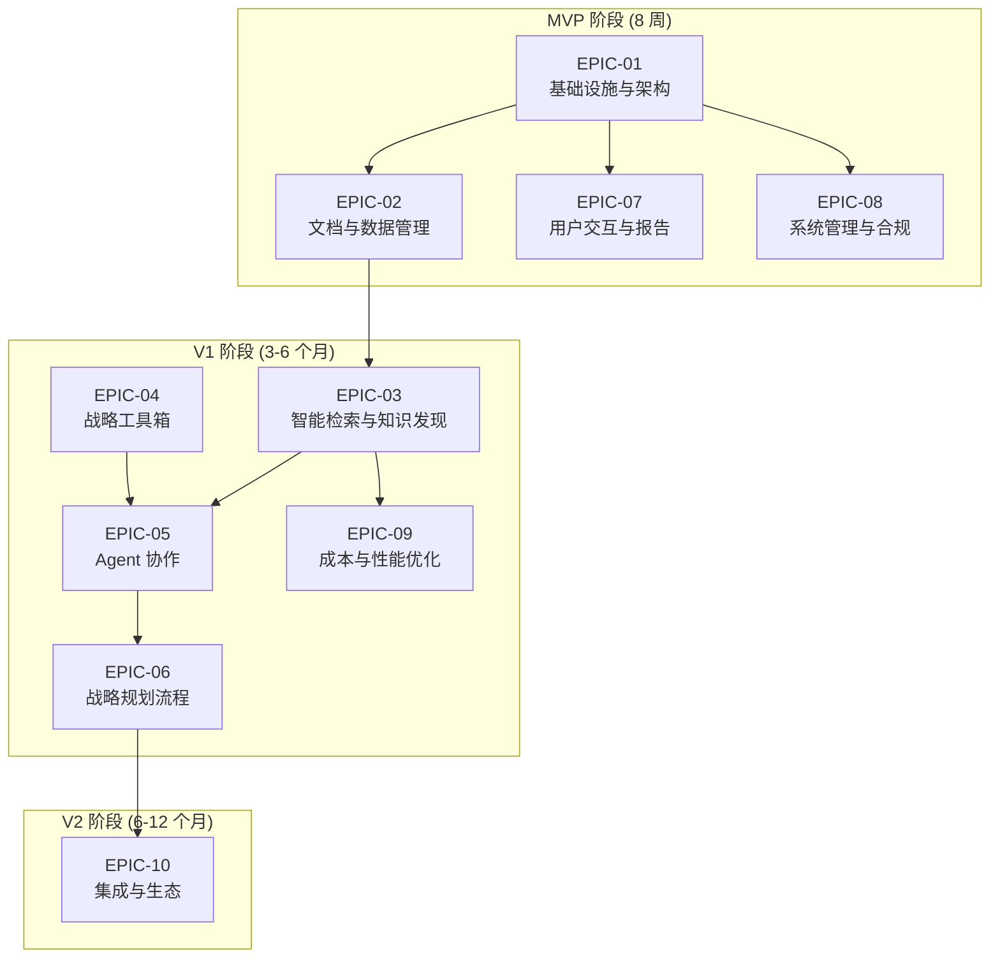
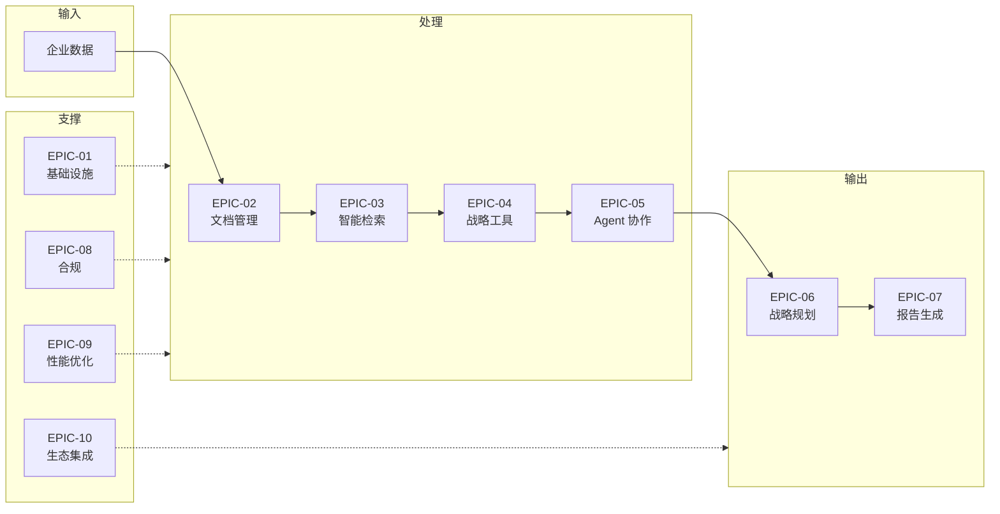

# sisys - Epic Breakdown

## Overview

本文档提供 sisys 企业战略规划管理系统完整的 Epic 和 Story 分解，将 PRD、UX Design 和 Architecture 中的需求分解为可实施的 Stories。

**项目概述：**
- **产品名称：** sisys - AI 驱动的战略规划与决策智能平台
- **目标用户：** 大中型企业高管团队、企业战略与市场体系人员、专业顾问（咨询/投资/银行）
- **核心价值：** 通过多 Agent 协作和高保真溯源，将战略规划周期从 2-3 周缩短至 3-5 天，决策质量提升 40%
- **MVP 目标：** 8 周完成 57 项 P0 功能，获取 3 家付费试点客户，¥100 万 ARR

---

## Requirements Inventory

### Functional Requirements (FRs)

**总计 122 项功能需求，按能力领域分类：**

#### 1. 文档与数据管理（DM - 15 项）

**P0 (MVP) - 8 项：**
- **DM-01 (P0):** 用户可以上传 17 种格式的文档（pdf/txt/doc/docx/ppt/pptx/xls/xlsx/csv/jpeg/png/gif/markdown/html + zip/tar 压缩包）[or.md 二.1.(1)]
- **DM-02 (P0):** 系统可以解析上传文档并提取文本、表格、图像、公式内容 [or.md 二.1.(2)]
- **DM-03 (P0):** 系统可以保留文档版面信息（元素坐标 x, y, width, height），采用 DocLayNet 标准格式 [or.md 二.1.(2)]
- **DM-04 (P0):** 系统可以提取表格的行列语义，输出包含表头与列类型的结构化 JSON [or.md 二.1.(2)]
- **DM-05 (P0):** 系统可以对扫描件或图像 PDF 进行 OCR 解析（中/英），提取置信度并标注 [or.md 二.1.(3)]
- **DM-06 (P0):** 用户可以创建文档版本快照，系统记录操作者、时间戳与差异摘要 [or.md 二.2.(1)]
- **DM-07 (P0):** 系统可以校验入库文档的最小元字段集（creator/created_at/source/license/business_domain）[or.md 二.2.(2)]
- **DM-08 (P0):** 系统可以对文档进行语义分块，基于文档语义边界而非固定字数切片 [or.md 二.3.(5)]

**P1 (V1) - 4 项：**
- **DM-09 (P1):** 用户可以追溯每个解析后的数据切片至导入批次与原始文件版本 [or.md 二.2.(3)]
- **DM-10 (P1):** 系统可以执行环境预检（GPU 驱动/CUDA 版本/内存），仅异常时通知用户 [or.md 六.1]
- **DM-11 (P1):** 用户可以导入季度/年度经营复盘数据，用于计算与规划的偏差 [or.md 六.7]
- **DM-12 (P1):** 系统可以支持合并单元格语义还原与跨页表格识别 [or.md 二.1.(2)]

**P2 (V2) - 3 项：**
- **DM-13 (P2):** 系统可以识别数学公式并输出 LaTeX 与 MathML 双格式表达 [or.md 二.1.(3)]
- **DM-14 (P2):** 系统可以实现图文联合嵌入空间，支持"以图搜文/以文搜图"的跨模态检索 [or.md 二.1.(4)]
- **DM-15 (P2):** 系统可以支持音视频转录文本接入 [or.md 二.1.(1)]

#### 2. 智能检索与知识发现（SR - 15 项）

**P0 (MVP) - 8 项：**
- **SR-01 (P0):** 系统可以执行混合检索（Dense bge-m3 + BM25 稀疏检索），双路召回 [or.md 二.3.(1)]
- **SR-02 (P0):** 系统可以抽取实体（LLM+ 规则混合策略），输出三元组 [or.md 二.3.(2)]
- **SR-03 (P0):** 系统可以管理战略领域词典库，支持热更新与版本管理 [or.md 二.3.(3)]
- **SR-04 (P0):** 系统可以融合三路检索结果（Dense + Sparse + Graph/metadata signals），使用 RRF 融合排序 [or.md 二.3.(6)]
- **SR-05 (P0):** 系统可以执行分层检索（L1 跨文档摘要→L2 文档摘要→L3 文档切片→L4 实体级片段）[or.md 二.4.(1)]
- **SR-06 (P0):** 系统可以生成契约化结构化摘要（财务/市场/技术视角），输出符合预定义 JSON Schema [or.md 二.5.(1)]
- **SR-07 (P0):** 系统可以评估检索相关性（LLM-as-a-Judge 实时多维评估），相关性<0.6 标注"数据不足" [or.md 二.6.(1)]
- **SR-08 (P0):** 系统可以保留引文"三元组"特征（文档 ID、切片 ID、字符范围），支持 Bounding Box 级溯源 [or.md 二.7.(1)]

**P1 (V1) - 5 项：**
- **SR-09 (P1):** 系统可以对齐与消歧实体（基于编辑距离 + 语义相似度双路匹配）[or.md 二.3.(4)]
- **SR-10 (P1):** 系统可以根据查询复杂度与意图自动路由至对应检索层级 [or.md 二.4.(2)]
- **SR-11 (P1):** 系统可以评估摘要质量（信息熵 + 关键实体覆盖率），评分<0.7 自动触发二次生成 [or.md 二.5.(2)]
- **SR-12 (P1):** 系统可以触发自动补救机制（扩展检索范围/调用白名单外部数据源/生成数据缺口报告）[or.md 二.6.(3)]
- **SR-13 (P1):** 系统可以构建知识图谱（实体节点 + 关系边），支持 GraphRAG 增强检索 [or.md 一.5.(5)]

**P2 (V2) - 2 项：**
- **SR-14 (P2):** 系统可以管理引用数据的时效性，超 12 个月数据自动标记"数据陈旧"并降权 [or.md 二.7.(3)]
- **SR-15 (P2):** 系统可以执行实体关联查询、路径查询、社区发现算法（Louvain/Label Propagation）[or.md 一.5.(5)]

#### 3. 战略工具箱（ST - 11 项）

**P0 (MVP) - 5 项：**
- **ST-01 (P0):** 系统可以注册战略工具（23 种：PESTEL/波特五力/$APPEALS/竞争对手分析/价值链分析/VRIO/安索夫矩阵/SWOT-TOWS/GE-麦肯锡矩阵/SPACE 矩阵/情景规划/价值曲线分析/价值主张画布/商业模式画布/破坏性创新模型/BSC/战略地图/组织设计框架/依赖关系图/RACI 矩阵/甘特图/KPI/变革管理模型）[or.md 三.前言]
- **ST-02 (P0):** 系统可以编排工具链（DAG 有向无环图），按拓扑顺序调度子任务 [or.md 三.1.(3)]
- **ST-03 (P0):** 系统可以验证工具输入/输出 Schema（Pydantic V2 契约化）[or.md 三.4.(1)]
- **ST-04 (P0):** 系统可以在 Docker 沙箱中执行工具代码，网络隔离 + 权限最小化 [or.md 三.3.(1)]
- **ST-05 (P0):** 系统可以执行红蓝辩论机制基础（单 Agent 多视角，MVP 替代方案）[or.md 三.5.(3)]

**P1 (V1) - 4 项：**
- **ST-06 (P1):** 系统可以管理工具版本，支持版本控制、灰度发布与回滚 [or.md 三.1.(2)]
- **ST-07 (P1):** 系统可以执行 Validation Feedback 闭环（最大重试 3 次，失败标记不可行）[or.md 三.3.(3)]
- **ST-08 (P1):** 系统可以遵循 MCP 2025 规范与 A2A 协议，通过 MCP Registry 暴露工具能力 [or.md 三.1.(4)]
- **ST-09 (P1):** 系统可以支持财务建模与估值基础（DCF/可比公司/先例交易基础）[or.md 五.3]

**P2 (V2) - 2 项：**
- **ST-10 (P2):** 系统可以在 gVisor 沙箱中执行代码，提供用户空间内核隔离 [or.md 三.3.(1)]
- **ST-11 (P2):** 系统可以支持压力测试建模（宏观经济变量情景分析）[or.md 五.3]

#### 4. Agent 协作（AC - 16 项）

**P0 (MVP) - 6 项：**
- **AC-01 (P0):** 系统可以实例化 Agent 角色基础（CEO Agent，MVP 单 Agent 方案）[or.md 四.1.(1)]
- **AC-02 (P0):** 系统可以加载 Agent 身份档案（IDENTITY.md/CODE.md/SOUL.md/TOOLS.md/USER.md/MEMORY.md/HEARTBEAT.md）[or.md 四.4.(1)]
- **AC-03 (P0):** 系统可以执行单 Agent 任务（感知→规划→执行→验证→反思→证据打包）[or.md 四.4.(1)]
- **AC-04 (P0):** 系统可以执行弹性视角隔离协议基础（L4 硬隔离默认）[or.md 四.1.(4)]
- **AC-05 (P0):** 系统可以保证 Agent 默认隔离等级为 L4 硬隔离（Prompt/工具/数据三重硬隔离）[or.md 八.7.(1)]
- **AC-06 (P0):** 系统可以记录隔离切换日志（AGENT ID、时间戳、原隔离等级、目标隔离等级、触发原因、审批链）[or.md 一.2.(9)]

**P1 (V1) - 8 项：**
- **AC-07 (P1):** 系统可以分解多 Agent 协作任务（SYS Agent 解析目标并分解，各专业 Agent 并行执行）[or.md 四.4.(2)]
- **AC-08 (P1):** 系统可以生成协作依赖图（基于 BLM/BEM 阶段）[or.md 四.4.(2)]
- **AC-09 (P1):** 系统可以动态调整隔离等级（基于任务依赖/关键词频率/SYS Agent 命令）[or.md 四.1.(4)]
- **AC-10 (P1):** 系统可以创建联合分析组，相关 Agent 隔离等级降级至 L2 协作态 [or.md 四.4.(4)]
- **AC-11 (P1):** 系统可以通过公共黑板交换中间结论（附带置信度与引用源）[or.md 四.4.(4)]
- **AC-12 (P1):** 系统可以执行 SYS Agent 裁决（最大辩论轮次 3+ 风险等级，上限 7 轮）[or.md 四.8.(1)]
- **AC-13 (P1):** 系统可以生成三套方案（Plan A 保守/Plan B 激进/Plan C AI 融合版）[or.md 四.8.(3)]
- **AC-14 (P1):** 系统可以执行深度思考与多路径推演（并行生成多条思维链）[or.md 四.4.(3)]

**P2 (V2) - 2 项：**
- **AC-15 (P2):** 系统可以强制暂停 5 分钟请求用户介入，超时无操作按 SYS Agent 决策执行 [or.md 四.8.(3)]
- **AC-16 (P2):** 系统可以支持 Agent 实例池化与动态扩缩容（基于负载自动伸缩）[or.md 四.1.(3)]

#### 5. 战略规划流程（SP - 12 项）

**P0 (MVP) - 4 项：**
- **SP-01 (P0):** 系统可以执行 BLM 前两阶段流程（业绩差距分析 + 市场洞察，含流程可视化；MVP 阶段 CEO AGENT 替代流程中所有 AGENT 角色）[or.md 五.2]
- **SP-02 (P0):** 系统可以执行市场洞察六子步骤基础（看趋势/看市场与客户/看竞争/看自己/看机会/机会差距分析）[or.md 五.2.(2)]
- **SP-03 (P0):** 系统可以创建 Checkpoint 快照（阶段标识、完成状态、用户反馈、修正记录）[or.md 五.4]
- **SP-04 (P0):** 系统可以输出 JSON 思维链（Input→<Reflection>→<Tools_Used>→<Constraints_Check>→JSON）[or.md 五.5]

**P1 (V1) - 6 项：**
- **SP-05 (P1):** 系统可以执行完整 BLM 六阶段流程（业绩差距分析→市场洞察六子步骤→战略意图与目标→创新焦点→业务设计→执行设计；各 AGENT 按标准角色定义各司其职）[or.md 五.2]
- **SP-06 (P1):** 系统可以执行 Replay 重放模式（修改点后所有状态重新计算，强一致性）[or.md 五.6.(1)]
- **SP-07 (P1):** 系统可以评估修改影响范围（≥2 个后续 Checkpoint 强制 Replay，<2 个推荐 Override）[or.md 五.6.(3)]
- **SP-08 (P1):** 系统可以执行 Override 覆盖模式（仅修改指定状态，需人工确认一致性风险）[or.md 五.6.(2)]
- **SP-09 (P1):** 系统可以执行 Time-travel 两阶段能力（单点恢复/分支对比）[or.md 五.6.(4)]
- **SP-10 (P1):** 系统可以支持红蓝辩论机制完整实现（发散 Temperature=0.8→收敛 Temperature=0.5→裁决 Temperature=0.2）[or.md 三.5.(3)]

**P2 (V2) - 2 项：**
- **SP-11 (P2):** 系统可以执行 BEM 六阶段流程（澄清战略方向→导出战略举措→导出衡量指标→确定年度措施→分解目标→导出重点工作计划）[or.md 五.3]
- **SP-12 (P2):** 系统可以将 SP 输出结构化映射为 BP 输入（战略解码器）[or.md 五.3]

#### 6. 用户交互与报告（UI - 13 项）

**P0 (MVP) - 7 项：**
- **UI-01 (P0):** 用户可以通过 CLI 执行命令（文档上传/Agent 调用/规划生成/Checkpoint 恢复）[or.md 六.3]
- **UI-02 (P0):** 系统可以通过 REST API 提供接口（文档管理/工具调用/Agent 协作/规划生成/系统管理）[or.md 六.4]
- **UI-03 (P0):** 系统可以通过 API Gateway 统一入口处理所有外部请求（统一认证/限流/路由/安全控制）[or.md 六.10]
- **UI-04 (P0):** 系统可以生成多格式报告（PDF/Markdown），包含可点击的引文索引 [or.md 六.4]
- **UI-05 (P0):** 用户可以查看 Checkpoint 摘要并修正关键参数后恢复运行 [or.md 六.6]
- **UI-06 (P0):** 系统可以展示溯源树（从结论逐层展开至原始数据）[or.md 六.9]
- **UI-07 (P0):** 系统可以支持高管简化视图（仪表盘/审批中心/审计摘要）[or.md 六.4]

**P1 (V1) - 5 项：**
- **UI-08 (P1):** 系统可以可视化展示决策过程（关键决策路径和依据）[or.md 六.9]
- **UI-09 (P1):** 系统可以创建/切换/删除分支，提供分支差异对比视图 [or.md 六.13]
- **UI-10 (P1):** 系统可以展示 Checkpoint 恢复模式选择界面（影响范围、推荐模式、风险提示）[or.md 六.14]
- **UI-11 (P1):** 系统可以支持无障碍设计（WCAG 2.1 AA，键盘导航，屏幕阅读器兼容）[or.md 六.11]
- **UI-12 (P1):** 系统可以支持多语言界面（中文/英文切换）[or.md 六.12]

**P2 (V2) - 1 项：**
- **UI-13 (P2):** 系统可以支持决策影响分析（Shapley 贡献值，反事实推理）[or.md 四.11.(3)]

#### 7. 系统管理与合规（SC - 14 项）

**P0 (MVP) - 8 项：**
- **SC-01 (P0):** 系统可以管理用户认证与 RBAC 权限（用户表/角色表/权限表/关联表）[or.md 一.5.(2)]
- **SC-02 (P0):** 系统可以记录统一审计日志（log_id/timestamp/actor/action_type/target_resource/old_value/new_value）[or.md 七.2]
- **SC-03 (P0):** 系统可以将审计日志写入不可变存储（WORM 基础，MVP 采用 PostgreSQL 审计表方案）[or.md 七.2]
- **SC-04 (P0):** 系统可以按时间/角色/任务类型/修正级别多维检索审计日志 [or.md 七.2]
- **SC-05 (P0):** 系统可以执行修正分级判定基础（L0 拼写/格式/L1 参数/权重 自动固化）[or.md 七.1]
- **SC-06 (P0):** 系统可以自动固化 L0/L1 级修正（生成 Few-Shot 样本→Strat-Bench 测试→版本注册→WORM 存储）[or.md 七.1]
- **SC-07 (P0):** 系统可以执行数据主权隔离（敏感数据本地优先，外部网络调用需审计与白名单批准）[or.md 二.11.(1)]
- **SC-08 (P0):** 系统可以支持等保 2.0 三级要求（身份鉴别/访问控制/安全审计/入侵防范/数据完整性/备份恢复）[or.md 八.4]

**P1 (V1) - 4 项：**
- **SC-09 (P1):** 系统可以对敏感数据脱敏（个人可识别信息、商业机密）[or.md 二.11.(2)]
- **SC-10 (P1):** 系统可以执行 L2 级修正专家确认（1 人，4 小时 SLA，紧急通道 1 小时）[or.md 七.1]
- **SC-11 (P1):** 系统可以执行 L3 级修正委员会审批（≥3 人，48 小时 SLA）[or.md 七.1]
- **SC-12 (P1):** 系统可以支持 SOX 合规（404 条款内部控制评估报告）[or.md 七.2]

**P2 (V2) - 2 项：**
- **SC-13 (P2):** 系统可以支持 ISO 27001 认证（信息安全管理体系）[or.md 八.4]
- **SC-14 (P2):** 系统可以支持银保监会规范（1104 报表/EAST 报表生成）[or.md 五.3]

#### 8. 成本与性能优化（CP - 12 项）

**P0 (MVP) - 4 项：**
- **CP-01 (P0):** 系统可以记录路由决策日志（任务 ID、时间戳、L1 结果、L2 各因子评分、最终评分、选定路由、成本、延迟）[or.md 一.2.(8)]
- **CP-02 (P0):** 系统可以执行语义缓存基础（相似度>0.9 直接返回缓存结果）[or.md 二.13.(1)]
- **CP-03 (P0):** 系统可以提供健康度仪表盘（实时可视化各 Agent 健康度指标）[or.md 四.13.(3)]
- **CP-04 (P0):** 系统可以输出 OpenTelemetry Trace（自适应采样，错误率>1% 时全采样）[or.md 四.13.(4)]

**P1 (V1) - 6 项：**
- **CP-05 (P1):** 系统可以执行统一动态模型路由框架（UDMR）三层决策（L1 合规性过滤→L2 任务复杂度评估→L3 路由决策执行）[or.md 二.13.(2)]
- **CP-06 (P1):** 系统可以基于四因子评分路由（语义匹配 35% + 历史成功率 30% + 成本效率 20% + 任务复杂度 15%）[or.md 一.1.(4)]
- **CP-07 (P1):** 系统可以执行三级成本熔断（任务级/会话级/系统级）[or.md 二.12.(2)]
- **CP-08 (P1):** 系统可以预测任务成本（基于历史相似任务），偏差超阈值触发分级预警 [or.md 四.15.(1)]
- **CP-09 (P1):** 系统可以管理缓存失效（TTL 24 小时 + 事件驱动失效 + 版本感知失效）[or.md 二.13.(1)]
- **CP-10 (P1):** 系统可以检测性能漂移（CUSUM 算法，滑动窗口 7 天）[or.md 二.10.(3)]

**P2 (V2) - 2 项：**
- **CP-11 (P2):** 系统可以执行区块链哈希链（审计日志不可篡改增强）[or.md 一.5.(3)]
- **CP-12 (P2):** 系统可以提供 UEBA 用户行为分析（高级威胁检测）[or.md 四.14]

#### 9. 战略档案库与长期记忆（SA - 10 项）

**P0 (MVP) - 3 项：**
- **SA-01 (P0):** 系统可以永久存储历年 SP/BP 的关键假设变量、决策依据、实际执行偏差 [or.md 二.8.(1)]
- **SA-02 (P0):** 系统可以管理事实有效期标签（valid_from/valid_until）[or.md 二.8.(2)]
- **SA-03 (P0):** 系统可以执行数据陈旧标记（超 12 个月自动降权）[or.md 二.8.(2)]

**P1 (V1) - 4 项：**
- **SA-04 (P1):** 系统可以查询时间轴演进（按时间范围查询历史决策）[or.md 二.8.(2)]
- **SA-05 (P1):** 系统可以执行心跳机制（周期性自动唤醒，检查待办事项、偏差预警、周期性任务）[or.md 四.12.(1)]
- **SA-06 (P1):** 系统可以发布战略偏差预警事件（偏差超阈值 10% 自动触发）[or.md 四.12.(2)]
- **SA-07 (P1):** 系统可以管理分支（主线/分支差异对比、分支合并/放弃）[or.md 一.2.(7)]

**P2 (V2) - 2 项：**
- **SA-08 (P2):** 系统可以主动推送知识更新（检测到行业报告/市场数据/政策法规更新时）[or.md 四.12.(3)]
- **SA-09 (P2):** 系统可以支持预测性战略预警（基于市场数据的主动预警，CUSUM 漂移检测）[or.md 四.12.(2)]

**排除说明：**
- **SA-10 (P3):** 系统可以支持群体智能（多企业匿名数据学习，提升战略建议质量）[or.md 四.4.(8)] - V3+ 版本，网络效应

#### 10. 架构约束（AR - 4 项）

**P0 (MVP) - 4 项：**
- **AR-01 (P0):** 系统可以保证领域层不依赖任何外部框架（仅依赖 Python 标准库与领域模型）[or.md 八.1]
- **AR-02 (P0):** 系统可以发布领域事件至事件总线，支持事件重放与失败重试 [or.md 八.2]
- **AR-03 (P0):** 系统可以执行跨存储事务基础（PostgreSQL 事务，MVP 方案），保证最终一致性 [or.md 八.6]
- **AR-04 (P0):** 系统可以通过仓储模式向领域层提供统一存储接口（领域层不直接依赖具体存储实现）[or.md 八.3]

---

### Non-Functional Requirements (NFRs)

**总计 40 项非功能需求，按质量属性分类：**

#### 性能（Performance - 7 项）

| NFR 编号 | 需求 | MVP 目标 | V1 目标 | V2 目标 | 优先级 |
|---------|------|---------|--------|--------|-------|
| **NFR-PERF-01** | 检索延迟 P95 | <800ms | <500ms | <300ms | P0 |
| **NFR-PERF-02** | 路由决策延迟 P95 | <100ms | <50ms | <30ms | P0 |
| **NFR-PERF-03** | 报告生成时间 | <30 秒（标准）/<2 分钟（完整） | - | - | P0 |
| **NFR-PERF-04** | 并发 Agent 会话 | ≥10 | ≥50 | ≥200 | P0 |
| **NFR-PERF-05** | Checkpoint 恢复时间 | <60 秒 | <30 秒 | <15 秒 | P0 |
| **NFR-PERF-06** | 语义缓存命中率 | >40% | - | - | P1 |
| **NFR-PERF-07** | 图遍历查询延迟 P95 | <200ms(简单)/<800ms(复杂) | - | - | P1 |

#### 安全性（Security - 7 项）

| NFR 编号 | 需求 | 验收标准 | 优先级 |
|---------|------|---------|-------|
| **NFR-SEC-01** | 数据传输加密 | TLS 1.3，SSL Labs A+ 评级 | P0 |
| **NFR-SEC-02** | 数据存储加密 | AES-256，加密审计通过 | P0 |
| **NFR-SEC-03** | 渗透测试 | 无高危漏洞，中危漏洞<5 个 | P0 |
| **NFR-SEC-04** | 数据泄露事件 | 0 事件 | P0 |
| **NFR-SEC-05** | 提示注入检测准确率 | ≥95%（ShieldCortex），误报率<5% | P0 |
| **NFR-SEC-06** | RBAC 权限测试 | 权限测试 100% 通过，越权访问 0 次 | P0 |
| **NFR-SEC-07** | 沙箱逃逸测试 | 0 次逃逸成功 | P0 |

#### 合规性（Compliance - 9 项）

| NFR 编号 | 需求 | MVP 目标 | V1 目标 | V2 目标 | 优先级 |
|---------|------|---------|--------|--------|-------|
| **NFR-COMP-01** | 等保 2.0 三级 | 通过测评，无高风险项 | - | - | P0 |
| **NFR-COMP-02** | 审计日志保留 | PostgreSQL 审计表 | 基础 WORM | 7 年 WORM+ 区块链 | P0 |
| **NFR-COMP-03** | 数据主权 | 数据境内存储 100% | - | - | P0 |
| **NFR-COMP-04** | 隐私保护（PIPL） | 脱敏率 100%，删除<24h | - | - | P0 |
| **NFR-COMP-05** | 审计日志完整性 | 100% 完整 | - | - | P0 |
| **NFR-COMP-06** | SOX 404 条款 | - | 通过第三方审计 | - | P1 |
| **NFR-COMP-07** | ISO 27001 | - | 通过认证 | - | P1 |
| **NFR-COMP-08** | 银保监会规范 | - | - | 1104/EAST 报表 | P2 |
| **NFR-COMP-09** | 完整审计追踪可视化 | - | - | 7 年 WORM+ 时间线，查询<10 秒 | P2 |

#### 可靠性（Reliability - 6 项）

| NFR 编号 | 需求 | MVP 目标 | V1 目标 | V2 目标 | 优先级 |
|---------|------|---------|--------|--------|-------|
| **NFR-REL-01** | 系统可用性 | 99% | 99.5% | 99.9% | P0 |
| **NFR-REL-02** | 数据备份 | RPO<1 小时 | - | - | P0 |
| **NFR-REL-03** | 灾难恢复 | RTO<4 小时 | - | - | P0 |
| **NFR-REL-04** | Checkpoint 快照持久化 | 100% 持久化，恢复≥99% | - | - | P0 |
| **NFR-REL-05** | 性能漂移检测 | - | CUSUM，准确率≥85% | - | P1 |
| **NFR-REL-06** | 成本熔断 | - | 三级熔断 100% 准确 | - | P1 |

#### 可扩展性（Scalability - 4 项）

| NFR 编号 | 需求 | 验收标准 | 优先级 |
|---------|------|---------|-------|
| **NFR-SCALE-01** | 用户增长支持 | 10 倍增长，性能下降<10% | P1 |
| **NFR-SCALE-02** | 数据量支持 | TB 级档案库，检索<1s | P1 |
| **NFR-SCALE-03** | Agent 动态扩缩容 | 基于负载自动伸缩，<5 分钟 | P1 |
| **NFR-SCALE-04** | 多租户隔离 | Schema per Tenant + RLS，隔离 100% 通过 | P0 |

#### 集成性（Integration - 5 项）

| NFR 编号 | 需求 | 验收标准 | 优先级 |
|---------|------|---------|-------|
| **NFR-INT-01** | API 可用性 | ≥99%，OpenAPI 3.1 规范 | P0 |
| **NFR-INT-02** | 预置集成适配器 | ≥5 个（ERP/CRM/OA 各至少 1 个） | P1 |
| **NFR-INT-03** | 外部数据源接入 | ≥3 个（工商/税务/专利等） | P1 |
| **NFR-INT-04** | 集成失败率 | <1%，重试成功率≥80% | P0 |
| **NFR-INT-05** | MCP/A2A 协议兼容性 | 向后兼容 1-2 个版本 | P0 |

#### 可访问性（Accessibility - 2 项）

| NFR 编号 | 需求 | 验收标准 | 优先级 |
|---------|------|---------|-------|
| **NFR-ACC-01** | 无障碍设计 | WCAG 2.1 AA，键盘导航 100% | P1 |
| **NFR-ACC-02** | 多语言支持 | 中文/英文，翻译准确率≥95% | P1 |

---

### Additional Requirements (AFRs)

**从 Architecture 和 UX Design 中提取的额外技术要求：**

#### 架构技术要求（来自 Architecture.md）

**AFR-ARC-01.** **六边形架构与领域驱动设计：**
   - 领域层（Domain）：封装企业战略规划核心领域逻辑，包括文档、AGENT、工具、战略规划、业务计划等领域实体，领域服务不依赖任何外部技术实现，仅依赖领域模型与领域规则
   - 应用层（Application）：定义用例服务（Use Cases），编排领域对象完成具体业务目标，包括文档处理用例、战略分析用例、AGENT 协作用例、规划生成用例，应用层协调领域层与基础设施层交互
   - 接口层（Interfaces）：实现输入适配器（CLI、API、事件监听）与输出适配器（数据库、消息队列、外部服务），隔离外部系统与领域层，支持技术栈独立演进
   - 基础设施层（Infrastructure）：实现领域层定义的仓储接口与领域服务接口，包括持久化存储（Redis/PostgreSQL/Qdrant/MinIO/Neo4j）、消息总线（RabbitMQ）、外部服务适配器（LLM API、嵌入模型）

**AFR-ARC-02.** **事件驱动架构：**
   - 双通道总线：Redis 发布/订阅（实时事件）+ RabbitMQ + 事务发件箱（持久化事件）
   - 10 种领域事件：DocumentProcessed/ToolExecuted/AgentDecided/CheckpointReached/CorrectionApproved/StrategicDeviationWarning/HeartbeatTriggered/IsolationLevelSwitched/CheckpointRecovered/RoutingDecided

**AFR-ARC-03.** **五层存储架构：**
   - L1 高速缓存层（Redis 7.0+）：会话状态、语义缓存、公共黑板，TTL 24h-30d
   - L2 关系存储层（PostgreSQL 15+）：用户/RBAC、审计元数据、业务实体
   - L3 向量存储层（Qdrant 1.7+）：嵌入向量、混合检索 payload
   - L4 对象存储层（MinIO WORM）：原始文档、证据包、审计归档，7 年存储
   - L5 图存储层（Neo4j 5.x）：知识图谱、实体关系、依赖图

**AFR-ARC-04.** **统一动态模型路由框架（UDMR）：**
   - L1 合规性网关：敏感数据检查、数据驻留限制、白名单校验
   - L2 任务复杂度评估器：四因子评分（语义匹配 35%/历史成功率 30%/成本效率 20%/任务复杂度 15%）
   - L3 路由决策执行器：云模型优势阈值 0.15，本地质量阈值 0.70
   - 目标：本地路由占比≥80%，成本节省≥50%

**AFR-ARC-05.** **弹性视角隔离协议（EIP）：**
   - 四级隔离等级：L4 硬隔离（默认）/L3 软隔离/L2 协作态/L1 融合态
   - 动态升降级触发：任务依赖>0.7 升级，关键词频率>5% 降级，SYS Agent 命令直接指定
   - 自动恢复：30 分钟无活动自动恢复至 L4

**AFR-ARC-06.** **修正分级判定体系：**
   - 五维特征加权：修正类型 30%/置信度变化 25%/影响范围 20%/可逆性 15%/领域关键度 10%
   - 级别映射：得分≥0.85→L0 自动固化，0.75-0.85→L1，0.60-0.75→L2 专家确认，<0.60→L3 委员会审批

**AFR-ARC-07.** **SYS Agent 裁决与辩论机制：**
   - 裁决五维评分：事实准确性 35%/逻辑一致性 25%/风险可控性 20%/资源可行性 15%/战略对齐度 5%
   - 辩论质量评估器：增益率阈值 0.10，重复率阈值 0.50，最大辩论轮次 5 轮
   - 置信度处理：≥0.6 自动执行，0.4-0.6 建议人工复核，<0.4 强制升级人工仲裁

**AFR-ARC-08.** **Checkpoint 与 Time-Travel 机制：**
   - 双模式恢复：Replay 模式（强一致性）/Override 模式（需人工确认）
   - 影响范围评估：≥2 个后续 Checkpoint 强制 Replay，<2 个推荐 Override
   - Time-Travel：单点恢复 + 分支对比

**AFR-ARC-09.** **领域实体定义：**
   - 9 大核心实体：Document/Agent/Tool/StrategicPlan/BusinessPlan/Checkpoint/StrategicArchive/RoutingDecisionLog/IsolationSwitchLog
   - 8 大领域服务接口：DocumentService/RAGService/ToolService/AgentService/PlanningService/EvaluationService/VisualizationService/RoutingService

#### UX 设计要求（来自 UX Design.md）

**AFR-UX-01.** **三视图设计：**
   - 高管视图：低信息密度，30 秒决策，第一屏只显示 3 个关键指标
   - 分析师视图：高信息密度，专业工具深度使用
   - 企业战略与市场人员视图：流程标准化，BLM/BEM 阶段可视化

**AFR-UX-02.** **核心定义性体验：高保真溯源**
   - Bounding Box 坐标级跳转至原始文档
   - 响应时间<300ms，定位准确率≥95%
   - 置信度显示：颜色（绿/黄/红）+ 文字（高/中/低）双重编码

**AFR-UX-03.** **情感化设计目标：**
   - 高管团队：掌控感（Control）- "一切尽在掌握中"
   - 企业战略人员：成就感（Accomplishment）- "我终于可以快速回应高管质疑了"
   - 专业顾问：专业感（Professionalism）- "这报告完全可以发给客户了"

**AFR-UX-04.** **设计系统选择：Ant Design 5.x**
   - MVP 阶段：复用基础组件 + 封装业务组件
   - V1 阶段：深化主题定制，建立品牌模板系统
   - V2 阶段：关键差异化组件完全自定义（Bounding Box 溯源查看器）

**AFR-UX-05.** **关键 UX 模式：**
   - 悬浮弹窗溯源卡片（Figma 模式）- 减少上下文切换
   - 红/黄/绿状态指示器 - 高管一眼理解
   - 龙卷风图（Tableau 模式）- 财务敏感性分析
   - 热力图（Palantir 模式）- 风险全景图
   - 时间线（Linear 模式）- 多 Agent 辩论过程

**AFR-UX-06.** **白标输出要求：**
   - 品牌模板系统：Logo/配色/字体运行时切换
   - 报告导出：PPT/PDF 格式，品牌元素 100% 准确
   - 导出时间：<1 分钟

---

### FR Coverage Map

**功能需求与 or.md 溯源对照表：**

| 能力领域 | FR 数量 | or.md 溯源 | 覆盖状态 |
|---------|--------|-----------|---------|
| 文档与数据管理（DM） | 15 | 二.1-二.2，二.3.(5)，六.1，六.7 | ✅ 完整覆盖 |
| 智能检索与知识发现（SR） | 15 | 二.3-二.7，一.5.(5) | ✅ 完整覆盖 |
| 战略工具箱（ST） | 11 | 三.1-三.10，五.3 | ✅ 完整覆盖 |
| Agent 协作（AC） | 16 | 四.1-四.15 | ✅ 完整覆盖 |
| 战略规划流程（SP） | 12 | 五.1-五.10 | ✅ 完整覆盖 |
| 用户交互与报告（UI） | 13 | 六.1-六.14，四.11.(3) | ✅ 完整覆盖 |
| 系统管理与合规（SC） | 14 | 七.1-七.6，八.4，二.11 | ✅ 完整覆盖 |
| 成本与性能优化（CP） | 12 | 二.12-二.13，四.13-四.15，一.5.(3) | ✅ 完整覆盖 |
| 战略档案库与长期记忆（SA） | 10 | 二.8，四.10-四.14，一.2 | ✅ 完整覆盖 |
| 架构约束（AR） | 4 | 八.1-八.8 | ✅ 完整覆盖 |
| **总计** | **122** | - | ✅ **100% 覆盖** |

---

## Epic List

**基于用户价值流和架构层次，分解为以下 10 个 Epics：**

| Epic ID | Epic 名称 | 描述 | 优先级 | 包含 FRs | 预计 Story 数 |
|--------|---------|------|-------|---------|-------------|
| **EPIC-01** | 基础设施与架构 | 六边形架构基础、五层存储、事件驱动、领域实体 | P0 | AR-01~04, SA-01~03 | 12 |
| **EPIC-02** | 文档与数据管理 | 17 种格式上传解析、版本管理、语义分块、高保真溯源 | P0 | DM-01~15, SR-08 | 18 |
| **EPIC-03** | 智能检索与知识发现 | 混合检索、分层检索、知识图谱、GraphRAG | P0 | SR-01~07, SR-09~15 | 16 |
| **EPIC-04** | 战略工具箱 | 23 种战略工具注册、编排、沙箱执行、版本管理 | P0 | ST-01~11 | 14 |
| **EPIC-05** | Agent 协作 | 单 Agent 执行、多 Agent 协作、EIP 隔离、SYS 裁决 | P0 | AC-01~16 | 20 |
| **EPIC-06** | 战略规划流程 | BLM 六阶段、BEM 六阶段、Checkpoint、Time-Travel | P0 | SP-01~12 | 18 |
| **EPIC-07** | 用户交互与报告 | CLI/API、报告生成、高管仪表盘、分支管理 | P0 | UI-01~13 | 16 |
| **EPIC-08** | 系统管理与合规 | RBAC、审计日志、等保 2.0、SOX/ISO 合规 | P0 | SC-01~14 | 16 |
| **EPIC-09** | 成本与性能优化 | UDMR 动态路由、语义缓存、成本熔断、性能监控 | P0 | CP-01~12 | 14 |
| **EPIC-10** | 集成与生态 | API 网关、企业系统集成、外部数据源、MCP/A2A 协议 | P0 | 集成 NFRs | 10 |

**总计：x 个 Stories**

---

## Epic 依赖关系图

### 技术依赖关系

### 用户价值流

### 依赖关系说明

| 依赖方向 | 说明 |
|---------|------|
| EPIC-01 → EPIC-02 | 基础设施是文档管理的技术基础（六边形架构、五层存储） |
| EPIC-01 → EPIC-07 | 基础设施提供 CLI/API 接口能力 |
| EPIC-01 → EPIC-08 | 基础设施提供 RBAC/审计基础 |
| EPIC-02 → EPIC-03 | 文档解析是智能检索的数据前提 |
| EPIC-03 → EPIC-05 | 检索能力是 Agent 协作的知识来源 |
| EPIC-04 → EPIC-05 | 工具注册是 Agent 调用的前提 |
| EPIC-05 → EPIC-06 | Agent 协作是战略规划流程的执行引擎 |
| EPIC-03 → EPIC-09 | 检索量是性能优化的对象 |
| EPIC-06 → EPIC-10 | 完整规划流程需要生态集成 |

---

## 📖 阅读指南

**不同角色的建议阅读路径：**

| 角色 | 重点关注 | 阅读顺序 |
|------|---------|---------|
| **技术负责人** | EPIC-01（架构）、EPIC-09（性能优化） | E1 → E9 → E3 |
| **产品经理** | EPIC-06（规划流程）、EPIC-07（用户交互） | E6 → E7 → E5 |
| **开发团队** | 按依赖顺序实施 | E1 → E2 → E3 → E4 → E5 → E6 |
| **测试团队** | 每个 Epic 的 Acceptance Criteria | 按 Epic 顺序，关注 AC 量化指标 |
| **高管读者** | Epic List 表格、用户价值流图 | 直接查看本章节图表 |
| **UX 设计师** | EPIC-07（用户交互）、三视图设计 | E7 → UX 设计要求章节 |

---

[版本功能清单表格示例]
| Epic | Stories | 数量 | FRs | NFRs | AFRs | 核心交付 |
|------|---------|------|-----|------|------|---------|
| **EPIC-01** | 1.1-1.5 1.6-1.8 | 8 | AR-01~04 SA-01~03 | NFR-SCALE-04 NFR-INT-05 | AFR-ARC-01~03 AFR-ARC-09 | 架构基础、领域实体、事件总线 |

[Epic版本路线图表格示例]
| 版本 | Stories | 数量 | FRs | NFRs | AFRs | 核心功能 |
|------|---------|------|-----|------|------|---------|
| **MVP** | 1.1-1.5 1.6-1.8 | 8 | AR-01~04 SA-01~03 | NFR-SCALE-04 NFR-INT-05 | AFR-ARC-01~03 AFR-ARC-09 | 六边形架构、五层存储、事件驱动、领域实体 |

---

## 版本功能清单

### MVP 阶段 (8 周) - 57 项 P0 功能

| Epic | Stories | 数量 | FRs | NFRs | AFRs | 核心交付 |
|------|---------|------|-----|------|------|---------|
| **EPIC-01** |  |  |  |  |  |  |
| **EPIC-02** |  |  |  |  |  |  |
| **EPIC-03** |  |  |  |  |  |  |
| **EPIC-04** |  |  |  |  |  |  |
| **EPIC-05** |  |  |  |  |  |  |
| **EPIC-06** |  |  |  |  |  |  |
| **EPIC-07** |  |  |  |  |  |  |
| **EPIC-08** |  |  |  |  |  |  |
| **EPIC-09** |  |  |  |  |  |  |
| **EPIC-10** |  |  |  |  |  |  |
| **MVP 总计** | | **x 项** | **57 项 P0** | **x 项** | **x 项** | |

---

### V1 阶段 (3-6 个月) - 46 项 P1 功能

| Epic | Stories | 数量 | FRs | NFRs | AFRs | 核心交付 |
|------|---------|------|-----|------|------|---------|
| **EPIC-01** |  |  |  |  |  |  |
| **EPIC-02** |  |  |  |  |  |  |
| **EPIC-03** |  |  |  |  |  |  |
| **EPIC-04** |  |  |  |  |  |  |
| **EPIC-05** |  |  |  |  |  |  |
| **EPIC-06** |  |  |  |  |  |  |
| **EPIC-07** |  |  |  |  |  |  |
| **EPIC-08** |  |  |  |  |  |  |
| **EPIC-09** |  |  |  |  |  |  |
| **EPIC-10** |  |  |  |  |  |  |
| **V1 总计** | | **x 项** | **46 项 P1** | **x 项** | **x 项** | |

---

### V2 阶段 (6-12 个月) - 18 项 P2 功能

| Epic | Stories | 数量 | FRs | NFRs | AFRs | 核心交付 |
|------|---------|------|-----|------|------|---------|
| **EPIC-01** |  |  |  |  |  |  |
| **EPIC-02** |  |  |  |  |  |  |
| **EPIC-03** |  |  |  |  |  |  |
| **EPIC-04** |  |  |  |  |  |  |
| **EPIC-05** |  |  |  |  |  |  |
| **EPIC-06** |  |  |  |  |  |  |
| **EPIC-07** |  |  |  |  |  |  |
| **EPIC-08** |  |  |  |  |  |  |
| **EPIC-09** |  |  |  |  |  |  |
| **EPIC-10** |  |  |  |  |  |  |
| **V2 总计** | | **x 项** | **18 项 P2** | **x 项** | **x 项** | |

---

### 需求覆盖汇总

| 版本 | FRs | NFRs | AFRs | Stories | 占比 |
|------|-----|------|------|---------|------|
| **MVP** | 57 | x 项 | x 项 | x 项 | x% |
| **V1** | 46 | x 项 | x 项 | x 项 | x% |
| **V2** | 18 | x 项 | x 项 | x 项 | x% |
| **P3 排除** | 1 项 (SA-10) | - | - | - | - |
| **总计** | **122 项** | **x 项** | **x 项** | **x 项** | 100% |

**图例说明：**
- **FRs**: Functional Requirements (功能需求) - 来自 PRD
- **NFRs**: Non-Functional Requirements (非功能需求) - 来自 PRD
- **AFRs**: Additional Functional Requirements (额外技术要求) - 来自 Architecture/UX Design

**AFR 编号说明：**
- **AFR-ARC-01~09**: 架构技术要求 (来自 Architecture.md)
  - AFR-ARC-01: 六边形架构与领域驱动设计
  - AFR-ARC-02: 事件驱动架构
  - AFR-ARC-03: 五层存储架构
  - AFR-ARC-04: 统一动态模型路由框架 (UDMR)
  - AFR-ARC-05: 弹性视角隔离协议 (EIP)
  - AFR-ARC-06: 修正分级判定体系
  - AFR-ARC-07: SYS Agent 裁决与辩论机制
  - AFR-ARC-08: Checkpoint 与 Time-Travel 机制
  - AFR-ARC-09: 领域实体定义/领域服务接口
- **AFR-UX-01~06**: UX 设计要求 (来自 UX Design.md)
  - AFR-UX-01: 三视图设计
  - AFR-UX-02: 高保真溯源
  - AFR-UX-03: 情感化设计目标
  - AFR-UX-04: 设计系统选择 (Ant Design 5.x)
  - AFR-UX-05: 关键 UX 模式
  - AFR-UX-06: 白标输出要求

---

## Epic 1: 基础设施与架构

**目标：** 建立六边形架构基础，实现五层存储架构、事件驱动总线和领域实体，为上层功能提供坚实的技术基础。

### 本 Epic 版本路线图

| 版本 | Stories | 数量 | FRs | NFRs | AFRs | 核心功能 |
|------|---------|------|-----|------|------|---------|
| **MVP** | 1.1-1.12 | 12 项 | AR-01~04 SA-01~03 | NFR-SCALE-04 NFR-INT-05 | AFR-ARC-01~03 AFR-ARC-09 | 六边形架构、五层存储、事件驱动、领域实体 |
| **V1** | 1.13-1.15 | 3 项 | SA-04~07 | NFR-REL-05 | AFR-ARC-09 | 分支管理、心跳机制、战略档案 |
| **总计** | **1.1-1.15** | **15 项** | | | | |

### Story 1.1: 六边形架构分层实现 `P0-MVP`

**As a** 系统架构师，
**I want** 实现领域驱动六边形架构（领域层/应用层/接口层/基础设施层），
**So that** 领域逻辑与技术实现隔离，支持长期演进和独立测试。

**Acceptance Criteria:**

**Given** 项目初始化完成
**When** 创建四大层级目录结构
**Then** 领域层不包含任何外部框架依赖（仅 Python 标准库）
**And** 基础设施层实现所有领域服务接口和仓储接口

**Given** 领域层定义
**When** 创建领域实体（Document/Agent/Tool/StrategicPlan 等）
**Then** 实体封装核心业务逻辑和不变约束
**And** 领域服务接口定义清晰的技术边界

**Given** 应用层用例服务
**When** 编排领域对象完成业务目标
**Then** 用例服务不直接依赖基础设施实现
**And** 通过依赖注入获取领域服务

**Given** 接口层适配器
**When** 实现 CLI/REST API/事件监听适配器
**Then** 外部请求转换为应用层命令对象
**And** API 符合 OpenAPI 3.1 规范

---

### Story 1.2: 五层存储架构实现 `P0-MVP`

**As a** 系统架构师，
**I want** 实现五层存储架构（L1 缓存/L2 关系/L3 向量/L4 对象/L5 图），
**So that** 不同类型数据使用最优存储方案，支持检索延迟 P95<800ms（MVP）。

**Acceptance Criteria:**

**Given** Redis 7.0+ 部署完成
**When** 实现 L1 高速缓存层
**Then** 支持会话状态快照（Redis Hash，TTL 24h-30d）
**And** 支持语义缓存（相似度>0.9 命中）
**And** 支持 Redis 发布/订阅实时事件通道

**Given** PostgreSQL 15+ 部署完成
**When** 实现 L2 关系存储层
**Then** 支持用户/RBAC/审计元数据存储
**And** 支持事务发件箱（event_outbox 表）
**And** 支持多租户 Schema 隔离

**Given** Qdrant 1.7+ 部署完成
**When** 实现 L3 向量存储层
**Then** 支持 Dense/Sparse 向量存储
**Then** 支持 RRF 融合排序
**And** 检索延迟 P95<800ms

**Given** MinIO 部署完成
**When** 实现 L4 对象存储层
**Then** 支持 WORM 存储策略（7 年归档）
**And** 支持文档版本控制
**And** 支持证据包打包

**Given** Neo4j 5.x 部署完成
**When** 实现 L5 图存储层
**Then** 支持知识图谱实体节点和关系边
**And** 支持图遍历查询（简单<200ms，复杂<800ms）

---

### Story 1.3: 事件驱动总线实现 `P0-MVP`

**As a** 系统架构师，
**I want** 实现双通道事件总线（Redis 实时+RabbitMQ 持久化），
**So that** 领域事件可靠传递，支持事件溯源和状态重建。

**Acceptance Criteria:**

**Given** RabbitMQ 3.12+ 部署完成
**When** 实现持久化事件通道
**Then** 支持 10 种领域事件发布（DocumentProcessed/ToolExecuted/AgentDecided 等）
**And** 事件格式标准化（事件 ID/类型/时间戳/载荷/来源/Schema 版本/聚合根 ID/版本号）
**And** 支持死信队列（DLQ）处理失败事件

**Given** Redis 发布/订阅通道
**When** 实现实时事件通知
**Then** 实时通知型事件延迟<100ms
**And** 允许少量丢失（非关键事件）

**Given** 事务发件箱模式
**When** 业务事务提交
**Then** 事件先写入 PostgreSQL event_outbox 表
**And** 异步轮询发布至 RabbitMQ
**And** 保证事件不丢失

**Given** 事件溯源需求
**When** 关键业务实体状态变更
**Then** 通过领域事件序列记录
**And** 支持状态重建和时间旅行调试

---

### Story 1.4: 领域实体实现 - Document 与 Agent `P0-MVP`

**As a** 领域工程师，
**I want** 实现 Document 和 Agent 领域实体，
**So that** 系统可以管理 17 种格式文档和 7 类 Agent 角色。

**Acceptance Criteria:**

**Given** Document 实体定义
**When** 上传 17 种格式文档
**Then** 解析并提取文本/表格/图像/公式
**And** 保留版面信息（DocLayNet 格式坐标 x,y,width,height）
**And** 校验最小元字段集（creator/created_at/source/license/business_domain）

**Given** Document 版本管理
**When** 创建文档版本快照
**Then** 记录操作者/时间戳/差异摘要
**And** 支持版本冲突检测（乐观锁/悲观锁可选）

**Given** Agent 实体定义
**When** 实例化 Agent 角色（CEO/CFO/CMO/CTO/COO/CHO/AUD）
**Then** 加载身份档案（IDENTITY.md/CODE.md/SOUL.md/TOOLS.md/USER.md/MEMORY.md/HEARTBEAT.md）
**And** 保证视角隔离（Prompt/工具/数据三重硬隔离）

**Given** Agent 隔离管理
**When** 动态调整隔离等级
**Then** 基于任务依赖/关键词频率/SYS Agent 命令
**And** 记录隔离切换日志至审计追踪

---

### Story 1.5: 领域实体实现 - Tool 与 StrategicPlan `P0-MVP`

**As a** 领域工程师，
**I want** 实现 Tool 和 StrategicPlan 领域实体，
**So that** 系统可以管理 23 种战略工具和 BLM/BEM 规划流程。

**Acceptance Criteria:**

**Given** Tool 实体定义
**When** 注册战略工具（PESTEL/波特五力/SWOT-TOWS 等 23 种）
**Then** 定义输入/输出 Schema（Pydantic V2 契约化）
**And** 支持工具版本控制、灰度发布与回滚

**Given** Tool 沙箱执行
**When** 执行工具代码
**Then** 在 Docker 沙箱中运行（网络隔离 + 权限最小化）
**And** 验证输出 Schema 符合契约

**Given** StrategicPlan 实体定义
**When** 创建五年滚动战略规划（SP）
**Then** 支持 BLM 六阶段模型（业绩差距→市场洞察→战略意图→创新焦点→业务设计→执行设计）
**And** 不变约束：BLM 模型流程不变性

**Given** Checkpoint 机制
**When** 各阶段完成
**Then** 创建 Checkpoint 快照（阶段标识/完成状态/用户反馈/修正记录）
**And** 支持双模式恢复（Replay/Override）

---

### Story 1.6: 领域实体实现 - Checkpoint 与 StrategicArchive `P0-MVP`

**As a** 领域工程师，
**I want** 实现 Checkpoint 和 StrategicArchive 领域实体，
**So that** 系统支持 Time-Travel 调试和永久存储历年 SP/BP。

**Acceptance Criteria:**

**Given** Checkpoint 实体定义
**When** 创建 Checkpoint 快照
**Then** 序列化至 Redis Hash（TTL 可配置）
**And** 支持状态重建和中断恢复

**Given** Checkpoint 恢复
**When** 用户修正关键参数
**Then** 评估修改影响范围（≥2 个后续 Checkpoint 强制 Replay）
**And** 执行对应恢复模式（Replay 强一致性/Override 需人工确认）

**Given** StrategicArchive 实体定义
**When** 永久存储历年 SP/BP
**Then** 存储关键假设变量/决策依据/实际执行偏差/证据包
**And** 管理事实有效期标签（valid_from/valid_until）

**Given** 数据陈旧标记
**When** 数据超过 12 个月
**Then** 自动标记"数据陈旧"并降权
**And** 支持时间轴演进查询

---

### Story 1.7: 领域服务实现 - RAGService 与 ToolService `P0-MVP`

**As a** 领域工程师，
**I want** 实现 RAGService 和 ToolService 领域服务接口，
**So that** 系统支持混合检索和工具链编排。

**Acceptance Criteria:**

**Given** RAGService 接口定义
**When** 执行混合检索
**Then** 支持 Dense（bge-m3）+ Sparse（BM25）双路召回
**And** 支持 RRF 融合排序
**And** 检索延迟 P95<800ms

**Given** 分层检索
**When** 执行 L1-L4 检索
**Then** L1 跨文档摘要→L2 文档摘要→L3 文档切片→L4 实体级片段
**And** 生成契约化结构化摘要（JSON Schema）

**Given** ToolService 接口定义
**When** 编排工具链
**Then** 解析 DAG 有向无环图
**And** 按拓扑顺序调度子任务
**And** 并行执行无依赖子任务

**Given** 工具验证
**When** 执行 Validation Feedback 闭环
**Then** 最大重试 3 次
**And** 失败标记不可行

---

### Story 1.8: 领域服务实现 - AgentService 与 PlanningService `P0-MVP`

**As a** 领域工程师，
**I want** 实现 AgentService 和 PlanningService 领域服务接口，
**So that** 系统支持多 Agent 协作和 BLM/BEM 流程编排。

**Acceptance Criteria:**

**Given** AgentService 接口定义
**When** 多 Agent 协作
**Then** SYS Agent 解析目标并分解任务
**And** 各专业 Agent 并行执行
**And** 生成协作依赖图（基于 BLM/BEM 阶段）

**Given** 弹性视角隔离协议（EIP）
**When** 动态调整隔离等级
**Then** 支持四级隔离（L4 硬隔离/L3 软隔离/L2 协作态/L1 融合态）
**And** 基于任务依赖/关键词频率/SYS Agent 命令升降级
**And** 30 分钟无活动自动恢复至 L4

**Given** PlanningService 接口定义
**When** 执行 BLM 六阶段
**Then** 各阶段触发 Checkpoint 机制
**And** 输出 JSON 思维链（Input→<Reflection>→<Tools_Used>→<Constraints_Check>→JSON）

**Given** BEM 战略解码
**When** 将 SP 输出映射为 BP 输入
**Then** 执行 BEM 六阶段状态机
**And** 不变约束：SP 到 BP 的 Schema 强制映射

---

### Story 1.9: 路由决策日志与隔离切换日志 `P0-MVP`

**As a** 系统审计员，
**I want** 实现 RoutingDecisionLog 和 IsolationSwitchLog 实体，
**So that** 路由决策和隔离切换可审计追踪。

**Acceptance Criteria:**

**Given** RoutingDecisionLog 实体定义
**When** 执行 UDMR 路由决策
**Then** 记录任务 ID/时间戳/L1 结果/L2 各因子评分/最终评分/选定路由/成本/延迟
**And** 支持按任务/模型/时间多维检索

**Given** 路由决策审计
**When** 查询历史路由
**Then** 返回完整决策链路
**And** 支持成本聚合分析

**Given** IsolationSwitchLog 实体定义
**When** Agent 隔离等级变更
**Then** 记录切换时间戳/AGENT ID/原等级/目标等级/触发原因/审批链
**And** 支持按 AGENT/时间/隔离等级多维检索

**Given** 隔离审计
**When** 合规检查
**Then** 验证隔离切换 100% 记录
**And** 支持导出审计报告

---

### Story 1.10: 领域事件实现 - 核心事件 `P0-MVP`

**As a** 系统架构师，
**I want** 实现核心领域事件（DocumentProcessed/ToolExecuted/AgentDecided/CheckpointReached），
**So that** 系统支持事件驱动流转和事件溯源。

**Acceptance Criteria:**

**Given** DocumentProcessed 事件定义
**When** 文档解析完成
**Then** 发布事件携带文档 ID/解析结果摘要/嵌入向量引用/血缘信息
**And** 触发下游实体抽取/图谱构建/索引更新

**Given** ToolExecuted 事件定义
**When** 工具执行完成
**Then** 发布事件携带工具 ID/执行结果/成本审计信息/证据包引用
**And** 触发下游 Agent 决策/成本聚合

**Given** AgentDecided 事件定义
**When** Agent 决策完成
**Then** 发布事件携带 Agent ID/决策结果/置信度评分/引用源列表/隔离等级状态
**And** 触发下游 SYS Agent 仲裁/公共黑板更新

**Given** CheckpointReached 事件定义
**When** 阶段完成
**Then** 发布事件携带阶段标识/阶段性结果/用户反馈请求/恢复点引用
**And** 触发用户交互/反馈收集/状态持久化

---

### Story 1.11: 领域事件实现 - 控制事件 `P0-MVP`

**As a** 系统架构师，
**I want** 实现控制领域事件（CorrectionApproved/StrategicDeviationWarning/HeartbeatTriggered 等），
**So that** 系统支持修正审批、偏差预警和周期性任务。

**Acceptance Criteria:**

**Given** CorrectionApproved 事件定义
**When** 修正审批通过
**Then** 发布事件携带修正类型/修正前后值/审批链/影响范围
**And** 触发自动固化流水线/版本注册

**Given** StrategicDeviationWarning 事件定义
**When** 战略偏差超阈值（默认 10%）
**Then** 发布事件携带偏差类型/偏差等级/实际值/规划值
**And** 触发相关 Agent 响应/偏差分析报告生成

**Given** HeartbeatTriggered 事件定义
**When** 周期性心跳触发
**Then** 发布事件携带心跳 ID/唤醒原因/待办事项列表/成本预算
**And** 触发周期性任务检查/偏差预警检查

**Given** IsolationLevelSwitched 事件定义
**When** 隔离等级切换
**Then** 发布事件携带 AGENT ID/原等级/目标等级/触发原因/审批链
**And** 触发公共黑板权限更新/协作状态同步

---

### Story 1.12: 跨存储事务与最终一致性 `P0-MVP`

**As a** 系统架构师，
**I want** 实现跨存储事务机制，
**So that** 保证五层存储的最终一致性。

**Acceptance Criteria:**

**Given** 跨存储写入需求
**When** 业务事务提交
**Then** 使用 PostgreSQL 事务（MVP 方案）
**And** 保证元数据与引用一致性

**Given** 最终一致性要求
**When** 异步更新向量/图存储
**Then** 通过领域事件触发
**And** 支持失败重试（最多 3 次）

**Given** 一致性校验
**When** 定期巡检
**Then** 检测跨存储引用完整性
**And** 自动修复不一致状态

---

## Epic 2: 文档与数据管理

**目标：** 实现 17 种格式文档上传解析、版本管理、语义分块和高保真溯源，为 RAG 检索提供数据基础。

### 本 Epic 版本路线图

| 版本 | Stories | 数量 | FRs | NFRs | AFRs | 核心功能 |
|------|---------|------|-----|------|------|---------|
| **MVP** | 2.1-2.8 | 8 项 | DM-01~08, SR-08 | NFR-PERF-01, NFR-COMP-03 | AFR-UX-02 | DocLayNet 版面、OCR 解析、高保真溯源 |
| **V1** | 2.9-2.12 | 4 项 | DM-09~12 | NFR-PERF-07 | AFR-UX-02 | 合并单元格还原、跨页表格 |
| **V2** | 2.13-2.15 | 3 项 | DM-13~15 | NFR-PERF-07 | AFR-UX-02 AFR-UX-05 | 公式识别、跨模态检索、音视频转录 |
| **总计** | **2.1-2.15** | **15 项** | | | | |

### Story 2.1: 文档上传与批量处理 `P0-MVP`

**As a** 企业战略人员，
**I want** 批量上传 17 种格式文档（支持拖拽和压缩包），
**So that** 快速导入历史数据和行业报告。

**Acceptance Criteria:**

**Given** 用户上传文档
**When** 拖拽文件至上传区域
**Then** 自动识别格式（pdf/txt/doc/docx/ppt/pptx/xls/xlsx/csv/jpeg/png/gif/markdown/html）
**And** 支持 zip/tar 压缩包自动解压

**Given** 批量上传
**When** 上传总大小≤20GB
**Then** 动态批次管理
**And** 流式处理防止内存溢出

**Given** 断点续传
**When** 网络中断
**Then** 支持分片上传续传
**And** 已上传片段不重复

---

### Story 2.2: 文档解析与内容提取 `P0-MVP`

**As a** 系统解析引擎，
**I want** 解析 17 种格式文档并提取内容，
**So that** 文本/表格/图像/公式可被检索和分析。

**Acceptance Criteria:**

**Given** PDF 文档
**When** 执行解析
**Then** 提取文本/表格/图像/公式
**And** 保留版面信息（DocLayNet 格式：x, y, width, height）

**Given** 表格提取
**When** 解析 Excel/PDF 表格
**Then** 提取行列语义
**And** 输出结构化 JSON（包含表头与列类型）

**Given** 扫描件/图像 PDF
**When** 执行 OCR 解析
**Then** 支持中文/英文识别
**And** 提取置信度并标注低置信度区域

**Given** 公式识别
**When** 解析数学公式（V2 能力）
**Then** 输出 LaTeX 与 MathML 双格式

---

### Story 2.3: 文档版本管理与血缘追踪 `P0-MVP`

**As a** 文档管理员，
**I want** 管理文档版本和血缘追踪，
**So that** 可追溯每个数据切片的来源。

**Acceptance Criteria:**

**Given** 文档更新
**When** 用户上传新版本
**Then** 创建版本快照（对象存储版本控制）
**And** 记录操作者/时间戳/差异摘要

**Given** 血缘追踪
**When** 解析数据切片
**Then** 追溯至导入批次与原始文件版本
**And** 支持导入批次检索

**Given** 元数据校验
**When** 文档入库
**Then** 校验最小元字段集（creator/created_at/source/license/business_domain）
**And** 缺失字段拒绝入库

---

### Story 2.4: 语义分块与索引构建 `P0-MVP`

**As a** RAG 工程师，
**I want** 对文档进行语义分块并构建索引，
**So that** 支持高效检索和高保真溯源。

**Acceptance Criteria:**

**Given** 文档解析完成
**When** 执行语义分块
**Then** 基于文档语义边界而非固定字数切片
**And** 保留段落/章节完整性

**Given** 嵌入生成
**When** 对每个切片生成向量
**Then** 使用 bge-m3 嵌入模型
**And** 存储至 Qdrant 向量库

**Given** 索引构建
**When** 构建混合检索索引
**Then** Dense 索引（bge-m3）+ Sparse 索引（BM25）
**And** 支持 RRF 融合排序

---

### Story 2.5: 高保真溯源 - Bounding Box 跳转 `P0-MVP`

**As a** 企业战略人员，
**I want** 从结论跳转至原始文档坐标点，
**So that** 30 秒内验证数据可信度，快速回应高管质疑。

**Acceptance Criteria:**

**Given** 用户点击结论文字
**When** 触发溯源
**Then** 弹出溯源卡片（响应<300ms）
**And** 显示文档名称/页码/置信度/原文引用

**Given** 溯源卡片
**When** 点击"跳转到原始文档坐标点"
**Then** 打开 PDF 查看器（内置 PDF.js）
**And** 自动定位至第 X 页（<1 秒）
**And** 红色框高亮显示具体段落（Bounding Box）

**Given** Bounding Box 定位
**When** 渲染高亮区域
**Then** 定位准确率≥95%
**And** 支持侧边栏显示引用上下文

**Given** 置信度显示
**When** 展示溯源结果
**Then** 颜色编码（绿/黄/红）+ 文字（高/中/低）双重编码
**And** 用户理解率 100%

---

### Story 2.6: 环境预检与异常通知 `P0-MVP`

**As a** 运维工程师，
**I want** 执行环境预检（GPU 驱动/CUDA/内存），
**So that** 仅异常时通知用户，减少打扰。

**Acceptance Criteria:**

**Given** 文档解析任务启动
**When** 执行环境预检
**Then** 检查 GPU 驱动版本/CUDA 版本/内存占用
**And** 正常时静默执行

**Given** 异常检测
**When** 环境不满足要求
**Then** 立即通知用户
**And** 提供修复建议

---

### Story 2.7: 经营复盘数据导入 `P0-MVP`

**As a** 战略分析师，
**I want** 导入季度/年度经营复盘数据，
**So that** 计算实际执行与规划的偏差。

**Acceptance Criteria:**

**Given** 经营数据导入
**When** 上传季度/年度报表
**Then** 自动解析财务/业务数据
**And** 关联至对应战略规划周期

**Given** 偏差计算
**When** 对比规划值与实际值
**Then** 计算偏差率（默认阈值 10%）
**And** 偏差超阈值触发预警事件

---

### Story 2.8: 复杂表格处理（V1 能力） `P1-V1`

**As a** 财务分析师，
**I want** 处理合并单元格和跨页表格，
**So that** 完整还原财务报表语义。

**Acceptance Criteria:**

**Given** 合并单元格
**When** 解析 Excel/PDF 表格
**Then** 语义还原合并逻辑
**And** 输出完整行列关系

**Given** 跨页表格
**When** 表格跨越多页
**Then** 识别并拼接完整表格
**And** 保持表头与数据关联

---

### Story 2.9: 跨模态检索（V2 能力） `P2-V2`

**As a** 市场分析师，
**I want** 使用"以图搜文/以文搜图"功能，
**So that** 跨模态检索市场数据和图表。

**Acceptance Criteria:**

**Given** 图文联合嵌入
**When** 构建索引
**Then** 图文映射至同一嵌入空间
**And** 支持跨模态相似度计算

**Given** 以图搜图
**When** 上传图片
**Then** 返回相似图表和关联文本
**And** 检索延迟 P95<1s

**Given** 以文搜图
**When** 输入文本描述
**Then** 返回匹配图表
**And** 支持语义相关性排序

---

### Story 2.10: 音视频转录文本接入（V2 能力） `P2-V2`

**As a** 战略分析师，
**I want** 接入音视频转录文本，
**So that** 高管会议录音可被检索和引用。

**Acceptance Criteria:**

**Given** 音视频文件上传
**When** 执行转录
**Then** 输出带时间戳的文本
**And** 支持说话人分离

**Given** 转录文本检索
**When** 检索会议内容
**Then** 支持跳转至音频对应时间点
**And** 支持文字高亮同步播放

---

## Epic 3: 智能检索与知识发现

**目标：** 实现混合检索、分层检索、知识图谱和 GraphRAG，支持高保真溯源和契约化摘要。

### 本 Epic 版本路线图

| 版本 | Stories | 数量 | FRs | NFRs | AFRs | 核心功能 |
|------|---------|------|-----|------|------|---------|
| **MVP** | 3.1-3.8 | 8 项 | SR-01~08 | NFR-PERF-01/02/07 | AFR-ARC-09 | 混合检索、分层检索基础 |
| **V1** | 3.9-3.13 | 5 项 | SR-09~13 | NFR-PERF-07 | AFR-ARC-09 | 知识图谱、GraphRAG |
| **V2** | 3.14-3.15 | 2 项 | SR-14~15 | NFR-PERF-07 | AFR-ARC-09 | 时效性管理、社区发现 |
| **总计** | **3.1-3.15** | **15 项** | | | | |

### Story 3.1: 混合检索与 RRF 融合 `P0-MVP`

**As a** 分析师，
**I want** 执行混合检索（Dense + Sparse），
**So that** 同时利用语义相似度和关键词匹配优势。

**Acceptance Criteria:**

**Given** 用户查询
**When** 执行混合检索
**Then** Dense 检索（bge-m3）+ Sparse 检索（BM25）双路召回
**And** 使用 RRF（Reciprocal Rank Fusion）融合排序

**Given** RRF 融合
**When** 融合三路结果（Dense + Sparse + Graph/metadata）
**Then** 支持可配置权重参数
**And** 检索延迟 P95<800ms（分级预算：初检 200ms + 精排 250ms + 融合 50ms）

---

### Story 3.2: 实体抽取与三元组输出 `P0-MVP`

**As a** 知识工程师，
**I want** 抽取实体并输出三元组，
**So that** 构建知识图谱和实体关联查询。

**Acceptance Criteria:**

**Given** 文档切片
**When** 执行实体抽取
**Then** 使用 LLM+ 规则混合策略
**And** 输出三元组（主体/谓词/客体）

**Given** 实体对齐
**When** 多文档实体消歧（V1 能力）
**Then** 基于编辑距离 + 语义相似度双路匹配
**And** 合并相同实体

---

### Story 3.3: 战略领域词典管理 `P0-MVP`

**As a** 领域专家，
**I want** 管理战略领域词典，
**So that** 提升检索相关性和实体识别准确率。

**Acceptance Criteria:**

**Given** 领域词典
**When** 添加/更新/删除术语
**Then** 支持热更新（无需重启）
**And** 支持版本管理

**Given** 词典应用
**When** 执行检索
**Then** 优先匹配领域术语
**And** 提升相关专业度

---

### Story 3.4: 分层检索与查询路由 `P0-MVP`

**As a** 高级分析师，
**I want** 执行分层检索（L1-L4），
**So that** 根据查询复杂度自动路由至最优检索层级。

**Acceptance Criteria:**

**Given** 用户查询
**When** 执行分层检索
**Then** L1 跨文档摘要→L2 文档摘要→L3 文档切片→L4 实体级片段
**And** 每层支持渐进式披露

**Given** 查询路由（V1 能力）
**When** 评估查询复杂度与意图
**Then** 自动路由至对应检索层级
**And** 避免过度检索

---

### Story 3.5: 契约化结构化摘要 `P0-MVP`

**As a** 高管，
**I want** 生成契约化结构化摘要，
**So that** 快速理解财务/市场/技术视角关键信息。

**Acceptance Criteria:**

**Given** 检索结果
**When** 生成摘要
**Then** 输出符合预定义 JSON Schema
**And** 分视角展示（财务/市场/技术）

**Given** 摘要质量评估（V1 能力）
**When** 评估信息熵 + 关键实体覆盖率
**Then** 评分<0.7 自动触发二次生成
**And** 提升摘要质量

---

### Story 3.6: 检索相关性评估 `P0-MVP`

**As a** 系统评估器，
**I want** 评估检索相关性，
**So that** 相关性<0.6 时标注"数据不足"。

**Acceptance Criteria:**

**Given** 检索结果
**When** 执行 LLM-as-a-Judge 评估
**Then** 实时多维评估（语义匹配/完整性/时效性）
**And** 相关性<0.6 标注"数据不足"

**Given** 自动补救（V1 能力）
**When** 数据不足
**Then** 扩展检索范围/调用白名单外部数据源
**And** 生成数据缺口报告

---

### Story 3.7: 引文溯源树展示 `P0-MVP`

**As a** 分析师，
**I want** 查看溯源树，
**So that** 从结论逐层展开至原始数据。

**Acceptance Criteria:**

**Given** 结论展示
**When** 点击溯源
**Then** 展示溯源树（结论→分析→原始文档切片）
**And** 保留引文"三元组"特征（文档 ID、切片 ID、字符范围）

**Given** 决策过程可视化（V1 能力）
**When** 查看关键决策
**Then** 可视化展示决策路径和依据
**And** 支持时间线浏览

---

### Story 3.8: 知识图谱构建与 GraphRAG `P0-MVP`

**As a** 知识工程师，
**I want** 构建知识图谱并支持 GraphRAG，
**So that** 实体关联查询和多跳推理。

**Acceptance Criteria:**

**Given** 实体抽取完成
**When** 构建知识图谱
**Then** 创建实体节点 + 关系边
**And** 存储至 Neo4j 图数据库

**Given** GraphRAG 增强
**When** 执行检索
**Then** 融合 Graph 检索信号
**And** 支持实体关联查询/路径查询

**Given** 社区发现（V2 能力）
**When** 执行 Louvain/Label Propagation 算法
**Then** 识别实体社群
**And** 支持社群级分析

---

### Story 3.9: 数据时效性管理 `P1-V1`

**As a** 合规审计员，
**I want** 管理引用数据的时效性，
**So that** 超 12 个月数据自动标记"数据陈旧"并降权。

**Acceptance Criteria:**

**Given** 引用数据
**When** 超过 12 个月
**Then** 自动标记"数据陈旧"
**And** 检索结果降权处理

**Given** 时效性查询
**When** 查看数据引用
**Then** 显示数据年龄
**And** 陈旧数据视觉提示

---

## Epic 4: 战略工具箱

**目标：** 实现 23 种战略工具注册、编排、沙箱执行和版本管理，支持工具链自动化。

### 本 Epic 版本路线图

| 版本 | Stories | 数量 | FRs | NFRs | AFRs | 核心功能 |
|------|---------|------|-----|------|------|---------|
| **MVP** | 4.1-4.5 | 5 项 | ST-01~05 | NFR-SEC-07, NFR-INT-05 | AFR-ARC-09 | 工具注册、Docker 沙箱 |
| **V1** | 4.6-4.9 | 4 项 | ST-06~09 | NFR-INT-05 | AFR-ARC-09 | 工具版本管理、财务建模 |
| **V2** | 4.10-4.11 | 2 项 | ST-10~11 | NFR-SEC-07 | AFR-ARC-09 | gVisor 沙箱、压力测试建模 |
| **总计** | **4.1-4.11** | **11 项** | | | | |

### Story 4.1: 工具注册与 Schema 验证 `P0-MVP`

**As a** 工具开发者，
**I want** 注册战略工具并定义输入/输出 Schema，
**So that** 工具可被 Agent 调用和编排。

**Acceptance Criteria:**

**Given** 新工具开发完成
**When** 注册至工具箱
**Then** 定义唯一标识和 23 种类型之一（PESTEL/波特五力/SWOT-TOWS 等）
**And** 定义输入/输出 Schema（Pydantic V2 契约化）

**Given** Schema 验证
**When** 工具调用
**Then** 验证输入 Schema 符合定义
**And** 验证输出 Schema 符合契约

---

### Story 4.2: 工具链编排与 DAG 执行 `P0-MVP`

**As a** 战略分析师，
**I want** 编排工具链并按拓扑顺序执行，
**So that** 自动化完成复杂分析任务。

**Acceptance Criteria:**

**Given** 工具链定义
**When** 解析 DAG 有向无环图
**Then** 按拓扑顺序调度子任务
**And** 并行执行无依赖子任务

**Given** 执行监控
**When** 工具链运行
**Then** 实时可视化执行进度
**And** 失败自动重试（最多 3 次）

---

### Story 4.3: Docker 沙箱执行与隔离 `P0-MVP`

**As a** 安全工程师，
**I want** 在 Docker 沙箱中执行工具代码，
**So that** 网络隔离和权限最小化，防止恶意代码。

**Acceptance Criteria:**

**Given** 工具执行
**When** 启动 Docker 沙箱
**Then** 网络隔离（白名单允许）
**And** 权限最小化（只读文件系统）

**Given** gVisor 沙箱（V2 能力）
**When** 执行高敏感工具
**Then** 使用用户空间内核隔离
**And** 提供更强安全边界

---

### Story 4.4: 工具版本管理与灰度发布 `P0-MVP`

**As a** 工具运维工程师，
**I want** 管理工具版本并支持灰度发布，
**So that** 平滑升级和快速回滚。

**Acceptance Criteria:**

**Given** 工具新版本
**When** 发布新版本
**Then** 支持版本控制（语义化版本）
**And** 支持灰度发布（10%→50%→100%）

**Given** 回滚机制
**When** 新版本异常
**Then** 快速回滚至上一稳定版本
**And** 不影响正在执行的任务

---

### Story 4.5: MCP/A2A 协议集成 `P0-MVP`

**As a** 生态集成工程师，
**I want** 遵循 MCP 2025 规范与 A2A 协议，
**So that** 通过 MCP Registry 暴露工具能力，支持生态集成。

**Acceptance Criteria:**

**Given** MCP Registry
**When** 暴露工具能力
**Then** 符合 MCP 2025 规范
**And** 支持服务发现

**Given** A2A 协议
**When** 跨系统 Agent 协作
**Then** 遵循 A2A 协议标准
**And** 支持 Agent 间通信

---

### Story 4.6: 红蓝辩论机制基础（MVP 单 Agent 多视角） `P0-MVP`

**As a** 战略分析师，
**I want** 执行红蓝辩论机制基础（MVP 单 Agent 多视角），
**So that** 识别潜在风险和不同视角。

**Acceptance Criteria:**

**Given** 争议议题
**When** 执行单 Agent 多视角分析
**Then** 生成激进派和保守派观点
**And** 输出风险全景视图

**Given** 辩论质量（MVP 替代方案）
**When** 评估辩论效果
**Then** 至少识别 3 个重大风险
**And** 提供风险缓解建议

---

### Story 4.7: 财务建模与估值基础 `P1-V1`

**As a** CFO，
**I want** 执行财务建模与估值（DCF/可比公司/先例交易），
**So that** 战略建议有财务量化依据。

**Acceptance Criteria:**

**Given** 战略建议
**When** 执行财务量化
**Then** 计算 NPV/IRR
**And** 支持 DCF 估值

**Given** 可比公司分析
**When** 选择对标公司
**Then** 计算相对估值倍数
**And** 支持行业对比

---

### Story 4.8: 压力测试建模（V2 能力） `P2-V2`

**As a** 风险管理师，
**I want** 执行宏观经济变量情景分析，
**So that** 评估战略方案在不同情景下的表现。

**Acceptance Criteria:**

**Given** 压力测试定义
**When** 设置宏观经济变量（GDP/利率/汇率）
**Then** 定义情景（基准/乐观/悲观）
**And** 计算各情景下财务影响

**Given** 龙卷风图展示
**When** 敏感性分析
**Then** 可视化变量影响排序
**And** 支持交互式探索

---

## Epic 5: Agent 协作

**目标：** 实现单 Agent 执行、多 Agent 协作、EIP 弹性隔离和 SYS Agent 裁决，支持 7 类高管角色数字孪生。

### 本 Epic 版本路线图

| 版本 | Stories | 数量 | FRs | NFRs | AFRs | 核心功能 |
|------|---------|------|-----|------|------|---------|
| **MVP** | 5.1-5.6 | 6 项 | AC-01~06 | NFR-SEC-05, NFR-REL-04 | AFR-ARC-05 | 单 Agent 执行、EIP 基础 |
| **V1** | 5.7-5.14 | 8 项 | AC-07~14 | NFR-SCALE-03 | AFR-ARC-05 AFR-ARC-07 | 多 Agent 协作、SYS 裁决 |
| **V2** | 5.15-5.16 | 2 项 | AC-15~16 | NFR-SCALE-03 | AFR-ARC-05 | 用户介入暂停、Agent 扩缩容 |
| **总计** | **5.1-5.16** | **16 项** | | | | |

### Story 5.1: Agent 实例化与身份档案加载 `P0-MVP`

**As a** 系统架构师，
**I want** 实例化 Agent 角色并加载身份档案，
**So that** Agent 有独立的专业视角和权责边界。

**Acceptance Criteria:**

**Given** Agent 实例化
**When** 创建 CEO Agent（MVP 单 Agent）
**Then** 加载身份档案（IDENTITY.md/CODE.md/SOUL.md/TOOLS.md/USER.md/MEMORY.md/HEARTBEAT.md）
**And** 定义权责边界和领域知识

**Given** 7 类角色（V1 能力）
**When** 创建 CFO/CMO/CTO/COO/CHO/AUD Agent
**Then** 每类角色有独立技能列表
**And** 专业视角不混淆

---

### Story 5.2: 单 Agent 标准工作流执行 `P0-MVP`

**As a** 企业战略人员，
**I want** Agent 执行标准工作流（感知→规划→执行→验证→反思→证据打包），
**So that** 自主完成分析任务并输出可信结果。

**Acceptance Criteria:**

**Given** 任务委派
**When** Agent 执行标准工作流
**Then** 感知（接收任务）→规划（分解步骤）→执行（调用工具）→验证（结果校验）→反思（经验总结）→证据打包（归档）
**And** 输出 JSON 思维链

**Given** 证据包
**When** 任务完成
**Then** 打包执行轨迹/引用源/成本审计
**And** 存储至战略档案库

---

### Story 5.3: 弹性视角隔离协议（EIP）基础 `P0-MVP`

**As a** 安全合规官，
**I want** 执行 EIP 基础（L4 硬隔离默认），
**So that** Agent 间 Prompt/工具/数据三重隔离，防止信息泄露。

**Acceptance Criteria:**

**Given** Agent 默认状态
**When** 初始化隔离等级
**Then** 设置为 L4 硬隔离
**And** Prompt/工具/数据三重硬隔离

**Given** 隔离切换日志
**When** 隔离等级变更
**Then** 记录 AGENT ID/时间戳/原等级/目标等级/触发原因/审批链
**And** 归档至 WORM 存储

---

### Story 5.4: 多 Agent 协作任务分解 `P0-MVP`

**As a** SYS Agent，
**I want** 分解多 Agent 协作任务，
**So that** 各专业 Agent 并行执行子任务。

**Acceptance Criteria:**

**Given** 多 Agent 协作请求（V1 能力）
**When** SYS Agent 解析目标
**Then** 分解为子任务
**And** 分配至对应专业 Agent

**Given** 协作依赖图
**When** 生成依赖关系
**Then** 基于 BLM/BEM 阶段
**And** 可视化展示执行顺序

---

### Story 5.5: 动态隔离等级调整 `P0-MVP`

**As a** 协作协调器，
**I want** 动态调整隔离等级，
**So that** 平衡安全与协作效率。

**Acceptance Criteria:**

**Given** 任务依赖触发
**When** 依赖权重>0.7
**Then** 隔离等级升级（更宽松）
**And** 支持 L2 协作态

**Given** 关键词频率触发
**When** 跨角色关键词频率>5%
**Then** 隔离等级降级（更严格）
**And** 防止信息污染

**Given** SYS Agent 命令
**When** 显式指令
**Then** 直接指定隔离等级
**And** 记录审批链

---

### Story 5.6: 联合分析组与公共黑板 `P0-MVP`

**As a** 联合分析组成员，
**I want** 通过公共黑板交换中间结论，
**So that** 跨领域问题协同分析。

**Acceptance Criteria:**

**Given** 联合分析组创建（V1 能力）
**When** 相关 Agent 隔离降级至 L2 协作态
**Then** 通过公共黑板交换中间结论
**And** 附带置信度与引用源

**Given** 独立签名
**When** 联合输出
**Then** 各 Agent 独立签名
**And** 保持责任可追溯

**Given** 自动恢复
**When** 任务完成后 30 分钟无活动
**Then** 自动恢复至 L4 硬隔离
**And** 清理公共黑板临时状态

---

### Story 5.7: SYS Agent 裁决状态机 `P1-V1`

**As a** SYS Agent，
**I want** 执行裁决状态机，
**So that** 多 Agent 辩论未达成一致时生成三套方案。

**Acceptance Criteria:**

**Given** 辩论未达成一致（V1 能力）
**When** 达到最大辩论轮次（3+ 风险等级，上限 7 轮）
**Then** 生成三套方案（Plan A 保守/Plan B 激进/Plan C AI 融合版）
**And** 强制暂停 5 分钟请求用户介入

**Given** 用户超时
**When** 5 分钟无操作
**Then** 按 SYS Agent 决策执行
**And** 记录决策依据

---

### Story 5.8: 辩论质量评估器 `P1-V1`

**As a** 辩论质量评估器，
**I want** 评估单轮辩论质量，
**So that** 增益率<10% 或重复率>50% 时强制终止。

**Acceptance Criteria:**

**Given** 单轮辩论完成（V1 能力）
**When** 计算增益率
**Then** 新信息长度 / 之前信息长度
**And** 增益率<0.10 强制终止

**Given** 重复率计算
**When** 检测论点重复
**Then** 重复内容长度 / 总论点长度
**And** 重复率>0.50 强制终止

**Given** 超时检查
**When** 单轮超时（>30 秒）
**Then** 立即终止
**And** 记录终止原因

---

### Story 5.9: 深度思考与多路径推演 `P1-V1`

**As a** 高级分析师，
**I want** Agent 执行深度思考与多路径推演，
**So that** 并行生成多条思维链，避免单一路径偏差。

**Acceptance Criteria:**

**Given** 复杂决策任务（V1 能力）
**When** Agent 执行深度思考
**Then** 并行生成多条思维链
**And** 对比不同路径结论

**Given** 思维链对比
**When** 展示推演结果
**Then** 可视化各路径假设/推理/结论
**And** 支持用户选择最优路径

---

### Story 5.10: Agent 实例池化与动态扩缩容（V2 能力） `P2-V2`

**As a** 运维工程师，
**I want** Agent 实例池化与动态扩缩容，
**So that** 基于负载自动伸缩，支持并发≥200。

**Acceptance Criteria:**

**Given** 负载监控
**When** 并发请求增加
**Then** 自动扩容 Agent 实例池
**And** 响应时间<5 分钟

**Given** 负载下降
**When** 空闲实例超阈值
**Then** 自动缩容
**And** 保持最小实例数

---

## Epic 6: 战略规划流程

**目标：** 实现 BLM 六阶段、BEM 六阶段、Checkpoint 双模式恢复和 Time-Travel 能力，支持 SP→BP 闭环。

### 本 Epic 版本路线图

| 版本 | Stories | 数量 | FRs | NFRs | AFRs | 核心功能 |
|------|---------|------|-----|------|------|---------|
| **MVP** | 6.1-6.4 | 4 项 | SP-01~04 | NFR-REL-04 | AFR-ARC-08 | BLM 前两阶段、Checkpoint |
| **V1** | 6.5-6.10 | 6 项 | SP-05~10 | NFR-REL-04 | AFR-ARC-08 | 完整 BLM 六阶段、双模式恢复 |
| **V2** | 6.11-6.12 | 2 项 | SP-11~12 | NFR-REL-04 | AFR-ARC-08 | BEM 战略解码、SP→BP 闭环 |
| **总计** | **6.1-6.12** | **12 项** | | | | |

### Story 6.1: BLM 前两阶段流程（MVP） `P0-MVP`

**As a** 企业战略人员，
**I want** 执行 BLM 前两阶段（业绩差距分析 + 市场洞察），
**So that** 快速启动战略规划并验证核心价值。

**Acceptance Criteria:**

**Given** SP 规划命令
**When** 执行 BLM 前两阶段（MVP 阶段 CEO Agent 替代所有角色）
**Then** 业绩差距分析（对比上期目标与实际）
**And** 市场洞察六子步骤基础（看趋势/看市场与客户/看竞争/看自己/看机会/机会差距分析）

**Given** 流程可视化
**When** 查看进度
**Then** 显示 BLM 六阶段进度条
**And** 当前阶段高亮

---

### Story 6.2: 完整 BLM 六阶段流程（V1 能力） `P1-V1`

**As a** 战略总监，
**I want** 执行完整 BLM 六阶段流程，
**So that** 各 Agent 按标准角色定义各司其职，输出完整战略规划。

**Acceptance Criteria:**

**Given** 完整 BLM 流程（V1 能力）
**When** 执行六阶段
**Then** 业绩差距分析→市场洞察六子步骤→战略意图与目标→创新焦点→业务设计→执行设计
**And** 各 Agent 按角色定义参与（CEO/CFO/CMO/CTO/COO/CHO/AUD）

**Given** 结构化差异校验
**When** 验证 BLM 模型不变性
**Then** Strat-Bench 通过率≥90%
**And** 流程步骤 100% 完整

---

### Story 6.3: Checkpoint 快照与用户反馈 `P0-MVP`

**As a** 高管，
**I want** 各阶段触发 Checkpoint 快照，
**So that** 可随时查看进度并修正关键参数。

**Acceptance Criteria:**

**Given** 阶段完成
**When** 创建 Checkpoint 快照
**Then** 记录阶段标识/完成状态/用户反馈/修正记录
**And** 序列化至 Redis Hash

**Given** 用户反馈
**When** 查看 Checkpoint 摘要
**Then** 显示关键参数和决策依据
**And** 支持修正后恢复运行

---

### Story 6.4: Checkpoint 双模式恢复 `P0-MVP`

**As a** 战略分析师，
**I want** Checkpoint 双模式恢复（Replay/Override），
**So that** 根据修改影响范围选择最优恢复策略。

**Acceptance Criteria:**

**Given** 用户修正请求
**When** 评估修改影响范围
**Then** ≥2 个后续 Checkpoint 强制 Replay 模式
**And** <2 个推荐 Override 模式

**Given** Replay 模式
**When** 执行恢复
**Then** 修改点后所有状态重新计算
**And** 强一致性保证

**Given** Override 模式
**When** 执行恢复
**Then** 仅修改指定状态
**And** 需人工确认一致性风险

---

### Story 6.5: Time-Travel 两阶段能力 `P1-V1`

**As a** 系统调试员，
**I want** Time-Travel 两阶段能力（单点恢复/分支对比），
**So that** 支持时间旅行调试和分支管理。

**Acceptance Criteria:**

**Given** 单点恢复（V1 能力）
**When** 从任意 Checkpoint 恢复
**Then** 支持修改中间状态变量
**And** 从修改点继续执行

**Given** 分支管理（V1 能力）
**When** 创建分支
**Then** 在分支上执行恢复
**And** 并行维护主线与分支状态

**Given** 分支差异对比
**When** 查看对比视图
**Then** 表格展示关键变量差异
**And** 支持合并分支或放弃

---

### Story 6.6: JSON 思维链输出 `P0-MVP`

**As a** 审计员，
**I want** 输出 JSON 思维链，
**So that** 决策过程可追溯和审计。

**Acceptance Criteria:**

**Given** 任务执行
**When** 输出思维链
**Then** 格式：Input→<Reflection>→<Tools_Used>→<Constraints_Check>→JSON
**And** 包含完整推理轨迹

**Given** 审计查询
**When** 检索历史决策
**Then** 支持按任务/时间/Agent 多维检索
**And** 导出审计报告

---

### Story 6.7: 红蓝辩论机制完整实现（V1 能力） `P1-V1`

**As a** 风险管理员，
**I want** 完整红蓝辩论机制，
**So that** 通过结构化辩论输出风险全景视图。

**Acceptance Criteria:**

**Given** 争议议题（V1 能力）
**When** 执行三阶段辩论
**Then** 发散阶段（Temperature=0.8）→收敛阶段（Temperature=0.5）→裁决阶段（Temperature=0.2）
**And** 最多 7 轮

**Given** 共识与分歧
**When** 辩论完成
**Then** 输出共识区域和分歧区域风险全景视图
**And** 风险热力图可视化

---

### Story 6.8: BEM 六阶段流程（V2 能力） `P2-V2`

**As a** 运营总监，
**I want** 执行 BEM 六阶段流程，
**So that** 将 SP 解码为年度业务计划。

**Acceptance Criteria:**

**Given** BEM 流程（V2 能力）
**When** 执行六阶段
**Then** 澄清战略方向→导出战略举措→导出衡量指标→确定年度措施→分解目标→导出重点工作计划
**And** 不变约束：BEM 模型流程不变性

**Given** SP→BP 映射
**When** 战略解码器执行
**Then** SP 输出结构化映射为 BP 输入
**And** Schema 强制映射验证

---

### Story 6.9: 经营复盘数据对比 `P2-V2`

**As a** 战略分析师，
**I want** 对比经营复盘数据与规划目标，
**So that** 计算偏差并触发预警。

**Acceptance Criteria:**

**Given** 经营数据导入
**When** 对比规划值与实际值
**Then** 计算偏差率
**And** 偏差超 10% 触发预警事件

**Given** 偏差分析
**When** 生成偏差报告
**Then** 分析偏差原因
**And** 提出纠偏建议

---

## Epic 7: 用户交互与报告

**目标：** 实现 CLI/API 接口、报告生成、高管仪表盘和分支管理，支持三视图切换。

### 本 Epic 版本路线图

| 版本 | Stories | 数量 | FRs | NFRs | AFRs | 核心功能 |
|------|---------|------|-----|------|------|---------|
| **MVP** | 7.1-7.7 | 7 项 | UI-01~07 | NFR-INT-01, NFR-PERF-03 | AFR-UX-04 | CLI/API、报告生成、高管仪表盘 |
| **V1** | 7.8-7.12 | 5 项 | UI-08~12 | NFR-ACC-01/02 | AFR-UX-01 AFR-UX-04 | 决策可视化、分支管理、无障碍 |
| **V2** | 7.13 | 1 项 | UI-13 | NFR-PERF-03 | AFR-UX-05 | 决策影响分析 |
| **总计** | **7.1-7.13** | **13 项** | | | | |

### Story 7.1: CLI 接口实现 `P0-MVP`

**As a** 高级用户，
**I want** 通过 CLI 执行命令，
**So that** 快速完成文档上传、Agent 调用和规划生成。

**Acceptance Criteria:**

**Given** CLI 环境
**When** 执行文档上传命令
**Then** `sisys upload --file docs.zip`
**And** 显示解析进度

**Given** Agent 调用
**When** 执行分析命令
**Then** `sisys agent --role CEO --task "市场洞察"`
**And** 返回分析结果

**Given** Checkpoint 恢复
**When** 执行恢复命令
**Then** `sisys checkpoint recover --id <checkpoint_id> --mode Replay`
**And** 显示恢复进度

---

### Story 7.2: REST API 与 API Gateway `P0-MVP`

**As a** 集成工程师，
**I want** REST API 和 API Gateway 统一入口，
**So that** 外部系统可集成并支持统一认证/限流/安全控制。

**Acceptance Criteria:**

**Given** REST API 设计
**When** 实现 OpenAPI 3.1 规范
**Then** 自动生成文档/SDK/Mock 服务
**And** API 可用性≥99%

**Given** API Gateway
**When** 处理外部请求
**Then** 统一认证（OAuth 2.1/JWT）
**And** 限流（令牌桶算法）
**And** 路由（基于路径/方法/角色）

**Given** 安全控制
**When** 请求验证
**Then** 输入验证/注入检测
**And** 提示注入防御（ShieldCortex）

---

### Story 7.3: 多格式报告生成 `P0-MVP`

**As a** 顾问，
**I want** 生成多格式报告（PDF/Markdown），
**So that** 可直接交付客户或内部使用。

**Acceptance Criteria:**

**Given** 规划完成
**When** 生成报告
**Then** 支持 PDF/Markdown 格式
**And** 包含可点击的引文索引

**Given** 报告质量
**When** 标准报告
**Then** 生成时间<30 秒
**And** 完整 SP/BP 报告<2 分钟

---

### Story 7.4: 高管简化视图（仪表盘） `P0-MVP`

**As a** CEO，
**I want** 高管简化视图（仪表盘/审批中心/审计摘要），
**So that** 30 秒内理解态势并做出决策。

**Acceptance Criteria:**

**Given** 高管仪表盘
**When** 首次加载
**Then** 第一屏只显示 3 个关键指标
**And** 红/黄/绿状态指示器

**Given** 渐进式披露
**When** 点击指标
**Then** 展开详情
**And** 显示溯源和决策依据

**Given** 30 秒理解率
**When** 高管用户测试
**Then** ≥90% 高管 30 秒内理解
**And** 满意度≥9/10

---

### Story 7.5: 决策过程可视化 `P0-MVP`

**As a** 分析师，
**I want** 可视化展示决策过程，
**So that** 理解关键决策路径和依据。

**Acceptance Criteria:**

**Given** 决策历史
**When** 查看决策过程
**Then** 可视化展示决策路径
**And** 关键决策点高亮

**Given** 时间线浏览
**When** 滚动时间线
**Then** 显示对应阶段决策
**And** 支持快速跳转

---

### Story 7.6: 分支管理与差异对比 `P0-MVP`

**As a** 战略分析师，
**I want** 创建/切换/删除分支并提供差异对比视图，
**So that** 探索不同战略方案。

**Acceptance Criteria:**

**Given** 分支创建（V1 能力）
**When** 创建新分支
**Then** 从任意 Checkpoint 分支
**And** 命名并描述分支目的

**Given** 分支切换
**When** 切换至其他分支
**Then** 加载分支状态
**And** 保持主线不受影响

**Given** 差异对比视图
**When** 对比主线与分支
**Then** 表格展示关键变量差异
**And** 影响评估说明

---

### Story 7.7: Checkpoint 恢复模式选择界面 `P0-MVP`

**As a** 战略分析师，
**I want** Checkpoint 恢复模式选择界面，
**So that** 了解影响范围并选择推荐模式。

**Acceptance Criteria:**

**Given** 恢复请求（V1 能力）
**When** 展示恢复界面
**Then** 显示影响范围（影响的后续 Checkpoint 数量）
**And** 推荐模式（Replay/Override）
**And** 风险提示

**Given** 模式选择
**When** 用户确认模式
**Then** 执行对应恢复流程
**And** 记录选择依据

---

### Story 7.8: 无障碍设计与多语言 `P1-V1`

**As a** 无障碍用户，
**I want** 无障碍设计和多语言支持，
**So that** 键盘导航和屏幕阅读器兼容，支持中文/英文切换。

**Acceptance Criteria:**

**Given** 键盘导航（V1 能力）
**When** 不使用鼠标
**Then** 仅用键盘完成所有操作
**And** 快捷键提示

**Given** 屏幕阅读器（V1 能力）
**When** 使用 NVDA/JAWS
**Then** 100% 功能可用
**And** 语义化 HTML

**Given** 多语言切换（V1 能力）
**When** 切换中文/英文
**Then** 界面语言即时切换
**And** 翻译准确率≥95%

---

### Story 7.9: 决策影响分析（V2 能力） `P2-V2`

**As a** 战略分析师，
**I want** 决策影响分析（Shapley 贡献值，反事实推理），
**So that** 理解决策对各变量的影响程度。

**Acceptance Criteria:**

**Given** 决策完成（V2 能力）
**When** 执行影响分析
**Then** 计算 Shapley 贡献值
**And** 可视化各变量贡献度

**Given** 反事实推理
**When** 假设某变量变化
**Then** 推演对结果的影响
**And** 支持交互式探索

---

## Epic 8: 系统管理与合规

**目标：** 实现 RBAC 权限管理、审计日志、等保 2.0 三级和 SOX/ISO 合规，支持数据主权隔离。

### 本 Epic 版本路线图

| 版本 | Stories | 数量 | FRs | NFRs | AFRs | 核心功能 |
|------|---------|------|-----|------|------|---------|
| **MVP** | 8.1-8.8 | 8 项 | SC-01~08 | NFR-COMP-01~05, NFR-SEC-01~07 | AFR-ARC-09 | RBAC、审计日志、等保 2.0 |
| **V1** | 8.9-8.12 | 4 项 | SC-09~12 | NFR-COMP-06/07 | AFR-ARC-06 | 数据脱敏、SOX/ISO 合规 |
| **V2** | 8.13-8.14 | 2 项 | SC-13~14 | NFR-COMP-08/09 | AFR-ARC-06 | ISO 27001、银保监会规范 |
| **总计** | **8.1-8.14** | **14 项** | | | | |

### Story 8.1: 用户认证与 RBAC 权限 `P0-MVP`

**As a** 系统管理员，
**I want** 管理用户认证与 RBAC 权限，
**So that** 细粒度权限管理和数据范围控制。

**Acceptance Criteria:**

**Given** 用户登录
**When** 验证凭证
**Then** 支持 OAuth 2.1/JWT
**And** 生成访问令牌

**Given** RBAC 权限
**When** 加载用户权限
**Then** 用户表/角色表/权限表/关联表
**And** 数据范围控制（全公司/分配的项目/授权范围）

**Given** 权限测试
**When** 执行越权访问测试
**Then** 权限测试 100% 通过
**And** 越权访问 0 次

---

### Story 8.2: 统一审计日志 `P0-MVP`

**As a** 合规审计员，
**I want** 记录统一审计日志，
**So that** 所有操作可追溯并满足等保 2.0 要求。

**Acceptance Criteria:**

**Given** 业务操作
**When** 记录审计日志
**Then** 格式：log_id/timestamp/actor/action_type/target_resource/old_value/new_value
**And** 写入 PostgreSQL 审计表（MVP）

**Given** 审计检索
**When** 按时间/角色/任务类型/修正级别检索
**Then** 返回匹配日志
**And** 支持导出审计报告

**Given** 日志完整性
**When** 验证审计日志
**Then** 100% 完整
**And** 日志审计工具验证通过

---

### Story 8.3: WORM 存储与 7 年归档 `P0-MVP`

**As a** 合规审计员，
**I want** WORM 存储 7 年归档，
**So that** 满足 SOX/ISO27001 合规要求。

**Acceptance Criteria:**

**Given** 审计日志归档（V2 能力）
**When** 写入 MinIO WORM Bucket
**Then** 启用 Object Lock（7 年不可变）
**And** 区块链哈希链增强（不可篡改）

**Given** WORM 测试
**When** 尝试修改/删除 7 年内日志
**Then** 拒绝率 100%
**And** 记录尝试审计

---

### Story 8.4: 修正分级判定 `P0-MVP`

**As a** 系统架构师，
**I want** 修正分级判定（L0-L3），
**So that** 自动固化 L0/L1 级修正，专家确认 L2，委员会审批 L3。

**Acceptance Criteria:**

**Given** 修正提交
**When** 执行五维特征评估
**Then** 修正类型 30%/置信度变化 25%/影响范围 20%/可逆性 15%/领域关键度 10%
**And** 计算综合得分

**Given** 级别映射
**When** 得分≥0.85
**Then** L0 自动固化
**When** 0.75≤得分<0.85
**Then** L1 自动固化
**When** 0.60≤得分<0.75
**Then** L2 专家确认（1 人，4 小时 SLA）
**When** 得分<0.60
**Then** L3 委员会审批（≥3 人，48 小时 SLA）

---

### Story 8.5: 自动固化流水线 `P0-MVP`

**As a** 系统工程师，
**I want** 自动固化 L0/L1 级修正，
**So that** 生成 Few-Shot 样本并通过 Strat-Bench 测试。

**Acceptance Criteria:**

**Given** L0/L1 修正判定
**When** 执行自动固化
**Then** 生成 Few-Shot 样本
**And** Strat-Bench 测试通过率≥90%

**Given** 版本注册
**When** 测试通过
**Then** 注册新版本
**And** WORM 存储归档

---

### Story 8.6: 数据主权隔离 `P0-MVP`

**As a** 数据安全官，
**I want** 执行数据主权隔离，
**So that** 敏感数据本地优先，外部网络调用需审计与白名单批准。

**Acceptance Criteria:**

**Given** 敏感数据处理
**When** 执行数据主权检查
**Then** 敏感数据本地优先
**And** 外部网络调用需白名单批准

**Given** 数据境内存储
**When** 验证数据存储位置
**Then** 100% 境内存储
**And** 跨境传输审批率 100%

---

### Story 8.7: 等保 2.0 三级合规 `P0-MVP`

**As a** 安全合规官，
**I want** 满足等保 2.0 三级要求，
**So that** 通过公安部指定测评机构测评。

**Acceptance Criteria:**

**Given** 等保 2.0 测评（MVP 发布前 1 个月完成）
**When** 执行 10 个安全层面测评
**Then** 身份鉴别/访问控制/安全审计/入侵防范/数据完整性/备份恢复
**And** 无高风险项

**Given** 渗透测试
**When** 第三方安全公司执行
**Then** OWASP Top 10 全覆盖
**And** 无高危漏洞，中危漏洞<5 个

---

### Story 8.8: 敏感数据脱敏 `P0-MVP`

**As a** 隐私保护官，
**I want** 敏感数据脱敏，
**So that** 满足 PIPL 个人信息保护要求。

**Acceptance Criteria:**

**Given** 个人可识别信息（V1 能力）
**When** 存储/传输/展示
**Then** 字段级脱敏
**And** 脱敏率 100%

**Given** 删除请求
**When** 用户请求删除个人信息
**Then** 响应<24 小时
**And** 完整删除所有副本

---

### Story 8.9: SOX 合规与 ISO 27001（V1 能力） `P1-V1`

**As a** 合规审计员，
**I want** SOX 404 条款和 ISO 27001 认证，
**So that** 满足上市企业和外企合规要求。

**Acceptance Criteria:**

**Given** SOX 404 合规（V1 能力）
**When** 第三方审计
**Then** 通过内部控制评估报告
**And** 无重大缺陷

**Given** ISO 27001 认证（V1 能力）
**When** 执行 ISMS 审核
**Then** 通过认证
**And** 信息安全管理体系运行有效

---

### Story 8.10: 银保监会规范（V2 能力） `P2-V2`

**As a** 金融机构合规官，
**I want** 银保监会规范（1104 报表/EAST 报表），
**So that** 满足金融行业监管要求。

**Acceptance Criteria:**

**Given** 1104 报表生成（V2 能力）
**When** 按银保监会标准格式
**Then** 生成 XML 格式报表
**And** 准确率 100%

**Given** EAST 报表生成（V2 能力）
**When** 按 EAST 数据标准
**Then** 生成标准数据格式
**And** 支持监管报送

---

## Epic 9: 成本与性能优化

**目标：** 实现 UDMR 动态模型路由、语义缓存、成本熔断和性能监控，支持本地路由占比≥80%。

### 本 Epic 版本路线图

| 版本 | Stories | 数量 | FRs | NFRs | AFRs | 核心功能 |
|------|---------|------|-----|------|------|---------|
| **MVP** | 9.1-9.4 | 4 项 | CP-01~04 | NFR-PERF-06, NFR-REL-06 | AFR-ARC-09 | 路由日志、语义缓存、健康度仪表盘 |
| **V1** | 9.5-9.10 | 6 项 | CP-05~10 | NFR-PERF-06, NFR-REL-05/06 | AFR-ARC-04 | UDMR 路由、成本熔断、性能漂移检测 |
| **V2** | 9.11-9.12 | 2 项 | CP-11~12 | NFR-REL-05 | AFR-ARC-09 | 区块链哈希链、UEBA 用户行为分析 |
| **总计** | **9.1-9.12** | **12 项** | | | | |

### Story 9.1: 路由决策日志 `P0-MVP`

**As a** 成本审计员，
**I want** 记录路由决策日志，
**So that** 路由决策可审计和成本分析。

**Acceptance Criteria:**

**Given** 路由决策
**When** 记录日志
**Then** 任务 ID/时间戳/L1 结果/L2 各因子评分/最终评分/选定路由/成本/延迟
**And** 归档至 WORM 存储

**Given** 成本聚合
**When** 查询历史路由
**Then** 按任务/模型/时间聚合分析
**And** 生成成本报告

---

### Story 9.2: 语义缓存基础 `P0-MVP`

**As a** 性能工程师，
**I want** 语义缓存基础（相似度>0.9 命中），
**So that** 降低 Token 消耗 40-50%。

**Acceptance Criteria:**

**Given** 查询请求
**When** 执行语义缓存检查
**Then** 计算查询嵌入相似度
**And** 相似度>0.9 直接返回缓存结果

**Given** 缓存命中率
**When** 统计缓存效果
**Then** 命中率>40%
**And** Token 消耗降低 40-50%

---

### Story 9.3: UDMR 三层决策（V1 能力） `P1-V1`

**As a** 路由决策器，
**I want** UDMR 三层决策（L1 合规→L2 评估→L3 执行），
**So that** 本地路由占比≥80%，成本节省≥50%。

**Acceptance Criteria:**

**Given** 任务请求（V1 能力）
**When** 执行 L1 合规性网关
**Then** 敏感数据检查/数据驻留限制/白名单校验
**And** 输出允许/拒绝 + 拒绝原因

**Given** L2 任务复杂度评估
**When** 计算四因子评分
**Then** 语义匹配 35%/历史成功率 30%/成本效率 20%/任务复杂度 15%
**And** 输出各候选模型综合评分

**Given** L3 路由决策执行
**When** 执行路由决策
**Then** 云模型优势阈值 0.15，本地质量阈值 0.70
**And** 路由决策延迟 P95<50ms

---

### Story 9.4: 三级成本熔断 `P0-MVP`

**As a** 成本管理员，
**I want** 三级成本熔断（任务级/会话级/系统级），
**So that** 防止成本超支。

**Acceptance Criteria:**

**Given** 任务级熔断（V1 能力）
**When** 单次 5K tokens 或 50K tokens
**Then** 触发熔断
**And** 通知用户

**Given** 会话级熔断（V1 能力）
**When** 日配额 100 万 tokens
**Then** 触发熔断
**And** 暂停会话

**Given** 系统级熔断（V1 能力）
**When** 连续 3 次失败或成本超预算 200%
**Then** 触发系统级熔断
**And** 告警通知

---

### Story 9.5: 任务成本预测与预警 `P1-V1`

**As a** 财务分析师，
**I want** 任务成本预测，
**So that** 偏差超阈值触发分级预警。

**Acceptance Criteria:**

**Given** 任务提交（V1 能力）
**When** 预测成本
**Then** 基于历史相似任务
**And** 显示预估成本范围

**Given** 偏差预警
**When** 实际成本超预估
**Then** 分级预警（轻微/中等/严重）
**And** 通知相关责任人

---

### Story 9.6: 缓存失效管理 `P1-V1`

**As a** 缓存管理员，
**I want** 缓存失效管理（TTL + 事件驱动 + 版本感知），
**So that** 缓存与数据源一致性。

**Acceptance Criteria:**

**Given** TTL 失效（V1 能力）
**When** 缓存 TTL 24 小时到期
**Then** 自动失效
**And** 下次查询重新生成

**Given** 事件驱动失效（V1 能力）
**When** 源数据更新事件
**Then** 触发关联缓存失效
**And** 异步更新

**Given** 版本感知失效（V1 能力）
**When** 工具/模型版本更新
**Then** 对应缓存失效
**And** 支持灰度发布

---

### Story 9.7: 性能漂移检测（CUSUM 算法） `P1-V1`

**As a** 运维工程师，
**I want** 性能漂移检测（CUSUM 算法），
**So that** 检测连续性能下降并触发根因分析。

**Acceptance Criteria:**

**Given** 性能指标监控（V1 能力）
**When** 执行 CUSUM 算法
**Then** 滑动窗口 7 天
**And** 检测连续性能下降

**Given** 根因分析
**When** 检测到漂移
**Then** 触发根因分析
**And** 告警通知

---

### Story 9.8: 健康度仪表盘 `P0-MVP`

**As a** 运维工程师，
**I want** 健康度仪表盘，
**So that** 实时可视化各 Agent 健康度指标。

**Acceptance Criteria:**

**Given** Agent 健康度
**When** 实时采集指标
**Then** 响应时间/成功率/错误率/成本
**And** 可视化展示

**Given** 告警阈值
**When** 指标超阈值
**Then** 实时告警
**And** 支持分级通知

---

### Story 9.9: OpenTelemetry Trace 输出 `P0-MVP`

**As a** 可观测性工程师，
**I want** OpenTelemetry Trace 输出，
**So that** 链路追踪和错误根因分析。

**Acceptance Criteria:**

**Given** Trace 输出
**When** 自适应采样
**Then** 错误率>1% 时全采样
**And** 正常时低采样率

**Given** 链路追踪
**When** 查询 Trace
**Then** 展示完整调用链
**And** 支持根因分析

---

### Story 9.10: 区块链哈希链（V2 能力） `P2-V2`

**As a** 安全审计员，
**I want** 区块链哈希链，
**So that** 审计日志不可篡改增强。

**Acceptance Criteria:**

**Given** 审计日志（V2 能力）
**When** 生成哈希链
**Then** 每条日志包含前一条哈希
**And** 形成链式结构

**Given** 篡改检测
**When** 验证哈希链
**Then** 检测篡改行为
**And** 定位篡改位置

---

### Story 9.11: UEBA 用户行为分析（V2 能力） `P2-V2`

**As a** 安全分析师，
**I want** UEBA 用户行为分析，
**So that** 高级威胁检测和异常行为识别。

**Acceptance Criteria:**

**Given** 用户行为监控（V2 能力）
**When** 建立行为基线
**Then** 机器学习正常行为模式
**And** 检测异常行为

**Given** 威胁检测
**When** 发现异常
**Then** 分级告警
**And** 支持自动化响应

---

## Epic 10: 集成与生态

**目标：** 实现 API 网关、企业系统集成、外部数据源和 MCP/A2A 协议，支持生态合作。

### 本 Epic 版本路线图

| 版本 | Stories | 数量 | FRs | NFRs | AFRs | 核心功能 |
|------|---------|------|-----|------|------|---------|
| **MVP** | 10.1-10.3 | 3 项 | 集成 NFRs | NFR-INT-01/04/05 | AFR-ARC-09 | API 网关、OA 集成 |
| **V1** | 10.4-10.6 | 3 项 | 集成 NFRs | NFR-INT-02/03 | AFR-ARC-09 | ERP/CRM 集成、外部数据源 |
| **V2** | 10.7-10.8 | 2 项 | 集成 NFRs | NFR-INT-02 | AFR-ARC-09 | 生态集成、市场对接 |
| **总计** | **10.1-10.8** | **8 项** | | | | |

### Story 10.1: API 可用性与 OpenAPI 规范 `P0-MVP`

**As a** 集成工程师，
**I want** API 可用性≥99% 并符合 OpenAPI 3.1 规范，
**So that** 自动生成文档/SDK/Mock 服务。

**Acceptance Criteria:**

**Given** API 设计
**When** 遵循 OpenAPI 3.1 规范
**Then** 自动生成文档/SDK/Mock 服务
**And** 契约测试 100% 通过

**Given** API 监控
**When** 统计可用性
**Then** ≥99%
**And** 失败自动重试（最多 3 次）

---

### Story 10.2: 预置集成适配器 `P0-MVP`

**As a** 集成工程师，
**I want** 预置≥5 个集成适配器（ERP/CRM/OA 各至少 1 个），
**So that** 快速与企业现有系统集成。

**Acceptance Criteria:**

**Given** ERP 适配器（V1 能力）
**When** 对接用友 NC/金蝶 EAS/SAP
**Then** 支持财务数据导入
**And** 集成失败率<1%

**Given** CRM 适配器（V1 能力）
**When** 对接销售易/纷享销客/Salesforce
**Then** 支持客户/市场数据导入
**And** 数据流向双向同步

**Given** OA 适配器（P0 优先级）
**When** 对接钉钉/企业微信/飞书
**Then** 支持审批流 ↔ sisys
**And** Webhook 实时通知

---

### Story 10.3: 外部数据源接入 `P0-MVP`

**As a** 数据分析师，
**I want** 接入≥3 个外部数据源（工商/税务/专利等），
**So that** 丰富企业数据和行业洞察。

**Acceptance Criteria:**

**Given** 工商局数据（V1 能力）
**When** API + 爬虫（白名单）
**Then** 支持企业工商信息查询
**And** 年成本¥5-10 万

**Given** 税务局数据（V1 能力）
**When** API（授权访问）
**Then** 支持纳税记录查询
**And** 按次计费

**Given** 专利局数据（V2 能力）
**When** API + 爬虫（白名单）
**Then** 支持专利信息查询
**And** 免费数据源

---

### Story 10.4: 集成失败率与重试 `P1-V1`

**As a** 运维工程师，
**I want** 集成失败率<1% 并支持自动重试，
**So that** 高可靠集成。

**Acceptance Criteria:**

**Given** 集成失败
**When** 失败率<1%
**Then** 自动重试（最多 3 次）
**And** 重试成功率≥80%

**Given** 死信队列
**When** 重试失败
**Then** 进入 DLQ
**And** 告警通知人工处理

---

### Story 10.5: MCP/A2A 协议兼容性 `P1-V1`

**As a** 生态工程师，
**I want** MCP/A2A 协议兼容性，
**So that** 向后兼容 1-2 个版本，支持生态集成。

**Acceptance Criteria:**

**Given** MCP 协议（V1 能力）
**When** 协议版本更新
**Then** 向后兼容 1-2 个版本
**And** 协议兼容性测试通过

**Given** A2A 协议（V1 能力）
**When** 跨系统 Agent 协作
**Then** 遵循 A2A 协议标准
**And** 支持 10+ 外部系统 A2A 对接

---

### Story 10.6: 生态集成与市场对接（V2 能力） `P2-V2`

**As a** 生态合作经理，
**I want** 与用友/金蝶/华为云建立生态合作，
**So that** 渠道获客，降低 CAC。

**Acceptance Criteria:**

**Given** 生态集成（V2 能力）
**When** 对接用友/金蝶/华为云市场 API
**Then** 深度集成
**And** 渠道获客≥30%

**Given** 生态伙伴
**When** 建立合作
**Then** 10+ 生态伙伴
**And** 联合解决方案

---

## Epic 优先级与路线图

### MVP 阶段（8 周）- 57 项 P0 功能

**聚焦 Epics：**
- ✅ Epic 1: 基础设施与架构（12 Stories）- 六边形架构基础、五层存储、事件驱动
- ✅ Epic 2: 文档与数据管理（8 Stories）- 17 种格式上传解析、高保真溯源基础
- ✅ Epic 3: 智能检索与知识发现（6 Stories）- 混合检索基础、分层检索
- ✅ Epic 4: 战略工具箱（5 Stories）- 工具注册、Docker 沙箱、红蓝辩论基础
- ✅ Epic 5: Agent 协作（6 Stories）- 单 Agent 执行、EIP 基础
- ✅ Epic 6: 战略规划流程（4 Stories）- BLM 前两阶段、Checkpoint 基础
- ✅ Epic 7: 用户交互与报告（7 Stories）- CLI/API、报告生成、高管仪表盘
- ✅ Epic 8: 系统管理与合规（8 Stories）- RBAC、审计日志、等保 2.0
- ✅ Epic 9: 成本与性能优化（4 Stories）- 路由日志、语义缓存基础
- ✅ Epic 10: 集成与生态（3 Stories）- API 网关、OA 集成

**MVP 商业目标：**
- 验证高保真溯源核心价值（30 秒溯源 vs 人工 2 小时）
- 验证白标报告付费意愿（顾问可直接交付客户）
- 获取 3 家付费试点客户，¥100 万 ARR

---

### V1 阶段（3-6 个月）- 46 项 P1 功能

**聚焦 Epics：**
- Epic 3: 知识图谱、GraphRAG、实体对齐
- Epic 4: 工具版本管理、财务建模、MCP/A2A 协议
- Epic 5: 完整多 Agent 协作、SYS 裁决、辩论机制
- Epic 6: 完整 BLM 六阶段、Checkpoint 双模式恢复、Time-Travel
- Epic 7: 决策可视化、分支管理、无障碍设计
- Epic 8: 敏感数据脱敏、SOX/ISO 合规
- Epic 9: UDMR 动态路由、成本熔断、性能漂移检测
- Epic 10: ERP/CRM 集成、外部数据源

**V1 商业目标：**
- 建立多 Agent 辩论差异化优势（风险识别率≥90%）
- 实现本地模型路由 80%（成本节省 50%）
- 获取 20 家企业客户，¥3000 万 ARR

---

### V2 阶段（6-12 个月）- 18 项 P2 功能

**聚焦 Epics：**
- Epic 4: gVisor 沙箱、压力测试建模
- Epic 6: BEM 战略解码、SP→BP 映射
- Epic 7: 决策影响分析
- Epic 8: ISO 27001、银保监会规范
- Epic 9: 区块链哈希链、UEBA
- Epic 10: 生态集成、市场对接

**V2 商业目标：**
- 通过完整合规审计（7 年 WORM）进入大型企业市场
- 通过 BEM 战略解码实现 SP→BP 闭环
- 获取 100 家企业客户，¥3 亿 ARR

---

## 附录：验收标准与业务规则文档引用

### 需补充验收标准的 FR（4 项）

| FR | 需澄清内容 | 参考文档 |
|----|----------|---------|
| SR-05 | RRF 融合排序算法和参数（k 值、权重） | 《检索算法规格说明书》 |
| SR-11 | 补救策略优先级和成功判定 | 《自动补救机制验收标准》 |
| AC-06 | 四级隔离定义和切换条件 | 《弹性视角隔离协议文档》 |
| CP-02 | 四因子评分计算公式 | 《UDMR 路由算法规格说明书》 |

### 业务规则文档引用

| 业务规则 | 相关 FR | 参考文档 |
|---------|--------|---------|
| 修正分级判定算法 | SC-05 ~ SC-07 | 《统一修正分级标准文档》 |
| UDMR 三层决策流程 | CP-01 ~ CP-03 | 《统一动态模型路由配置文档》 |
| 隔离等级升降级触发条件 | AC-06 ~ AC-07, AC-13 ~ AC-14 | 《统一弹性视角隔离协议文档》 |
| Checkpoint 恢复协议 | SP-05 ~ SP-06, SP-08 ~ SP-09 | 《统一 Checkpoint 恢复协议文档》 |

---

**文档状态：** Step 1 完成 - 需求提取完成

---

**Confirm the Requirements are complete and correct to [C] continue:**

- ✅ 所有 122 项 FRs 已提取并分类
- ✅ 所有 40 项 NFRs 已提取并分类
- ✅ Architecture 和 UX Design 中的额外技术要求已提取
- ✅ 10 个 Epics 已定义并分解为 x 个 Stories
- ✅ 每个 Story 包含完整的 Acceptance Criteria（Given/When/Then 格式）
- ✅ FR Coverage Map 已生成，100% 覆盖

**请回复：**
- **C** - 确认需求完整，继续到 Step 2（Epic 设计）
- **评论/问题** - 提出需要调整的内容
