# sisys - Epic Breakdown

## Overview

本文档提供 sisys 企业战略规划管理系统的完整史诗 (Epic) 和用户故事 (Story) 分解，将 PRD、架构设计和 UX 设计中的需求分解为可实现的开发任务。

---

## Requirements Inventory

### Functional Requirements

**共 145 项功能需求（FR-SA-10 群体智能为 V3+，不纳入本次分解），按优先级划分：**

#### P0 (MVP) - 69 项

**文档与数据管理 (DM-01 ~ DM-08) - 8 项：**
- FR-DM-01: 支持 17 种格式文档上传 (pdf/txt/doc/docx/ppt/pptx/xls/xlsx/csv/jpeg/png/gif/markdown/html + zip/tar 压缩包)
- FR-DM-02: 解析文档并提取文本、表格、图像、公式内容
- FR-DM-03: 保留文档版面信息（元素坐标 x, y, width, height，DocLayNet 标准格式）
- FR-DM-04: 提取表格的行列语义，输出结构化 JSON（包含表头与列类型）
- FR-DM-05: 对扫描件或图像 PDF 进行 OCR 解析（中/英），提取置信度并标注
- FR-DM-06: 创建文档版本快照，记录操作者、时间戳与差异摘要
- FR-DM-07: 校验入库文档的最小元字段集（creator/created_at/source/license/business_domain）
- FR-DM-08: 对文档进行语义分块（基于文档语义边界而非固定字数切片）

**智能检索与知识发现 (SR-01 ~ SR-08) - 8 项：**
- FR-SR-01: 执行混合检索（Dense bge-m3 + BM25 稀疏检索），双路召回
- FR-SR-02: 抽取实体（LLM+ 规则混合策略），输出三元组
- FR-SR-03: 管理战略领域词典库，支持热更新与版本管理
- FR-SR-04: 融合三路检索结果（Dense + Sparse + Graph/metadata signals），使用 RRF 融合排序
- FR-SR-05: 执行分层检索（L1 跨文档摘要→L2 文档摘要→L3 文档切片→L4 实体级片段）
- FR-SR-06: 生成契约化结构化摘要（财务/市场/技术视角），输出符合预定义 JSON Schema
- FR-SR-07: 评估检索相关性（LLM-as-a-Judge 实时多维评估），相关性<0.6 标注"数据不足"
- FR-SR-08: 保留引文"三元组"特征（文档 ID、切片 ID、字符范围），支持 Bounding Box 级溯源

**战略工具箱 (ST-01 ~ ST-05) - 5 项：**
- FR-ST-01: 注册战略工具（23 种：PESTEL/波特五力/$APPEALS/竞争对手分析/价值链分析/VRIO/安索夫矩阵/SWOT-TOWS/GE-麦肯锡矩阵/SPACE 矩阵/情景规划/价值曲线/价值主张画布/商业模式画布/破坏性创新模型/BSC/战略地图/组织设计框架/依赖关系图/RACI 矩阵/甘特图/KPI/变革管理模型）
- FR-ST-02: 编排工具链（DAG 有向无环图），按拓扑顺序调度子任务
- FR-ST-03: 验证工具输入/输出 Schema（Pydantic V2 契约化）
- FR-ST-04: 在 Docker 沙箱中执行工具代码，网络隔离 + 权限最小化
- FR-ST-05: 执行红蓝辩论机制基础（单 Agent 多视角，MVP 替代方案）

**Agent 协作 (AC-01 ~ AC-06) - 6 项：**
- FR-AC-01: 实例化 Agent 角色基础（CEO Agent，MVP 单 Agent 方案）
- FR-AC-02: 加载 Agent 身份档案（IDENTITY.md/CODE.md/SOUL.md/TOOLS.md/USER.md/MEMORY.md/HEARTBEAT.md）
- FR-AC-03: 执行单 Agent 任务（感知→规划→执行→验证→反思→证据打包）
- FR-AC-04: 执行弹性视角隔离协议基础（L4 硬隔离默认）
- FR-AC-05: 保证 Agent 默认隔离等级为 L4 硬隔离（Prompt/工具/数据三重硬隔离）
- FR-AC-06: 记录隔离切换日志（AGENT ID、时间戳、原隔离等级、目标隔离等级、触发原因、审批链）

**战略规划流程 (SP-01 ~ SP-04) - 4 项：**
- FR-SP-01: 执行 BLM 前两阶段流程（业绩差距分析 + 市场洞察，含流程可视化；MVP 阶段 CEO AGENT 替代流程中所有 AGENT 角色）
- FR-SP-02: 执行市场洞察六子步骤基础（看趋势/看市场与客户/看竞争/看自己/看机会/机会差距分析）
- FR-SP-03: 创建 Checkpoint 快照（阶段标识、完成状态、用户反馈、修正记录）
- FR-SP-04: 输出 JSON 思维链（Input→<Reflection>→<Tools_Used>→<Constraints_Check>→JSON）

**用户交互与报告 (UI-01 ~ UI-12, UI-23) - 13 项：**
- FR-UI-01: 通过 CLI 执行命令（文档上传/Agent 调用/规划生成/Checkpoint 恢复）
- FR-UI-02: 通过 REST API 提供接口（文档管理/工具调用/Agent 协作/规划生成/系统管理）
- FR-UI-03: 通过 API Gateway 统一入口处理所有外部请求（统一认证/限流/路由/安全控制）
- FR-UI-04: 提供决策舱总览仪表盘 — KPI 仪表盘（10 项指标含趋势迷你图）+ 风险雷达 TOP3 + BG 健康矩阵（RAG 状态）+ 财务量化摘要条，加载<2s
- FR-UI-05: 提供三重置信度评分系统 — SP/BP/EM 三维独立评分条 + 趋势历史≥50 点 + 四阶段动画（流光→光晕/震动→计数→呼吸）+ 最弱维度 4 级风险提示
- FR-UI-06: 提供决策卡片系统 — 5 张卡片按严重度排序 + 折叠/展开态 + 轮播导航 + 卡片联动脉冲动画
- FR-UI-07: 提供物理仿真参数滑块 — 惯性动量（decay=0.94）+ notch 吸附（AI 推荐位）+ 涟漪反馈 + 弹簧回弹 + 键盘可访问，响应<16ms（60fps）
- FR-UI-08: 提供 AI 代偿引擎界面 — 风险梯度检测 + 26 种策略（8 大风险类别）+ 预览/采纳/撤销 + 三段式风险叙述 + 过期数据警告
- FR-UI-09: 提供 SP→BP 解码追溯带（Decode Ribbon）— SP↔BP 双向跳转 + CSF→KPI→目标值→权重完整链路，追溯跳转<100ms
- FR-UI-10: 支持决策卡片联动与重排序 — 联动闪烁 + 自动重排序 + 全部处理完毕检测 + 决策证据自动沉淀至工作台
- FR-UI-11: 支持报告生成（PDF/Markdown），含可点击的引文索引，标准报告<30 秒
- FR-UI-12: 提供战略地图（Strategy Map）— BSC 四层瀑布流（财务→客户→内部运营→学习与成长）+ 因果箭头 + 战略主题卡片 + KPI 表格 + 折叠/展开交互，四层全展开渲染<1s
- FR-UI-23: 提供键盘快捷键（Ctrl+1/2/3 三页面切换 + Esc 关闭弹窗）+ 移动端响应式（768/1200/1400px 三断点自适应）

**接口与协议 (IF-01 ~ IF-04) - 4 项：**
- FR-IF-01: 保证 CLI 接口符合七条核心原则（内部工具 100% 有 CLI 入口 / Skills 渐进式加载 / Skill=SOP / MCP 退居生态层 / Less scaffolding / 负向触发条件 / input_examples 驱动）
- FR-IF-02: 执行 Skills 三级渐进式加载（L1 TOOLS.md <200 tokens → L2 SKILL.md <500 行 → L3 scripts/references 按需加载）
- FR-IF-03: 定义 SAP（sisys Agent Protocol）消息 Schema（REQUEST/RESPONSE/NOTIFICATION/BROADCAST/DEBATE 五种消息类型 + 公共黑板 MVCC）
- FR-IF-04: 监听 10 种领域事件并触发下游用例（DocumentProcessed/ToolExecuted/AgentDecided/CheckpointReached 等），双通道分发（Redis Pub/Sub + RabbitMQ），幂等性保证

**系统管理与合规 (SC-01 ~ SC-08) - 8 项：**
- FR-SC-01: 管理用户认证与 RBAC 权限（用户表/角色表/权限表/关联表）
- FR-SC-02: 记录统一审计日志（log_id/timestamp/actor/action_type/target_resource/old_value/new_value）
- FR-SC-03: 将审计日志写入不可变存储（WORM 基础，MVP 采用 PostgreSQL 审计表方案）
- FR-SC-04: 按时间/角色/任务类型/修正级别多维检索审计日志
- FR-SC-05: 执行修正分级判定基础（L0 拼写/格式/L1 参数/权重 自动固化）
- FR-SC-06: 自动固化 L0/L1 级修正（生成 Few-Shot 样本→Strat-Bench 测试→版本注册→WORM 存储）
- FR-SC-07: 执行数据主权隔离（敏感数据本地优先，外部网络调用需审计与白名单批准）
- FR-SC-08: 支持等保 2.0 三级要求（身份鉴别/访问控制/安全审计/入侵防范/数据完整性/备份恢复）

**成本与性能优化 (CP-01 ~ CP-04) - 4 项：**
- FR-CP-01: 记录路由决策日志（任务 ID、时间戳、L1 结果、L2 各因子评分、最终评分、选定路由、成本、延迟）
- FR-CP-02: 执行语义缓存基础（相似度>0.9 直接返回缓存结果）
- FR-CP-03: 提供健康度仪表盘（实时可视化各 Agent 健康度指标）
- FR-CP-04: 输出 OpenTelemetry Trace（自适应采样，错误率>1% 时全采样）

**战略档案库 (SA-01 ~ SA-03) - 3 项：**
- FR-SA-01: 永久存储历年 SP/BP 的关键假设变量、决策依据、实际执行偏差
- FR-SA-02: 管理事实有效期标签（valid_from/valid_until）
- FR-SA-03: 执行数据陈旧标记（超 12 个月自动降权）

**Agent 评估与可观测性 (EV-01 ~ EV-02) - 2 项：**
- FR-EV-01: 实现 Phoenix Evaluation Harness 全链路追踪（Agent 感知→规划→执行→验证→反思各阶段耗时/质量指标自动采集）
- FR-EV-02: 执行 Agent 输出质量评估（幻觉检测、上下文相关性、置信度校准，五维评分模型）

**架构约束 (AR-01 ~ AR-04) - 4 项：**
- FR-AR-01: 保证领域层不依赖任何外部框架（仅依赖 Python 标准库与领域模型）
- FR-AR-02: 发布领域事件至事件总线，支持事件重放与失败重试
- FR-AR-03: 执行跨存储事务基础（PostgreSQL 事务，MVP 方案），保证最终一致性
- FR-AR-04: 通过仓储模式向领域层提供统一存储接口（领域层不直接依赖具体存储实现）

#### P1 (V1) - 55 项

**文档与数据管理 (DM-09 ~ DM-12) - 4 项：**
- FR-DM-09: 追溯每个解析后的数据切片至导入批次与原始文件版本
- FR-DM-10: 执行环境预检（GPU 驱动/CUDA 版本/内存），仅异常时通知用户
- FR-DM-11: 导入季度/年度经营复盘数据，用于计算与规划的偏差
- FR-DM-12: 支持合并单元格语义还原与跨页表格识别

**智能检索与知识发现 (SR-09 ~ SR-13) - 5 项：**
- FR-SR-09: 对齐与消歧实体（基于编辑距离 + 语义相似度双路匹配）
- FR-SR-10: 根据查询复杂度与意图自动路由至对应检索层级
- FR-SR-11: 评估摘要质量（信息熵 + 关键实体覆盖率），评分<0.7 自动触发二次生成
- FR-SR-12: 触发自动补救机制（扩展检索范围/调用白名单外部数据源/生成数据缺口报告）
- FR-SR-13: 构建知识图谱（实体节点 + 关系边），支持 GraphRAG 增强检索

**战略工具箱 (ST-06 ~ ST-09) - 4 项：**
- FR-ST-06: 管理工具版本，支持版本控制、灰度发布与回滚
- FR-ST-07: 执行 Validation Feedback 闭环（最大重试 3 次，失败标记不可行）
- FR-ST-08: 遵循 SAP（sisys Agent Protocol）实现内部 Agent 协作，V2+ 可选通过 MCP Registry 暴露工具能力给外部生态
- FR-ST-09: 支持财务建模与估值基础（DCF/可比公司/先例交易基础）

**Agent 协作 (AC-07 ~ AC-14) - 8 项：**
- FR-AC-07: 分解多 Agent 协作任务（SYS Agent 解析目标并分解，各专业 Agent 并行执行）
- FR-AC-08: 生成协作依赖图（基于 BLM/BEM 阶段）
- FR-AC-09: 动态调整隔离等级（基于任务依赖/关键词频率/SYS Agent 命令）
- FR-AC-10: 创建联合分析组，相关 Agent 隔离等级降级至 L2 协作态
- FR-AC-11: 通过公共黑板交换中间结论（附带置信度与引用源）
- FR-AC-12: 执行 SYS Agent 裁决（最大辩论轮次 3+ 风险等级，上限 7 轮）
- FR-AC-13: 生成三套方案（Plan A 保守/Plan B 激进/Plan C AI 融合版）
- FR-AC-14: 执行深度思考与多路径推演（并行生成多条思维链）

**战略规划流程 (SP-05 ~ SP-10) - 6 项：**
- FR-SP-05: 执行完整 BLM 六阶段流程（业绩差距分析→市场洞察六子步骤→战略意图与目标→创新焦点→业务设计→执行设计；各 AGENT 按标准角色定义各司其职）
- FR-SP-06: 执行 Replay 重放模式（修改点后所有状态重新计算，强一致性）
- FR-SP-07: 评估修改影响范围（≥2 个后续 Checkpoint 强制 Replay，<2 个推荐 Override）
- FR-SP-08: 执行 Override 覆盖模式（仅修改指定状态，需人工确认一致性风险）
- FR-SP-09: 执行 Time-travel 两阶段能力（单点恢复/分支对比）
- FR-SP-10: 支持红蓝辩论机制完整实现（发散 Temperature=0.8→收敛 Temperature=0.5→裁决 Temperature=0.2）

**用户交互与报告 (UI-13 ~ UI-20) - 8 项：**
- FR-UI-13: 提供工作台完整交互 — 三栏布局（战略证据链七步层次树（50 条预置证据覆盖 15 工序）+ 推演沙盘（情景切换：乐观/保守/自定义/决策 + 证据聚合引擎 + 动态参数面板）+ 辩论室（Agent 发言气泡 + 共识条 + 11 个参数辩论链 + 用户手动输入））
- FR-UI-14: 可视化展示决策过程（关键决策路径和依据）
- FR-UI-15: 创建/切换/删除分支，提供分支差异对比视图
- FR-UI-16: 展示 Checkpoint 恢复模式选择界面（影响范围、推荐模式、风险提示）
- FR-UI-17: 支持无障碍设计（WCAG 2.1 AA，键盘导航，屏幕阅读器兼容）
- FR-UI-18: 支持多语言界面（中文/英文切换）
- FR-UI-19: 支持辩论共识追踪完整实现（7 Agent 实时投票 + 共识度评分 + 多数派/少数派标注）
- FR-UI-20: 支持 Checkpoint 摘要查看并修正关键参数后恢复运行

**接口与协议 (IF-05 ~ IF-07) - 3 项：**
- FR-IF-05: 提供 Web 前端三页面驾驶舱架构（决策舱/工作台/战略地图），含角色自适应视图（高管默认决策舱总览仪表盘 / 分析师默认决策卡片列表 / 战略人员默认战略地图），三页面间数据联动
- FR-IF-06: 支持无障碍设计，符合 WCAG 2.1 AA 标准（色盲友好 / 键盘导航 / 屏幕阅读器 / prefers-reduced-motion / 200% 字体缩放）
- FR-IF-07: 支持多语言界面（中文/英文切换），翻译准确率≥95%，术语表统一，切换延迟<100ms

**系统管理与合规 (SC-09 ~ SC-12) - 4 项：**
- FR-SC-09: 对敏感数据脱敏（个人可识别信息、商业机密）
- FR-SC-10: 执行 L2 级修正专家确认（1 人，4 小时 SLA，紧急通道 1 小时）
- FR-SC-11: 执行 L3 级修正委员会审批（≥3 人，48 小时 SLA）
- FR-SC-12: 支持 SOX 合规（404 条款内部控制评估报告）

**成本与性能优化 (CP-05 ~ CP-10) - 6 项：**
- FR-CP-05: 执行统一动态模型路由框架（UDMR）三层决策（L1 合规性过滤→L2 任务复杂度评估→L3 路由决策执行）
- FR-CP-06: 基于四因子评分路由（语义匹配 35% + 历史成功率 30% + 成本效率 20% + 任务复杂度 15%）
- FR-CP-07: 执行三级成本熔断（任务级/会话级/系统级）
- FR-CP-08: 预测任务成本（基于历史相似任务），偏差超阈值触发分级预警
- FR-CP-09: 管理缓存失效（TTL 24 小时 + 事件驱动失效 + 版本感知失效）
- FR-CP-10: 检测性能漂移（CUSUM 算法，滑动窗口 7 天）

**战略档案库 (SA-04 ~ SA-07) - 4 项：**
- FR-SA-04: 查询时间轴演进（按时间范围查询历史决策）
- FR-SA-05: 执行心跳机制（周期性自动唤醒，检查待办事项、偏差预警、周期性任务）
- FR-SA-06: 发布战略偏差预警事件（偏差超阈值 10% 自动触发）
- FR-SA-07: 管理分支（主线/分支差异对比、分支合并/放弃）

**Agent 评估与可观测性 (EV-03 ~ EV-04) - 2 项：**
- FR-EV-03: 执行 CUSUM 漂移检测与触发重校准（Agent 输出质量连续降级时自动告警并触发重新校准）
- FR-EV-04: 实现 CheckpointWithEvaluation 集成（Checkpoint 快照携带评估指标，支持历史质量回溯）

#### P2 (V2) - 25 项

**文档与数据管理 (DM-13 ~ DM-15) - 3 项：**
- FR-DM-13: 识别数学公式并输出 LaTeX 与 MathML 双格式表达
- FR-DM-14: 实现图文联合嵌入空间，支持"以图搜文/以文搜图"的跨模态检索
- FR-DM-15: 支持音视频转录文本接入

**智能检索与知识发现 (SR-14 ~ SR-16) - 3 项：**
- FR-SR-14: 管理引用数据的时效性，超 12 个月数据自动标记"数据陈旧"并降权
- FR-SR-15: 执行实体关联查询、路径查询、社区发现算法（Louvain/Label Propagation）
- FR-SR-16: 提供高保真溯源 REST API（`GET /documents/{id}/trace`），返回 Bounding Box 坐标（x, y, width, height），溯源跳转延迟 < 30 秒

**战略工具箱 (ST-10 ~ ST-11) - 2 项：**
- FR-ST-10: 在 gVisor 沙箱中执行代码，提供用户空间内核隔离
- FR-ST-11: 支持压力测试建模（宏观经济变量情景分析）

**Agent 协作 (AC-15 ~ AC-16) - 2 项：**
- FR-AC-15: 强制暂停 5 分钟请求用户介入，超时无操作按 SYS Agent 决策执行
- FR-AC-16: 支持 Agent 实例池化与动态扩缩容（基于负载自动伸缩）

**战略规划流程 (SP-11 ~ SP-17) - 7 项：**
- FR-SP-11: 执行 BEM 六阶段流程（澄清战略方向→导出战略举措→导出衡量指标→确定年度措施→分解目标→导出重点工作计划）
- FR-SP-12: 将 SP 输出结构化映射为 BP 输入（战略解码器）
- FR-SP-13: 通过 REST API 提供财务量化分析（NPV/IRR/现金流），NPV/IRR 计算误差<0.01%
- FR-SP-14: 通过 REST API 提供敏感性分析（龙卷风图），敏感性系数计算准确率≥99%
- FR-SP-15: 通过 REST API 提供情景对比（3 方案并排），加载延迟 < 3s
- FR-SP-16: 通过 REST API 提供白标品牌定制和监管报告导出，品牌元素准确率 100%
- FR-SP-17: 通过 REST API 提供风险热力图（高管视图核心可视化），数据更新延迟 < 2s

**用户交互与报告 (UI-21 ~ UI-22) - 2 项：**
- FR-UI-21: 支持决策影响分析（Shapley 贡献值，反事实推理）
- FR-UI-22: 支持 AI 代偿跨卡联动策略（全局参数优化 + 多卡之间 trade-off 分析）

**系统管理与合规 (SC-13 ~ SC-14) - 2 项：**
- FR-SC-13: 支持 ISO 27001 认证（信息安全管理体系）
- FR-SC-14: 支持银保监会规范（1104 报表/EAST 报表生成）

**成本与性能优化 (CP-11 ~ CP-12) - 2 项：**
- FR-CP-11: 执行区块链哈希链（审计日志不可篡改增强）
- FR-CP-12: 提供 UEBA 用户行为分析（高级威胁检测）

**战略档案库 (SA-08 ~ SA-09) - 2 项：**
- FR-SA-08: 主动推送知识更新（检测到行业报告/市场数据/政策法规更新时）
- FR-SA-09: 支持预测性战略预警（基于市场数据的主动预警，CUSUM 漂移检测）

---

### Non-Functional Requirements

**共 47 项非功能需求，按类别划分：**

#### 性能 (NFR-PERF-01 ~ NFR-PERF-07) - 7 项

| 编号 | 需求 | MVP 目标 | V1 目标 | V2 目标 |
|------|------|---------|--------|--------|
| NFR-PERF-01 | 检索延迟 P95 | <800ms | <500ms | <300ms |
| NFR-PERF-02 | 路由决策延迟 P95 | <100ms | <50ms | <30ms |
| NFR-PERF-03 | 报告生成时间 | <30 秒（标准）/<2 分钟（完整 SP/BP） | - | - |
| NFR-PERF-04 | 并发 Agent 会话 | ≥10 | ≥50 | ≥200 |
| NFR-PERF-05 | Checkpoint 恢复时间 | <60 秒（Replay） | <30 秒（Override） | <15 秒 |
| NFR-PERF-06 | 语义缓存命中率 | - | >40%，Token 消耗降低 40-50% | - |
| NFR-PERF-07 | 图遍历查询延迟 P95 | - | <200ms（简单）/<800ms（复杂） | - |

#### 安全性 (NFR-SEC-01 ~ NFR-SEC-07) - 7 项

| 编号 | 需求 | 验收标准 |
|------|------|---------|
| NFR-SEC-01 | 数据传输加密 | TLS 1.3，SSL Labs A+ 评级 |
| NFR-SEC-02 | 数据存储加密 | AES-256，加密审计通过 |
| NFR-SEC-03 | 渗透测试 | 无高危漏洞，中危漏洞<5 个 |
| NFR-SEC-04 | 数据泄露事件 | 0 事件（运维监控指标，非开发验收标准） |
| NFR-SEC-05 | 提示注入检测准确率 | ≥95%（ShieldCortex），误报率<5% |
| NFR-SEC-06 | RBAC 权限测试 | 权限测试 100% 通过，越权访问 0 次 |
| NFR-SEC-07 | 沙箱逃逸测试 | 0 次逃逸成功 |

#### 合规性 (NFR-COMP-01 ~ NFR-COMP-09) - 9 项

| 编号 | 需求 | MVP 目标 | V1 目标 | V2 目标 |
|------|------|---------|--------|--------|
| NFR-COMP-01 | 等保 2.0 三级 | 通过测评，无高风险项 | - | - |
| NFR-COMP-02 | 审计日志保留 | PostgreSQL 审计表 | 基础 WORM 存储 | 7 年 WORM+ 区块链哈希链 |
| NFR-COMP-03 | 数据主权 | 数据境内存储 100%，跨境传输审批率 100% | - | - |
| NFR-COMP-04 | 隐私保护（PIPL） | 个人信息脱敏率 100%，删除请求响应<24 小时 | - | - |
| NFR-COMP-05 | 审计日志完整性 | 100% 完整，日志审计工具验证通过 | - | - |
| NFR-COMP-06 | SOX 404 条款 | - | 通过第三方审计，内部控制无重大缺陷 | - |
| NFR-COMP-07 | ISO 27001 | - | - | 通过认证，ISMS 运行有效 |
| NFR-COMP-08 | 银保监会规范 | - | - | 1104 报表/EAST 报表生成准确率 100% |
| NFR-COMP-09 | 完整审计追踪可视化 | - | - | 7 年 WORM+ 区块链哈希链 + 可视化时间线，审计查询<10 秒 |

#### 可靠性 (NFR-REL-01 ~ NFR-REL-06) - 6 项

| 编号 | 需求 | MVP 目标 | V1 目标 |
|------|------|---------|--------|
| NFR-REL-01 | 系统可用性 | 99% | 99.5% |
| NFR-REL-02 | 数据备份 | RPO<1 小时 | RPO<15 分钟 |
| NFR-REL-03 | 灾难恢复 | RTO<4 小时 | RTO<2 小时 |
| NFR-REL-04 | Checkpoint 快照持久化 | 100% 持久化，故障恢复成功率≥99% | - |
| NFR-REL-05 | 性能漂移检测 | - | CUSUM 算法检测准确率≥85% |
| NFR-REL-06 | 成本熔断 | - | 三级熔断触发准确率 100%，未经熔断审批的成本超支 0 事件 |

#### 可扩展性 (NFR-SCALE-01 ~ NFR-SCALE-04) - 4 项

| 编号 | 需求 | 验收标准 |
|------|------|---------|
| NFR-SCALE-01 | 用户增长支持 | 支持 10 倍用户增长，性能下降<10% |
| NFR-SCALE-02 | 数据量支持 | TB 级战略档案库，检索延迟 P95<1s |
| NFR-SCALE-03 | Agent 动态扩缩容 | 基于负载自动伸缩，响应时间<5 分钟 |
| NFR-SCALE-04 | 多租户隔离 | Schema per Tenant + Row-Level Security，隔离测试 100% 通过 |

#### 集成性 (NFR-INT-01 ~ NFR-INT-05) - 5 项

| 编号 | 需求 | 验收标准 |
|------|------|---------|
| NFR-INT-01 | API 可用性 | ≥99%，OpenAPI 3.1 规范，自动生成文档/SDK/Mock 服务 |
| NFR-INT-02 | 预置集成适配器 | ≥5 个（ERP/CRM/OA 各至少 1 个） |
| NFR-INT-03 | 外部数据源接入 | ≥3 个（工商/税务/专利等） |
| NFR-INT-04 | 集成失败率 | <1%，失败自动重试（最多 3 次），重试成功率≥80% |
| NFR-INT-05 | SAP 协议兼容性 | 向后兼容 1-2 个版本，协议兼容性测试通过 |

#### 可访问性 (NFR-ACC-01 ~ NFR-ACC-02) - 2 项

| 编号 | 需求 | 验收标准 |
|------|------|---------|
| NFR-ACC-01 | 无障碍设计 | WCAG 2.1 AA 标准，键盘导航 100% 支持，屏幕阅读器兼容 |
| NFR-ACC-02 | 多语言支持 | 中文/英文界面，翻译准确率≥95%，术语表统一 |

#### 接口性能 (NFR-IF-01 ~ NFR-IF-07) - 7 项

| 编号 | 需求 | 验收标准 |
|------|------|---------|
| NFR-IF-01 | 决策舱仪表盘加载 | 总加载延迟 < 2s（含 KPI 迷你图 sparkline canvas 渲染≤100ms） |
| NFR-IF-02 | 三重评分计算延迟 | < 100ms（SP/BP/EM 三维评分 + 趋势历史读取 + Delta 计算） |
| NFR-IF-03 | 滑块响应帧率 | ≥ 60fps（惯性滑动时 requestAnimationFrame 监控，无跳帧） |
| NFR-IF-04 | 战略地图渲染 | 四层全展开 < 1s（BSC 财务→学习与成长 + 因果箭头动画） |
| NFR-IF-05 | SP→BP 追溯跳转 | < 100ms（Decode Ribbon 双向跳转 + 卡片 scrollIntoView 定位） |
| NFR-IF-06 | 证据树展开响应 | < 100ms（三级嵌套节点折叠/展开动画），辩论首条消息延迟 < 200ms |
| NFR-IF-07 | 页面切换延迟 | < 100ms（Ctrl+1/2/3 切换决策舱/工作台/战略地图 + 导航高亮更新） |

---

### Additional Requirements

#### 从 Architecture 提取的技术要求

**1. 核心架构约束：**
- 领域层零依赖原则：领域层仅依赖 Python 标准库与领域模型，不依赖任何外部框架
- 事件驱动架构：Redis 发布/订阅（实时事件）+ RabbitMQ + 事务发件箱（持久化事件）
- 六层存储架构：
  - L0 记忆入口层：文件系统（MEMORY.md 索引，永久）
  - L1 高速缓存层：Redis 7.0+（会话状态、语义缓存、公共黑板，TTL 24h-30d）
  - L2 关系存储层：PostgreSQL 15+（用户/RBAC、审计元数据、业务实体，永久）
  - L3 向量存储层：Qdrant 1.7+（嵌入向量、混合检索 payload，永久）
  - L4 对象存储层：MinIO WORM（原始文档、证据包、审计归档，7 年）
  - L5 图存储层（可选）：Neo4j 5.x（知识图谱、实体关系、依赖图，永久）

**2. 关键机制要求：**
- UDMR 统一动态模型路由：三层决策（L1 合规性过滤→L2 任务复杂度评估→L3 路由决策执行），路由决策延迟 MVP P95<100ms（V1 目标<50ms），云端路由占比 MVP≥60%（V1 目标≥80%），本地兜底
- EIP 弹性视角隔离协议：四级隔离等级（L4 硬隔离/L3 软隔离/L2 协作态/L1 融合态），基于任务依赖/关键词频率/SYS Agent 命令动态升降级，30 分钟无活动自动恢复至 L4
- Checkpoint 双模式恢复：Replay 模式（修改点后所有状态重新计算，强一致性）与 Override 模式（仅修改指定状态，需人工确认一致性风险）
- 修正分级判定体系：L0-L3 四级（L0 拼写/格式/L1 参数/权重自动固化，L2 专家确认，L3 委员会审批），基于五维特征加权算法

**3. 技术栈要求：**
- 后端：Python 3.11+、FastAPI 0.104+、Typer 0.24+
- 工作流引擎：Prefect 3.6+（数据管道）、LangGraph 1.0+（Agent 编排）
- 模型路由：LiteLLM（统一代理）、bge-m3（嵌入模型）
- 沙箱：Docker（MVP）、gVisor（V2）
- 消息总线：RabbitMQ 3.12+、Redis 发布/订阅
- 监控：Prometheus、Grafana、OpenTelemetry

#### 从 UX Design 提取的要求

**1. 三页面驾驶舱架构（与 ux-design-prototype-v2.1.html 对齐）：**
- 决策舱（Page 1）：总览仪表盘（KPI 10 项+风险雷达 TOP3+BG 健康矩阵 5 条目）+ 决策卡片轮播（5 张：Cloud&AI/芯片/现金流/企业BG/智能汽车）+ 三重置信度评分（SP/BP/EM）+ 物理仿真滑块 + AI 代偿面板（26 策略/8 风险类别）+ SP→BP 解码追溯带
- 工作台（Page 2）：三栏布局 — 战略证据链（七步层次树/50 条证据/15 工序）+ 推演沙盘（情景切换/证据聚合引擎 calcScoresGeneric/动态参数面板）+ 辩论室（11 参数辩论链/共识追踪）
- 战略地图（Page 3）：BSC 四层瀑布流（财务深蓝→客户绿→内部运营紫→学习成长琥珀）+ 因果箭头 + 战略主题卡片 + KPI 表格 + 折叠展开交互

**2. 共享数据架构 — PARAM_REGISTRY：**
- 26 参数 × 6 tier（环境 4/战略 3/解码 3/执行 10/监控 2/风险 4），决策舱滑块与工作台证据聚合引擎统一使用
- 证据新鲜度权重折扣：fresh=1.0 / usable=0.9 / stale=0.75
- 证据聚合引擎：多源证据按新鲜度权重×置信度加权平均计算参数值

**3. 物理仿真交互模型：**
- 滑块：惯性动量（decay=0.94）+ notch 吸附（3% 范围）+ 涟漪反馈（0.6s）+ 弹簧回弹（cubic-bezier 弹性曲线）
- 评分条：四阶段动画交响乐（流光扫过 0.3s → 颜色过渡 0.8s → 数字平滑计数 1.2s → 持续微呼吸 6s）
- AI 代偿：三段式风险叙述（你调整了什么→这意味着什么→安全边际还有多少）

**4. 设计系统要求：**
- 样机：纯 HTML5/CSS3/原生 JS（零框架依赖），CSS 自定义属性 45 个
- 生产：React 18 + TypeScript + Ant Design 5.x + CSS-in-JS + Design Tokens
- 评分色五级：#C53030/#D46B08/#D48806/#7CB305/#00875A
- 响应式三断点：768px/1200px/1400px

**5. 导航与快捷键：**
- Ctrl+1 决策舱 / Ctrl+2 工作台 / Ctrl+3 战略地图 / Esc 关闭弹窗
- 移动端：决策卡片全屏展开（position:fixed），工作台隐藏，单栏布局

---

### FR Coverage Map（双向追溯矩阵）

**完整 FR 总览：145 项功能需求完整映射（P0: 69 项，P1: 55 项，P2: 25 项，EV: 4 项跨版本）**

**注：** FR-EV-01~04（Agent 评估与可观测性）源自架构设计文档，作为 PRD 的技术细化补充；新 FR-IF-01~07（接口与协议）和扩展 FR-UI-04~23（23 项 vs 旧版 13 项）为 PRD v1.1.0 新增。

#### P0 FR 映射（69 项 - MVP）

| FR 编号 | FR 描述 | 归属 Epic | 归属 Story | 优先级 |
|--------|--------|----------|-----------|-------|
| **架构约束 (AR) - 4 项** |
| FR-AR-01 | 领域层零依赖 | Epic 1 | Story 1.1 | P0 |
| FR-AR-02 | 领域事件发布 | Epic 1 | Story 1.2 | P0 |
| FR-AR-03 | 跨存储事务 | Epic 1 | Story 1.5 | P0 |
| FR-AR-04 | 仓储模式 | Epic 1 | Story 1.1 | P0 |
| **系统管理与合规 (SC) - 8 项** |
| FR-SC-01 | 用户认证与 RBAC | Epic 1 | Story 1.9 | P0 |
| FR-SC-02 | 统一审计日志 | Epic 1 | Story 1.10 | P0 |
| FR-SC-03 | WORM 存储 | Epic 1 | Story 1.7 | P0 |
| FR-SC-04 | 审计日志多维检索 | Epic 8 | Story 8.1 | P0 |
| FR-SC-05 | 修正分级判定 | Epic 8 | Story 8.2 | P0 |
| FR-SC-06 | L0/L1 自动固化 | Epic 8 | Story 8.3 | P0 |
| FR-SC-07 | 数据主权隔离 | Epic 1 | Story 1.11 | P0 |
| FR-SC-08 | 等保 2.0 三级 | Epic 1 | Story 1.12 | P0 |
| **成本与性能优化 (CP) - 4 项** |
| FR-CP-01 | 路由决策日志 | Epic 1 | Story 1.14b | P0 |
| FR-CP-02 | 语义缓存 | Epic 3 | Story 3.9 | P0 |
| FR-CP-03 | 健康度仪表盘 | Epic 7 | Story 7.4 | P0 |
| FR-CP-04 | OpenTelemetry Trace | Epic 1 | Story 1.16 | P0 |
| **文档与数据管理 (DM) - 8 项** |
| FR-DM-01 | 17 种格式上传 | Epic 2 | Story 2.1 | P0 |
| FR-DM-02 | 文档解析 | Epic 2 | Story 2.2a/2.2b | P0 |
| FR-DM-03 | 版面信息保留 | Epic 2 | Story 2.3 | P0 |
| FR-DM-04 | 表格语义提取 | Epic 2 | Story 2.4 | P0 |
| FR-DM-05 | OCR 解析 | Epic 2 | Story 2.5 | P0 |
| FR-DM-06 | 版本快照 | Epic 2 | Story 2.6 | P0 |
| FR-DM-07 | 元数据校验 | Epic 2 | Story 2.7 | P0 |
| FR-DM-08 | 语义分块 | Epic 2 | Story 2.8 | P0 |
| **智能检索与知识发现 (SR) - 8 项** |
| FR-SR-01 | 混合检索 | Epic 3 | Story 3.1a/3.1b | P0 |
| FR-SR-02 | 实体抽取 | Epic 3 | Story 3.2a/3.2b | P0 |
| FR-SR-03 | 领域词典管理 | Epic 3 | Story 3.3 | P0 |
| FR-SR-04 | RRF 融合排序 | Epic 3 | Story 3.4 | P0 |
| FR-SR-05 | 分层检索 | Epic 3 | Story 3.5 | P0 |
| FR-SR-06 | 契约化摘要 | Epic 3 | Story 3.6 | P0 |
| FR-SR-07 | 检索相关性评估 | Epic 3 | Story 3.7 | P0 |
| FR-SR-08 | Bounding Box 溯源 | Epic 3 | Story 3.8 | P0 |
| **战略工具箱 (ST) - 5 项** |
| FR-ST-01 | 23 种工具注册 | Epic 4 | Story 4.1 | P0 |
| FR-ST-02 | 工具链编排 | Epic 4 | Story 4.2 | P0 |
| FR-ST-03 | Schema 验证 | Epic 4 | Story 4.3 | P0 |
| FR-ST-04 | Docker 沙箱 | Epic 4 | Story 4.4 | P0 |
| FR-ST-05 | 红蓝辩论基础 | Epic 4 | Story 4.5 | P0 |
| **Agent 协作 (AC) - 6 项** |
| FR-AC-01 | CEO Agent 实例化 | Epic 5 | Story 5.1 | P0 |
| FR-AC-02 | 身份档案加载 | Epic 5 | Story 5.2 | P0 |
| FR-AC-03 | 单 Agent 工作流 | Epic 5 | Story 5.3 | P0 |
| FR-AC-04 | EIP 基础 | Epic 5 | Story 5.4 | P0 |
| FR-AC-05 | 三重硬隔离 | Epic 5 | Story 5.5 | P0 |
| FR-AC-06 | 隔离切换日志 | Epic 5 | Story 5.6 | P0 |
| **Agent 评估与可观测性 (EV) - 2 项** |
| FR-EV-01 | Phoenix Evaluation Harness 全链路追踪 | Epic 5 | Story 5.7 | P0 |
| FR-EV-02 | Agent 输出质量评估（幻觉检测、上下文相关性、置信度校准） | Epic 5 | Story 5.8 | P0 |
| **战略规划流程 (SP) - 4 项** |
| FR-SP-01 | BLM 前两阶段 | Epic 6 | Story 6.1 | P0 |
| FR-SP-02 | 市场洞察六子步骤 | Epic 6 | Story 6.2 | P0 |
| FR-SP-03 | Checkpoint 快照 | Epic 6 | Story 6.3 | P0 |
| FR-SP-04 | JSON 思维链 | Epic 6 | Story 6.4 | P0 |
| **用户交互与报告 (UI) - 13 项** |
| FR-UI-01 | CLI 接口 | Epic 7 | Story 7.1 | P0 |
| FR-UI-02 | REST API | Epic 7 | Story 7.2 | P0 |
| FR-UI-03 | API Gateway | Epic 7 | Story 7.3 | P0 |
| FR-UI-04 | 决策舱总览仪表盘（KPI+风险雷达+BG矩阵） | Epic 21 | Story 21.1 | P0 |
| FR-UI-05 | 三重置信度评分系统（SP/BP/EM+四阶段动画） | Epic 21 | Story 21.2 | P0 |
| FR-UI-06 | 决策卡片系统（折叠/展开+轮播+联动脉冲） | Epic 21 | Story 21.3 | P0 |
| FR-UI-07 | 物理仿真参数滑块（惯性+notch+涟漪+弹簧） | Epic 21 | Story 21.4 | P0 |
| FR-UI-08 | AI 代偿引擎界面（26策略/8风险类别+预览/采纳/撤销） | Epic 21 | Story 21.5 | P0 |
| FR-UI-09 | SP→BP 解码追溯带（双向跳转+CSF→KPI链路） | Epic 21 | Story 21.6 | P0 |
| FR-UI-10 | 决策卡片联动与重排序 | Epic 21 | Story 21.7 | P0 |
| FR-UI-11 | 多格式报告（PDF/Markdown+引文索引） | Epic 6 | Story 6.5a/6.5b | P0 |
| FR-UI-12 | 战略地图 BSC 四层瀑布流 | Epic 21 | Story 21.8 | P0 |
| FR-UI-23 | 键盘快捷键+移动端响应式适配 | Epic 21 | Story 21.9 | P0 |
| **接口与协议 (IF) - 4 项** |
| FR-IF-01 | CLI 七原则合规 | Epic 7 | Story 7.1b | P0 |
| FR-IF-02 | Skills 三级渐进式加载 | Epic 5 | Story 5.2b | P0 |
| FR-IF-03 | SAP 消息 Schema 定义 | Epic 5 | Story 5.1b | P0 |
| FR-IF-04 | 10 种领域事件监听+双通道分发 | Epic 1 | Story 1.2b | P0 |
| **战略档案库 (SA) - 3 项** |
| FR-SA-01 | 永久存储 | Epic 1 | Story 1.15b | P0 |
| FR-SA-02 | 有效期标签 | Epic 3 | Story 3.11 | P0 |
| FR-SA-03 | 数据陈旧标记 | Epic 3 | Story 3.12 | P0 |

**P0 FR 覆盖统计：69/69 项 ✅**
- AR: 4/4 | SC: 8/8 | CP: 4/4 | DM: 8/8 | SR: 8/8 | ST: 5/5 | AC: 6/6 | EV: 2/2 | SP: 4/4 | UI: 13/13 | IF: 4/4 | SA: 3/3

---

#### P1 FR 映射（55 项 - V1）

| FR 编号 | FR 描述 | 归属 Epic | 归属 Story | 优先级 |
|--------|--------|----------|-----------|-------|
| **文档与数据管理 (DM) - 4 项** |
| FR-DM-09 | 追溯数据切片至导入批次 | Epic 2 | Story 2.9 | P1 |
| FR-DM-10 | 环境预检（GPU/CUDA/内存） | Epic 2 | Story 2.10 | P1 |
| FR-DM-11 | 经营复盘数据导入 | Epic 2 | Story 2.11 | P1 |
| FR-DM-12 | 合并单元格语义还原 | Epic 2 | Story 2.12 | P1 |
| **智能检索与知识发现 (SR) - 5 项** |
| FR-SR-09 | 实体对齐与消歧 | Epic 12 | Story 12.1 | P1 |
| FR-SR-10 | 查询路由引擎 | Epic 12 | Story 12.2 | P1 |
| FR-SR-11 | 摘要质量评估 | Epic 12 | Story 12.3 | P1 |
| FR-SR-12 | 自动补救机制 | Epic 12 | Story 12.4 | P1 |
| FR-SR-13 | 知识图谱构建（GraphRAG） | Epic 12 | Story 12.5 | P1 |
| **战略工具箱 (ST) - 4 项** |
| FR-ST-06 | 工具版本管理 | Epic 4 | Story 4.6 | P1 |
| FR-ST-07 | Validation Feedback 闭环 | Epic 4 | Story 4.7 | P1 |
| FR-ST-08 | SAP 协议支持 | Epic 4 | Story 4.8 | P1 |
| FR-ST-09 | 财务建模与估值基础 | Epic 4 | Story 4.9 | P1 |
| **Agent 协作 (AC) - 8 项** |
| FR-AC-07 | 多 Agent 任务分解 | Epic 9 | Story 9.1 | P1 |
| FR-AC-08 | 协作依赖图生成 | Epic 9 | Story 9.2 | P1 |
| FR-AC-09 | 动态隔离等级调整 | Epic 9 | Story 9.3 | P1 |
| FR-AC-10 | 联合分析组创建 | Epic 9 | Story 9.4 | P1 |
| FR-AC-11 | 公共黑板交换中间结论 | Epic 9 | Story 9.5 | P1 |
| FR-AC-12 | SYS Agent 裁决 | Epic 9 | Story 9.6 | P1 |
| FR-AC-13 | 三套方案生成 | Epic 9 | Story 9.7 | P1 |
| FR-AC-14 | 深度思考与多路径推演 | Epic 9 | Story 9.8 | P1 |
| **Agent 评估与可观测性 (EV) - 2 项** |
| FR-EV-03 | CUSUM 漂移检测与触发重校准 | Epic 5 | Story 5.9 | P1 |
| FR-EV-04 | CheckpointWithEvaluation 集成 | Epic 5 | Story 5.10 | P1 |
| **战略规划流程 (SP) - 6 项** |
| FR-SP-05 | 完整 BLM 六阶段流程 | Epic 10 | Story 10.1 | P1 |
| FR-SP-06 | Replay 重放模式 | Epic 10 | Story 10.2 | P1 |
| FR-SP-07 | 修改影响范围评估 | Epic 10 | Story 10.3 | P1 |
| FR-SP-08 | Override 覆盖模式 | Epic 10 | Story 10.4 | P1 |
| FR-SP-09 | Time-travel 两阶段能力 | Epic 10 | Story 10.5 | P1 |
| FR-SP-10 | 红蓝辩论机制完整实现 | Epic 10 | Story 10.6 | P1 |
| **用户交互与报告 (UI) - 8 项** |
| FR-UI-13 | 工作台完整交互（证据树+推演沙盘+辩论室） | Epic 22 | Story 22.1 | P1 |
| FR-UI-14 | 决策过程可视化 | Epic 22 | Story 22.2 | P1 |
| FR-UI-15 | 分支管理 | Epic 22 | Story 22.3 | P1 |
| FR-UI-16 | Checkpoint 恢复模式选择界面 | Epic 22 | Story 22.4 | P1 |
| FR-UI-17 | 无障碍设计 | Epic 7 | Story 7.5 | P1 |
| FR-UI-18 | 多语言界面 | Epic 22 | Story 22.5 | P1 |
| FR-UI-19 | 辩论共识追踪完整实现（7 Agent 实时投票） | Epic 22 | Story 22.6 | P1 |
| FR-UI-20 | Checkpoint 摘要查看+参数修正恢复 | Epic 22 | Story 22.7 | P1 |
| **接口与协议 (IF) - 3 项** |
| FR-IF-05 | Web 前端三页面驾驶舱架构+角色自适应 | Epic 22 | Story 22.8 | P1 |
| FR-IF-06 | 无障碍设计 WCAG 2.1 AA（色盲/键盘/屏幕阅读器） | Epic 7 | Story 7.5b | P1 |
| FR-IF-07 | 多语言界面（中/英切换+术语表+延迟<100ms） | Epic 22 | Story 22.5 | P1 |
| **系统管理与合规 (SC) - 4 项** |
| FR-SC-09 | 敏感数据脱敏 | Epic 13 | Story 13.1 | P1 |
| FR-SC-10 | L2 级修正专家确认 | Epic 13 | Story 13.2 | P1 |
| FR-SC-11 | L3 级修正委员会审批 | Epic 13 | Story 13.3 | P1 |
| FR-SC-12 | SOX 合规（404 条款） | Epic 13 | Story 13.4 | P1 |
| **成本与性能优化 (CP) - 6 项** |
| FR-CP-05 | UDMR 三层决策 | Epic 11 | Story 11.1 | P1 |
| FR-CP-06 | 四因子评分路由 | Epic 11 | Story 11.2 | P1 |
| FR-CP-07 | 三级成本熔断 | Epic 11 | Story 11.3 | P1 |
| FR-CP-08 | 任务成本预测 | Epic 11 | Story 11.4 | P1 |
| FR-CP-09 | 缓存失效管理 | Epic 11 | Story 11.5 | P1 |
| FR-CP-10 | 性能漂移检测（CUSUM） | Epic 11 | Story 11.6 | P1 |
| **战略档案库 (SA) - 4 项** |
| FR-SA-04 | 时间轴演进查询 | Epic 13 | Story 13.5 | P1 |
| FR-SA-05 | 心跳机制 | Epic 13 | Story 13.6 | P1 |
| FR-SA-06 | 战略偏差预警事件 | Epic 13 | Story 13.7 | P1 |
| FR-SA-07 | 分支管理（主线/分支对比） | Epic 13 | Story 13.8 | P1 |

**P1 FR 覆盖统计：55/55 项 ✅**
- DM: 4/4 | SR: 5/5 | ST: 4/4 | AC: 8/8 | EV: 2/2 | SP: 6/6 | UI: 8/8 | IF: 3/3 | SC: 4/4 | CP: 6/6 | SA: 4/4

---

#### P2 FR 映射（25 项 - V2）

| FR 编号 | FR 描述 | 归属 Epic | 归属 Story | 优先级 |
|--------|--------|----------|-----------|-------|
| **文档与数据管理 (DM) - 3 项** |
| FR-DM-13 | 数学公式识别（LaTeX/MathML） | Epic 17 | Story 17.1 | P2 |
| FR-DM-14 | 图文联合嵌入（跨模态检索） | Epic 17 | Story 17.2 | P2 |
| FR-DM-15 | 音视频转录文本接入 | Epic 17 | Story 17.3 | P2 |
| **智能检索与知识发现 (SR) - 3 项** |
| FR-SR-14 | 引用数据时效性管理 | Epic 17 | Story 17.4 | P2 |
| FR-SR-15 | 实体关联查询/路径查询/社区发现 | Epic 17 | Story 17.5 | P2 |
| FR-SR-16 | 高保真溯源 REST API（Bounding Box 坐标级） | Epic 17 | Story 17.6 | P2 |
| **战略工具箱 (ST) - 2 项** |
| FR-ST-10 | gVisor 沙箱执行 | Epic 18 | Story 18.1 | P2 |
| FR-ST-11 | 压力测试建模 | Epic 18 | Story 18.2 | P2 |
| **Agent 协作 (AC) - 2 项** |
| FR-AC-15 | 强制暂停请求用户介入 | Epic 18 | Story 18.3 | P2 |
| FR-AC-16 | Agent 实例池化与动态扩缩容 | Epic 18 | Story 18.4 | P2 |
| **战略规划流程 (SP) - 7 项** |
| FR-SP-11 | BEM 六阶段流程（战略解码） | Epic 15 | Story 15.1 | P2 |
| FR-SP-12 | SP→BP 结构化映射 | Epic 15 | Story 15.2 | P2 |
| FR-SP-13 | 财务量化分析 API（NPV/IRR/现金流） | Epic 20 | Story 20.1 | P2 |
| FR-SP-14 | 敏感性分析 API（龙卷风图） | Epic 20 | Story 20.2 | P2 |
| FR-SP-15 | 情景对比 API（3 方案并排） | Epic 20 | Story 20.3 | P2 |
| FR-SP-16 | 白标品牌定制与监管报告导出 API | Epic 20 | Story 20.4 | P2 |
| FR-SP-17 | 风险热力图 API | Epic 20 | Story 20.5 | P2 |
| **用户交互与报告 (UI) - 2 项** |
| FR-UI-21 | 决策影响分析（Shapley 贡献值） | Epic 19 | Story 19.1 | P2 |
| FR-UI-22 | AI 代偿跨卡联动策略 | Epic 19 | Story 19.1b | P2 |
| **系统管理与合规 (SC) - 2 项** |
| FR-SC-13 | ISO 27001 认证 | Epic 16 | Story 16.1 | P2 |
| FR-SC-14 | 银保监会规范（1104/EAST 报表） | Epic 16 | Story 16.2 | P2 |
| **成本与性能优化 (CP) - 2 项** |
| FR-CP-11 | 区块链哈希链（审计日志不可篡改） | Epic 16 | Story 16.3 | P2 |
| FR-CP-12 | UEBA 用户行为分析 | Epic 16 | Story 16.4 | P2 |
| **战略档案库 (SA) - 2 项** |
| FR-SA-08 | 知识更新主动推送 | Epic 19 | Story 19.2 | P2 |
| FR-SA-09 | 预测性战略预警（CUSUM 漂移检测） | Epic 19 | Story 19.3 | P2 |

**P2 FR 覆盖统计：25/25 项 ✅**
- DM: 3/3 | SR: 3/3 | ST: 2/2 | AC: 2/2 | SP: 7/7 | UI: 2/2 | SC: 2/2 | CP: 2/2 | SA: 2/2

---

### FR 覆盖总览

| FR 类别 | P0 | P1 | P2 | 总计 | 覆盖率 |
|--------|----|----|----|------|-------|
| AR（架构约束） | 4 | 0 | 0 | 4 | ✅ 4/4 |
| SC（系统管理与合规） | 8 | 4 | 2 | 14 | ✅ 14/14 |
| CP（成本与性能优化） | 4 | 6 | 2 | 12 | ✅ 12/12 |
| DM（文档与数据管理） | 8 | 4 | 3 | 15 | ✅ 15/15 |
| SR（智能检索与知识发现） | 8 | 5 | 3 | 16 | ✅ 16/16 |
| ST（战略工具箱） | 5 | 4 | 2 | 11 | ✅ 11/11 |
| AC（Agent 协作） | 6 | 8 | 2 | 16 | ✅ 16/16 |
| EV（Agent 评估与可观测性） | 2 | 2 | 0 | 4 | ✅ 4/4 |
| SP（战略规划流程） | 4 | 6 | 7 | 17 | ✅ 17/17 |
| UI（用户交互与报告） | 13 | 8 | 2 | 23 | ✅ 23/23 |
| IF（接口与协议） | 4 | 3 | 0 | 7 | ✅ 7/7 |
| SA（战略档案库） | 3 | 4 | 2 | 9 | ✅ 9/9 |
| **总计** | **69** | **55** | **25** | **149**¹ | ✅ **149/149** |

> ¹ 含 FR-EV-01~04（Agent 评估与可观测性，源自架构设计文档）；FR-SA-10（群体智能，P3）为 V3+ 版本功能，暂不纳入本次 Epic 分解。PRD 实际总数 = 145（不含 EV），+ EV = 149。

---

### NFR 与额外 Story 覆盖

**新增 Story 覆盖说明（非 FR 直接映射）：**

| Story | 名称 | 覆盖内容 | 类型 |
|-------|------|---------|------|
| Story 0.1-0.3 | Iteration 0（开发环境/CI/CD/测试框架） | 基础设施准备 | 技术使能 Story |
| Story 0.4-0.9/0.14-0.18 | Iteration 1（重构开发环境/CI/CD/测试框架） | 基础设施准备 | 技术使能 Story |
| Story 0.30 | 应用启动与系统集成 | 验证完整应用启动流程与各子系统协同 | 技术使能 Story |
| Story 1.13 | K8s 动态扩缩容 | NFR-SCALE-03（可扩展性） | NFR Story |
| Story 1.14a/b/c | 自主调用循环（auto-trigger/auto-route/auto-execute） | or.md 系统公理一 | or.md 追溯 |
| Story 1.15a/b | 外部化记忆（上下文压缩/六层存储协同） | or.md 系统公理二 | or.md 追溯 |
| Story 1.16 | 集成测试框架 | 测试基础设施 | 测试 Story |
| Story 6.9 | 分析师视图 | UX 三页面驾驶舱（分析师） | UX Story |
| Story 6.10 | 顾问视图 | UX 三页面驾驶舱（顾问） | UX Story |
| Story 7.5 | 无障碍设计 | NFR-ACC-01（可访问性） | NFR Story |
| Story 7.6 | API 契约测试 | NFR-INT-05（集成性） | NFR Story |
| Story 7.7 | API E2E 测试 | 端到端测试 | 测试 Story |
| Story 12.6 | 实体关系查询（Cypher 图遍历） | NFR-PERF-07（图遍历查询延迟 V1 目标）+ or.md 一.5.(4) 架构要求 | NFR/or.md Story |

**NFR 覆盖统计：**
- NFR-PERF（性能）：Story 3.1/3.5（检索延迟），Story 12.6（图遍历查询延迟）
- NFR-SEC（安全）：Story 8.5/8.6（ShieldCortex/渗透测试）
- NFR-COMP（合规）：Story 1.12（等保 2.0）
- NFR-SCALE（可扩展性）：Story 1.13（K8s 扩缩容）✅
- NFR-INT（集成性）：Story 7.6（API 契约测试）✅
- NFR-ACC（可访问性）：Story 7.5（无障碍设计）✅
- NFR-IF（接口性能）：Story 21.1（决策舱加载<2s NFR-IF-01）、Story 21.2（评分<100ms NFR-IF-02）、Story 21.4（滑块≥60fps NFR-IF-03）、Story 21.8（BSC渲染<1s NFR-IF-04）、Story 21.6（追溯跳转<100ms NFR-IF-05）、Story 22.1（证据树<100ms+辩论<200ms NFR-IF-06）、Story 21.9（页面切换<100ms NFR-IF-07）

---

## Epic List

**MVP (P0) Epic 列表：**

| Epic 编号 | Epic 名称 | 优先级 | 包含 FR | Story 数 | 用户价值 |
|---------|---------|-------|--------|---------|---------|
| Epic 0 | Iteration 0 | P0 | - | 3 | 开发环境、CI/CD、测试框架（合入 Epic 1） |
| Epic 0 | Iteration 1 | P0 | - | 12 | 开发环境、CI/CD、测试框架（含0-30应用启动集成） |
| Epic 1 | **企业级架构基础与合规** | P0 | AR-01~04, SC-01/02/03/07/08, CP-01/04, SA-01, IF-04 | 24 | 系统稳定性、性能、安全、合规（等保 2.0） |
| Epic 2 | 文档与数据管理 | P0 | DM-01~08 | 9 | 用户可以上传和管理 17 种格式文档 |
| Epic 3 | 智能检索与知识发现 | P0 | SR-01~08, CP-02, SA-02/03 | 14 | 用户可以检索文档并溯源至原始坐标点 |
| Epic 4 | 战略工具箱 | P0 | ST-01~05 | 9 | 用户可以执行 23 种战略工具分析（含 ST-06~09 P1 V1 扩展） |
| Epic 5 | Agent 协作系统 | P0 | AC-01~06, EV-01/02, IF-02/03 | 12 | 用户可以通过 CEO Agent 执行战略规划（含 EV-03/04 P1 扩展） |
| Epic 6 | 战略规划流程 (BLM 前两阶段) | P0 | SP-01~04, UI-11 | 12 | 用户可以生成战略规划并审批 |
| Epic 7 | **多触点用户界面与 API 集成** | P0 | UI-01/02/03, CP-03, IF-01 | 9 | 用户可以通过 CLI/API/仪表盘操作系统 |
| Epic 8 | **用户权限管理与审计合规** | P0 | SC-04/05/06 | 6 | 管理员可以管理权限和审计日志 |
| Epic 21 | 🆕 **三页面驾驶舱 — 决策舱** | P0 | UI-04~10, UI-12, UI-23 | 9 | 高管 30 秒理解全局态势、拖拽推演 + AI 实时代偿、BSC 四层战略地图可视化 |
| **总计** | - | - | **69 项 FR** | **119** | - |

**V1 (P1) Epic 列表：**

| Epic 编号 | Epic 名称 | 优先级 | 包含 FR | 故事数 | 用户价值 |
|---------|---------|-------|--------|-------|---------|
| Epic 9 | 完整多 Agent 协作 | P1 | AC-07~14 | 8 | 完整多 Agent 辩论与 SYS Agent 裁决 |
| Epic 10 | 完整 BLM 六阶段与 Checkpoint 恢复 | P1 | SP-05~10 | 6 | 完整 BLM 流程与双模式恢复能力 |
| Epic 11 | UDMR 动态模型路由 | P1 | CP-05~10 | 6 | 云端路由≥80%，本地兜底 |
| Epic 12 | 知识图谱与 GraphRAG | P1 | SR-09~13 | 6 | GraphRAG 增强检索与实体关联查询 |
| Epic 13 | 高级系统管理与合规 | P1 | SC-09~12, SA-04~07 | 8 | SOX 合规与时间轴查询 |
| Epic 14 | 用户体验增强 | P1 | — | 0 | 已合并至 Epic 22 |
| Epic 22 | 🆕 **三页面驾驶舱 — 工作台完整交互** | P1 | UI-13~16, UI-18~20, IF-05, IF-07 | 8 | 证据驱动推演（勾选→参数聚合→辩论刷新）+ 7 Agent 实时共识追踪 |
| **总计** | - | - | **55 项 FR** | **42** | - |

**V2 (P2) Epic 列表：**

| Epic 编号 | Epic 名称 | 优先级 | 包含 FR | 故事数 | 用户价值 |
|---------|---------|-------|--------|-------|---------|
| Epic 15 | BEM 战略解码 | P2 | SP-11/12 | 2 | SP→BP 结构化映射 |
| Epic 16 | 高级安全与合规 | P2 | SC-13/14, CP-11/12 | 4 | ISO 27001 与银保监会规范 |
| Epic 17 | 高级数据管理与检索 | P2 | DM-13~15, SR-14~16 | 6 | 公式识别、跨模态检索与高保真溯源 API |
| Epic 18 | 高级 Agent 协作 | P2 | AC-15/16, ST-10/11 | 4 | 人机协作与动态扩缩容 |
| Epic 19 | 高级用户体验 | P2 | UI-21/22, SA-08/09 | 4 | 决策影响分析（Shapley）+ AI 代偿跨卡联动 + 预测性预警 |
| Epic 20 | 高级战略分析 API | P2 | SP-13~17 | 5 | 财务量化/敏感性/情景对比/白标/风险热力图 API |
| **总计** | - | - | **25 项 FR** | **25** | - |

**补充 Epic：重大重构（已完成，非产品功能 Epic）**

| Epic 编号 | Epic 名称 | 状态 | Story 数 | 说明 |
|---------|---------|------|---------|------|
| Epic 90 | 重大重构 | ✅ Done | 8 | 技术债务重构（测试/事件总线/异步/存储/端口契约/事务/工作流集成），不映射 FR，详见 sprint-status.yaml |

---

## Epic 1: 企业级架构基础与合规

**目标：** 建立六边形架构基础、事件驱动机制、六层存储架构和基础合规能力，为后续功能提供技术基础。

**包含 FR：** AR-01, AR-02, AR-03, AR-04, SC-01, SC-02, SC-03, SC-07, SC-08, CP-01, CP-04, SA-01, IF-04

Epic 1 ✅ 已完成，详见[Epic 1: 企业级架构基础与合规](epic_1.md)

---

## Epic 2: 文档与数据管理 ✅ 已完成

**目标：** 实现 17 种格式文档的上传、解析、版本管理和语义分块，支持高保真溯源。

**包含 FR：** DM-01, DM-02, DM-03, DM-04, DM-05, DM-06, DM-07, DM-08

Epic 2 ✅ 已完成（2026-08-04 回顾），全部 9 个 Story Done，验收测试全覆盖。

**📦 价值组：文档全生命周期管理**
> 用户可以上传、解析、管理和溯源各类文档

| Story | 名称 | 用户价值 | 依赖关系 | 执行优先级 |
|-------|------|---------|---------|-----------|
| Story 2.1 | 文档上传（17 种格式） | 用户可以上传企业现有各类文档 | 依赖 Epic 1 Story 1.7（MinIO 存储） | **P0-1** |
| Story 2.2a | **文档解析与内容提取（基础格式）** | 支持 PDF/Word/TXT 解析，MVP 核心格式 | 依赖 Story 2.1 | **P0-2a（关键路径）** |
| Story 2.2b | **文档解析与内容提取（扩展格式）** | 支持 17 种格式完整解析（PPT/Excel/图像等） | 依赖 Story 2.2a | P1-2b |
| Story 2.3 | 版面信息保留（DocLayNet） | 支持高保真溯源至原始文档坐标点 | 依赖 Story 2.2a | **P0-3（关键路径）** |
| Story 2.4 | 表格行列语义提取 | 财务数据不失真，支持后续分析 | 依赖 Story 2.2a | P1-4 |
| Story 2.5 | OCR 解析（扫描件/图像 PDF） | 历史纸质文档和扫描件可被处理 | 依赖 Story 2.2a | P1-5 |
| Story 2.6 | 文档版本快照 | 支持版本追溯和回滚 | 依赖 Story 2.2a, Epic 1 Story 1.7 | P1-6 |
| Story 2.7 | 元数据标准化校验 | 确保文档元数据完整性和可追溯性 | 依赖 Story 2.2a | P1-7 |
| Story 2.8 | 语义分块 | 检索结果更符合语义完整性 | 依赖 Story 2.2a, Epic 1 Story 1.6 | P1-8 |

**✅ 依赖关系验证：**
- Epic 2 依赖 Epic 1 的存储层（Story 1.6 Qdrant, Story 1.7 MinIO）
- Epic 2 内部故事依赖均为**顺序依赖**（文档处理流水线）
- Epic 2 可独立交付价值（用户上传和管理文档）
- 不依赖 Epic 3-8

**⚠️ 关键路径说明：**
- **Story 2.3（版面信息保留）是 Epic 3 Story 3.8（高保真溯源）的前置依赖**
- **执行顺序：Story 2.1 → Story 2.2a（基础格式）→ Story 2.3 → Epic 3 Story 3.8**
- Story 2.3 必须提前至前 3 个 Story 执行，否则影响 Epic 3 溯源功能交付
- **Story 2.2b（扩展格式）可延至 V1，不影响 MVP 核心功能**

### Story 2.1: 文档上传（17 种格式）

As a **企业战略人员**,
I want **上传 17 种格式的文档（pdf/txt/doc/docx/ppt/pptx/xls/xlsx/csv/jpeg/png/gif/markdown/html + zip/tar 压缩包）**,
So that **系统可以处理企业现有各类文档**。

**Acceptance Criteria:**

**TDD 测试要求:**

1. **基础设施测试**
   - [ ] 文档上传测试 - 验证 17 种格式支持
   - [ ] 分片上传测试 - 验证断点续传
   - [ ] 批量上传测试 - 验证并发处理

2. **性能要求**
   - [ ] 上传延迟 P95<100ms
   - [ ] 并发上传≥20
   - [ ] 总大小支持≤20GB

3. **覆盖率要求**
   - [ ] 基础设施层覆盖率≥75%
   - [ ] 集成测试覆盖率≥70%

4. **代码质量**
   - [ ] Ruff 检查通过
   - [ ] MyPy 类型检查通过
   - [ ] 性能基准测试通过

5. **测试文件**
   - [ ] `tests/unit/infrastructure/test_document_upload.py` - 单元测试
   - [ ] `tests/integration/test_integration_document_upload.py` - 集成测试

**实施指南:**

**Given** 用户已登录并具有上传权限
**When** 拖拽或选择文件上传（支持批量，总大小≤20GB）
**Then** 系统接收所有支持格式，显示上传进度
**And** 支持分片上传和断点续传

### Story 2.2a: 文档解析与内容提取（基础格式）

As a **企业战略人员**,
I want **系统解析基础格式文档（PDF/Word/TXT）并提取文本、表格、图像、公式内容**,
So that **MVP 核心格式支持，非结构化文档转化为结构化知识资产**。

**Acceptance Criteria:**

**TDD 测试要求:**

1. **基础设施测试**
   - [ ] 文档解析测试 - 验证 PDF/Word/TXT 格式支持
   - [ ] 内容提取测试 - 验证文本/表格/图像/公式提取
   - [ ] 准确率测试 - 验证解析准确率≥95%

2. **性能要求**
   - [ ] 解析延迟 P95<500ms
   - [ ] 解析准确率≥95%
   - [ ] 并发解析≥10

3. **覆盖率要求**
   - [ ] 基础设施层覆盖率≥75%
   - [ ] 集成测试覆盖率≥70%

4. **代码质量**
   - [ ] Ruff 检查通过
   - [ ] MyPy 类型检查通过
   - [ ] 性能基准测试通过

5. **测试文件**
   - [ ] `tests/unit/infrastructure/test_document_parse.py` - 单元测试
   - [ ] `tests/integration/test_integration_document_parse.py` - 集成测试

**实施指南:**

**Given** 文档已上传完成（PDF/Word/TXT 格式）
**When** 系统执行文档解析
**Then** 提取文本、表格、图像、公式内容，输出结构化 JSON
**And** 解析准确率≥95%（抽样验证，仅基础格式）
**And** 支持 DocLayNet 版面信息保留（用于 Story 2.3）

**依赖关系：** 依赖 Story 2.1（文档上传）
**执行优先级：** P0-2a（MVP，关键路径）

### Story 2.2b: 文档解析与内容提取（扩展格式）

As a **企业战略人员**,
I want **系统解析扩展格式文档（PPT/Excel/图像/HTML 等）并提取内容**,
So that **支持 17 种格式完整解析，企业现有各类文档都可处理**。

**Acceptance Criteria:**

**TDD 测试要求:**

1. **基础设施测试**
   - [ ] 文档解析测试 - 验证 PPT/Excel/图像/HTML 格式支持
   - [ ] OCR 测试 - 验证扫描件/图像 PDF 解析
   - [ ] 表格语义测试 - 验证合并单元格/跨页表格识别

2. **性能要求**
   - [ ] 解析延迟 P95<500ms
   - [ ] 解析准确率≥95%
   - [ ] 并发解析≥10

3. **覆盖率要求**
   - [ ] 基础设施层覆盖率≥75%
   - [ ] 集成测试覆盖率≥70%

4. **代码质量**
   - [ ] Ruff 检查通过
   - [ ] MyPy 类型检查通过
   - [ ] 性能基准测试通过

5. **测试文件**
   - [ ] `tests/unit/infrastructure/test_document_parse_extended.py` - 单元测试
   - [ ] `tests/integration/test_document_parse_extended_integration.py` - 集成测试

**实施指南:**

**Given** 文档已上传完成（PPT/PPTX/XLS/XLSX/CSV/JPEG/PNG/GIF/HTML 等扩展格式）
**When** 系统执行文档解析
**Then** 提取文本、表格、图像、公式内容，输出结构化 JSON
**And** 解析准确率≥95%（抽样验证，扩展格式）
**And** 支持 OCR 解析（扫描件/图像 PDF，中/英）
**And** 支持表格语义提取（合并单元格/跨页表格）

**依赖关系：** 依赖 Story 2.2a（基础格式解析）
**执行优先级：** P1-2b（V1，扩展格式支持）

### Story 2.3: 版面信息保留（DocLayNet 格式）

As a **分析师**,
I want **系统保留文档版面信息（元素坐标 x, y, width, height），采用 DocLayNet 标准格式**,
So that **支持高保真溯源至原始文档坐标点**。

**Acceptance Criteria:**

**TDD 测试要求:**

1. **基础设施测试**
   - [ ] 版面信息测试 - 验证 DocLayNet 格式支持
   - [ ] 坐标记录测试 - 验证元素坐标 x/y/width/height
   - [ ] 溯源测试 - 验证 Bounding Box 级溯源

2. **性能要求**
   - [ ] 坐标记录延迟 P95<100ms
   - [ ] 坐标准确率≥99%
   - [ ] ONNX 格式跨平台推理支持

3. **覆盖率要求**
   - [ ] 基础设施层覆盖率≥75%
   - [ ] 集成测试覆盖率≥70%

4. **代码质量**
   - [ ] Ruff 检查通过
   - [ ] MyPy 类型检查通过
   - [ ] 性能基准测试通过

5. **测试文件**
   - [ ] `tests/unit/infrastructure/test_document_layout.py` - 单元测试
   - [ ] `tests/integration/test_document_layout_integration.py` - 集成测试

**实施指南:**

**Given** 文档解析完成
**When** 记录文档元素坐标信息
**Then** 采用 DocLayNet 标准格式（支持 ONNX 格式跨平台推理）
**And** 坐标信息用于 Bounding Box 级溯源

### Story 2.4: 表格行列语义提取

As a **财务分析师**,
I want **系统提取表格的行列语义，输出包含表头与列类型的结构化 JSON**,
So that **财务数据不失真，支持后续分析**。

**Acceptance Criteria:**

**TDD 测试要求:**

1. **基础设施测试**
   - [ ] 表格解析测试 - 验证 xls/xlsx/csv/PDF 表格支持
   - [ ] 表头提取测试 - 验证表头识别
   - [ ] 列类型测试 - 验证列类型识别
   - [ ] 合并单元格测试 - 验证合并单元格语义还原
   - [ ] 跨页表格测试 - 验证跨页表格识别

2. **性能要求**
   - [ ] 表格解析延迟 P95<500ms
   - [ ] 表头识别准确率≥95%
   - [ ] 列类型识别准确率≥95%

3. **覆盖率要求**
   - [ ] 基础设施层覆盖率≥75%
   - [ ] 集成测试覆盖率≥70%

4. **代码质量**
   - [ ] Ruff 检查通过
   - [ ] MyPy 类型检查通过
   - [ ] 性能基准测试通过

5. **测试文件**
   - [ ] `tests/unit/infrastructure/test_table_extraction.py` - 单元测试
   - [ ] `tests/integration/test_table_extraction_integration.py` - 集成测试

**实施指南:**

**Given** 文档包含表格（xls/xlsx/csv/PDF 表格）
**When** 系统执行表格解析
**Then** 提取表头、列类型、行列语义，输出结构化 JSON
**And** 支持合并单元格语义还原与跨页表格识别（V1）

### Story 2.5: OCR 解析（扫描件/图像 PDF）

As a **企业战略人员**,
I want **系统对扫描件或图像 PDF 进行 OCR 解析（中/英），提取置信度并标注**,
So that **历史纸质文档和扫描件可被系统处理**。

**Acceptance Criteria:**

**TDD 测试要求:**

1. **基础设施测试**
   - [ ] OCR 测试 - 验证扫描件/图像 PDF 解析
   - [ ] 中文 OCR 测试 - 验证中文识别
   - [ ] 英文 OCR 测试 - 验证英文识别
   - [ ] 置信度测试 - 验证置信度评分输出

2. **性能要求**
   - [ ] OCR 解析延迟 P95<1s
   - [ ] 中文识别准确率≥95%
   - [ ] 英文识别准确率≥95%
   - [ ] 置信度评分准确率≥90%

3. **覆盖率要求**
   - [ ] 基础设施层覆盖率≥75%
   - [ ] 集成测试覆盖率≥70%

4. **代码质量**
   - [ ] Ruff 检查通过
   - [ ] MyPy 类型检查通过
   - [ ] 性能基准测试通过

5. **测试文件**
   - [ ] `tests/unit/infrastructure/test_ocr.py` - 单元测试
   - [ ] `tests/integration/test_ocr_integration.py` - 集成测试

**实施指南:**

**Given** 上传的文档是扫描件或图像 PDF
**When** 系统执行 OCR 解析
**Then** 提取文本内容，输出置信度评分
**And** 支持中文和英文识别
**And** 置信度评分用于后续质量验证
**And** 置信度<0.85 时自动标注为"待人工复核"

### Story 2.6: 文档版本快照

As a **文档管理员**,
I want **创建文档版本快照，系统记录操作者、时间戳与差异摘要**,
So that **支持版本追溯和回滚**。

**Acceptance Criteria:**

**TDD 测试要求:**

1. **基础设施测试**
   - [ ] 版本快照测试 - 验证版本创建
   - [ ] 差异摘要测试 - 验证 diff 计算
   - [ ] 版本冲突测试 - 验证乐观锁/悲观锁

2. **性能要求**
   - [ ] 版本创建延迟 P95<100ms
   - [ ] 差异计算延迟 P95<200ms
   - [ ] 并发版本控制≥10

3. **覆盖率要求**
   - [ ] 基础设施层覆盖率≥75%
   - [ ] 集成测试覆盖率≥70%

4. **代码质量**
   - [ ] Ruff 检查通过
   - [ ] MyPy 类型检查通过
   - [ ] 性能基准测试通过

5. **测试文件**
   - [ ] `tests/unit/infrastructure/test_document_version.py` - 单元测试
   - [ ] `tests/integration/test_document_version_integration.py` - 集成测试

**实施指南:**

**Given** 文档已存在于系统
**When** 用户上传新版本或修改文档
**Then** 系统创建版本快照，记录操作者、时间戳、差异摘要（diff）
**And** 支持版本冲突检测（乐观锁/悲观锁可选）

### Story 2.7: 元数据标准化校验

As a **数据治理工程师**,
I want **系统校验入库文档的最小元字段集（creator/created_at/source/license/business_domain）**,
So that **确保文档元数据完整性和可追溯性**。

**Acceptance Criteria:**

**TDD 测试要求:**

1. **基础设施测试**
   - [ ] 元数据校验测试 - 验证最小元字段集
   - [ ] 阻断测试 - 验证关键字段缺失自动阻断

2. **性能要求**
   - [ ] 元数据校验延迟 P95<50ms
   - [ ] 元数据校验准确率 100%

3. **覆盖率要求**
   - [ ] 基础设施层覆盖率≥75%
   - [ ] 集成测试覆盖率≥70%

4. **代码质量**
   - [ ] Ruff 检查通过
   - [ ] MyPy 类型检查通过
   - [ ] 性能基准测试通过

5. **测试文件**
   - [ ] `tests/unit/infrastructure/test_metadata_validation.py` - 单元测试
   - [ ] `tests/integration/test_metadata_validation_integration.py` - 集成测试

**实施指南:**

**Given** 文档解析完成准备入库
**When** 系统校验元数据
**Then** 最小元字段集完整（creator/created_at/source/license/business_domain）
**And** 关键字段缺失自动阻断入库

### Story 2.8: 语义分块

As a **RAG 工程师**,
I want **系统对文档进行语义分块（基于文档语义边界而非固定字数切片）**,
So that **检索结果更符合语义完整性**。

**Acceptance Criteria:**

**TDD 测试要求:**

1. **基础设施测试**
   - [ ] 语义分块测试 - 验证基于文档语义边界切片
   - [ ] 段落边界测试 - 验证段落边界识别
   - [ ] 章节边界测试 - 验证章节边界识别
   - [ ] 表格边界测试 - 验证表格边界识别

2. **性能要求**
   - [ ] 语义分块延迟 P95<500ms
   - [ ] 平均片段长度≈300 tokens（允许配置）
   - [ ] 语义完整性≥90%

3. **覆盖率要求**
   - [ ] 基础设施层覆盖率≥75%
   - [ ] 集成测试覆盖率≥70%

4. **代码质量**
   - [ ] Ruff 检查通过
   - [ ] MyPy 类型检查通过
   - [ ] 性能基准测试通过

5. **测试文件**
   - [ ] `tests/unit/infrastructure/test_semantic_chunking.py` - 单元测试
   - [ ] `tests/integration/test_semantic_chunking_integration.py` - 集成测试

**实施指南:**

**Given** 文档解析完成
**When** 系统执行语义分块
**Then** 基于文档语义边界（段落、章节、表格边界）进行切片
**And** 平均片段长度目标≈300 tokens（允许配置）

---

## Epic 3: 智能检索与知识发现 ✅ 已完成

**目标：** 实现混合检索（Dense + Sparse + Graph）、分层检索、契约化摘要和高保真溯源。

**包含 FR：** SR-01, SR-02, SR-03, SR-04, SR-05, SR-06, SR-07, SR-08, CP-02, SA-02, SA-03

Epic 3 ✅ 已完成（2026-08-21 回顾），全部 14 个 Story Done，验收测试全覆盖。

**📦 价值组：智能检索与溯源**
> 用户可以检索文档并追溯至原始坐标点

| Story | 名称 | 用户价值 | 依赖关系 | 执行优先级 |
|-------|------|---------|---------|-----------|
| Story 3.1a | **Dense 语义检索** | 支持语义相似度检索（bge-m3 嵌入） | 依赖 Epic 1 Story 1.6（Qdrant） | **P0-1a（关键路径）** |
| Story 3.1b | **BM25 稀疏检索 + RRF 融合** | 支持关键词检索，与 Dense 检索融合 | 依赖 Story 3.1a | **P0-1b（关键路径）** |
| Story 3.2a | **LLM Client 基础设施** | 统一 LLM 调用端口（结构化输出 + 熔断 + 重试），供所有 LLM 相关 Story 复用 | 依赖 Story 1.17（UDMR 路由） | **P0-1c（公共基础设施）** |
| Story 3.2b | 实体抽取（LLM+ 规则混合） | 构建知识图谱的实体和关系 | 依赖 Story 3.1b + Story 3.2a | P0-2 |
| Story 3.3 | 战略领域词典库管理 | 实体抽取准确率持续提升 | 依赖 Story 3.2b | P1-3 |
| Story 3.4 | RRF 融合排序 | 综合多种检索信号提升相关性 | 依赖 Story 3.1b | P0-4 |
| Story 3.5 | 分层检索（L1-L4） | 支持自顶向下和自底向上的双向检索 | 依赖 Story 3.4 | P0-5 |
| Story 3.6 | 契约化结构化摘要生成 | 摘要质量可控且可验证 | 依赖 Story 3.5 | P1-6 |
| Story 3.7 | 检索相关性评估 | 防止基于不足数据生成幻觉内容 | 依赖 Story 3.6 | P1-7 |
| Story 3.8 | 高保真溯源（Bounding Box 级） | 从结论快速追溯至原始文档坐标点 | 依赖 Epic 2 Story 2.3 | **P0-8（关键路径）** |
| Story 3.9 | 语义缓存 | 减少重复检索和 LLM 调用，降低 Token 消耗 | 依赖 Story 3.1a | P1-9 |
| Story 3.10 | 战略档案库永久存储 | 形成企业长期记忆和知识积累 | 依赖 Epic 1 Story 1.5/1.7 | P1-10 |
| Story 3.11 | 事实有效期标签管理 | 支持时间轴演进的动态知识网络查询 | 依赖 Story 3.10 | P1-11 |
| Story 3.12 | 数据陈旧标记 | 提醒用户注意数据时效性 | 依赖 Story 3.11 | P1-12 |

**✅ 依赖关系验证：**
- Epic 3 依赖 Epic 1 的存储层（Story 1.6 Qdrant, Story 1.5 PostgreSQL, Story 1.7 MinIO）
- Epic 3 依赖 Epic 2 的版面信息保留（Story 2.3）用于 Bounding Box 溯源
- Epic 3 内部故事依赖均为**顺序依赖**（检索流水线）
- Epic 3 可独立交付价值（用户检索和溯源）
- 不依赖 Epic 4-8

**⚠️ 关键路径说明：**
- **Story 3.8（高保真溯源）依赖 Epic 2 Story 2.3（版面信息保留）**
- Story 3.8 是核心用户体验（30 秒溯源），必须优先执行

---

### Story 3.1a: Dense 语义检索

As a **分析师**,
I want **系统执行 Dense 语义检索（bge-m3 嵌入，余弦相似度）**,
So that **支持语义相似度检索，理解查询的深层含义**。

**Acceptance Criteria:**

**TDD 测试要求:**

1. **架构测试**
   - [ ] Dense 检索测试 - 验证 bge-m3 嵌入生成
   - [ ] 余弦相似度测试 - 验证相似度计算
   - [ ] Payload 过滤测试 - 验证元数据过滤

2. **性能要求**
   - [ ] 检索延迟 P95<200ms（初检）
   - [ ] 嵌入生成延迟 P95<50ms
   - [ ] 并发检索≥50

3. **覆盖率要求**
   - [ ] 应用层覆盖率≥85%
   - [ ] 集成测试覆盖率≥75%

4. **代码质量**
   - [ ] Ruff 检查通过
   - [ ] MyPy 类型检查通过
   - [ ] 架构约束验证

5. **测试文件**
   - [ ] `tests/unit/architecture/test_dense_retrieval.py` - 单元测试
   - [ ] `tests/integration/test_dense_retrieval_integration.py` - 集成测试

**实施指南:**
参考 `docs/developer/sdd-tdd-fusion-guide.md` - 架构层测试示例

**Given** 用户输入检索查询
**When** 系统执行 Dense 检索
**Then** 使用 bge-m3 生成查询嵌入（维度 1024），在 Qdrant 中执行余弦相似度检索
**And** 检索延迟 P95<200ms（初检）
**And** 支持 Payload 过滤（元数据过滤）

### Story 3.1b: BM25 稀疏检索 + RRF 融合

As a **分析师**,
I want **系统执行 BM25 稀疏检索并与 Dense 检索融合（RRF 算法）**,
So that **同时支持语义检索和关键词检索，综合提升相关性**。

**Acceptance Criteria:**

**TDD 测试要求:**

1. **架构测试**
   - [ ] BM25 检索测试 - 验证关键词检索
   - [ ] RRF 融合测试 - 验证 Reciprocal Rank Fusion 算法

2. **性能要求**
   - [ ] 检索延迟 P95<800ms（MVP，含 RRF 融合）
   - [ ] BM25 检索延迟 P95<100ms
   - [ ] RRF 融合延迟 P95<50ms
   - [ ] 并发检索≥50

3. **覆盖率要求**
   - [ ] 应用层覆盖率≥85%
   - [ ] 集成测试覆盖率≥75%

4. **代码质量**
   - [ ] Ruff 检查通过
   - [ ] MyPy 类型检查通过
   - [ ] 架构约束验证

5. **测试文件**
   - [ ] `tests/unit/architecture/test_bm25_rrf.py` - 单元测试
   - [ ] `tests/integration/test_bm25_rrf_integration.py` - 集成测试

**实施指南:**
参考 `docs/developer/sdd-tdd-fusion-guide.md` - 架构层测试示例

**Given** 用户输入检索查询
**When** 系统执行混合检索
**Then** BM25 检索与 Dense 检索（Story 3.1a）并行执行，双路召回
**And** 使用 RRF（Reciprocal Rank Fusion）融合两路结果
**And** 检索延迟 P95<800ms（MVP，含 RRF 融合）

### Story 3.2a: LLM Client 基础设施

As a **系统架构师**,
I want **系统具备统一 LLM Client 基础设施（端口 + 结构化输出 + 容错机制）**,
So that **所有需要 LLM 调用的 Story（实体抽取、摘要生成、Agent 推理）复用同一套可靠的基础设施**。

**Acceptance Criteria:**

**TDD 测试要求:**

1. **架构测试**
   - [ ] LLM Client 测试 - 验证结构化输出（instructor/JSON Mode）
   - [ ] 熔断器测试 - 验证 Closed→Open→HalfOpen 三态转换
   - [ ] 重试测试 - 验证指数退避重试（1s→2s→4s）
   - [ ] 结构化输出 Schema 验证测试

2. **性能要求**
   - [ ] LLM 调用超时控制 P95<30 秒
   - [ ] 熔断器切换延迟 P95<50ms

3. **覆盖率要求**
   - [ ] 领域层覆盖率≥90%
   - [ ] 基础设施层覆盖率≥75%

4. **代码质量**
   - [ ] Ruff 检查通过
   - [ ] MyPy 类型检查通过
   - [ ] 架构约束验证

5. **测试文件**
   - [ ] `tests/unit/domain/ports/test_llm_client_port.py` - 端口单元测试
   - [ ] `tests/unit/infrastructure/external_services/llm/test_llm_client.py` - LLM Client 单元测试
   - [ ] `tests/integration/test_integration_llm_client.py` - 集成测试

**实施指南:**
- 依赖 Story 1.17 UDMR 路由，目前已配置真实可用的 GLM 与 DEEPSEEK 云端大模型
- 容错模式参考：`EmbeddingAPIClient`（`embedding_api_client.py` + `circuit_breaker.py`）
- 结构化输出：`instructor`（Pydantic 验证 + 自动重试修复）
- LLM Client 通用化：httpx.AsyncClient + tenacity 指数退避重试

**Given** LLM API endpoint 已配置
**When** 调用 `LLMClientPort.structured_generate(prompt, schema, config)`
**Then** 返回经验证的 JSON 结构（Pydantic Schema 约束）
**And** 熔断器（连续 5 次失败断开 30 秒）+ 指数退避重试（3 次：1s→2s→4s）

---

### Story 3.2b: 实体抽取（LLM+ 规则混合）

As a **知识工程师**,
I want **系统抽取实体（LLM+ 规则混合策略），输出三元组**,
So that **构建知识图谱的实体和关系**。

**Acceptance Criteria:**

**TDD 测试要求:**

1. **架构测试**
   - [ ] 实体抽取测试 - 验证 LLM+ 规则混合策略
   - [ ] 规则基测试 - 验证 AC 自动机/正则/依存句法
   - [ ] LLM 语义测试 - 验证 Few-Shot+CoT+Schema 约束（基于 Story 3.2a 的 `LLMClientPort`）
   - [ ] 冲突仲裁测试 - 验证规则权重 0.6/LLM 权重 0.4
   - [ ] L5 Neo4j 持久化测试 - 验证实体/关系 MERGE 写入

2. **性能要求**
   - [ ] 规则基抽取准确率≥80%
   - [ ] LLM 语义抽取召回率≥90%
   - [ ] 冲突仲裁准确率≥85%

3. **覆盖率要求**
   - [ ] 应用层覆盖率≥85%
   - [ ] 集成测试覆盖率≥75%

4. **代码质量**
   - [ ] Ruff 检查通过
   - [ ] MyPy 类型检查通过
   - [ ] 架构约束验证

5. **测试文件**
   - [ ] `tests/unit/architecture/test_entity_extraction.py` - 单元测试
   - [ ] `tests/integration/test_entity_extraction_integration.py` - 集成测试

**实施指南:**
- 参考 `docs/developer/sdd-tdd-fusion-guide.md` - 架构层测试示例
- LLM 调用通过 `LLMClientPort`（Story 3.2a 交付），不使用裸 httpx
- 规则引擎使用 pyahocorasick + re（领域层零外部服务依赖）
- L5 Neo4j 持久化复用现有 `L5GraphPort`

**Given** 文档解析完成
**When** 系统执行实体抽取
**Then** 规则基抽取（领域词典 AC 自动机、正则、依存句法）准确率≥80%
**And** LLM 语义抽取（Few-Shot+CoT+Schema 约束）高召回率，冲突仲裁器融合（规则权重 0.6/LLM 权重 0.4）
**And** 抽取结果通过 L5GraphPort 写入 Neo4j（MERGE 语义）

### Story 3.3: 战略领域词典库管理

As a **领域专家**,
I want **系统管理战略领域词典库，支持热更新与版本管理**,
So that **实体抽取准确率持续提升**。

**Acceptance Criteria:**

**TDD 测试要求:**

1. **架构测试**
   - [ ] 词典管理测试 - 验证添加/修改/删除词条
   - [ ] 热更新测试 - 验证无需重启系统
   - [ ] 版本管理测试 - 验证回滚功能

2. **性能要求**
   - [ ] 词典热更新延迟 P95<100ms
   - [ ] 版本回滚延迟 P95<200ms
   - [ ] 核心战略概念覆盖率≥95%

3. **覆盖率要求**
   - [ ] 应用层覆盖率≥85%
   - [ ] 集成测试覆盖率≥75%

4. **代码质量**
   - [ ] Ruff 检查通过
   - [ ] MyPy 类型检查通过
   - [ ] 架构约束验证

5. **测试文件**
   - [ ] `tests/unit/architecture/test_domain_dictionary.py` - 单元测试
   - [ ] `tests/integration/test_domain_dictionary_integration.py` - 集成测试

**实施指南:**
参考 `docs/developer/sdd-tdd-fusion-guide.md` - 架构层测试示例

**Given** 战略领域词典已初始化
**When** 添加新词或修改现有词条
**Then** 词典热更新（无需重启系统），版本管理支持回滚
**And** 核心战略概念覆盖率≥95%

### Story 3.4: RRF 融合排序

As a **搜索工程师**,
I want **系统融合三路检索结果（Dense + Sparse + Graph/metadata signals），使用 RRF 融合排序**,
So that **综合多种检索信号提升相关性**。

**Acceptance Criteria:**

**TDD 测试要求:**

1. **架构测试**
   - [ ] RRF 融合测试 - 验证三路结果融合
   - [ ] ColBERT 重排序测试 - 验证 Top-K 精排
   - [ ] 权重配置测试 - 验证可配置权重

2. **性能要求**
   - [ ] RRF 融合延迟 P95<50ms
   - [ ] ColBERT 重排序延迟 P95<200ms
   - [ ] 并发检索≥50

3. **覆盖率要求**
   - [ ] 应用层覆盖率≥85%
   - [ ] 集成测试覆盖率≥75%

4. **代码质量**
   - [ ] Ruff 检查通过
   - [ ] MyPy 类型检查通过
   - [ ] 架构约束验证

5. **测试文件**
   - [ ] `tests/unit/architecture/test_rrf_fusion.py` - 单元测试
   - [ ] `tests/integration/test_rrf_fusion_integration.py` - 集成测试

**实施指南:**
参考 `docs/developer/sdd-tdd-fusion-guide.md` - 架构层测试示例

**Given** 三路检索结果已获取
**When** 执行 RRF 融合排序
**Then** 可配置权重的 RRF 算法融合三路结果
**And** 集成 ColBERT-v2 重排序器对 Top-K 候选精排

### Story 3.5: 分层检索（L1-L4）

> **命名说明：** 此处 L1-L4 为检索粒度级别（Retrieval Granularity），区别于存储层级别 L0-L5（L0 文件系统→L1 Redis→L2 PostgreSQL→L3 Qdrant→L4 MinIO→L5 Neo4j）。

As a **系统架构师**,
I want **系统执行分层检索（L1 跨文档摘要→L2 文档摘要→L3 文档切片→L4 实体级片段）**,
So that **支持自顶向下和自底向上的双向检索**。

**Acceptance Criteria:**

**TDD 测试要求:**

1. **架构测试**
   - [ ] 分层检索测试 - 验证 L1-L4 四级索引
   - [ ] 自顶向下测试 - 验证 L1→L4 遍历
   - [ ] 自底向上测试 - 验证 L4→L1 遍历
   - [ ] Parent-Child 层级测试 - 验证层级关系

2. **性能要求**
   - [ ] 初检延迟 P95<200ms
   - [ ] 精排延迟 P95<250ms
   - [ ] 融合延迟 P95<50ms
   - [ ] 并发检索≥50

3. **覆盖率要求**
   - [ ] 应用层覆盖率≥85%
   - [ ] 集成测试覆盖率≥75%

4. **代码质量**
   - [ ] Ruff 检查通过
   - [ ] MyPy 类型检查通过
   - [ ] 架构约束验证

5. **测试文件**
   - [ ] `tests/unit/architecture/test_layered_retrieval.py` - 单元测试
   - [ ] `tests/integration/test_layered_retrieval_integration.py` - 集成测试

**实施指南:**
参考 `docs/developer/sdd-tdd-fusion-guide.md` - 架构层测试示例

**Given** 四级分层索引已构建（Parent-Child 层级）
**When** 执行分层检索
**Then** 支持"自顶向下"（L1→L4）和"自底向上"（L4→L1）双向遍历
**And** 延迟预算分级约束（初检 200ms + 精排 250ms + 融合 50ms）

### Story 3.6: 契约化结构化摘要生成

As a **分析师**,
I want **系统生成契约化结构化摘要（财务/市场/技术视角），输出符合预定义 JSON Schema**,
So that **摘要质量可控且可验证**。

**Acceptance Criteria:**

**TDD 测试要求:**

1. **架构测试**
   - [ ] 摘要生成测试 - 验证 LLM 生成摘要
   - [ ] JSON Schema 测试 - 验证 Pydantic V2 Schema 验证
   - [ ] 多视角测试 - 验证财务/市场/技术视角

2. **性能要求**
   - [ ] 摘要生成延迟 P95<30 秒
   - [ ] Schema 验证通过率 100%
   - [ ] 摘要质量评分≥8/10

3. **覆盖率要求**
   - [ ] 应用层覆盖率≥85%
   - [ ] 集成测试覆盖率≥75%

4. **代码质量**
   - [ ] Ruff 检查通过
   - [ ] MyPy 类型检查通过
   - [ ] 架构约束验证

5. **测试文件**
   - [ ] `tests/unit/architecture/test_contract_summary.py` - 单元测试
   - [ ] `tests/integration/test_contract_summary_integration.py` - 集成测试

**实施指南:**
参考 `docs/developer/sdd-tdd-fusion-guide.md` - 架构层测试示例

**Given** 检索结果已获取
**When** 调用 LLM 生成摘要
**Then** 输出强制遵守预定义的 JSON Schema 契约（财务/市场/技术视角）
**And** 通过 Pydantic V2 Schema 验证

### Story 3.7: 检索相关性评估（LLM-as-a-Judge）

As a **质量工程师**,
I want **系统评估检索相关性（LLM-as-a-Judge 实时多维评估），相关性<0.6 标注"数据不足"**,
So that **防止基于不足数据生成幻觉内容**。

**Acceptance Criteria:**

**TDD 测试要求:**

1. **架构测试**
   - [ ] 相关性评估测试 - 验证 LLM-as-a-Judge 多维评估
   - [ ] 阻断测试 - 验证相关性<0.6 标注"数据不足"
   - [ ] 多维评估测试 - 验证相关性/完整性/时效性

2. **性能要求**
   - [ ] 相关性评估延迟 P95<3s（含 LLM-as-Judge 评估，规则预检 P95<100ms）
   - [ ] 评估准确率≥90%
   - [ ] 阻断准确率 100%

3. **覆盖率要求**
   - [ ] 应用层覆盖率≥85%
   - [ ] 集成测试覆盖率≥75%

4. **代码质量**
   - [ ] Ruff 检查通过
   - [ ] MyPy 类型检查通过
   - [ ] 架构约束验证

5. **测试文件**
   - [ ] `tests/unit/architecture/test_relevance_evaluation.py` - 单元测试
   - [ ] `tests/integration/test_relevance_evaluation_integration.py` - 集成测试

**实施指南:**
参考 `docs/developer/sdd-tdd-fusion-guide.md` - 架构层测试示例

**Given** 检索结果已获取
**When** 执行相关性评估
**Then** LLM-as-a-Judge 多维评估（相关性、完整性、时效性）
**And** 相关性<0.6 标注"数据不足"，阻断直接生成

### Story 3.8: 高保真溯源（Bounding Box 级）

As a **企业战略人员**,
I want **系统保留引文"三元组"特征（文档 ID、切片 ID、字符范围），支持 Bounding Box 级溯源**,
So that **从结论快速追溯至原始文档坐标点**。

**Acceptance Criteria:**

**TDD 测试要求:**

1. **架构测试**
   - [ ] 溯源测试 - 验证引文"三元组"特征
   - [ ] Bounding Box 测试 - 验证 PDF 坐标点定位
   - [ ] 溯源卡片测试 - 验证文档 ID/页码/置信度显示

2. **性能要求**
   - [ ] 溯源响应<300ms
   - [ ] 定位准确率≥95%
   - [ ] 并发溯源≥50

3. **覆盖率要求**
   - [ ] 应用层覆盖率≥85%
   - [ ] 集成测试覆盖率≥75%

4. **代码质量**
   - [ ] Ruff 检查通过
   - [ ] MyPy 类型检查通过
   - [ ] 架构约束验证

5. **测试文件**
   - [ ] `tests/unit/architecture/test_traceability.py` - 单元测试
   - [ ] `tests/integration/test_traceability_integration.py` - 集成测试

**实施指南:**
参考 `docs/developer/sdd-tdd-fusion-guide.md` - 架构层测试示例

**Given** 检索结果包含引文信息
**When** 用户点击结论文字
**Then** 弹出溯源卡片，显示文档 ID、页码、置信度
**And** 点击"跳转"后自动定位至 PDF 坐标点（响应<300ms，准确率≥95%）

### Story 3.9: 语义缓存

As a **性能工程师**,
I want **系统执行语义缓存（相似度>0.9 直接返回缓存结果）**,
So that **减少重复检索和 LLM 调用，降低 Token 消耗**。

**Acceptance Criteria:**

**TDD 测试要求:**

1. **架构测试**
   - [ ] 语义缓存测试 - 验证相似度>0.9 返回缓存
   - [ ] 缓存命中率测试 - 验证减少重复检索
   - [ ] TTL 测试 - 验证缓存失效策略

2. **性能要求**
   - [ ] 缓存命中延迟 P95<50ms
   - [ ] 缓存命中率≥40%
   - [ ] Token 消耗降低 40-50%

3. **覆盖率要求**
   - [ ] 应用层覆盖率≥85%
   - [ ] 集成测试覆盖率≥75%

4. **代码质量**
   - [ ] Ruff 检查通过
   - [ ] MyPy 类型检查通过
   - [ ] 架构约束验证

5. **测试文件**
   - [ ] `tests/unit/architecture/test_semantic_cache.py` - 单元测试
   - [ ] `tests/integration/test_semantic_cache_integration.py` - 集成测试

**实施指南:**
参考 `docs/developer/sdd-tdd-fusion-guide.md` - 架构层测试示例

**Given** 查询已执行过
**When** 新查询与历史查询相似度>0.9
**Then** 直接返回缓存结果，不执行检索和 LLM 调用
**And** 缓存失效策略（TTL 24h + 事件驱动失效 + 版本感知失效）

### Story 3.10: 战略档案库永久存储

As a **知识管理专家**,
I want **系统永久存储历年 SP/BP 的关键假设变量、决策依据、实际执行偏差**,
So that **形成企业长期记忆和知识积累**。

**Acceptance Criteria:**

**TDD 测试要求:**

1. **架构测试**
   - [ ] 档案存储测试 - 验证关键假设变量/决策依据/执行偏差存储
   - [ ] 永久存储测试 - 验证向量存储 + 对象存储协同
   - [ ] 归档测试 - 验证 SP/BP 规划完成归档

2. **性能要求**
   - [ ] 归档延迟 P95<500ms
   - [ ] 存储完整性 100%
   - [ ] 查询延迟 P95<200ms

3. **覆盖率要求**
   - [ ] 应用层覆盖率≥85%
   - [ ] 集成测试覆盖率≥75%

4. **代码质量**
   - [ ] Ruff 检查通过
   - [ ] MyPy 类型检查通过
   - [ ] 架构约束验证

5. **测试文件**
   - [ ] `tests/unit/architecture/test_strategic_archive.py` - 单元测试
   - [ ] `tests/integration/test_strategic_archive_integration.py` - 集成测试

**实施指南:**
参考 `docs/developer/sdd-tdd-fusion-guide.md` - 架构层测试示例

**Given** SP/BP 规划完成
**When** 归档至战略档案库
**Then** 关键假设变量、决策依据、实际执行偏差永久存储
**And** 向量存储 + 对象存储协同架构

### Story 3.11: 事实有效期标签管理

As a **分析师**,
I want **系统管理事实有效期标签（valid_from/valid_until）**,
So that **支持时间轴演进的动态知识网络查询**。

**Acceptance Criteria:**

**TDD 测试要求:**

1. **架构测试**
   - [ ] 有效期标签测试 - 验证 valid_from/valid_until 管理
   - [ ] 时间轴查询测试 - 验证按时间范围查询
   - [ ] 数据陈旧测试 - 验证超 12 个月自动标记

2. **性能要求**
   - [ ] 时间轴查询延迟 P95<200ms
   - [ ] 数据陈旧标记准确率 100%
   - [ ] 降权处理准确率 100%

3. **覆盖率要求**
   - [ ] 应用层覆盖率≥85%
   - [ ] 集成测试覆盖率≥75%

4. **代码质量**
   - [ ] Ruff 检查通过
   - [ ] MyPy 类型检查通过
   - [ ] 架构约束验证

5. **测试文件**
   - [ ] `tests/unit/architecture/test_validity_period.py` - 单元测试
   - [ ] `tests/integration/test_validity_period_integration.py` - 集成测试

**实施指南:**
参考 `docs/developer/sdd-tdd-fusion-guide.md` - 架构层测试示例

**Given** 战略档案已存储
**When** 查询历史决策
**Then** 支持按时间范围查询，显示事实有效期标签
**And** 超 12 个月数据自动标记"数据陈旧"并降权

### Story 3.12: 数据陈旧标记

As a **合规工程师**,
I want **系统执行数据陈旧标记（超 12 个月自动降权）**,
So that **提醒用户注意数据时效性**。

**Acceptance Criteria:**

**TDD 测试要求:**

1. **架构测试**
   - [ ] 数据陈旧测试 - 验证超 12 个月自动降权
   - [ ] 提示测试 - 验证生成结果中提示"数据陈旧"
   - [ ] 降权处理测试 - 验证排序分数降低

2. **性能要求**
   - [ ] 数据陈旧标记延迟 P95<100ms
   - [ ] 降权处理准确率 100%
   - [ ] 提示准确率 100%

3. **覆盖率要求**
   - [ ] 应用层覆盖率≥85%
   - [ ] 集成测试覆盖率≥75%

4. **代码质量**
   - [ ] Ruff 检查通过
   - [ ] MyPy 类型检查通过
   - [ ] 架构约束验证

5. **测试文件**
   - [ ] `tests/unit/architecture/test_data_staleness.py` - 单元测试
   - [ ] `tests/integration/test_data_staleness_integration.py` - 集成测试

**实施指南:**
参考 `docs/developer/sdd-tdd-fusion-guide.md` - 架构层测试示例

**Given** 引用数据已存储超 12 个月
**When** 检索或生成结果引用该数据
**Then** 强制在生成结果中提示"数据陈旧"
**And** 自动降权处理（排序分数降低）

---


## Epic 4: 战略工具箱

**目标：** 实现 23 种战略工具的注册、执行、工具链编排、沙箱隔离、版本管理、验证闭环与财务建模基础。

**包含 FR：** ST-01, ST-02, ST-03, ST-04, ST-05, ST-06, ST-07, ST-08, ST-09

**📦 价值组：战略工具执行能力**
> 用户可以执行 23 种战略工具分析

| Story | 名称 | 用户价值 | 依赖关系 | 执行优先级 |
|-------|------|---------|---------|-----------|
| Story 4.1 | 战略工具注册（23 种） | Agent 可以调用这些工具执行分析 | 依赖 Epic 1 Story 1.1（架构骨架） | P0-1 |
| Story 4.2 | 工具链编排（DAG） | 支持复杂分析任务的自动化执行 | 依赖 Story 4.1, Story 1.18a（Prefect 工作流引擎） | P1-2 |
| Story 4.3 | 工具输入/输出 Schema 验证 | 工具输出符合预期格式，防止模型漂移 | 依赖 Story 4.1 | P0-3 |
| Story 4.4 | Docker 沙箱执行 | 防止代码执行带来的安全风险 | 依赖 Epic 1 Story 1.7（MinIO 存储日志） | P0-4 |
| Story 4.5 | 红蓝辩论机制基础 | MVP 阶段支持基础的多视角分析 | 依赖 Story 4.1 | P1-5 |
| Story 4.6 | 工具版本管理（灰度发布与回滚） | 工具可安全迭代，异常版本可快速恢复 | 依赖 Story 4.1, Story 4.3 | P1-6（V1） |
| Story 4.7 | Validation Feedback 闭环 | 工具执行失败可自动恢复或明确标记 | 依赖 Story 4.3, Story 4.4 | P1-7（V1） |
| Story 4.8 | SAP 协议支持（内部 Agent 通信） | 多 Agent 协作可通过统一协议通信 | 依赖 Story 1.3（事件总线）, Story 5.3 | P1-8（V1） |
| Story 4.9 | 财务建模与估值基础 | 战略规划财务量化分析可自动计算 | 依赖 Story 4.1, Story 4.3, Story 3.1a | P1-9（V1） |

**✅ 依赖关系验证：**
- Epic 4 依赖 Epic 1 的架构骨架（Story 1.1）和存储层（Story 1.7）
- Epic 4 内部故事依赖均为**顺序依赖**（工具注册→验证→执行）
- Epic 4 可独立交付价值（用户执行工具分析）
- 不依赖 Epic 2-3/5-8

### Story 4.1: 战略工具注册（23 种）

As a **工具工程师**,
I want **系统注册 23 种战略工具（PESTEL/波特五力/$APPEALS/竞争对手分析/价值链分析/VRIO/安索夫矩阵/SWOT-TOWS/GE-麦肯锡矩阵/SPACE 矩阵/情景规划/价值曲线/价值主张画布/商业模式画布/破坏性创新模型/BSC/战略地图/组织设计框架/依赖关系图/RACI 矩阵/甘特图/KPI/变革管理模型）**,
So that **Agent 可以调用这些工具执行分析**。

**Acceptance Criteria:**

**TDD 测试要求:**

1. **架构测试**
   - [ ] 工具注册测试 - 验证 23 种战略工具注册
   - [ ] 工具标识测试 - 验证唯一标识
   - [ ] Schema 测试 - 验证输入/输出 Schema
   - [ ] Pydantic 契约测试 - 验证所有工具通过契约测试

2. **性能要求**
   - [ ] 工具加载延迟 P95<100ms
   - [ ] 工具注册成功率 100%
   - [ ] 并发工具调用≥20

3. **覆盖率要求**
   - [ ] 应用层覆盖率≥85%
   - [ ] 集成测试覆盖率≥75%

4. **代码质量**
   - [ ] Ruff 检查通过
   - [ ] MyPy 类型检查通过
   - [ ] 架构约束验证

5. **测试文件**
   - [ ] `tests/unit/architecture/test_tool_registry.py` - 单元测试
   - [ ] `tests/integration/test_tool_registry_integration.py` - 集成测试

**实施指南:**
参考 `docs/developer/sdd-tdd-fusion-guide.md` - 架构层测试示例

**Given** 工具箱服务已启动
**When** 系统加载工具注册表
**Then** 23 种战略工具全部注册，每个工具有唯一标识、输入/输出 Schema、执行逻辑模板
**And** 所有工具通过 Pydantic V2 契约测试

### Story 4.2: 工具链编排（DAG）

As a **系统架构师**,
I want **系统编排工具链（DAG 有向无环图），按拓扑顺序调度子任务**,
So that **支持复杂分析任务的自动化执行**。

**Acceptance Criteria:**

**TDD 测试要求:**

1. **架构测试**
   - [ ] DAG 编排测试 - 验证拓扑顺序调度
   - [ ] 工具链测试 - 验证复杂分析任务自动化
   - [ ] 依赖关系测试 - 验证工具间依赖
   - [ ] 循环依赖测试 - 验证 DAG 有效性校验器

2. **性能要求**
   - [ ] DAG 解析延迟 P95<100ms
   - [ ] 工具链执行成功率≥95%
   - [ ] 并发工具链≥10

3. **覆盖率要求**
   - [ ] 应用层覆盖率≥85%
   - [ ] 集成测试覆盖率≥75%

4. **代码质量**
   - [ ] Ruff 检查通过
   - [ ] MyPy 类型检查通过
   - [ ] 架构约束验证

5. **测试文件**
   - [ ] `tests/unit/architecture/test_tool_orchestration.py` - 单元测试
   - [ ] `tests/integration/test_tool_orchestration_integration.py` - 集成测试

**实施指南:**
参考 `docs/developer/sdd-tdd-fusion-guide.md` - 架构层测试示例

**Given** 工具链 DAG 已定义
**When** 执行工具链
**Then** 解析 DAG，按拓扑顺序调度子任务，并行执行无依赖子任务
**And** DAG 有效性校验器检测并阻止循环依赖

### Story 4.3: 工具输入/输出 Schema 验证

As a **质量工程师**,
I want **系统验证工具输入/输出 Schema（Pydantic V2 契约化）**,
So that **工具输出符合预期格式，防止模型漂移**。

**Acceptance Criteria:**

**TDD 测试要求:**

1. **架构测试**
   - [ ] Schema 验证测试 - 验证 Pydantic V2 契约化
   - [ ] 输入验证测试 - 验证输入数据验证
   - [ ] 输出验证测试 - 验证输出数据验证
   - [ ] 重试测试 - 验证失败重试或标记不可行

2. **性能要求**
   - [ ] Schema 验证延迟 P95<50ms
   - [ ] 验证通过率≥95%
   - [ ] 重试成功率≥80%

3. **覆盖率要求**
   - [ ] 应用层覆盖率≥85%
   - [ ] 集成测试覆盖率≥75%

4. **代码质量**
   - [ ] Ruff 检查通过
   - [ ] MyPy 类型检查通过
   - [ ] 架构约束验证

5. **测试文件**
   - [ ] `tests/unit/architecture/test_tool_schema_validation.py` - 单元测试
   - [ ] `tests/integration/test_tool_schema_validation_integration.py` - 集成测试

**实施指南:**
参考 `docs/developer/sdd-tdd-fusion-guide.md` - 架构层测试示例

**Given** 工具已注册
**When** 调用工具执行
**Then** 输入数据通过 Pydantic V2 Schema 验证
**And** 输出数据通过 Pydantic V2 Schema 验证，失败则重试或标记不可行

### Story 4.4: Docker 沙箱执行

As a **安全工程师**,
I want **系统在 Docker 沙箱中执行工具代码，网络隔离 + 权限最小化**,
So that **防止代码执行带来的安全风险**。

**Acceptance Criteria:**

**TDD 测试要求:**

1. **架构测试**
   - [ ] Docker 沙箱测试 - 验证网络隔离
   - [ ] 权限测试 - 验证权限最小化
   - [ ] 安全测试 - 验证代码执行安全

2. **性能要求**
   - [ ] 沙箱启动延迟 P95<5 秒
   - [ ] 沙箱逃逸 0 次
   - [ ] 并发沙箱≥10

3. **覆盖率要求**
   - [ ] 应用层覆盖率≥85%
   - [ ] 集成测试覆盖率≥75%

4. **代码质量**
   - [ ] Ruff 检查通过
   - [ ] MyPy 类型检查通过
   - [ ] 安全扫描通过

5. **测试文件**
   - [ ] `tests/unit/architecture/test_docker_sandbox.py` - 单元测试
   - [ ] `tests/integration/test_docker_sandbox_integration.py` - 集成测试

**实施指南:**
参考 `docs/developer/sdd-tdd-fusion-guide.md` - 架构层测试示例

**Given** 工具需要执行代码
**When** 在 Docker 沙箱中执行
**Then** 网络隔离（默认断网，仅允许白名单网关访问可信 API）
**And** 权限最小化（只读文件系统、资源限制）

### Story 4.5: 红蓝辩论机制基础（单 Agent 多视角）

As a **产品专家**,
I want **系统执行红蓝辩论机制基础（单 Agent 多视角，MVP 替代方案）**,
So that **MVP 阶段支持基础的多视角分析**。

**Acceptance Criteria:**

**TDD 测试要求:**

1. **架构测试**
   - [ ] 红蓝辩论测试 - 验证单 Agent 多视角
   - [ ] 视角生成测试 - 验证激进派和保守派分析
   - [ ] 风险视图测试 - 验证共识与分歧区域

2. **性能要求**
   - [ ] 辩论生成延迟 P95<30 秒
   - [ ] 视角准确率≥90%
   - [ ] 共识识别准确率≥85%

3. **覆盖率要求**
   - [ ] 应用层覆盖率≥85%
   - [ ] 集成测试覆盖率≥75%

4. **代码质量**
   - [ ] Ruff 检查通过
   - [ ] MyPy 类型检查通过
   - [ ] 架构约束验证

5. **测试文件**
   - [ ] `tests/unit/architecture/test_red_blue_debate.py` - 单元测试
   - [ ] `tests/integration/test_red_blue_debate_integration.py` - 集成测试

**实施指南:**
参考 `docs/developer/sdd-tdd-fusion-guide.md` - 架构层测试示例

**Given** 分析任务存在争议议题
**When** 执行红蓝辩论（单 Agent 多视角）
**Then** 生成激进派和保守派两种视角的分析
**And** 输出包含共识与分歧区域的风险视图

### Story 4.6: 工具版本管理（灰度发布与回滚）

As a **工具运维工程师**,
I want **系统管理工具版本，支持版本控制、灰度发布与回滚**,
So that **工具可以安全迭代，异常版本可快速恢复**。

**Acceptance Criteria:**

**TDD 测试要求:**

1. **架构测试**
   - [ ] 版本注册测试 - 验证工具多版本并存注册
   - [ ] 灰度发布测试 - 验证按流量比例分配版本
   - [ ] 回滚测试 - 验证一键回滚至历史稳定版本
   - [ ] 版本兼容性测试 - 验证 Schema 变更兼容性校验

2. **性能要求**
   - [ ] 版本切换延迟 P95<500ms
   - [ ] 灰度发布成功率≥95%
   - [ ] 回滚成功率 100%

3. **覆盖率要求**
   - [ ] 应用层覆盖率≥85%
   - [ ] 集成测试覆盖率≥75%

4. **代码质量**
   - [ ] Ruff 检查通过
   - [ ] MyPy 类型检查通过
   - [ ] 架构约束验证

5. **测试文件**
   - [ ] `tests/unit/architecture/test_tool_version_management.py` - 单元测试
   - [ ] `tests/integration/test_tool_version_integration.py` - 集成测试

**实施指南:**
参考 `docs/developer/sdd-tdd-fusion-guide.md` - 架构层测试示例

**Given** 工具已注册多个版本
**When** 执行灰度发布（配置流量比例）
**Then** 新版本按比例接收流量，旧版本继续服务剩余流量
**And** 异常时可一键回滚至最近稳定版本（保留最近 10 个版本）

---

### Story 4.7: Validation Feedback 闭环

As a **质量保障工程师**,
I want **系统执行 Validation Feedback 闭环，最大重试 3 次，失败标记不可行**,
So that **工具执行失败可自动恢复或明确标记，保证任务可靠完成**。

**Acceptance Criteria:**

**TDD 测试要求:**

1. **架构测试**
   - [ ] 重试机制测试 - 验证最大重试次数 3 次
   - [ ] 失败标记测试 - 验证 3 次失败后标记"不可行"
   - [ ] 幂等性测试 - 验证重复执行不产生副作用
   - [ ] STDERR 捕获测试 - 验证错误日志捕获与修复建议生成

2. **性能要求**
   - [ ] 单次重试延迟 P95<5s
   - [ ] 重试成功率≥80%
   - [ ] 不可行标记准确率≥95%

3. **覆盖率要求**
   - [ ] 应用层覆盖率≥85%
   - [ ] 集成测试覆盖率≥75%

4. **代码质量**
   - [ ] Ruff 检查通过
   - [ ] MyPy 类型检查通过
   - [ ] 架构约束验证

5. **测试文件**
   - [ ] `tests/unit/architecture/test_validation_feedback.py` - 单元测试
   - [ ] `tests/integration/test_validation_feedback_integration.py` - 集成测试

**实施指南:**
参考 `docs/developer/sdd-tdd-fusion-guide.md` - 架构层测试示例

**Given** 工具执行结果验证失败
**When** 触发 Validation Feedback 闭环
**Then** 自动重试（最多 3 次），每次捕获 STDERR 并生成修复建议
**And** 3 次重试均失败后标记任务为"不可行"并记录演进日志

---

### Story 4.8: SAP 协议支持（内部 Agent 通信）

As a **系统架构师**,
I want **系统实现 SAP（sisys Agent Protocol）协议，支持 Agent 间标准消息通信**,
So that **多 Agent 协作可通过统一协议进行辩论、裁决、公共黑板交互**。

**Acceptance Criteria:**

**TDD 测试要求:**

1. **架构测试**
   - [ ] SAP 消息 Schema 测试 - 验证 SAPMessage Pydantic 模型字段完整性
   - [ ] 消息类型测试 - 验证 REQUEST/RESPONSE/NOTIFICATION/BROADCAST/DEBATE 五种类型
   - [ ] 优先级测试 - 验证 LOW/NORMAL/HIGH/URGENT 四级优先级
   - [ ] 隔离等级测试 - 验证 isolation_level 字段（L1-L4）

2. **性能要求**
   - [ ] SAP 消息传递延迟 P95<200ms（V1 目标）
   - [ ] 消息序列化/反序列化延迟 P95<50ms
   - [ ] 并发消息处理≥50

3. **覆盖率要求**
   - [ ] 应用层覆盖率≥85%
   - [ ] 集成测试覆盖率≥75%

4. **代码质量**
   - [ ] Ruff 检查通过
   - [ ] MyPy 类型检查通过
   - [ ] 架构约束验证

5. **测试文件**
   - [ ] `tests/unit/architecture/test_sap_protocol.py` - 单元测试
   - [ ] `tests/integration/test_sap_integration.py` - 集成测试

**实施指南:**
参考 `docs/developer/sdd-tdd-fusion-guide.md` - 架构层测试示例
参考 `src/interfaces/sap/` 目录结构（接口层骨架已存在）

**Given** 多 Agent 协作场景
**When** Agent 间需要通信（辩论/裁决/公共黑板）
**Then** 通过 SAP 协议发送标准消息（包含 message_id/conversation_id/sender_id/receiver_id/message_type/priority/content/correlation_id/isolation_level/blackboard_visible）
**And** 公共黑板支持 MVCC（多版本并发控制）

---

### Story 4.9: 财务建模与估值基础

As a **财务分析师**,
I want **系统支持财务建模与估值基础（DCF/可比公司/先例交易三种方法）**,
So that **战略规划中的财务量化分析可自动计算并验证**。

**Acceptance Criteria:**

**TDD 测试要求:**

1. **架构测试**
   - [ ] DCF 计算测试 - 验证现金流折现模型计算准确率 100%（与 Excel 对齐）
   - [ ] 可比公司测试 - 验证倍数法估值逻辑
   - [ ] 先例交易测试 - 验证交易对价参考逻辑
   - [ ] 输入 Schema 测试 - 验证财务数据输入契约

2. **性能要求**
   - [ ] 单次估值计算延迟 P95<5s
   - [ ] 计算精度与 Excel 基准对齐（误差 < 0.01%）
   - [ ] 并发估值请求≥10

3. **覆盖率要求**
   - [ ] 应用层覆盖率≥85%
   - [ ] 集成测试覆盖率≥75%

4. **代码质量**
   - [ ] Ruff 检查通过
   - [ ] MyPy 类型检查通过
   - [ ] 数值精度校验（金融计算禁止浮点误差）

5. **测试文件**
   - [ ] `tests/unit/architecture/test_financial_modeling.py` - 单元测试
   - [ ] `tests/integration/test_financial_modeling_integration.py` - 集成测试
   - [ ] `tests/fixtures/financial_test_cases.json` - 财务计算测试用例

**实施指南:**
参考 `docs/developer/sdd-tdd-fusion-guide.md` - 架构层测试示例
参考 `src/interfaces/api/v1/schemas/financial_schemas.py`（Schema 骨架已存在）

**Given** 企业财务数据已上传解析
**When** 执行财务建模分析
**Then** 输出 DCF/可比公司/先例交易三种估值结果
**And** 计算准确率 100%（NPV/IRR 与 Excel 公式对齐）

---

## Epic 5: Agent 协作系统

**目标：** 实现单 Agent 执行、EIP 弹性隔离、隔离切换审计、Agent 评估与可观测性，以及 SAP 协议 Schema 定义（IF-03）和 Skills 三级渐进式加载（IF-02）。

**包含 FR：** AC-01, AC-02, AC-03, AC-04, AC-05, AC-06, EV-01, EV-02, IF-02, IF-03

**新增 FR（评估与可观测性 - EV 系列）：**
- FR-EV-01: Phoenix Evaluation Harness 全链路追踪
- FR-EV-02: Agent 输出质量评估（幻觉检测、上下文相关性、置信度校准）
- FR-EV-03: CUSUM 漂移检测与触发重校准
- FR-EV-04: CheckpointWithEvaluation 集成

**📦 价值组：单 Agent 战略规划能力**
> 用户可以通过 CEO Agent 执行战略规划

| Story | 名称 | 用户价值 | 依赖关系 | 执行优先级 |
|-------|------|---------|---------|-----------|
| Story 5.1 | CEO Agent 实例化 | MVP 阶段支持单 Agent 执行任务 | 依赖 Epic 1 Story 1.4（Redis 会话存储） | P0-1 |
| Story 5.2 | Agent 身份档案加载 | Agent 按照预定义的身份和规则执行任务 | 依赖 Story 5.1 | P0-2 |
| Story 5.3 | 单 Agent 标准工作流 | Agent 自主完成任务并输出可验证结果 | 依赖 Story 5.2, Story 1.18b（LangGraph 编排引擎） | P0-3 |
| Story 5.4 | EIP 弹性隔离协议基础 | MVP 阶段支持 Agent 隔离 | 依赖 Story 5.1 | P0-4 |
| Story 5.5 | Agent 三重硬隔离保证 | 防止 Agent 间信息泄露和视角越界 | 依赖 Story 5.4 | P0-5 |
| Story 5.6 | 隔离切换日志记录 | 满足审计追踪要求 | 依赖 Story 5.4, Epic 1 Story 1.10 | P1-6 |
| Story 5.7 | Phoenix Evaluation Harness 基础 | 全链路追踪基础设施，@trace 装饰器自动记录 span | 依赖 Story 5.3 | P0-7 |
| Story 5.8 | Agent 输出质量评估 | 幻觉检测、上下文相关性、置信度校准 | 依赖 Story 5.7 | P0-8 |
| Story 5.9 | CUSUM 漂移检测与触发重校准 | 自动检测模型性能漂移并触发重校准 | 依赖 Story 5.8 | P1-9 |
| Story 5.10 | CheckpointWithEvaluation 集成 | 评估历史存入 Checkpoint，支持漂移趋势追踪 | 依赖 Story 5.8, Epic 6 Story 6.3 | P1-10 |

**✅ 依赖关系验证：**
- Epic 5 依赖 Epic 1 的缓存层（Story 1.4）和审计日志（Story 1.10）
- Epic 5 内部故事依赖均为**顺序依赖**（Agent 实例化→加载→执行→隔离）
- Epic 5 可独立交付价值（用户通过 CEO Agent 执行战略规划）
- 不依赖 Epic 2-4/6-8

### Story 5.1: CEO Agent 实例化（MVP 单 Agent）

As a **系统架构师**,
I want **系统实例化 Agent 角色基础（CEO Agent，MVP 单 Agent 方案）**,
So that **MVP 阶段支持单 Agent 执行任务**。

**Acceptance Criteria:**

**TDD 测试要求:**

1. **架构测试**
   - [ ] Agent 实例化测试 - 验证 CEO Agent 实例化
   - [ ] 配置加载测试 - 验证基础配置加载
   - [ ] 状态持久化测试 - 验证 Redis 持久化

2. **性能要求**
   - [ ] 实例化延迟 P95<200ms
   - [ ] 配置加载成功率 100%
   - [ ] 并发 Agent≥10

3. **覆盖率要求**
   - [ ] 应用层覆盖率≥85%
   - [ ] 集成测试覆盖率≥75%

4. **代码质量**
   - [ ] Ruff 检查通过
   - [ ] MyPy 类型检查通过
   - [ ] 架构约束验证

5. **测试文件**
   - [ ] `tests/unit/architecture/test_agent_instantiation.py` - 单元测试
   - [ ] `tests/integration/test_agent_instantiation_integration.py` - 集成测试

**实施指南:**
参考 `docs/developer/sdd-tdd-fusion-guide.md` - 架构层测试示例

**Given** Agent 协作服务已启动
**When** 接收 Agent 任务命令
**Then** 实例化 CEO Agent，加载基础配置
**And** Agent 状态持久化至 Redis

### Story 5.2: Agent 身份档案加载

As a **Agent 工程师**,
I want **系统加载 Agent 身份档案（IDENTITY.md/CODE.md/SOUL.md/TOOLS.md/USER.md/MEMORY.md/HEARTBEAT.md）**,
So that **Agent 按照预定义的身份和规则执行任务**。

**Acceptance Criteria:**

**TDD 测试要求:**

1. **架构测试**
   - [ ] 身份档案加载测试 - 验证 7 个档案文件加载
   - [ ] 档案验证测试 - 验证档案内容验证
   - [ ] 档案完整性测试 - 验证所有档案加载成功

2. **性能要求**
   - [ ] 档案加载延迟 P95<500ms
   - [ ] 档案加载成功率 100%
   - [ ] 档案验证通过率 100%

3. **覆盖率要求**
   - [ ] 应用层覆盖率≥85%
   - [ ] 集成测试覆盖率≥75%

4. **代码质量**
   - [ ] Ruff 检查通过
   - [ ] MyPy 类型检查通过
   - [ ] 架构约束验证

5. **测试文件**
   - [ ] `tests/unit/architecture/test_agent_profile_loading.py` - 单元测试
   - [ ] `tests/integration/test_agent_profile_loading_integration.py` - 集成测试

**实施指南:**
参考 `docs/developer/sdd-tdd-fusion-guide.md` - 架构层测试示例

**Given** Agent 已实例化
**When** 加载身份档案
**Then** 加载 IDENTITY.md（身份）、CODE.md（行为准则）、SOUL.md（价值观）、TOOLS.md（技能）、USER.md（用户偏好）、MEMORY.md（记忆）、HEARTBEAT.md（心跳）

**Skills 三级渐进式加载验收标准（FR-IF-02）：**

**Given** Agent 已实例化并开始加载身份档案
**When** 执行 Skills 三级渐进式加载
**Then** 满足以下三级加载约束：
- L1 元数据：TOOLS.md（23 种工具元数据清单：name + description + when + tags）< 200 tokens，Agent 启动时加载
- L2 SOP 主体：SKILL.md（任务匹配后的完整 SOP：< 500 行/个），任务执行时按需加载
- L3 捆绑资源：scripts/ + references/（确定性计算脚本/理论参考），SOP 执行中明确需要时加载
**And** Agent 启动上下文总大小 < 500 tokens（IDENTITY.md + SOUL.md + TOOLS.md + 核心约束）
**And** SkillSelector 基于 L1 元数据推荐 Top-K Skills（关键词匹配 40% + 语义相似度 60%）
**And** 档案内容验证通过

### Story 5.3: 单 Agent 标准工作流

As a **Agent 工程师**,
I want **系统执行单 Agent 任务（感知→规划→执行→验证→反思→证据打包）**,
So that **Agent 自主完成任务并输出可验证结果**。

**Acceptance Criteria:**

**Given** Agent 已加载身份档案
**When** 执行任务
**Then** 按标准工作流执行（感知→规划→执行→验证→反思→证据打包）
**And** 输出 JSON 思维链（Input→<Reflection>→<Tools_Used>→<Constraints_Check>→JSON）

**TDD 测试要求:**

1. **架构测试**
   - [ ] Agent 工作流执行测试 - 验证感知→规划→执行→验证→反思→证据打包流程
   - [ ] JSON 思维链输出测试 - 验证思维链格式正确
   - [ ] 证据打包测试 - 验证输出可验证
   - [ ] SAP 消息 Schema 定义测试 - 验证 SAPMessage Pydantic 模型包含所有必需字段（message_id/conversation_id/sender_id/receiver_id/message_type/priority/content/correlation_id/isolation_level/blackboard_visible）

2. **性能要求**
   - [ ] 工作流执行延迟 P95<10s（含 LLM 推理 + 思维链生成 + 证据打包）
   - [ ] 思维链输出完整率≥98%
   - [ ] 证据打包成功率 100%

3. **覆盖率要求**
   - [ ] 应用层覆盖率≥85%
   - [ ] 集成测试覆盖率≥75%

4. **代码质量**
   - [ ] Ruff 检查通过
   - [ ] MyPy 类型检查通过
   - [ ] 架构约束验证

5. **测试文件**
   - [ ] `tests/unit/architecture/test_agent_workflow.py` - 单元测试
   - [ ] `tests/integration/test_agent_workflow_integration.py` - 集成测试

**实施指南:**
参考 `docs/developer/sdd-tdd-fusion-guide.md` - 架构层测试示例

### Story 5.4: EIP 弹性隔离协议基础（L4 硬隔离）

As a **安全工程师**,
I want **系统执行弹性视角隔离协议基础（L4 硬隔离默认）**,
So that **MVP 阶段支持 Agent 隔离**。

**Acceptance Criteria:**

**Given** Agent 已实例化
**When** 执行任务
**Then** 默认隔离等级为 L4 硬隔离（Prompt/工具/数据三重硬隔离）
**And** 隔离状态持久化至 Redis

**TDD 测试要求:**

1. **架构测试**
   - [ ] EIP 隔离协议测试 - 验证 L4 硬隔离默认启用
   - [ ] 三重硬隔离测试 - 验证 Prompt/工具/数据隔离
   - [ ] 隔离状态持久化测试 - 验证 Redis 持久化

2. **性能要求**
   - [ ] 隔离检查延迟 P95<100ms
   - [ ] 隔离状态持久化成功率 100%
   - [ ] 并发隔离 Agent≥10

3. **覆盖率要求**
   - [ ] 应用层覆盖率≥85%
   - [ ] 集成测试覆盖率≥75%

4. **代码质量**
   - [ ] Ruff 检查通过
   - [ ] MyPy 类型检查通过
   - [ ] 架构约束验证

5. **测试文件**
   - [ ] `tests/unit/architecture/test_eip_isolation.py` - 单元测试
   - [ ] `tests/integration/test_eip_isolation_integration.py` - 集成测试

**实施指南:**
参考 `docs/developer/sdd-tdd-fusion-guide.md` - 架构层测试示例

### Story 5.5: Agent 三重硬隔离保证

As a **安全工程师**,
I want **系统保证 Agent 默认隔离等级为 L4 硬隔离（Prompt/工具/数据三重硬隔离）**,
So that **防止 Agent 间信息泄露和视角越界**。

**Acceptance Criteria:**

**Given** 多个 Agent 并行执行
**When** 检查隔离状态
**Then** 每个 Agent 的 Prompt、工具、数据严格隔离
**And** 隔离测试 100% 通过

**TDD 测试要求:**

1. **架构测试**
   - [ ] 三重硬隔离测试 - 验证 Prompt/工具/数据严格隔离
   - [ ] 隔离穿透测试 - 验证 Agent A 无法读取 Agent B 的 Prompt/工具/数据（构造 20 条跨 Agent 数据访问探针，拦截率 100%）
   - [ ] 并发隔离测试 - 验证多 Agent 并行隔离

2. **性能要求**
   - [ ] 隔离检查延迟 P95<50ms
   - [ ] 隔离测试通过率 100%
   - [ ] 并发 Agent≥10 无泄露（每 Agent 发起 50 次跨隔离探针，拦截率 100%）

3. **覆盖率要求**
   - [ ] 应用层覆盖率≥85%
   - [ ] 安全测试覆盖率≥90%

4. **代码质量**
   - [ ] Ruff 检查通过
   - [ ] MyPy 类型检查通过
   - [ ] 架构约束验证

5. **测试文件**
   - [ ] `tests/unit/architecture/test_triple_isolation.py` - 单元测试
   - [ ] `tests/integration/test_triple_isolation_integration.py` - 集成测试
   - [ ] `tests/security/test_isolation_security.py` - 安全测试

**实施指南:**
参考 `docs/developer/sdd-tdd-fusion-guide.md` - 架构层测试示例 + 安全层测试示例

### Story 5.6: 隔离切换日志记录

As a **合规工程师**,
I want **系统记录隔离切换日志（AGENT ID、时间戳、原隔离等级、目标隔离等级、触发原因、审批链）**,
So that **满足审计追踪要求**。

**Acceptance Criteria:**

**Given** Agent 隔离等级发生切换
**When** 记录切换事件
**Then** 日志包含 AGENT ID、时间戳、原隔离等级、目标隔离等级、触发原因、审批链
**And** 支持按 AGENT/时间/隔离等级多维检索

**TDD 测试要求:**

1. **架构测试**
   - [ ] 隔离切换日志记录测试 - 验证日志字段完整
   - [ ] 日志多维检索测试 - 验证按 AGENT/时间/隔离等级检索
   - [ ] 日志持久化测试 - 验证日志存储

2. **性能要求**
   - [ ] 日志记录延迟 P95<50ms
   - [ ] 日志检索响应时间 P95<500ms
   - [ ] 日志存储成功率 100%

3. **覆盖率要求**
   - [ ] 应用层覆盖率≥85%
   - [ ] 集成测试覆盖率≥75%

4. **代码质量**
   - [ ] Ruff 检查通过
   - [ ] MyPy 类型检查通过
   - [ ] 架构约束验证

5. **测试文件**
   - [ ] `tests/unit/architecture/test_isolation_switch_log.py` - 单元测试
   - [ ] `tests/integration/test_isolation_switch_log_integration.py` - 集成测试

**实施指南:**
参考 `docs/developer/sdd-tdd-fusion-guide.md` - 架构层测试示例 + 安全层测试示例

### Story 5.7: Phoenix Evaluation Harness 基础（全链路追踪）

As a **可观测性工程师**,
I want **实现 Phoenix Evaluation Harness 全链路追踪基础设施（@trace 装饰器）**,
So that **Agent 执行过程自动记录 span，支持全链路追踪和性能分析**。

**核心实现内容（详见 architecture.md §17.3.8）：**
- **PhoenixTracer**：全链路追踪，@trace 装饰器自动 span 记录
- **项目配置**：PhoenixTracer(project_name="sisys-agent")
- **span 生命周期**：
  - agent_execution span：追踪整个 Agent 执行过程
  - eval.hallucination_score：评估完成后写入
  - eval.context_relevance：评估完成后写入
  - drift.detected：漂移检测完成后写入

**Acceptance Criteria:**

**Given** Agent 工作流已配置
**When** Agent 执行任务时
**Then** @trace 装饰器自动记录 span（agent_execution）
**And** span 包含 eval.hallucination_score、eval.context_relevance 属性
**And** 漂移检测完成后 span 设置 drift.detected 属性

**TDD 测试要求:**

1. **架构测试**
   - [ ] PhoenixTracer 实例化测试 - 验证 project_name 配置
   - [ ] @trace 装饰器测试 - 验证 span 自动创建
   - [ ] span 属性测试 - 验证属性记录

2. **性能要求**
   - [ ] span 记录延迟 P95<5ms
   - [ ] 追踪开销<1%（测量方式：对比有无 @trace 的执行时间）

3. **覆盖率要求**
   - [ ] 应用层覆盖率≥85%
   - [ ] 集成测试覆盖率≥75%

4. **代码质量**
   - [ ] Ruff 检查通过
   - [ ] MyPy 类型检查通过
   - [ ] 架构约束验证

5. **测试文件**
   - [ ] `tests/unit/architecture/test_phoenix_tracer.py` - 单元测试
   - [ ] `tests/integration/test_phoenix_tracer_integration.py` - 集成测试

**实施指南:**
参考 `docs/developer/sdd-tdd-fusion-guide.md` - 架构层测试示例

### Story 5.8: Agent 输出质量评估（幻觉检测、上下文相关性、置信度校准）

As a **可观测性工程师**,
I want **实现 Agent 输出质量评估（幻觉检测、上下文相关性、置信度校准）**,
So that **评估 Agent 输出质量，支持基于评估结果的质量改进**。

**核心实现内容（详见 architecture.md §17.3.8）：**
- **幻觉检测**：llm_eval_binary_classifier 判断回答是否存在幻觉（通过 UDMR 动态路由选择评估模型）
- **上下文相关性**：compute_context_relevance() 计算证据包相关性
- **置信度校准**：compute_confidence_accuracy() 计算预测置信度与实际质量的偏差

**Acceptance Criteria:**

**Given** Agent 执行完成并输出结果
**When** 调用 EvaluationHarness.evaluate(result)
**Then** 返回 EvaluationResult(hallucination_score, context_relevance, confidence_accuracy, overall_score)
**And** 评估指标写入 span 属性
**And** 评估模型通过 UDMR 动态路由获取（非硬编码）

**TDD 测试要求:**

1. **架构测试**
   - [ ] 幻觉检测测试 - 验证 llm_eval_binary_classifier 调用
   - [ ] 上下文相关性测试 - 验证 compute_context_relevance()
   - [ ] 置信度校准测试 - 验证 compute_confidence_accuracy()
   - [ ] EvaluationResult 模型测试 - 验证字段完整性
   - [ ] UDMR 路由测试 - 验证评估模型通过 UDMR 获取（非硬编码）

2. **性能要求**
   - [ ] 评估延迟 P95<500ms

3. **覆盖率要求**
   - [ ] 应用层覆盖率≥85%
   - [ ] 集成测试覆盖率≥75%

4. **代码质量**
   - [ ] Ruff 检查通过
   - [ ] MyPy 类型检查通过
   - [ ] 架构约束验证

5. **测试文件**
   - [ ] `tests/unit/architecture/test_evaluation_harness.py` - 单元测试
   - [ ] `tests/integration/test_evaluation_integration.py` - 集成测试

**实施指南:**
参考 `docs/developer/sdd-tdd-fusion-guide.md` - 架构层测试示例

### Story 5.9: CUSUM 漂移检测与触发重校准

As a **可观测性工程师**,
I want **实现 CUSUM 漂移检测与触发重校准机制**,
So that **自动检测模型性能漂移并触发重校准，保证输出质量稳定**。

**核心实现内容（详见 architecture.md §17.3.8）：**
- **CUSUMDriftDetector**：累积和漂移检测算法
- **漂移判定**：is_drifted() 返回 True 时触发 recalibration
- **重校准触发**：trigger_recalibration() 更新模型配置或提示人工介入

**Acceptance Criteria:**

**Given** 连续多次评估结果
**When** CUSUMDriftDetector.is_drifted() 检测到漂移
**Then** 触发 trigger_recalibration()
**And** span 设置 drift.detected=True

**TDD 测试要求:**

1. **架构测试**
   - [ ] CUSUM 检测器测试 - 验证累积和计算
   - [ ] 漂移判定测试 - 验证 is_drifted() 逻辑
   - [ ] 重校准触发测试 - 验证 trigger_recalibration() 调用

2. **性能要求**
   - [ ] 检测延迟 P99<100ms
   - [ ] 漂移检测准确率≥85%（V2 指标，回测历史数据验证）

3. **覆盖率要求**
   - [ ] 应用层覆盖率≥85%
   - [ ] 集成测试覆盖率≥75%

4. **代码质量**
   - [ ] Ruff 检查通过
   - [ ] MyPy 类型检查通过
   - [ ] 架构约束验证

5. **测试文件**
   - [ ] `tests/unit/architecture/test_cusum_detector.py` - 单元测试
   - [ ] `tests/integration/test_drift_detection_integration.py` - 集成测试

**实施指南:**
参考 `docs/developer/sdd-tdd-fusion-guide.md` - 架构层测试示例

### Story 5.10: CheckpointWithEvaluation 集成（评估历史存入 Checkpoint）

As a **可观测性工程师**,
I want **实现 CheckpointWithEvaluation 集成（评估历史存入 CheckpointSnapshot）**,
So that **支持评估历史追踪和漂移趋势分析**。

**核心实现内容（详见 architecture.md §17.3.8）：**
- **CheckpointWithEvaluation**：Checkpoint 快照 + 评估数据
- **评估历史**：eval_history、hallucination_trend、confidence_accuracy_trend
- **Checkpoint 集成**：to_checkpoint_snapshot() 方法返回带评估的快照

**Acceptance Criteria:**

**Given** Checkpoint 创建时
**When** 包含评估数据
**Then** CheckpointSnapshot 包含 evaluation_history、hallucination_trend、confidence_accuracy_trend
**And** 支持从 Checkpoint 恢复评估历史

**TDD 测试要求:**

1. **架构测试**
   - [ ] CheckpointWithEvaluation 测试 - 验证评估数据封装
   - [ ] to_checkpoint_snapshot 测试 - 验证快照转换
   - [ ] 评估历史恢复测试 - 验证从 Checkpoint 恢复评估历史

2. **性能要求**
   - [ ] 快照创建延迟 P95<100ms
   - [ ] 评估历史查询延迟 P95<50ms

3. **覆盖率要求**
   - [ ] 应用层覆盖率≥85%
   - [ ] 集成测试覆盖率≥75%

4. **代码质量**
   - [ ] Ruff 检查通过
   - [ ] MyPy 类型检查通过
   - [ ] 架构约束验证

5. **测试文件**
   - [ ] `tests/unit/architecture/test_checkpoint_evaluation.py` - 单元测试
   - [ ] `tests/integration/test_checkpoint_evaluation_integration.py` - 集成测试

**实施指南:**
参考 `docs/developer/sdd-tdd-fusion-guide.md` - 架构层测试示例

---

## Epic 6: 战略规划流程 (BLM 前两阶段)

**目标：** 实现 BLM 前两阶段（业绩差距分析 + 市场洞察）流程，支持 Checkpoint 机制、报告生成（PDF/Markdown）和高保真溯源展示。

**包含 FR：** SP-01, SP-02, SP-03, SP-04, UI-11

**📦 价值组：战略规划与审批能力**
> 用户可以生成战略规划并审批

| Story | 名称 | 用户价值 | 依赖关系 | 执行优先级 |
|-------|------|---------|---------|-----------|
| Story 6.1 | BLM 前两阶段流程 | 完成战略规划的基础分析阶段 | 依赖 Epic 1 Story 1.4/1.7/1.18b, Epic 2 Story 2.2a, Epic 3 Story 3.1a, Epic 4 Story 4.1, Epic 5 Story 5.3 | P0-1 |
| Story 6.2 | 市场洞察六子步骤 | 全面分析市场环境和机会 | 依赖 Story 6.1 | P0-2 |
| Story 6.3 | Checkpoint 快照创建 | 支持阶段审批和中断恢复 | 依赖 Story 6.2 | P0-3 |
| Story 6.4 | JSON 思维链输出 | Agent 决策过程可追溯和可解释 | 依赖 Story 6.1 | P0-4 |
| Story 6.5a | **Markdown 报告生成（基础）** | 支持 Markdown 格式报告导出，MVP 基础 | 依赖 Story 6.3 | **P0-5a** |
| Story 6.5b | **PDF 报告生成 + 引文索引** | 支持 PDF 格式报告，包含可点击引文 | 依赖 Story 6.5a | **P0-5b** |
| Story 6.6 | Checkpoint 摘要查看与恢复 | 高管参与关键决策点审批 | 依赖 Story 6.3 | P1-6 |
| Story 6.7 | 溯源树展示 | 验证分析结论的可靠性 | 依赖 Epic 2 Story 2.3, Epic 3 Story 3.8 | **P0-7** |
| Story 6.8 | 高管简化视图 | 快速理解态势并做出决策 | 依赖 Story 6.5a | **P0-8（不依赖 Story 6.5b）** |
| Story 6.9 | **分析师视图** | 专业工具、BLM 进度可视化、快捷键支持 | 依赖 Story 6.1/6.7 | **P1-9（UX 三页面驾驶舱）** |
| Story 6.10 | **顾问视图** | 白标报告导出、品牌模板配置、多项目管理 | 依赖 Story 6.5b | **P1-10（UX 三页面驾驶舱）** |
| Story 6.11 | **白标报告基础（品牌模板配置）** | 顾问可以直接交付客户，验证 MVP 付费意愿 | 依赖 Story 6.5a | **P0-11（UX 白标报告）** |

**✅ 依赖关系验证：**
- Epic 6 依赖 Epic 1 的缓存层/存储层（Story 1.4/1.7）
- Epic 6 依赖 Epic 2 的文档解析（Story 2.2a）和版面信息保留（Story 2.3）
- Epic 6 依赖 Epic 3 的高保真溯源（Story 3.8）
- Epic 6 内部故事依赖均为**顺序依赖**（BLM 流程→Checkpoint→报告→审批）
- Epic 6 可独立交付价值（用户生成和审批战略规划）
- 不依赖 Epic 4/7-8
- **注意：** Story 6.1 依赖 Epic 5 Story 5.3（CEO Agent 实例化）和 Story 1.18b（LangGraph 编排引擎），Epic 6 对 Epic 5 存在单向依赖

**⚠️ 优先级优化说明：**
- **Story 6.5a/6.5b 拆分**：Markdown 基础（P0-5a）→ PDF+ 引文（P0-5b），降低单点风险
- **Story 6.8 依赖 Story 6.5a**：高管视图仅需 Markdown 基础，不依赖 PDF+ 引文
- **Story 6.10 依赖 Story 6.5b**：顾问视图需要 PDF 报告生成
- **Story 6.11 依赖 Story 6.5a**：白标报告基础仅需 Markdown 基础，品牌配置可独立实现

### Story 6.1: BLM 前两阶段流程（业绩差距分析 + 市场洞察）

As a **企业战略人员**,
I want **系统执行 BLM 前两阶段流程（业绩差距分析 + 市场洞察，含流程可视化；MVP 阶段 CEO AGENT 替代流程中所有 AGENT 角色）**,
So that **完成战略规划的基础分析阶段**。

**Acceptance Criteria:**

**Given** 文档已解析并索引
**When** 启动 BLM 规划
**Then** 执行业绩差距分析和市场洞察六子步骤基础（看趋势/看市场与客户/看竞争/看自己/看机会/机会差距分析）
**And** 流程可视化显示当前阶段和进度

**TDD 测试要求:**

1. **架构测试**
   - [ ] BLM 流程执行测试 - 验证业绩差距分析和市场洞察流程
   - [ ] 流程可视化测试 - 验证阶段和进度显示
   - [ ] CEO Agent 替代测试 - 验证 MVP 单 Agent 方案

2. **性能要求**
   - [ ] BLM 流程执行延迟 P95<30s
   - [ ] 流程可视化实时更新（前端指标，后端不定义）
   - [ ] 市场洞察六子步骤成功率≥95%

3. **覆盖率要求**
   - [ ] 应用层覆盖率≥85%
   - [ ] 集成测试覆盖率≥75%

4. **代码质量**
   - [ ] Ruff 检查通过
   - [ ] MyPy 类型检查通过
   - [ ] 架构约束验证

5. **测试文件**
   - [ ] `tests/unit/architecture/test_blm_process.py` - 单元测试
   - [ ] `tests/integration/test_blm_process_integration.py` - 集成测试

**实施指南:**
参考 `docs/developer/sdd-tdd-fusion-guide.md` - 架构层测试示例

### Story 6.2: 市场洞察六子步骤

As a **分析师**,
I want **系统执行市场洞察六子步骤基础（看趋势/看市场与客户/看竞争/看自己/看机会/机会差距分析）**,
So that **全面分析市场环境和机会**。

**Acceptance Criteria:**

**Given** 业绩差距分析完成
**When** 执行市场洞察
**Then** 依次执行六个子步骤，每个步骤输出结构化结果
**And** 每个步骤触发 Checkpoint

**TDD 测试要求:**

1. **架构测试**
   - [ ] 市场洞察流程测试 - 验证六个子步骤正确执行
   - [ ] 结构化输出测试 - 验证每个子步骤输出符合 Schema
   - [ ] Checkpoint 触发测试 - 验证每个步骤正确创建快照

2. **性能要求**
   - [ ] 市场洞察执行延迟 P95<25s
   - [ ] 六子步骤成功率≥95%
   - [ ] 并发执行 5 个市场洞察任务

3. **覆盖率要求**
   - [ ] 应用层覆盖率≥85%
   - [ ] 集成测试覆盖率≥75%

4. **代码质量**
   - [ ] Ruff 检查通过
   - [ ] MyPy 类型检查通过
   - [ ] 架构约束验证

5. **测试文件**
   - [ ] `tests/unit/architecture/test_market_insight.py` - 单元测试
   - [ ] `tests/integration/test_market_insight_integration.py` - 集成测试

**实施指南:**
参考 `docs/developer/sdd-tdd-fusion-guide.md` - 架构层测试示例

### Story 6.3: Checkpoint 快照创建

As a **企业战略人员**,
I want **系统创建 Checkpoint 快照（阶段标识、完成状态、用户反馈、修正记录）**,
So that **支持阶段审批和中断恢复**。

**核心实现内容**：
- **Checkpoint 创建流程**（遵循系统公理二：压缩前必须持久化）：
  1. BLM 阶段完成 → 触发 Checkpoint 创建
  2. PersistentNoteTaker.take_notes() 持久化原始上下文
     - 提取关键实体（Top-20）→ StrategicArchive（L0-L5）
     - 生成结构化摘要 → PostgreSQL（L2）
     - 记录血缘 → 审计日志 + WORM 归档（L2+L4）
  3. 上下文压缩（50K → ~2K tokens，压缩率≥70%）
  4. CheckpointSnapshot 创建（persistent_note_ref 关联持久化笔记）
  5. 状态快照序列化至 Redis Hash（TTL 30 天）
- **双模式恢复**：
  - Replay 模式：影响≥2 个后续 Checkpoint，强一致性
  - Override 模式：影响<2 个后续 Checkpoint，需人工确认

**Acceptance Criteria:**

**Given** BLM 阶段完成
**When** 到达 Checkpoint
**Then** 执行步骤：
  1. PersistentNoteTaker.take_notes() 持久化原始上下文
  2. 上下文压缩（50K → ~2K tokens，压缩率≥70%）
  3. 创建 CheckpointSnapshot（persistent_note_ref 不为空）
  4. 状态快照序列化至 Redis Hash
  5. StrategicArchive 存储持久化笔记
**And** 支持用户修正关键参数后恢复

**TDD 测试要求:**

1. **架构测试**
   - [ ] Checkpoint 创建测试 - 验证快照正确序列化至 Redis Hash
   - [ ] Checkpoint 恢复测试 - 验证从快照恢复状态
   - [ ] 用户修正测试 - 验证修正关键参数后正确恢复
   - [ ] PersistentNoteTaker 测试 - 验证持久化笔记步骤
   - [ ] StrategicArchive 存储测试 - 验证 L0-L5 存储
   - [ ] 压缩率测试 - 验证压缩率≥70%

2. **性能要求**
   - [ ] Checkpoint 创建延迟 P95<100ms
   - [ ] Checkpoint 恢复延迟 P95<60s（Replay）/ P95<15s（Override）
   - [ ] 快照持久化成功率 100%

3. **覆盖率要求**
   - [ ] 应用层覆盖率≥85%
   - [ ] 集成测试覆盖率≥75%

4. **代码质量**
   - [ ] Ruff 检查通过
   - [ ] MyPy 类型检查通过
   - [ ] 架构约束验证

5. **测试文件**
   - [ ] `tests/unit/architecture/test_checkpoint.py` - 单元测试
   - [ ] `tests/integration/test_checkpoint_integration.py` - 集成测试

**实施指南:**
参考 `docs/developer/sdd-tdd-fusion-guide.md` - 架构层测试示例

### Story 6.4: JSON 思维链输出

As a **系统架构师**,
I want **系统输出 JSON 思维链（Input→<Reflection>→<Tools_Used>→<Constraints_Check>→JSON）**,
So that **Agent 决策过程可追溯和可解释**。

**Acceptance Criteria:**

**Given** Agent 执行任务完成
**When** 输出结果
**Then** 包含完整的 JSON 思维链（Input→<Reflection>→<Tools_Used>→<Constraints_Check>→JSON）
**And** 思维链存储至战略档案库

**TDD 测试要求:**

1. **架构测试**
   - [ ] JSON 思维链结构测试 - 验证思维链包含所有必需字段
   - [ ] 思维链存储测试 - 验证正确存储至战略档案库
   - [ ] 决策追溯测试 - 验证可通过思维链追溯 Agent 决策

2. **性能要求**
   - [ ] 思维链生成延迟 P95<50ms
   - [ ] 思维链存储成功率 100%
   - [ ] 并发写入 10 个思维链

3. **覆盖率要求**
   - [ ] 应用层覆盖率≥85%
   - [ ] 集成测试覆盖率≥75%

4. **代码质量**
   - [ ] Ruff 检查通过
   - [ ] MyPy 类型检查通过
   - [ ] 架构约束验证

5. **测试文件**
   - [ ] `tests/unit/architecture/test_json_chain_of_thought.py` - 单元测试
   - [ ] `tests/integration/test_json_chain_of_thought_integration.py` - 集成测试

**实施指南:**
参考 `docs/developer/sdd-tdd-fusion-guide.md` - 架构层测试示例

### Story 6.5a: Markdown 报告生成（基础）

As a **企业战略人员**,
I want **系统生成 Markdown 格式报告**,
So that **MVP 阶段可以导出和分享规划结果，支持高管视图和白标报告基础**。

**Acceptance Criteria:**

**Given** BLM 前两阶段完成
**When** 生成报告
**Then** 生成 Markdown 格式报告，包含结构化章节（业绩差距分析、市场洞察）
**And** 支持基础格式化（标题、列表、表格）
**And** 导出时间<30 秒

**TDD 测试要求:**

1. **架构测试**
   - [ ] Markdown 报告生成测试 - 验证报告包含结构化章节
   - [ ] 格式化测试 - 验证标题、列表、表格正确渲染
   - [ ] 导出性能测试 - 验证导出时间<30 秒

2. **性能要求**
   - [ ] 报告生成延迟 P95<30s
   - [ ] 报告生成成功率 100%
   - [ ] 并发生成 3 个报告

3. **覆盖率要求**
   - [ ] 应用层覆盖率≥85%
   - [ ] 集成测试覆盖率≥75%

4. **代码质量**
   - [ ] Ruff 检查通过
   - [ ] MyPy 类型检查通过
   - [ ] 架构约束验证

5. **测试文件**
   - [ ] `tests/unit/architecture/test_markdown_report.py` - 单元测试
   - [ ] `tests/integration/test_markdown_report_integration.py` - 集成测试

**实施指南:**
参考 `docs/developer/sdd-tdd-fusion-guide.md` - 架构层测试示例

### Story 6.5b: PDF 报告生成 + 引文索引

As a **企业战略人员**,
I want **系统生成 PDF 格式报告，包含可点击的引文索引**,
So that **可以导出专业格式的规划结果，支持溯源和分享**。

**Acceptance Criteria:**

**Given** BLM 前两阶段完成，Markdown 报告已生成（Story 6.5a）
**When** 生成 PDF 报告
**Then** 将 Markdown 转换为 PDF 格式，保持格式一致
**And** 报告包含可点击的引文索引，支持 Bounding Box 溯源
**And** PDF 渲染质量高（文字清晰、表格完整、图像不失真）
**And** 导出时间<1 分钟

**TDD 测试要求:**

1. **架构测试**
   - [ ] PDF 转换测试 - 验证 Markdown 正确转换为 PDF
   - [ ] 引文索引测试 - 验证引文支持 Bounding Box 溯源
   - [ ] 渲染质量测试 - 验证文字、表格、图像质量

2. **性能要求**
   - [ ] PDF 生成延迟 P95<60s
   - [ ] PDF 生成成功率 100%
   - [ ] 引文点击响应<300ms

3. **覆盖率要求**
   - [ ] 应用层覆盖率≥85%
   - [ ] 集成测试覆盖率≥75%

4. **代码质量**
   - [ ] Ruff 检查通过
   - [ ] MyPy 类型检查通过
   - [ ] 架构约束验证

5. **测试文件**
   - [ ] `tests/unit/architecture/test_pdf_report.py` - 单元测试
   - [ ] `tests/integration/test_pdf_report_integration.py` - 集成测试

**实施指南:**
参考 `docs/developer/sdd-tdd-fusion-guide.md` - 架构层测试示例

### Story 6.6: Checkpoint 摘要查看与恢复

As a **高管**,
I want **查看 Checkpoint 摘要并修正关键参数后恢复运行**,
So that **参与关键决策点审批**。

**Acceptance Criteria:**

**Given** Checkpoint 已创建
**When** 高管查看 Checkpoint 摘要
**Then** 显示阶段标识、完成状态、关键参数、用户反馈
**And** 支持修正关键参数后恢复执行

**TDD 测试要求:**

1. **架构测试**
   - [ ] Checkpoint 摘要显示测试 - 验证显示所有必需字段
   - [ ] 参数修正测试 - 验证修正后正确恢复执行
   - [ ] 审批流程测试 - 验证高管审批流程

2. **性能要求**
   - [ ] 摘要显示延迟 P95<200ms
   - [ ] 恢复执行成功率 100%
   - [ ] 并发审批 5 个 Checkpoint

3. **覆盖率要求**
   - [ ] 应用层覆盖率≥85%
   - [ ] 集成测试覆盖率≥75%

4. **代码质量**
   - [ ] Ruff 检查通过
   - [ ] MyPy 类型检查通过
   - [ ] 架构约束验证

5. **测试文件**
   - [ ] `tests/unit/architecture/test_checkpoint_recovery.py` - 单元测试
   - [ ] `tests/integration/test_checkpoint_recovery_integration.py` - 集成测试

**实施指南:**
参考 `docs/developer/sdd-tdd-fusion-guide.md` - 架构层测试示例

### Story 6.7: 溯源树展示

As a **分析师**,
I want **系统展示溯源树（从结论逐层展开至原始数据）**,
So that **验证分析结论的可靠性**。

**Acceptance Criteria:**

**Given** 分析结论已生成
**When** 用户查看溯源
**Then** 展示溯源树（结论→分析→数据切片→原始文档）
**And** 支持交互式展开和 Bounding Box 跳转

**TDD 测试要求:**

1. **架构测试**
   - [ ] 溯源树结构测试 - 验证正确展示四层溯源结构
   - [ ] 交互式展开测试 - 验证节点可正确展开/收起
   - [ ] Bounding Box 跳转测试 - 验证正确跳转至原始文档坐标点

2. **性能要求**
   - [ ] 溯源树加载延迟 P95<300ms
   - [ ] Bounding Box 跳转响应<300ms
   - [ ] 溯源定位准确率≥95%

3. **覆盖率要求**
   - [ ] 应用层覆盖率≥85%
   - [ ] 集成测试覆盖率≥75%

4. **代码质量**
   - [ ] Ruff 检查通过
   - [ ] MyPy 类型检查通过
   - [ ] 架构约束验证

5. **测试文件**
   - [ ] `tests/unit/architecture/test_provenance_tree.py` - 单元测试
   - [ ] `tests/integration/test_provenance_tree_integration.py` - 集成测试

**实施指南:**
参考 `docs/developer/sdd-tdd-fusion-guide.md` - 架构层测试示例

### Story 6.8: 高管简化视图（仪表盘/审批中心/审计摘要）⚠️ 已被 Epic 21 Story 21.1 取代

> **注意：** 此 Story 描述的"3 个关键指标"简化视图已被 UX Spec v2.0.0 和 HTML 样机 v2.1 的 **决策舱总览仪表盘**（KPI 10 项 + 风险雷达 TOP3 + BG 健康矩阵 5 条目）取代。详见 Epic 21 Story 21.1。此 Story 保留作为 MVP 最简版本的 fallback 参考。

As a **CEO**,
I want **系统支持高管简化视图（仪表盘/审批中心/审计摘要）**,
So that **快速理解态势并做出决策**。

**Acceptance Criteria:**

**Given** 高管登录系统
**When** 查看仪表盘
**Then** 显示核心经营指标（现标准为 10 项 KPI，详见 Epic 21），红/黄/绿状态指示器
**And** 信息密度达标（Lighthouse 信息密度评分≥90）

**TDD 测试要求:**

1. **架构测试**
   - [ ] 仪表盘显示测试 - 验证显示核心经营指标（现标准 10 项 KPI）和状态指示器
   - [ ] 信息密度测试 - 验证指标可见且 Lighthouse 评分≥90
   - [ ] 审批中心测试 - 验证审批功能正确显示

2. **性能要求**
   - [ ] 仪表盘加载延迟 P95<500ms
   - [ ] 状态指示器实时更新（前端指标，后端不定义）
   - [ ] 并发查看 20 个仪表盘

3. **覆盖率要求**
   - [ ] 应用层覆盖率≥85%
   - [ ] 集成测试覆盖率≥75%

4. **代码质量**
   - [ ] Ruff 检查通过
   - [ ] MyPy 类型检查通过
   - [ ] 架构约束验证

5. **测试文件**
   - [ ] `tests/unit/architecture/test_executive_dashboard.py` - 单元测试
   - [ ] `tests/integration/test_executive_dashboard_integration.py` - 集成测试

**实施指南:**
参考 `docs/developer/sdd-tdd-fusion-guide.md` - 架构层测试示例

### Story 6.9: 分析师视图（专业工具、BLM 进度可视化、快捷键支持）

As a **企业战略与市场人员**,
I want **系统提供分析师视图（专业工具、BLM 进度可视化、快捷键支持）**,
So that **高效完成战略规划和分析工作**。

**Acceptance Criteria:**

**Given** 分析师登录系统
**When** 使用分析师视图
**Then** 显示专业工具箱（23 种战略工具）、BLM 六阶段进度可视化、快捷键支持
**And** 支持快速溯源（30 秒内跳转至原始文档坐标点）
**And** 支持批量操作和快捷键导航

**TDD 测试要求:**

1. **架构测试**
   - [ ] 分析师视图显示测试 - 验证显示专业工具箱和 BLM 进度
   - [ ] 快捷键测试 - 验证所有快捷键正确响应
   - [ ] 快速溯源测试 - 验证 30 秒内跳转至原始文档

2. **性能要求**
   - [ ] 视图加载延迟 P95<800ms
   - [ ] 快捷键响应<100ms
   - [ ] 溯源跳转响应<300ms

3. **覆盖率要求**
   - [ ] 应用层覆盖率≥85%
   - [ ] 集成测试覆盖率≥75%

4. **代码质量**
   - [ ] Ruff 检查通过
   - [ ] MyPy 类型检查通过
   - [ ] 架构约束验证

5. **测试文件**
   - [ ] `tests/unit/architecture/test_analyst_view.py` - 单元测试
   - [ ] `tests/integration/test_analyst_view_integration.py` - 集成测试

**实施指南:**
参考 `docs/developer/sdd-tdd-fusion-guide.md` - 架构层测试示例

### Story 6.10: 顾问视图（白标报告导出、品牌模板配置、多项目管理）

As a **专业顾问（咨询/投资/银行）**,
I want **系统提供顾问视图（白标报告导出、品牌模板配置、多项目管理）**,
So that **高效交付客户项目并保证品牌一致性**。

**Acceptance Criteria:**

**Given** 顾问登录系统
**When** 使用顾问视图
**Then** 显示多项目管理面板、品牌模板配置、白标报告导出功能
**And** 支持品牌元素配置（Logo/配色/字体），导出报告品牌 100% 准确
**And** 支持多客户数据隔离（Schema per Tenant）

**TDD 测试要求:**

1. **架构测试**
   - [ ] 顾问视图显示测试 - 验证显示多项目管理和品牌配置
   - [ ] 白标报告测试 - 验证导出报告品牌 100% 准确
   - [ ] 多租户隔离测试 - 验证客户数据正确隔离

2. **性能要求**
   - [ ] 视图加载延迟 P95<800ms
   - [ ] 白标报告导出时间<1 分钟
   - [ ] 多租户隔离测试 100% 通过

3. **覆盖率要求**
   - [ ] 应用层覆盖率≥85%
   - [ ] 集成测试覆盖率≥75%

4. **代码质量**
   - [ ] Ruff 检查通过
   - [ ] MyPy 类型检查通过
   - [ ] 架构约束验证

5. **测试文件**
   - [ ] `tests/unit/architecture/test_consultant_view.py` - 单元测试
   - [ ] `tests/integration/test_consultant_view_integration.py` - 集成测试

**实施指南:**
参考 `docs/developer/sdd-tdd-fusion-guide.md` - 架构层测试示例

### Story 6.11: 白标报告基础（品牌模板配置）

As a **专业顾问（咨询/投资/银行）**,
I want **配置基础品牌模板（Logo/配色/字体）并导出报告**,
So that **可以直接交付客户，验证 MVP 付费意愿**。

**Acceptance Criteria:**

**Given** 顾问已登录并创建项目
**When** 配置品牌模板
**Then** 支持上传 Logo、选择配色（预设 3 套）、选择字体（预设 2 种）
**And** 导出 PDF 报告时品牌元素 100% 准确应用，导出时间<1 分钟
**And** 品牌配置可保存为模板，支持后续项目复用

**依赖关系：** 依赖 Story 6.5a（Markdown 报告生成）
**执行优先级：** P0-11（MVP，UX 白标报告）

**TDD 测试要求:**

1. **架构测试**
   - [ ] 品牌模板配置测试 - 验证 Logo/配色/字体配置正确
   - [ ] 品牌应用测试 - 验证导出报告品牌元素 100% 准确
   - [ ] 模板复用测试 - 验证模板可保存和复用

2. **性能要求**
   - [ ] 品牌配置保存延迟 P95<200ms
   - [ ] 白标报告导出时间<1 分钟
   - [ ] 品牌应用准确率 100%

3. **覆盖率要求**
   - [ ] 应用层覆盖率≥85%
   - [ ] 集成测试覆盖率≥75%

4. **代码质量**
   - [ ] Ruff 检查通过
   - [ ] MyPy 类型检查通过
   - [ ] 架构约束验证

5. **测试文件**
   - [ ] `tests/unit/architecture/test_white_label_report.py` - 单元测试
   - [ ] `tests/integration/test_white_label_report_integration.py` - 集成测试

**实施指南:**
参考 `docs/developer/sdd-tdd-fusion-guide.md` - 架构层测试示例

---

## Epic 7: 多触点用户界面与 API 集成

**目标：** 实现 CLI、REST API、API Gateway、健康度仪表盘、无障碍设计，以及 CLI 七原则合规（IF-01）。

**包含 FR：** UI-01, UI-02, UI-03, CP-03, IF-01

**📦 价值组：多触点操作与监控能力**
> 用户可以通过 CLI/API/仪表盘操作系统

| Story | 名称 | 用户价值 | 依赖关系 | 执行优先级 |
|-------|------|---------|---------|-----------|
| Story 7.1 | CLI 命令行接口 | 高效操作系统 | 依赖 Epic 1 Story 1.1 | P0-1 |
| Story 7.2 | REST API 接口 | 支持外部系统集成 | 依赖 Epic 1 Story 1.1 | P0-2 |
| Story 7.3 | API Gateway 统一入口 | 集中管理 API 安全和流量 | 依赖 Story 7.2, Epic 1 Story 1.9 | P0-3 |
| Story 7.4 | 健康度仪表盘 | 监控系统运行状态 | 依赖 Epic 1 Story 1.12 | P1-4 |
| Story 7.5 | **无障碍设计（WCAG 2.1 AA）** | 支持键盘导航和屏幕阅读器 | 依赖 Story 7.1/7.2 | **P1-5（NFR-ACC-01）** |
| Story 7.6 | **API 契约测试（OpenAPI 3.1）** | 确保 API 可用性和兼容性 | 依赖 Story 7.2 | **P1-6（NFR-INT-05）** |
| Story 7.7 | **API E2E 测试** | 确保 API 端到端功能正确性 | 依赖 Story 7.2, Story 1.16 | **P1-7（测试 Story）** |
| Story 7.8 | **骨架屏加载（感知性能优化）** | 减少感知等待时间，提升体验流畅度 | 依赖 Story 7.1/7.2 | **P0-8（UX 骨架屏）** |

**✅ 依赖关系验证：**
- Epic 7 依赖 Epic 1 的架构骨架（Story 1.1）、RBAC（Story 1.9）、监控（Story 1.12）
- Epic 7 内部故事依赖均为**并行依赖**（CLI/API/Gateway 可并行开发）
- Epic 7 可独立交付价值（用户通过 CLI/API/仪表盘操作系统）
- 不依赖 Epic 2-6/8

**📋 NFR 覆盖说明：**
- **Story 7.5** 覆盖 NFR-ACC-01（无障碍设计，WCAG 2.1 AA）
- **Story 7.6** 覆盖 NFR-INT-05（SAP 协议兼容性）
- **Story 7.7** 覆盖测试 Story（API E2E 测试，确保端到端功能正确性）
- **Story 7.8（新增）** 覆盖 UX 骨架屏加载（感知性能优化）

### Story 7.1: CLI 命令行接口

As a **企业战略人员**,
I want **通过 CLI 执行命令（文档上传/Agent 调用/规划生成/Checkpoint 恢复）**,
So that **高效操作系统**。

**Acceptance Criteria:**

**Given** CLI 已安装
**When** 执行命令（如 `sisys upload --file docs.zip`）
**Then** 命令正确解析并执行
**And** 输出执行结果和进度反馈

**CLI 七原则合规验收标准（FR-IF-01）：**

**Given** sisys CLI 已安装并配置完成
**When** 验证 CLI 接口合规性
**Then** 满足以下验收标准：
- P1: CLI 是 LLM 母语 — 内部工具 100% 有 CLI 入口，覆盖 document/tool/agent/plan/checkpoint/archive 6 个服务模块
- P4: MCP 退居生态层 — MVP 阶段 MCP 相关代码量 = 0（无 mcp/ 目录、无 mcp 依赖）
- P5: Less scaffolding — 工具选择准确率≥85%（SkillSelector 推荐 Top-3 命中率）
- P7: input_examples 驱动 — 工具调用准确率≥90%（每个复杂工具提供 1-5 个 input_examples）
**And** 所有命令支持 Agent 模式参数（--yes / --dry-run / --mock）
**And** 所有命令支持输出格式参数（--format json/table/pretty）

**TDD 测试要求:**

1. **接口测试**
   - [ ] CLI 命令解析测试 - 验证命令正确解析和执行
   - [ ] CLI 输出测试 - 验证执行结果和进度反馈正确显示
   - [ ] CLI 兼容性测试 - 验证向后兼容

2. **性能要求**
   - [ ] CLI 命令响应延迟 P95<500ms
   - [ ] CLI 可用性≥99%
   - [ ] 并发执行 10 个 CLI 命令

3. **覆盖率要求**
   - [ ] 接口层覆盖率≥85%
   - [ ] E2E 测试覆盖率≥80%

4. **代码质量**
   - [ ] Ruff 检查通过
   - [ ] MyPy 类型检查通过
   - [ ] CLI 契约验证

5. **测试文件**
   - [ ] `tests/unit/interfaces/test_cli.py` - 单元测试
   - [ ] `tests/integration/test_cli_integration.py` - 集成测试
   - [ ] `tests/e2e/test_cli_e2e.py` - E2E 测试

**实施指南:**
参考 `docs/developer/sdd-tdd-fusion-guide.md` - 接口层测试示例

### Story 7.2: REST API 接口

As a **集成工程师**,
I want **系统通过 REST API 提供接口（文档管理/工具调用/Agent 协作/规划生成/系统管理）**,
So that **支持外部系统集成**。

**Acceptance Criteria:**

**Given** API 服务已启动
**When** 调用 REST API 端点
**Then** 符合 OpenAPI 3.1 规范，返回正确响应
**And** API 可用性≥99%

**TDD 测试要求:**

1. **接口测试**
   - [ ] REST API 端点测试 - 验证所有端点符合 OpenAPI 3.1 规范
   - [ ] API 契约测试 - 验证 OpenAPI 3.1 规范
   - [ ] 接口兼容性测试 - 验证向后兼容

2. **性能要求**
   - [ ] API 响应延迟 P95<800ms
   - [ ] API 可用性≥99%
   - [ ] 并发请求≥50

3. **覆盖率要求**
   - [ ] 接口层覆盖率≥85%
   - [ ] E2E 测试覆盖率≥80%

4. **代码质量**
   - [ ] Ruff 检查通过
   - [ ] MyPy 类型检查通过
   - [ ] API 契约验证

5. **测试文件**
   - [ ] `tests/unit/interfaces/test_rest_api.py` - 单元测试
   - [ ] `tests/integration/test_rest_api_integration.py` - 集成测试
   - [ ] `tests/e2e/test_rest_api_e2e.py` - E2E 测试

**实施指南:**
参考 `docs/developer/sdd-tdd-fusion-guide.md` - 接口层测试示例

### Story 7.3: API Gateway 统一入口

As a **安全工程师**,
I want **系统通过 API Gateway 统一入口处理所有外部请求（统一认证/限流/路由/安全控制）**,
So that **集中管理 API 安全和流量**。

**Acceptance Criteria:**

**Given** API Gateway 已部署（Kong/Traefik）
**When** 外部请求到达
**Then** 统一认证（OAuth 2.1/JWT）、限流（令牌桶算法）、路由（基于路径/方法/角色）、安全控制（请求验证/注入检测）
**And** 限流测试通过

**TDD 测试要求:**

1. **接口测试**
   - [ ] API Gateway 路由测试 - 验证请求正确路由至后端服务
   - [ ] API 契约测试 - 验证 OpenAPI 3.1 规范
   - [ ] 接口兼容性测试 - 验证向后兼容

2. **性能要求**
   - [ ] Gateway 路由延迟 P95<50ms
   - [ ] API 可用性≥99%
   - [ ] 并发请求≥100

3. **覆盖率要求**
   - [ ] 接口层覆盖率≥85%
   - [ ] E2E 测试覆盖率≥80%

4. **代码质量**
   - [ ] Ruff 检查通过
   - [ ] MyPy 类型检查通过
   - [ ] API 契约验证

5. **测试文件**
   - [ ] `tests/unit/interfaces/test_api_gateway.py` - 单元测试
   - [ ] `tests/integration/test_api_gateway_integration.py` - 集成测试
   - [ ] `tests/e2e/test_api_gateway_e2e.py` - E2E 测试

**实施指南:**
参考 `docs/developer/sdd-tdd-fusion-guide.md` - 接口层测试示例

### Story 7.4: 健康度仪表盘

As a **运维工程师**,
I want **系统提供健康度仪表盘（实时可视化各 Agent 健康度指标）**,
So that **监控系统运行状态**。

**Acceptance Criteria:**

**Given** 系统正在运行
**When** 查看健康度仪表盘
**Then** 实时显示 Agent 健康度、Token 消耗、检索延迟等指标
**And** 指标通过 OpenTelemetry Trace 输出

**TDD 测试要求:**

1. **接口测试**
   - [ ] 仪表盘数据展示测试 - 验证实时显示所有健康指标
   - [ ] API 契约测试 - 验证 OpenAPI 3.1 规范
   - [ ] 接口兼容性测试 - 验证向后兼容

2. **性能要求**
   - [ ] 仪表盘数据刷新延迟 P95<500ms
   - [ ] API 可用性≥99%
   - [ ] 并发查看 20 个仪表盘

3. **覆盖率要求**
   - [ ] 接口层覆盖率≥85%
   - [ ] E2E 测试覆盖率≥80%

4. **代码质量**
   - [ ] Ruff 检查通过
   - [ ] MyPy 类型检查通过
   - [ ] API 契约验证

5. **测试文件**
   - [ ] `tests/unit/interfaces/test_health_dashboard.py` - 单元测试
   - [ ] `tests/integration/test_health_dashboard_integration.py` - 集成测试
   - [ ] `tests/e2e/test_health_dashboard_e2e.py` - E2E 测试

**实施指南:**
参考 `docs/developer/sdd-tdd-fusion-guide.md` - 接口层测试示例

### Story 7.5: 无障碍设计（WCAG 2.1 AA）

As a **无障碍用户**,
I want **系统支持键盘导航和屏幕阅读器兼容**,
So that **我可以无障碍地使用系统**。

**Acceptance Criteria:**

**Given** 用户使用键盘或屏幕阅读器
**When** 操作系统
**Then** 所有功能可通过键盘访问，屏幕阅读器正确朗读内容
**And** 符合 WCAG 2.1 AA 标准（对比度≥4.5:1，焦点可见）

**测试工具:**
- axe-core（自动化无障碍扫描）
- WAVE（Web 无障碍评估）
- NVDA/JAWS（屏幕阅读器手动测试）
- 键盘导航手动测试

**测试用例:**
- 所有交互元素可通过键盘访问（Tab 键导航）
- 焦点状态可见（2px 实线边框）
- 颜色对比度≥4.5:1（文本）、≥3:1（大文本）
- 图像有 alt 文本
- 表单有 label 关联
- 错误信息可被屏幕阅读器读取

**验收标准：**
| 测试项目 | 工具 | 要求 | 通过率 |
|---------|------|------|--------|
| 键盘导航 | 手动测试 | 所有交互元素可访问 | 100% |
| 焦点可见性 | 手动测试 | 2px 实线边框 | 100% |
| 颜色对比度 | axe-core | ≥4.5:1（文本）、≥3:1（大文本） | 100% |
| 屏幕阅读器 | NVDA/JAWS | 正确朗读内容 | 100% |
| alt 文本 | axe-core | 所有图像有描述 | 100% |
| 表单 label | axe-core | 所有表单有关联 label | 100% |

**TDD 测试要求:**

1. **接口测试**
   - [ ] 无障碍功能测试 - 验证键盘导航和屏幕阅读器兼容
   - [ ] API 契约测试 - 验证 OpenAPI 3.1 规范
   - [ ] 接口兼容性测试 - 验证向后兼容

2. **性能要求**
   - [ ] 键盘导航响应延迟 P95<100ms
   - [ ] API 可用性≥99%
   - [ ] 并发请求≥50

3. **覆盖率要求**
   - [ ] 接口层覆盖率≥85%
   - [ ] E2E 测试覆盖率≥80%

4. **代码质量**
   - [ ] Ruff 检查通过
   - [ ] MyPy 类型检查通过
   - [ ] API 契约验证

5. **测试文件**
   - [ ] `tests/unit/interfaces/test_accessibility.py` - 单元测试
   - [ ] `tests/integration/test_accessibility_integration.py` - 集成测试
   - [ ] `tests/e2e/test_accessibility_e2e.py` - E2E 测试

**实施指南:**
参考 `docs/developer/sdd-tdd-fusion-guide.md` - 接口层测试示例

### Story 7.6: API 契约测试（OpenAPI 3.1）

As a **集成工程师**,
I want **系统 API 通过 OpenAPI 3.1 契约测试**,
So that **确保 API 可用性和向后兼容性**。

**Acceptance Criteria:**

**Given** API 已实现
**When** 运行契约测试
**Then** 所有端点符合 OpenAPI 3.1 规范
**And** 向后兼容 1-2 个版本，协议兼容性测试通过

**契约测试范围：**
- **Agent 接口契约** - Schemathesis 验证所有 API 端点
- **SAP 消息契约** - Pydantic 模型验证 SAP 消息格式
- **事件契约** - Pydantic 模型验证领域事件
- **数据库契约** - Alembic 迁移测试 + Schema 验证

**测试工具：**
- Schemathesis（API 契约测试）
- pydantic（SAP 消息契约）
- pytest + pydantic（事件契约）
- Alembic + SQLAlchemy（数据库契约）

**契约测试验收标准：**
| 契约类型 | 工具 | 验证内容 | 通过率要求 |
|---------|------|---------|-----------|
| API 契约 | Schemathesis | OpenAPI 3.1 规范符合性 | 100% |
| SAP 消息契约 | pydantic | SAP 消息模型验证 | 100% |
| 事件契约 | pydantic | 领域事件模型验证 | 100% |
| 数据库契约 | Alembic | Schema 迁移验证 | 100% |
| 向后兼容性 | Schemathesis | 1-2 个版本兼容 | 100% |

**TDD 测试要求:**

1. **接口测试**
   - [ ] API 契约测试 - 验证 OpenAPI 3.1 规范符合性
   - [ ] API 契约测试 - 验证 OpenAPI 3.1 规范
   - [ ] 接口兼容性测试 - 验证向后兼容

2. **性能要求**
   - [ ] 契约测试执行时间<5 分钟
   - [ ] API 可用性≥99%
   - [ ] 并发请求≥50

3. **覆盖率要求**
   - [ ] 接口层覆盖率≥85%
   - [ ] E2E 测试覆盖率≥80%

4. **代码质量**
   - [ ] Ruff 检查通过
   - [ ] MyPy 类型检查通过
   - [ ] API 契约验证

5. **测试文件**
   - [ ] `tests/unit/interfaces/test_api_contract.py` - 单元测试
   - [ ] `tests/integration/test_api_contract_integration.py` - 集成测试
   - [ ] `tests/e2e/test_api_contract_e2e.py` - E2E 测试

**实施指南:**
参考 `docs/developer/sdd-tdd-fusion-guide.md` - 接口层测试示例

### Story 7.7: API E2E 测试

As a **测试工程师**,
I want **系统 API 通过端到端（E2E）测试**,
So that **确保 API 从客户端到服务器的完整功能正确性**。

**Acceptance Criteria:**

**Given** API 已实现，测试框架搭建完成（Story 1.16）
**When** 运行 E2E 测试
**Then** 所有 API 端点的完整用户流程测试通过（文档上传→解析→检索→报告生成）
**And** 测试数据隔离（测试数据库与生产数据库隔离）
**And** 测试覆盖率≥80%

**TDD 测试要求:**

1. **接口测试**
   - [ ] API E2E 流程测试 - 验证完整用户流程正确执行
   - [ ] API 契约测试 - 验证 OpenAPI 3.1 规范
   - [ ] 接口兼容性测试 - 验证向后兼容

2. **性能要求**
   - [ ] E2E 测试执行时间<10 分钟
   - [ ] API 可用性≥99%
   - [ ] 并发请求≥50

3. **覆盖率要求**
   - [ ] 接口层覆盖率≥85%
   - [ ] E2E 测试覆盖率≥80%

4. **代码质量**
   - [ ] Ruff 检查通过
   - [ ] MyPy 类型检查通过
   - [ ] API 契约验证

5. **测试文件**
   - [ ] `tests/unit/interfaces/test_api_e2e.py` - 单元测试
   - [ ] `tests/integration/test_api_e2e_integration.py` - 集成测试
   - [ ] `tests/e2e/test_api_e2e.py` - E2E 测试

**实施指南:**
参考 `docs/developer/sdd-tdd-fusion-guide.md` - 接口层测试示例

### Story 7.8: 骨架屏加载（感知性能优化）

As a **企业战略人员**,
I want **系统加载时显示模拟真实内容结构的骨架屏**,
So that **减少感知等待时间，提升体验流畅度**。

**Acceptance Criteria:**

**Given** 用户触发检索或报告生成
**When** 系统正在处理（延迟>500ms）
**Then** 显示骨架屏（模拟真实内容结构，非通用加载动画）
**And** 骨架屏动画流畅（60fps），加载完成后平滑过渡到真实内容
**And** 骨架屏样式符合 Ant Design 5.x 规范

**依赖关系：** 依赖 Story 7.1/7.2（CLI/API 基础）
**执行优先级：** P0-8（MVP，UX 骨架屏加载）

**TDD 测试要求:**

1. **接口测试**
   - [ ] 骨架屏显示测试 - 验证正确显示模拟真实内容的骨架屏
   - [ ] API 契约测试 - 验证 OpenAPI 3.1 规范
   - [ ] 接口兼容性测试 - 验证向后兼容

2. **性能要求**
   - [ ] 骨架屏显示延迟 P95<100ms
   - [ ] 骨架屏动画 60fps
   - [ ] 并发请求≥50

3. **覆盖率要求**
   - [ ] 接口层覆盖率≥85%
   - [ ] E2E 测试覆盖率≥80%

4. **代码质量**
   - [ ] Ruff 检查通过
   - [ ] MyPy 类型检查通过
   - [ ] API 契约验证

5. **测试文件**
   - [ ] `tests/unit/interfaces/test_skeleton_screen.py` - 单元测试
   - [ ] `tests/integration/test_skeleton_screen_integration.py` - 集成测试
   - [ ] `tests/e2e/test_skeleton_screen_e2e.py` - E2E 测试

**实施指南:**
参考 `docs/developer/sdd-tdd-fusion-guide.md` - 接口层测试示例

---

## Epic 8: 用户权限管理与审计合规

**目标：** 实现审计日志多维检索、修正分级判定基础、数据主权隔离和安全测试。

**包含 FR：** SC-04, SC-05, SC-06

**📦 价值组：安全与合规**
> 管理员可以管理权限和审计日志，确保系统安全合规

| Story | 名称 | 用户价值 | 依赖关系 | 执行优先级 |
|-------|------|---------|---------|-----------|
| Story 8.1 | 审计日志多维检索 | 支持合规审计和问题排查 | 依赖 Epic 1 Story 1.10 | P1-1 |
| Story 8.2 | 修正分级判定基础 | L0/L1 级修正自动处理，减少人工干预 | 依赖 Epic 1 Story 1.10 | P1-2 |
| Story 8.3 | L0/L1 自动固化流水线 | 高频修正模式转化为业务规则模板 | 依赖 Story 8.2 | P1-3 |
| Story 8.4 | 数据主权隔离执行 | 满足数据安全法和 PIPL 要求 | 依赖 Epic 1 Story 1.9/1.11 | P0-4 |
| Story 8.5 | ShieldCortex 提示注入防御 | 防止提示注入攻击导致数据泄露 | 依赖 Epic 1 Story 1.10 | P0-5 |
| Story 8.6 | 渗透测试与漏洞扫描 | 确保 MVP 无高危漏洞 | 依赖 Epic 1 Story 1.9/1.12 | P0-6 |

**✅ 依赖关系验证：**
- Epic 8 依赖 Epic 1 的 RBAC（Story 1.9）、审计日志（Story 1.10）、等保 2.0（Story 1.12）
- Epic 8 内部故事依赖均为**顺序依赖**（安全测试依赖基础安全功能）
- Epic 8 可独立交付价值（管理员管理权限和审计）
- 不依赖 Epic 2-7

**🔒 安全测试增强说明：**
- **Story 8.5（ShieldCortex）**：检测准确率≥95%，误报率<5%，支持规则热更新
- **Story 8.6（渗透测试）**：OWASP Top 10 全覆盖，无高危漏洞，中危<5 个，沙箱逃逸 0 次

### Story 8.1: 审计日志多维检索

As a **合规工程师**,
I want **系统按时间/角色/任务类型/修正级别多维检索审计日志**,
So that **支持合规审计和问题排查**。

**Acceptance Criteria:**

**Given** 审计日志已记录
**When** 执行多维检索
**Then** 支持按时间范围、角色、任务类型、修正级别组合查询
**And** 检索结果支持导出（CSV/PDF）

**TDD 测试要求:**

1. **安全测试**
   - [ ] 审计日志检索测试 - 验证多维检索正确执行
   - [ ] 渗透测试 - 验证 OWASP Top 10 防护
   - [ ] 漏洞扫描 - 验证无高危漏洞

2. **性能要求**
   - [ ] 检索延迟 P95<500ms
   - [ ] 检索准确率≥95%
   - [ ] 误报率<5%

3. **覆盖率要求**
   - [ ] 安全层覆盖率≥90%
   - [ ] 安全测试覆盖率≥95%

4. **代码质量**
   - [ ] Ruff 检查通过
   - [ ] MyPy 类型检查通过
   - [ ] 安全约束验证

5. **测试文件**
   - [ ] `tests/unit/security/test_audit_log_search.py` - 单元测试
   - [ ] `tests/integration/test_audit_log_search_integration.py` - 集成测试
   - [ ] `tests/security/test_audit_log_search_security.py` - 安全测试

**实施指南:**
参考 `docs/developer/sdd-tdd-fusion-guide.md` - 安全层测试示例

### Story 8.2: 修正分级判定基础（L0/L1 自动固化）

As a **系统架构师**,
I want **系统执行修正分级判定基础（L0 拼写/格式/L1 参数/权重 自动固化）**,
So that **L0/L1 级修正自动处理，减少人工干预**。

**Acceptance Criteria:**

**Given** 用户提交修正
**When** 执行修正分级判定
**Then** L0（拼写/格式）和 L1（参数/权重微调，影响≤1 任务，置信度≥0.85）自动固化
**And** 生成 Few-Shot 样本→Strat-Bench 测试→版本注册→WORM 存储

**TDD 测试要求:**

1. **安全测试**
   - [ ] 修正分级判定测试 - 验证 L0/L1 级修正正确判定
   - [ ] 渗透测试 - 验证 OWASP Top 10 防护
   - [ ] 漏洞扫描 - 验证无高危漏洞

2. **性能要求**
   - [ ] 判定延迟 P95<200ms
   - [ ] 判定准确率≥95%
   - [ ] 误报率<5%

3. **覆盖率要求**
   - [ ] 安全层覆盖率≥90%
   - [ ] 安全测试覆盖率≥95%

4. **代码质量**
   - [ ] Ruff 检查通过
   - [ ] MyPy 类型检查通过
   - [ ] 安全约束验证

5. **测试文件**
   - [ ] `tests/unit/security/test_correction_classification.py` - 单元测试
   - [ ] `tests/integration/test_correction_classification_integration.py` - 集成测试
   - [ ] `tests/security/test_correction_classification_security.py` - 安全测试

**实施指南:**
参考 `docs/developer/sdd-tdd-fusion-guide.md` - 安全层测试示例

### Story 8.3: L0/L1 级修正自动固化流水线

As a **质量工程师**,
I want **系统自动固化 L0/L1 级修正（生成 Few-Shot 样本→Strat-Bench 测试→版本注册→WORM 存储）**,
So that **高频修正模式转化为业务规则模板**。

**Acceptance Criteria:**

**Given** L0/L1 级修正已判定
**When** 执行自动固化流水线
**Then** 生成 Few-Shot 样本，通过 Strat-Bench 测试（通过率≥90%）
**And** 版本注册，写入 WORM 存储，支持 24 小时内回滚

**TDD 测试要求:**

1. **安全测试**
   - [ ] 自动固化流水线测试 - 验证 Few-Shot 样本生成和 Strat-Bench 测试
   - [ ] 渗透测试 - 验证 OWASP Top 10 防护
   - [ ] 漏洞扫描 - 验证无高危漏洞

2. **性能要求**
   - [ ] 固化流水线执行延迟 P95<5s
   - [ ] Strat-Bench 测试通过率≥90%
   - [ ] 版本注册成功率 100%

3. **覆盖率要求**
   - [ ] 安全层覆盖率≥90%
   - [ ] 安全测试覆盖率≥95%

4. **代码质量**
   - [ ] Ruff 检查通过
   - [ ] MyPy 类型检查通过
   - [ ] 安全约束验证

5. **测试文件**
   - [ ] `tests/unit/security/test_correction_solidification.py` - 单元测试
   - [ ] `tests/integration/test_correction_solidification_integration.py` - 集成测试
   - [ ] `tests/security/test_correction_solidification_security.py` - 安全测试

**实施指南:**
参考 `docs/developer/sdd-tdd-fusion-guide.md` - 安全层测试示例

### Story 8.4: 数据主权隔离执行

As a **合规工程师**,
I want **系统执行数据主权隔离（敏感数据本地优先，外部网络调用需审计与白名单批准）**,
So that **满足数据安全法要求**。

**Acceptance Criteria:**

**Given** 处理敏感数据或发起外部调用
**When** 执行数据主权隔离
**Then** 敏感数据默认本地优先处理
**And** 外部网络调用需通过审计和白名单批准

**TDD 测试要求:**

1. **安全测试**
   - [ ] 数据主权隔离测试 - 验证敏感数据本地优先处理
   - [ ] 渗透测试 - 验证 OWASP Top 10 防护
   - [ ] 漏洞扫描 - 验证无高危漏洞

2. **性能要求**
   - [ ] 隔离判定延迟 P95<100ms
   - [ ] 隔离准确率≥95%
   - [ ] 误报率<5%

3. **覆盖率要求**
   - [ ] 安全层覆盖率≥90%
   - [ ] 安全测试覆盖率≥95%

4. **代码质量**
   - [ ] Ruff 检查通过
   - [ ] MyPy 类型检查通过
   - [ ] 安全约束验证

5. **测试文件**
   - [ ] `tests/unit/security/test_data_sovereignty.py` - 单元测试
   - [ ] `tests/integration/test_data_sovereignty_integration.py` - 集成测试
   - [ ] `tests/security/test_data_sovereignty_security.py` - 安全测试

**实施指南:**
参考 `docs/developer/sdd-tdd-fusion-guide.md` - 安全层测试示例

### Story 8.5: ShieldCortex 提示注入防御

As a **安全工程师**,
I want **系统部署 ShieldCortex 提示注入检测器（正则匹配 + ML 分类器）**,
So that **防止提示注入攻击导致数据泄露**。

**Acceptance Criteria:**

**Given** 用户输入或外部数据进入系统
**When** 执行提示注入检测
**Then** 正则匹配已知攻击模式 + ML 分类器检测未知变体
**And** 检测准确率≥95%，误报率<5%
**And** 支持规则热更新

**TDD 测试要求:**

1. **安全测试**
   - [ ] 提示注入检测测试 - 验证正则匹配和 ML 分类器正确检测
   - [ ] 渗透测试 - 验证 OWASP Top 10 防护
   - [ ] 漏洞扫描 - 验证无高危漏洞

2. **性能要求**
   - [ ] 检测延迟 P95<100ms
   - [ ] 检测准确率≥95%
   - [ ] 误报率<5%

3. **覆盖率要求**
   - [ ] 安全层覆盖率≥90%
   - [ ] 安全测试覆盖率≥95%

4. **代码质量**
   - [ ] Ruff 检查通过
   - [ ] MyPy 类型检查通过
   - [ ] 安全约束验证

5. **测试文件**
   - [ ] `tests/unit/security/test_prompt_injection_detection.py` - 单元测试
   - [ ] `tests/integration/test_prompt_injection_detection_integration.py` - 集成测试
   - [ ] `tests/security/test_prompt_injection_detection_security.py` - 安全测试

**实施指南:**
参考 `docs/developer/sdd-tdd-fusion-guide.md` - 安全层测试示例

### Story 8.6: 渗透测试与漏洞扫描

As a **安全工程师**,
I want **系统执行渗透测试与漏洞扫描（OWASP Top 10 全覆盖）**,
So that **确保 MVP 无高危漏洞**。

**Acceptance Criteria:**

**Given** 系统部署完成
**When** 执行渗透测试与漏洞扫描
**Then** 无高危漏洞，中危漏洞<5 个
**And** SSL Labs A+ 评级，权限测试 100% 通过
**And** 沙箱逃逸测试 0 次成功

**TDD 测试要求:**

1. **安全测试**
   - [ ] 渗透测试 - 验证 OWASP Top 10 防护
   - [ ] 漏洞扫描 - 验证无高危漏洞
   - [ ] 沙箱逃逸测试 - 验证 0 次逃逸成功

2. **性能要求**
   - [ ] 渗透测试执行时间<30 分钟
   - [ ] 漏洞扫描执行时间<10 分钟
   - [ ] 安全检测准确率≥95%

3. **覆盖率要求**
   - [ ] 安全层覆盖率≥90%
   - [ ] 安全测试覆盖率≥95%

4. **代码质量**
   - [ ] Ruff 检查通过
   - [ ] MyPy 类型检查通过
   - [ ] 安全约束验证

5. **测试文件**
   - [ ] `tests/unit/security/test_penetration_testing.py` - 单元测试
   - [ ] `tests/integration/test_penetration_testing_integration.py` - 集成测试
   - [ ] `tests/security/test_penetration_testing_security.py` - 安全测试

**实施指南:**
参考 `docs/developer/sdd-tdd-fusion-guide.md` - 安全层测试示例

---

### 附录：P0 测试用例追溯矩阵（25 项 MVP）

**基于 PRD 第 2290 行 NFR 测试覆盖计划**

#### 性能测试（5 项 P0）

| 测试编号 | 测试类型 | 测试场景 | 归属 Story | 执行阶段 | 目标值 |
|---------|---------|---------|-----------|---------|--------|
| PERF-01 | 负载测试 | 检索延迟 P95<800ms | Story 3.1a/3.1b | 每 Sprint | P95<800ms |
| PERF-02 | 负载测试 | 并发 Agent 会话≥10 | Story 5.3 | 每 Sprint | ≥10 并发 |
| PERF-03 | 压力测试 | 路由决策延迟 P95<100ms | Story 1.17 | 每 Sprint | P95<100ms |
| PERF-04 | 压力测试 | 文档处理成功率≥95% | Story 2.2a | 每 Sprint | ≥95% |
| PERF-05 | 压力测试 | Checkpoint 恢复<60 秒 | Story 6.3 | 季度 | <60 秒 |

#### 安全性测试（7 项 P0）

| 测试编号 | 测试类型 | 测试场景 | 归属 Story | 执行阶段 | 目标值 |
|---------|---------|---------|-----------|---------|--------|
| SEC-01 | 渗透测试 | OWASP A01 越权访问 | Story 1.9 | 发布前 | 0 次成功 |
| SEC-02 | 渗透测试 | OWASP A03 SQL 注入 | Story 1.5 | 发布前 | 0 次成功 |
| SEC-03 | 渗透测试 | OWASP A07 认证失败 | Story 1.9 | 发布前 | 0 次成功 |
| SEC-04 | 漏洞扫描 | 依赖漏洞扫描 | Story 0.2 | 每周 | 高危=0 |
| SEC-05 | 漏洞扫描 | 代码安全扫描（bandit） | Story 0.2 | 每次提交 | 高危=0 |
| SEC-06 | RBAC 权限测试 | 权限测试 100% 通过 | Story 1.9 | 发布前 | 100% 通过 |
| SEC-07 | 沙箱逃逸测试 | 0 次逃逸成功 | Story 1.12 | 发布前 | 0 次成功 |

#### 合规性测试（5 项 P0）

| 测试编号 | 测试类型 | 测试场景 | 归属 Story | 执行阶段 | 目标值 |
|---------|---------|---------|-----------|---------|--------|
| COMP-01 | 合规审计 | 审计日志完整性 100% | Story 1.10 | MVP 前 | 100% |
| COMP-02 | 合规审计 | 等保 2.0 身份鉴别 | Story 1.9 | MVP 前 | 通过 |
| COMP-03 | 合规审计 | 等保 2.0 访问控制 | Story 1.9 | MVP 前 | 通过 |
| COMP-04 | 合规审计 | 等保 2.0 安全审计 | Story 1.10 | MVP 前 | 通过 |
| COMP-05 | 合规审计 | 数据境内存储 100% | Story 1.11 | MVP 前 | 100% |

#### 可靠性测试（4 项 P0）

| 测试编号 | 测试类型 | 测试场景 | 归属 Story | 执行阶段 | 目标值 |
|---------|---------|---------|-----------|---------|--------|
| REL-01 | 故障注入 | PostgreSQL 故障转移 | Story 1.5 | 季度 | <5 分钟 |
| REL-02 | 故障注入 | Redis 故障转移 | Story 1.4 | 季度 | <5 分钟 |
| REL-03 | 灾备演练 | 数据备份恢复 | Story 1.5 | 季度 | <1 小时 |
| REL-04 | 灾备演练 | Checkpoint 恢复成功率≥99% | Story 6.3 | 季度 | ≥99% |

#### 可扩展性测试（1 项 P0）

| 测试编号 | 测试类型 | 测试场景 | 归属 Story | 执行阶段 | 目标值 |
|---------|---------|---------|-----------|---------|--------|
| SCALE-01 | 扩展测试 | K8s 动态扩缩容 | Story 1.13 | V1 前 | 响应<5 分钟 |

#### 集成性测试（3 项 P0）

| 测试编号 | 测试类型 | 测试场景 | 归属 Story | 执行阶段 | 目标值 |
|---------|---------|---------|-----------|---------|--------|
| INT-01 | 集成测试 | 文档上传→解析→检索→报告全流程 | Story 1.16 | 每 Sprint | 100% 通过 |
| INT-02 | 集成测试 | Agent 工具执行链路 | Story 4.3 | 每 Sprint | 100% 通过 |
| INT-03 | 集成测试 | 事件总线可靠传输 | Story 1.3 | 每 Sprint | 100% 通过 |

**测试执行说明：**
- **每 Sprint 执行：** 性能测试 + 集成测试（CI/CD 自动化）
- **发布前执行：** 安全性测试 + 合规性测试（人工 + 自动化）
- **季度执行：** 可靠性测试（故障注入 + 灾备演练）
- **V1 前执行：** 可扩展性测试（K8s 动态扩缩容）

**测试覆盖率要求：**
- 整体覆盖率：≥80%
- 领域层覆盖率：≥90%
- 应用层覆盖率：≥85%
- CI/CD 门禁：--cov-fail-under=80 强制执行

---

## Epic 21: 三页面驾驶舱 — 决策舱（🆕 MVP P0 · PRD v1.1.0 新增）

**阶段：MVP（P0）** — 可与 Epic 2-6 并行开发，纳入 MVP 验收范围。

**目标：** 实现决策舱（Page 1）全部核心 UI 组件——总览仪表盘、三重置信度评分、决策卡片系统、物理仿真滑块、AI 代偿引擎、SP→BP 解码追溯带、战略地图 BSC 四层瀑布流，以及键盘快捷键与移动端响应式适配。对齐 UX 样机 `ux-design-prototype-v2.1.html`。

**包含 FR：** UI-04, UI-05, UI-06, UI-07, UI-08, UI-09, UI-10, UI-12, UI-23

**📦 价值组：高管 30 秒决策 + 拖拽推演 + AI 实时代偿 + BSC 战略可视化**
> 高管可以在 30 秒内理解全局态势，拖动滑块推演不同情景，AI 高管团实时响应生成代偿策略，BSC 四层瀑布流可视化战略解码全景。

**共享数据架构：** PARAM_REGISTRY（26 参数 × 6 tier）— 决策舱滑块与工作台证据聚合引擎统一参数体系。

| Story | 名称 | 用户价值 | 依赖关系 | 执行优先级 |
|-------|------|---------|---------|-----------|
| Story 21.1 | **决策舱总览仪表盘**（FR-UI-04） | 高管 30 秒理解全局态势（KPI 10 项+风险雷达 TOP3+BG 健康矩阵 5 条目+财务摘要条），RAG 三色状态与决策卡评分联动 · 样机参考：`overview-layer` + `renderKpiDashboard`/`renderRiskRadar`/`renderHealthMatrix` | 依赖 Epic 1 Story 1.7（L2 存储层）、Epic 3 Story 3.8（溯源接口） | P0-1 |
| Story 21.2 | **三重置信度评分系统**（FR-UI-05） | 战略管理（方向/解码/执行）三维量化可视化，四阶段动画交响乐（流光→光晕/震动→计数→呼吸），趋势历史≥50 点 · 样机参考：`ScoreBar` 类 + `tDraw`/`tPush`/`tModal` | 依赖 Story 21.1（仪表盘布局框架） | P0-2 |
| Story 21.3 | **决策卡片系统**（FR-UI-06） | 5 张战略决策卡（Cloud&AI/芯片/现金流/企业BG/智能汽车）按严重度排序+折叠/展开+轮播导航+联动脉冲动画 · 样机参考：`decision-card` 组件 + `carouselInit`/`carouselShow` | 依赖 Story 21.2（评分数据驱动卡片排序） | P0-3 |
| Story 21.4 | **物理仿真参数滑块**（FR-UI-07） | 惯性动量（decay=0.94）+notch 吸附（3%）+涟漪反馈（0.6s）+弹簧回弹，60fps 丝滑推演体验 · 样机参考：`SliderPhysics` 类（`_applyInertia`/`_doSnapAndRipple`/`_checkNotchPulse`） | 依赖 Story 21.3（卡片展开态布局） | P0-4 |
| Story 21.5 | **AI 代偿引擎界面**（FR-UI-08） | 风险梯度检测+26 种策略（8 大风险类别）排序+预览/采纳/撤销+三段式风险叙述+过期数据警告 · 样机参考：`AICompensation` 类（`_buildNarrative`/`_rank`/`_render`/`adopt`/`undo`） | 依赖 Story 21.4（滑块值变化触发 AI 重算） | P0-5 |
| Story 21.6 | **SP→BP 解码追溯带**（FR-UI-09） | SP↔BP 双向跳转，CSF→KPI→目标值→权重完整链路可视化，追溯跳转<100ms · 样机参考：`decode-ribbon` 组件 + `jumpToCard` | 依赖 Story 21.3（卡片数据结构含 spBpMapping/spAnchor） | P0-6 |
| Story 21.7 | **决策卡片联动与重排序**（FR-UI-10） | 联动闪烁+自动重排序（健康卡片下沉）+全部处理完毕检测+决策证据自动沉淀至工作台 · 样机参考：`resortCards`/`resolveCard`/`onSliderChange` | 依赖 Story 21.3/21.5（评分变化+AI 策略采纳触发联动） | P0-7 |
| Story 21.8 | **战略地图 BSC 四层瀑布流**（FR-UI-12） | 财务（深蓝）→客户（绿）→内部运营（紫）→学习与成长（琥珀），因果箭头+战略主题卡片+KPI 表格+折叠展开，四层全展开<1s · 样机参考：`strategy-map` 页面 + `sm-layer` 组件 + `toggleSMLayer` | 依赖 Epic 1 Story 1.7（L2 存储层，获取 KPI 数据） | P0-8 |
| Story 21.9 | **键盘快捷键+移动端响应式**（FR-UI-23） | Ctrl+1/2/3 三页面切换+Esc 关闭弹窗，768/1200/1400px 三断点自适应，移动端决策卡全屏展开 · 样机参考：`keydown` 事件监听 + `@media` 查询 + `mobile-expanded` 类 | 依赖 Story 21.3（决策卡片组件需适配移动端） | P0-9 |

**✅ 依赖关系验证：**
- Epic 21 依赖 Epic 1 Story 1.7（L2 存储层—PostgreSQL KPI 数据读取）
- Epic 21 依赖 Epic 3 Story 3.8（高保真溯源接口—Bounding Box 溯源数据支撑证据面板）
- Epic 21 内部故事主要依赖 Story 21.3（决策卡片系统作为核心布局容器）
- 战略地图（Story 21.8）可相对独立开发，仅依赖存储层数据接口
- **可独立交付**：决策舱核心用户价值（高管推演决策）在 Story 21.1-21.5 完成时即可交付

---

## Epic 22: 三页面驾驶舱 — 工作台完整交互（🆕 V1 P1 · PRD v1.1.0 新增）

**阶段：V1（P1）** — 依赖 Epic 21（决策舱）+ Epic 9（多 Agent 协作），排在 V1 阶段交付。

**目标：** 实现工作台（Page 2）完整交互——三栏布局（战略证据链七步层次树+推演沙盘+辩论室），含证据聚合引擎（calcScoresGeneric）、动态参数面板、情景切换、辩论共识追踪（7 Agent 实时投票），以及三页面驾驶舱架构与角色自适应视图。对齐 UX 样机 `ux-design-prototype-v2.1.html`。

**包含 FR：** UI-13, UI-14, UI-15, UI-16, UI-18, UI-19, UI-20, IF-05, IF-07

**📦 价值组：证据驱动推演 + 多 Agent 辩论共识 + 三页面数据闭环**
> 企业战略人员可以勾选工作台证据→推演沙盘实时重算参数→辩论室 Agent 发言自动刷新；从决策舱操作到工作台证据更新到战略地图 KPI 刷新的完整数据闭环。

| Story | 名称 | 用户价值 | 依赖关系 | 执行优先级 |
|-------|------|---------|---------|-----------|
| Story 22.1 | **工作台完整交互 — 证据树+推演沙盘+辩论室**（FR-UI-13） | 三栏布局：50 条预置证据（15 工序三级嵌套）+情景切换（乐观/保守/自定义/决策）+证据聚合引擎（calcScoresGeneric）+11 参数辩论链实时刷新 · 样机参考：`buildWorkbench`/`rebuildWorkbench`/`aggregateParams`/`refreshDebateRoom`/`scenarioApply` + `DEBATE_CHAINS`/`allEvidence` | 依赖 Epic 21 Story 21.3（决策卡片联动—决策证据沉淀至证据树） | P1-1 |
| Story 22.2 | **决策过程可视化**（FR-UI-14） | 关键决策路径和依据展示 | 依赖 Story 22.1（工作台三栏布局已就绪） | P1-2 |
| Story 22.3 | **分支管理**（FR-UI-15） | 创建/切换/删除分支，分支差异对比视图 | 依赖 Epic 6 Story 6.3（Checkpoint 机制） | P1-3 |
| Story 22.4 | **Checkpoint 恢复模式选择界面**（FR-UI-16） | 影响范围评估+推荐模式（Replay/Override）+风险提示 | 依赖 Epic 6 Story 6.6 | P1-4 |
| Story 22.5 | **多语言界面**（FR-UI-18, IF-07） | 中文/英文界面切换+术语表统一+切换延迟<100ms | 依赖 Story 22.1（工作台 UI 框架已就绪） | P1-5 |
| Story 22.6 | **辩论共识追踪完整实现**（FR-UI-19） | 7 Agent 实时投票+共识度评分（强共识/弱共识/分歧）+多数派/少数派标注 | 依赖 Story 22.1（辩论室组件已就绪）+ Epic 9 Story 9.1（多 Agent 协作） | P1-6 |
| Story 22.7 | **Checkpoint 摘要查看+参数修正恢复**（FR-UI-20） | 修正关键参数后恢复运行 | 依赖 Story 22.4 | P1-7 |
| Story 22.8 | **Web 前端三页面驾驶舱架构+角色自适应**（IF-05） | 决策舱/工作台/战略地图路由隔离+高管默认决策舱总览/分析师默认决策卡片/战略人员默认战略地图+三页面数据联动 | 依赖 Epic 21（决策舱全组件）+Story 22.1（工作台全组件） | P1-8 |

**✅ 依赖关系验证：**
- Epic 22 依赖 Epic 21（决策舱全部组件——决策卡联动触发证据沉淀至工作台）
- Epic 22 依赖 Epic 9（多 Agent 协作——辩论共识追踪需要 7 Agent 实时投票）
- Epic 22 依赖 Epic 6（Checkpoint 机制——恢复模式选择界面依赖）
- **V1 阶段交付**：Epic 22 排在 V1，需等待 MVP 中 Epic 21 决策舱完成 + V1 中 Epic 9 多 Agent 协作就绪后方可启动
- **MVP 阶段前置**：工作台的静态展示（证据树结构+辩论室初始消息）可在 MVP 中作为 Epic 21 的配套预览实现，V1 再补全交互逻辑

---

## 📊 全部 Epic 依赖关系验证总结

### Epic 依赖矩阵（含价值组和 Story 数）

| Epic | 价值组 | 依赖 Epic 1 | 依赖 Epic 2 | 依赖 Epic 3 | 依赖 Epic 4 | 依赖 Epic 5 | 内部依赖类型 | 可独立交付 | Story 数 |
|------|--------|-----------|-----------|-----------|-----------|-----------|------------|-----------|---------|
| **Epic 0: Iteration 0** | 开发环境/CI/CD/测试框架 | - | - | - | - | - | 顺序依赖 | ✅ 是 | 3 |
| **Epic 0: Iteration 1** | 重构开发环境/CI/CD/测试框架 | - | - | - | - | - | 顺序依赖 | ✅ 是 | 12 |
| **Epic 1: 企业级架构基础与合规** ✅ | 系统稳定性与性能基础<br/>安全与合规基础<br/>or.md 系统公理<br/>测试框架<br/>**MVP 关键机制增强** | - | - | - | - | - | 组内依赖 | ✅ 是 | **24** |
| **Epic 2: 文档与数据管理** ✅ | 文档全生命周期管理 | Story 1.6/1.7/1.3 | - | - | - | - | 顺序依赖（流水线） | ✅ 是 | 9 |
| **Epic 3: 智能检索与知识发现** ✅ | 智能检索与溯源 | Story 1.5/1.6/1.7 | **Story 2.3（关键路径）** | - | - | - | 顺序依赖（流水线） | ✅ 是 | 14 |
| **Epic 4: 战略工具箱** | 战略工具执行能力 | Story 1.1/1.7/1.18b | - | - | - | - | 顺序依赖（工具链+Agent编排） | ✅ 是 | 5 |
| **Epic 5: Agent 协作系统** | 单 Agent 战略规划能力 | Story 1.4/1.10/1.18b | - | - | *Story 4.1（可选，TOOLS.md 元数据）* | - | 顺序依赖（工作流） | ✅ 是 | 10 |
| **Epic 6: 战略规划流程** | 战略规划与审批能力<br/>UX 三页面驾驶舱（分析师/顾问视图）<br/>**白标报告基础** | Story 1.4/1.7/1.18b | Story 2.2a/2.3 | Story 3.8 | **Story 4.1**（6.2/6.9 工具调用） | **Story 5.3** | 顺序依赖（BLM 流程） | ✅ 是 | **12** |
| **Epic 7: 多触点用户界面与 API 集成** | 多触点操作与监控能力<br/>NFR 覆盖<br/>测试 Story<br/>**骨架屏加载** | Story 1.1/1.9/1.12/1.16 | - | - | *Story 5.3（CLI Agent 模式）* | 并行依赖 | ✅ 是 | 8 |
| **Epic 8: 用户权限管理与审计合规** | 安全与合规 | Story 1.5/1.7/1.9/1.10/1.12 | - | - | *Story 7.2/7.3（渗透测试需 API 端点）* | 顺序依赖（安全测试） | ✅ 是 | 6 |
| **🆕 Epic 21: 三页面驾驶舱 — 决策舱** | 高管 30 秒决策+拖拽推演+AI 实时代偿+BSC 可视化 | Story 1.7 | - | Story 3.8（溯源接口） | - | - | 顺序依赖（卡片布局→评分→滑块→AI→解码追溯） | ✅ 是 | **9** |
| **🆕 Epic 22: 三页面驾驶舱 — 工作台完整交互** | 证据驱动推演+多 Agent 辩论共识+三页面数据闭环 | Story 1.7 | - | - | - | **Epic 9（多 Agent 协作）** | 顺序依赖（决策舱→工作台数据闭环） | ❌ 需 Epic 21+9 | **8** |

**总计 MVP Story 数：124 个**（含 P1 V1 扩展 Story）
- Iteration 0: 3 个（Story 0.1-0.3）
- Iteration 1: 12 个（Story 0.4-0.9/0.14-0.18/0.30）
- Epic 1: 24 个（Story 1.1-1.19 + IF-04 事件监听扩展）
- Epic 2: 9 个（Story 2.1-2.8，Story 2.2 拆分为 2.2a/2.2b）
- Epic 3: 14 个（Story 3.1-3.12，Story 3.1 拆分为 3.1a/3.1b，Story 3.2 拆分为 3.2a/3.2b）
- Epic 4: 9 个（含 ST-06~09 P1 V1 扩展）
- Epic 5: 12 个（Story 5.1-5.10 + IF-02/03 SAP 协议扩展）
- Epic 6: 12 个（Story 6.1-6.11，Story 6.5 拆分为 6.5a/6.5b）
- Epic 7: 9 个（新增 Story 7.5-7.8 + IF-01 CLI 七原则）
- Epic 8: 6 个
- 🆕 Epic 21: 9 个（Story 21.1-21.9）
- 🆕 Epic 22: 8 个（Story 22.1-22.8）

### 依赖关系验证结论

**✅ 所有 Epic 通过验证：**

1. **Epic 1 已完成** - 所有 24 个 Story Done（含 IF-04 事件监听扩展），作为 Epic 2-8/21 的基础依赖已全部就绪
2. **Epic 2 已完成** - 全部 9 个 Story Done（retro 2026-08-04），验收测试全覆盖
3. **Epic 3 已完成** - 全部 14 个 Story Done（retro 2026-08-21），验收测试全覆盖；关键跨 Epic 依赖 Story 2.3（版面信息）已完成
4. **MVP P0 Story 无跨 Epic 循环依赖** - 依赖方向单一（Epic 1 → Epic 2/3/21）；Epic 2 Story 2.3 → Epic 3 Story 3.8 为唯一跨 Epic 强依赖
5. **关键路径已识别** - Story 2.2a → Story 2.3 → Epic 3 Story 3.8（版面信息→高保真溯源）
6. **并行策略已规划** - Story 2.2a 完成后可并行推进 Story 2.3 和 Epic 3 Story 3.1a；Epic 21（决策舱 P0）可与 Epic 2-6 并行开发，仅依赖 Story 1.7 + Story 3.8
7. **🆕 Epic 21 为 MVP 关键路径新增项** - 决策舱 9 个 Story 可与现有 Epic 2-6 并行推进，不阻塞原有 MVP 交付节奏
8. **Epic 1 依赖细节已存档** - 详见 [epic_1.md](epic_1.md)
9. **NFR 完整覆盖** - Story 7.5（NFR-ACC-01）、Story 7.6（NFR-INT-05）、Story 1.13（NFR-SCALE-03）、Story 21.1~21.9（NFR-IF-01~07 接口性能）
10. **or.md 系统公理覆盖** - Story 1.14a/b/c（自主调用循环）、Story 1.15a/b（外部化记忆）
11. **Epic 2/3 可独立交付价值** - Epic 2 完成后用户可上传管理文档；Epic 3 完成后用户可检索溯源
12. **🆕 Epic 21 可独立交付（MVP P0）** - 依赖仅 Epic 1 Story 1.7 + Epic 3 Story 3.8，决策舱核心价值（高管推演决策）可先行交付，纳入 MVP 验收范围
13. **🆕 Epic 22 为 V1 P1 交付项** - 工作台依赖 Epic 21（决策证据沉淀）+ Epic 9（多 Agent 协作），排在 V1 阶段交付

### 关键依赖路径图

**文档版本:** 2.2.0
**更新日期:** 2026-08-27
**编制依据:** PRD v1.1.0 (145 FR) + UX Spec v2.0.0 + HTML 样机 v2.1 + sprint-status.yaml (2026-08-27)

#### 总体依赖关系 (Mermaid 可视化)

**更新时间：** 2026-08-27
**更新说明：** 技术手段验证同步 — Epic 2 全部 9 Story ✅ done（retro 2026-08-04）；Epic 3 全部 14 Story ✅ done（retro 2026-08-21）；验收测试 253 passed；Mermaid 图/关键路径/阶段表格/依赖矩阵全量同步

```mermaid
graph TD
    %% ========== Epic 0 Iteration 0 (已完成) ==========
    subgraph "Epic 0 Iteration 0 ✅ (已完成 - 3/3)"
        S0_1["Story 0.1<br/>开发环境搭建<br/>✅ Done"]
        S0_2["Story 0.2<br/>CI/CD 流水线<br/>⚠️ 备份废弃"]
        S0_3["Story 0.3<br/>测试框架搭建<br/>✅ Done"]
    end

    %% ========== Epic 0 Iteration 1 (进行中) ==========
    subgraph "Epic 0 Iteration 1 🔄 (进行中 - 9/12 完成)"
        S0_4["Story 0.4<br/>K3S 集群部署<br/>✅ Done"]
        S0_5["Story 0.5<br/>Gitea 代码托管<br/>✅ Done"]
        S0_6["Story 0.6<br/>Harbor 镜像仓库<br/>✅ Done"]
        S0_7["Story 0.7<br/>ArgoCD 持续部署<br/>✅ Done"]
        S0_8["Story 0.8<br/>Gitea Runner 配置<br/>✅ Done"]
        S0_9["Story 0.9<br/>CI/CD Pipeline 模板<br/>✅ Done"]
        S0_14["Story 0.14<br/>Windows 安装器<br/>✅ Done"]
        S0_15["Story 0.15<br/>Mac 安装器<br/>✅ Done"]
        S0_16["Story 0.16<br/>Linux 一键脚本<br/>✅ Done"]
        S0_17["Story 0.17<br/>自动诊断修复<br/>📋 ready-for-dev"]
        S0_18["Story 0.18<br/>配置向导<br/>📋 ready-for-dev"]
        S0_30["Story 0.30<br/>应用启动集成<br/>📋 ready-for-dev"]
    end

    %% ========== Epic 1 (已完成) ==========
    subgraph "Epic 1 ✅ (已完成 - 23/23)"
        direction TB
        S1_1["Story 1.1<br/>六边形架构脚手架<br/>✅ Done"]
        S1_2["Story 1.2<br/>领域事件定义<br/>✅ Done"]
        S1_3["Story 1.3<br/>事件总线实现<br/>✅ Done"]
        S1_4["Story 1.4<br/>Redis 缓存层<br/>✅ Done"]
        S1_5["Story 1.5<br/>PostgreSQL 存储层<br/>✅ Done"]
        S1_6["Story 1.6<br/>Qdrant 向量层<br/>✅ Done"]
        S1_7["Story 1.7<br/>MinIO 对象层<br/>✅ Done"]
        S1_8["Story 1.8<br/>Neo4j 图层<br/>✅ Done"]
        S1_9["Story 1.9<br/>RBAC 权限管理<br/>✅ Done"]
        S1_10["Story 1.10<br/>统一审计日志<br/>✅ Done"]
        S1_11["Story 1.11<br/>数据主权隔离<br/>✅ Done"]
        S1_12["Story 1.12<br/>等保 2.0 三级<br/>✅ Done"]
        S1_13["Story 1.13<br/>K8s 动态扩缩容<br/>✅ Done"]
        S1_14a["Story 1.14a<br/>自主调用 trigger<br/>✅ Done"]
        S1_14b["Story 1.14b<br/>自主调用 route<br/>✅ Done"]
        S1_14c["Story 1.14c<br/>自主调用 execute<br/>✅ Done"]
        S1_15a["Story 1.15a<br/>外部化记忆压缩<br/>✅ Done"]
        S1_15b["Story 1.15b<br/>外部化记忆协同<br/>✅ Done"]
        S1_16["Story 1.16<br/>集成测试框架<br/>✅ Done"]
        S1_17["Story 1.17<br/>UDMR 基础路由<br/>✅ Done"]
        S1_18a["Story 1.18a<br/>Prefect 工作流<br/>✅ Done"]
        S1_18b["Story 1.18b<br/>LangGraph 编排<br/>✅ Done"]
        S1_19["Story 1.19<br/>成本度量基础<br/>✅ Done"]
    end

    %% ========== Epic 2 (已完成) ==========
    subgraph "Epic 2 ✅ (已完成 - 9/9)"
        S2_1["Story 2.1<br/>文档上传 17 格式<br/>✅ Done"]
        S2_2a["Story 2.2a<br/>基础格式解析<br/>✅ Done"]
        S2_2b["Story 2.2b<br/>扩展格式解析<br/>✅ Done"]
        S2_3["Story 2.3<br/>版面信息 DocLayNet<br/>✅ Done"]
        S2_4["Story 2.4<br/>表格语义提取<br/>✅ Done"]
        S2_5["Story 2.5<br/>OCR 解析<br/>✅ Done"]
        S2_6["Story 2.6<br/>版本快照<br/>✅ Done"]
        S2_7["Story 2.7<br/>元数据校验<br/>✅ Done"]
        S2_8["Story 2.8<br/>语义分块<br/>✅ Done"]
    end

    %% ========== Epic 3 (已完成) ==========
    subgraph "Epic 3 ✅ (已完成 - 14/14)"
        S3_1a["Story 3.1a<br/>Dense 语义检索<br/>✅ Done"]
        S3_1b["Story 3.1b<br/>BM25+RRF 融合<br/>✅ Done"]
        S3_2a["Story 3.2a<br/>LLM Client 基础设施<br/>✅ Done"]
        S3_2b["Story 3.2b<br/>实体抽取<br/>✅ Done"]
        S3_3["Story 3.3<br/>领域词典管理<br/>✅ Done"]
        S3_4["Story 3.4<br/>RRF 融合排序<br/>✅ Done"]
        S3_5["Story 3.5<br/>分层检索 L1-L4<br/>✅ Done"]
        S3_6["Story 3.6<br/>契约化摘要<br/>✅ Done"]
        S3_7["Story 3.7<br/>检索相关性评估<br/>✅ Done"]
        S3_8["Story 3.8<br/>高保真溯源 BBox<br/>✅ Done 🔑关键路径"]
        S3_9["Story 3.9<br/>语义缓存<br/>✅ Done"]
        S3_10["Story 3.10<br/>战略档案库<br/>✅ Done"]
        S3_11["Story 3.11<br/>有效期标签<br/>✅ Done"]
        S3_12["Story 3.12<br/>数据陈旧标记<br/>✅ Done"]
    end

    %% ========== Epic 4-8 (待开始) ==========
    subgraph "Epic 4-8 📋 (待开始 - 48 Stories)"
        E4["Epic 4<br/>战略工具箱<br/>9 Stories<br/>📋 Backlog"]
        E5["Epic 5<br/>Agent 协作<br/>12 Stories<br/>📋 Backlog"]
        E6["Epic 6<br/>战略规划流程<br/>12 Stories<br/>📋 Backlog"]
        E7["Epic 7<br/>用户界面与 API<br/>9 Stories<br/>📋 Backlog"]
        E8["Epic 8<br/>权限与审计<br/>6 Stories<br/>📋 Backlog"]
    end

    %% ========== Epic 21 (🆕 MVP P0 — 三页面驾驶舱·决策舱) ==========
    subgraph "Epic 21 🆕 MVP (待开始 - 9 Stories)"
        E21["Epic 21<br/>决策舱 P0<br/>9 Stories<br/>📋 Backlog"]
    end

    %% ========== Epic 22 (🆕 V1 P1 — 三页面驾驶舱·工作台) ==========
    subgraph "Epic 22 🆕 V1 (待开始 - 8 Stories)"
        E22["Epic 22<br/>工作台 P1<br/>8 Stories<br/>📋 Backlog"]
    end

    %% ========== 关键依赖关系 ==========
    %% Epic 0 Iteration 0 → Epic 0 Iteration 1
    S0_1 --> S0_4
    S0_3 --> S0_4

    %% Epic 0 Iteration 1 内部依赖
    S0_4 --> S0_5
    S0_4 --> S0_6
    S0_5 --> S0_7
    S0_6 --> S0_7
    S0_5 --> S0_8
    S0_7 --> S0_9
    S0_8 --> S0_9

    %% Story 0.18 依赖关系 (新增)
    S1_1 -. "强依赖：架构基础" .-> S0_18
    S0_14 -. "强依赖：必须测试通过" .-> S0_18
    S0_15 -. "强依赖：必须测试通过" .-> S0_18
    S0_16 -. "强依赖：必须测试通过" .-> S0_18
    S0_18 -. "可选依赖：后续增强" .-> S0_17

    %% Epic 0 Iteration 1 → Epic 1
    S0_4 --> S1_1
    S0_4 --> S1_4
    S0_4 --> S1_5
    S0_9 --> S1_16

    %% Epic 1 内部依赖 (价值组 2: 架构基础)
    S1_1 --> S1_2
    S1_2 --> S1_3
    S1_1 --> S1_16

    %% Epic 1 内部依赖 (价值组 3: 六层存储)
    S1_1 --> S1_4
    S1_1 --> S1_5
    S1_1 --> S1_6
    S1_1 --> S1_7
    S1_1 --> S1_8

    %% Epic 1 内部依赖 (价值组 4: 安全合规)
    S1_5 --> S1_9
    S1_9 --> S1_10
    S1_10 --> S1_11
    S1_11 --> S1_12

    %% Epic 1 内部依赖 (价值组 5: 系统公理)
    S1_3 --> S1_14a
    S1_14a --> S1_14b
    S1_14b --> S1_14c
    S1_4 --> S1_15a
    S1_15a --> S1_15b

    %% Epic 1 内部依赖 (价值组 6: 关键机制)
    S1_14b --> S1_17
    S1_3 --> S1_18a
    S1_3 --> S1_18b
    S1_17 --> S1_19

    %% Epic 1 → Epic 2 内部依赖
    S1_6 --> S2_1
    S1_7 --> S2_1
    S1_3 --> S2_1

    %% Epic 2 内部依赖 (文档处理流水线)
    S2_1 --> S2_2a
    S2_2a --> S2_2b
    S2_2a --> S2_3
    S2_2a --> S2_4
    S2_2a --> S2_5
    S2_2a --> S2_6
    S2_2a --> S2_7
    S2_2a --> S2_8

    %% Epic 1 → Epic 3 内部依赖
    S1_6 --> S3_1a
    S1_5 --> S3_10
    S1_7 --> S3_10

    %% Epic 2 → Epic 3 跨 Epic 依赖 (关键路径)
    S2_3 -. "🔑 关键路径：版面信息→高保真溯源" .-> S3_8

    %% Epic 3 内部依赖 (检索流水线)
    S3_1a --> S3_1b
    S3_1b --> S3_2b
    S1_17 --> S3_2a
    S3_2a --> S3_2b
    S3_2b --> S3_3
    S3_1b --> S3_4
    S3_4 --> S3_5
    S3_5 --> S3_6
    S3_6 --> S3_7
    S3_1a --> S3_9
    S3_10 --> S3_11
    S3_11 --> S3_12

    %% Epic 1 → Epic 4-8
    S1_1 --> E4
    S1_1 --> E5
    S1_1 --> E6
    S1_1 --> E7
    S1_1 --> E8

    %% Epic 1 + Epic 3 → Epic 21 (🆕 决策舱 MVP)
    S1_7 -. "L2 存储层" .-> E21
    S3_8 -. "高保真溯源接口" .-> E21

    S1_3 --> E5

    S1_9 --> E7
    S1_10 --> E8

    %% 样式定义
    classDef done fill:#4CAF50,color:white,stroke:#2E7D32,stroke-width:2px;
    classDef untested fill:#FF9800,color:white,stroke:#E65100,stroke-width:2px;
    classDef ready fill:#2196F3,color:white,stroke:#0D47A1,stroke-width:2px;
    classDef backlog fill:#9E9E9E,color:white,stroke:#424242,stroke-width:2px;
    classDef inprogress fill:#9C27B0,color:white,stroke:#6A1B9A,stroke-width:2px;
    classDef critical fill:#F44336,color:white,stroke:#B71C1C,stroke-width:3px;

    class S0_1,S0_3,S0_4,S0_5,S0_6,S0_7,S0_8,S0_9,S0_14,S0_15,S0_16 done;
    class S0_17,S0_18,S0_30 ready;
    class S1_1,S1_2,S1_3,S1_4,S1_5,S1_6,S1_7,S1_8,S1_9,S1_10,S1_11,S1_12,S1_13,S1_14a,S1_14b,S1_14c,S1_15a,S1_15b,S1_16,S1_17,S1_18a,S1_18b,S1_19 done;
    class S2_1,S2_2a,S2_2b,S2_3,S2_4,S2_5,S2_6,S2_7,S2_8 done;
    class S3_1a,S3_1b,S3_2a,S3_2b,S3_3,S3_4,S3_5,S3_6,S3_7,S3_8,S3_9,S3_10,S3_11,S3_12 done;
    class E4,E5,E6,E7,E8 backlog;
```



#### 关键路径识别

**关键路径 1: Epic 0 Iteration 1  ✅ 已完成**

```
Story 0.17 (自动诊断修复 - ready-for-dev)
Story 0.18 (配置向导 - ready-for-dev)
Story 0.30 (应用启动集成 - ready-for-dev)
```

**关键性分析:**
- 这 3 个 Story 是 Epic 0 Iteration 1 的最后 3 个
- 完成后 Epic 0 Iteration 1 可完全交付
- Epic 0 Iteration 1 是 Epic 1 的前置依赖

---

**关键路径 2: Epic 1 安全合规 ✅ 已完成**

```
Story 1.9 (RBAC 权限 - ✅ Done)
  → Story 1.10 (审计日志 - ✅ Done)
  → Story 1.11 (数据主权隔离 - ✅ Done)
  → Story 1.12 (等保 2.0 三级 - ✅ Done)
```

**关键性分析:**
- Story 1.9 是 Epic 7 (用户界面) 和 Epic 8 (权限审计) 的前置
- RBAC 是所有安全功能的基础
- Story 1.11 数据主权隔离依赖 PermissionContext 优化

**技术风险:**
- RBAC 与现有 PermissionMiddleware 的集成
- 等保 2.0 合规性认证

---

**关键路径 3: Epic 1 外部化记忆与工作流引擎 ✅ 已完成**

```
Story 1.15b (外部化记忆协同 - ✅ Done)
  → Story 1.18a (Prefect 工作流 - ✅ Done)
  → Story 1.19 (成本度量 - ✅ Done)
Story 1.3 (事件总线 - ✅ Done)
  → Story 1.18b (LangGraph 编排 - ✅ Done)
```

**关键性分析:**
- Story 1.18a（Prefect）和 Story 1.18b（LangGraph）是 Epic 4/6 的前置，但两者无直接耦合，通过领域事件通信
- 双引擎并行推进，决定系统核心能力

**技术风险:**
- 六层存储协同 (L0-L5)
- 双引擎协调 (Prefect + LangGraph)

**关键路径 4: Epic 1 六层存储 (工作量最大) ✅ 已完成**

```
Story 1.1 (六边形架构)
  ├→ Story 1.4 (Redis) ─────→ Story 1.7 (MinIO) ──→ Story 1.8 (Neo4j)
  ├→ Story 1.5 (PostgreSQL) ─→ Story 1.6 (Qdrant) ─┘
  └→ Story 1.2 (领域事件) → Story 1.3 (事件总线)
```

**关键性分析:**
- 六层存储是系统公理二"外部化记忆"的实现
- Story 1.5 PostgreSQL 是关系存储核心，依赖最多
- Story 1.6 Qdrant 是智能检索基础，影响 Epic 3

**技术风险:**
- 六层存储协同（避免循环依赖）
- 事务一致性（跨存储事务）
- 性能优化（缓存命中率、检索延迟）

**资源建议:**
- Story 1.4/1.5/1.6 可并行开发（不同存储技术）
- Story 1.7/1.8 可在 Story 1.6 完成后并行
- 需要 1 个 AI AGENT 负责整体协调，确保存储协同

---

**关键路径 5: Epic 2 文档处理流水线 ✅ 已完成**

```
Story 1.6 (Qdrant 向量层 - ✅ Done) + Story 1.7 (MinIO 对象层 - ✅ Done)
  → Story 2.1 (文档上传 17 格式 - ✅ Done)
    → Story 2.2a (基础格式解析 PDF/Word/TXT - ✅ Done) <- 🔑 MVP 关键路径
      ├→ Story 2.3 (版面信息 DocLayNet - ✅ Done) <- 🔑 Epic 3 前置依赖
      ├→ Story 2.4 (表格语义提取 - ✅ Done)
      ├→ Story 2.5 (OCR 解析 - ✅ Done)
      ├→ Story 2.6 (版本快照 - ✅ Done)
      ├→ Story 2.7 (元数据校验 - ✅ Done)
      └→ Story 2.8 (语义分块 - ✅ Done) <- 🔑 Epic 3 检索前置依赖
```

**关键性分析:**
- Story 2.1 是整个文档处理流水线的入口，已完成
- **Story 2.2a → Story 2.3 是跨 Epic 关键路径**：版面信息保留是 Epic 3 Story 3.8（高保真溯源）的前置，两者均已 Done
- Story 2.8（语义分块）的输出直接供 Epic 3 的向量检索使用，已完成
- Epic 2 全部 9 个 Story 已完成，文档管理/解析能力可交付

**技术风险:**
- 17 种格式解析的准确率和性能（已解决）
- DocLayNet 版面模型的 ONNX 跨平台推理（已解决）
- 语义分块边界的准确性（影响检索质量）（已解决）

---

**关键路径 6: Epic 3 智能检索流水线 ✅ 已完成**

```
Story 1.6 (Qdrant - ✅ Done)
  → Story 3.1a (Dense 语义检索 bge-m3 - ✅ Done) <- 🔑 MVP 关键路径
    → Story 3.1b (BM25 稀疏检索 + RRF 融合 - ✅ Done) <- 🔑 MVP 关键路径
      ├→ Story 3.2a (LLM Client 基础设施 - ✅ Done) <- 🔑 公共基础设施（供 3.2b/3.6/4.5/5.1 共用）
      │   → Story 3.2b (实体抽取 LLM+规则 - ✅ Done)
      │       → Story 3.3 (领域词典管理 - ✅ Done)
      └→ Story 3.4 (RRF 融合排序 - ✅ Done)
          → Story 3.5 (分层检索 L1-L4 - ✅ Done)
            → Story 3.6 (契约化摘要 - ✅ Done)
              → Story 3.7 (检索相关性评估 - ✅ Done)

Story 2.3 (版面信息 DocLayNet - Epic 2, ✅ Done) -. "🔑 跨 Epic 关键依赖" .-> Story 3.8 (高保真溯源 BBox - ✅ Done)

Story 1.5 (PostgreSQL - ✅ Done) + Story 1.7 (MinIO - ✅ Done)
  → Story 3.10 (战略档案库 - ✅ Done)
    → Story 3.11 (有效期标签 - ✅ Done)
      → Story 3.12 (数据陈旧标记 - ✅ Done)
```

**关键性分析:**
- **Story 3.1a/3.1b 是检索核心，均已 Done**：Dense + Sparse 双路召回已实现
- **Story 3.8 依赖 Story 2.3**：高保真溯源需要版面坐标信息，两者均已 Done
- Story 3.2a/3.2b（LLM 客户端 + 实体抽取）已 Done
- Story 3.9（语义缓存）和 Story 3.10-3.12（档案库系列）已 Done
- 完整流水线 3.4→3.5→3.6→3.7 已全部完成
- Epic 3 回顾会议 2026-08-21 已完成

**技术风险:**
- bge-m3 嵌入模型性能（维度 1024，P95<200ms）（已解决）
- RRF 融合参数调优（可配置权重）（已解决）
- 检索延迟 P95<800ms 目标达成（已解决）

---

#### 跨 Epic 关键依赖路径（Epic 2 ↔ Epic 3）

```
Epic 1 (✅ 已完成)
  ├→ Story 1.6 (Qdrant) ─→ Story 3.1a (Dense 检索) ─→ Story 3.1b (BM25+RRF) ─→ ...
  ├→ Story 1.7 (MinIO)  ─→ Story 2.1 (文档上传) ─→ Story 2.2a (基础解析)
  │                                                └→ Story 2.8 (语义分块) ─→ Story 3.1a (向量索引)
  └→ Story 1.5 (PG)     ─→ Story 3.10 (档案库)

Epic 2 (✅ 已完成)
  Story 2.3 (版面信息 DocLayNet, ✅ Done) ──→ Epic 3 Story 3.8 (高保真溯源 BBox, ✅ Done)
                                                 ↑
                                    跨 Epic 唯一强依赖：版面坐标→溯源跳转（已完成）

并行策略: Epic 2 / Epic 3 均已全部完成，可启动 Epic 4（战略工具箱）或 Epic 21（决策舱 P0）
```

**Epic 2/3 交付策略:**
1. **✅ Epic 2 全部 9 个 Story 已完成**（文档上传→解析→版面→表格→OCR→版本→元数据→语义分块）→ 文档管理能力可交付
2. **✅ Epic 3 全部 14 个 Story 已完成**（Dense/BM25/LLM/实体抽取/词典/RRF/分层检索/摘要/相关性/溯源/语义缓存/档案库/有效期/陈旧标记）→ 智能检索与知识发现能力可交付
3. **✅ Story 3.8 已完成**（Story 2.3 版面信息 Done → 高保真溯源 Done）
4. **📋 下一步** Epic 4（战略工具箱）或 Epic 21（决策舱 P0，依赖 Story 1.7 + Story 3.8 均已完成）

**🆕 Epic 21 关键依赖路径（决策舱 MVP）：**

```
Epic 1 (✅ 已完成)
  └→ Story 1.7 (MinIO/PostgreSQL) ─→ Epic 21 Story 21.1 (KPI 数据源)

Epic 3 (✅ 已完成)
  └→ Story 3.8 (高保真溯源 BBox - ✅ Done) ─→ Epic 21 Story 21.1 (风险雷达+证据面板)

Epic 21 (📋 待开始 · 可与 Epic 2-6 并行)
  Story 21.1 (仪表盘) → 21.2 (评分) → 21.3 (卡片) → 21.4 (滑块) → 21.5 (AI代偿)
                                                  ├→ 21.6 (解码追溯)
                                                  └→ 21.9 (响应式适配)
  Story 21.1 ─→ 21.8 (BSC 战略地图 · 可相对独立开发)
```

**Epic 21 交付策略：**
1. **先行启动** Story 21.1 + 21.8（仪表盘 + BSC 战略地图，仅依赖存储层和溯源接口，不依赖其他 Epic 21 内部 Story）
2. **核心交互链** Story 21.2→21.3→21.4→21.5 顺序推进（评分→卡片→滑块→AI 代偿，每步依赖前一步）
3. **追溯 + 联动 + 适配** Story 21.6/21.7/21.9 在 Story 21.3 完成后并行推进

**阶段 1-3: Epic 0 Iteration 1 + Epic 1** ✅ 已完成（2026-03-12 ~ 2026-05-10）

> **阶段 1-3 的详细开发计划、依赖矩阵和关键路径已存档至 [epic_1.md](epic_1.md)**
>
> **执行摘要：**
> - 阶段 1（Epic 0 Iteration 1）：12 个 Story，9 完成 3 ready-for-dev
> - 阶段 2（Epic 1 架构基础）：六边形架构 + 六层存储 + 事件总线，全部完成
> - 阶段 3（Epic 1 安全合规+系统公理）：RBAC/审计/等保/UDMR/双引擎，全部完成
> - Epic 1 共 24 个 Story（含 IF-04 事件监听扩展），全部 Done，已通过 Epic 1 回顾

---

**阶段 4: Epic 2-3 并行开发 (2026-05-29 ~ 2026-08-21) ✅ 已完成**

**当前焦点：Epic 4 / Epic 21（Epic 2、Epic 3 均已完成）**

| 优先级 | Epic | Story | 状态 | 依赖 | 预计工期 |
|--------|------|-------|------|------|---------|
| **P0-1** | Epic 2 | 2.1 (文档上传 17 格式) | ✅ Done | Story 1.6/1.7 ✅ | 3 天 ✅ |
| **P0-2a** | Epic 2 | 2.2a (基础格式解析) | ✅ Done | Story 2.1 | 5 天 ✅ |
| **P0-3** | Epic 2 | 2.3 (版面信息 DocLayNet) | ✅ Done | Story 2.2a | 4 天 ✅ |
| **P0-1a** | Epic 3 | 3.1a (Dense 语义检索) | ✅ Done | Story 1.6 ✅ | 4 天 ✅ |
| **P0-1b** | Epic 3 | 3.1b (BM25+RRF 融合) | ✅ Done | Story 3.1a | 3 天 ✅ |
| **P0-8** | Epic 3 | 3.8 (高保真溯源 BBox) | ✅ Done | Story 2.3 ✅ | 4 天 ✅ |
| P1-4 | Epic 2 | 2.4 (表格语义提取) | ✅ Done | Story 2.2a | 3 天 ✅ |
| P1-5 | Epic 2 | 2.5 (OCR 解析) | ✅ Done | Story 2.2a | 4 天 ✅ |
| P1-6 | Epic 2 | 2.6 (版本快照) | ✅ Done | Story 2.2a | 2 天 ✅ |
| P1-7 | Epic 2 | 2.7 (元数据校验) | ✅ Done | Story 2.2a | 2 天 ✅ |
| P1-8 | Epic 2 | 2.8 (语义分块) | ✅ Done | Story 2.2a | 3 天 ✅ |
| P1-2b | Epic 2 | 2.2b (扩展格式) | ✅ Done | Story 2.2a | 5 天 ✅ |
| P0-1c | Epic 3 | 3.2a (LLM Client 基础设施) | ✅ Done | Story 1.17 (UDMR 路由) | 3 天 ✅ |
| P0-2 | Epic 3 | 3.2b (实体抽取) | ✅ Done | Story 3.1b + Story 3.2a | 4 天 ✅ |
| P0-4 | Epic 3 | 3.4 (RRF 融合排序) | ✅ Done | Story 3.1b | 3 天 ✅ |
| P0-5 | Epic 3 | 3.5 (分层检索 L1-L4) | ✅ Done | Story 3.4 | 4 天 ✅ |
| P1-6 | Epic 3 | 3.6 (契约化摘要) | ✅ Done | Story 3.5 | 3 天 ✅ |
| P1-7 | Epic 3 | 3.7 (检索相关性评估) | ✅ Done | Story 3.6 | 3 天 ✅ |
| P1-9 | Epic 3 | 3.9 (语义缓存) | ✅ Done | Story 3.1a ✅ | 3 天 ✅ |
| P1-10 | Epic 3 | 3.10 (战略档案库) | ✅ Done | Story 1.5/1.7 ✅ | 3 天 ✅ |
| P1-11 | Epic 3 | 3.11 (有效期标签) | ✅ Done | Story 3.10 | 2 天 ✅ |
| P1-12 | Epic 3 | 3.12 (数据陈旧标记) | ✅ Done | Story 3.11 | 2 天 ✅ |

**完成情况:**
- **Epic 2 全部 9 个 Story 已完成** ✅（retro 2026-08-04）
- **Epic 3 全部 14 个 Story 已完成** ✅（retro 2026-08-21）
- **下一步:** 启动 Epic 4（战略工具箱）或 Epic 21（决策舱 P0，依赖 Story 1.7 + Story 3.8 均已完成）

**并行策略 (已完成):**
- **波次 1**: ✅ Story 2.1 → 2.2a (已完成)
- **波次 2**: ✅ Story 2.3 ∥ Story 3.1a (已完成)
- **波次 3**: ✅ Story 3.1b ∥ Story 2.4/2.5/2.8 (已完成)
- **波次 4**: ✅ Story 3.8 (高保真溯源)
- **波次 5**: ✅ Story 3.4→3.5→3.6→3.7 (检索流水线深度)

---

#### 依赖关系详细矩阵

**Epic 2 (文档与数据管理) 依赖矩阵**

| Story | 前置依赖 | 后置依赖 | 依赖类型 | 关键路径 | 状态 |
|-------|---------|---------|---------|---------|------|
| **2.1** (文档上传) | 1.6 ✅, 1.7 ✅ | 2.2a, 2.2b | Hard | ✅ 入口 | ✅ Done |
| **2.2a** (基础格式解析) | 2.1 | 2.2b, 2.3, 2.4, 2.5, 2.6, 2.7, 2.8 | Hard | ✅ 核心路径 | ✅ Done |
| **2.2b** (扩展格式解析) | 2.2a | - | Soft | - | ✅ Done |
| **2.3** (版面信息 DocLayNet) | 2.2a | **Epic 3 Story 3.8** | Hard | ✅ **跨 Epic 关键路径** | ✅ Done |
| **2.4** (表格语义提取) | 2.2a | - | Soft | - | ✅ Done |
| **2.5** (OCR 解析) | 2.2a | - | Soft | - | ✅ Done |
| **2.6** (版本快照) | 2.2a, 1.7 ✅ | - | Soft | - | ✅ Done |
| **2.7** (元数据校验) | 2.2a | - | Soft | - | ✅ Done |
| **2.8** (语义分块) | 2.2a, 1.6 ✅ | Epic 3 Story 3.1a | Hard | ✅ 数据流水线 | ✅ Done |

**Epic 3 (智能检索与知识发现) 依赖矩阵**

| Story | 前置依赖 | 后置依赖 | 依赖类型 | 关键路径 | 状态 |
|-------|---------|---------|---------|---------|------|
| **3.1a** (Dense 语义检索) | 1.6 ✅ | 3.1b, 3.9 | Hard | ✅ 检索核心 | ✅ Done |
| **3.1b** (BM25+RRF 融合) | 3.1a | 3.2b, 3.4 | Hard | ✅ 检索核心 | ✅ Done |
| **3.2a** (LLM Client 基础设施) | 1.17 (UDMR 路由) | 3.2b, 3.6, 4.5, 5.1 | Hard | ✅ 公共基础设施 | ✅ Done |
| **3.2b** (实体抽取) | 3.1b, 3.2a | 3.3 | Soft | - | ✅ Done |
| **3.3** (领域词典管理) | 3.2b | - | Soft | - | ✅ Done |
| **3.4** (RRF 融合排序) | 3.1b | 3.5 | Hard | ✅ 排序核心 | ✅ Done |
| **3.5** (分层检索 L1-L4) | 3.4 | 3.6 | Hard | ✅ 分层核心 | ✅ Done |
| **3.6** (契约化摘要) | 3.5 | 3.7 | Soft | - | ✅ Done |
| **3.7** (检索相关性评估) | 3.6 | - | Soft | - | ✅ Done |
| **3.8** (高保真溯源 BBox) | **2.3 (Epic 2, ✅ Done)** | - | Hard | ✅ **跨 Epic 关键路径** | ✅ Done |
| **3.9** (语义缓存) | 3.1a | - | Soft | - | ✅ Done |
| **3.10** (战略档案库) | 1.5 ✅, 1.7 ✅ | 3.11 | Soft | - | ✅ Done |
| **3.11** (有效期标签) | 3.10 | 3.12 | Soft | - | ✅ Done |
| **3.12** (数据陈旧标记) | 3.11 | - | Soft | - | ✅ Done |

> **Epic 0 Iteration 1 和 Epic 1（价值组 2-6）的详细依赖矩阵已存档至 [epic_1.md](epic_1.md)**

**Epic 1 关键 Story 对 Epic 2/3 的输出依赖：**

| Epic 1 Story | 输出能力 | 消费方 | 依赖类型 |
|-------------|---------|--------|---------|
| **1.6** (Qdrant 向量层) | 向量存储 + 混合检索 | Epic 2 Story 2.8（语义分块→向量索引）、Epic 3 Story 3.1a（Dense 检索） | Hard |
| **1.7** (MinIO 对象层) | 文档存储 + WORM | Epic 2 Story 2.1（文档上传）、Epic 3 Story 3.10（战略档案库） | Hard |
| **1.5** (PostgreSQL) | 关系存储 + 事务 | Epic 3 Story 3.10（战略档案库） | Hard |
| **1.3** (事件总线) | 事件驱动 | Epic 2 Story 2.1（文档上传事件） | Hard |
| **1.17** (UDMR 路由) | 模型路由 | Epic 3 Story 3.2a（LLM Client 基础设施，供应 LLM 调用） | Soft |

---

#### 风险识别与缓解措施

**Epic 2/3 技术风险（已更新）**

| 风险项 | 影响 Story | 影响程度 | 状态 | 缓解措施 |
|-------|-----------|---------|------|---------|
| **17 种格式解析准确率** | 2.2a/2.2b | 高 | ✅ 已解决 | 分阶段验证：先 PDF/Word/TXT（P0），再扩展格式 |
| **DocLayNet ONNX 推理性能** | 2.3 | 高 | ✅ 已解决 | 性能基准测试，GPU 加速兜底 |
| **语义分块边界准确性** | 2.8 → 3.1a | 高 | ✅ 已解决 | 评估 bge-m3 分块策略，人工抽检验证 |
| **bge-m3 嵌入延迟 P95<200ms** | 3.1a | 高 | ✅ 已解决 | ONNX 量化 + GPU 加速 |
| **RRF 融合参数调优** | 3.1b/3.4 | 中 | ✅ 已解决 | 可配置权重，A/B 测试对比 |
| **检索延迟 P95<800ms 达标** | 3.1b | 高 | ✅ 已解决 | 初检 200ms + 精排 250ms + 融合 50ms 分级预算 |

> **Epic 0/1 的历史风险已全部解决，详见 [epic_1.md](epic_1.md)**

---

#### 监控指标

**进度监控**

| 指标 | 目标值 | 测量频率 | 预警阈值 |
|------|-------|---------|---------|
| **Story 完成率** | 100% (按阶段) | 每日 | <80% → 🟡, <60% → 🟠 |
| **关键路径延迟** | 0 天 | 每日 | >1 天 → 🟡, >3 天 → 🟠 |
| **集成测试通过率** | 100% | 每次集成 | <90% → 🟡, <70% → 🟠 |
| **Bug 修复率** | 100% (P0) | 每日 | <80% → 🟡 |

**质量监控**

| 指标 | 目标值 | 测量频率 | 预警阈值 |
|------|-------|---------|---------|
| **单元测试覆盖率** | ≥80% | CI/CD | <70% → 🟡, <60% → 🟠 |
| **架构约束违反** | 0 | CI/CD | >0 → 🟠 |
| **技术债务新增** | 0 | 每周 | >5 项 → 🟡 |
| **文档完整性** | 100% | 每个 Story | <90% → 🟡 |

---

#### 成功标准

**阶段成功标准**

| 阶段 | 成功标准 | 验收方式 |
|------|---------|---------|
| **阶段 1** (Epic 0 Iteration 1) | 12 个 Story 100% 完成，集成测试通过 | 验收测试报告 |
| **阶段 2** (Epic 1 价值组 2/3) | 10 个 Story 100% 完成，架构评审通过 | 架构评审报告 + 测试报告 |
| **阶段 3** (Epic 1 价值组 4/5/6) | 12 个 Story 100% 完成，性能基准达标 | 性能基准测试报告 |
| **阶段 4** (Epic 2-8 核心能力) | 文档管理/智能检索/战略工具/Agent/BLM流程/CLI-API/合规 全部交付 | 各 Epic 验收报告 |
| **🆕 阶段 5** (Epic 21 决策舱 MVP) | 9 个 Story 100% 完成：总览仪表盘+三重评分+决策卡片+物理滑块+AI代偿+解码追溯+BSC战略地图+响应式适配 | 决策舱验收报告 + NFR-IF-01~07 性能基准 |

**整体成功标准**

1. **零重大架构缺陷** - 架构评审 100% 通过
2. **零 P0 Bug** - MVP 验收前 P0 Bug 清零
3. **性能指标达标** - 检索延迟 P95<800ms，路由延迟 P95<100ms
4. **🆕 决策舱性能指标达标** - 仪表盘加载<2s，评分<100ms，滑块≥60fps，BSC渲染<1s，追溯跳转<100ms，页面切换<100ms（NFR-IF-01~07）
5. **FR 覆盖率 100%** - 69 个 P0 FR 完整实现（含 Epic 21 决策舱 9 个 FR：UI-04~10/12/23 + IF-01~04）
6. **NFR 达标率 100%** - P0 级 NFR 全部达标

---

**总计 MVP Story 数：123 个**（sprint-status.yaml 共 193 个含 V1/V2 + Epic 90）
- 原 76 个 + Iteration 0/1 新增 15 个 + EV 评估系列 4 个 + Epic 21 决策舱 9 个 + Epic 22 工作台 P1 8 个 + IF/UI 扩展 11 个
