# 企业战略规划管理系统架构设计

本系统采用领域驱动六边形架构为骨架，以事件驱动总线为血液，将复杂战略规划过程解构为数据密集型管道与认知密集型决策两大异构计算域，并通过统一编排层实现双向赋能。
- 双核引擎分离：Prefect负责多模态文档解析、RAG索引构建、报告生成等确定性数据流任务；LangGraph承载7类战略角色、17种工具的协作推理与BLM/BEM六阶段状态跃迁。二者通过RabbitMQ事件总线异步握手，编排服务提供跨引擎协调与人工检查点注入，形成“流式计算+认知推理”的混合执行模型。
- 领域全景映射：将企业战略方法论（差距分析、市场洞察、业务设计等）具象为状态图节点与领域事件，战略工具与决策逻辑沉淀为可复用的Agent工具库，确保业务复杂度与技术实现同构。
- 智能增强管道：非结构化数据经Unstructured.io解析、BGE-M3向量化后存入Qdrant，为Agent决策提供即时证据检索；LLM调用通过LiteLLM统一适配，输出经Pydantic强制结构化，消除AI幻觉对业务逻辑的侵蚀。
- 架构品质内建：依赖注入容器贯穿各层，仓储接口与实现分离，CQRS模式隔离读写压力；Prefect工作流与LangGraph状态均暴露可观测指标，事件溯源支持全链路复盘，使复杂AI系统具备企业级可靠性、可测试性与演进能力。
此架构以战略知识工程为蓝本，将咨询方法论编译为机器可执行的认知流水线，在保持人类监督弹性的前提下，实现战略规划生产力的代际跃升。

## 一、架构拓扑图

```mermaid
graph TB
    %% ========== 外部系统 ==========
    subgraph "外部系统"
        LLM[LLM API<br/>OpenAI/Anthropic]
        VectorDB[向量数据库<br/>Qdrant/Chroma]
        FileStorage[文件存储<br/>MinIO/S3]
        RabbitMQ[消息队列<br/>RabbitMQ]
    end
    
    %% ========== 接口层 ==========
    subgraph "接口层 (Interfaces)"
        CLI[CLI接口<br/>click<br/>主适配器]
        API[FastAPI<br/>可选HTTP接口]
        EventConsumer[事件消费者<br/>RabbitMQ监听器]
    end
    
    %% ========== 应用层 ==========
    subgraph "应用层 (Application)"
        subgraph "用例服务"
            DocUC[文档处理用例]
            ToolUC[工具箱用例]
            AgentUC["Agent协作用例"]
            PlanningUC[规划生成用例]
        end
        
        subgraph "编排服务"
            Orchestrator[编排协调器<br/>协调Prefect和LangGraph]
        end
        
        subgraph "处理器"
            CmdHandler[命令处理器]
            QueryHandler[查询处理器]
            EventHandler[事件处理器]
        end
    end
    
    %% ========== 领域层 ==========
    subgraph "领域层 (Domain)"
        subgraph "核心模型"
            Document[文档实体]
            Agent[Agent实体<br/>CEO/CFO/CMO/CTO/CHO/COO/AUD]
            Tool[工具实体<br/>17种战略工具]
            StrategicPlan[战略规划实体<br/>SP/BP]
        end
        
        subgraph "领域服务接口"
            RAGService[RAG服务接口]
            ToolService[工具箱服务接口]
            AgentService[Agent服务接口]
            PlanningService[规划服务接口]
        end
        
        subgraph "领域事件"
            DocProcessed[文档处理完成事件]
            ToolExecuted[工具执行完成事件]
            AgentDecided[Agent决策完成事件]
            CheckpointReached[检查点到达事件]
        end
        
        subgraph "仓储接口"
            DocRepo[文档仓储接口]
            AgentRepo[Agent仓储接口]
            ToolRepo[工具仓储接口]
            PlanRepo[规划仓储接口]
        end
    end
    
    %% ========== 基础设施层 ==========
    subgraph "基础设施层 (Infrastructure)"
        subgraph "工作流引擎 (Prefect)"
            PrefectEngine[Prefect引擎包装器]
            DocFlow[文档处理流程]
            RAGFlow[RAG索引流程]
            AnalysisFlow[批量分析流程]
        end
        
        subgraph "Agent编排引擎 (LangGraph)"
            LangGraphEngine[LangGraph引擎包装器]
            AgentGraph[Agent协作图]
            BLMGraph[BLM规划图]
            BEMGraph[BEM规划图]
        end
        
        subgraph "消息总线"
            EventBus[事件总线实现]
            Producer[事件生产者]
            Consumer[事件消费者]
        end
        
        subgraph "外部适配器"
            LLMAdapter[LLM适配器]
            VectorAdapter[向量数据库适配器]
            StorageAdapter[文件存储适配器]
        end
        
        subgraph "持久化"
            SQLRepo[SQL存储库]
            VectorRepo[向量存储库]
            CacheRepo[缓存存储库]
        end
    end
    
    %% ========== 关键交互流程 ==========
    
    %% 流程1: 用户发起文档处理
    CLI -- "1. upload --file docs.zip" --> DocUC
    DocUC -- "2. ProcessDocumentsCommand" --> CmdHandler
    CmdHandler -- "3. 调用领域服务" --> RAGService
    RAGService -- "4. 通过仓储接口" --> DocRepo
    DocRepo -- "5. 基础设施实现" --> SQLRepo
    
    %% 流程2: 编排服务协调Prefect工作流
    DocUC -- "6. 调用编排服务" --> Orchestrator
    Orchestrator -- "7. 调用Prefect引擎" --> PrefectEngine
    PrefectEngine -- "8. 执行文档处理流程" --> DocFlow
    DocFlow -- "9. 调用外部适配器" --> StorageAdapter
    StorageAdapter -- "10. 写入文件存储" --> FileStorage
    
    %% 流程3: 事件驱动处理完成
    DocFlow -- "11. 完成事件" --> Producer
    Producer -- "12. 发布到消息队列" --> RabbitMQ
    RabbitMQ -- "13. 事件消息" --> Consumer
    Consumer -- "14. 事件处理器" --> EventHandler
    EventHandler -- "15. 触发下一步处理" --> ToolUC
    
    %% 流程4: Agent协作分析
    AgentUC -- "16. 调用编排服务" --> Orchestrator
    Orchestrator -- "17. 调用LangGraph引擎" --> LangGraphEngine
    LangGraphEngine -- "18. 执行Agent协作图" --> AgentGraph
    AgentGraph -- "19. 调用工具服务" --> ToolService
    ToolService -- "20. 调用LLM适配器" --> LLMAdapter
    LLMAdapter -- "21. API调用" --> LLM
    
    %% 流程5: 战略规划生成
    PlanningUC -- "22. 调用编排服务" --> Orchestrator
    Orchestrator -- "23. 协调Prefect和LangGraph" --> LangGraphEngine
    LangGraphEngine -- "24. 执行BLM状态机" --> BLMGraph
    BLMGraph -- "25. 检查点事件" --> Producer
    LangGraphEngine -- "26. 执行BEM状态机" --> BEMGraph
    BEMGraph -- "27. 检查点事件" --> Producer
    Producer -- "28. 用户交互事件" --> RabbitMQ
    RabbitMQ -- "29. 等待用户反馈" --> EventConsumer
    EventConsumer -- "30. 恢复执行" --> PlanningUC
    
    %% 流程6: RAG检索流程
    QueryHandler -- "31. 检索请求" --> RAGService
    RAGService -- "32. 调用向量适配器" --> VectorAdapter
    VectorAdapter -- "33. 向量检索" --> VectorDB
    
    %% 流程7: 结果生成与存储
    PlanningUC -- "34. 生成PDF报告" --> PrefectEngine
    PrefectEngine -- "35. 执行报告生成流程" --> AnalysisFlow
    AnalysisFlow -- "36. 保存到战略档案库" --> SQLRepo
    
    %% 流程8: 性能监控
    PrefectEngine -- "37. 工作流监控事件" --> EventBus
    LangGraphEngine -- "38. Agent决策监控事件" --> EventBus
    EventBus -- "39. 聚合到监控系统" --> Producer

```



## 二、详细技术栈

### **核心架构与技术栈**
| 层级 | 组件 | 技术选择 | 版本 | 作用 | 关键特性 |
|------|------|---------|------|------|---------|
| **接口层** | CLI框架 | click | 8.1+ | 命令行接口 | 参数解析，命令分组，自动帮助 |
| | Web框架 | FastAPI | 0.104+ | HTTP API接口 | 异步支持，OpenAPI文档，依赖注入 |
| | 事件监听 | aio-pika | 3.0+ | RabbitMQ监听 | 异步消息处理，连接池管理 |
| **应用层** | 编排服务 | 自定义 | - | 协调工作流 | 协调Prefect和LangGraph，处理复杂用例 |
| | 命令模式 | 自定义实现 | - | 业务操作封装 | 命令-处理器模式，支持撤销/重做 |
| | CQRS模式 | 自定义实现 | - | 查询优化 | 命令与查询分离，独立优化 |
| **领域层** | 领域建模 | Python + Pydantic | 2.4+ | 核心业务模型 | 类型安全，数据验证，序列化 |
| | 仓储模式 | 抽象基类 | - | 数据访问抽象 | 接口与实现分离，测试友好 |
| | 领域事件 | Pydantic | 2.4+ | 业务事件定义 | 不可变事件，支持事件溯源 |
| **基础设施** | 工作流引擎 | Prefect | 3.6+ | 数据管道编排 | 任务DAG，调度，监控，重试 |
| | Agent编排 | LangGraph | 0.0.40+ | Agent状态机 | 状态管理，图执行，工具调用 |
| | 消息队列 | RabbitMQ | 3.12+ | 事件总线 | 消息持久化，路由，死信队列 |
| | 依赖注入 | dependency-injector | 4.41+ | 组件管理 | 容器模式，作用域管理 |
| | 向量数据库 | Qdrant | 1.7+ | 向量检索 | 相似度搜索，元数据过滤 |
| | 关系数据库 | PostgreSQL | 15+ | 结构化存储 | JSON支持，事务，pgvector扩展 |
| | 对象存储 | MinIO | 最新 | 文件存储 | S3兼容，多租户，版本控制 |
| | 缓存 | Redis | 7.0+ | 缓存加速 | 数据结构丰富，发布订阅 |
| **AI/ML** | 嵌入模型 | BGE-M3 | 最新 | 文本向量化 | 多语言，密集检索，可本地部署 |
| | LLM代理 | LiteLLM | 1.0+ | LLM统一接口 | 多厂商支持，成本控制，流式输出 |
| | 文档解析 | Unstructured.io | 0.10+ | 多格式解析 | 表格提取，布局保持，OCR支持 |
| | 输出验证 | Pydantic + Instructor | 最新 | LLM输出控制 | 结构化输出，类型安全，重试 |
| | 提示工程 | DSPy | 最新 | 提示优化 | 基于梯度优化，自动调整提示词 |
| **开发运维** | 容器化 | Docker + Compose | 24+ | 环境一致性 | 开发生产一致，服务编排 |
| | 监控 | Prometheus + Grafana | 最新 | 系统监控 | 指标收集，可视化，告警 |
| | 日志 | OpenTelemetry + Loki | 最新 | 分布式日志 | 结构化日志，链路追踪 |
| | 测试框架 | pytest | 7.4+ | 测试自动化 | 参数化测试，夹具，覆盖率 |
| | 代码质量 | ruff + mypy | 最新 | 代码检查 | 快速格式化，类型检查，导入排序 |
| | 配置管理 | Pydantic Settings | 2.0+ | 配置管理 | 环境变量，类型安全，验证 |

### **核心集成模式**
```python
# 技术栈集成示意图
"""
Prefect (数据管道) ↔ RabbitMQ (事件总线) ↔ LangGraph (决策状态机)
     ↓                       ↓                       ↓
数据存储/处理           异步事件通知          Agent决策/协作
     ↓                       ↓                       ↓
PostgreSQL            事件消费者               LLM API调用
MinIO                 应用层处理器             工具执行
Redis                 监控系统                战略规划生成
"""
```

## 三、详细目录结构

```
enterprise-strategy-platform/
├── src/
│   ├── domain/                                                  # 领域层
│   |   ├── __init__.py
│   │   ├── models/                                              # 领域模型
│   |   |   ├── __init__.py
│   │   │   ├── document.py                                      # 文档实体（支持17种格式）
│   │   │   ├── embedding.py                                     # 嵌入向量值对象
│   │   │   ├── citation.py                                      # 引用索引值对象
│   │   │   ├── agent.py                                         # Agent实体（7个角色）
│   │   │   ├── strategic_tool.py                                # 战略工具实体（17种工具）
│   │   │   ├── strategic_plan.py                                # SP实体（基于BLM模型）
│   │   │   ├── business_plan.py                                 # BP实体（基于BEM模型）
│   │   │   ├── checkpoint.py                                    # 检查点实体
│   │   │   ├── strategic_archive.py                             # 战略档案实体
│   │   │   └── value_objects.py                                 # 其他值对象
│   │   ├── services/                                            # 领域服务接口
│   |   |   ├── __init__.py
│   │   │   ├── document_service.py                              # 文档处理服务接口
│   │   │   ├── rag_service.py                                   # RAG检索服务接口
│   │   │   ├── tool_service.py                                  # 工具箱服务接口
│   │   │   ├── agent_service.py                                 # Agent协作服务接口
│   │   │   ├── planning_service.py                              # 规划服务接口（BLM/BEM）
│   │   │   ├── evaluation_service.py                            # 评估服务接口
│   │   │   └── visualization_service.py                         # 可视化服务接口
│   │   ├── repositories/                                        # 仓储接口
│   |   |   ├── __init__.py
│   │   │   ├── document_repository.py                           # 文档仓储接口
│   │   │   ├── agent_repository.py                              # Agent仓储接口
│   │   │   ├── tool_repository.py                               # 工具仓储接口
│   │   │   ├── plan_repository.py                               # 规划仓储接口
│   │   │   └── archive_repository.py                            # 档案仓储接口
│   │   ├── events/                                              # 领域事件定义
│   |   |   ├── __init__.py
│   │   │   ├── document_events.py                               # 文档相关事件
│   │   │   ├── tool_events.py                                   # 工具相关事件
│   │   │   ├── agent_events.py                                  # Agent相关事件
│   │   │   ├── planning_events.py                               # 规划相关事件
│   │   │   └── checkpoint_events.py                             # 检查点事件
│   │   └── exceptions/                                          # 领域异常
│   |       ├── __init__.py
│   │       ├── domain_exceptions.py                             # 基础领域异常
│   │       └── specific_exceptions.py                           # 具体领域异常
│   │
│   ├── application/                                             # 应用层
│   |   ├── __init__.py
│   │   ├── services/                                            # 应用服务
│   |   |   ├── __init__.py
│   │   │   ├── orchestration_service.py                         # 编排服务（协调Prefect和LangGraph）
│   │   │   ├── command_dispatcher.py                            # 命令分发器
│   │   │   ├── query_dispatcher.py                              # 查询分发器
│   │   │   ├── event_dispatcher.py                              # 事件分发器
│   │   │   ├── notification_service.py                          # 通知服务
│   │   │   └── audit_service.py                                 # 审计服务
│   │   ├── use_cases/                                           # 用例定义
│   |   |   ├── __init__.py
│   │   │   ├── document_processing.py                           # 文档处理用例
│   │   │   ├── strategic_analysis.py                            # 战略分析用例
│   │   │   ├── agent_collaboration.py                           # Agent协作用例
│   │   │   ├── planning_generation.py                           # 规划生成用例
│   │   │   └── system_operations.py                             # 系统操作用例
│   │   ├── commands/                                            # 命令定义
│   |   |   ├── __init__.py
│   │   │   ├── document_commands.py                             # 文档命令
│   │   │   ├── tool_commands.py                                 # 工具命令
│   │   │   ├── agent_commands.py                                # Agent命令
│   │   │   ├── planning_commands.py                             # 规划命令
│   │   │   └── system_commands.py                               # 系统命令
│   │   ├── queries/                                             # 查询定义
│   |   |   ├── __init__.py
│   │   │   ├── document_queries.py                              # 文档查询
│   │   │   ├── tool_queries.py                                  # 工具查询
│   │   │   ├── agent_queries.py                                 # Agent查询
│   │   │   ├── planning_queries.py                              # 规划查询
│   │   │   └── system_queries.py                                # 系统查询
│   │   ├── handlers/                                            # 命令/查询处理器
│   │   │   ├── __init__.py
│   │   │   ├── command_handlers/                                # 命令处理器
│   |   │   │   ├── __init__.py
│   │   │   │   ├── document_command_handler.py
│   │   │   │   ├── tool_command_handler.py
│   │   │   │   ├── agent_command_handler.py
│   │   │   │   ├── planning_command_handler.py
│   │   │   │   └── system_command_handler.py
│   │   │   ├── query_handlers/                                  # 查询处理器
│   |   │   │   ├── __init__.py
│   │   │   │   ├── document_query_handler.py
│   │   │   │   ├── tool_query_handler.py
│   │   │   │   ├── agent_query_handler.py
│   │   │   │   ├── planning_query_handler.py
│   │   │   │   └── system_query_handler.py
│   │   │   └── event_handlers/                                  # 事件处理器
│   |   │       ├── __init__.py
│   │   │       ├── document_event_handler.py
│   │   │       ├── tool_event_handler.py
│   │   │       ├── agent_event_handler.py
│   │   │       └── planning_event_handler.py
│   │   └── dtos/                                                # 数据传输对象
│   |       ├── __init__.py
│   │       ├── command_dtos.py                                  # 命令DTO
│   │       ├── query_dtos.py                                    # 查询DTO
│   │       ├── event_dtos.py                                    # 事件DTO
│   │       └── response_dtos.py                                 # 响应DTO
│   │
│   ├── infrastructure/                                          # 基础设施层
│   |   ├── __init__.py
│   │   ├── workflow/                                            # Prefect工作流引擎
│   |   │   ├── __init__.py
│   │   │   ├── prefect_engine.py                                # Prefect引擎包装器
│   │   │   ├── flows/                                           # 流程定义
│   |   │   │   ├── __init__.py
│   │   │   │   ├── document_processing_flow.py                  # 文档处理流程
│   │   │   │   ├── rag_pipeline_flow.py                         # RAG流水线流程
│   │   │   │   ├── batch_analysis_flow.py                       # 批量分析流程
│   │   │   │   ├── report_generation_flow.py                    # 报告生成流程
│   │   │   │   └── quality_control_flow.py                      # 质量控制流程
│   │   │   ├── tasks/                                           # 任务定义
│   |   │   │   ├── __init__.py
│   │   │   │   ├── document_tasks.py                            # 文档处理任务
│   │   │   │   ├── embedding_tasks.py                           # 嵌入生成任务
│   │   │   │   ├── llm_tasks.py                                 # LLM调用任务
│   │   │   │   ├── vector_tasks.py                              # 向量存储任务
│   │   │   │   ├── analysis_tasks.py                            # 分析任务
│   │   │   │   └── validation_tasks.py                          # 验证任务
│   │   │   ├── agents/                                          # Prefect Agent配置
│   |   │   │   ├── __init__.py
│   │   │   │   ├── local_agent.py                               # 本地Agent
│   │   │   │   ├── docker_agent.py                              # Docker Agent
│   │   │   │   └── kubernetes_agent.py                          # Kubernetes Agent
│   │   │   └── deployments/                                     # 部署配置
│   |   │       ├── __init__.py
│   │   │       ├── development.yaml                             # 开发环境部署
│   │   │       ├── production.yaml                              # 生产环境部署
│   │   │       └── monitoring.yaml                              # 监控配置
│   │   │
│   │   ├── agent_orchestration/                                 # LangGraph Agent编排引擎
│   |   │   ├── __init__.py
│   │   │   ├── langgraph_engine.py                              # LangGraph引擎包装器
│   │   │   ├── agents/                                          # Agent定义
│   |   │   │   ├── __init__.py
│   │   │   │   ├── base_agent.py                                # Agent基类
│   │   │   │   ├── ceo_agent.py                                 # CEO Agent
│   │   │   │   ├── cfo_agent.py                                 # CFO Agent
│   │   │   │   ├── cmo_agent.py                                 # CMO Agent
│   │   │   │   ├── cto_agent.py                                 # CTO Agent
│   │   │   │   ├── cho_agent.py                                 # CHO Agent
│   │   │   │   ├── coo_agent.py                                 # COO Agent
│   │   │   │   └── aud_agent.py                                 # AUD Agent（审计）
│   │   │   ├── graphs/                                          # 状态图定义
│   |   │   │   ├── __init__.py
│   │   │   │   ├── collaboration_graph.py                       # Agent协作图
│   │   │   │   ├── sp_blm_graph.py                              # SP/BLM规划图（六阶段）
│   │   │   │   ├── bp_bem_graph.py                              # BP/BEM规划图（六阶段）
│   │   │   │   ├── tool_execution_graph.py                      # 工具执行图
│   │   │   │   └── decision_graph.py                            # 决策图（ToT机制）
│   │   │   ├── nodes/                                           # 图节点定义
│   |   │   │   ├── __init__.py
│   │   │   │   ├── analysis_nodes.py                            # 分析节点
│   │   │   │   ├── decision_nodes.py                            # 决策节点
│   │   │   │   ├── collaboration_nodes.py                       # 协作节点
│   │   │   │   ├── checkpoint_nodes.py                          # 检查点节点
│   │   │   │   └── validation_nodes.py                          # 验证节点
│   │   │   ├── state/                                           # 状态管理
│   |   │   │   ├── __init__.py
│   │   │   │   ├── agent_state.py                               # Agent状态
│   │   │   │   ├── planning_state.py                            # 规划状态
│   │   │   │   ├── collaboration_state.py                       # 协作状态
│   │   │   │   ├── blackboard_state.py                          # 公共黑板状态
│   │   │   │   └── memory_state.py                              # 记忆状态（战略档案）
│   │   │   ├── tools/                                           # Agent工具
│   |   │   │   ├── __init__.py
│   │   │   │   ├── tool_registry.py                             # 工具注册表
│   │   │   │   ├── strategic_tools.py                           # 17种战略工具实现
│   │   │   │   ├── analysis_tools.py                            # 分析工具
│   │   │   │   ├── visualization_tools.py                       # 可视化工具
│   │   │   │   └── execution_tools.py                           # 执行工具（沙箱）
│   │   │   └── prompts/                                         # 提示词管理
│   |   │       ├── __init__.py
│   │   │       ├── prompt_registry.py                           # 提示词注册表
│   │   │       ├── agent_prompts.py                             # Agent提示词
│   │   │       ├── tool_prompts.py                              # 工具提示词
│   │   │       └── optimization/                                # 提示优化（DSPy）
│   │   │           ├── __init__.py
│   │   │           ├── dspy_optimizer.py
│   │   │           └── prompt_tuning.py
│   │   │
│   │   ├── messaging/                                           # 消息系统
│   |   │   ├── __init__.py
│   │   │   ├── event_bus.py                                     # 事件总线实现
│   │   │   ├── rabbitmq_adapter.py                              # RabbitMQ适配器
│   │   │   ├── message_serializer.py                            # 消息序列化
│   │   │   ├── producers/                                       # 生产者
│   |   │   │   ├── __init__.py
│   │   │   │   ├── document_producer.py
│   │   │   │   ├── tool_producer.py
│   │   │   │   ├── agent_producer.py
│   │   │   │   └── planning_producer.py
│   │   │   └── consumers/                                       # 消费者
│   |   │       ├── __init__.py
│   │   │       ├── document_consumer.py
│   │   │       ├── tool_consumer.py
│   │   │       ├── agent_consumer.py
│   │   │       └── planning_consumer.py
│   │   │
│   │   ├── persistence/                                         # 持久化实现
│   |   │   ├── __init__.py
│   │   │   ├── repositories/                                    # 仓储实现
│   |   │   │   ├── __init__.py
│   │   │   │   ├── document_repository_impl.py
│   │   │   │   ├── agent_repository_impl.py
│   │   │   │   ├── tool_repository_impl.py
│   │   │   │   ├── plan_repository_impl.py
│   │   │   │   └── archive_repository_impl.py
│   │   │   ├── database/                                        # 数据库配置
│   |   │   │   ├── __init__.py
│   │   │   │   ├── config.py
│   │   │   │   ├── connection_factory.py
│   │   │   │   └── migrations/                                  # Alembic迁移
│   │   │   │       ├── __init__.py
│   │   │   │       ├── alembic.ini
│   │   │   │       └── versions/
│   │   │   ├── vector_store/                                    # 向量存储
│   |   │   │   ├── __init__.py
│   │   │   │   ├── qdrant_client.py
│   │   │   │   ├── vector_store_factory.py
│   │   │   │   └── embedding_manager.py
│   │   │   └── cache/                                           # 缓存
│   |   │       ├── __init__.py
│   │   │       ├── redis_cache.py
│   │   │       ├── cache_manager.py
│   │   │       └── cache_strategies.py
│   │   │
│   │   ├── external_services/                                   # 外部服务适配器
│   |   │   ├── __init__.py
│   │   │   ├── llm/                                             # LLM服务
│   |   │   │   ├── __init__.py
│   │   │   │   ├── openai_adapter.py
│   │   │   │   ├── anthropic_adapter.py
│   │   │   │   ├── litellm_proxy.py
│   │   │   │   └── llm_factory.py
│   │   │   ├── embedding/                                       # 嵌入服务
│   |   │   │   ├── __init__.py
│   │   │   │   ├── bge_m3_adapter.py                            # 本地BGE-M3
│   │   │   │   ├── openai_embedding.py
│   │   │   │   └── embedding_factory.py
│   │   │   ├── file_storage/                                    # 文件存储
│   |   │   │   ├── __init__.py
│   │   │   │   ├── minio_adapter.py
│   │   │   │   ├── s3_adapter.py
│   │   │   │   └── storage_factory.py
│   │   │   ├── document_processing/                             # 文档处理
│   |   │   │   ├── __init__.py
│   │   │   │   ├── unstructured_adapter.py
│   │   │   │   ├── pdf_processor.py
│   │   │   │   ├── excel_processor.py
│   │   │   │   └── document_parser_factory.py
│   │   │   └── sandbox/                                         # 沙箱执行
│   |   │       ├── __init__.py
│   │   │       ├── docker_sandbox.py
│   │   │       ├── code_executor.py
│   │   │       └── security_validator.py
│   │   │
│   │   ├── security/                                            # 安全
│   |   │   ├── __init__.py
│   │   │   ├── auth_service.py
│   │   │   ├── permission_service.py
│   │   │   ├── encryption_service.py
│   │   │   └── audit_logger.py
│   │   │
│   │   └── monitoring/                                          # 监控
│   |       ├── __init__.py
│   │       ├── metrics_collector.py
│   │       ├── performance_monitor.py
│   │       ├── health_checker.py
│   │       ├── logger_config.py
│   │       └── tracing_config.py
│   │
│   ├── interfaces/                                              # 接口层
│   |   ├── __init__.py
│   │   ├── cli/                                                 # 命令行接口
│   |   │   ├── __init__.py
│   |   │   ├── main.py                                          # CLI主入口
│   |   │   ├── commands/                                        # CLI命令定义
│   |   │   │   ├── __init__.py
│   │   │   │   ├── document_commands.py
│   │   │   │   ├── tool_commands.py
│   │   │   │   ├── agent_commands.py
│   │   │   │   ├── planning_commands.py
│   │   │   │   └── system_commands.py
│   |   │   ├── controllers/                                     # CLI控制器
│   |   │   │   ├── __init__.py
│   │   │   │   ├── document_controller.py
│   │   │   │   ├── tool_controller.py
│   │   │   │   ├── agent_controller.py
│   │   │   │   ├── planning_controller.py
│   │   │   │   └── system_controller.py
│   │   │   ├── parsers/                                         # 参数解析器
│   |   │   |   ├── __init__.py
│   |   │   |   ├── command_parser.py
│   │   │   │   ├── document_parser.py
│   │   │   │   ├── tool_parser.py
│   │   │   │   ├── agent_parser.py
│   │   │   │   └── planning_parser.py
│   │   │   └── formatters/                                      # 输出格式化器
│   |   │       ├── __init__.py
│   │   │       ├── json_formatter.py
│   │   │       ├── table_formatter.py
│   │   │       ├── pdf_formatter.py
│   │   │       └── html_formatter.py
│   │   │
│   |   ├── api/                                                 # REST API接口 (FastAPI)
│   |   │   ├── __init__.py
│   |   │   ├── main.py                                          # FastAPI应用
│   |   │   ├── v1/                                              # API版本1
│   |   │   │   ├── __init__.py
│   |   │   │   ├── routes/                                      # 路由定义
│   |   │   │   │   ├── __init__.py
│   |   │   │   │   ├── document_routes.py
│   |   │   │   │   ├── tool_routes.py
│   |   │   │   │   ├── agent_routes.py
│   |   │   │   │   ├── planning_routes.py
│   |   │   │   │   └── system_routes.py
│   |   │   │   ├── controllers/                                 # API控制器
│   |   │   │   │   ├── __init__.py
│   |   │   │   │   ├── document_controller.py
│   |   │   │   │   ├── tool_controller.py
│   |   │   │   │   ├── agent_controller.py
│   |   │   │   │   ├── planning_controller.py
│   |   │   │   │   └── system_controller.py
│   |   │   │   ├── schemas/                                     # Pydantic模型
│   |   │   │   │   ├── __init__.py
│   |   │   │   │   ├── document_schemas.py
│   |   │   │   │   ├── tool_schemas.py
│   |   │   │   │   ├── agent_schemas.py
│   |   │   │   │   ├── planning_schemas.py
│   |   │   │   │   └── system_schemas.py
│   |   │   │   └── middleware/                                  # 中间件
│   |   │   │       ├── __init__.py
│   |   │   │       ├── auth_middleware.py
│   |   │   │       ├── logging_middleware.py
│   |   │   │       └── error_middleware.py
│   |   │   │
│   |   │   └── dependencies/                                    # FastAPI依赖
│   |   │       ├── __init__.py
│   |   │       ├── auth_deps.py
│   |   │       ├── database_deps.py
│   |   │       └── service_deps.py
│   |   │
│   |   ├── event_driven/                                        # 事件驱动接口
│   |   │   ├── __init__.py
│   |   │   ├── consumers/                                       # 事件消费者
│   |   │   │   ├── __init__.py
│   |   │   │   ├── document_consumer.py
│   |   │   │   ├── tool_consumer.py
│   |   │   │   ├── agent_consumer.py
│   |   │   │   ├── planning_consumer.py
│   |   │   │   └── system_consumer.py
│   |   │   ├── producers/                                       # 事件生产者
│   |   │   │   ├── __init__.py
│   |   │   │   ├── document_producer.py
│   |   │   │   ├── tool_producer.py
│   |   │   │   ├── agent_producer.py
│   |   │   │   └── planning_producer.py
│   |   │   └── listeners/                                       # 事件监听器
│   |   │       ├── __init__.py
│   |   │       ├── domain_event_listener.py
│   |   │       └── integration_event_listener.py
│   |   │
│   |   └── adapters/                                            # 适配器
│   |       ├── __init__.py
│   |       ├── inbound_adapters/                                # 入站适配器
│   |       │   ├── __init__.py
│   |       │   ├── cli_adapter.py
│   |       │   ├── rest_adapter.py
│   |       │   └── event_adapter.py
│   |       └── outbound_adapters/                               # 出站适配器
│   |           ├── __init__.py
│   │           ├── database_adapter.py
│   │           ├── external_service_adapter.py
│   │           └── messaging_adapter.py
│   │
│   └── shared/                                                  # 共享组件
│       ├── __init__.py                                          # 依赖注入容器
│       ├── containers.py                                        # 依赖注入容器
│       ├── config.py                                            # 共享配置
│       ├── utils.py                                             # 工具函数
│       ├── constants.py                                         # 常量定义
│       └── schemas.py                                           # 共享数据模型
│
├── tests/                                                       # 测试目录
│   ├── unit/                                                    # 单元测试
│   ├── integration/                                             # 集成测试
│   ├── e2e/                                                     # 端到端测试
│   ├── fixtures/                                                # 测试固件
│   ├── conftest.py                                              # pytest配置
│   └── utils/                                                   # 测试工具
│
├── configs/                                                     # 配置文件
│   ├── __init__.py
│   ├── development.py                                           # 开发环境
│   ├── production.py                                            # 生产环境
│   ├── testing.py                                               # 测试环境
│   ├── staging.py                                               # 预发布环境
│   ├── base.py                                                  # 基础配置
│   └── settings.py                                              # 主设置文件
│
├── scripts/                                                     # 脚本目录
│   ├── __init__.py
│   ├── setup_environment.py                                     # 环境设置脚本
│   ├── database/                                                # 数据库脚本
│   │   ├── __init__.py
│   │   ├── migrate.py                                           # 迁移脚本
│   │   ├── seed.py                                              # 数据种子
│   │   ├── backup.py                                            # 备份脚本
│   │   └── restore.py                                           # 恢复脚本
│   ├── deployment/                                              # 部署脚本
│   │   ├── __init__.py
│   │   ├── build_docker.sh
│   │   ├── deploy_k8s.sh
│   │   └── health_check.sh
│   ├── monitoring/                                              # 监控脚本
│   │   ├── __init__.py
│   │   ├── collect_metrics.py
│   │   ├── check_health.py
│   │   └── generate_reports.py
│   └── tools/                                                   # 工具脚本
│       ├── __init__.py
│       ├── data_import.py                                       # 数据导入
│       ├── model_training.py                                    # 模型训练
│       └── prompt_optimization.py                               # 提示优化
│
├── docs/                                                        # 文档目录
│   ├── architecture/                                            # 架构文档
│   │   ├── architecture_overview.md                             # 架构概览
│   │   ├── system_design.md                                     # 系统设计
│   │   ├── data_flow.md                                         # 数据流图
│   │   └── deployment_architecture.md                           # 部署架构
│   ├── api/                                                     # API文档
│   │   ├── cli_reference.md                                     # CLI参考
│   │   ├── rest_api.md                                          # REST API参考
│   │   └── event_api.md                                         # 事件API参考
│   ├── user_guides/                                             # 用户指南
│   │   ├── getting_started.md                                   # 入门指南
│   │   ├── data_processing_guide.md                             # 数据处理指南
│   │   ├── tool_usage_guide.md                                  # 工具使用指南
│   │   ├── agent_col_guide.md                                   # Agent协作指南
│   │   └── planning_guide.md                                    # 战略规划指南
│   ├── developer/                                               # 开发者文档
│   │   ├── development_setup.md                                 # 开发环境设置
│   │   ├── coding_standards.md                                  # 编码标准
│   │   ├── testing_guide.md                                     # 测试指南
│   │   └── contribution_guide.md                                # 贡献指南
│   └── operations/                                              # 运维文档
│       ├── deployment_guide.md                                  # 部署指南
│       ├── monitoring_guide.md                                  # 监控指南
│       ├── troubleshooting.md                                   # 故障排查
│       └── performance_tuning.md                                # 性能调优
│
├── docker/                                                      # Docker配置
│   ├── Dockerfile                                               # 主Dockerfile
│   ├── Dockerfile.dev                                           # 开发环境Dockerfile
│   ├── docker-compose.yml                                       # 基础Compose配置
│   ├── docker-compose.dev.yml                                   # 开发环境Compose
│   ├── docker-compose.prod.yml                                  # 生产环境Compose
│   └── docker-compose.test.yml                                  # 测试环境Compose
│
├── .github/                                                     # GitHub配置
│   └── workflows/                                               # GitHub Actions
│       ├── ci.yml                                               # 持续集成
│       ├── cd.yml                                               # 持续部署
│       ├── security-scan.yml                                    # 安全扫描
│       └── release.yml                                          # 发布流程
│
├── notebooks/                                                   # Jupyter Notebooks
│   ├── exploration/                                             # 探索性分析
│   ├── prototyping/                                             # 原型开发
│   └── experiments/                                             # 实验记录
│
├── logs/                                                        # 日志目录
│   ├── application.log                                          # 应用日志
│   ├── error.log                                                # 错误日志
│   └── audit.log                                                # 审计日志
│
├── .env.example                                                 # 环境变量示例
├── .gitignore                                                   # Git忽略文件
├── .pre-commit-config.yaml                                      # Pre-commit配置
├── .flake8                                                      # Flake8配置
├── .mypy.ini                                                    # MyPy配置
├── pytest.ini                                                   # Pytest配置
├── tox.ini                                                      # Tox配置
├── Makefile                                                     # Makefile
├── README.md                                                    # 项目说明
├── LICENSE                                                      # 许可证
├── CHANGELOG.md                                                 # 变更日志
├── pyproject.toml                                               # Python项目配置
└── requirements/                                                # 依赖管理
    ├── requirements.txt                                         # 主依赖（全部依赖）
    ├── dev.txt                                                  # 开发依赖
    ├── prod.txt                                                 # 生产依赖
    ├── test.txt                                                 # 测试依赖
    └── docs.txt                                                 # 文档依赖

```
