# SISYS - 企业战略智能系统架构设计文档

**版本：** 8.4.0（Round 1 审查修订版 - 异常契约/依赖方向/Skills 对标）
**状态：** 架构决策主文档 ~3500 行，实现细节迁移至子设计文档
**评审日期：** 2026-09-05
**审核依据：**对标业界最佳实践（Arc42/C4/ADR + Anthropic Claude Code Skills 渐进式披露），将 §8/§17/§18 实现代码迁移至独立子设计文档，架构主文档聚焦决策与规则

[重要说明]本架构设计包含有部分重要模块的详细设计、项目参考目录树与关键代码实现示例，这类型内容仅供开发参考，执行[EPIC]-[STORY]-[编码]等开发任务时按需调整并及时更新本文档即可！

---

## 目录

1. [架构概述与设计哲学](#1-架构概述与设计哲学)
2. [架构拓扑图](#2-架构拓扑图)
3. [核心架构决策](#3-核心架构决策)
4. [统一动态模型路由框架 UDMR](#4-统一动态模型路由框架-udmr)
5. [弹性视角隔离协议 EIP](#5-弹性视角隔离协议-eip)
6. [修正分级判定体系](#6-修正分级判定体系)
7. [SYS AGENT 裁决与辩论机制](#7-sys-agent-裁决与辩论机制)
8. [Checkpoint 与 Time-Travel 机制](#8-checkpoint-与-time-travel-机制)
9. [领域实体完整定义](#9-领域实体完整定义)
10. [事件驱动架构设计](#10-事件驱动架构设计)
11. [存储架构设计](#11-存储架构设计)
12. [技术栈详细选型](#12-技术栈详细选型)
13. [完整目录结构参考](#13-完整目录结构参考)
14. [质量属性设计](#14-质量属性设计)
15. [风险缓解措施](#15-风险缓解措施)
16. [产品范围与演进路线](#16-产品范围与演进路线)
17. [核心领域架构设计](#17-核心领域架构设计)
18. [实现模式与一致性规则](#18-实现模式与一致性规则)
19. [架构验证结果](#19-架构验证结果)
20. [架构决策记录 ADR](#20-架构决策记录-ADR)
21. [附录 A：问题追踪清单](arch-appendix.md#21-附录a-问题追踪清单)
22. [附录 B：术语表与缩略语](arch-appendix.md#22-附录b-术语表与缩略语)
23. [附录 C：ADR 标准模板](arch-appendix.md#23-附录c-adr标准模板)
24. [附录 D：测试策略](arch-appendix.md#24-附录d-测试策略)
25. [附录 E：开发环境与工具](arch-appendix.md#25-附录e-开发环境与工具)
26. [附录 F：工作流监控与运维](arch-appendix.md#26-附录f-工作流监控与运维)
27. [附录 G：架构模式补充](arch-appendix.md#27-附录g-架构模式补充)
28. [附录 H：多租户隔离详细设计](arch-appendix.md#28-附录h-多租户隔离详细设计方案)
29. [附录 I：CUSUM 漂移检测基线与阈值规范](arch-appendix.md#29-附录i-cusum-漂移检测基线与阈值规范)
30. [附录 J：Saga 事务一致性设计方案](arch-appendix.md#30-附录j-saga-事务一致性设计方案)
31. [附录 K：Agent 沙箱安全策略设计](arch-appendix.md#31-附录k-agent-沙箱安全策略设计文档)
32. [附录 L：数据库 ER 图与表结构设计](arch-appendix.md#32-附录l-数据库-er-图与表结构设计)

---

## 1. 架构概述与设计哲学

### 1.1 设计哲学

本系统采用**领域驱动六边形架构**为骨架，以**事件驱动总线**为血液，将复杂战略规划过程解构为**数据密集型管道**与**认知密集型决策**两大异构计算域，并通过**统一编排层**实现双向赋能。

### 1.2 系统公理（核心抽象基础）

本系统基于两个核心抽象作为设计与实现基础，所有架构决策均源自这两条系统公理：

#### 系统公理一：自主调用（Autonomous Invocation）

**定义：** 系统基于 `trigger(事件)→route(路由)→execute(执行)` 的自主调用循环构建

| 阶段 | 触发源 | 路由机制 | 执行环境 | 状态管理 |
|------|--------|---------|---------|---------|
| **trigger** | 领域事件 / 周期性心跳事件 | session_id 哈希 / 语义路由 | - | - |
| **route** | - | UDMR 三层决策（L1 合规→L2 评估→L3 执行） | - | 路由决策日志（WORM 归档） |
| **execute** | - | - | 会话命名空间（Docker/gVisor 沙箱） | 状态快照→Redis（TTL 24h-30d） |

**实现章节：**
- trigger：第 10 章 事件驱动架构设计（MVP 10 种 + V1/V2 扩展 16 种 = **26 总数** + 双通道总线）
- route：第 4 章 统一动态模型路由框架（UDMR 三层决策）
- execute：第 8 章 Checkpoint 机制（状态持久化与中断恢复）、第 17.3.2 节 Agent 标准工作流

**验收标准：**
- 路由决策延迟 P95<50ms
- 状态快照序列化至 Redis Hash（支持主从复制与故障转移）
- Checkpoint 双模式恢复（Replay/Override）+ Time-Travel 能力

---

#### 系统公理二：外部化记忆（Externalized Memory）

**定义：** 系统遵循 `LLM 上下文=缓存`、`磁盘记忆=真相源` 的记忆分离原则

| 层级 | 技术选型 | 存储内容 | TTL | 容量规划 | 作用 |
|--------|---------|---------|-----|---------|------|
| **L0 记忆入口层** | 文件系统 | MEMORY.md 索引 + 路由 | 永久 | - | 记忆系统入口 |
| **L1 高速缓存层** | Redis 7.0+ | 会话状态、语义缓存、公共黑板 | 24h-30d | 10GB | 短期记忆缓存 |
| **L2 关系存储层** | PostgreSQL 15+ | 用户/RBAC、审计元数据、业务实体 | 永久 | 100GB | 中期结构化 |
| **L3 向量存储层** | Qdrant 1.7+ | 嵌入向量、混合检索 payload | 永久 | 500GB | 长期语义化 |
| **L4 对象存储层** | MinIO WORM | 原始文档、证据包、审计归档 | 7 年 | 10TB | 历史归档证据 |
| **L5 图存储层(可选)** | Neo4j 5.x | 知识图谱、实体关系、依赖图 | 永久 | 50GB | 按需启用 |

**关键机制：**
- **战略档案库**：第 9 章 StrategicArchive 实体（六层存储协同）
- **上下文压缩**：LLM 上下文仅保留当前任务必需的压缩信息（压缩率≥70%）
- **检索 - 压缩循环**：第 17.1.5 节 混合检索（Dense+Sparse+Graph→RRF 融合→重排序）→ 持久化笔记（PersistentNoteTaker）→ 压缩（ContextCompressor）→ 质量评估（CompressionQualityEvaluator）。端口层次：R1 SearchServicePort → R2 HybridSearchPort
- **持久化笔记**：压缩前必须执行持久化（第 8.2.1 节 CheckpointSnapshot 序列化）
- **L0 记忆入口**：MEMORY.md 作为统一入口，索引驱动各层存储访问

**验收标准：**
- 上下文压缩率≥70%
- 检索延迟 P95<800ms（MVP）→<300ms（V2）
- 事件溯源 100% 覆盖 + WORM 存储 7 年归档（SOX/ISO27001 合规）

---

### 1.3 核心架构原则

| 原则 | 描述 | 实现方式 | 验收标准 |
|------|------|---------|---------|
| **领域至上** | 领域层不依赖任何外部技术实现 | 六边形架构 + 依赖倒置 | 领域层零外部依赖 |
| **事件驱动流转** | 核心业务逻辑通过领域事件触发 | RabbitMQ + Redis 双通道 | 事件溯源 100% 覆盖 |
| **双核引擎分离** | Prefect 负责确定性数据流，LangGraph 负责认知推理 | 编排服务协调 | 引擎解耦 |
| **记忆分离** | LLM 上下文=缓存，磁盘记忆=真相源 | 六层存储架构（L0-L5） | 上下文压缩率≥70% |
| **动态模型路由** | 云端优先 80%，本地兜底，成本优化 50% | UDMR 三层决策 | 路由延迟 P95<50ms |
| **弹性隔离** | 四级隔离等级动态调整，合规内建 | EIP 协议 | 隔离切换审计 100% |
| **可追溯决策** | 所有决策可追溯至原始数据和假设 | 事件溯源 + WORM 存储 | 7 年审计追踪 |

---

#### 六边形架构约束
所有代码必须遵循六边形架构约束：

**四层架构定义**
| 层次 | 目录 | 职责 |
|------|------|------|
| domain | src/domain/ | 核心业务逻辑，零外部依赖 |
| application | src/application/ | 用例编排 |
| interfaces | src/interfaces/ | 适配器 |
| infrastructure | src/infrastructure/ | 技术实现 |

**依赖方向矩阵**
- 领域层仅依赖标准库

| 起点 \ 终点         | domain | application | interfaces | infrastructure |
|--------------------|--------|-------------|------------|----------------|
| **domain**         | —      | ✗ 禁止      | ✗ 禁止     | ✗ 禁止         |
| **application**    | ✓ 允许 | —           | ✗ 禁止     | ✗ 禁止         |
| **interfaces**     | ✓ 允许 | ✓ 允许      | —          | ✗ 禁止         |
| **infrastructure** | ✓ 允许 | △ **仅通过 DI 注入**（不 import application 模块） | ✗ 禁止     | —              |

**关键说明（六边形架构依赖倒置）：**
- `infrastructure` 不通过模块 import 依赖 `application`，而是通过 `src/composition_root.py` 中 `resolve()` 注入 application 层定义的 Protocol（端口）
- 这种依赖倒置保证领域逻辑与技术实现完全隔离（CLAUDE.md §3 架构约束）
- import-linter 配置严格校验：禁止 `infrastructure/**/import application/**`


---

### 1.4 关键架构指标

| 指标类别 | 指标 | MVP 目标 | V1 目标 | V2 目标 | 测量方式 |
|---------|------|---------|--------|--------|---------|
| **性能** | 检索延迟 P95 | <800ms | <500ms | <300ms | Prometheus |
| | 路由决策延迟 P95 | <100ms | <50ms | <30ms | 链路追踪 |
| | 图遍历查询 P95(简单) | <200ms | <150ms | <100ms | Neo4j 监控 |
| | 图遍历查询 P95(复杂) | <800ms | <600ms | <400ms | Neo4j 监控 |
| **可用性** | 系统可用性 | 99% | 99.5% | 99.9% | Uptime 监控 |
| | 并发 Agent 会话 | 10 | 50 | 200 | 负载测试 |
| **质量** | 修正分级准确率 | ≥80% | ≥85% | ≥90% | 测试集验证 |
| | 路由决策准确率 | ≥85% | ≥90% | ≥95% | 回溯分析 |
| | 幻觉检测准确率 | ≥95% | ≥97% | ≥99% | ShieldCortex |
| **成本** | 云端模型路由占比 | ≥60% | ≥80% | ≥85% | 路由日志 |
| | Token 成本节省 | ≥30% | ≥50% | ≥60% | 成本分析 |
| **接口** | CLI 命令响应延迟 P95 | <1s | <500ms | <200ms | OpenTelemetry |
| | Skills L1 元数据加载（启动） | ≤1.2K tokens（23 工具 ≈1150 tokens） | ≤800 tokens（工具分组加载） | ≤500 tokens（按角色懒加载） | tiktoken cl100k_base |
| | Skill 触发准确率 | ≥85% | ≥90% | ≥95% | description-based A/B 评测 |
| | Skill 误触发率 | <5% | <3% | <1% | 负向触发评测集 |
| | SAP 消息传递延迟 P95 | <500ms | <200ms | <100ms | 链路追踪 |
| | 事件监听处理成功率 | ≥99% | ≥99.5% | ≥99.9% | 事件总线监控 |
| **Skills 状态** | Skills 系统实现度 | 0%（设计 100%） | 100%（Epic 5） | 100%+ 演进 | §19.7 验证矩阵 |

### 1.5 CLI+Skills 核心设计原则

**设计哲学：CLI + Skills 为内核，MCP 为外延**（基于行业共识：钉钉/飞书 CLI 化改造 + Anthropic Claude Code Skills 渐进式披露 + MCP vs CLI benchmark）

| 编号 | 原则 | 描述 | 验收标准 |
|------|------|------|---------|
| **P1** | CLI 是 LLM 的母语 | 系统内部所有能力优先通过 CLI 暴露，Agent 通过 CLI 调用内部工具 | 内部工具 100% 有 CLI 入口 |
| **P2** | Skills = 渐进式披露（Anthropic 风格） | L1 元数据（≤1.2K tokens）启动注入系统提示 → L2 SKILL.md（≤500 行）按需加载 → L3 scripts/references（按场景链式读取） | L1 ≤1.2K / L2 ≤500 行 / L3 按需 |
| **P3** | Skill = SOP + Examples（Hub-and-Spoke） | SKILL.md 为路由，详细规范在 references/；不仅定义工具签名，还定义操作流程、失败处理、负向触发 + 1-5 个典型输入示例 | 23 种工具各有完整 SKILL.md + references/，工具调用准确率 ≥ 90% |
| **P4** | MCP 退居生态层 | MVP/V1 不启用 MCP，V2+ 按需用于外部 Agent 集成 | MVP 阶段 MCP 代码量 = 0 |
| **P5** | Less scaffolding, more model（description 即触发器） | Skill 触发由 LLM 基于 L1 description 自主判断（Anthropic 风格），不引入硬编码关键词/embedding 权重选择器；必要 scaffolding 仅限 allowed-tools 权限控制 | 工具选择准确率 ≥ 85%（依赖 L1 description 质量） |
| **P6** | 负向触发条件（强制章节） | SKILL.md 必须含 "When NOT to Use" 章节；frontmatter 含 `negative_triggers: list[str]` 字段 | 误触发率 < 5% |
| **P7** | 代码优先于 Prompt | 确定性任务（数据校验、文件格式转换、排序）必须迁出 SKILL.md 到 `scripts/*.py` | 23 个 Skill 中 ≥10 个含 scripts/ |

### 1.6 四层映射架构（DDD + EDA + CLI+Skills 统一）

**解决三层脱节问题：** CLI 命令→应用层用例缺少精确映射、Skills→领域服务关系不明确、领域事件发布与 CLI 响应协调机制缺失

**关键映射规则：**

| 规则 | 描述 | 示例 |
|------|------|------|
| **规则 1** | CLI→用例→领域服务→领域事件完整链路 | `sisys tool run pestel` → CLI 解析 → StrategicAnalysisUseCase → Skill 加载 → ToolService.execute → Tool 聚合根状态变更 → ToolExecuted 事件 |
| **规则 2** | CLI 命令到应用层用例的精确映射 | `sisys document`→DocumentProcessingUseCase / `sisys tool`→StrategicAnalysisUseCase / `sisys agent`→AgentCollaborationUseCase / `sisys plan`→PlanningGenerationUseCase / `sisys system`→SystemOperationsUseCase |
| **规则 3** | Skills 在 DDD 架构中的精确位置（Anthropic 渐进披露） | L1 TOOLS.md（应用层元数据清单，YAML frontmatter 聚合，Agent 启动时全量预加载到系统提示）→ L2 SKILL.md × 23（应用层操作手册，Hub-and-Spoke 结构，LLM 基于 description 触发后按需加载）→ L3 scripts/references/assets（基础设施层资源，Hub-and-Spoke 末梢按场景链式读取） |
| **规则 4** | CLI 同步响应与事件异步处理协调 | CLI 响应不阻塞下游事件处理；`--wait-for-events` 参数可选等待特定事件完成（超时默认 30 秒，V1 可选增强，MVP 不实现） |
| **规则 5** | 系统公理一与 CLI 的关系 | CLI 是"点火开关"（外部触发器），领域事件是"引擎血液"（内部触发器），auto-trigger→auto-route→auto-execute 是"引擎运转逻辑" |

**CLI 是"点火开关"，领域事件是"引擎血液"，auto-trigger→auto-route→auto-execute 是"引擎运转逻辑"。**

---

## 2. 架构拓扑图

```mermaid
graph TB
    %% ========== 外部系统 ==========
    subgraph "外部系统"
        LLM_Cloud["云端 LLM API<br/>Qwen/Claude/GPT-4"]
        LLM_Local["本地 LLM<br/>Ollama+Qwen2.5"]
        VectorDB["向量数据库<br/>Qdrant 1.7+"]
        FileStorage["对象存储<br/>MinIO WORM"]
    end

    %% ========== 接口层 ==========
    subgraph "接口层 (Interfaces)"
        CLI["CLI 接口<br/>typer 0.24+"]
        API["REST API<br/>FastAPI 0.111+"]
        API_GW["API Gateway<br/>Kong/Traefik"]
        EventListener["事件监听器<br/>RabbitMQ+aio-pika"]
    end

    %% ========== 应用层 ==========
    subgraph "应用层 (Application)"
        subgraph "用例服务"
            DocUC["文档处理用例"]
            ToolUC["工具箱用例"]
            AgentUC["Agent 协作用例"]
            PlanningUC["规划生成用例"]
            RoutingUC["路由决策用例"]
            IsolationUC["隔离管理用例"]
        end

        subgraph "Skills 操作手册"
            SkillsL1["L1: TOOLS.md<br/>元数据清单 <200t"]
            SkillsL2["L2: SKILL.md × 23<br/>SOP <500 行"]
            SkillsL3["L3: scripts/references<br/>按需资源"]
        end

        subgraph "核心服务"
            Orchestrator["编排协调器<br/>协调 Prefect+LangGraph"]
            UDMR_Service["UDMR 路由服务<br/>L1+L2+L3 三层决策"]
            EIP_Manager["EIP 隔离管理器<br/>四级隔离等级控制"]
            CorrectionJudge["修正分级判定器<br/>五维加权算法"]
            SYSArbiter["SYS AGENT 裁决器<br/>五维评分状态机"]
            DebateEvaluator["辩论质量评估器<br/>增益率 + 重复率检测"]
            SemanticCache["语义缓存服务<br/>相似度>0.9 命中"]
        end

        subgraph "处理器"
            CmdHandler["命令处理器<br/>CQRS 命令侧"]
            QueryHandler["查询处理器<br/>CQRS 查询侧"]
            EventHandler["事件处理器<br/>事件溯源"]
        end
    end

    %% ========== 领域层 ==========
    subgraph "领域层 (Domain)"
        subgraph "核心实体"
            Document["文档实体<br/>17 种格式支持"]
            Agent["Agent 实体<br/>7 角色+SYS+AUD"]
            Tool["工具实体<br/>23 种战略工具"]
            StrategicPlan["战略规划实体<br/>SP/BP"]
            Checkpoint["检查点实体<br/>双模式恢复"]
            StrategicArchive["战略档案实体<br/>六层存储"]
            RoutingLog["路由决策日志<br/>UDMR 审计"]
            IsolationLog["隔离切换日志<br/>EIP 审计"]
        end

        subgraph "领域服务接口"
            RAGService["RAG 检索端口层次<br/>SearchServicePort 基础端口<br/>Dense/Sparse/Graph/Hybrid"]
            ToolService["工具箱服务接口<br/>CLI+Skills"]
            AgentService["Agent 服务接口<br/>EIP 执行"]
            PlanningService["规划服务接口<br/>BLM/BEM 状态机"]
            RoutingService["路由服务接口<br/>UDMR 执行"]
            EvaluationService["评估服务接口<br/>五维评估"]
        end

        subgraph "领域事件"
            DocProcessed["文档处理完成事件"]
            ToolExecuted["工具执行完成事件"]
            AgentDecided["Agent 决策完成事件"]
            CheckpointReached["检查点到达事件"]
            RoutingDecided["路由决策事件"]
            IsolationSwitched["隔离等级切换事件"]
            CorrectionClassified["修正分级事件"]
            ArbitrationCompleted["裁决完成事件"]
            StrategicDeviationWarning["战略偏差预警事件"]
            HeartbeatTriggered["心跳唤醒事件"]
            CheckpointRecovered["Checkpoint 恢复事件"]
        end

        subgraph "仓储接口"
            DocRepo["文档仓储接口"]
            AgentRepo["Agent 仓储接口"]
            ToolRepo["工具仓储接口"]
            PlanRepo["规划仓储接口"]
            RoutingLogRepo["路由日志仓储接口"]
            IsolationLogRepo["隔离日志仓储接口"]
        end
    end

    %% ========== 基础设施层 ==========
    subgraph "基础设施层 (Infrastructure)"
        subgraph "工作流引擎 (Prefect)"
            PrefectEngine["Prefect 引擎包装器<br/>3.6+"]
            DocFlow["文档处理流程"]
            RAGFlow["RAG 索引流程"]
            ReportFlow["报告生成流程"]
        end

        subgraph "Agent 编排引擎 (LangGraph)"
            LangGraphEngine["LangGraph 引擎包装器<br/>1.0+"]
            AgentGraph["Agent 协作图"]
            BLMGraph["BLM 规划图<br/>六阶段状态机"]
            BEMGraph["BEM 规划图<br/>六阶段状态机"]
        end

        subgraph "消息总线"
            Redis_PubSub["Redis 发布/订阅<br/>实时事件通道"]
            RabbitMQ["RabbitMQ 3.12+<br/>持久化事件通道"]
            Outbox["事务发件箱<br/>PostgreSQL event_outbox"]
            DLQ["死信队列<br/>失败事件处理"]
            Consumer["事件消费者<br/>Event Consumer"]
            EventBus["事件总线<br/>Event Bus"]
        end

        subgraph "六层存储架构"
            Cache_Storage["高速缓存层<br/>Redis 7.0+"]
            Relational_Storage["关系存储层<br/>PostgreSQL 15+"]
            Vector_Storage["向量存储层<br/>Qdrant 1.7+"]
            Object_Storage["对象存储层<br/>MinIO WORM"]
            Graph_Storage["图存储层<br/>Neo4j 5.x"]
        end

        subgraph "外部适配器"
            LLM_Router["LLM 动态路由器<br/>LiteLLM+UDMR"]
            EmbeddingAdapter["嵌入适配器<br/>BGE-M3"]
            StorageAdapter["存储适配器<br/>S3 兼容"]
            SandboxAdapter["沙箱适配器<br/>Docker/gVisor"]
        end

    end

    %% ========== 关键交互流程 ==========

    %% 流程 1-5: 用户发起文档处理（基础流程）
    CLI -- "1. upload --file docs.zip" --> DocUC
    DocUC -- "2. ProcessDocumentsCommand" --> CmdHandler
    CmdHandler -- "3. 调用领域服务" --> RAGService
    RAGService -- "4. 通过仓储接口" --> DocRepo
    DocRepo -- "5. 基础设施实现" --> Relational_Storage

    %% 流程 6-10: 编排服务协调 Prefect 工作流
    DocUC -- "6. 调用编排服务" --> Orchestrator
    Orchestrator -- "7. 调用 Prefect 引擎" --> PrefectEngine
    PrefectEngine -- "8. 执行文档处理流程" --> DocFlow
    DocFlow -- "9. 调用外部适配器" --> StorageAdapter
    StorageAdapter -- "10. 写入文件存储" --> Object_Storage

    %% 流程 11-15: 事件驱动处理完成（增强可靠性）
    DocFlow -- "11. 完成事件" --> Producer
    Producer -- "12. 写入事务发件箱" --> Outbox
    Outbox -- "13. 轮询发布" --> RabbitMQ
    RabbitMQ -- "14. 事件消息" --> Consumer
    Consumer -- "15. 事件处理器" --> EventHandler
    EventHandler -- "15b. 触发下一步处理" --> ToolUC

    %% 流程 16-21: Agent 协作分析（含 UDMR 路由）
    AgentUC -- "16. 任务提交" --> UDMR_Service
    UDMR_Service -- "17. L1 合规性检查" --> UDMR_Service
    UDMR_Service -- "18. L2 复杂度评估" --> UDMR_Service
    UDMR_Service -- "19. L3 路由决策" --> UDMR_Service
    UDMR_Service -- "20. 路由决策日志" --> RoutingLog
    UDMR_Service -- "21. 路由执行" --> LLM_Router
    LLM_Router -- "22a. 本地路由 (80%)" --> LLM_Local
    LLM_Router -- "22b. 云端路由 (20%)" --> LLM_Cloud

    %% 流程 23-27: 战略规划生成（含 Checkpoint）
    PlanningUC -- "23. 调用编排服务" --> Orchestrator
    Orchestrator -- "24. 协调 Prefect+LangGraph" --> LangGraphEngine
    LangGraphEngine -- "25. 执行 BLM 状态机" --> BLMGraph
    BLMGraph -- "26. Checkpoint 到达" --> Producer
    Producer -- "27. Checkpoint 事件" --> Outbox
    Outbox -- "28. 等待用户反馈" --> EventListener
    EventListener -- "29. 恢复执行" --> PlanningUC

    %% 流程 30-34: RAG 混合检索流程（SearchServicePort 端口层次）
    QueryHandler -- "30. 检索请求" --> RAGService
    RAGService -- "31. Dense 检索（DenseSearchPort）" --> Vector_Storage
    RAGService -- "32. Sparse 检索（SparseSearchPort）" --> Vector_Storage
    RAGService -- "33. Graph 检索（GraphSearchPort）" --> Graph_Storage
    RAGService -- "34. RRF 融合+ 重排序（HybridSearchPort）" --> QueryHandler

    %% 流程 35-38: 结果生成与六层存储协同
    PlanningUC -- "35. 生成 PDF 报告" --> PrefectEngine
    PrefectEngine -- "36. 执行报告生成流程" --> ReportFlow
    ReportFlow -- "37. 元数据保存" --> Relational_Storage
    ReportFlow -- "38. 证据包保存" --> Object_Storage

    %% 流程 39-43: EIP 隔离管理流程
    AgentUC -- "39. 协作请求" --> EIP_Manager
    EIP_Manager -- "40. 隔离等级判定" --> EIP_Manager
    EIP_Manager -- "41. 隔离切换日志" --> IsolationLog
    EIP_Manager -- "42. 隔离执行" --> AgentService
    EIP_Manager -- "43. 发布切换事件" --> Redis_PubSub

    %% 流程 44-47: 修正分级判定流程
    PlanningUC -- "44. 修正提交" --> CorrectionJudge
    CorrectionJudge -- "45. 五维特征评估" --> CorrectionJudge
    CorrectionJudge -- "46. 分级判定 (L0-L3)" --> CorrectionJudge
    CorrectionJudge -- "47a. L0/L1 自动固化" --> PlanningUC
    CorrectionJudge -- "47b. L2 专家确认" --> PlanningUC
    CorrectionJudge -- "47c. L3 委员会审批" --> PlanningUC

    %% 流程 48-51: SYS AGENT 裁决流程
    AgentUC -- "48. 仲裁请求" --> SYSArbiter
    SYSArbiter -- "49. 五维评分" --> SYSArbiter
    SYSArbiter -- "50. 置信度评估" --> SYSArbiter
    SYSArbiter -- "51a. 高置信度裁决" --> AgentUC
    SYSArbiter -- "51b. 低置信度升级" --> PlanningUC

    %% 流程 52-55: 双通道事件总线
    Redis_PubSub -- "52. 实时事件" --> EventListener
    RabbitMQ -- "53. 持久化事件" --> Outbox
    Outbox -- "54. 轮询发布" --> RabbitMQ
    RabbitMQ -- "55. 死信事件" --> DLQ

    %% 流程 56-61: 六层存储协同（单向依赖链 + 异步缓存更新）
    Cache_Storage -. "56. 会话状态" .-> Relational_Storage
    Relational_Storage -. "57. 元数据引用" .-> Vector_Storage
    Vector_Storage -. "58. 嵌入向量 payload" .-> Object_Storage
    Object_Storage -. "59. 原始文档" .-> Graph_Storage
    Graph_Storage -. "60. 图遍历结果 (异步事件)" .-> EventBus
    EventBus -. "61. 缓存更新事件" .-> Cache_Storage

    %% 流程 62-65: 性能监控与 CUSUM 漂移检测
    PrefectEngine -- "62. 工作流监控事件" --> EventBus
    LangGraphEngine -- "63. Agent 决策监控事件" --> EventBus
    EventBus -- "64. 聚合到监控系统" --> Producer
    EventBus -- "65. CUSUM 漂移检测" --> Producer
```



**六层存储依赖说明**：
- ✅ **单向依赖链**：Cache → Relational → Vector → Object → Graph（无循环）
- ✅ **异步缓存更新**：Graph 存储通过事件总线异步更新缓存，打破循环依赖
- ✅ **流程 60**：Graph 存储的图遍历结果通过事件总线发布，不直接依赖 Cache
- ✅ **流程 61**：缓存监听器订阅事件总线的缓存更新事件，异步刷新 Cache

---

## 3. 核心架构决策

> **子设计文档索引：** 本架构设计包含以下详细子设计文档：
> - [sisys-port-management-design.md](sisys-port-management-design.md) — 端口注册与依赖注入
> - [sisys-event-bus-design.md](sisys-event-bus-design.md) — 双通道事件总线
> - [sisys-storage-subsystem-design.md](sisys-storage-subsystem-design.md) — 六层存储架构
> - [sisys-transaction-subsystem-design.md](sisys-transaction-subsystem-design.md) — 事务与工作单元
> - [sisys-uni-exception-design.md](sisys-uni-exception-design.md) — 统一异常层次
> - [sisys-workflow-agent-integration-design.md](sisys-workflow-agent-integration-design.md) — 工作流与 Agent 编排集成
> - [sisys-auto-invocation-design.md](sisys-auto-invocation-design.md) — 自动触发管道
> - [sisys-checkpoint-timetravel-design.md](sisys-checkpoint-timetravel-design.md) — Checkpoint 与 Time-Travel 机制
> - [sisys-core-domain-design.md](sisys-core-domain-design.md) — 核心领域架构详细设计
> - [sisys-implementation-patterns.md](sisys-implementation-patterns.md) — 实现模式参考手册

### 3.1 决策 1 (ADR-001): 六边形架构 (DDD)

**决策内容：** 采用领域驱动六边形架构作为核心架构哲学

| 方案 | 优点 | 缺点 | 评分 |
|------|------|------|------|
| **六边形架构** | 领域逻辑隔离、技术栈独立演进、测试友好 | 初期复杂度高 | ✅ 9/10 |
| 分层架构 | 简单直观 | 领域逻辑泄露、演进困难 | 6/10 |
| 微服务架构 | 独立部署 | 运维复杂度高、不适合 MVP | 5/10 |

**决策理由：**
1. 企业战略规划系统核心复杂度在于领域逻辑（BLM/BEM 模型、23 种战略工具、7 类 Agent 角色）
2. 需要满足 SOX/ISO27001 合规要求，领域逻辑必须与技术实现隔离
3. 支持长期演进，技术栈可独立替换

---

### 3.2 决策 2 (ADR-002): 双核引擎架构 (Prefect + LangGraph)

**决策内容：** Prefect 负责确定性数据管道，LangGraph 负责 Agent 认知推理

**协调机制：**
```python
class OrchestrationService:
    async def coordinate(self, task: Task) -> Result:
        if task.is_data_pipeline():
            return await self.prefect_engine.execute(task)
        elif task.is_agent_reasoning():
            return await self.langgraph_engine.execute(task)
        else:
            data_result = await self.prefect_engine.execute(task.data_part)
            return await self.langgraph_engine.execute(task.reasoning_part, context=data_result)
```

---

### 3.3 决策 3 (ADR-003): 双通道事件总线 (Redis + RabbitMQ)

**决策内容：** Redis 发布/订阅用于实时事件，RabbitMQ 用于持久化事件 + 事务发件箱保证可靠性

| 事件类型 | 通道 | 理由 |
|---------|------|------|
| 实时通知型 | Redis 发布/订阅 | 低延迟、允许丢失 |
| 业务状态型 | RabbitMQ + Outbox | 可靠性要求高 |
| 审计事件型 | RabbitMQ + WORM 归档 | 合规要求 7 年存储 |

---

### 3.4 决策 4 (ADR-004): 六层存储架构

| 层级 | 技术选型 | 存储内容 | TTL | 容量规划 | 作用 |
|------|---------|---------|-----|---------|------|
| **L0 记忆入口层** | 文件系统 | MEMORY.md 索引 + 路由 | 永久 | - | 记忆系统入口 |
| **L1 高速缓存层** | Redis 7.0+ | 会话状态、语义缓存、公共黑板 | 24h-30d | 10GB | 短期记忆缓存 |
| **L2 关系存储层** | PostgreSQL 15+ | 用户/RBAC、审计元数据、业务实体 | 永久 | 100GB | 中期结构化 |
| **L3 向量存储层** | Qdrant 1.7+ | 嵌入向量、混合检索 payload | 永久 | 500GB | 长期语义化 |
| **L4 对象存储层** | MinIO WORM | 原始文档、证据包、审计归档 | 7 年 (WORM) | 10TB | 历史归档证据 |
| **L5 图存储层(可选)** | Neo4j 5.x | 知识图谱、实体关系、依赖图 | 永久 | 50GB | 按需启用 |

---

### 3.5 决策 5 (ADR-010): API Gateway

**决策内容：** 采用 Kong/Traefik 作为 API Gateway，统一入口管理

**功能要求：**
- 统一认证（OAuth 2.1/JWT）
- 限流（令牌桶算法）
- 路由（基于路径/方法/角色）
- 安全控制（请求验证/注入检测）

---

### 3.6 决策 6 (ADR-011): 配置中心

**决策内容：** 采用环境变量 + PostgreSQL 配置表的混合方案

**配置分层：**
- 静态配置：环境变量（.env 文件）
- 动态配置：PostgreSQL config 表（支持热更新）
- 敏感配置：加密存储（AES-256）

---

## 4. 统一动态模型路由框架 UDMR

### 4.1 架构概述

UDMR（Unified Dynamic Model Routing）是实现**云端路由占比 80%、本地兜底**目标的核心机制。采用三层决策架构，路由决策延迟 P95<50ms。

```
┌─────────────────────────────────────────────────────────────┐
│                    UDMR 三层决策架构                          │
├─────────────────────────────────────────────────────────────┤
│  L1 合规性网关 (Compliance Gateway)                          │
│  - 敏感数据检查 (PII/商业秘密)                                │
│  - 数据驻留限制 (境内/跨境)                                   │
│  - 白名单校验 (允许的模型列表)                                 │
│  输出：允许/拒绝 + 拒绝原因                                  │
│                          ▼                                   │
│  L2 任务复杂度评估器 (Complexity Assessor)                   │
│  - 语义匹配度 (35%)                                          │
│  - 历史成功率 (30%)                                          │
│  - 成本效率 (20%)                                            │
│  - 任务复杂度 (15%)                                          │
│  输出：各候选模型综合评分                                    │
│                          ▼                                   │
│  L3 路由决策执行器 (Router Executor)                         │
│  - 云模型优势阈值：0.15                                       │
│  - 本地质量阈值：0.70                                         │
│  - 输出：选定模型 + 预估成本 + 路由延迟                       │
└─────────────────────────────────────────────────────────────┘
```

### 4.2 L1 合规性检查规则

| 检查项 | 触发条件 | 强制路由 | 说明 |
|--------|---------|---------|------|
| **敏感数据** | PII/商业秘密检测 | 本地模型 | 数据安全合规 |
| **数据驻留** | CHINA_DOMESTIC 标记 | 中国境内模型 | 数据主权合规 |
| **白名单校验** | 模型不在允许列表 | 拒绝执行 | 企业安全策略 |

### 4.3 L2 复杂度评分权重

| 维度 | 权重 | 评分来源 |
|------|------|---------|
| **语义匹配度** | 35% | 任务描述 vs 模型能力 cosine similarity |
| **历史成功率** | 30% | 按模型 + 任务类型的成功率统计 |
| **成本效率** | 20% | 1 / (cost_per_1k_tokens + 0.001) |
| **任务复杂度** | 15% | 基于任务类型的复杂度分类 |

### 4.4 L3 路由决策规则

| 场景 | 条件 | 决策 |
|------|------|------|
| **无本地模型** | local_models 为空 | 选择云端模型 |
| **无云端模型** | cloud_models 为空 | 选择本地模型 |
| **本地质量不足** | best_local.score < 0.70 | 选择云端模型 |
| **云端优势明显** | cloud_score - local_score > 0.15 | 选择云端模型 |
| **默认** | 其他情况 | 云端优先（本地兜底） |

### 4.5 路由决策日志字段

| 字段 | 类型 | 说明 |
|------|------|------|
| id | UUID | 决策唯一标识 |
| task_id | UUID | 关联任务 |
| l1_result | ComplianceResult | 合规检查结果 |
| l2_scores | List[ModelScore] | 各模型评分 |
| l3_decision | RoutingDecision | 最终决策 |
| estimated_cost | Decimal | 预估成本 |
| actual_cost | Decimal | 实际成本 |
| routing_latency_ms | int | 路由延迟 |
| worm_storage_ref | str | WORM 7年归档引用 |

> **详细实现:** UDMR 各层具体实现详见 [sisys-core-domain-design.md §17.3](sisys-core-domain-design.md#173-agent-架构设计)。

---

## 5. 弹性视角隔离协议 EIP

### 5.1 四级隔离等级

| 等级 | 名称 | Prompt 隔离 | 工具隔离 | 数据隔离 | 适用场景 |
|------|------|-----------|---------|---------|---------|
| **L4** | 硬隔离 | 独立 | 严格隔离 | 只读 | 默认状态 |
| **L3** | 软隔离 | 独立 | 共享工具 | 受限写入 | 有限协作 |
| **L2** | 协作态 | 独立身份 | 共享工具池 | 自由写入 | 联合分析 |
| **L1** | 融合态 | 共享上下文 | 完全共享 | 完全共享 | 紧急状态 |

### 5.2 触发条件

| 触发类型 | 条件 | 升降级方向 |
|---------|------|-----------|
| SYS AGENT 命令 | 显式指令 | 直接指定 |
| 关键词频率 | 跨角色>5% | 降级 (更严格) |
| 任务依赖 | 权重>0.7 | 升级 (更宽松) |
| 用户请求 | 显式请求 | 直接指定 |

### 5.3 自动恢复机制

- L2 协作态任务完成后，**30 分钟无活动自动恢复至 L4**
- 所有隔离切换自动记录至 `IsolationSwitchLog` 并归档至 WORM 存储

---

## 6. 修正分级判定体系

### 6.1 五维特征加权算法

| 特征 | 权重 | 评分标准 |
|------|------|---------|
| **修正类型** | 30% | L0 拼写 (1.0) / L1 参数 (0.7) / L2 约束 (0.4) / L3 假设 (0.1) |
| **置信度变化** | 25% | Δ≥0 (1.0) / -0.1≤Δ<0 (0.6) / Δ<-0.1 (0.2) |
| **影响范围** | 20% | ≤1 任务 (1.0) / 2-3 任务 (0.5) / >3 任务 (0.2) |
| **可逆性** | 15% | 完全可逆 (1.0) / 部分可逆 (0.6) / 不可逆 (0.2) |
| **领域关键度** | 10% | 非核心 (1.0) / 次核心 (0.6) / 核心战略 (0.3) |

阈值设定依据：
- 阈值校准方法：基于历史修正数据 ROC 曲线分析
- 目标平衡点：误判率<5% vs 人工干预率<30%
- 校准周期：每季度回溯优化一次

### 6.2 级别映射

```
综合得分 = Σ(特征得分 × 权重)

得分≥0.85 → L0 自动固化
0.75≤得分<0.85 → L1 自动固化
0.60≤得分<0.75 → L2 专家确认 (1 人，4 小时 SLA)
得分<0.60 → L3 委员会审批 (≥3 人，48 小时 SLA)
```

---

## 7. SYS AGENT 裁决与辩论机制

### 7.1 裁决五维评分标准

| 维度 | 权重 | 评分项 (1-5 分) |
|------|------|---------------|
| **事实准确性** | 35% | 文档切片引用质量、数值可验证性、引用源权威性 |
| **逻辑一致性** | 25% | BLM/BEM 符合度、内部无矛盾、因果链完整 |
| **风险可控性** | 20% | 最坏情况损失、风险缓解措施、可逆性 |
| **资源可行性** | 15% | 资源匹配度、关键依赖可用性 |
| **战略对齐度** | 5% | 与上期 SP 核心战略方向一致性 |

### 7.2 置信度处理

| 置信度 | 处理方式 |
|--------|---------|
| ≥0.6 | 自动执行裁决 |
| 0.4-0.6 | 标记"低置信度"，建议人工复核 |
| <0.4 | 强制升级人工仲裁 |

### 7.3 辩论质量评估规则

**终止条件（任一满足即终止）：**

| 条件 | 阈值 | 说明 |
|------|------|------|
| **最大轮次** | 5 轮 | 硬约束，防止无限辩论 |
| **增益率** | < 10% | 新信息不足，继续辩论无意义 |
| **重复率** | > 50% | 论点重复，已穷尽讨论 |
| **单轮超时** | 30 秒 | 防止长尾延迟 |

**置信度计算公式：**

```
置信度 = (sorted_scores[0] - sorted_scores[1]) / 5.0
```

其中 sorted_scores 为各方综合得分降序排列。

> **详细实现:** DebateEvaluator 完整实现见 [sisys-core-domain-design.md §17.3](sisys-core-domain-design.md#173-agent-架构设计)。

---

## 8. Checkpoint 与 Time-Travel 机制

> **详细设计文档:** [sisys-checkpoint-timetravel-design.md](sisys-checkpoint-timetravel-design.md)

### 8.1 Checkpoint 双模式恢复

| 模式 | 适用条件 | 一致性 | 执行延迟 | 成本 |
|------|---------|--------|---------|------|
| **Replay** | 影响≥2 个后续 Checkpoint | 强一致性 | 高 | 高 |
| **Override** | 影响<2 个后续 Checkpoint | 需人工确认 | 低 | 低 |

### 8.2 状态快照核心流程

```
BLM/BEM 阶段完成 → 持久化笔记（必须先执行）→ 上下文压缩（≥70%）→ CheckpointSnapshot 创建 → 完整性验证
```

**关键约束：**
- 压缩前必须持久化（系统公理二），无 persistent_note_ref 不允许序列化
- 质量评分≥0.7，压缩率≥70%
- Checkpoint 数据：msgpack → Redis Hash（TTL 30 天）
- SHA-256 校验和保证完整性

### 8.3 Time-Travel 两阶段能力

| 阶段 | 能力 | 说明 |
|------|------|------|
| **第一阶段** | 单点恢复 | 从任意 Checkpoint 恢复执行，支持修改中间状态 |
| **第二阶段** | 分支对比 | 创建分支→并行维护→差异对比→合并/放弃 |

### 8.4 分支合并策略矩阵

| 冲突类型 | 解决策略 | 自动化程度 |
|---------|---------|-----------|
| **无冲突** | 自动合并 | 全自动 |
| **数据冲突** | 用户选择（主线/分支/手动编辑） | 半自动 |
| **逻辑冲突** | 强制人工仲裁（SYS AGENT 裁决） | 全手动 |
| **结构冲突** | 专家确认 + 影响评估 | 全手动 |

### 8.5 路由决策日志 WORM 归档

| 事件 | 归档时机 | 存储位置 |
|------|---------|---------|
| RoutingDecided | 决策后 24 小时内 | MinIO WORM（7 年） |
| IsolationLevelSwitched | 切换后 24 小时内 | MinIO WORM（7 年） |
| CheckpointReached | 阶段完成后 1 小时内 | MinIO WORM（7 年） |

---

## 9. 领域实体完整定义

| 实体 | 描述 | 存储层 | 关键属性 |
|------|------|--------|---------|
| **Document** | 文档实体（17 种格式） | L2+L3+L4 | id, title, format, version, embedding_ref, blob_ref |
| **Agent** | Agent 实体（7 角色+SYS+AUD） | L2+L1 | id, role, identity, tools, state_snapshot, isolation_level |
| **Tool** | 工具实体（23 种战略工具） | L2+L1 | id, name, version, input_schema, output_schema, reliability_score |
| **StrategicPlan** | SP 实体（BLM 六阶段） | L2+L4 | id, plan_type, blm_stage, checkpoints, evidence_package |
| **BusinessPlan** | BP 实体（BEM 六阶段） | L2+L4 | id, sp_ref, bem_stage, checkpoints, evidence_package |
| **Checkpoint** | 检查点实体（双模式恢复） | L1+L4 | id, stage_id, state_snapshot, recovery_mode, branch_id |
| **StrategicArchive** | 战略档案实体（六层存储） | L0-L5 | id, metadata, embedding_ref, blob_ref, graph_ref |
| **MemoryMetadata** | 用户记忆元数据索引 | L2 | memory_id, user_id, name, description, type, path, version, mtime, owner, group_id |
| **MemoryChangeHistory** | 用户记忆变更历史 | L2 | id, memory_id, version, change_type, changed_fields, diff_summary |
| **RoutingDecisionLog** | 路由决策日志（UDMR 审计） | L2+L4 | id, task_id, l1_result, l2_scores, l3_decision, worm_ref |
| **IsolationSwitchLog** | 隔离切换日志（EIP 审计） | L2+L4 | id, agent_id, from_level, to_level, trigger, worm_ref |

**战略档案与记忆系统关系说明**：
- **StrategicArchive**：Checkpoint 持久化笔记的存储实体（自动生成），由 PersistentNoteTaker 写入
- **MemoryMetadata + MemoryChangeHistory**：用户主动保存的记忆元数据（手动保存），由用户确认后写入
- 两者共同构成六层存储（L0-L5）的记忆子系统，职责划分清晰：
  - StrategicArchive = Checkpoint 快照前的强制持久化（自动）
  - MemoryMetadata/MemoryChangeHistory = 用户主动记忆（手动）

---

## 10. 事件驱动架构设计

> **详细设计文档:** 双通道事件总线完整实现详见 [sisys-event-bus-design.md](sisys-event-bus-design.md)，
> 自动触发管道详见 [sisys-auto-invocation-design.md](sisys-auto-invocation-design.md)

### 10.1 领域事件完整列表

| 事件 | 触发条件 | 通道 | 持久化 | 说明 |
|------|---------|------|--------|------|
| **HeartbeatTriggered** | 心跳唤醒事件触发 | Redis Pub/Sub | 不持久化 | 实时通知型（<10ms，允许丢失） |
| **DocumentProcessed** | 文档处理完成 | Redis + RabbitMQ | WORM 归档 | 双通道：Redis 实时通知 + RabbitMQ 审计归档 |
| **ToolExecuted** | 工具执行完成 | RabbitMQ + Outbox | 7 年存储 | 审计合规型 |
| **AgentDecided** | Agent 决策完成 | RabbitMQ + Outbox | 7 年存储 | 审计合规型 |
| **RoutingDecided** | 路由决策完成 | Redis Pub/Sub + RabbitMQ + WORM | Redis 实时通知 / RabbitMQ 7 年归档（与 §8.5 路由决策日志 WORM 一致） | 审计合规型（双通道） |
| **CheckpointReached** | 检查点到达 | RabbitMQ + Outbox | 7 年存储 | 业务状态型 |
| **CorrectionApproved** | 修正审批完成 | RabbitMQ + Outbox | 7 年存储 | 业务状态型（已实现） |
| **IsolationLevelSwitched** | 隔离等级切换 | RabbitMQ + Outbox | WORM 归档 | 业务状态型 |
| **MemoryChanged** | 记忆系统变更（保存/更新/删除） | RabbitMQ + Outbox | 7 年存储 | 业务状态型 |
| **StrategicDeviationWarning** | 战略偏差预警触发 | RabbitMQ + Outbox | 7 年存储 | 业务状态型 |
| **CheckpointRecovered** | 检查点恢复完成 | RabbitMQ + Outbox | 7 年存储 | 业务状态型 |
| **AutoExecuted** | 自动执行完成 | Redis Pub/Sub | 不持久化 | 自动触发管道（三阶段） |
| **AutoTriggered** | 自动触发启动 | Redis Pub/Sub | 不持久化 | 自动触发管道（三阶段） |
| **AutoRouted** | 自动路由完成 | Redis Pub/Sub | 不持久化 | 自动触发管道（三阶段） |
| **SagaStatusChanged** | Saga 状态变更 | RabbitMQ + Outbox | 7 年存储 | Saga 协调型 |
| **AuditEvent** | 审计事件 | RabbitMQ + Outbox | 7 年存储 | 审计合规型 |
| **WorkflowSubmitted** | 工作流提交 | RabbitMQ + Outbox | 7 年存储 | 工作流型 |
| **RAGIndexed** | RAG 索引完成 | RabbitMQ + Outbox | 7 年存储 | 工作流型 |
| **ReportGenerated** | 报告生成完成 | RabbitMQ + Outbox | 7 年存储 | 工作流型 |
| **SensitiveDataDetected** | 敏感数据检测 | RabbitMQ + Outbox | 7 年存储 | 合规型 |
| **CrossBorderTransferRequested** | 跨境传输请求 | RabbitMQ + Outbox | 7 年存储 | 合规型 |
| **MFAChallengeIssuedEvent** | MFA 挑战发出 | RabbitMQ + Outbox | 7 年存储 | 合规型 |
| **IntrusionDetectedEvent** | 入侵检测 | RabbitMQ + Outbox | 7 年存储 | 合规型 |
| **DataIntegrityViolationEvent** | 数据完整性违规 | RabbitMQ + Outbox | 7 年存储 | 合规型 |
| **DataSovereigntyViolation** | 数据主权违规 | RabbitMQ + Outbox | 7 年存储 | 合规型 |
| **PIPLDataAccessRequested** | 个人信息访问请求 | RabbitMQ + Outbox | 7 年存储 | 合规型 |

> **未实现事件（规划中）：** ArbitrationCompleted（SYS 裁决完成）、CorrectionClassified（修正分级判定）待 Epic 4-5 实现

> **事件通道分类说明：**
> - **Redis Pub/Sub（实时通知型）**：用于心跳等高频、低延迟、允许丢失的场景（<10ms）
> - **RabbitMQ + Outbox（业务状态型）**：用于需要可靠传递的业务状态事件
> - **RabbitMQ + Outbox + WORM（审计合规型）**：用于需要 7 年归档的审计/合规事件

### 10.2 事件 Schema 标准

> **实现说明:** 实际代码位于 `src/domain/events/base.py`，使用 `@dataclass(frozen=True)` 而非 Pydantic `BaseModel`，
> 以符合领域层零外部依赖的六边形架构原则。Pydantic 仅在应用层/基础设施层边界用于序列化验证。

```python
from dataclasses import dataclass, field
from datetime import UTC, datetime
import uuid
from typing import Any, ClassVar

@dataclass(frozen=True)
class DomainEvent:
    """领域事件基类 - 所有领域事件的抽象基类

    AC-1 标准字段:
        event_id: 本次事件实例的唯一标识符 (UUID)
        event_type: 类型判别字符串（如 "DocumentProcessed")
        timestamp: 事件发生时间（UTC）
        source: 产生此事件的系统或模块来源
        schema_version: 此事件模式的版本（如 "1.0.0")
        aggregate_id: 产生此事件的聚合 ID
        aggregate_type: 聚合类型名称（如 "Document")
        version: 此事件的单调递增版本号
        payload: 事件特定数据字典
        correlation_id: 关联事件 ID（追踪链条）
        causation_id: 因果事件 ID（触发原因）
        metadata: 扩展元数据字典

    实现特性:
        - frozen=True: 事件不可变
        - __init_subclass__: 自动注册子类到 _registry
        - to_dict()/from_dict(): 序列化/反序列化方法
    """
    event_id: uuid.UUID = field(default_factory=uuid.uuid4)
    event_type: str = ""
    timestamp: datetime = field(default_factory=lambda: datetime.now(UTC))
    source: str = ""
    schema_version: str = "1.0.0"
    aggregate_id: uuid.UUID | None = None
    aggregate_type: str = ""
    version: int = 0
    payload: dict[str, Any] = field(default_factory=dict)
    correlation_id: uuid.UUID | None = None
    causation_id: uuid.UUID | None = None
    metadata: dict[str, Any] = field(default_factory=dict)

    # 事件类型注册表（多态反序列化）
    _registry: ClassVar[dict[str, type[DomainEvent]]] = {}
```

### 10.3 事务发件箱 (Outbox) 实现

```sql
CREATE TABLE event_outbox (
    event_id UUID PRIMARY KEY,
    event_type VARCHAR(100) NOT NULL,
    event_payload JSONB NOT NULL,
    created_at TIMESTAMP NOT NULL DEFAULT NOW(),
    published_at TIMESTAMP NULL,
    retry_count INT NOT NULL DEFAULT 0,
    max_retries INT NOT NULL DEFAULT 3,
    status VARCHAR(20) NOT NULL DEFAULT 'pending'
);
```

### 10.4 事件监听适配器实现

**设计原则：双通道监听（Redis Pub/Sub 实时 + RabbitMQ 持久化）、幂等性保证、下游用例自动触发**

**11 种领域事件监听映射（MVP 10 种 + MemoryChanged 补充）：**

| 领域事件 | 监听器 | 触发的下游用例 | 事件流转链 |
|---------|--------|---------------|-----------|
| DocumentProcessed | DocumentProcessedListener | 实体抽取、图谱构建、索引构建 | [1] 文档处理事件流转 |
| ToolExecuted | ToolExecutedListener | 成本聚合、技能演进、Agent 决策 | [2] 战略分析事件流转 |
| AgentDecided | AgentDecidedListener | SYS 仲裁、公共黑板更新、审计日志 | [3] Agent 协作事件流转 |
| CheckpointReached | CheckpointReachedListener | 用户反馈、状态持久化 | [5] 规划生成事件流转 |
| CorrectionApproved | CorrectionApprovedListener | 自动固化、版本注册、演进日志 | [8] 修正审批事件流转 |
| StrategicDeviationWarning | DeviationWarningListener | Agent 响应、偏差分析报告 | - |
| HeartbeatTriggered | HeartbeatListener | 周期任务检查、偏差预警、成本校验 | - |
| IsolationLevelSwitched | IsolationSwitchedListener | 公共黑板权限更新、协作状态同步 | [4] 隔离切换事件流转 |
| CheckpointRecovered | CheckpointRecoveredListener | 档案库版本更新、分支管理 | [6] Checkpoint 恢复事件流转 |
| RoutingDecided | RoutingDecidedListener | 路由决策日志存储、成本监控 | [7] 路由决策事件流转 |
| MemoryChanged | MemoryChangedListener | 元数据索引更新、历史记录、缓存失效 | - |

**幂等性保证：**

```python
class EventListener:
    async def handle_event(self, event: DomainEvent):
        # 1. 幂等性检查（基于 event_id）
        if await redis.exists(f"processed_event:{event.event_id}"):
            return  # 已处理，跳过

        # 2. 转换为 ApplicationCommand
        command = self.event_to_command(event)

        # 3. 触发下游用例
        try:
            result = await self.use_case.execute(command)
        except Exception as e:
            await self.handle_failure(event, e)  # NACK + 重试
            raise

        # 4. 标记已处理 + ACK（TTL 7 天）
        await redis.set(f"processed_event:{event.event_id}", "1", ex=7*24*3600)
        await self.acknowledge(event)
```

---

## 11. 存储架构设计

> **详细设计文档:** 存储子系统完整实现详见 [sisys-storage-subsystem-design.md](sisys-storage-subsystem-design.md)

### 11.1 六层存储详细设计

| 层级 | 技术 | 内容 | 关键设计 |
|------|------|------|---------|
| **L0 记忆入口** | 文件系统 | MEMORY.md 索引、路由策略 | 文本扫描、正则匹配 |
| **L1 高速缓存** | Redis 7.0+ | 会话状态、语义缓存 | Hash/Vector/Sorted Set |
| **L2 关系存储** | PostgreSQL 15+ | 用户/RBAC、审计元数据 | pgvector、JSONB、event_outbox |
| **L3 向量存储** | Qdrant 1.7+ | 嵌入向量、混合检索 | Dense+Sparse+Payload 过滤 |
| **L4 对象存储** | MinIO WORM | 原始文档、证据包 | Object Lock GOVERNANCE 模式 7 年 ⚠️ 注意：当前实现使用 GOVERNANCE 模式（允许特权用户删除），待升级为 COMPLIANCE（禁止任何删除） |
| **L5 图存储(可选)** | Neo4j 5.x | 知识图谱、实体关系 | Cypher、图遍历、Parent-Child 索引 |

### 11.2 L0 记忆入口层（MEMORY.md）设计

#### 11.2.1 设计原则

**遵循系统公理二**：`LLM 上下文 = 缓存`，`磁盘记忆 = 真相源`

- Agent 的 MEMORY.md 是**启动时一次性加载的配置**，不是动态索引的记忆系统
- Agent 的"学习"体现在系统级 StrategicArchive 的演进
- 经验复用通过 RAG 检索系统级长期记忆实现

#### 11.2.2 单层 MEMORY.md 架构

SISYS 记忆系统只有**一层 MEMORY.md**：

| 组件 | 位置 | 职责 | 性质 |
|------|------|------|------|
| **MEMORY.md** | `~/.sisys/memory/` | 系统记忆统一入口 | 动态索引 |
| **Agent 配置集** | Agent 工作目录 | 身份/工具/状态配置 | 静态配置（启动时一次性加载） |

```
~/.sisys/memory/（系统级记忆）
├── MEMORY.md            ← 索引入口
├── user_*.md           ← 用户偏好/知识
├── feedback_*.md        ← 用户规则
├── project_*.md         ← 项目上下文
└── reference_*.md       ← 外部引用

Agent 工作目录（Agent 配置集）
├── IDENTITY.md         ← 启动时加载（角色定义）
├── CODE.md             ← 启动时加载（行为准则）
├── SOUL.md             ← 启动时加载（价值观）
├── TOOLS.md            ← 启动时加载（工具箱注册）
├── USER.md             ← 启动时加载（用户偏好）
├── MEMORY.md           ← 启动时加载（来自系统级，无独立索引）
└── HEARTBEAT.md        ← 启动时加载（心跳配置）
```

#### 11.2.3 系统级 MEMORY.md 工作原理

**索引格式**（每行一条引用）：
```markdown
- [Title](file.md) — one-line hook
```

**驱动流程**：
```
系统级 MEMORY.md → 索引驱动 → 加载相关 .md 文件 → 注入 LLM 上下文
                                              ↓
                                   StrategicArchive 按需持久化
                                              ↓
                                   RAG 检索长期记忆
```

#### 11.2.4 Agent 配置集加载流程

```
会话初始化
    ├── 加载系统级 MEMORY.md → 索引 → user/project/feedback/reference
    │                          ↓
    └── 加载 Agent 配置集（IDENTITY/CODE/SOUL/TOOLS/USER/MEMORY/HEARTBEAT）
         │
         └── Agent 实例化 → 合并上下文 → 任务执行
                                              ↓
                              Checkpoint/会话结束 → 持久化至 StrategicArchive
```

#### 11.2.5 与六层存储的关系

**存储设计原则**：
- L0 文件系统存储**实际记忆内容**（.md 文件）
- L2 PostgreSQL 存储**元数据索引和变更历史**
- L1-L5 按需响应 L0 驱动，不存储实际记忆内容

**L2 PostgreSQL 表设计**：
```sql
-- 记忆元数据索引（当前状态快照）
CREATE TABLE memory_metadata (
    memory_id UUID PRIMARY KEY DEFAULT gen_random_uuid(),  -- 主键使用 memory_id 而非 id
    user_id VARCHAR(255),  -- 多租户隔离：用户标识
    name VARCHAR(255) NOT NULL,
    description TEXT,
    type VARCHAR(50) NOT NULL,  -- 'user'/'feedback'/'project'/'reference'
    path VARCHAR(500) NOT NULL,  -- 文件路径，格式：'{type}/{memory_id}.md'，如 'feedback/a1b2c3d4.md'
    version INTEGER NOT NULL DEFAULT 1,
    mtime TIMESTAMP NOT NULL,     -- 文件修改时间
    owner VARCHAR(255),  -- 文件所有者（用于多租户隔离）
    group_id VARCHAR(255),  -- 组标识（用于团队共享记忆）
    created_at TIMESTAMP DEFAULT NOW(),
    updated_at TIMESTAMP DEFAULT NOW(),
    UNIQUE(name)
);

-- 记忆变更历史（append-only，不可变）
CREATE TABLE memory_change_history (
    id UUID PRIMARY KEY DEFAULT gen_random_uuid(),
    memory_id UUID NOT NULL,  -- 外键引用 memory_metadata.memory_id（稳定 UUID 外键）
    version INTEGER NOT NULL,
    changed_at TIMESTAMP DEFAULT NOW(),
    changed_by VARCHAR(255),  -- user_id 或 'system'
    change_type VARCHAR(50),  -- 'create'/'update'/'delete'
    changed_fields JSONB,     -- {"name": ["旧值", "新值"], "content": [...]}
    diff_summary TEXT,         -- 变更摘要，如 "name: foo -> bar"
    archived_ref VARCHAR(500)  -- L4 归档引用（可选）
);
-- 备注：memory_change_history 是 append-only，用于追溯，不存储当前状态
-- 重要：使用 UUID 外键（memory_id）而非 VARCHAR(memory_name)，确保引用稳定不变
```

| 记忆类型 | 存储层 | 说明 |
|---------|--------|------|
| 记忆文件内容（private） | L0 文件系统 | `~/.sisys/memory/*.md` |
| 记忆文件内容（group） | L0 文件系统 | `~/.sisys/memory/group/*.md`（团队共享） |
| MEMORY.md 索引（private） | L0 文件系统 | 索引入口，最多 200 行 |
| MEMORY.md 索引（group） | L0 文件系统 | `~/.sisys/memory/group/MEMORY.md`，团队共享 |
| 记忆元数据索引 | L2 memory_metadata | name/description/type/path/version/mtime（当前状态） |
| 记忆变更历史 | L2 memory_change_history | 每次变更的 diff（历史追溯） |
| 记忆文件内容缓存 | L1 Redis | 高频访问加速 |
| 记忆文件 embedding | L3 Qdrant | 文件>500时启用向量检索 |
| Checkpoint 证据包 | L4 MinIO WORM | 7年归档 |
| 记忆间关系图谱 | L5 Neo4j（可选） | project→reference 关系 |
| Agent 配置集 | L0 文件系统 | 启动时读取 |
| Agent 会话状态 | L1 Redis | 24h-30d TTL |

**多租户隔离说明**：
- private 记忆：仅当前用户可见，存储在 `~/.sisys/memory/` 根目录
- group 记忆：项目团队共享，存储在 `~/.sisys/memory/group/`
- 两者的 MEMORY.md 索引独立，group 记忆有独立的 entrypoint
- RBAC 校验在 L2 PostgreSQL 层执行，group 成员有读取权限，private 仅自己可写

#### 11.2.6 三层记忆更新触发机制（修订）

**设计原则**：参照业界最佳实践（Claude 显式确认、ChatGPT 隐式检测、Gemini 混合），结合 SISYS 系统公理二（压缩前必须持久化），采用三层触发机制。

| 层次 | 触发类型 | 触发条件 | 写入目标 | is_automatic | 版本 |
|------|---------|---------|---------|--------------|------|
| **L1 显式确认** | 用户主动 | 用户说"记住..."、"以后用 X" | L0 + L2 | `False` | MVP |
| **L2 语义建议** | 系统建议+用户确认 | 检测到重复偏好/关键决策/规则约束 | L0 草稿（待确认） | `True` (待确认) | **V2** |
| **L3 压缩触发** | 系统自动 | Checkpoint 创建时 | StrategicArchive | `True` (自动) | MVP |

**L1 显式确认触发（用户主导 - MVP）**：
```
触发条件：用户输入匹配以下模式
  保存类: "记住", "note that", "always use", "以后用"
    → MemoryService.save(is_automatic=False)
      1. 提取"记住 X"中的 X 作为记忆核心内容（≤500 字）
         说明：这是轻量级提取，不需要调用 PersistentNoteTaker（无需生成 note_id/entities/summary/lineage）
      2. 压缩 X 至 ~150 字（保留核心语义，压缩率≥70%）
         说明：压缩输入=用户输入 X（≤500 字），输出=~150 字（小规模压缩）
      3. 写入 ~/.sisys/memory/xxx.md（L0 同步，强一致）
      4. 更新 MEMORY.md 索引
      5. 发布 MemoryChanged(is_automatic=False)（事务发件箱）

      MemoryChangedListener.handle()（异步消费）
      6. L1 Redis 缓存失效（立即，保证"上下文≠缓存"）
      7. L2 PostgreSQL 写入 memory_metadata + memory_change_history（异步）

  删除类: "不要记住", "忘了这个", "不要记"
    → MemoryService.delete(memory_id, is_automatic=False)
      1. 删除 ~/.sisys/memory/xxx.md 文件
      2. 从 MEMORY.md 移除索引
      3. 发布 MemoryChanged(is_automatic=False)

      MemoryChangedListener.handle()（异步消费）
      4. L1 Redis 缓存失效
      5. L2 记录 history + 软删除 metadata

  修改类: "改成", "更正为", "改为"
    → MemoryService.update(memory_id, new_content, is_automatic=False)
      1. 读取当前版本（检查 version 冲突）
      2. 写入新版本（version + 1）
      3. 更新 MEMORY.md 索引
      4. 发布 MemoryChanged(is_automatic=False)

      MemoryChangedListener.handle()（异步消费）
      5. L1 Redis 缓存失效
      6. L2 更新 metadata + 记录 history

  查询类: "你记得什么", "我的记忆有哪些"
    → MemoryService.list()
      返回记忆列表（不触发压缩，不发布事件）
```

**L1 vs L3 vs §17.1.5.1 压缩场景区分**：

| 场景 | 触发源 | 输入规模 | 输出规模 | 压缩率 | 是否需要 PersistentNote |
|------|--------|---------|---------|--------|------------------------|
| **L1 显式确认** | 用户说"记住 X" | X（≤500 字） | ~150 字 | ≥70% | 否（轻量提取，直接压缩） |
| **L3 Checkpoint** | Checkpoint 创建 | raw_context（~50K tokens） | ~2K tokens | ≥70%（实际~96%） | 是（persistent_note_ref 写入快照） |
| **§17.1.5.1 RAG** | 检索循环 | retrieved_docs（~50K tokens） | ~2K tokens | ≥70%（实际~96%） | 是（用于质量评估和血缘追踪） |

**L2 语义建议触发（系统辅助 - V2）**：
```
检测条件（V2 实现）：
- 重复偏好检测：同一偏好内容在对话中出现 ≥3 次
- 关键决策检测：检测到 "决定用 X" / "选择 A 而不是 B"
- 规则约束检测：检测到 "X 比 Y 好" / "必须用 A"
- 语义相似度 > 0.85 的跨 session 记忆重复
    ↓
MemorySuggestionService 生成建议: "要记住这个吗？"
    ↓
┌─────────────────────────────────────┐
│ 用户确认 → MemoryService.save()    │ is_automatic=False
│ 用户拒绝 → 忽略（不记录）            │
│ 用户忽略 → 24h 后重新提示（最多3次）  │
│ 同一内容已确认 → 不再提示              │ ← 去重机制
└─────────────────────────────────────┘
```

**L3 压缩触发（Checkpoint 内部自动 - MVP）**：
```
触发条件：CheckpointSnapshot.create_with_persistent_note()
    ↓
PersistentNoteTaker.take_notes()  [持久化笔记 - 系统公理二，需要生成 note_id/entities/summary/lineage]
ContextCompressor.compress()       [上下文压缩 - 大规模压缩，输入~50K tokens，输出~2K tokens]
    ↓
StrategicArchive 持久化（内部流程，不发布 MemoryChanged）
```

**L1 与 L3 的压缩关系**：
- **L1 显式确认的压缩**：用户在"记住 X"时触发（轻量压缩，不需要 PersistentNote）
- **L3 Checkpoint 压缩**：Checkpoint 创建时自动触发（重量压缩，必须先执行持久化笔记）
- **两者独立**：L1 压缩是用户主动记忆的副作用，L3 压缩是 Checkpoint 的强制步骤

**L2 去重机制（V2）**：
| 场景 | 处理 | 说明 |
|------|------|------|
| L1 已触发相同记忆 | L2 不再提示 | 避免重复打扰 |
| L2 提示后用户确认 | L2 标记为"已确认"，不再提示 | 用户已授权 |
| L2 提示后用户拒绝 | L2 标记为"已拒绝"，相同内容 7 天后再提示 | 冷却期设计：7天=1个业务周期（用户可能改变主意） |
| L2 提示后用户忽略 | 24h 后重新提示，最多 3 次 | 见下方 UI 交互定义 |

**L2 UI 交互定义（V2）**：
| 交互 | 含义 | 行为 |
|------|------|------|
| 点击 toast 上的"✓"或"确认" | 明确确认 | 立即保存记忆，标记为"已确认" |
| 点击 toast 上的"✕"或"拒绝" | 明确拒绝 | 不保存记忆，标记为"已拒绝"，7 天冷却期后再检测 |
| 滑动 toast 或不操作等待消失 | 被动忽略 | 24h 后重新提示，最多 3 次；3 次后降级为"已拒绝" |

**与业界对标（修订）**：

| 特性 | Claude | ChatGPT | Gemini | **SISYS MVP** | **SISYS V2** |
|------|--------|---------|--------|--------------|--------------|
| 显式触发 | ✅ | ❌ | ✅ | ✅ L1 | ✅ L1 |
| 隐式检测 | ❌ | ✅ | ❌ | ❌ | ✅ L2 |
| 用户控制 | 100% | 部分 | 100% | 100% | 100% |
| 压缩优先 | N/A | N/A | N/A | ✅ L1+L3 | ✅ L1+L2+L3 |

#### 11.2.7 管理流程

| 操作 | 触发层次 | 触发时机 | 执行动作 |
|------|---------|---------|---------|
| **系统记忆保存** | L1 显式确认 | 用户说"记住..." | 轻量级提取 X → 压缩至 ~150 字 → 写入 `~/.sisys/memory/` → 更新 MEMORY.md → 发布 MemoryChanged(is_automatic=False) |
| **系统记忆建议** | L2 语义建议 | 检测到关键信息（V2） | 生成建议 toast，用户确认后执行保存流程（与 L1 相同） |
| **系统记忆修改** | L1 显式确认 | 用户说"改成"、"更正为" | 检查 version 冲突 → 写入新版本（version+1）→ 更新索引 → 发布 MemoryChanged(is_automatic=False) |
| **系统记忆删除** | L1 显式确认 | 用户说"不要记住"、"忘了" | 删除文件 → 从 MEMORY.md 移除索引 → 发布 MemoryChanged(is_automatic=False) |
| **系统记忆查询** | L1 显式确认 | 用户说"你记得什么" | 返回记忆列表（不触发压缩，不发布事件） |
| **Checkpoint 持久化** | L3 压缩触发 | Checkpoint 创建 | 持久化笔记 → 上下文压缩 → StrategicArchive 持久化（内部，不发布事件） |
| **版本冲突处理** | - | 并发更新同一记忆 | 抛出 VersionConflictError，用户确认后强制覆盖（version 递增） |

**异步消费说明（MemoryChangedListener）**：
所有"发布 MemoryChanged"的操作都会触发异步消费，流程如下：
```
MemoryChanged 事件发布（事务发件箱）
    ↓
AsyncOutboxPoller 轮询（后台）
    ↓
MemoryChangedListener.handle()
    ├─→ L1 Redis 缓存失效（立即，保证"上下文≠缓存"）
    ├─→ L2 PostgreSQL 元数据/历史写入（异步）
    ├─→ L3 Qdrant 向量（按需，内容>500 tokens）
    └─→ L5 Neo4j 图谱（按需，EntityExtractor）
```

**多用户并发冲突处理策略**：
- **乐观锁**：写入时检查 version，version 不匹配则拒绝
- **冲突解决**：向用户展示冲突内容，用户确认后强制覆盖（version 递增，change_type='force_update'）
- **历史保留**：覆盖前将旧版本 diff 记录到 memory_change_history
- **审计追溯**：所有冲突解决均记录 changed_by 和 diff_summary

**记忆更新历史记录（MVP 阶段）**：
- 记忆文件只保留当前状态（Claude Code 模式）
- 版本号（version）用于乐观锁冲突检测
- 变更时间通过 mtime 追踪，用于 memoryAge 新鲜度警告
- 变更历史通过 L2 PostgreSQL `memory_change_history` 表记录每次变更的 diff
- Checkpoint 快照提供完整的会话状态历史追溯

#### 11.2.8 核心约定

**系统级 MEMORY.md 条目格式**：
```markdown
---
name: {{memory name}}
description: {{one-line description}}
type: {{user, feedback, project, reference}}
version: {{递增版本号}}  # 乐观锁，用于冲突检测
created_at: {{ISO时间戳}}
updated_at: {{ISO时间戳}}  # 每次更新修改
---

{{memory content}}
```

**说明**：`memory_change_history` 表结构见 11.2.5 L2 PostgreSQL 表设计。

**术语说明**：
- **记忆保存**：用户主动确认后保存的记忆（user/feedback/project/reference 类型），写入 `~/.sisys/memory/*.md`
- **Checkpoint 持久化**：Checkpoint 快照前的强制步骤（见第8章），由 PersistentNoteTaker 自动执行
- 两者都遵循系统公理二"磁盘记忆=真相源"，但职责不同：
  - 记忆保存 = 用户主动（手动）
  - Checkpoint 持久化 = 系统自动（自动）

**Agent 配置集文件**（无独立 MEMORY.md 索引，内容来自系统级）：
- IDENTITY.md / CODE.md / SOUL.md / TOOLS.md / USER.md / MEMORY.md / HEARTBEAT.md
- 启动时一次性加载，不在运行时动态更新
- Agent 的"学习"通过两层机制实现：
  - StrategicArchive（Checkpoint 持久化，自动）
  - MemoryMetadata/MemoryChangeHistory（用户主动记忆，手动）

#### 11.2.9 L0 驱动各层协同机制

**设计原则**：
- **L0 文件系统 = 真相源**：同步写入，强一致，用户感知即成功
- **系统公理二**：`LLM 上下文 = 缓存，磁盘记忆 = 真相源`
- **保证"上下文≠缓存"**：写入时必须失效 L1 缓存，保证 LLM 从真相源读取最新数据

**事件驱动架构**：
```
MemoryService.save()
    │
    ├─→ L0 文件系统（同步，强一致）
    │   ├── 写入 ~/.sisys/memory/xxx.md
    │   ├── 追加到 MEMORY.md 索引
    │   └── 返回用户成功
    │
    └─→ 发布 MemoryChanged 事件（事务发件箱）
        ├── 写入 Outbox 表（同一事务）
        └── 事务提交

AsyncOutboxPoller 发布事件（后台）
    │
    └─→ MemoryChangedListener.handle()（在 Listener 中执行）
            │
            ├─→ L1 Redis 缓存失效（同步，立即）
            │   └── storage_coordinator.invalidate(layer="L1", ...)
            │   └── 保证"上下文≠缓存"公理
            │
            ├─→ L2 PostgreSQL（通过 Repository 调用）
            │   ├── metadata_repository.upsert(event)
            │   └── history_repository.append(event)
            │
            ├─→ L3 Qdrant（按需，内容>500 tokens）
            │   └── vector_store.embed(event)
            │
            └─→ L5 Neo4j（按需，EntityExtractor）
                └── entity_extractor.extract(event)
```

**写入流程（MemoryService.save）**：
```
用户确认记忆
    │
    ├─→ L0 文件系统（同步）
    │   ├── 写入 ~/.sisys/memory/xxx.md
    │   ├── version 递增
    │   └── 追加到 MEMORY.md 索引
    │
    └─→ 发布 MemoryChanged 事件（事务发件箱）
            ↓
    AsyncOutboxPoller（后台）
            ↓
    MemoryChangedListener.handle()
            │
            ├─→ L1 缓存失效（同步）
            ├─→ L2 元数据写入（metadata_repository.upsert）
            ├─→ L3 向量（按需，>500 tokens）
            └─→ L5 图谱（按需，EntityExtractor）
```

**更新流程（MemoryService.update）**：
```
用户修改记忆
    │
    ├─→ L0 读取当前版本
    │   ├── 检查 version 冲突
    │   └── 若冲突，抛出 VersionConflictError
    │
    ├─→ L0 写入新版本
    │   ├── version + 1
    │   └── updated_at 更新
    │
    └─→ 发布 MemoryChanged 事件（事务发件箱）
            ↓
    MemoryChangedListener.handle()
            │
            ├─→ L1 缓存失效（同步）
            ├─→ L2 元数据更新（metadata_repository.upsert）
            └─→ 完成
```

**删除流程（MemoryService.delete）**：
```
用户明确要求"忘记这个"
    │
    ├─→ L0 文件系统
    │   ├── 删除 ~/.sisys/memory/xxx.md
    │   └── 从 MEMORY.md 移除索引
    │
    └─→ 发布 MemoryChanged 事件（事务发件箱）
            ↓
    MemoryChangedListener.handle()
            │
            ├─→ L1 缓存失效（同步）
            ├─→ L2 历史记录（history_repository.append）+ 软删除
            ├─→ L3 向量删除（按需）
            └─→ L5 图谱删除（按需）
```

**检索流程**：
```
用户 Query
    │
    ├─→ L0 scanMemoryFiles()（真相源）
    │   ├── 扫描 ~/.sisys/memory/*.md（private，当前用户）
    │   ├── 扫描 ~/.sisys/memory/group/*.md（group，成员权限）
    │   └── 获取文件列表（最新 200 个，合并去重）
    │
    ├─→ L1 Redis（可选加速）
    │   └── 仅用于高频访问加速，不作为真相源
    │       注意：缓存可能过期，读操作以 L0 为准
    │
    ├─→ L2 PostgreSQL（RBAC 校验）
    │   └── 权限检查，过滤无权限记忆
    │
    ├─→ L3 Qdrant（文件>500时启用）
    │   ├── 向量检索扩展候选
    │   └── RRF 融合重排序
    │
    └─→ 返回结果 + memoryAge 新鲜度警告
```

**L1 缓存使用策略**：
- **写入时失效**：MemoryChanged 事件触发 `redis.del()`，保证缓存不包含过期数据
- **读取时加速**：高频访问可先查 L1，L1 未命中则查 L0
- **不作为真相源**：LLM 决策时以 L0 为准，L1 仅作性能优化

**Checkpoint 持久化流程**（系统公理二约束）：
```
压缩前必须归档
    │
    ├─→ L4 MinIO WORM
    │   ├── 原始快照写入 Object Lock COMPLIANCE 模式
    │   └── 7年 retention（2555天）
    │
    ├─→ L2 PostgreSQL
    │   └── 更新 checkpoint.archived_ref
    │
    ├─→ L1 Redis
    │   └── 压缩上下文写入 Hash（TTL 24h-30d）
    │
    └─→ Checkpoint 创建完成
```

#### 11.2.10 数据流完整示例

**完整写入示例**：
```
用户说："记住，以后用 bun 而不是 npm"

1. 评估 → feedback 类型

2. L0 写入
   └── 写入 ~/.sisys/memory/feedback_bun_npm.md
       ---
       name: bun over npm
       description: User prefers bun over npm for package management
       type: feedback
       ---

       User prefers bun over npm.

3. L0 更新索引
   └── MEMORY.md 追加：
       - [bun over npm](feedback_bun_npm.md) — User prefers bun

4. 发布 MemoryChanged 事件（事务发件箱）
   └── 写入 outbox 表（同一事务）
       事务提交后，AsyncOutboxPoller 发布事件

5. MemoryChangedListener 异步消费
   ├── L1 Redis 缓存失效（立即）
   ├── L2 PostgreSQL 写入（异步）
   │   └── INSERT INTO memory_metadata + memory_change_history
   └── L3 Qdrant 向量（按需，内容>500 tokens）
       └── 发送至向量化队列
```

**完整检索示例（private + group 合并）**：
```
用户说："以后用什么包管理器？"

1. L0 扫描
   ├── scanMemoryFiles(~/.sisys/memory/) → 15 个 .md 文件（private）
   ├── scanMemoryFiles(~/.sisys/memory/group/) → 5 个 .md 文件（group，有权限）
   └── 合并去重 → 20 个 .md 文件

2. LLM 选择
   └── "用户说以后用什么包管理器"
       → 模型选择 "feedback_bun_npm.md"（来自 private）
       → 模型选择 "group_feedback_docker.md"（来自 group）

3. L2 RBAC 校验
   ├── private 记忆 → 验证当前用户是所有者 → 通过
   └── group 记忆 → 验证当前用户是 group 成员 → 通过

4. L1 检查
   ├── redis.get("memory:feedback_bun_npm.md") → NULL（首次未命中）
   └── redis.get("memory:group_feedback_docker.md") → HIT（缓存命中）

5. L0 读取（仅 private 缓存未命中）
   └── 读取 feedback_bun_npm.md → "User prefers bun over npm"

6. L1 缓存（仅新读取的内容）
   └── redis.setex("memory:feedback_bun_npm.md", ..., content)

7. 返回结果
   └── "根据记忆，您偏好使用 bun 而不是 npm；团队使用 docker 作为容器方案"
```

#### 11.2.11 验收标准

| 层级 | 验收标准 | 测量方式 |
|------|---------|---------|
| L0 | MEMORY.md 最多 200 行，超出自动截断（保留最新 200 条，按 updated_at 倒序） | 行数统计 |
| L0→L2 | 写入时 L2 元数据同步延迟 <100ms | 性能监控 |
| L0→L1 | 缓存命中率 >80%（高频记忆） | 缓存指标 |
| L0→L3 | 文件>500时自动启用向量检索，P95<300ms | 检索延迟 |
| L0→L4 | Checkpoint 必须先归档再压缩（系统公理二） | 约束验证 |
| L5 | 图谱构建是可选的，按需启用 | 功能开关 |
| L1 压缩 | 用户输入≤500 字 → 压缩后≥150 字（压缩率≥70%） | 压缩率统计 |
| L3/§17.1.5.1 压缩 | ~50K tokens → ~2K tokens（压缩率≥70%，实际~96%） | 压缩率统计 |
| 端到端 | 检索延迟 P95<800ms（MVP） | 性能测试 |

#### 11.2.12 与 Story 1.15a/1.15b 对齐

| Story | 需求 | §11 实现 |
|-------|------|---------|
| Story 1.15a | 上下文压缩率≥70%，用户主动记忆保存 | 11.2.6 三层触发机制 + 11.2.8 核心约定 |
| Story 1.15b | L0 MEMORY.md 入口 + 六层协同 | 11.2.7 管理流程 + 11.2.9-11.2.10 协同机制 |

**注意**：Checkpoint 持久化由 Epic 6 / Story 6.3 实现，详见 §8.2.1。

**压缩场景区分（重要）**：

| 场景 | 触发源 | 输入规模 | 输出规模 | 压缩率 | 是否需要 PersistentNote |
|------|--------|---------|---------|--------|------------------------|
| **L1 显式确认（Story 1.15a）** | 用户说"记住 X" | X（≤500 字） | ~150 字 | ≥70% | 否（轻量提取，直接压缩） |
| **L3 Checkpoint（Story 6.3）** | Checkpoint 创建 | raw_context（~50K tokens） | ~2K tokens | ≥70%（实际~96%） | 是（persistent_note_ref 写入快照） |
| **§17.1.5.1 RAG（Story 3.x）** | 检索循环 | retrieved_docs（~50K tokens） | ~2K tokens | ≥70%（实际~96%） | 是（用于质量评估和血缘追踪） |

---

### 11.3 语义缓存层设计

**说明**：本节描述的是 L1 层语义缓存，用于 RAG/文档检索加速，不是记忆系统的核心组件。记忆系统的 L1 层主要是会话状态缓存（如 Checkpoint working_memory）。

```python
class SemanticCache:
    SIMILARITY_THRESHOLD = 0.9
    TTL = 86400  # 24 小时

    async def get_or_compute(self, query: str, compute_fn: Callable) -> CacheResult:
        query_embedding = await self.embedding_model.encode(query)
        cached = await self.redis.vector_search(
            collection="semantic_cache",
            query_vector=query_embedding,
            threshold=self.SIMILARITY_THRESHOLD
        )

        if cached:
            return CacheResult(value=cached.value, hit=True)

        result = await compute_fn(query)
        await self.redis.setex(f"cache:{query}", self.TTL, result.serialize())
        return CacheResult(value=result, hit=False)
```

**与记忆系统的关系**：
- 语义缓存服务于 RAG 检索（Epic 3），不是记忆系统的一部分
- 记忆系统的 L1 层由 Checkpoint 和会话状态缓存组成
- 两者都使用 Redis，但职责不同

### 11.x PostgreSQL Session 管理与注入标准

#### Session 传递判定标准

SISYS 系统 PostgreSQL AsyncSession 采用 **ContextVar 隐式传递**为主、**构造函数注入**为辅的混合模式。

| 规则 | 适用场景 | 传递方式 | 典型组件 |
|------|---------|---------|---------|
| **R1: 默认 ContextVar** | 标准 CRUD 仓储和 UoW | `get_session()` 从 ContextVar 获取 | 12+ 个 Repository、PostgreSQLUnitOfWork |
| **R2: 构造函数注入例外** | 需要非默认隔离级别或独立 session 生命周期 | 注入 `PostgreSQLManager` | AuditUnitOfWork (SERIALIZABLE) |
| **R3: 后台任务显式 scope** | Poller/Saga 等后台任务 | `session_context()` 创建独立 scope | AsyncOutboxPoller、SagaOrchestrator |

#### ContextVar 工作原理

```python
# src/infrastructure/storage/postgresql/session_context.py
_session_ctx: ContextVar[AsyncSession | None] = ContextVar("pg_session", default=None)
```

- **HTTP 请求**：`SessionMiddleware` 创建 session → `set_session()` → Repository 通过 `get_session()` 获取 → Middleware finally 负责关闭
- **后台任务**：`session_context(factory)` 创建独立 session scope，自动 commit/rollback/close/reset
- **测试**：`with_session(mock)` 或 `set_session()/reset_session()` 设置 mock session

#### 职责分离

| 职责 | SessionMiddleware | session_context() | UoW | Repository |
|------|------------------|-------------------|-----|-----------|
| 创建 session | ✅ | ✅ | ❌ | ❌ |
| 设置 ContextVar | ✅ | ✅ | ❌ | ❌ |
| begin() | ❌ | ❌ | ✅ | ❌ |
| commit() | ✅（兜底） | ✅ | ✅ | ❌ (仅 flush) |
| rollback() | ✅（兜底） | ✅ | ✅ | ❌ |
| close() | ✅ | ✅ | ❌ | ❌ |
| 重置 ContextVar | ✅ | ✅ | ❌ | ❌ |

> **详细开发指南**参见 `docs/developer/session-management.md`

---

## 12. 技术栈详细选型

[重要说明]本章内容仅供选型参考，执行[EPIC]-[STORY]-[编码]等开发任务时按需调整并及时更新本文档即可！

| 层级 | 组件 | 技术选型 | 版本 | 风险 |
|------|------|---------|------|------|
| **接口层** | CLI 框架 | typer | 0.24+ | ✅ 低 |
| | Web 框架 | FastAPI | 0.111+ | ✅ 低 |
| | API Gateway | Kong/Traefik | 最新 | ✅ 低 |
| **应用层** | 编排服务 | 自定义 | - | 🟡 中 |
| **领域层** | 数据验证 | Python `dataclasses(frozen=True)` + `typing` | 3.11+ | ✅ 低（**领域层零外部依赖**，CLAUDE.md §5 硬约束） |
| **基础设施** | 工作流引擎 | Prefect | 3.6.16+ | 🟡 中 |
| | Agent 编排 | LangGraph | 1.0.9+ | 🟡 中 |
| | 消息总线 | Redis+RabbitMQ | 7.0+/3.12+ | ✅ 低 |
| | 向量数据库 | Qdrant | 1.7+ | ✅ 低 |
| | 关系数据库 | PostgreSQL | 15+ | ✅ 低 |
| | 对象存储 | MinIO | 最新 | ✅ 低 |
| | 图数据库 | Neo4j | 5.x | ✅ 低 |
| **AI/ML** | 嵌入模型 | BGE-M3 | 最新 | ✅ 低 |
| | LLM 代理 | LiteLLM | 1.0+ | ✅ 低 |
| | 本地 LLM | Ollama+Qwen2.5 | 最新 | ✅ 低 |

### 技术风险缓解

| 风险技术 | 缓解措施 |
|---------|---------|
| **Prefect 3.6+** | MVP 阶段评估 Prefect 2.x 稳定性，准备 Airflow 备选；经评估确认目前的 Prefect 3.6.16+ 稳定性满足本系统要求 |
| **LangGraph 1.0.0+** | 评估 AutoGen/CrewAI 备选，进行 PoC 验证；经评估确认目前的 LangGraph 1.0.9+ LangChain 1.2.0+ 成熟度满足本系统要求 |

---

## 13. 完整目录结构参考

[重要说明]本目录仅供开发参考，执行[EPIC]-[STORY]-[编码]等开发任务时按需调整并及时更新本文档即可！

### 13.1 项目根目录结构

```
sisys/
├── src/                                                   # 源代码目录
│   ├── domain/                                            # 领域层
│   ├── application/                                       # 应用层
│   ├── infrastructure/                                    # 基础设施层
│   ├── interfaces/                                        # 接口层
│   └── shared/                                            # 共享组件
│
├── tests/                                                 # 测试目录
│   ├── unit/                                              # 单元测试
│   ├── integration/                                       # 集成测试
│   ├── e2e/                                               # 端到端测试
│   ├── fixtures/                                          # 测试固件
│   └── conftest.py                                        # pytest 配置
│
├── config/                                                # 运行时配置
│   └── event_channels.yaml                                # 事件通道路由配置
│
├── scripts/                                               # 脚本目录
│   ├── setup_environment.py                               # 环境设置
│   ├── database/                                          # 数据库脚本
│   ├── deployment/                                        # 部署脚本
│   └── monitoring/                                        # 监控脚本
│
├── docs/                                                  # 文档目录
│   ├── architecture/                                      # 架构文档（含 7 份子设计文档）
│   ├── api/                                               # API 文档
│   ├── developer/                                         # 开发者文档
│   ├── deploy/                                            # 部署文档
│   ├── delivery/                                          # 交付文档
│   ├── standards/                                         # 规范文档
│   └── infrastructure/                                    # 基础设施文档
│
├── .gitea/                                                # Gitea 配置
│   └── workflows/                                         # Gitea Pipeline
│       ├── ci.yml                                         # 持续集成
│       └── cd.yml                                         # 持续部署
│
├── .env.example                                           # 环境变量示例
├── .gitignore                                             # Git 忽略文件
├── .pre-commit-config.yaml                                # Pre-commit 配置
├── pyproject.toml                                         # Python 项目配置（Poetry 管理依赖）
├── Makefile                                               # 开发命令入口
├── README.md                                              # 项目说明
└── LICENSE                                                # 许可证
```

---

### 13.2 领域层目录结构 (src/domain/)

```
src/domain/
├── __init__.py                                            # 领域层包初始化
│
├── entities/                                              # 领域模型
│   ├── __init__.py
│   ├── document.py                                        # 文档实体（17 种格式支持）
│   ├── agent.py                                           # Agent 实体（7 角色+SYS+AUD）
│   ├── tool.py                                            # 工具实体（23 种战略工具）
│   ├── strategic_plan.py                                  # SP 实体（BLM 六阶段）
│   ├── business_plan.py                                   # BP 实体（BEM 六阶段）
│   ├── checkpoint.py                                      # 检查点实体（双模式恢复）
│   ├── strategic_archive.py                               # 战略档案实体（六层存储）
│   ├── routing_log.py                                     # 路由决策日志实体 ⭐
│   └── isolation_log.py                                   # 隔离切换日志实体 ⭐
│
├── value_objects/                                         # 值对象集合
│   ├── embedding.py                                       # 嵌入向量值对象
│   ├── citation.py                                        # 引用索引值对象
│   ├── confidence.py                                      # 置信度值对象
│   └── cost.py                                            # 成本值对象
│
├── services/                                              # 领域服务接口
│   ├── __init__.py
│   ├── document_service.py                                # 文档处理服务接口
│   ├── rag_service.py                                     # RAG 检索服务接口
│   ├── tool_service.py                                    # 工具箱服务接口
│   ├── agent_service.py                                   # Agent 协作服务接口
│   ├── planning_service.py                                # 规划服务接口（BLM/BEM）
│   ├── routing_service.py                                 # UDMR 路由服务接口 ⭐
│   ├── isolation_service.py                               # EIP 隔离服务接口 ⭐
│   ├── evaluation_service.py                              # 评估服务接口
│   └── visualization_service.py                           # 可视化服务接口
│
├── ports/                                                 # 领域层端口（需要由基础设施实现的抽象）
│   ├── __init__.py
│   ├── document_repository.py                             # 文档仓储接口
│   ├── agent_repository.py                                # Agent 仓储接口
│   ├── tool_repository.py                                 # 工具仓储接口
│   ├── plan_repository.py                                 # 规划仓储接口
│   ├── checkpoint_repository.py                           # Checkpoint 仓储接口
│   ├── routing_log_repository.py                          # 路由日志仓储接口 ⭐
│   ├── isolation_log_repository.py                        # 隔离日志仓储接口 ⭐
│   └── archive_repository.py                              # 档案仓储接口
│
├── events/                                                # 领域事件定义
│   ├── __init__.py
│   ├── base_event.py                                      # 领域事件基类
│   ├── document_events.py                                 # 文档相关事件
│   ├── tool_events.py                                     # 工具相关事件
│   ├── agent_events.py                                    # Agent 相关事件
│   ├── planning_events.py                                 # 规划相关事件
│   ├── routing_events.py                                  # 路由相关事件 ⭐
│   ├── isolation_events.py                                # 隔离相关事件 ⭐
│   └── correction_events.py                               # 修正相关事件 ⭐
│
└── exceptions/                                            # 统一异常层次（三层）
    ├── __init__.py
    ├── base_exceptions.py                                  # 根异常（SISYS BaseException）
    ├── system_exceptions.py                                # 系统异常（Config/Network/Storage/MessageBus/Audit）
    ├── business_exceptions.py                              # 业务异常（Validation/NotFound/Conflict/Permission/Auth/InvalidState/BusinessRule）
    ├── external_exceptions.py                              # 外部异常（ThirdParty/Timeout/ServiceUnavailable/Unknown）
    ├── permission_exceptions.py                            # 权限相关异常
    ├── role_exceptions.py                                  # 角色相关异常
    ├── event_exceptions.py                                 # 事件相关异常
    ├── storage_exceptions.py                               # 存储相关异常
    ├── sandbox_exceptions.py                               # 沙箱相关异常
    └── service_exceptions.py                               # 服务相关异常
```

---

### 13.3 应用层目录结构 (src/application/)

> **实现状态说明:** 当前 MVP 阶段应用层采用服务+用例+事件处理器模式，
> **未实现 CQRS**（commands/queries/handlers 分离）和 **Skills 系统**（23 种工具 SOP）。
> 这些功能规划于 Epic 4-5 补充。

```
src/application/
├── __init__.py                                            # 应用层包初始化
│
├── services/                                              # 应用服务（实际已实现）
│   ├── __init__.py
│   ├── orchestration_service.py                           # 编排服务（协调 Prefect+LangGraph）
│   └── unified_storage_gateway.py                         # 统一存储网关（L0-L5 协调）
│
├── use_cases/                                             # 用例定义（实际已实现）
│   ├── __init__.py
│   ├── document_processing.py                             # 文档处理用例
│   ├── permission_management.py                           # 权限管理用例
│   ├── role_management.py                                 # 角色管理用例
│   └── text_processing/                                   # 文本处理子模块
│       ├── __init__.py
│       ├── l1_compressor.py                               # L1 文本压缩
│       └── l1_text_extractor.py                           # L1 文本提取
│
├── event_handlers/                                        # 事件处理器（实际已实现）
│   ├── __init__.py
│   ├── auto_trigger_handler.py                            # 自动触发处理器（Story 1.17）
│   ├── auto_route_handler.py                              # 自动路由处理器
│   ├── auto_execute_completed_handler.py                  # 自动执行完成处理器
│   ├── udmr_handler.py                                    # UDMR 处理器
│   └── memory_changed_handler.py                          # 记忆变更处理器（跨层同步）
│
├── ports/                                                 # 应用层端口（实际已实现，约 14 个）
│   ├── __init__.py
│   ├── memory_cache_port.py                               # 记忆缓存端口
│   ├── memory_file_port.py                                # 记忆文件端口
│   ├── memory_vector_port.py                              # 记忆向量端口
│   ├── memory_graph_port.py                               # 记忆图谱端口
│   ├── semantic_cache.py                                  # 语义缓存端口
│   ├── public_blackboard.py                               # 公共黑板端口
│   ├── metrics_port.py                                    # 指标端口
│   ├── exception_metrics_port.py                          # 异常指标端口
│   ├── session_cache_port.py                              # 会话缓存端口
│   ├── document_storage_port.py                           # 文档存储端口
│   └── text_extractor_service.py                          # 文本提取服务端口
│
├── skills/                                                # ❌ 未实现（Epic 5 规划，Story 4.1a ready-for-dev）
│   # 规划：23 种工具的 L1/L2/L3 渐进式操作手册（对标 Anthropic Claude Code Skills）
│   # 当前状态：0% 实现率；设计完成度 100%（详见 §17.3 + Epic 5 蓝图）
│   #
│   # 目标目录结构（设计示意）：
│   # skills/
│   # ├── TOOLS.md                                          # L1 元数据（YAML frontmatter 聚合，≤1.2K tokens）
│   # ├── pestel/                                           # 23 个 SOP 目录之一（kebab-case 命名）
│   # │   ├── SKILL.md                                       # L2 SOP 主体（≤500 行，Hub-and-Spoke 结构）
│   # │   ├── scripts/                                       # L3 确定性脚本（Anthropic "代码优先"原则）
│   # │   │   └── pestel_validate.py
│   # │   ├── references/                                    # L3 长篇规范（按需链式读取）
│   # │   │   └── pestel_methodology.md
│   # │   └── assets/                                        # L3 模板/示例
│   # │       └── pestel_report.template
│   # ├── porter-five-forces/
│   # ├── swot-tows/
│   # ├── bsc/
│   # ├── kpi/
│   # └── ...（共 23 个，对应 §17.3 战略工具分类）
│
├── commands/                                              # ⚠️ TODO: CQRS 命令侧（V1/V2 规划）
│   # 当前状态：未实现，应用层使用 services + use_cases 模式
│
├── queries/                                               # ⚠️ TODO: CQRS 查询侧（V1/V2 规划）
│   # 当前状态：未实现
│
└── handlers/                                              # ⚠️ TODO: 命令/查询处理器（V1/V2 规划）
    # 当前状态：仅 event_handlers/ 已实现
```

---

### 13.4 基础设施层目录结构 (src/infrastructure/)

```
src/infrastructure/
├── __init__.py                                            # 基础设施层包初始化
│
├── workflow/                                              # Prefect 工作流引擎
│   ├── __init__.py
│   ├── prefect_engine.py                                  # Prefect 引擎包装器（已实现）
│   ├── flows/                                             # 流程定义（MVP）
│   │   ├── __init__.py
│   │   └── document_processing_flow.py                    # ⚠️ MVP: 任务为 mock 占位
│   │   # TODO: rag_pipeline, batch_analysis, report_generation, quality_control
│   └── tasks/                                             # 任务定义（MVP 占位）
│       ├── __init__.py
│       └── document_tasks.py                              # parse_document 真实解析；⚠️ generate_embedding/index_document 已废弃（索引由事件驱动链承担）
│
├── agent_orch/                                             # LangGraph Agent 编排引擎（实际目录名）
│   # 注：文档中曾命名为 agent_orchestration/，实际代码为 agent_orch/
│   ├── __init__.py
│   ├── langgraph_engine.py                                 # LangGraph 引擎包装器（已实现）
│   ├── schemas.py                                          # Agent 状态 TypedDict 定义
│   │
│   ├── graphs/                                             # 状态图定义（MVP）
│   │   ├── __init__.py
│   │   └── basic_agent_graph.py                            # ⚠️ MVP: 仅 BasicAgent 图
│   │   # TODO: collaboration_graph, sp_blm_graph, bp_bem_graph, decision_graph
│   │
│   └── nodes/                                              # 图节点函数（MVP 占位）
│   │   ├── __init__.py
│   │   └── agent_nodes.py                                  # ⚠️ MVP: analyze_node/synthesize_node 占位实现
│   │   # 注：当前节点返回硬编码字符串，真实推理逻辑待 Epic 4 补充
│   │
│   # TODO: agents/, state/, tools/, prompts/ 目录规划于 Epic 4-5
│
├── storage/                                               # 统一存储抽象层
│   ├── __init__.py
│   ├── file_memory_adapter.py                             # L0 文件系统适配器
│   ├── memory_index.py                                    # L0 记忆索引管理
│   ├── memory_router.py                                   # L0 记忆路由策略
│   ├── fs/                                                # L0 文件系统存储
│   ├── minio/                                             # L4 对象存储
│   ├── neo4j/                                             # L5 图存储
│   ├── postgresql/                                        # L2 关系存储
│   ├── qdrant/                                            # L3 向量存储
│   └── redis/                                             # L1 缓存
│
├── messaging/                                             # 消息系统（已实现）
│   ├── __init__.py
│   ├── adapters/                                          # 适配器
│   ├── dual_channel_event_bus.py                          # 双通道事件总线（Redis + RabbitMQ）
│   ├── channel_router.py                                  # 事件通道路由（26 种事件映射，MVP 10 + V1/V2 16）
│   ├── event_bus_factory.py                               # 事件总线工厂（测试用）
│   ├── error_mapper.py                                    # 外部 SDK 错误映射
│   ├── event_bus_config_loader.py                         # 事件总线 YAML 配置加载
│   ├── outbox/                                            # 事务发件箱（PostgreSQL + RabbitMQ）
│   │   ├── outbox_entity.py                               # Outbox 实体（状态机）
│   │   ├── outbox_repository.py                           # SQLAlchemy 实现
│   │   └── async_outbox_poller.py                         # 异步轮询发布器
│   ├── retry/                                             # 重试策略（指数退避 + 抖动）
│   ├── unit_of_work/                                      # 工作单元
│   │   ├── postgresql_unit_of_work.py                     # PostgreSQL UoW（ContextVar 会话）
│   │   └── audit_unit_of_work.py                          # 审计 UoW（SERIALIZABLE 隔离）
│   ├── inmemory_event_bus.py                              # 内存事件总线（测试用）
│   ├── inmemory_event_store.py                            # 内存事件存储（测试用）
│   ├── inmemory_dead_letter_queue.py                      # 内存死信队列（测试用）
│   ├── rabbitmq_event_bus.py                              # RabbitMQ 事件总线
│   ├── rabbitmq_consumer.py                               # RabbitMQ 消费者
│   ├── rabbitmq_publisher.py                              # RabbitMQ 发布者
│   ├── rabbitmq_listener.py                               # RabbitMQ 监听器
│   ├── redis_event_bus.py                                 # Redis 事件总线（Pub/Sub）
│   ├── redis_publisher.py                                 # Redis 发布者
│   └── redis_subscriber.py                                # Redis 订阅者
│
├── external_services/                                     # 外部服务适配器
│   ├── __init__.py
│   ├── llm/                                               # LLM 服务
│   │   ├── __init__.py
│   │   ├── openai_adapter.py
│   │   ├── anthropic_adapter.py
│   │   ├── litellm_proxy.py
│   │   ├── ollama_adapter.py                              # 本地 Ollama ⭐
│   │   └── llm_factory.py
│   ├── embedding/                                         # 嵌入服务
│   │   ├── __init__.py
│   │   ├── bge_m3_adapter.py                              # 本地 BGE-M3
│   │   ├── openai_embedding.py
│   │   └── embedding_factory.py
│   ├── file_storage/                                      # 文件存储
│   │   ├── __init__.py
│   │   ├── minio_adapter.py
│   │   ├── s3_adapter.py
│   │   └── storage_factory.py
│   ├── document_processing/                               # 文档处理
│   │   ├── __init__.py
│   │   ├── unstructured_adapter.py
│   │   ├── pdf_processor.py
│   │   ├── excel_processor.py
│   │   └── document_parser_factory.py
│   └── sandbox/                                           # 沙箱执行
│       ├── __init__.py
│       ├── docker_sandbox_adapter.py                      # DockerSandboxAdapter（实现）
│       ├── session_namespace_manager.py                   # 会话命名空间管理
│       ├── docker_sandbox.py
│       ├── code_executor.py
│       └── security_validator.py
│
├── mcp/                                                   # ⚠️ TODO: MCP 外部生态接口（V2+ 规划）
│   # 规划：MCP Registry, MCP Server, 工具能力 Schema
│   # 当前状态：未实现
│
├── config/                                                # 配置管理（已实现）
│   └── settings.py                                        # Pydantic Settings + 环境变量
│
├── security/                                              # 安全服务（已实现）
│   ├── audit_service_impl.py                              # 审计服务实现
│   ├── auth_service_impl.py                               # 认证服务实现
│   ├── permission_service_impl.py                         # 权限服务实现
│   ├── password_validation_service_impl.py                # 密码验证服务
│   ├── jwt_service.py                                     # JWT 服务
│   ├── mfa_service.py                                     # MFA 服务
│   └── sensitive_data_detector_impl.py                    # 敏感数据检测实现
│
├── monitoring/                                            # 监控服务（已实现）
│   ├── __init__.py
│   ├── otel_config.py                                     # OpenTelemetry 配置
│   ├── metrics.py                                         # Prometheus 指标
│   └── business_metrics.py                                # 业务指标
│
├── routing/                                               # 路由服务（已实现）
│   ├── hash_router_impl.py                                # FNV-1a 一致性哈希路由
│   └── semantic_router_impl.py                            # 语义路由实现（占位）
│
├── scheduler/                                             # 调度服务（已实现）
│   ├── heartbeat_scheduler.py                             # 心跳调度器
│   └── async_outbox_poller.py                             # Outbox 异步轮询
│
├── saga/                                                  # Saga 编排（已实现）
│   ├── saga_orchestrator.py                               # Saga 协调器（正向执行 + 补偿）
│   ├── saga_context.py                                    # Saga 上下文（不可变更新模式）
│   └── postgresql_saga_repository.py                      # PostgreSQL Saga 仓储
│
├── middleware/                                            # 中间件（已实现）
│   ├── __init__.py
│   └── session_middleware.py                              # PostgreSQL 会话中间件（ContextVar 会话注入）
│
└── utils/                                                 # 工具函数（已实现）
    ├── __init__.py
    └── json_ser.py                                        # JSON 序列化工具
```

---

### 13.5 接口层目录结构 (src/interfaces/)

```
src/interfaces/
├── __init__.py                                            # 接口层包初始化
│
├── cli/                                                   # 命令行接口 (typer 0.24+, Python 类型注解驱动)
│   ├── __init__.py
│   ├── main.py                                            # CLI 主入口（6+2 服务模块）
│   ├── commands/                                          # CLI 命令定义
│   │   ├── __init__.py
│   │   ├── document_commands.py                           # sisys document upload/parse/search
│   │   ├── tool_commands.py                               # sisys tool run/chain/list
│   │   ├── agent_commands.py                              # sisys agent run/status/arbitrate
│   │   ├── planning_commands.py                           # sisys plan generate/export/review
│   │   ├── checkpoint_commands.py                         # sisys checkpoint recover/list/show
│   │   ├── archive_commands.py                            # sisys archive query/diff/timeline
│   │   ├── system_commands.py                             # sisys system auth/monitor/route
│   │   └── config_commands.py                             # sisys config env/route/isolation
│   ├── controllers/                                       # CLI 控制器
│   │   ├── __init__.py
│   │   ├── document_controller.py
│   │   ├── tool_controller.py
│   │   ├── agent_controller.py
│   │   ├── planning_controller.py
│   │   ├── checkpoint_controller.py
│   │   ├── archive_controller.py
│   │   ├── system_controller.py
│   │   └── config_controller.py
│   └── formatters/                                        # 输出格式化器
│       ├── __init__.py
│       ├── json_formatter.py
│       ├── table_formatter.py
│       └── pretty_formatter.py
│
├── api/                                                   # REST API 接口 (FastAPI 0.111+)
│   ├── __init__.py
│   ├── main.py                                            # FastAPI 应用
│   ├── v1/                                                # API 版本 1
│   │   ├── __init__.py
│   │   ├── routes/                                        # 路由定义 (30+ 端点)
│   │   │   ├── __init__.py
│   │   │   ├── document_routes.py                         # POST /documents, GET /documents/{id}, GET /documents/{id}/trace
│   │   │   ├── tool_routes.py                             # POST /tools/{id}/execute, GET /tools/{id}/schema
│   │   │   ├── agent_routes.py                            # POST /agents/{role}/run, POST /agents/arbitrate
│   │   │   ├── planning_routes.py                         # POST /plans/generate, GET /plans/{id}/compare
│   │   │   ├── checkpoint_routes.py                       # POST /checkpoints/{id}/recover
│   │   │   ├── archive_routes.py                          # GET /archive/query, GET /archive/timeline, GET /archive/diff
│   │   │   ├── financial_routes.py                        # POST /financial/analyze, POST /financial/sensitivity
│   │   │   ├── report_routes.py                           # POST /reports/whitelabel, POST /reports/regulatory
│   │   │   ├── risk_routes.py                             # GET /risk/heatmap
│   │   │   └── system_routes.py                           # POST /auth/login, GET /system/health
│   │   ├── controllers/                                   # API 控制器
│   │   │   ├── __init__.py
│   │   │   ├── document_controller.py
│   │   │   ├── tool_controller.py
│   │   │   ├── agent_controller.py
│   │   │   ├── planning_controller.py
│   │   │   ├── checkpoint_controller.py
│   │   │   ├── archive_controller.py
│   │   │   ├── financial_controller.py
│   │   │   ├── report_controller.py
│   │   │   ├── risk_controller.py
│   │   │   └── system_controller.py
│   │   ├── schemas/                                       # Pydantic 模型
│   │   │   ├── __init__.py
│   │   │   ├── document_schemas.py
│   │   │   ├── tool_schemas.py
│   │   │   ├── agent_schemas.py
│   │   │   ├── planning_schemas.py
│   │   │   ├── checkpoint_schemas.py
│   │   │   ├── archive_schemas.py
│   │   │   ├── financial_schemas.py                       # NPV/IRR/现金流分析
│   │   │   ├── report_schemas.py                          # 白标/监管报告
│   │   │   ├── risk_schemas.py                            # 风险热力图
│   │   │   └── system_schemas.py
│   │   └── middleware/                                    # 中间件
│   │       ├── __init__.py
│   │       ├── auth_middleware.py                         # OAuth 2.1 + JWT
│   │       ├── rate_limit_middleware.py                   # 令牌桶算法
│   │       ├── request_validation_middleware.py           # 注入检测
│   │       └── error_middleware.py
│   └── dependencies/                                      # FastAPI 依赖
│       ├── __init__.py
│       ├── auth_deps.py
│       ├── database_deps.py
│       └── service_deps.py
│
├── adapters/                                              # 适配器
│   ├── __init__.py
│   ├── inbound_adapters/                                  # 入站适配器
│   │   ├── __init__.py
│   │   ├── cli_adapter.py
│   │   ├── rest_adapter.py
│   │   ├── accessibility_adapter.py                       # WCAG 2.1 AA 无障碍
│   │   └── i18n_adapter.py                                # 中英文多语言
│   └── outbound_adapters/                                 # 出站适配器
│       ├── __init__.py
│       ├── database_adapter.py
│       ├── llm_adapter.py                                 # LiteLLM + UDMR 路由
│       ├── messaging_adapter.py
│       └── mcp_adapter.py                                 # V2+ 可选，外部生态集成
│
└── sap/                                                   # SAP 协议 (sisys Agent Protocol)
    ├── __init__.py
    ├── message.py                                         # SAPMessage Pydantic 模型
    ├── bus.py                                             # SAP 消息总线
    ├── types.py                                           # MessageType, MessagePriority 枚举
    └── middleware.py                                      # 隔离等级 + mTLS 加密 (V2)
```

---

### 13.6 共享组件目录结构 (src/shared/)

```
src/shared/
├── __init__.py                                            # 共享组件包初始化
├── containers.py                                          # 依赖注入容器
├── config.py                                              # 共享配置
├── utils.py                                               # 工具函数
├── constants.py                                           # 常量定义
└── schemas.py                                             # 共享数据模型
```

---

### 13.7 测试目录结构 (tests/)

```
tests/
├── __init__.py
├── conftest.py                                            # pytest 配置
│
├── unit/                                                  # 单元测试
│   ├── __init__.py
│   ├── domain/                                            # 领域层单元测试
│   │   ├── models/
│   │   ├── services/
│   │   └── events/
│   ├── application/                                       # 应用层单元测试
│   │   ├── services/
│   │   ├── use_cases/
│   │   └── handlers/
│   └── infrastructure/                                    # 基础设施层单元测试
│       ├── workflow/
│       ├── agent_orch/
│       └── storage/
│
├── integration/                                           # 集成测试
│   ├── __init__.py
│   ├── test_document_processing.py                        # 文档处理集成测试
│   ├── test_agent_collaboration.py                        # Agent 协作集成测试
│   ├── test_planning_generation.py                        # 规划生成集成测试
│   ├── test_routing_decision.py                           # 路由决策集成测试 ⭐
│   └── test_isolation_management.py                       # 隔离管理集成测试 ⭐
│
├── e2e/                                                   # 端到端测试
│   ├── __init__.py
│   ├── test_blm_workflow.py                               # BLM 工作流 E2E 测试
│   ├── test_bem_workflow.py                               # BEM 工作流 E2E 测试
│   └── test_checkpoint_recovery.py                        # Checkpoint 恢复 E2E 测试
│
├── fixtures/                                              # 测试固件
│   ├── __init__.py
│   ├── documents.py                                       # 测试文档
│   ├── agents.py                                          # 测试 Agent
│   ├── tools.py                                           # 测试工具
│   └── database.py                                        # 测试数据库
│
└── utils/                                                 # 测试工具
    ├── __init__.py
    ├── factories.py                                       # 测试对象工厂
    └── mocks.py                                           # Mock 对象
```

---

### 13.8 配置文件目录结构 (configs/)

```
configs/
├── __init__.py
├── base.py                                                # 基础配置
├── development.py                                         # 开发环境配置
├── production.py                                          # 生产环境配置
├── testing.py                                             # 测试环境配置
└── settings.py                                            # 主设置文件
```

---

### 13.9 脚本目录结构 (scripts/)

```
scripts/
├── __init__.py
├── setup_environment.py                                   # 环境设置脚本
│
├── database/                                              # 数据库脚本
│   ├── __init__.py
│   ├── migrate.py                                         # 迁移脚本
│   ├── seed.py                                            # 数据种子
│   ├── backup.py                                          # 备份脚本
│   └── restore.py                                         # 恢复脚本
│
├── deployment/                                            # 部署脚本
│   ├── __init__.py
│   ├── build_docker.sh                                    # Docker 构建
│   ├── deploy_k8s.sh                                      # Kubernetes 部署
│   └── health_check.sh                                    # 健康检查
│
├── testing/                                               # 测试脚本（Story 0.2 新增）
│   ├── __init__.py
│   ├── run_tests.sh                                       # 运行所有测试
│   ├── run_coverage.sh                                    # 生成覆盖率报告
│   └── clean_test_data.py                                 # 清理测试数据
│
├── monitoring/                                            # 监控脚本
│   ├── __init__.py
│   ├── collect_metrics.py                                 # 指标收集
│   ├── check_health.py                                    # 健康检查
│   └── generate_reports.py                                # 报告生成
│
└── tools/                                                 # 工具脚本
    ├── __init__.py
    ├── data_import.py                                     # 数据导入
    ├── model_training.py                                  # 模型训练
    └── prompt_optimization.py                             # 提示优化
```

---

### 13.10 文档目录结构 (docs/)

```
docs/
├── architecture/                                          # 架构文档
│   ├── architecture_overview.md                           # 架构概览
│   ├── system_design.md                                   # 系统设计
│   ├── data_flow.md                                       # 数据流图
│   └── deployment_architecture.md                         # 部署架构
│
├── api/                                                   # API 文档
│   ├── cli_reference.md                                   # CLI 参考
│   ├── rest_api.md                                        # REST API 参考
│   └── event_api.md                                       # 事件 API 参考
│
├── user_guides/                                           # 用户指南
│   ├── getting_started.md                                 # 入门指南
│   ├── data_processing_guide.md                           # 数据处理指南
│   ├── tool_usage_guide.md                                # 工具使用指南
│   ├── agent_collab_guide.md                              # Agent 协作指南
│   └── planning_guide.md                                  # 战略规划指南
│
├── developer/                                             # 开发者文档
│   ├── development_setup.md                               # 开发环境设置
│   ├── coding_standards.md                                # 编码标准
│   ├── testing_guide.md                                   # 测试指南
│   └── contribution_guide.md                              # 贡献指南
│
└── operations/                                            # 运维文档
    ├── deployment_guide.md                                # 部署指南
    ├── monitoring_guide.md                                # 监控指南
    ├── troubleshooting.md                                 # 故障排查
    └── performance_tuning.md                              # 性能调优
```

---

### 13.11 Skills 系统目录结构（与 §13.3 对齐说明）

> **说明：** Skills 系统实现路径详见 Epic 5 蓝图（Story 5-2 ~ 5-9）。Skills 目录结构以 [§13.3 应用层目录结构](#133-应用层目录结构-srcapplication) 中的注释行 `skills/` 为权威源（Hub-and-Spoke 单根范式，对标 Anthropic Claude Code Skills）。本节仅补充 §13.3 未涵盖的**辅助模块**。

```
src/application/skills/
├── __init__.py                                            # Skills 包初始化
│
├── registry/                                              # Skill 注册与加载基础设施（不属于 Skill 目录结构本身）
│   ├── __init__.py
│   ├── loader.py                                          # SkillLoader（按需加载 SKILL.md + references/*.md）
│   └── selector.py                                        # SkillSelector（仅返回 ACTIVE 列表，无硬编码过滤）
│
└── validators/                                            # Skills 系统校验器
    ├── __init__.py
    ├── frontmatter_validator.py                           # 校验 SKILL.md frontmatter 7 字段（详见 §5.3.1）
    └── line_count_validator.py                            # CI 校验 SKILL.md ≤500 行
```

**关键约束（Anthropic Claude Code Skills 对标）：**
- **L1 元数据**（`skills/TOOLS.md`）：≤1.2K tokens（MVP），启动时全量预加载到系统提示
- **L2 SKILL.md**（`skills/<slug>/SKILL.md`）：≤500 行（含 Overview/When to Use/When NOT to Use/Quick Start/Core Workflow/SOP/FAILURE HANDLING/Examples/Gotchas/References）
- **L3 scripts**（`skills/<slug>/scripts/*.py`）：沙箱执行（Docker/gVisor），遵循 [§17.3.1 L3 沙箱事务边界](#1731-l3-沙箱事务边界anthropic-代码优先-对标) 7 项约束（timeout/memory/cpu/network/fs/transaction/side-effect）
- **单根 Hub-and-Spoke**：所有 Skill 资源（SKILL.md/scripts/references/assets）以 `skills/<slug>/` 为单根目录，不引入 `l1/l2/l3/` 三层物理分离（避免与 Anthropic 范式分裂）

---

### 13.12 Gitea Actions 目录结构 (.gitea/workflows/)

```
.gitea/workflows/
├── ci.yml                                                 # 持续集成工作流
├── cd.yml                                                 # 持续部署工作流
├── security-scan.yml                                      # 安全扫描工作流
└── release.yml                                            # 发布工作流
```

---

### 13.13 依赖管理

> **说明:** 项目使用 Poetry + pyproject.toml 管理依赖，不使用 requirements/ 目录。
> 依赖分组定义在 pyproject.toml 的 `[tool.poetry.dependencies]`、`[tool.poetry.group.test.dependencies]`、`[tool.poetry.group.dev.dependencies]` 中。

```bash
# 安装命令
poetry install                    # 生产依赖
poetry install --with dev,test    # 开发+测试依赖
```

---

### 13.14 根目录配置文件 (完整列表)

```
sisys/
├── .env.example                                           # 环境变量示例
├── .env                                                   # 本地环境变量（.gitignore）
├── .gitignore                                             # Git 忽略规则
├── .pre-commit-config.yaml                                # Pre-commit 钩子配置
├── .importlinter                                          # 六边形架构依赖规则
├── pyproject.toml                                         # 项目元数据 + 构建配置 + 工具配置（ruff/mypy/pytest/coverage）
├── Makefile                                               # Make 命令快捷方式
├── poetry.lock                                            # Poetry 锁文件
├── README.md                                              # 项目说明文档
└── LICENSE                                                # 许可证
```

---

### 13.15 工具配置文件 (可选但推荐)

```
sisys/
├── .vscode/                                               # VS Code 工作区配置
│   ├── settings.json                                      # 工作区设置
│   ├── extensions.json                                    # 推荐扩展
│   └── launch.json                                        # 调试配置
│
├── .idea/                                                 # PyCharm 项目配置
│   ├── misc.xml
│   ├── modules.xml
│   └── vcs.xml
│
└── .VSCodeCounter/                                        # VSCode Counter 统计（可选）
```

> **说明:** `notebooks/` 和 `logs/` 目录当前不存在，按需创建。
> 日志使用 `loguru` 库输出到 stdout/stderr，由 Docker/K8s 收集。

---

### 13.16 项目结构验证清单

**当前目录结构验证（实际实现状态）：**

| 目录/文件 | 设计 | 实现 | 状态 |
|----------|------|------|------|
| **src/domain/** | ✅ | ✅ | ✅ 完整（entities/ports/events/services/value_objects/exceptions） |
| **src/application/** | ✅ | 🟡 | 🟡 services/use_cases/event_handlers/ports 已实现；skills/commands/queries 待补充 |
| **src/infrastructure/** | ✅ | 🟡 | 🟡 存储/消息/安全/监控已实现；agent_orch/workflow 为 MVP 占位 |
| **src/interfaces/** | ✅ | 🟡 | 🟡 API/CLI 骨架已实现；SAP 适配器待补充 |
| **tests/** | ✅ | ✅ | ✅ 完整（unit/integration/e2e/acceptance/contracts/deploy） |
| **configs/** | ✅ | ❌ | ❌ 仅 .gitkeep，配置通过 pyproject.toml 管理 |
| **scripts/** | ✅ | ✅ | ✅ 完整（deployment/monitoring/security/tools/verification） |
| **docs/** | ✅ | ✅ | ✅ 完整（architecture/api/developer/deploy/delivery/standards） |
| **依赖管理** | requirements/ | ✅ | ✅ 使用 pyproject.toml + Poetry |

**待实现项（规划于 Epic 2-5）：**

| 待实现项 | 说明 | 规划 Epic |
|-------|------|----------|
| `src/application/skills/` | 23 种工具 SOP 操作手册 | Epic 4-5 |
| `src/application/commands/`/`queries/` | CQRS 命令/查询分离 | Epic 4-5 |
| `src/infrastructure/agent_orch/agents/` | 7 角色 Agent 实现 | Epic 4 |
| `src/infrastructure/agent_orch/graphs/` | 多种状态图（BLM/BEM/协作） | Epic 4 |
| `src/infrastructure/mcp/` | MCP 外部生态接口 | V2+ |
| `src/infrastructure/retrieval/` | 混合检索器（已实现：DenseSearchPort/SparseSearchPort/GraphSearchPort/HybridSearchPort） | Epic 3 |

---

### 13.17 架构边界定义

#### 13.17.1 API 边界

**外部 API 端点:**
```
# 文档管理
POST   /api/v1/documents                # 上传文档
POST   /api/v1/documents/batch          # 批量上传
GET    /api/v1/documents/{doc_id}       # 查询文档
GET    /api/v1/documents/{doc_id}/trace # 高保真溯源（Bounding Box）

# 工具执行
POST   /api/v1/tools/{tool_id}/execute  # 执行工具
GET    /api/v1/tools/{tool_id}/schema   # 查看 Schema

# Agent 协作
POST   /api/v1/agents/{agent_id}/execute # 执行 Agent 任务
POST   /api/v1/agents/arbitrate         # SYS Agent 裁决

# 财务量化分析
POST   /api/v1/financial/analyze        # NPV/IRR/现金流
POST   /api/v1/financial/sensitivity    # 敏感性分析

# 战略规划
GET    /api/v1/plans                    # 规划列表
POST   /api/v1/plans                    # 创建规划
GET    /api/v1/plans/{plan_id}          # 规划详情
POST   /api/v1/plans/{plan_id}/recover  # 恢复规划

# 报告生成
POST   /api/v1/reports/whitelabel       # 白标品牌定制
POST   /api/v1/reports/regulatory       # 监管报告

# 风险管理
GET    /api/v1/risk/heatmap             # 风险热力图

# 路由决策
GET    /api/v1/routing-decisions        # 路由决策日志
```

**内部服务边界:**
- Prefect 工作流引擎：内部调用，不直接暴露
- LangGraph Agent 编排：内部调用，不直接暴露
- RabbitMQ 事件总线：内部通信，不直接暴露

#### 13.17.2 组件边界

**领域层边界:**
- 不依赖任何基础设施层代码
- 通过接口定义与外部交互
- 所有业务逻辑封装在实体和领域服务中

**应用层边界:**
- 依赖领域层接口
- 编排用例执行流程
- 不直接访问数据库或外部服务

**基础设施层边界:**
- 实现领域层和应用层定义的接口
- 处理所有技术细节（数据库、消息队列、外部 API）
- 通过依赖注入提供给应用层

**接口层边界:**
- 适配外部请求（CLI、HTTP、事件）
- 调用应用层用例
- 格式化响应

#### 13.17.3 数据边界

**数据库边界:**
```sql
-- 领域数据（PostgreSQL）
strategic_plans, business_plans, agents, tools, checkpoints
routing_decision_logs, isolation_switch_logs

-- 向量数据（Qdrant）
document_embeddings, strategic_archive_embeddings

-- 图数据（Neo4j）
knowledge_graph, entity_relationships, dependency_graphs

-- 缓存数据（Redis）
semantic_cache, agent_state, session_data
```

**对象存储边界（MinIO）:**
```
buckets/
├── raw-documents/          # 原始文档（WORM 7 年）
├── processed-documents/    # 处理后的文档
├── evidence-packages/      # 证据包
└── audit-archives/         # 审计归档（WORM 7 年）
```

#### 13.17.4 事件边界

**内部事件（Redis 发布/订阅）:**
- 实时通知型事件
- Agent 状态变更事件
- 临时工作协调事件

**持久化事件（RabbitMQ + Outbox）:**
- 领域事件（Domain Events）
- 业务状态变更事件
- 审计事件

**外部集成事件:**
- 与外部系统集成的事件
- 通过事件网关转换格式

---

### 13.18 需求到结构映射

#### 13.18.1 PRD 功能需求映射

| PRD 功能 | 架构组件 | 文件位置 |
|---------|---------|---------|
| 多模态文档解析 | DocumentService | `src/domain/services/document_service.py` |
| RAG 索引构建 | RAGService | `src/domain/services/rag_service.py` |
| Agent 协作分析 | AgentService | `src/domain/services/agent_service.py` |
| 战略规划生成 | PlanningService | `src/domain/services/planning_service.py` |
| UDMR 路由 | RoutingService | `src/domain/services/routing_service.py` |
| EIP 隔离 | IsolationService | `src/domain/services/isolation_service.py` |
| Checkpoint 恢复 | CheckpointRecovery | `src/application/services/checkpoint_recovery.py` |
| Time-Travel | TimeTravelDebugger | `src/application/services/time_travel.py` |

#### 13.18.2 非功能需求映射

| NFR | 架构支撑 | 文件位置 |
|-----|---------|---------|
| 检索延迟 P95<800ms | 混合检索（Dense+Sparse+Graph 三路 RRF 融合）+ 重排序 | `src/domain/ports/search_service.py`（SearchServicePort 基础端口）<br/>`src/domain/ports/hybrid_search.py`（HybridSearchPort 组合端口）<br/>`src/application/services/hybrid_search_service.py` |
| 路由延迟 P95<50ms | UDMR 三层决策 | `src/domain/services/routing_service.py` |
| 事件可靠性 | Outbox 模式 | `src/infrastructure/messaging/outbox/` |
| 7 年审计存储 | WORM 对象存储 | `src/infrastructure/external_services/file_storage/minio_adapter.py` |
| 提示注入检测 | ShieldCortex | `src/infrastructure/security/shield_cortex.py` |
| 性能监控 | CUSUM 漂移检测 | `src/infrastructure/monitoring/cusum_detector.py` |

---

## 14. 质量属性设计

### 14.1 性能设计

| 指标 | 设计策略 |
|------|---------|
| 检索延迟 P95<800ms | 混合检索（Dense+Sparse）+ RRF 融合 + ColBERT-v2 重排序 |
| 路由决策延迟 P95<50ms | UDMR 三层决策本地化，缓存候选模型评分 |
| 图遍历查询 P95<200ms | Neo4j 索引优化 + Parent-Child 层级索引 |

### 14.2 可靠性设计

| 策略 | 实现方式 |
|------|---------|
| 事件可靠性 | RabbitMQ + Outbox 模式 + 死信队列 |
| 幂等性 | 事件去重表（event_id + consumer_id 唯一约束） |
| 故障恢复 | Checkpoint 快照 + Time-travel 能力 |

### 14.3 安全性设计

| 层级 | 措施 |
|------|------|
| 传输加密 | TLS 1.3 全链路加密 |
| 存储加密 | AES-256 数据库加密 + 对象存储加密 |
| 身份认证 | OAuth 2.1 + JWT |
| 访问控制 | RBAC + 数据范围 |
| 沙箱隔离 | Docker/gVisor 代码执行隔离 |
| 提示注入防御 | ShieldCortex 检测（≥95% 准确率） |

### 14.4 可观测性设计

| 维度 | 指标 | 检测算法 |
|------|------|---------|
| 性能监控 | RED 指标（Rate/Errors/Duration） | Prometheus |
| 资源监控 | USE 指标（Utilization/Saturation/Errors） | Node Exporter |
| 业务监控 | 决策采纳率、规划完成率、NPS、用户修正率 | 自定义指标 |
| 漂移检测 | CUSUM 算法检测连续性能下降 | 滑动窗口 7 天 |

---

## 15. 风险缓解措施

### 15.1 已识别风险矩阵

| 风险 | 概率 | 影响 | 风险等级 | 缓解措施 |
|------|------|------|---------|---------|
| **LangGraph 不成熟** | 中 | 高 | 🟠 中 | 评估 AutoGen/CrewAI 备选，PoC 验证；经评估确认目前的 LangGraph 1.0.9+ LangChain 1.2.0+ 成熟度满足本系统要求 |
| **Prefect 3.x 稳定性** | 中 | 中 | 🟠 中 | 评估 Prefect 2.x，准备 Airflow 备选；经评估确认目前的 Prefect 3.6.16+ 稳定性满足本系统要求 |
| **多租户隔离失效** | 低 | 高 | 🔴 高 | Schema per Tenant + RBAC + 渗透测试 |
| **AI 幻觉导致错误决策** | 中 | 高 | 🔴 高 | 高保真溯源 + 人工 Checkpoint+AUD AGENT 一致性校验 |
| **合规审计失败** | 低 | 高 | 🟠 中 | WORM 存储 + 完整审计日志 + 合规检查清单 |
| **成本失控** | 中 | 中 | 🟠 中 | UDMR 本地路由 + 三级熔断机制 |

### 15.2 应急响应计划

| 事件类型 | 响应时间 | 升级路径 |
|---------|---------|---------|
| 安全事件（数据泄露） | 15 分钟 | 安全团队→CTO→CEO |
| 系统故障（可用性<99%） | 30 分钟 | 运维团队→CTO |
| AI 误决策（重大损失） | 2 小时 | 产品团队→CTO→CEO |

---

## 16. 产品范围与演进路线

产品演进路线规划详见 `_bmad-output/planning-artifacts/roadmap.md`。

**当前 MVP 状态（Epic 0-1 已完成）：**
- 六边形架构框架（domain/application/infrastructure/interfaces 四层）
- 端口注册与依赖注入（**51 Protocol 定义 + 79 注册**，composition_root 统一装配，权威数据见 §19.7.1）
- 双通道事件总线（Redis realtime + RabbitMQ reliable + Outbox，26 个事件映射：MVP 10 + V1/V2 16 计划扩展）
- 六层存储子系统（L0-L5，UnifiedStorageGateway 统一入口）
- 统一异常层次（System/Business/External 三层，28 种异常类型）
- 双引擎工作流骨架（Prefect 数据管道 + LangGraph Agent 推理，节点为 MVP 占位）
- UDMR 三层路由框架（L1 合规/L2 复杂度/L3 路由执行）
- 安全认证（JWT + RBAC + MFA + 密码策略）

**待补充（Epic 2-5）：**
- Epic 2-3: 文档解析、嵌入生成、混合检索、知识图谱
- Epic 4: Agent 认知推理节点、多角色协作图、辩论机制
- Epic 5: Skills 系统（23 种工具 SOP）、CQRS 分离

---

## 17. 核心领域架构设计

> **详细设计文档:** [sisys-core-domain-design.md](sisys-core-domain-design.md)

### 17.1 实现状态总览

| 模块 | 设计内容 | 实现状态 | 规划 Epic |
|------|---------|---------|----------|
| **数据处理** | 17种格式解析、RapidOCR、DQI、混合检索、知识图谱 | 🟡 部分实现 | Epic 2-3 |
| **工具箱** | 23种战略工具、沙箱执行、Schema 强制 | ❌ 未实现 | Epic 5 |
| **Agent 架构** | 7+1角色、EIP、SYS裁决、辩论、SAP协议 | 🟡 骨架实现 | Epic 4-5 |
| **战略规划** | BLM/BEM 状态机、Checkpoint 恢复、Time-Travel | ❌ 未实现 | Epic 4 |

**已完整实现的核心模块：** 六边形架构框架（§1-§3）、事件总线（§10）、存储子系统（§11）、端口注册与 DI（§18.8）、统一异常体系、事务子系统（Outbox/Saga/UoW）。详见 §19.7 架构就绪评估。

### 17.2 数据处理架构

**设计哲学：** 将多模态非结构化数据转化为结构化知识资产。

**全流程：** 数据接入（17种格式 + 断点续传）→ 解析提取（RapidOCR/版面保留/表格语义）→ 质量治理（DQI 综合评分）→ 向量化检索（BGE-M3 三路召回 + RRF 融合 + ColBERT 重排序）→ 知识图谱（LLM + 规则混合实体抽取）→ 归档存储（WORM 7年）。

**检索-压缩循环（系统公理二）：** 检索 → 持久化笔记（压缩前必须执行）→ 压缩（≥70%）→ LLM 上下文注入 → 生成验证 → 反馈演进。

> 详见 [sisys-core-domain-design.md §17.1](sisys-core-domain-design.md#171-数据处理架构设计)

### 17.3 工具箱架构

**⚠️ 当前状态（2026-09-04）：** 23 种战略工具**元数据已注册**（`src/domain/entities/strategic_tool_catalog.py`，包含 `name` / `description` / `category` / `input_schema` / `output_schema`），但 **SKILL.md × 23 SOP 文件**与 **TOOLS.md L1 聚合文件**均**未创建**。Skills 系统实现率 0%，详见 Epic 5 蓝图。

**设计哲学：** 23 种战略工具将**通过 CLI + Skills（Anthropic Claude Code 风格）**暴露给 Agent 调用：
- **L1 元数据（TOOLS.md）**：启动时全量预加载到系统提示（≤1.2K tokens），模型基于 `description` 字段自主判断
- **L2 SKILL.md**：按需加载（≤500 行，Hub-and-Spoke 结构），含 IDENTITY/When to Use/When NOT to Use/SOP/FAILURE HANDLING/SCHEMA/EVIDENCE
- **L3 资源（scripts/ + references/ + assets/）**：确定性任务用脚本（Anthropic "代码优先"），长篇规范放 references/

**工具分类（已注册元数据，对应 ToolCategory 五分类）：**
- **环境分析**（3）：PESTEL、波特五力、$APPEALS
- **竞争分析**（3）：竞争对手分析、价值链分析、VRIO
- **战略选择**（6）：安索夫矩阵、SWOT-TOWS、GE-麦肯锡矩阵、SPACE 矩阵、情景规划、价值曲线
- **商业模式**（4）：价值主张画布、商业模式画布、破坏性创新模型、（补）
- **执行管理**（7）：BSC 平衡计分卡、战略地图、KPI 体系、组织设计框架、依赖关系图、RACI 矩阵、变革管理模型

> **业务归类为 MVP 设计（Story 4.1 v1.6.0）：** 部分工具存在跨分类边界（如 $APPEALS、VRIO、价值曲线），已确认接受当前归类，详见 [sisys-core-domain-design.md §17.2.2](sisys-core-domain-design.md#1722-23-种战略工具完整清单) 加注。

**Agent 角色 × 工具分类映射（Epic 5 Skill 白名单基础）：**

| Agent 角色 | 主要工具分类 | 典型 Skill 调用 | 设计意图 |
|-----------|------------|--------------|---------|
| **CEO** | 战略选择 + 商业模式 | SWOT-TOWS / 商业模式画布 / 价值曲线 | 高层战略意图与商业模式 |
| **CFO** | 环境分析 + 执行管理 | PESTEL / VRIO / BSC / KPI | 财务视角的宏观与执行 |
| **CMO** | 环境分析 + 竞争分析 | 波特五力 / $APPEALS / 价值曲线 | 市场与竞争情报 |
| **CTO** | 环境分析 + 商业模式 | $APPEALS / 价值主张画布 / 破坏性创新 | 技术驱动的创新 |
| **COO** | 执行管理 | BSC / RACI / 甘特图 / 依赖关系图 | 运营落地 |
| **CHO** | 执行管理 + 竞争分析 | 组织设计框架 / VRIO / 变革管理模型 | 组织能力建设 |
| **AUD** | 全 23 工具 | 所有 Skill（含审计专用脚本） | 全面审计场景 |

**工具调用决策原则（Anthropic 风格，对标 Claude Code Skills）：**
1. **description 自动触发**（P5 + Anthropic）：LLM 基于 L1 description 中的"Use when..."与"Do not use when..."短语自主判断（Less scaffolding）
2. ~~**角色白名单过滤**（`allowed_agents` 字段）~~：**已删除**（Round 1 修订 P5 原则），角色语义已合并到 `description` 中的 "Use when acting as CEO or CMO"
3. ~~**阶段适配过滤**（`applicable_blm_stages` + `applicable_bem_stages`）~~：**已删除**（Round 1 修订 P5 原则），阶段语义已合并到 `description` 中的 "Use during MARKET_INSIGHT stage"
4. **负向触发**（P6 + Anthropic）：SKILL.md `## When NOT to Use` 章节 + `description` 中的 "Do not use when..." 子句

**执行循环：** Think→Code→Execute→Observe→Validate，支持持久化 Jupyter Kernel 沙箱、Pydantic V2 Schema 强制、一致性校验仲裁、DSPy 提示词优化。

#### 17.3.1 L3 沙箱事务边界（Anthropic "代码优先" 对标）

**⚠️ P0-3（架构师视角）**：L3 scripts/ 在 SandboxExecutor 中执行，必须满足以下事务性约束：

| 约束 | 默认值 | 强制要求 |
|------|--------|---------|
| **timeout_seconds** | 30 | P95 < 5s，超时抛 `SkillExecutionError`（EXCEPTION_423） |
| **max_memory_mb** | 512 | OOM 抛 `SkillPolicyViolationError` |
| **max_cpu_percent** | 50 | 持续超限自动 kill |
| **network_whitelist** | [] | 默认无网络（Anthropic 风格），仅允许通过 nsenter 注入白名单 |
| **filesystem_readonly_paths** | ["/app/skills/{slug}", "/app/references"] | 防 path traversal 攻击 |
| **filesystem_writable_paths** | ["/tmp/sisys/skill/{slug}"] | 仅沙箱临时目录可写 |
| **transaction_mode** | "rollback" | 脚本失败时自动回滚写入（L3 仅读取时设为 "none"）|

**事务模式说明：**
- `none`：纯计算脚本（如数据校验），无副作用
- `rollback`：失败回滚所有写入（默认）
- `compensable`：需应用层显式补偿（事务补偿模式）

**Side effect 边界：**
- L3 脚本不得直接修改 PostgreSQL / Redis / Neo4j（必须通过 Outbox 事件）
- L3 脚本的产出物（output.json）通过 SkillExecuted 事件回流到领域层

**资源加载安全：**
- 路径白名单：`SAFE_ROOT = "/app/skills/{slug}"`，所有 L3 资源必须在此目录下
- Path traversal 防护：`safe_join_skill_path(slug, relative)` 中 `Path.resolve() + is_relative_to()` 校验
- 异常代码：`PathTraversalError`（EXCEPTION_422，skill 子域）

#### 17.3.2 工具调用决策原则（Anthropic 风格）

**SOP（决策树）：**

```
1. Agent LLM 接收任务描述
   ↓
2. 启动时已加载 L1 TOOLS.md（含 23 Skill description + negative_triggers）
   ↓
3. LLM 基于 description 中的 "Use when..." 短语自主判断（无硬编码选择器）
   ↓
4. 命中正向触发 → 检查 negative_triggers 回避
   ↓
5. 通过 → （可选）调用 SkillSelector.list_active_skills() 获取全量 ACTIVE 列表（无硬编码过滤，仅作参考）→ LLM 自主确认目标 Skill
   ↓
6. LLM 从候选中确认目标 Skill（≤3 个）
   ↓
7. SkillLoader.load_l2_skill(slug) → 加载 SKILL.md（≤500 行，Hub-and-Spoke）
   ↓
8. 按需加载 references/*.md
   ↓
9. 执行 SOP → 领域服务调用
   ↓
10. 发布 SkillExecuted 事件（埋点：accuracy / false_positive_rate / latency_ms）
```

> 详见 [sisys-core-domain-design.md §17.2](sisys-core-domain-design.md#172-工具箱架构设计)

### 17.4 AGENT 架构

**设计哲学：** 7 类高管角色 Agent（CEO/CFO/CMO/CTO/COO/CHO/AUD）+ 1 SYS AGENT，通过 EIP 弹性隔离协议协作。

**核心机制：**
- **9 步原子循环：** 初始化→感知→规划→执行→深度思考→验证→反思→证据打包→演化
- **EIP 四级隔离：** L4 硬隔离（默认）→ L3 软隔离 → L2 协作态 → L1 融合态
- **SYS AGENT 裁决：** 五维评分（事实准确性35%+逻辑一致性25%+风险可控性20%+资源可行性15%+战略对齐度5%）
- **SAP 通信协议：** 内部 Agent 间标准消息格式（MessageType/Priority/EIP 隔离信息）
- **Agent 评估：** 开源可观测性方案（Phoenix/Arize 等，详见基础设施层 `infrastructure/monitoring/` 子设计文档）+ CUSUM 漂移检测

> 详见 [sisys-core-domain-design.md §17.3](sisys-core-domain-design.md#173-agent-架构设计)

### 17.5 战略规划架构

**设计哲学：** 严格遵守 BLM 与 BEM 模型流程，输出五年滚动 SP 和年度 BP。

**BLM 六阶段：** 业绩差距分析 → 市场洞察（六子步骤）→ 战略意图 → 创新焦点 → 业务设计 → 执行设计。每阶段完成后创建 Checkpoint 供用户确认。

**BEM 六阶段：** 战略解码 → 年度计划 → 组织对齐 → 运营执行 → 绩效管理 → 复盘迭代。

**BLM 阶段 × 工具分类映射（Epic 5 Skill `applicable_blm_stages` 字段基础）：**

| 工具分类 | GAP_ANALYSIS | MARKET_INSIGHT | STRATEGIC_INTENT | INNOVATION_FOCUS | BUSINESS_DESIGN | KEY_TASKS |
|----------|:---:|:---:|:---:|:---:|:---:|:---:|
| 环境分析（PESTEL/五力/$APPEALS） | △ | ✅ | ✅ | △ | △ | — |
| 竞争分析（竞品/价值链/VRIO） | ✅ | ✅ | ✅ | — | △ | — |
| 战略选择（SWOT/安索夫/GE/SPACE/情景） | △ | ✅ | ✅ | ✅ | △ | — |
| 商业模式（价值主张/商业模式画布） | — | △ | — | ✅ | ✅ | — |
| 执行管理（BSC/战略地图/KPI/RACI/甘特） | — | — | — | — | △ | ✅ |

> ✅ = 主要适用 / △ = 次要适用 / — = 不适用

**BEM 阶段 × 工具分类映射（Epic 5 Skill `applicable_bem_stages` 字段基础）：**

| 工具分类 | STRATEGY_DECODE | ANNUAL_PLANNING | ORG_ALIGNMENT | OPERATIONS_EXECUTION | PERFORMANCE_MGMT | RETROSPECTIVE |
|----------|:---:|:---:|:---:|:---:|:---:|:---:|
| 环境分析 | ✅ | ✅ | — | △ | ✅ | ✅ |
| 竞争分析 | ✅ | ✅ | — | △ | ✅ | ✅ |
| 战略选择 | ✅ | ✅ | — | — | △ | △ |
| 商业模式 | ✅ | ✅ | △ | △ | — | △ |
| 执行管理 | △ | ✅ | ✅ | ✅ | ✅ | ✅ |

> 完整 23×6+6 = 276 格应用映射见 Epic 5 Story 5-3 蓝图（`/home/agimtech/.review_cache/round1_skills_blueprint.md` §7）。

**实施路径：** Skills 系统实现详见 Epic 5（Story 4.1a ready-for-dev + Story 5-x 完整分解），总工作量 85 人天 / 8 周 / 4.5 人团队。

> 详见 [sisys-core-domain-design.md §17.4](sisys-core-domain-design.md#174-战略规划架构设计) 和 [sisys-checkpoint-timetravel-design.md](sisys-checkpoint-timetravel-design.md)

---
## 18. 实现模式与一致性规则

> **完整参考手册:** [sisys-implementation-patterns.md](sisys-implementation-patterns.md)
>
> 以下为各类别核心规则摘要，详细规范和代码示例请参考上述文档。

### 18.1 命名模式摘要

| 对象 | 约定 | 示例 |
|------|------|------|
| 数据库表名 | snake_case 复数 | `strategic_plans`, `agents` |
| 数据库列名 | snake_case | `user_id`, `created_at` |
| REST 端点 | RESTful 复数 | `GET /api/v1/plans` |
| Python 类 | PascalCase | `StrategicPlan`, `UDMRService` |
| Python 函数 | snake_case | `get_user_by_id()`, `create_plan()` |
| 常量 | UPPER_SNAKE_CASE | `MAX_RETRY_COUNT`, `DEFAULT_TIMEOUT` |
| 领域事件类 | PascalCase + 过去式 | `DocumentProcessed`, `RoutingDecided` |
| 命令类 | PascalCase + Command | `CreatePlanCommand` |
| 查询类 | PascalCase + Query | `GetPlanByIdQuery` |

### 18.2 结构模式摘要

| 规则 | 说明 |
|------|------|
| **分层依赖** | interfaces → application → domain ← infrastructure |
| **领域层零依赖** | domain 不依赖任何外部库（import-linter 强制校验） |
| **导入顺序** | 标准库 → 第三方库 → 本地库 |

### 18.3 格式模式摘要

| 规则 | 说明 |
|------|------|
| **API 响应** | JSON:API 风格（data/meta/links 结构） |
| **日期时间** | ISO 8601 + UTC（API），TIMESTAMP WITH TIMEZONE（DB） |
| **金额** | JSON 中使用字符串避免精度丢失 |
| **UUID** | 小写带连字符，API 响应带类型前缀 |

### 18.4 通信模式摘要

| 规则 | 说明 |
|------|------|
| **DomainEvent** | `@dataclass(frozen=True)` + `__init_subclass__` 注册 |
| **AgentState** | `@dataclass(frozen=True)` + `dataclasses.replace` 不可变更新 |

### 18.5 异常层次结构

```
BaseException（抽象根类）
├── SystemException（系统级：配置/网络/存储/消息）
├── BusinessException（业务级：验证/权限/状态/规则违反）
└── ExternalException（外部级：第三方/超时/不可用）
```

> 详见 [sisys-uni-exception-design.md](sisys-uni-exception-design.md) 和 [sisys-implementation-patterns.md §18.5](sisys-implementation-patterns.md#185-流程模式)

### 18.6 架构模式摘要

| 模式 | 状态 | 说明 |
|------|------|------|
| **CQRS** | ⚠️设计兼容 待实现 | 当前用 services+use_cases+event_handlers |
| **Repository** | ✅已实现 | `L2RdbPort[T]` 泛型基类，方法：save/delete/list_all |
| **DomainService** | ✅已实现 | 无状态业务逻辑，通过构造函数注入依赖 |
| **Factory** | 设计规范 | 复杂对象创建集中管理 |

### 18.7 测试规范摘要

| 模块 | 最低覆盖率 |
|------|----------|
| 领域层 | 90% |
| 应用层 | 85% |
| 基础设施层 | 75% |
| 接口层 | 70% |
| **整体** | **80%** |

### 18.8 开发规范摘要

| 规范 | 说明 |
|------|------|
| **依赖注入** | 自研 PortRegistry + Resolver（**51 Protocol 定义 + 79 注册**，权威口径见 §19.7.1），三种生命周期：SINGLETON/SCOPED/TRANSIENT |
| **配置管理** | `pydantic_settings.BaseSettings` + `.env` |
| **数据库迁移** | Alembic，已合入的 migration 禁止修改 |
| **异步规范** | 全 async/await，禁止 `time.sleep`/同步 IO |
| **类型注解** | 完整类型提示，mypy 检查 |

### 18.9 文档规范

- 文档字符串：Google 风格全中文
- 代码注释：解释 Why 而非 What
- CHANGELOG：遵循 Keep a Changelog 格式

### 18.10 执行规则

| 规则编号 | 规则 | 验收 |
|---------|------|------|
| RULE-001 | 公共 API 必须有类型注解 | mypy |
| RULE-002 | 公共 API 必须有文档字符串 | pylint |
| RULE-003 | 命名符合约定 | linting |
| RULE-005 | 领域事件继承 DomainEvent | 类型检查 |
| RULE-006 | 异常使用三层层次结构 | code review |
| RULE-008 | 测试覆盖率达最低要求 | CI 门禁 |

---

## 19. 架构验证结果

_本章执行全面的架构验证，确保所有 PRD 需求都有架构支撑，所有决策都一致，架构可实现。_

### 19.1 一致性验证 ✅

#### 19.1.1 决策兼容性验证

**所有技术决策协同工作检查：**

| 决策组合 | 兼容性 | 验证说明 |
|---------|--------|---------|
| 六边形架构 + CQRS | ✅ 设计兼容 ⚠️ 未实现 | CQRS 是六边形架构的自然延伸，当前未实现，应用层使用 services+use_cases+event_handlers |
| 六边形架构 + 事件驱动 | ✅ 兼容 | 领域事件通过仓储接口发布，基础设施层实现事件总线 |
| Prefect + LangGraph | ✅ 兼容 | 编排服务协调两者，Prefect 负责数据管道，LangGraph 负责 Agent 状态机 |
| Redis + RabbitMQ | ✅ 兼容 | Redis 用于实时缓存/发布订阅，RabbitMQ 用于持久化事件 +Outbox 保证可靠性 |
| PostgreSQL + Qdrant + Neo4j | ✅ 兼容 | 六层存储各司其职，通过应用层服务协调 |
| UDMR + LiteLLM + Ollama | ✅ 兼容 | UDMR 通过 LiteLLM 统一接口路由到云端或本地 Ollama |
| EIP + LangGraph | ✅ 兼容 | EIP 隔离等级通过 LangGraph 状态管理实现 |
| Checkpoint + Redis | ✅ 兼容 | Checkpoint 快照存储在 Redis Hash，TTL 24 小时 -30 天 |
| WORM 存储 + MinIO | ✅ 兼容 | MinIO Object Lock COMPLIANCE 模式支持 7 年 WORM |

**版本兼容性验证：**

| 组件 | 版本 | 依赖兼容性 |
|------|------|-----------|
| Python | 3.11+ | 所有选定库支持 Python 3.11+ |
| Pydantic | 2.4+ | 与 FastAPI 0.111+ 兼容 |
| FastAPI | 0.111+ | 依赖 Pydantic 2.x，已验证兼容 |
| Prefect | 3.6.16+ | 依赖 Python 3.9+，兼容 |
| LangGraph | 1.0.9+ | 依赖 Python 3.10+，兼容 |
| PostgreSQL | 15+ | pgvector 扩展支持，兼容 |
| Qdrant | 1.7+ | Python client 支持，兼容 |
| Neo4j | 5.x | Python driver 支持，兼容 |

#### 19.1.2 模式一致性验证

**命名模式执行检查：**

| 模式类别 | 已定义 | 示例覆盖 | 状态 |
|---------|--------|---------|------|
| 数据库命名 | ✅ | `strategic_plans`, `idx_plans_created_at` | ✅ 完整 |
| API 命名 | ✅ | `GET /api/v1/plans`, `POST /api/v1/agents/{agent_id}/execute` | ✅ 完整 |
| 代码命名 | ✅ | `StrategicPlan`, `create_strategic_plan()`, `PLAN_TYPE_SP` | ✅ 完整 |
| 事件命名 | ✅ | `PlanCreatedEvent`, `plan.created`, `evt_{ulid}` | ✅ 完整 |
| 命令/查询 | ✅ | `CreatePlanCommand`, `GetPlanByIdQuery` | ✅ 完整 |

**结构模式执行检查：**

| 模式类别 | 已定义 | 示例覆盖 | 状态 |
|---------|--------|---------|------|
| 文件组织 | ✅ | 标准模块结构，导入顺序规范 | ✅ 完整 |
| 类结构 | ✅ | `StrategicPlan`, `UDMRService` 完整示例 | ✅ 完整 |
| 目录组织 | ✅ | 分层依赖规则清晰 | ✅ 完整 |

**格式模式执行检查：**

| 模式类别 | 已定义 | 示例覆盖 | 状态 |
|---------|--------|---------|------|
| API 响应 | ✅ | 成功/错误/分页/批量操作响应示例 | ✅ 完整 |
| 日期时间 | ✅ | ISO 8601 格式，Python 处理示例 | ✅ 完整 |
| 数据交换 | ✅ | JSON 字段 snake_case，UUID 格式 | ✅ 完整 |

#### 19.1.3 结构对齐验证

**项目结构与架构决策对齐：**

| 架构决策 | 结构支撑 | 验证结果 |
|---------|---------|---------|
| 六边形架构 | `src/domain/`, `src/application/`, `src/infrastructure/`, `src/interfaces/` | ✅ 对齐 |
| CQRS | `commands/`, `queries/`, `handlers/` 分离 | ⚠️ 设计完成，待实现 |
| 事件驱动 | `events/`, `messaging/`, `outbox/` | ✅ 对齐 |
| 六层存储 | `persistence/repositories/`, `vector_store/`, `cache/`, `graph_store/` | ✅ 对齐 |
| UDMR/EIP | `routing_service.py`, `isolation_service.py`, `routing_log/`, `isolation_log/` | ✅ 对齐 |

---

### 19.2 需求覆盖验证 ✅

#### 19.2.1 PRD 功能需求覆盖

**验证方法：** 追踪 PRD 中 122 项功能需求到架构组件

| FR 类别 | FR 数量 | 已覆盖 | 覆盖率 | 架构支撑 |
|--------|--------|--------|--------|---------|
| **DM** 文档与数据管理 | 15 | 15 | 100% | `DocumentService`, `RAGService`, `MinIO` |
| **SR** 智能检索与发现 | 15 | 15 | 100% | 混合检索 (Dense+Sparse+Graph)+RRF+ 重排序 |
| **ST** 战略工具箱 | 11 | 11 | 100% | 23 种工具实现，CLI+Skills/MCP 协议 |
| **AC** Agent 协作 | 16 | 16 | 100% | 7+1 角色，EIP 隔离，辩论机制 |
| **SP** 战略规划流程 | 12 | 12 | 100% | BLM/BEM 六阶段状态机，Checkpoint |
| **UI** 用户交互与报告 | 13 | 13 | 100% | CLI+REST API，PDF/HTML 报告生成 |
| **SC** 系统管理与合规 | 14 | 14 | 100% | RBAC, WORM 存储，审计日志 |
| **CP** 成本与性能优化 | 12 | 12 | 100% | UDMR 路由，语义缓存，云端优先 |
| **SA** 战略档案库 | 10 | 10 | 100% | 六层存储，长期记忆 |
| **AR** 架构约束 | 4 | 4 | 100% | 六边形架构，事件驱动，双核引擎 |
| **合计** | **122** | **122** | **100%** | ✅ 全覆盖 |

**关键 FR 架构支撑示例：**

| FR 编号 | FR 描述 | 架构组件 | 文件位置 |
|--------|--------|---------|---------|
| FR-DM-01 | 支持 17 种文档格式 | `DocumentService`, `UnstructuredAdapter` | `src/domain/services/document_service.py` |
| FR-SR-01 | 混合检索 (Dense+Sparse+Graph) | `RAGService`, `Qdrant`, `Neo4j` | `src/domain/services/rag_service.py` |
| FR-SR-08 | 高保真溯源 (Bounding Box) | `Citation` 值对象，坐标存储 | `src/domain/value_objects/` (TODO) |
| FR-AC-07 | 8 种 Agent 角色 | `CEO/CFO/CMO/CTO/COO/CHO/AUD/SYS` | `src/infrastructure/agent_orch/` (MVP: 仅 BasicAgent) |
| FR-AC-11 | 红蓝对抗辩论 | `DebateEvaluator`, `增益率 + 重复率检测` | `src/application/services/debate_evaluator.py` |
| FR-SP-05 | BLM 六阶段状态机 | `sp_blm_graph.py` | `src/infrastructure/agent_orch/graphs/` (TODO) |
| FR-SP-07 | Checkpoint 双模式恢复 | `CheckpointRecovery`, `Replay/Override` | `src/application/services/checkpoint_recovery.py` |
| FR-CP-05 | UDMR 云端优先 80%，本地兜底 | `UDMRService`, 三层决策 | `src/domain/services/routing_service.py` |
| FR-SA-01 | 7 年 WORM 存储 | `MinIO`, Object Lock COMPLIANCE | `src/infrastructure/storage/minio/` |

#### 19.2.2 PRD 非功能需求覆盖

**验证方法：** 追踪 PRD 中 40 项 NFR 到架构设计（基于 roadmap.md 阶段化规则修正）

| NFR 类别 | P0 (MVP) | P1 (V1) | P2 (V2) | 总计 | 覆盖率 | 架构支撑 |
|---------|---------|--------|--------|------|--------|---------|
| **NFR-PERF** 性能 | 5 | 2 | 0 | 7 | 100% | 混合检索，UDMR 缓存，Neo4j 索引 |
| **NFR-SEC** 安全性 | 7 | 0 | 0 | 7 | 100% | OAuth 2.1, RBAC, 加密，沙箱，ShieldCortex |
| **NFR-COMP** 合规性 | 5 | 2 | 2 | 9 | 100% | 等保 2.0, WORM 存储，审计追踪，数据主权 |
| **NFR-REL** 可靠性 | 4 | 2 | 0 | 6 | 100% | Outbox, 死信队列，Checkpoint 恢复 |
| **NFR-SCALE** 可扩展性 | 1 | 3 | 0 | 4 | 100% | 分层架构，水平扩展，缓存策略 |
| **NFR-INT** 集成性 | 3 | 2 | 0 | 5 | 100% | SAP 协议，外部适配器 |
| **NFR-ACC** 可访问性 | 0 | 2 | 0 | 2 | 100% | CLI+REST API，无障碍设计 |
| **合计** | **25** | **13** | **2** | **40** | **100%** | ✅ 全覆盖 |

**阶段化 NFR 架构支撑：**

| 阶段 | NFR 数量 | 关键架构能力 | 验收重点 |
|------|---------|-------------|---------|
| **MVP (P0)** | 25 项 | 基础检索/路由/安全/合规/可靠性 | 检索延迟<800ms, 可用性 99%, 等保 2.0 |
| **V1 (P1)** | 13 项 | 语义缓存/图遍历/CUSUM/成本熔断 | 检索延迟<500ms, 语义缓存>40%, 可用性 99.5% |
| **V2 (P2)** | 2 项 | 完整审计追踪可视化/银保监会规范 | 审计查询<10 秒，1104/EAST 报表 100% 准确 |

**关键 NFR 架构支撑示例（MVP P0 优先）：**

| NFR 编号 | NFR 描述 | MVP 目标值 | V1 目标值 | V2 目标值 | 架构支撑 | 验收方式 |
|---------|---------|----------|----------|----------|---------|---------|
| NFR-PERF-01 | 检索延迟 P95 | <800ms | <500ms | <300ms | 混合检索 +RRF+ 重排序 | Prometheus 监控 |
| NFR-PERF-02 | 路由决策延迟 P95 | <100ms | <50ms | <30ms | UDMR 三层决策，缓存候选评分 | 链路追踪 |
| NFR-PERF-06 | 语义缓存命中率 | - | >40% | - | L1 高速缓存层，相似度>0.9 命中 | 缓存命中率监控 |
| NFR-PERF-07 | 图遍历查询 P95 | - | <200ms (简单) | <100ms (简单) | Neo4j Parent-Child 索引 | Neo4j 监控 |
| NFR-REL-01 | 系统可用性 | 99% | 99.5% | 99.9% | 健康检查，自动恢复 | Uptime 监控 |
| NFR-REL-05 | 性能漂移检测 | - | CUSUM 准确率≥85% | - | CUSUM 算法，滑动窗口 7 天 | 漂移检测测试 |
| NFR-REL-06 | 成本熔断 | - | 触发准确率 100% | - | 三级熔断机制 | 成本熔断测试 |
| NFR-COMP-02 | 审计日志保留 | PostgreSQL 审计表 | 基础 WORM | 7 年 WORM+ 区块链 | MinIO Object Lock + 区块链哈希链 | 合规审计 |
| NFR-COMP-09 | 完整审计追踪可视化 | - | - | 审计查询<10 秒 | 审计追踪时间线，可视化组件 | 审计查询测试 |
| NFR-SEC-01 | 传输加密 | TLS 1.3 | - | - | 全链路 HTTPS | 安全扫描 |
| NFR-SEC-05 | 提示注入检测 | ≥95% 准确率 | - | - | ShieldCortex | 对抗测试 |

#### 19.2.3 用户旅程支撑验证

**验证方法：** 检查 PRD 中 7 个用户旅程是否有架构支撑

| 用户旅程 | 关键场景 | 架构支撑 | 状态 |
|---------|---------|---------|------|
| **CEO 张总** - 战略共识达成 | 多 Agent 辩论，风险全景视图 | 7+1 角色，辩论机制，SYS AGENT 裁决 | ✅ 支撑 |
| **李经理** - 数据溯源 | 高保真溯源，Bounding Box 跳转 | Citation 值对象，坐标存储 | ✅ 支撑 |
| **王经理** - 白标交付 | 报告定制，品牌模板 | Prefect 报告生成，模板引擎 | ✅ 支撑 |
| **陈工** - 运维监控 | 性能监控，健康检查 | Prometheus+Grafana, CUSUM 检测 | ✅ 支撑 |
| **CFO 王总** - 财务量化 | 成本收益分析，ROI 计算 | 成本管理服务，财务量化模块 | ✅ 支撑 |
| **李经理** - 项目筛选 | 尽调报告，风险识别 | 尽调工具包，风险矩阵 | ✅ 支撑 |
| **张经理** - 信贷风险评估 | 风险评分，预警机制 | 风险评估工具，预警规则引擎 | ✅ 支撑 |

---

### 19.3 实现就绪验证 ✅

#### 19.3.1 决策完整性

**关键决策验证：**

| 决策类别 | 决策数量 | 已记录 | 版本验证 | 状态 |
|---------|---------|--------|---------|------|
| 架构哲学 | 1 | 1 | N/A | ✅ 六边形架构 |
| 核心机制 | 8 | 8 | ✅ | UDMR/EIP/修正分级/SYS/辩论/Checkpoint/Outbox/CUSUM |
| 技术选型 | 12 | 12 | ✅ | 所有组件版本明确 |
| 存储架构 | 6 | 6 | ✅ | 六层存储完整定义 |
| 安全合规 | 4 | 4 | ✅ | OAuth 2.1/WORM/加密/沙箱 |
| **合计** | **30** | **30** | **✅** | 完整 |

**ADR 状态追踪：**

| ADR 编号 | 决策内容 | 状态 | 日期 |
|---------|---------|------|------|
| ADR-001 | 六边形架构 | ✅ 已采纳 | 2026-02-25 |
| ADR-002 | 双核引擎架构 | ✅ 已采纳 | 2026-02-25 |
| ADR-003 | 双通道事件总线 | ✅ 已采纳 | 2026-02-25 |
| ADR-004 | 六层存储架构 | ✅ 已采纳 | 2026-02-25 |
| ADR-005 | UDMR 统一动态模型路由 | ✅ 已采纳 | 2026-02-25 |
| ADR-006 | EIP 弹性视角隔离协议 | ✅ 已采纳 | 2026-02-25 |
| ADR-007 | 修正分级判定体系 | ✅ 已采纳 | 2026-02-25 |
| ADR-008 | SYS AGENT 裁决状态机 | ✅ 已采纳 | 2026-02-25 |
| ADR-009 | 辩论质量评估器 | ✅ 已采纳 | 2026-02-25 |
| ADR-010 | API Gateway | ✅ 已采纳 | 2026-02-25 |
| ADR-011 | 配置中心 | ✅ 已采纳 | 2026-02-25 |
| ADR-012 | CUSUM 漂移检测 | ✅ 已采纳 | 2026-02-25 |

#### 19.3.2 结构完整性

**项目结构验证：**

| 结构层级 | 已定义 | 完整性 | 状态 |
|---------|--------|--------|------|
| 根目录结构 | ✅ | 18 个文件/目录 | ✅ 完整 |
| 领域层结构 | ✅ | 5 个子目录，20+ 文件 | ✅ 完整 |
| 应用层结构 | ✅ | 6 个子目录，30+ 文件 | ✅ 完整 |
| 基础设施层 | ✅ | 10 个子目录，80+ 文件 | ✅ 完整 |
| 接口层结构 | ✅ | 4 个子目录，30+ 文件 | ✅ 完整 |
| 测试目录 | ✅ | 5 个子目录，分类清晰 | ✅ 完整 |
| 配置文件 | ✅ | 多环境配置 | ✅ 完整 |
| 脚本目录 | ✅ | 4 个子目录，运维工具 | ✅ 完整 |
| 文档目录 | ✅ | 5 个子目录，全生命周期 | ✅ 完整 |

**边界定义验证：**

| 边界类型 | 已定义 | 清晰度 | 状态 |
|---------|--------|--------|------|
| API 边界 | ✅ | 7 个公共端点明确 | ✅ 完整 |
| 组件边界 | ✅ | 四层依赖规则清晰 | ✅ 完整 |
| 数据边界 | ✅ | 六层存储职责明确 | ✅ 完整 |
| 事件边界 | ✅ | Redis vs RabbitMQ 区分 | ✅ 完整 |

#### 19.3.3 模式完整性

**实现模式验证：**

| 模式类别 | 已定义 | 示例覆盖 | 状态 |
|---------|--------|---------|------|
| 命名模式 | ✅ | 数据库/API/代码/事件 | ✅ 完整 |
| 结构模式 | ✅ | 文件组织/类结构/目录组织 | ✅ 完整 |
| 格式模式 | ✅ | API 响应/日期时间/数据交换 | ✅ 完整 |
| 通信模式 | ✅ | 事件结构/状态管理 | ✅ 完整 |
| 流程模式 | ✅ | 错误处理/日志记录/重试 | ✅ 完整 |
| 架构模式 | ✅ | CQRS/仓储/领域服务/工厂 | ✅ 完整 |
| 测试规范 | ✅ | 命名/Fixture/Mock/覆盖率 | ✅ 完整 |
| 开发规范 | ✅ | 依赖注入/配置/迁移/异步/类型注解 | ✅ 完整 |
| 文档规范 | ✅ | 文档字符串/注释/Markdown/CHANGELOG | ✅ 完整 |

**执行指南验证：**

| 规则编号 | 规则描述 | 验收方式 | 状态 |
|---------|---------|---------|------|
| RULE-001 | 所有公共 API 必须有类型注解 | mypy 检查 | ✅ 可执行 |
| RULE-002 | 所有公共 API 必须有文档字符串 | pylint 检查 | ✅ 可执行 |
| RULE-003 | 命名必须符合约定 | linting+review | ✅ 可执行 |
| RULE-004 | API 响应必须符合 JSON:API 风格 | 自动化测试 | ✅ 可执行 |
| RULE-005 | 领域事件必须继承 DomainEvent | 类型检查 | ✅ 可执行 |
| RULE-006 | 异常必须使用层次结构 | code review | ✅ 可执行 |
| RULE-007 | 日志必须是结构化格式 | 日志系统验证 | ✅ 可执行 |
| RULE-008 | 测试覆盖率必须≥80% | CI/CD 门禁 | ✅ 可执行 |
| RULE-009 | 数据库迁移必须支持回滚 | Alembic 检查 | ✅ 可执行 |
| RULE-010 | 所有配置必须通过 Settings 类管理 | code review | ✅ 可执行 |

---

### 19.4 差距分析结果

#### 19.4.1 设计-实现差距（关键差距）

> **⚠️ 实际情况：** MVP 骨架已完成（六边形框架、事件总线、存储六层、端口注册等），
> 但业务模块实现率约 20-30%。以下差距需在 Epic 2-5 补齐。

| 编号 | 差距描述 | 设计章节 | 实现状态 | 补齐计划 |
|------|---------|---------|---------|---------|
| **GAP-CRITICAL-01** | EIP 弹性隔离管理器未实现 | §17.3.3 | ❌ 仅事件定义 | Epic 4 |
| **GAP-CRITICAL-02** | 修正分级判定器未实现 | §7 | ❌ 仅事件定义 | Epic 4 |
| **GAP-CRITICAL-03** | SYS AGENT 裁决器未实现 | §17.3.4 | ❌ 无代码 | Epic 4 |
| **GAP-CRITICAL-04** | CUSUM 漂移检测未实现 | §17.3.8 | ❌ 无代码 | Epic 5 |
| **GAP-CRITICAL-05** | RAG 混合检索服务未实现 | §17.1.5 | ❌ 仅 Qdrant 存储层 | Epic 3 |
| **GAP-CRITICAL-06** | BLM/BEM 状态机未实现 | §17.4 | ❌ 无 Graph | Epic 4 |
| **GAP-CRITICAL-07** | 23 种战略工具未实现 | §17.2 | ❌ 仅实体定义 | Epic 5 |
| **GAP-CRITICAL-08** | Skills SOP 目录未创建 | §17.2 | ❌ 无目录 | Epic 5 Story 5-3（蓝图 85 人天 / 8 周） |
| **GAP-CRITICAL-08a** | L1 TOOLS.md 元数据聚合文件未创建 | §17.3 | ❌ 无文件 | Epic 5 Story 5-3 |
| **GAP-CRITICAL-08b** | SkillSelector 硬编码选择器违反 P5（"Less scaffolding"）| §17.3 | ❌ 设计偏差 | Epic 5 Story 5-2（删除硬编码，模型自决） |
| **GAP-CRITICAL-09** | 辩论质量评估器未实现 | §7.3 | ❌ 无代码 | Epic 4 |

#### 19.4.2 设计完整性差距（次要）

| 编号 | 差距描述 | 影响 | 建议优先级 |
|------|---------|------|-----------|
| GAP-01 | 缺少详细数据库 ER 图 | 开发时可能需要临时设计表结构 | 🟡 中 - 可在详细设计阶段补充 |
| GAP-02 | 缺少 API 详细 Schema 定义 | 前后端对接时可能需要额外沟通 | 🟡 中 - 可使用 OpenAPI 自动生成 |
| GAP-03 | 缺少部署架构图 | 运维团队可能需要额外设计 | 🟢 低 - 可在部署阶段补充 |
| GAP-04 | 缺少性能基准测试计划 | 性能验收缺乏基线 | 🟢 低 - 可在测试阶段补充 |

#### 19.4.3 代码-文档不一致（需同步）

| 编号 | 不一致描述 | 文档位置 | 实际代码位置 |
|------|---------|---------|---------|
| SYNC-01 | 端口数量标注 ~50 | §16 | 实际注册 ~80 个 |
| SYNC-02 | 事件映射标注 19+ | §10.3 | 实际映射 27 个 |
| SYNC-03 | composition_root 引用的 metrics_adapter.py | §18.8.1 | 实际文件名为 metrics_port_impl.py |
| SYNC-04 | DomainEvent 定义为 BaseModel | §10.2, §18.4.1 | 实际为 frozen dataclass |

---

### 19.5 验证问题处理

#### 19.5.1 已解决问题

| 问题编号 | 问题描述 | 解决方式 | 状态 |
|---------|---------|---------|------|
| VAL-01 | Step 5 实现模式缺失 | 已补充 10 节完整实现模式 | ✅ 已解决 |
| VAL-02 | Step 6 项目结构不完整 | 已补充根目录配置/工具配置/边界定义 | ✅ 已解决 |
| VAL-03 | 需求追溯矩阵缺失 | 已补充 FR/NFR 到架构组件映射 | ✅ 已解决 |

#### 19.5.2 待解决问题

**无待解决问题** ✅

所有验证发现的问题都已在本阶段解决。

---

### 19.6 架构完整性清单

#### 19.6.1 需求分析 ✅

- [x] 项目上下文分析（PRD 完整读取）
- [x] 规模和复杂度评估（122 FR + 40 NFR，阶段化划分：P0-25/P1-13/P2-2）
- [x] 技术约束识别（技术栈/合规/集成）
- [x] 跨领域关注点映射（安全/合规/性能）

#### 19.6.2 架构决策 ✅

- [x] 关键决策已记录（30 项决策）
- [x] 技术栈版本已验证（12 项技术选型）
- [x] 集成模式已定义（事件驱动+CQRS）
- [x] 性能考虑已解决（P95 延迟指标）

#### 19.6.3 实现模式 ✅

- [x] 命名约定已建立（数据库/API/代码/事件）
- [x] 结构模式已定义（文件/类/目录）
- [x] 通信模式已指定（事件/状态管理）
- [x] 流程模式已记录（错误/日志/重试）

#### 19.6.4 项目结构 ✅

- [x] 完整目录树已定义（18 个根目录项）
- [x] 组件边界已建立（四层架构）
- [x] 集成点已映射（内部/外部）
- [x] 需求到结构映射完成（FR→组件，NFR→设计）

#### 19.6.5 验证与确认 ✅

- [x] 一致性验证通过（决策兼容/模式一致/结构对齐）
- [x] 需求覆盖验证通过（122 FR 100% / 40 NFR 100%，阶段化 P0-25/P1-13/P2-2）
- [x] 实现就绪验证通过（决策完整/结构完整/模式完整）
- [x] 差距分析完成（无关键差距）

---

### 19.7 架构就绪评估

#### 19.7.1 整体状态

**架构状态：** ✅ **MVP 核心框架已实现** — ⚠️ **部分功能待补充**

> **说明:** 本文档描述的架构设计已完成 MVP 骨架实现（事件系统、存储六层、端口注册），
> 但 Agent 推理节点、Workflow 任务、Skills 系统等仍为占位实现或规划阶段。
> 详见各子设计文档的实现状态说明。

| 验证维度 | 设计完成度 | 实现完成度 | 说明 |
|---------|-----------|-----------|------|
| 六边形架构 | 100% | 100% | domain/application/infrastructure/interfaces 四层已实现 |
| 端口注册 | 100% | 100% | ~80 端口在 composition_root 统一装配（51 Protocol 定义 + 79 注册） |
| 事件总线 | 100% | 100% | 双通道（Redis + RabbitMQ）+ Outbox 已实现 |
| 存储子系统 | 100% | 100% | L0-L5 六层 + UnifiedStorageGateway 已实现 |
| 异常处理 | 100% | 100% | 三层异常层次 + 28 种异常类型已实现 |
| Agent 推理 | 100% | 20% | ⚠️ LangGraph 骨架已实现，节点为 MVP 占位（返回硬编码字符串） |
| Workflow | 100% | 30% | ⚠️ Prefect 骨架已实现，任务为 Mock 数据 |
| Skills 系统 | 100% | 0% | ⚠️ 设计规划完成，**未实现（Epic 5 Story 4.1a + 5-x，85 人天 / 8 周 / 4.5 人团队）**；详见 Epic 5 蓝图（对标 Anthropic Claude Code Skills 渐进披露 + Hub-and-Spoke） |
| CQRS | 100% | 0% | ⚠️ 设计规划完成，未实现，应用层使用 services+use_cases 模式 |

#### 19.7.2 关键优势

1. **需求覆盖完整** - 122 项 FR 和 40 项 NFR 全部有架构支撑，阶段化划分清晰（P0-25/P1-13/P2-2）
2. **核心机制创新** - UDMR/EIP/修正分级/SYS AGENT 裁决等机制行业领先
3. **合规内建** - 7 年 WORM 存储、审计追踪、数据主权隔离
4. **实现模式完善** - 9 类实现模式确保多 Agent 协作一致性
5. **技术栈成熟** - 所有技术选型都是社区成熟方案，风险可控

#### 19.7.3 未来增强领域

| 增强领域 | 描述 | 建议版本 |
|---------|------|---------|
| 数据库 ER 图 | 详细表结构设计和关系图 | V1.0 |
| OpenAPI Schema | 完整 API Schema 定义 | V1.0 |
| 部署架构图 | Kubernetes 部署拓扑 | V1.0 |
| 性能基准测试 | 负载测试和基准报告 | V1.0 |
| 灾难恢复计划 | DR 流程和演练计划 | V2.0 |
| 容量规划指南 | 扩容策略和阈值 | V2.0 |

---

### 19.8 实现交接指南

#### 19.8.1 AI Agent 实现指南

**所有参与实现的 AI Agent 必须：**

1. **严格遵守架构决策** - 遵循 12 项 ADR 和 30 项关键决策
2. **使用实现模式** - 遵循第 19 章定义的 9 类实现模式
3. **尊重项目结构** - 按照第 13 章定义的目录结构组织代码
4. **参考本章验证** - 遇到架构问题时参考本章验证结果

#### 19.8.2 实现优先级

**MVP 阶段（2026-02 ~ 2026-04）实现优先级：**

| 优先级 | 模块 | 说明 |
|-------|------|------|
| P0 | 领域层 | 实体、值对象、领域服务接口 |
| P0 | 基础设施层 - 持久化 | 仓储实现、数据库迁移 |
| P0 | 基础设施层 - 消息 | RabbitMQ、Redis、Outbox |
| P0 | 应用层 - 核心用例 | 文档处理、Agent 协作、规划生成 |
| P1 | 接口层 - CLI | 命令行接口 |
| P1 | 基础设施层 - 工作流 | Prefect 流程 |
| P1 | 基础设施层 - Agent 编排 | LangGraph 状态机 |
| P2 | 接口层 - REST API | FastAPI 接口 |
| P2 | 基础设施层 - 外部服务 | LLM、向量、图存储适配器 |

#### 19.8.3 首个实现步骤

**建议的实现起始点：**

```bash
# 1. 初始化项目
mkdir sisys && cd sisys
python -m venv venv
source venv/bin/activate  # Windows: venv\Scripts\activate

# 2. 安装基础依赖
pip install pydantic fastapi typer pytest mypy ruff

# 3. 创建领域层骨架
mkdir -p src/domain/{models,services,repositories,events,exceptions}
touch src/domain/__init__.py
# 按照 13.2 节定义创建领域层文件

# 4. 创建第一个领域实体
# 参考 18.2.2 类结构模式，创建 StrategicPlan 实体

# 5. 运行类型检查
mypy src/domain

# 6. 运行测试
pytest tests/unit/domain/
```

---

## 20. 架构决策记录 ADR

本章为详细的架构技术决策记录，最重要的核心架构技术决策参见"3. [核心架构决策](#3-核心架构决策)"

### ADR-001: 六边形架构

- **状态：** 已采纳
- **日期：** 2026-02-25
- **决策：** 采用领域驱动六边形架构
- **理由：** 领域逻辑隔离、技术栈独立演进、满足 SOX/ISO27001 合规要求

### ADR-002: 双核引擎架构

- **状态：** 已采纳
- **日期：** 2026-02-25
- **决策：** Prefect 负责数据管道，LangGraph 负责 Agent 编排
- **理由：** 职责分离、各自优化、社区活跃

### ADR-003: 双通道事件总线

- **状态：** 已采纳
- **日期：** 2026-02-25
- **决策：** Redis 发布/订阅用于实时事件，RabbitMQ 用于持久化事件 +Outbox
- **理由：** 实时性与可靠性兼顾

### ADR-004: 六层存储架构

- **状态：** 已采纳
- **日期：** 2026-02-25
- **决策：** L0 入口 (文件系统)+L1 缓存 (Redis)+L2 关系 (PostgreSQL)+L3 向量 (Qdrant)+L4 对象 (MinIO)+L5 图 (Neo4j 可选)
- **理由：** L0 作为统一入口，六层各司其职，可按需启用 L5 图存储

### ADR-005: UDMR 统一动态模型路由

- **状态：** 已采纳
- **日期：** 2026-02-25
- **决策：** 三层决策架构（L1 合规+L2 评估+L3 执行），云端路由占比 80%，本地兜底
- **理由：** 云端模型质量优先，本地模型作为合规/降级兜底

### ADR-006: EIP 弹性视角隔离协议

- **状态：** 已采纳
- **日期：** 2026-02-25
- **决策：** 四级隔离等级动态调整，L4 默认硬隔离
- **理由：** 满足 Agent 协作合规要求

### ADR-007: 修正分级判定体系

- **状态：** 已采纳
- **日期：** 2026-02-25
- **决策：** 五维加权算法自动判定修正级别（L0-L3）
- **理由：** 实现自动固化流水线，减少人工介入

### ADR-008: SYS AGENT 裁决状态机

- **状态：** 已采纳
- **日期：** 2026-02-25
- **决策：** 五维评分标准，置信度<0.4 强制升级人工
- **理由：** Agent 冲突仲裁机制

### ADR-009: 辩论质量评估器

- **状态：** 已采纳
- **日期：** 2026-02-25
- **决策：** 增益率<10% 且重复率>50% 强制终止辩论
- **理由：** 防止辩论无限循环，提高效率

### ADR-010: API Gateway

- **状态：** 已采纳
- **日期：** 2026-02-25
- **决策：** 采用 Kong/Traefik 作为 API Gateway
- **理由：** 统一入口管理、认证、限流、路由

### ADR-011: 配置中心

- **状态：** 已采纳
- **日期：** 2026-02-25
- **决策：** 环境变量+PostgreSQL 配置表混合方案
- **理由：** 静态配置与动态配置分离，支持热更新

### ADR-012: CUSUM 漂移检测

- **状态：** 已采纳
- **日期：** 2026-02-25
- **决策：** CUSUM 算法检测连续性能下降（滑动窗口 7 天）
- **理由：** 早期发现性能漂移，主动优化

---

## 文档修订历史

| 版本 | 日期 | 修订内容 | 修订人 |
|------|------|---------|-------|
| 1.0.0 | 2026-02-25 | 初始架构草稿 | 架构团队 |
| 2.0.0 | 2026-02-25 | 基于审核评估补充关键机制 | 架构团队 |
| 3.0.0 | 2026-02-25 | 完整修订版，解决所有 16 项问题 | 架构团队 |
| 3.1.0 | 2026-02-25 | 增加完整详细的目录结构 | 架构团队 |
| 3.2.0 | 2026-02-25 | 宗师级核心领域架构设计（数据处理/工具箱/AGENT/战略规划） | 架构团队 |
| 3.3.0 | 2026-02-25 | 排版修复（统一章节编号，删除重复内容） | 架构团队 |
| 3.4.0 | 2026-02-25 | 关键交互流程完善（64 步完整流程，含 UDMR/EIP/修正/裁决） | 架构团队 |
| 4.0.0 | 2026-02-25 | Party Mode 评审完整版（Step 5-7 完整验证） | 架构团队 |
| 5.0.0 | 2026-02-25 | Party Mode 二轮评审（补充术语表/ADR 模板/测试策略） | 架构团队 |
| 6.0.0 | 2026-02-25 | Party Mode 三轮评审（补充开发环境/Agent 架构/监控指标/架构模式） | 架构团队 |
| 7.0.0 | 2026-02-26 | 合并附录 H~L（多租户/CUSUM/Saga/沙箱/数据库设计） | 架构团队 |
| 8.0.0 | 2026-02-26 | **P0 问题修正**：①辩论终止条件逻辑 bug 修复 ②Checkpoint 实现细节补充 ③分支合并策略完善 | 架构团队 |
| 8.1.0 | 2026-02-26 | **Party Mode 宗师级评审 P0 问题修复**：①辩论终止逻辑边界条件完整修复（第 1 轮增益率计算/空参数列表重复率/超时清理）②两处 DebateEvaluator 实现统一 | 架构团队 |
| 8.2.0 | 2026-02-26 | **重复内容合并**：删除第 17.3.5 节重复的 DebateEvaluator 实现，保留第 7.3 节作为唯一实现，17.3.5 改为描述集成方式 | 架构团队 |
| 8.3.0 | 2026-02-26 | **架构一致性修复**：①领域层零依赖原则修复（HybridRetriever 移至基础设施层）②存储层循环依赖修复（单向依赖链 + 异步缓存更新）③Override 模式同步机制完善（双触发策略 + 惰性同步） | 架构团队 |
| 8.3.1 | 2026-04-08 | 附录独立章节编号不变 | 架构团队 |
| 8.3.2 | 2026-05-23 | 审查修订版 - 正确性/一致性/可行性校验 | 架构团队 |
| 8.3.3 | 2026-09-05 | **Skills 系统对标 Anthropic Claude Code 完善**：①Skills 三级渐进式披露深化（L1/L2/L3 边界量化）②负向触发章节强制 + description 质量强化 ③L3 沙箱事务边界（Anthropic "代码优先" 对标） | 架构团队 |
| 8.4.0 | 2026-09-05 | **Round 1 文档审查修订**：①依赖方向矩阵修正（infrastructure→application 仅通过 DI 注入）②SAPMessage/datetime.utcnow/raise ValueError 三处异常契约红线修复 ③SKILL.md frontmatter 精减（13 字段→7 字段，删除硬编码 scaffolding）④Skills L1 token 预算统一（消除 200 vs 1200 tokens 矛盾）⑤§13 章节跳号 §13.11 补充 ⑥失效链接 appendix-mcp.md 删除 | 架构团队 |

---

## 文档统计信息

| 项目 | 数值 |
|------|------|
| **总行数** | 约 7,900 行 |
| **子设计文档** | 7 份（event-bus/storage/transaction/port-management/exception/workflow-agent/auto-invocation） |
| **核心章节** | 20 章（§1-§20） |
| **附录章节** | 12 章（A-L，§21-§32，详见 arch-appendix.md） |
| **总章节数** | 32 章 |
| **版本** | 8.4.0（Round 1 审查修订版 - 异常契约/依赖方向/Skills 对标） |
| **最后更新** | 2026-09-05 |

**所有附录 A~L 单独成章节，编号保持不变，作为主架构文档的详细展开。**
