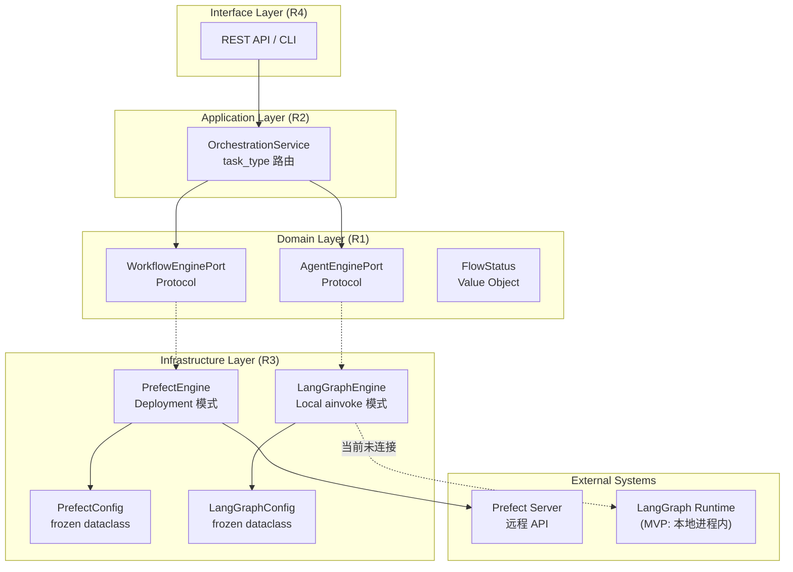
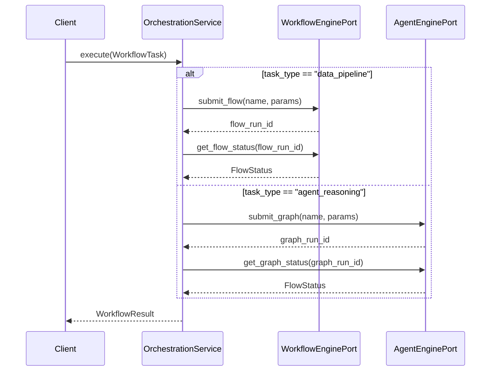
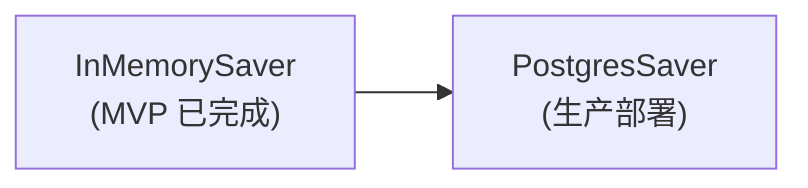
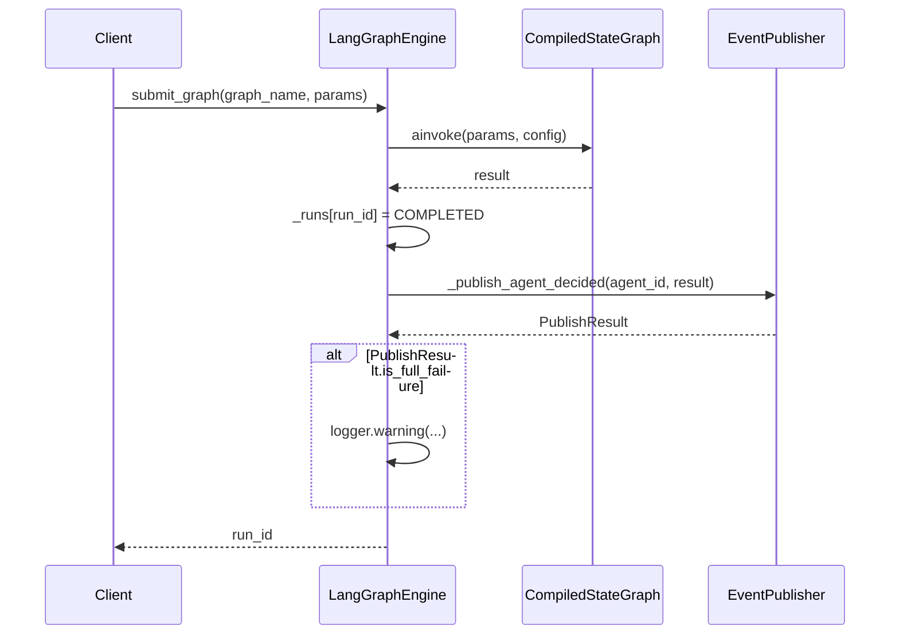
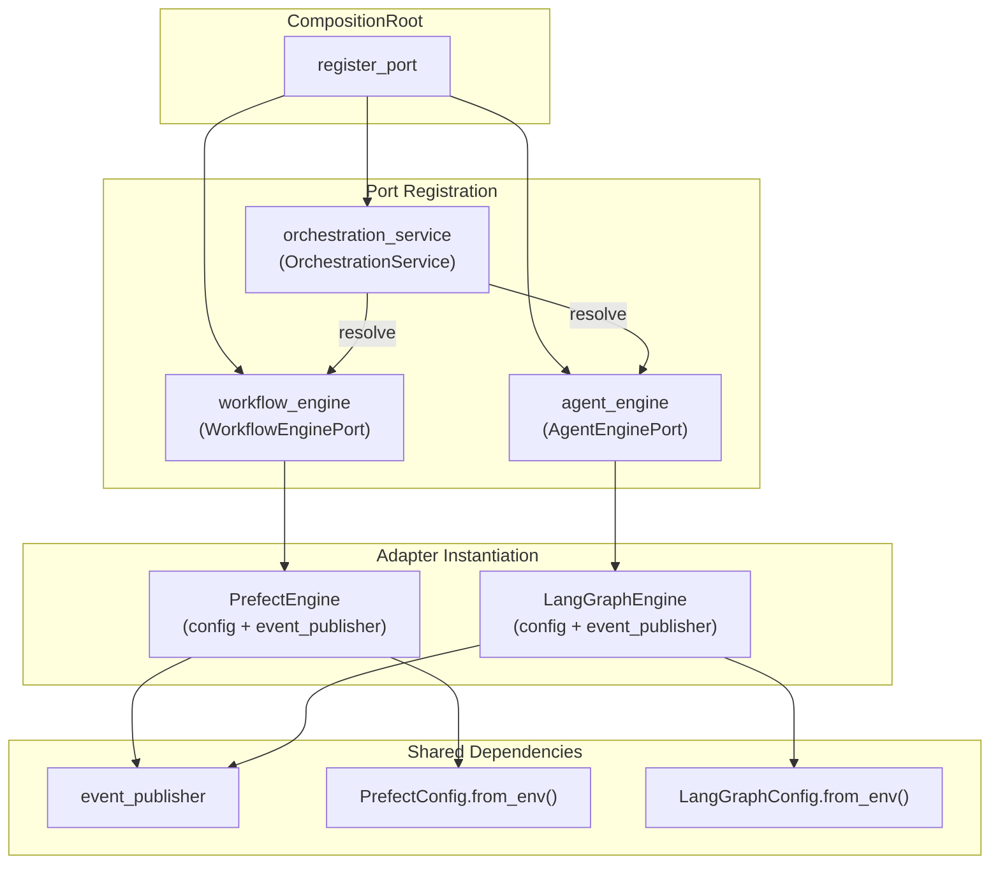
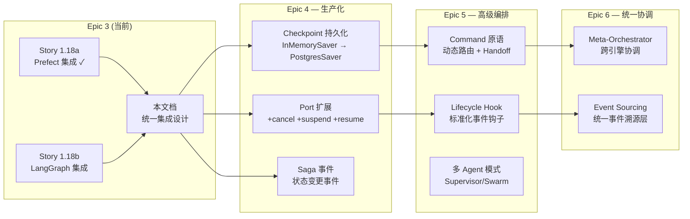

# SISYS 工作流引擎与 Agent 编排统一集成设计

> **版本**: v2.6
> **基于**: ADR-002 双核引擎架构、Story 1.18a/1.18b
> **状态**: Final
> **作者**: agimtech <agimtech@126.com>
> **日期**: 2026-05-23

---

## 目录

1. [统一集成架构概述](#1-统一集成架构概述)
2. [统一编排端口设计](#2-统一编排端口设计)
3. [统一生命周期管理](#3-统一生命周期管理)
4. [基础设施适配器集成模式](#4-基础设施适配器集成模式)
5. [事件发布集成](#5-事件发布集成)
6. [DI 注册与组合根](#6-di-注册与组合根)
7. [测试体系设计](#7-测试体系设计)
8. [扩展路线图](#8-扩展路线图)

---

## 1. 统一集成架构概述

### 1.1 双核引擎协调架构

SISYS 采用 ADR-002 定义的双核引擎架构：**Prefect（确定性数据管道）** 与 **LangGraph（认知推理）** 通过六边形架构的端口-适配器模式完全解耦，由应用层 OrchestrationService 统一路由。Interface 层（R4）端点尚未实现，当前通过 CompositionRoot DI 直接调用。



> 注：Interface Layer (R4) 为设计目标，当前 API → OS 调用链路尚未实现。实际调用通过 CompositionRoot DI 直接获取 OrchestrationService 实例。

### 1.2 集成点概览

| 集成点 | 参与组件 | 通信方式 | 数据流方向 |
|--------|---------|---------|-----------|
| 任务提交 | OrchestrationService → Engine Port → Adapter | 同步调用 | 下行 |
| 状态查询 | OrchestrationService → Engine Port → Adapter | 同步调用 | 上行 |
| 事件发布 | Adapter → EventPublisher → EventBus | 异步发布 | 上行 |
| 事件消费 | EventSubscriber → AutoTriggerHandler → AutoRouted | 异步消费 | 下行 |
| DI 注入 | CompositionRoot → Adapter 构造函数 | 启动时装配 | 横切 |

### 1.3 与 ADR-002 的对齐

ADR-002 定义了双核引擎的职责边界：

| 维度 | Prefect（数据管道） | LangGraph（认知推理） |
|------|--------------------|-----------------------|
| **确定性** | 高 — DAG 预定义 | 低 — Agent 动态决策 |
| **执行模式** | Deployment 远程提交 | Local ainvoke 阻塞 |
| **状态持久化** | Prefect Server 托管 | InMemorySaver (MVP) → PostgresSaver (Epic 4) |
| **适用场景** | 文档处理、ETL、定时任务 | UDMR 路由、多 Agent 协作 |
| **事件发布** | Flow 内部发布 | Engine 层发布 |

---

## 2. 统一编排端口设计

### 2.1 R1-R4 规则映射

六边形架构的四个层域规则在双引擎集成中的具体体现：

| 层域 | 规则 | 双引擎实现 |
|------|------|-----------|
| **R1 — Domain** | 零外部依赖，仅用 Python 标准库 | `WorkflowEnginePort`、`AgentEnginePort` 均为 Protocol，仅依赖 `FlowStatus` 值对象 |
| **R2 — Application** | 组合领域服务，不包含业务逻辑 | `OrchestrationService` 根据 `task_type` 路由，不关心引擎内部实现 |
| **R3 — Infrastructure** | 实现 Domain Port，封装外部 SDK | `PrefectEngine` 封装 Prefect SDK，`LangGraphEngine` 封装 LangGraph SDK |
| **R4 — Interface** | 适配外部输入协议 | REST API / CLI 入口设计已规划，当前仅 CompositionRoot 注册；Interface 层端点尚未实现 |

### 2.2 WorkflowEnginePort 设计

当前实现（`src/domain/ports/workflow_engine.py`）：

```python
@runtime_checkable
class WorkflowEnginePort(Protocol):
    async def submit_flow(self, flow_name: str, parameters: dict[str, Any]) -> str: ...
    async def get_flow_status(self, flow_run_id: str) -> FlowStatus: ...
```

**设计决策：当前仅保留 submit/get_status，不预添加 cancel/signal/query**。

理由：
- YAGNI 原则 — 当前无取消/信号的业务需求
- Protocol 扩展是向后兼容的（新增方法不破坏已有实现）
- 与业界对标发现的差距记入扩展路线图，按需演进

### 2.3 AgentEnginePort 设计

当前实现（`src/domain/ports/agent_engine.py`）：

```python
@runtime_checkable
class AgentEnginePort(Protocol):
    async def submit_graph(self, graph_name: str, parameters: dict[str, Any]) -> str: ...
    async def get_graph_status(self, graph_run_id: str) -> FlowStatus: ...
```

**设计决策：AgentEnginePort 与 WorkflowEnginePort 保持对称接口设计**。

理由：
- OrchestrationService 的路由逻辑可统一处理（通过 `task_type` 区分）
- 两个端口的命名差异（`submit_flow` vs `submit_graph`）反映了领域语义的不同
- `FlowStatus` 作为共享值对象，统一了两个引擎的状态模型

### 2.4 OrchestrationService 编排逻辑

OrchestrationService（`src/application/services/orchestration_service.py`）是应用层组合服务：

- **非 Domain Port（R1）** — 它组合两个端口，本身不是端口
- **非 Infrastructure Adapter（R3）** — 它不封装外部 SDK
- **角色** — R2 层的路由协调器，根据 `task_type: Literal["data_pipeline", "agent_reasoning"]` 分派到对应引擎



**执行模式说明**：时序图展示的是"submit-then-query"单次查询模式。两个分支均在 `submit` 后立即调用一次 `get_status` 并返回结果，不进行轮询或等待。对于需要阻塞等待完成的场景（如 LangGraph 的 `ainvoke`），引擎内部实现阻塞逻辑，应用层感知的是同步调用完成。

**参数提取说明**：`agent_reasoning` 分支在调用 `submit_graph` 前，先从 `task.parameters` 中提取 `graph_name`（`graph_name = task.parameters.get("graph_name")`），时序图省略了此步骤以聚焦核心交互。

---

## 3. 统一生命周期管理

### 3.1 FlowStatus 统一状态模型

`FlowStatus`（`src/domain/value_objects/flow_status.py`）是跨引擎共享的状态枚举：

```
PENDING ──→ RUNNING ──→ COMPLETED
   │           │
   │           └──→ FAILED
   │                   ↑
   └──→ RETRYING ──────┘
```

| 状态 | Prefect 映射 | LangGraph 映射 | 含义 |
|------|-------------|----------------|------|
| `PENDING` | SCHEDULED, PENDING | —（MVP 阻塞执行，无中间状态） | 等待执行 |
| `RUNNING` | RUNNING | —（MVP 阻塞执行，无中间状态） | 正在执行 |
| `COMPLETED` | COMPLETED | `_runs[run_id] = COMPLETED` | 执行成功 |
| `FAILED` | FAILED（重试耗尽）, CANCELLED, CRASHED, CANCELLING, PAUSED | `_runs[run_id] = FAILED` | 执行失败 |
| `RETRYING` | FAILED（重试未耗尽） | 不适用（MVP 无重试） | 重试中 |

> 注：LangGraph MVP 采用阻塞式 `ainvoke`，状态直接从"不存在"跳到 COMPLETED 或 FAILED，不经过 PENDING/RUNNING 中间状态。`get_graph_status` 对未找到的 run_id 默认返回 FAILED。

### 3.2 超时重试策略

两个引擎的超时重试配置呈对称设计：

| 参数 | PrefectConfig | LangGraphConfig | 差异说明 |
|------|--------------|-----------------|---------|
| API 地址 | `api_url` (`http://localhost:4200/api`) | `api_url` (`http://localhost:8000`) | Prefect 含 `/api` 路径；LangGraph 当前 MVP 未使用此字段 |
| 工作池 | `work_pool_name` (`sisys-worker-pool`) | — | Prefect 特有 |
| Checkpoint 表 | — | `checkpoint_table` (`langgraph_checkpoints`) | LangGraph 特有 |
| 最大重试次数 | `retry_max_attempts: 3` | `retry_max_attempts: 3` | 相同 |
| 重试间隔 | `retry_delay_seconds: 30` | `retry_delay_seconds: 30` | 相同 |
| 任务超时 | `task_timeout_seconds: 300` | `task_timeout_seconds: 300` | 相同 |
| 流程超时 | `flow_timeout_seconds: 3600` | `graph_timeout_seconds: 1800` | Agent 推理时间窗口更短 |

### 3.3 Checkpoint 差异分析

LangGraph 的 Checkpoint 机制是双引擎中唯一的持久化差异点。两个引擎在状态持久化上存在本质语义差异，需要精确理解后才能做出架构决策。

#### 3.3.1 双引擎状态持久化语义对比

| 维度 | Prefect | LangGraph |
|------|---------|-----------|
| **持久化对象** | Task/Flow 返回值（结果数据） | 完整图状态（所有 Channel 快照） |
| **持久化粒度** | 按 Task/Flow | 按 Super-step（执行周期边界） |
| **管理方** | Prefect Server（外部托管） | 应用层（内部通过 Checkpointer） |
| **恢复模型** | Server 驱动（自动重试/恢复） | 手动恢复（使用相同 thread_id 重新 invoke） |
| **核心能力** | 结果缓存、事务性写入 | Human-in-the-loop、时间旅行调试、容错、多轮记忆 |
| **配置方式** | `persist_result=True` + `result_storage` | Checkpointer 注入（InMemory/Sqlite/Postgres） |

**Prefect 的状态管理机制**：

Prefect 通过 Server 托管完整的执行生命周期（Flow Run、Task Run、状态机、重试策略），应用层不参与执行状态管理。Prefect 的 `persist_result` 机制保存的是 Task/Flow 的**返回值**（非执行状态），用于结果缓存和下游任务事务性消费：

```python
# Prefect 结果持久化 — 保存的是返回值，不是执行状态
@flow(persist_result=True, result_storage="s3/my-bucket/results")
async def my_flow():
    result = await my_task()  # result 被持久化到 S3
    return result
```

Prefect Server 自身维护 Flow Run/Task Run 的完整状态历史（包括 PENDING → RUNNING → COMPLETED/FAILED 的全部转换），应用层通过 `get_client().read_flow_run()` 查询，无需自行持久化。

**LangGraph 的 Checkpoint 机制**：

LangGraph 在每个 Super-step 边界自动保存完整图状态快照（StateSnapshot），包含 `values`（所有 Channel 当前值）、`next`（待执行节点）、`config`、`metadata`、`parent_config`、`tasks` 等信息：

```python
# LangGraph Checkpoint — 保存的是完整图状态快照
StateSnapshot = {
    "values": {"messages": [...], "context": "..."},  # 所有 Channel 当前值
    "next": ["synthesize"],                           # 待执行节点
    "config": {"configurable": {"thread_id": "..."}},
    "metadata": {"source": "loop", "step": 3},
    "parent_config": {...},                           # 上一快照（时间旅行）
    "tasks": [...]                                    # 当前步骤的任务列表
}
```

LangGraph 提供三种持久化等级（Durable Execution 模式）：

| 模式 | 行为 | 适用场景 |
|------|------|---------|
| `exit` | 仅在节点退出时持久化 | 高吞吐、可接受少量状态丢失 |
| `async` | 异步持久化，不阻塞下一步 | 平衡吞吐与可靠性 |
| `sync` | 同步持久化后才开始下一步 | 最高可靠性，生产推荐 |

#### 3.3.2 Checkpoint vs Durable Execution 的本质区别

根据 Diagrid 的分析（"Checkpoints Are Not Durable Execution"），两者存在根本差异：

| 维度 | Checkpoint（LangGraph 模式） | Durable Execution（Temporal/Prefect 模式） |
|------|---------------------------|-------------------------------------------|
| **恢复责任** | 开发者负责检测故障、触发恢复、防止重复执行 | 引擎负责自动恢复，开发者无需干预 |
| **故障语义** | "我保存了你的状态，你自己接着来" | "你的工作流会运行到完成，我处理一切" |
| **重试模型** | 不提供内置重试，需要应用层实现 | 内置可配置重试策略（指数退避、最大次数） |
| **适用场景** | 需要人工审批、状态回溯、多轮对话 | 需要长时间运行、自动容错、跨服务编排 |

这意味着 LangGraph 的 Checkpoint **在生产环境中需要应用层配合**：开发者必须检测 Agent 执行失败、使用相同 thread_id 触发恢复、并处理幂等性问题。这一事实影响了下面的设计决策。

#### 3.3.3 三个核心断言的验证

基于业界调研（Diagrid、LangGraph Persistence Docs、Prefect Results Docs、Medium 对比分析），对设计文档中的三个断言进行验证：

**断言 1：Prefect 的状态由 Prefect Server 托管，不存在应用层 Checkpoint 需求**

> **结论：基本正确**。Prefect Server 托管完整的执行状态生命周期，`persist_result` 保存的是返回值而非执行状态。应用层通过 API 查询即可，无需自行管理 Checkpoint。
>
> **补充**：Prefect 的 `result_storage`（local/S3/GCS/Azure Blob）和 `result_serializer`（pickle/json）是结果缓存机制，其语义与 LangGraph Checkpoint 不同——后者保存的是执行中的完整图状态，而 Prefect 保存的是已完成步骤的输出值。

**断言 2：LangGraph 的 Checkpoint 是 SDK 内部概念，不是领域关注点**

> **结论：MVP 阶段成立，生产化阶段需要修正**。`BaseCheckpointSaver` 接口（`put`/`get_tuple`/`list`）确实是 LangGraph SDK 内部接口，不属于 SISYS 领域层。
>
> **但是**，Checkpoint 所支撑的能力——Human-in-the-loop（人工审批）、时间旅行调试（状态回溯）、容错恢复（故障后用相同 thread_id 恢复）——**是领域关注点**。当系统演进到需要这些能力时（例如 UDMR 路由失败后恢复推理上下文），Agent 的执行状态恢复就成为了领域需求，需要在 `AgentEnginePort` 层面体现。

**断言 3：两者语义不同，强行统一会引入不必要的抽象**

> **结论：当前阶段正确**。两个引擎的状态持久化在持久化对象、粒度、管理方、恢复模型上存在本质差异（见 3.3.1 对比表），强行抽象为统一 Checkpoint 端口会掩盖这些差异。
>
> **演进预判**：随着系统演进，可能出现需要跨引擎状态可见性的场景（如 Prefect 管道输出触发 Agent 推理，Agent 推理结果回写管道状态）。此时不需要统一 Checkpoint 端口，而是通过**领域事件**（已在事件总线中实现）实现状态传递，保持引擎间的解耦。

#### 3.3.4 LangGraph Checkpoint 演进路径

> **基础设施就绪**：系统已部署 PostgreSQL（Docker Compose），DI 容器中注册了 `PostgreSQLManager` 单例，`LangGraphConfig.checkpoint_table` 已预留表名 `langgraph_checkpoints`。因此可跳过 SqliteSaver 中间阶段，直接升级为 PostgresSaver。



| 阶段 | Checkpointer | 适用场景 | 状态 |
|------|-------------|---------|------|
| **MVP** | `InMemorySaver` | 快速原型验证 | ✅ 已完成 |
| **生产部署** | `PostgresSaver` | 可靠持久化 + 崩溃恢复 | Epic 4 目标 |

迁移实施要点：
1. 添加 `langgraph-checkpoint-postgres` 依赖到 `pyproject.toml`
2. `LangGraphEngine.__init__` 接受可选 `checkpointer` 参数（从 DI 容器注入 `PostgreSQLManager` 的 `AsyncEngine`）
3. 利用 `AsyncPostgresSaver.from_async_engine()` 复用已有连接池，传入 `LangGraphConfig.checkpoint_table` 作为表名
4. 迁移仅修改基础设施层，无需改动端口层（`AgentEnginePort`）

#### 3.3.5 设计决策：当前不引入统一 Checkpoint 端口

基于以上分析，当前阶段（Epic 3 MVP）维持"不引入统一 Checkpoint 端口"的决策，但明确演进触发条件：

| 条件 | 触发动作 |
|------|---------|
| Agent 需要跨请求恢复推理上下文 | 升级为 `PostgresSaver`，仍无需统一端口 |
| Agent 需要 Human-in-the-loop | `AgentEnginePort` 扩展 `wait_for_approval` 方法 |
| 需要跨引擎状态可见性 | 通过领域事件传递，非 Checkpoint 统一 |
| 需要统一的故障恢复策略 | 引入 `RecoveryPort`（非 Checkpoint 端口） |

**参考来源**：
- Diagrid: "Checkpoints Are Not Durable Execution" — Checkpoint 与 Durable Execution 的本质区别
- LangGraph Persistence Docs — StateSnapshot、BaseCheckpointSaver 接口、Durable Execution 模式
- LangGraph Durable Execution Docs — exit/async/sync 三种持久化等级
- Prefect v3 Results Docs — persist_result、result_storage、result_serializer 机制

---

## 4. 基础设施适配器集成模式

### 4.1 适配器共性模式

两个引擎适配器遵循相同的构造模式：

| 模式 | PrefectEngine | LangGraphEngine |
|------|--------------|-----------------|
| **构造参数** | `config + event_publisher` | `config + event_publisher` |
| **Config 类型** | `PrefectConfig.from_env()` | `LangGraphConfig.from_env()` |
| **Config 模式** | `frozen dataclass + from_env()` | `frozen dataclass + from_env()` |
| **运行时存储** | Prefect Server 托管 | `self._runs: dict[str, FlowStatus]` |
| **UUID 生成** | Prefect API 返回 | `uuid.uuid4()` |
| **异常策略** | ValueError 直传 + RuntimeError 包装 | ValueError 直传 + RuntimeError 包装 |

### 4.2 PrefectEngine 适配器

关键设计点：

1. **Deployment 远程提交模式** — 通过 `get_client()` 调用 Prefect API，避免进程内 Flow 耦合
2. **9→5 状态映射** — Prefect 的 9 种 StateType 映射为 5 种 FlowStatus（`_map_state_type`）
3. **重试感知** — 通过 `run_count < max_retries` 区分 FAILED 和 RETRYING
4. **事件发布责任** — Engine 层发布 `WorkflowSubmitted` 领域事件，通过 `_publish_workflow_submitted()` 方法（Story 90-8 更新）

```
PrefectEngine
├── submit_flow()                → get_client() → read_deployment_by_name() → create_flow_run_from_deployment() → _publish_workflow_submitted()
├── get_flow_status()            → get_client() → read_flow_run() → _map_state_type()
├── _map_state_type()            → StateType → FlowStatus 映射
└── _publish_workflow_submitted() → WorkflowSubmitted event → event_publisher.publish()
```

### 4.3 LangGraphEngine 适配器

关键设计点：

1. **Local ainvoke 阻塞模式** — MVP 阶段使用 `ainvoke()` 同步等待完成，非异步流式
2. **进程内状态字典** — `self._runs` 维护运行状态，进程重启后丢失
3. **InMemorySaver Checkpoint** — 支持时间旅行调试（开发阶段）
4. **事件发布责任** — Engine 层发布 `AgentDecided` 领域事件，通过 `_publish_agent_decided()` 方法

```
LangGraphEngine
├── submit_graph()          → _build_graph() → ainvoke() → _publish_agent_decided()
├── get_graph_status()      → self._runs.get()
├── _build_graph()          → StateGraph() → build_basic_agent_graph() → compile(checkpointer)
└── _publish_agent_decided() → AgentDecided event → event_publisher.publish()
```

### 4.4 配置对称性

两个 Config 遵循相同的 frozen dataclass + from_env() 模式：

```python
# 对称模式
@dataclass(frozen=True)
class XxxConfig:
    api_url: str
    retry_max_attempts: int
    # ...

    @classmethod
    def from_env(cls) -> XxxConfig:
        # 从环境变量读取，空字符串用默认值
        ...
```

| 环境变量前缀 | PrefectConfig | LangGraphConfig |
|-------------|--------------|-----------------|
| API URL | `PREFECT_API_URL` | `LANGGRAPH_API_URL` |
| 最大重试 | `PREFECT_RETRY_MAX_ATTEMPTS` | `LANGGRAPH_RETRY_MAX_ATTEMPTS` |
| 重试间隔 | `PREFECT_RETRY_DELAY_SECONDS` | `LANGGRAPH_RETRY_DELAY_SECONDS` |
| 任务超时 | `PREFECT_TASK_TIMEOUT_SECONDS` | `LANGGRAPH_TASK_TIMEOUT_SECONDS` |
| 流程超时 | `PREFECT_FLOW_TIMEOUT_SECONDS` | `LANGGRAPH_GRAPH_TIMEOUT_SECONDS` |
| 特有字段 | `PREFECT_WORK_POOL_NAME` (工作池名称) | `LANGGRAPH_CHECKPOINT_TABLE` (Checkpoint 表名) |

---

## 5. 事件发布集成

### 5.1 双通道事件发布策略差异

两个引擎的事件发布策略遵循对称模式（Story 90-8 统一）：

| 维度 | Prefect | LangGraph |
|------|---------|-----------|
| **发布位置** | Engine 层（适配器） | Engine 层（适配器） |
| **发布时机** | 工作流提交成功后 | 状态图执行完成后 |
| **事件类型** | 工作流提交事件（WorkflowSubmitted） | Agent 决策事件（AgentDecided） |
| **通道选择** | 由 Engine 决定（RELIABLE） | 由 Engine 决定（RELIABLE） |
| **失败策略** | Engine 捕获异常，记录日志不影响返回值 | Engine 捕获异常，记录日志不回写 FAILED |

### 5.2 LangGraph 事件发布流程

LangGraphEngine 在 `submit_graph` 中完成事件发布：



### 5.3 PublishResult 检查

双引擎的事件发布均遵循相同的 PublishResult 检查模式（Story 90-8 统一）：

```python
publish_result = await self._event_publisher.publish(event)
if publish_result is None:
    logger.warning("事件发布返回 None")
elif publish_result.is_full_failure:
    logger.warning("事件发布全部失败: %s", publish_result)
```

**PrefectEngine** 发布 `WorkflowSubmitted` 事件，包含 `flow_run_id`、`flow_name`、`parameters` 字段。
**LangGraphEngine** 发布 `AgentDecided` 事件，包含 `agent_id`、`decision_result`、`confidence` 字段。

**设计决策：事件发布失败不回写引擎执行状态**。

理由：
- 事件发布是副作用，不应影响主流程的成功/失败判定
- 双通道事件总线（REALTIME + RELIABLE）提供冗余保障
- RELIABLE 通道的 Outbox 模式确保最终一致性

### 5.4 与事件总线的集成

| 事件总线组件 | 实现类 | 与双引擎的集成点 |
|------------|--------|----------------|
| `DualChannelEventBus` | `DualChannelEventBus` | PrefectEngine / LangGraphEngine 通过构造函数注入 EventPublisher |
| `REALTIME 通道 (Redis)` | `RedisEventBus` | 适合 Agent 推理结果的实时通知 |
| `RELIABLE 通道 (RabbitMQ + Outbox)` | `RabbitMQEventBus` | 适合文档处理等需要持久化的业务事件 |
| `AsyncOutboxPoller` | `AsyncOutboxPoller`（`outbox_processor.py`） | 确保 RELIABLE 通道事件的最终投递 |
| `DeadLetterQueue` | `PostgresDeadLetterQueue` | 捕获多次投递失败的事件 |

### 5.5 Saga 事件集成方案

当前 SagaOrchestrator 执行步骤和补偿时不通过事件总线发布状态变更事件。

**当前实现**：代码中已定义 `SagaStatusChanged` 领域事件（`src/domain/events/saga_events.py`），包含 `old_status`/`new_status`/`step_index` 等字段，但 SagaOrchestrator 尚未调用事件发布。

**演进路线**：

1. **短期**：在 SagaOrchestrator 的关键状态变更点利用已有的 `SagaStatusChanged` 事件进行发布
2. **通道选择**：所有 Saga 事件走 RELIABLE 通道，确保可靠传递
3. **消费者**：AutoTriggerHandler 可订阅 Saga 事件触发后续流程

---

## 6. DI 注册与组合根

### 6.1 双引擎注册模式

CompositionRoot（`src/composition_root.py`）中双引擎的 DI 注册呈对称结构：

```python
# Workflow Engine — Prefect
register_port(
    name="workflow_engine",
    interface=WorkflowEnginePort,
    impl=lambda resolver: PrefectEngine(
        PrefectConfig.from_env(),
        resolver.resolve("event_publisher"),
    ),
    lifetime=Lifetime.SINGLETON,
)

# Agent Engine — LangGraph
register_port(
    name="agent_engine",
    interface=AgentEnginePort,
    impl=lambda resolver: LangGraphEngine(
        LangGraphConfig.from_env(),
        resolver.resolve("event_publisher"),
    ),
    lifetime=Lifetime.SINGLETON,
)
```

### 6.2 DI 装配图



### 6.3 注册模式要点

| 要点 | 说明 |
|------|------|
| **Lifetime** | 双引擎均为 SINGLETON — 无状态适配器可安全共享 |
| **Config 注入** | `from_env()` 在 lambda 工厂内调用 — 延迟求值，支持运行时环境变量 |
| **共享依赖** | `event_publisher` 通过 `resolver.resolve()` 注入 — 同一实例 |
| **OrchestrationService** | 通过 `register_port` 注册，`interface` 绑定自身类型，依赖两个引擎端口 |
| **工厂模式** | lambda 工厂模式 — 简洁且与 CompositionRoot 风格一致 |

---

## 7. 测试体系设计

### 7.1 契约测试

验证适配器是否满足 Port Protocol 的行为契约：

| 测试目标 | 测试内容 | 涉及文件 |
|---------|---------|---------|
| `PrefectEngine` Protocol 契约 | `submit_flow` 返回 UUID 字符串，`get_flow_status` 返回 FlowStatus | `tests/unit/infrastructure/workflow/test_prefect_engine.py` |
| `LangGraphEngine` Protocol 契约 | `submit_graph` 返回 UUID 字符串，`get_graph_status` 返回 FlowStatus | `tests/unit/infrastructure/agent_orch/test_langgraph_engine.py` |
| `OrchestrationService` 路由 | `data_pipeline` 路由到 workflow_engine，`agent_reasoning` 路由到 agent_engine | `tests/unit/application/services/test_orchestration_service.py` |

### 7.2 架构测试

验证六边形架构约束不被违反：

| 测试规则 | 验证方式 |
|---------|---------|
| Domain 层零外部依赖 | `Protocol` 仅使用标准库类型 |
| Infrastructure 层隔离 | Prefect/LangGraph SDK 导入仅在适配器模块内 |
| Port 的 runtime_checkable | `isinstance(instance, Protocol)` 可通过 |

### 7.3 集成测试

验证引擎与外部系统的端到端集成：

| 测试场景 | 前置条件 | 验证点 |
|---------|---------|--------|
| Prefect 工作流提交-查询 | Prefect Server 运行 | submit → get_status 返回正确 FlowStatus |
| LangGraph 状态图执行 | LangGraph 运行 | submit → get_status 返回 COMPLETED |
| 事件发布集成 | EventBus 运行 | Engine 发布的事件通过 EventBus 可达 |
| DI 装配验证 | CompositionRoot 完整 | resolve 得到正确类型的实例 |

### 7.4 测试隔离策略

#### 7.4.1 单元测试

| 组件 | Mock 策略 | 真实对象 | 说明 |
|------|---------|---------|------|
| PrefectEngine | Mock `get_client`（Prefect SDK 客户端） | `PrefectConfig`、`PrefectEngine` 实例 | 隔离 Prefect Server 依赖，验证状态映射和输入校验 |
| LangGraphEngine | Mock `_build_graph` 方法 | `LangGraphConfig`、`LangGraphEngine` 实例 | 隔离 StateGraph 构建和 ainvoke，验证状态管理和事件发布 |
| EventPublisher | AsyncMock | — | 验证 publish 调用参数和 PublishResult 处理逻辑 |

#### 7.4.2 集成测试

**当前状态**：

| 组件 | Mock 策略 | 真实对象 | 与真实服务差距 |
|------|---------|---------|---------------|
| PrefectEngine + OrchestrationService | Mock `get_client` | `PrefectEngine`、`OrchestrationService` 实例 | 未连接真实 Prefect Server |
| LangGraphEngine + OrchestrationService | Mock `event_publisher` | `LangGraphEngine`、`OrchestrationService`、真实 `_build_graph()` + StateGraph 编译执行 | LangGraph 本身为进程内执行，无外部服务依赖 |
| EventBus | Mock `RedisEventBus`、`RabbitMQEventBus` | `ChannelRouter` | 未连接真实 Redis/RabbitMQ |

**改进方向**：集成测试应尽力使用真实服务。参照 `tests/integration/test_integration_redis_real.py` 标杆模式（真实连接 + 唯一前缀隔离 + 完整清理），逐步补充：

| 组件 | 改进动作 | 优先级 |
|------|---------|--------|
| EventBus | 补充真实 Redis/RabbitMQ 连接测试 | P1 — 已有 `test_integration_redis_real.py` 标杆可复用 |
| PrefectEngine | 补充真实 Prefect Server 连接测试（需 Prefect Server CI 环境） | P2 — 依赖基础设施就绪 |

#### 7.4.3 验收测试

验收测试**禁止 mock/fake**，必须使用真实服务。

**当前状态**：

| 测试文件 | 真实对象 | pass 步骤（待补充） |
|---------|---------|-------------------|
| `test_acceptance_prefect_workflow_integration.py` | 真实 DI 容器、`PrefectConfig.from_env()`、Protocol 验证、YAML 配置验证 | 4个关键业务步骤标注 "需真实 Prefect server" |
| `test_acceptance_langgraph_agent_orchestration.py` | 真实 DI 容器、`LangGraphConfig.from_env()`、真实 StateGraph 编译执行、InMemorySaver | 6个步骤委托给单元/架构测试 |

**改进方向**：Prefect 验收测试的 pass 步骤需在 Prefect Server CI 环境就绪后补充真实服务调用验证。

---

## 8. 扩展路线图

### 8.1 业界对标差距总结

基于对 Temporal、Elsa、LangGraph、AWS Prescriptive Guidance 的调研，识别出以下差距：

| 优先级 | 差距 | 现状 | 目标 | 参考 |
|--------|------|------|------|------|
| **P1** | LangGraph Checkpoint 持久化 | InMemorySaver（MVP 已完成） | PostgresSaver（复用已有 PostgreSQLManager） | LangGraph Persistence Docs |
| **P2** | Saga 事件集成 | SagaStatusChanged 已定义但未发布 | SagaOrchestrator 调用事件发布 | Temporal Saga |
| **P3** | WorkflowEnginePort 接口扩展 | submit + get_status | +cancel +suspend +resume | Temporal/Elsa 抽象层 |
| **P4** | 工作流状态变更 Hook | 无标准通知机制 | WorkflowLifecycleHook Protocol | Elsa 事件钩子 |
| **P5** | LangGraph Command 原语 | 静态 StateGraph（版本已就绪） | 动态路由 + Agent Handoff | LangGraph v1.0 Command |
| **P6** | 多引擎 Meta-Orchestrator | 双引擎独立运行（OrchestrationService 已路由） | 统一协调层（仅在跨引擎事务需求时引入） | Bernd Ruecker 多引擎模式 |

### 8.2 Epic 级演进计划



### 8.3 关键演进决策

| 决策点 | 当前选择 | 演进方向 | 切换条件 |
|--------|---------|---------|---------|
| LangGraph 执行模式 | Local ainvoke（阻塞） | Remote API（异步） | 需要水平扩展 Agent 推理 |
| Checkpoint 存储 | InMemorySaver | PostgresSaver（利用已有 PostgreSQLManager） | 需要持久化 Agent 状态 |
| WorkflowEnginePort 方法数 | 2（submit + get_status） | 5+（+cancel/suspend/resume/list） | 出现工作流取消/暂停需求 |
| Agent 编排模式 | 单 Agent 线性图 | 多 Agent Supervisor/Swarm | 需要 Agent 间协作 |
| 事件发布策略 | 双引擎各自发布 | 统一 Lifecycle Hook | 需要标准化的状态变更通知 |

### 8.4 业界参考来源

| 参考系统 | 核心借鉴 | 应用场景 |
|---------|---------|---------|
| **Temporal** | Event Sourcing 持久化、Saga 补偿、确定性执行 | Checkpoint 演进、Saga 增强 |
| **Elsa Workflows 3** | Bookmark 暂停/恢复、可插拔持久化 | Port 扩展设计 |
| **LangGraph v1.0** | Command 原语、多 Agent 模式、PostgresSaver | Agent 编排演进 |
| **AWS Prescriptive Guidance** | 六边形架构三层次、Port 入站/出站分类 | 架构合规验证 |
| **Bernd Ruecker** | 嵌入式→远程引擎演进路径、多引擎协调模式 | 执行模式切换策略 |

---

## 附录

### A. 关键文件索引

| 文件路径 | 行号 | 说明 |
|---------|------|------|
| `src/domain/ports/workflow_engine.py` | 21-49 | WorkflowEnginePort Protocol 定义 |
| `src/domain/ports/agent_engine.py` | 21-49 | AgentEnginePort Protocol 定义 |
| `src/domain/value_objects/flow_status.py` | 18-35 | FlowStatus 统一状态枚举 |
| `src/application/services/orchestration_service.py` | 44-96 | OrchestrationService 路由逻辑 |
| `src/infrastructure/workflow/prefect_engine.py` | 31-129 | PrefectEngine 适配器实现 |
| `src/infrastructure/agent_orch/langgraph_engine.py` | 31-162 | LangGraphEngine 适配器实现 |
| `src/infrastructure/agent_orch/graphs/basic_agent_graph.py` | 23-41 | BasicAgent 状态图构建 |
| `src/infrastructure/config/prefect.py` | 19-55 | PrefectConfig frozen dataclass |
| `src/infrastructure/config/langgraph.py` | 19-60 | LangGraphConfig frozen dataclass |
| `src/composition_root.py` | 978-1031 | 双引擎 DI 注册 |
| `tests/unit/infrastructure/workflow/test_prefect_engine.py` | — | PrefectEngine 契约测试 |
| `tests/unit/infrastructure/agent_orch/test_langgraph_engine.py` | — | LangGraphEngine 契约测试 |
| `tests/unit/application/services/test_orchestration_service.py` | — | OrchestrationService 路由测试 |

### B. 设计文档依赖

| 文档 | 版本 | 与本文关系 |
|------|------|-----------|
| `docs/architecture/architecture.md` | — | ADR-002 双核引擎架构决策 |
| `docs/architecture/sisys-event-bus-design.md` | v1.0 | 事件总线集成参考 |
| `docs/architecture/sisys-auto-invocation-design.md` | v1.0 | 自主调用循环集成参考 |
| `docs/architecture/sisys-transaction-subsystem-design.md` | v1.0 | 事务子系统（Saga/Outbox）参考 |

### C. 修订历史

| 版本 | 日期 | 变更说明 |
|------|------|---------|
| v1.0 | 2026-05-23 | 初始版本，基于 Story 1.18a/1.18b 实现 |
| v1.1 | 2026-05-23 | Section 3.3 Checkpoint 深度分析：基于 Diagrid/LangGraph/Prefect 业界调研，验证三个核心断言，补充语义对比和演进触发条件 |
| v1.2 | 2026-05-23 | Round 1 代码对齐审查：修正时序图 AEP 自调用错误、补全测试文件路径 unit/ 目录、扩展环境变量对比表、澄清 submit-then-query 模式 |
| v1.3 | 2026-05-23 | Round 2 事件系统集成审查：修正 Section 5.3 两引擎声明为仅 LangGraphEngine、补充 Section 5.4 实现类名、修正 Section 1.2 事件消费链路、澄清 Saga 已有 SagaStatusChanged 事件 |
| v1.4 | 2026-05-23 | Round 3 架构合规审查：修正 Section 2.1 R4 描述（Interface 层尚未实现）、补充 Section 1.1 Interface 层状态说明、验证 R1-R3/ADR-002 全部合规 |
| v1.5 | 2026-05-23 | Round 4 Saga/事务子系统审查：修正 Section 5.4 OutboxProcessor→AsyncOutboxPoller、修正 Section 7.4 测试隔离策略（LangGraph Mock 策略和集成测试真实状态） |
| v2.0 | 2026-05-23 | Round 5 交叉一致性最终审查：移除错误的 Section 8 交叉引用、修正 Section 6.3 service 注册描述、修正 Section 8.1 P4 描述、补充架构图设计目标说明 |
| v2.1 | 2026-05-23 | Section 7.4 测试隔离策略全面核实：扩展为三节（单元/集成/验收），明确集成测试改进方向（尽力用真实服务）、验收测试必须用真实服务，补充 EventBus/Prefect 真实测试优先级 |
| v2.2 | 2026-05-23 | Batch2-R1 合理性审查：修正 Section 1.1 架构图 LE→LG 箭头（实线改为虚线+标注"当前未连接"），与 Local ainvoke 进程内执行代码一致 |
| v2.3 | 2026-05-23 | Batch2-R2 正确性审查：Section 3.1 FAILED 行补充 CANCELLING、修正 LangGraph 映射（PENDING/RUNNING 实际不存在）；Section 3.2 补全 api_url 精确值、work_pool_name、checkpoint_table 字段 |
